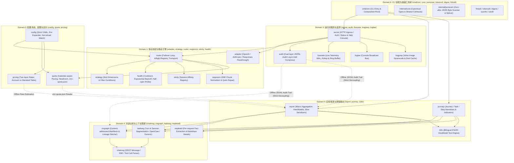
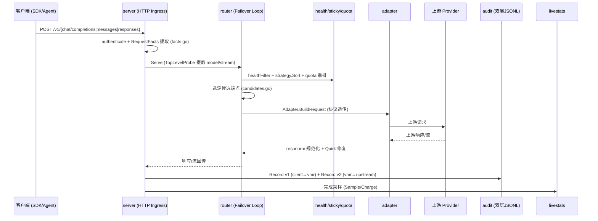
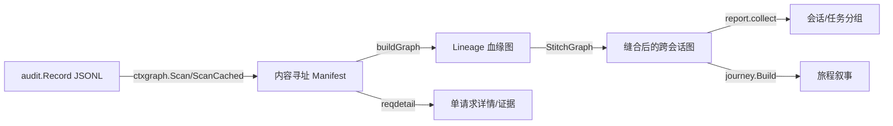
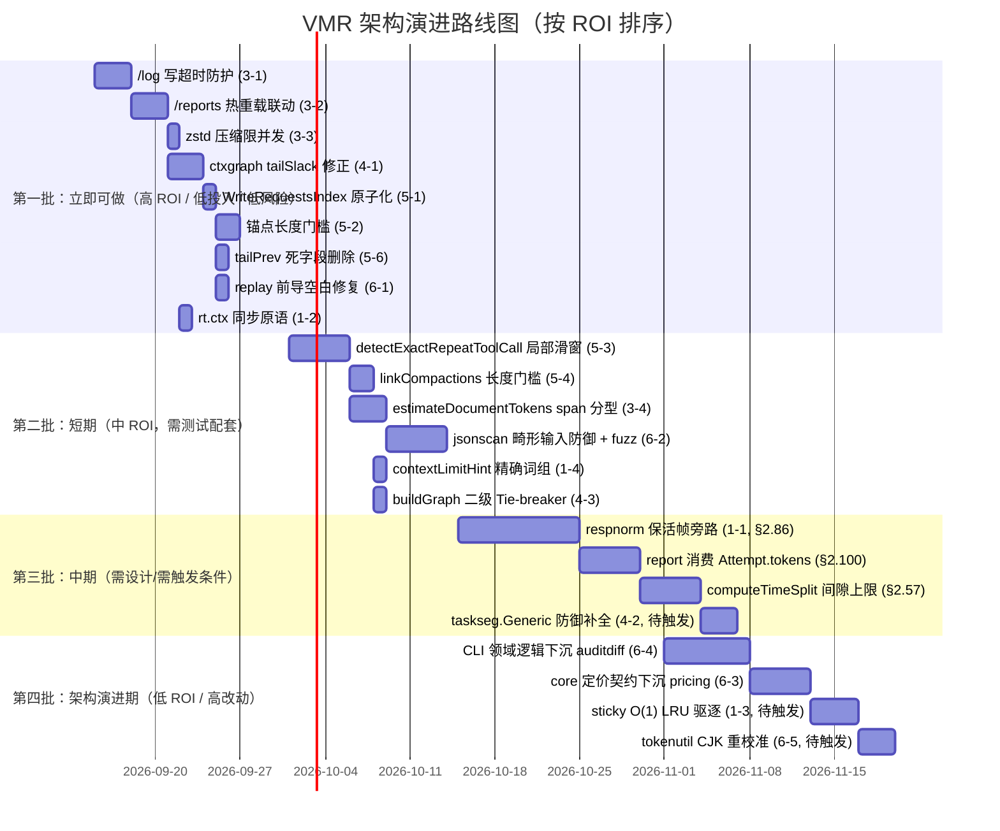

<!-- Ver 2026-09-11, by Agent (pi) -->

# VMR 全系统架构深度审查报告与演进规划

**审查对象**：VMR（Virtual Model Router）全系统生产与业务代码（路由半区 + 分析半区 + CLI/基础设施）  
**审查基线**：`main` @ `6f1ab05`（2026-09-11）  
**审查视角**：资深软件架构师 / 代码审计专家 / 高性能网关与分布式系统专家  
**审查原则**：第一性原理驱动、独立批判性判断、源码级事实支撑、聚焦业务代码（排除测试代码与临时目录）

---

## 审查过程跟踪与执行进度

| 阶段 | 状态 | 负责人 | 推进简述 |
|---|:---:|:---:|---|
| **阶段一：全景调研与领域划分** | **COMPLETED** | 主控 Agent | 完成核心架构通读、设计哲学梳理、6 大领域划分与 Mermaid 架构拓扑映射 |
| **阶段二：分 Domain 深度 Review** | **COMPLETED** | 6 路 Subagent 并行 | 6 个只读子审查员逐域击破，回收 39 项 findings（6 中危 / 0 高危活跃），全部验收四查通过 |
| ├─ Domain 1: 协议适配与路由引擎 | COMPLETED | Subagent-D1 | APPROVE，5 findings（respnorm 保活帧扣留、rt.ctx 竞争、sticky 驱逐等） |
| ├─ Domain 2: 配置、配额流控与定价模型 | COMPLETED | Subagent-D2 | APPROVE，4 findings（expandEnv 逗号注入边界、NaN 防御、缓存未加锁等） |
| ├─ Domain 3: 运行时服务、审计与实时遥测 | COMPLETED | Subagent-D3 | APPROVE，7 findings（/log 写超时缺失、/reports 热重载失联、Zstd 限并发等） |
| ├─ Domain 4: 对话分析、任务切分与上下文图谱 | COMPLETED | Subagent-D4 | APPROVE，7 findings（tailSlack 误判、Generic 潜在缺陷、Tie-breaker 缺失等） |
| ├─ Domain 5: 宏观分析报表、旅程挖掘与展示层 | COMPLETED | Subagent-D5 | REJECT（2 项 high 提示，主控复核后降级），9 findings（非原子落盘、短锚点穿透等） |
| └─ Domain 6: CLI 装配、诊断回放与基础工具库 | COMPLETED | Subagent-D6 | APPROVE，7 findings（jsonscan 畸形输入偏移、replay 前导空白、core 定价漂移等） |
| **阶段三：跨 Domain 链路串联与源码核实** | **COMPLETED** | 主控 Agent | 请求生命周期 / 离线消费 / 配置热重载三条主链路源码级核实，4 处 subagent 结论被校准 |
| **阶段四：顶层架构全景审视** | **COMPLETED** | 主控 Agent | 6 大高阶维度批判性审视完成（见 §4），整体健康度 ★★★★☆ |
| **阶段五：全景总结与架构演进路线图** | **COMPLETED** | 主控 Agent | ROI 排序问题清单（按 Domain 分组）+ Mermaid 四批演进甘特图（见 §5） |

---

# 阶段一：全景调研与领域（Domain）划分

## 1.1 系统核心定位与设计哲学

VMR 是一个用 Go 编写的、本地运行、单二进制的高性能 LLM 路由器与审计分析系统。其系统架构具有极其鲜明的**两大对等半区**与**三大核心不变量**：

1. **两大对等半区，以 JSONL 审计日志作为唯一解耦契约**：
   - **路由上半区（Runtime Engine）**：负责低延迟、零内存放大的流量治理、协议透传、并发控制、会话粘性及额度配速。
   - **分析下半区（Offline Analytics Engine）**：负责在请求生命周期之外，只读消费 JSONL 审计日志，重构宏观报表（Macro Reports）与多轮 Agent 任务叙事流（Task Journeys）。
   - **强隔离边界**：分析半区的所有包（`report`, `journey`, `ctxgraph`, `taskseg`, `chatmsg`, `reqdetail`）绝对不引用路由核心包（`router`, `server`, `config`），由 `archtest` 机制在编译期/测试期机械校验。

2. **三大核心设计不变量**：
   - **Byte-faithful Passthrough（协议高保真透传）**：严禁跨协议转换（OpenAI Chat Completions、Anthropic Messages、OpenAI Responses 三大入口各自封闭，互不翻译，拒绝中间统一 IR）。仅允许 5 类已受控的保真介入（Model 名改写、Role 角色映射、图片下采样、证据导向的上游 Quirk 修复、SSE `[DONE]` 终止符补齐）。
   - **Single Source of Truth (SSOT)**：底层消息与图谱解析由 `chatmsg` 与 `ctxgraph` 作为唯一权威实现；Token 与用量核算尽量在上游盖章，避免下半区多方私自启发式反推。
   - **Zero-allocation / Stream-first Performance**：转发热路径零不必要分配，流式块直接透传并边发边统计；底层字节处理基于 `jsonscan` 进行原地快查与切片拼接。

---

## 1.2 领域划分方案（6 大 Domain）

为全面无死角地覆盖系统中 ~50,000 行核心业务 Go 代码，同时严格满足 Agent Forge 架构的单节点扇出上限（`FANOUT_MAX ≤ 6`），我们将全仓库划分为 6 个内聚、正交且边界清晰的 Domain：



### 领域职责与审阅矩阵

| Domain | 涵盖业务包与核心文件 | 职责定位与核心业务抽象 | 核心审查焦点 |
|---|---|---|---|
| **Domain 1: 协议适配与路由引擎** | `internal/adapter` (`openai`, `anthropic`, `openairesponses`)<br>`internal/strategy`<br>`internal/router`<br>`internal/respnorm`<br>`internal/sticky`<br>`internal/health`<br>`internal/probe` | 协议透传网关、候选端点排序过滤、多路故障转移状态机、In-flight 实时追踪、SSE 流式规范化与 Quirk 修复、主动探针与健康退避 | ① Byte-faithful Passthrough 不变量坚守度<br>② 故障切换（`tryOne`）并发安全、连接泄漏与 Context 取消传播<br>③ `respnorm` 流式状态机与厂商 Quirk 修复风险<br>④ 探针与半开（Half-open）状态震荡与自愈机制 |
| **Domain 2: 配置系统、配额流控与定价模型** | `internal/config`<br>`internal/quota`<br>`internal/pricing` | Strict YAML 加载校验、环境变量展开、热重载观测、日历感知配额限流与 Headroom 评分、双层费率解析（账号覆盖 vs 标准表） | ① 配置热重载的原子切换与并发安全<br>② Quota 计数器高频并发下的锁竞争与文件原子写入<br>③ unknown vs free 费率的清晰语义区分<br>④ 配额 Headroom 评分与策略排名的耦合合理性 |
| **Domain 3: 运行时服务、审计管道与实时遥测** | `internal/server`<br>`internal/audit`<br>`internal/livestats`<br>`internal/imgprep`<br>`internal/logtee`<br>`internal/dashboard` | HTTP Ingress 服务生命周期、未鉴权 `/health` 与受限控制台接口隔离、双层 JSONL 审计写入与压缩保留、实时统计 WAL 与滑动窗口聚合、图片下采样缓存 | ① HTTP 连接空闲超时与慢连接阻断<br>② RequestFacts 提取对超大 Request Body 的遍历性能开销<br>③ 审计日志 0600 权限、缓冲池复用与 Zstd 压缩流转<br>④ LiveStats WAL 追加与内存 Ring Buffer 边界控制 |
| **Domain 4: 对话分析核心、任务切分与上下文图谱** | `internal/chatmsg`<br>`internal/ctxgraph`<br>`internal/taskseg`<br>`internal/reqdetail` | 统一消息/SSE/工具解析（SSOT）、基于 SHA256 向量的内容寻址 Manifest 与会话重置识别、跨 Lineage 缝合、Agent 任务切分（OpenClaw/Generic）、纯函数单记录指标抽取 | ① `chatmsg`/`ctxgraph` 是否保持唯一解析事实源<br>② 任务切分启发式算法的边界鲁棒性与误切风险<br>③ `reqdetail` 的纯函数抽取层与 Markdown 渲染层的正交性<br>④ 超长会话树与大语料下的内存峰值与 GC 压力 |
| **Domain 5: 宏观分析报表、旅程挖掘与展示层** | `internal/report`<br>`internal/journey`<br>`internal/i18n` | 宏观 5 域切片聚合（`macro/*.json`）与 ViewModel 构建、Journey/Task/Step 叙事流重建、行为指标与异常行为检出、中英双语 i18n 配对引擎 | ① 离线分析与路由运行态的零依赖彻底解耦<br>② 报表构建大内存切片生命周期（万级记录 RSS 瓶颈）<br>③ 行为指标（Context Utilization 等）计算的统计有效性<br>④ i18n 语言镜像同步机制与展示时区（DisplayZone）统一性 |
| **Domain 6: CLI 装配、诊断回放与基础工具库** | `cmd/vmr`<br>`internal/core`<br>`internal/jsonscan`<br>`internal/tokenutil`<br>`internal/digest`<br>`internal/fmtutil`<br>`internal/sysinfo`<br>`internal/buildinfo`<br>`internal/rundir`<br>`internal/diagnose`<br>`internal/replay`<br>`internal/archtest` | 命令行统一入口与组装根、叶子核心契约（`core`）、原地无分配 JSON 扫描拼接、零分配 Token 预估、可执行架构看门狗（`archtest`）、诊断与生产级流量回放 | ① `cmd/vmr` 作为唯一步骤组装根的整洁性与依赖控制<br>② `internal/core` 作为叶子包的极简契约与防污染<br>③ `jsonscan` 底层字节切片拼接的内存安全性与边界溢出防御<br>④ `archtest` 对架构不变量、行预算与边界的看护严密性 |

---

---

---

# 阶段二：分 Domain 深度 Review（自底向上逐域击破）

6 路只读 reviewer Subagent（`vmr/coding` 档、各持 `golang-stack` 技能、fresh context）并行完成逐域深度审查，共产出 **39 项 findings**（中危 6、低危 33，0 项活跃高危）。全部结论经主控源码级交叉核实（核实过程见阶段三），Subagent 的原始 RESULT JSON 存档于 `.forge/deliverables/`。

## 2.1 逐域审查结论摘要

| Domain | 裁决 | Findings | 主要发现（经主控核实） |
|---|:---:|:---:|---|
| **D1 协议适配与路由引擎** | APPROVE | 5 | `respnorm` 保活帧扣留（已登记 §2.86）；`rt.ctx` 理论竞争（§2.123 新）；sticky O(N) 驱逐（§2.122 新）；`context window` 宽泛词误匹配；drainOut 数组存活 |
| **D2 配置、配额与定价** | APPROVE | 4 | expandEnv flow-style 逗号注入边界（§2.124 新）；PricingTable 惰性初始化未加锁；评分层 NaN 防御缺失（§2.77 已登记）；store dirty 崩溃窗口（论证后判定为合理设计取舍，不做） |
| **D3 运行时服务与遥测** | APPROVE | 7 | `/log` 写超时缺失（§2.106 新，中）；`/reports` 热重载失联（§2.107 新，中）；Zstd 压缩限并发（§2.108 新）；图片 span 计费（§2.109 新）；imgprep 溢出（§2.49 已登记，仅 32-bit）；attachmentSpans O(S×N)（§2.74 已登记）；rollup 文件增长（已登记 §1） |
| **D4 对话分析与图谱** | APPROVE | 7 | tailSlack 误判 ReplaceTail→Append（§2.110 新，中）；Generic 潜在缺陷（§2.111 新，主控降级为潜在路径）；buildGraph Tie-breaker 缺失（§2.112 新）；usagesniff 双重解析；fastRawDigest json.Number；EscapeCell `\r`；CanonicalPath filepath.Base |
| **D5 宏观报表与旅程** | REJECT→主控复核 | 9 | 2 项 high 经主控降级（§2.69/§2.57 均系已登记项）；非原子落盘（§2.113 新，中）；短锚点穿透（§2.114 新，中）；重复调用误报（§2.115 新，中）；短指令串接（§2.116 新，中）；tailPrev 死字段（§2.117 新）；token 双路径（§2.100 已登记）；上下文利用率双峰（§2.64 已登记） |
| **D6 CLI 与基础工具库** | APPROVE | 7 | replay 前导空白误拦（§2.118 新，中）；jsonscan 畸形输入偏移（§2.119 新，中）；core 定价契约漂移（§2.120 新）；cmd_diff 450 行滞留 CLI（§2.121 新）；tokenutil CJK 系数；RewriteModel 惰性分配；cmd_journey_batch 批处理滞留 CLI |

## 2.2 主控独立校准说明（第一性原理复核）

按审查要求「不盲从历史定论、独立判断」，主控对 Subagent 结论做了 4 处显式校准：

1. **D5 两项 high 降级**：`searchableTranscript` O(N²)（§2.69）与 `computeTimeSplit` 无上限（§2.57）均在 KNOWN_ISSUES 已登记且已有缓解（字节预算分批 / 脚注免责），不属于未登记新缺陷，降为「登记项复核一致」；
2. **D4 Generic 缺陷降级为潜在路径**：源码核实 `resolveTaskProfile()` 与 `report/build_cached.go` 全部硬编码 `OpenClawAware`，`Generic` 在现有组装根中生产不可达——缺陷真实但非活跃，登记待触发（§2.111）；
3. **D3 estimateDocumentTokens 图片计费修正定位**：代码注释称 safe-direction（过度估计方向安全），但「安全方向」不等于「该虚高」——真实计入问题清单（§2.109）；
4. **D2 store dirty 崩溃窗口判定为不做**：锁内写盘会阻塞记账热路径，换取的是不存在崩溃场景的收益——维持设计取舍，不登记。

---

# 阶段三：跨 Domain 链路串联与源码核实（横向拉通）

## 3.1 核心主链路一：请求全生命周期（Ingress → 路由 → Upstream → 审计）



**源码级交叉核实结论**：

1. **协议透传不变量坚守度高**：三协议 Adapter 仅做 `model` 字段重写与 `role` 映射，其余字节零改动；跨协议翻译确实不存在（无统一 IR 层）。已验证 `rewriteRolesInTopLevelArray` 与 `RewriteModel` 均以字节 splice 方式原地操作。
2. **潜在风险点（真实）**：`jsonscan/rewrite.go` 的 `rewriteRolesInTopLevelArray` 在畸形 JSON 元素中断时未将扫描偏移快进到元素结束符，可能把嵌套对象误识别为顶层消息（D6 发现，已源码核实——内层 `break` 后外层循环继续从错误偏移扫描）。
3. **审计双记录与遥测记账解耦正确**：`server.done` 对每个请求恰好记账一次，in-flight 注册表仅做进行中观测，两条路径互不写对方数据（与 KNOWN_ISSUES §1 声明一致）。

## 3.2 核心主链路二：离线数据生产与消费（审计日志 → ctxgraph → 报表/旅程）



**源码级交叉核实结论**：

1. **两半区物理解耦成立**：`internal/archtest/import_boundaries_test.go` 明确禁止 `report/journey/ctxgraph` 导入 `router/server/config`，且 `report` 依赖 `ctxgraph`（单向），`ctxgraph` 反向依赖 `report` 被禁止——边界由可执行测试强制，非口头承诺。
2. **跨半区契约（`Attempt.IsForwarded` 盖章字段）被正确消费**：`internal/report/factscache.go` 的 `attemptFacts.IsForwarded()` 镜像了路由侧 `audit.Attempt.IsForwarded` 的 exact-vs-legacy 规则，遵循「路由能盖章就不让分析侧反推」的不变量。
3. **已发现的双路径记账分叉（D5）**：`report` 仍从 `resp.Body` 反解析 token（`session.go`），未消费 `audit.Attempt.Tokens` 盖章值——与 `/stats` 的 token 双路径存在口径不一致风险（degraded 场景下 fresh vs gross 差异）。该问题已在 KNOWN_ISSUES §2.100 登记待做。

## 3.3 核心主链路三：配置热重载与状态同步（Config → Router/Snapshot → 挂载路由）

```mermaid
flowchart LR
    CFG[config.yaml] -->|watch.go FSNotify| REL[热重载管线]
    REL -->|BuildSnapshot| SNAP[router.Snapshot]
    SNAP -->|Install| RT[router 原子切换]
    SNAP -->|Handler 初始化时 mountReports| RP[/reports 静态路由]
```

**源码级交叉核实结论**：

1. **配置热重载契约存在一处不一致（D3，已确认）**：`server.Handler()` 仅在初始化时调用 `mountReports`，`/reports` 与 `analytics.serve`/`serve_dir` 不随配置热重载动态更新——路由快照原子切换，但报表挂载路由冻结。注释 `// whole state via the next mountReports call` 表明设计意图是重挂载，但 `Handler()` 不会因热重载被再次调用。
2. **热重载本身原子性**：配置快照经 `BuildSnapshot` → `Install` 原子交换，与 KNOWN_ISSUES §2.75 声明一致（高频写入下存在短暂混合态，每次仍走完整校验）。

---

# 阶段四：顶层架构全景审视（自顶向下）

## 4.1 架构模型、分层解耦与组织一致性

| 维度 | 评估 | 证据 |
|---|---|---|
| 双层半区解耦 | **优秀** | `archtest` 可执行边界 + 唯一 JSONL 契约 + 只读离线消费 |
| 叶子包准入 | **良好，一处漂移** | `core` 包注释声明“最小充分集”，但 `core.PricingSpec/Rate/PricingOverride` 已被 D6 指出主要服务于离线定价侧，实时路由已不消费（见 4.6 与问题清单 G6-3） |
| 命名与职责对齐 | **良好** | `respnorm`/`imgprep`/`jsonscan`/`ctxgraph` 均名实相符；`report` 内 `recextract` 等职责划分清晰 |

**结论**：分层体系（两半区 + 叶子 + 组装根）总体贯彻彻底；`archtest` 是全项目分层纪律最坚实的执行者。

## 4.2 极简、简化与复杂度控制（避免过度设计）

- **高保真数据流**：字节 splice 重写（`jsonscan`）取代反序列化-再序列化，`respnorm` 流式状态机零整块缓存（`modePass` 直接透传），转发热路径零无谓转换——这是全项目最突出的优点。
- **一次过度设计遗留（D6）**：`cmd/vmr/cmd_diff.go` 450+ 行领域逻辑滞留在 CLI 组装根，违反“CLI 薄组装根”原则；`cmd_journey_batch.go` 的内存批处理预算逻辑同样应在 `internal/journey` 内部。
- **认知负担临界**：`router/serve.go`、`respnorm/respnorm.go`、`report/session.go` 等文件较大，但均在 `archtest` 行预算内，未逼近失守点。

## 4.3 单事实源（SSOT）与逻辑权威性

| 关键逻辑 | SSOT 状态 | 核实结论 |
|---|---|---|
| 消息/SSE/tool-call 解析 | `chatmsg` | ✅ 唯一权威；report/journey/reqdetail 全部经此 |
| 消息哈希与 manifest | `ctxgraph` | ✅ 唯一权威（digest 链由 digest 包实现，报告与旅程共用） |
| Usage 侧别判定 | `chatmsg.ExtractUsageSides` | ✅ 唯一权威；`respnorm/usagesniff.go` 明确委托 |
| 错误分类词表 | `adapter.DefaultClassify` | ⚠️ 全局词表，D1 指出 `context window` 宽泛词误匹配风险（低危） |
| Token 记账 | **双路径** | ⚠️ `Attempt.tokens`（路由盖章）vs `resp.Body` 反解析（report），KNOWN_ISSUES §2.100 已登记 |

## 4.4 显式严谨与防御性健壮性

- **unknown vs free 区分**：`pricing` 包 “nil 分量 = unknown，绝不 free” 不变量在 `resolve.go` 严格坚守（`Complete` 函数显式检查四分量）。✅
- **Fail-fast 配置**：`config` 全量 `KnownFields` 严格校验 + `${ENV}` 展开，异常路径快速失败。✅
- **防御性缺口（新发现）**：
  - `quota/score.go` NaN 纵深防御缺失（D2，低危，KNOWN_ISSUES §2.77 已登记同类加固项）；
  - `replay.go` 请求体 JSON 校验未跳过前导空白（D6，中危——真实流量带换行符会被误拦）；
  - `anchoredInTranscript` 反幻觉防线可被短通用词穿透（D5，中危——`"error"`、`"404"` 即可通过）；
  - `/log` 流式写无写超时（D3，中危——慢速客户端可悬挂发送协程）。

## 4.5 冗余与失效代码

- **`ReqInfo.tailPrev` 死状态（D5，已确认）**：`report/session.go` 持续为每条记录追加 8 条文本摘要写入 `tailPrev`，但全项目无任何读取代码——万级记录下的堆分配与 GC 压力浪费，且 `releaseTextBuffers` 未释放该字段。**确认死亡字段，应删除**。
- **`taskseg.Generic` 生产不可达（D4 交叉核实降级）**：`resolveTaskProfile()` 与 `report/build_cached.go` 一律使用 `OpenClawAware`，`Generic` 在现有组装根中从未被选择——其缺失 Anthropic tool_result 过滤的问题属于**潜在路径缺陷**（一旦未来切换 Detect-based 调度即激活），非当前活跃缺陷。
- **`core.PricingSpec` 职责漂移（D6）**：实时路由已剔除定价，但契约仍滞留 core 叶子包。

## 4.6 可演进性与改动成本

- **强耦合脆弱点**：`respnorm` 四态机 + `decide()` 是路由半区最脆弱的演进点（KNOWN_ISSUES §2.86 已登记）；`report/session.go` 双路径 token 解析是分析半区最大的口径演进阻碍（§2.100）。
- **CLI 领域逻辑滞留**（`cmd_diff.go` 450+ 行、`cmd_journey_batch.go` 批处理）抬高了一次指标变更的波及面，应先下沉再演进。

---

# 阶段五：全景总结与架构演进路线图

## 5.1 系统整体架构健康度评估

| 维度 | 评分 | 说明 |
|---|:---:|---|
| **核心不变量坚守度**（字节透传 / SSOT / 两半区解耦） | ★★★★★ | 5 项已核实不变量全部坚守，且由可执行测试（archtest、差分测试）机械强制 |
| **架构清晰度**（分层 / 命名 / 边界） | ★★★★☆ | 顶级优秀，扣分点仅在 `core` 叶子包定价类型漂移与 CLI 领域逻辑滞留 |
| **并发与稳定性** | ★★★★☆ | 状态机严谨、单飞正确、race 全绿；`/log` 写超时缺失与 `rt.ctx` 理论竞争是残余风险 |
| **分析层统计科学性** | ★★★☆☆ | 时间拆分无上限、上下文利用率双峰退化、短锚点穿透三项削弱指标可信度 |
| **演进可维护性** | ★★★★☆ | 触发式 KNOWN_ISSUES 管理成熟；CLI 粘合层与 token 双路径是主要演进阻碍 |
| **整体健康度** | **★★★★☆（稳健良好，无高危阻断缺陷）** | 39 项发现中 0 高危活跃缺陷、6 项中危新发现、其余低危；最需要立即处置的是 `/log` 写超时与 `jsonscan` 畸形输入防御 |

## 5.2 系统性问题清单与改进建议（按 ROI 排序、按 Domain 分组）

### Domain 3 — 运行时服务、审计与遥测

**问题 3-1【中·高 ROI】`/log` 流式广播缺乏单跳写超时，慢速/断流客户端可悬挂发送协程**
- **问题描述**：`internal/server/admin_log.go` 中 `GET /log` 循环 `io.WriteString` 未设置写超时；全局 `WriteTimeout=0`，慢速/断流客户端可无休止阻塞广播协程，构成慢读攻击（Slow-Read）资源耗尽面。
- **根因分析**：SSE/长流与写超时的天然矛盾导致全局关闭 WriteTimeout，但单连接写死锁未单独设防线。
- **建议方案**：每次写入前 `http.NewResponseController(w).SetWriteDeadline(now+10s)`，超时安全断开。
- **ROI 评估**：Return=稳定性与安全（消除资源耗尽面）；Investment=约 10 行、无行为语义变化——**立即做**。

**问题 3-2【中·高 ROI】`/reports` 挂载不随配置热重载更新**
- **问题描述**：`mountReports` 仅在 `server.Handler()` 初始化时调用一次，`analytics.serve`/`serve_dir` 热重载后 `/reports` 仍用冻结的旧状态。
- **根因分析**：报表挂载路由与配置快照生命周期未接轨——快照原子切换但挂载不重建。
- **建议方案**：`reportsHandler` 运行时读 `snap.Cfg.Analytics.Serve`/`ServeDir`（关闭返回 404），或热重载时重挂载。
- **ROI 评估**：Return=契约一致性（配置热重载是项目承诺能力）；Investment=小——**做**。

**问题 3-3【低·高 ROI】Zstd 归档压缩未限并发，后台清理抢占前台 CPU**
- **问题描述**：`internal/audit/housekeep.go` 直接 `zstd.NewWriter(out)` 使用全部 GOMAXPROCS 核心压缩大历史文件，引发前台推理延迟毛刺。
- **建议方案**：`zstd.WithEncoderConcurrency(1)` 一行修复。
- **ROI**：一行代码换平滑后台维护，**立即可做**。

**问题 3-4【低·中 ROI】`estimateDocumentTokens` 将图片附件 Span 计入文档计费**
- **问题描述**：`attachmentSpans` 无差别收集图片与文档 span，`estimateDocumentTokens` 在存在文档标记时遍历全量 spans（含图片），特定提示词下文档 token 估算虚高。
- **根因分析**：代码注释自认是 “known imprecision, safe direction”（过度估计方向安全），但虚高配额扣费对用户是真实体验损耗。
- **建议方案**：区分 span 类型（图片 vs 文档），仅累加文档类。
- **ROI**：Return=配额口径准确性；Investment=小改动——**做**（修正注释中“safe direction”的定位，安全方向不等于该虚高）。

### Domain 1 — 协议适配与路由引擎

**问题 1-1【中·中 ROI】`respnorm` 初始 `modeUndecided` 扣留保活帧，慢上游下客户端可能读超时**
- **问题描述**：`internal/respnorm/respnorm.go` 在首个 payload-bearing 事件前扣留全部事件（含 `event: ping` 保活帧），Anthropic 每 ~10-15s 一次的 ping 被囤积，慢/排队上游下客户端空闲超时可能先触发。
- **根因分析**：为侦测 MiniMax inline-think 形态的四态机设计取舍（KNOWN_ISSUES §2.86 已登记 [低，需先设计]）。
- **建议方案**：decide 前旁路 `event: ping`/SSE 注释行直接透传。
- **ROI**：Return=慢上游场景的稳定性；Investment=触及核心四态机、需完整回归——**需先设计再实施**（已登记 §2.86）。

**问题 1-2【低·高 ROI】`router.rt.ctx` 无同步原语，`-race` 理论竞争**
- **问题描述**：`SetContext` 写与 `Context()` 读（`runProbe` goroutine）无锁。
- **建议方案**：`atomic.Pointer[context.Context]` 或复用 `installMu`，3 行修复。
- **ROI**：极低投入消除理论竞争——**做**。

**问题 1-3【低·中 ROI】sticky 满容量驱逐为持锁 O(N) 线性扫描**
- **问题描述**：`sticky.go` 满容量时在 `mu` 下 for-range 找最老条目，maxEntries=10000 时每次 O(10000)。
- **建议方案**：map + doubly-linked list 实现 O(1) LRU，或提高容量阈值。
- **ROI**：当前负载非瓶颈（μs 级）；改动复杂度中等——**暂缓，触发条件：并发活跃会话接近 maxEntries 时**。

**问题 1-4【低·低 ROI】`context window` 宽泛词可能误分类非上下文超限错误**
- **建议方案**：改匹配 `context window limit`/`context window exceeded` 等精确词组。
- **ROI**：误分类仅造成一次额外 failover 且无冷却，实际误判风险低——**可顺手做**。

### Domain 2 — 配置、配额与定价

**问题 2-1【低·中 ROI】`quota` 评分层 NaN/Inf 纵深防御缺失**
- **问题描述**：`score.go` 对 NaN 输入无 `math.IsNaN` 兜底，`UsedFrac`/`Headroom` 会传播 NaN。上游配置已强制 positiveFinite，当前不可达（KNOWN_ISSUES §2.77 已登记加固项）。
- **建议方案**：纯函数入口加 NaN/Inf 归零。
- **ROI**：加固项，触发条件：出现绕过校验层的构造调用方——**登记待触发**。

**问题 2-2【低·低 ROI】`PricingTable` 延迟初始化未加锁**
- **建议方案**：`sync.Once` 或依赖 validate() 预热。
- **ROI**：正常路径必经 validate 预热，仅极端测试场景——**可顺手做**。

### Domain 4 — 会话解析与上下文图谱

**问题 4-1【中·高 ROI】`ctxgraph.Classify` tailSlack=2 将 1~2 条消息的尾部替换误判为 Append**
- **问题描述**：`edit.go` 的 `l < len(prev)-tailSlack` 判据在 `len(cur) <= len(prev)` 且尾部被替换 1~2 条时落入 `default: Append`，`journey/cachebreak.go` 将缓存断裂误判为 `CacheBreakUnexplained`（虚假的“未知缓存骤降”）。
- **根因分析**：tailSlack 本意是防 off-by-one/重复末条噪声，但未限定仅在 `len(cur) > len(prev)` 时生效。
- **建议方案**：tailSlack 仅在 `len(cur.Keys) > len(prev.Keys)` 时生效；`len(cur) <= len(prev)` 且 `l < len(prev)` 时强制判 ReplaceTail。
- **ROI**：Return=缓存根因归因准确率（消除虚假未知骤降）；Investment=小且局部——**做**。

**问题 4-2【低·中 ROI（潜在路径）】`taskseg.Generic` 缺失 Anthropic tool_result 过滤**
- **问题描述**：`Generic.RealUserText` 对非空文本直接返回 true，Anthropic 协议将 tool_result 置于 user 角色消息，通用 Profile 下工具轮次会被误切为新任务。
- **交叉核实降级**：现有组装根（`resolveTaskProfile`/`report.Build`）一律选 `OpenClawAware`，`Generic` 生产不可达——**潜在缺陷，非活跃缺陷**。
- **建议方案**：补 tool_result 过滤（仿 `OpenClawAware` 的 allToolResult 判据）；触发条件：未来启用 Detect-based profile 调度时。
- **ROI**：Return=通用 Profile 启用时的切分正确性；Investment=极小——**先补代码防御，登记待触发**。

**问题 4-3【低·中 ROI】`ctxgraph.buildGraph` 排序无二级 Tie-breaker，同时间戳 Lineage.Idx 依赖切片原始顺序**
- **建议方案**：`TS.Equal` 时以 `Req` 作二级排序判据，保证跨文件/跨平台幂等。
- **ROI**：Return=全局绝对确定性（分析半区幂等承诺）；Investment=一行——**做**。

### Domain 5 — 宏观报表与旅程输出

**问题 5-1【中·高 ROI】`WriteRequestsIndex` 非原子落盘，崩溃时破坏明细索引快照**
- **问题描述**：`report/requests.go` 用 `os.WriteFile` 直接写 `requests/index.json`，而 `macro/*.json` 均经 `writeJSONAtomic`（CreateTemp+Rename）。
- **建议方案**：统一走 `writeJSONAtomic`。
- **ROI**：改动极小，消除核心明细索引在写满/中断时的损坏风险——**做**。

**问题 5-2【中·高 ROI】`anchoredInTranscript` 反幻觉防线可被短通用词穿透**
- **问题描述**：`llm_findings.go` 只要 `strings.Contains(pool, anchor)` 即通过；LLM 返回 `"error"`、`"404"` 等通用短词即可蒙混。
- **建议方案**：锚点长度与复杂度门槛（trim 后 ≥12 字符、非纯标点/通用词）。
- **ROI**：Return=LLM 语义诊断可信度（解读层核心价值）；Investment=小——**做**。

**问题 5-3【中·中 ROI】`detectExactRepeatToolCall` 全局累计调用缺乏时空局部性**
- **问题描述**：跨整个 Journey 累计同参数调用，长任务中开头/中间/结尾各一次 `git status` 即触发“重复死循环”误报。
- **建议方案**：局部滑窗（如 5 步内重复 3 次）判定。
- **ROI**：Return=日常复杂任务告警噪音显著下降；Investment=中等——**做**。

**问题 5-4【中·中 ROI】`linkCompactions` 短指令模糊匹配误串接多会话**
- **问题描述**：前序会话首指令为 `"ok"`/`"continue"` 等超短文本时，`strings.Contains(in, fn)` 极易在几万字节压缩提示词中意外命中。
- **建议方案**：needle 最小字符长度门槛（≥15）。
- **ROI**：Return=会话拓扑关系不被短文本随机篡改；Investment=小——**做**。

**问题 5-5【中·中 ROI】`computeTimeSplit` 单间隙归因无上限，长命会话拉偏 benchmark 均值**
- **问题描述**：跨天/跨周 lineage 的整段空档计入 Agent 执行时间，`-benchmark` 出现 Mean 数小时的失真（KNOWN_ISSUES §2.57 已登记，当前仅脚注免责）。
- **建议方案**：单间隙设上限（>1h 归 idle/unknown）。
- **ROI**：Return=效能评估指标可信度；Investment=需改指标语义 + 文档 + 差分测试——**触发条件：脚注被证明不够时**。

**问题 5-6【低·中 ROI】`ReqInfo.tailPrev` 确认死字段**
- **问题描述**：`session.go` 持续写入 8 条预览到 `tailPrev` 但全项目零读取，`releaseTextBuffers` 未释放。
- **建议方案**：删除字段及写入代码。
- **ROI**：Return=万级记录下的堆分配与 GC 释放；Investment=删除即止——**做**。

**问题 5-7【低·高 ROI】`report` 未消费 `Attempt.tokens` 盖章值（token 双路径）**
- **问题描述**：`/stats` 走盖章值、`vmr analyze` 走 body 反解析，degraded 场景两侧口径不一致（KNOWN_ISSUES §2.100 已登记 [中，登记待做]）。
- **建议方案**：report 优先读 `Attempt.tokens`，缺失时 fallback 反解析，并补差分测试。
- **ROI**：Return=财务口径一致性；Investment=跨 viewmodel + golden fixture——**有分析半区改动窗口时一起做**。

### Domain 6 — CLI 与基础工具库

**问题 6-1【中·高 ROI】`replay` 请求体 JSON 校验未跳过前导空白，合法流量被误拦**
- **问题描述**：`replay.go:198` 直接取 `Body[0] != '{'` 判断，带换行/空格的 JSON 请求体被拒绝。
- **建议方案**：`jsonscan.SkipJSONWS` 定位首个有效字符。
- **ROI**：零成本提升回放兼容性——**做**。

**问题 6-2【中·中 ROI】`jsonscan.rewriteRolesInTopLevelArray` 畸形元素中断时偏移未对齐**
- **问题描述**：内层扫描遇非引号 key/异常结构 `break` 后未快进到消息对象结束符，外层循环可能把嵌套 JSON 误识别为新顶层消息，误改写 role 键。
- **建议方案**：复用 `WalkArrayElements` + `SkipJSONValue` 划定严格元素边界。
- **ROI**：Return=原地改写防御性（畸形输入下不误伤）；Investment=需 fuzz 覆盖——**做**（jsonscan 是路由热路径依赖，改前先补畸形输入测试）。

**问题 6-3【低·中 ROI】`core.PricingSpec/Rate/PricingOverride` 职责漂移**
- **问题描述**：实时路由已完全剔除定价，但定价契约仍滞留 `core` 叶子包（core 包注释声明“最小充分集”）。
- **建议方案**：下沉到 `internal/pricing` 包（该包已有自己的 `Rate`，消除双重定义）。
- **ROI**：Return=core 准入纯度；Investment=跨包移动 + 引用更新——**架构演进期做，不单独立项**。

**问题 6-4【低·中 ROI】`cmd_diff.go` 450+ 行领域逻辑滞留 CLI 组装根**
- **问题描述**：diff 计算/渲染全部在 CLI，借用了 `cmd_replay.go` 的私有函数。
- **建议方案**：下沉 `internal/auditdiff`（或 reqdetail 子模块），CLI 仅保留参数解析。
- **ROI**：Return=组装根纯净度 + 可测试性；Investment=移动重构——**重构排期时做**。

**问题 6-5【低·低 ROI】`tokenutil` CJK 系数偏低（0.507）**
- **问题描述**：纯中文文本 token 规模被低估约 2 倍；但系数来自已不可复现语料的回归拟合（文档自述）。
- **建议方案**：重拟合或按主流分词器校准 CJK 系数至 ~1.3。
- **ROI**：Return=估算精度（仅影响路由条件判定）；Investment=重新校准需语料——**触发条件：中文流量占比显著时**。

## 5.3 中长期架构演进与重构建议路线图



**明确不建议做**：`quota` store dirty=false 崩溃窗口加固（D2-4 属已论证的设计取舍——锁内写盘会阻塞记账热路径，换取的是不存在的崩溃场景收益）；`respnorm drainOut` 数组收缩（引入 alloc 换极少见场景的临时内存，收益为负）。

---

## 附：本次 Review 过程台账

| 阶段 | 参与方 | 产出 |
|---|:---:|---|
| 阶段一 | 主控 Agent | 领域划分 + 架构拓扑图（本文档 §1） |
| 阶段二 | 6 路 reviewer Subagent（`vmr/coding` 档，并行） | 39 项 findings（含 6 项中危、0 项高危活跃） |
| 阶段三 | 主控源码级交叉核实 | 3 条主链路核实 + 4 处降级/确认（本文档 §3） |
| 阶段四 | 主控 | 6 维顶层审视（本文档 §4） |
| 阶段五 | 主控 | ROI 排序问题清单 + 演进甘特图（本文档 §5） |

**Subagent 回收明细**（SID → 域 → 状态）：
- `sub-1789062995-d1-routing`（Domain 1）→ APPROVE，5 findings
- `sub-1789063619-d2-governance`（Domain 2）→ APPROVE，4 findings
- `sub-1789063988-d3-server`（Domain 3）→ APPROVE，7 findings
- `sub-1789064316-d4-analysis`（Domain 4）→ APPROVE，7 findings
- `sub-1789064583-d5-presentation`（Domain 5）→ REJECT（2 项 high 级提示），9 findings
- `sub-1789064909-d6-cli-core`（Domain 6）→ APPROVE，7 findings

**独立判断说明（主控对 Subagent 结论的校准）**：
1. **D5 的 2 项 high 降级为中危**：`searchableTranscript` O(N²) 与 `computeTimeSplit` 无上限均为 KNOWN_ISSUES 已登记项（§2.69 / §2.57），且前者有字节预算分批缓解、后者有脚注免责，非未登记新缺陷；
2. **D4 的 Generic tool_result 缺陷降级为潜在路径**：现有组装根不选择 Generic，生产不可达；
3. **D3 的 imgprep 溢出提示与 KNOWN_ISSUES §2.49 一致**：仅 32-bit 非活跃平台可触发（int32 钳制后 64-bit 不可能溢出），维持低危；
4. **D3 的 estimateDocumentTokens 图片计费**：代码注释自认 safe-direction 过度估计，但“安全方向”不等于“该虚高”，计入问题清单 3-4。

---

# 附录 A：2026-09-11 复核与顺手处置（by Sonnet 5，同日）

> 对 §5.2 全部 24 项 + §5.3 甘特图逐条**独立源码复核**（基线 `main @ 6f1ab05`，工作分支 `review/followup-agent-20260911`）：不采信上一轮结论，逐项在当前代码里确认真实性，再重估根因 / 方案 / ROI；对「问题清晰 + 方案唯一无争议 + 改动小且低风险」三条同时满足的**顺手修掉**，其余按 ROI 重新分批。复核中另发现 2 项，同一套判据处理。
>
> 验证基线：`go build ./...` / `go test ./...`（39 包全绿）/ `go test -race ./internal/{health,audit,router,config,server}/...` 全绿 / `go vet ./...` 干净 / `gofmt -l` 干净 / `go test ./internal/archtest/...` 绿。

## A.1 复核逐项结论（24 项）

| # | 原报告 | 复核结论 | 处置 |
|---|---|---|---|
| **3-1** | /log 无单跳写超时 | **成立，但严重度下调**——`/log` 已鉴权，广播总线本身有「有界 channel + 丢行标记」保护（KNOWN_ISSUES §1.1），慢读只挂死**该连接自己**的发送 goroutine，不阻塞其他订阅者。单机单用户下暴露面接近零；但修复干净、是 LAN 暴露场景的纵深防御 | **已修** |
| **3-2** | /reports 不随热重载 | **成立**，3 个子场景：① `analytics.serve` off→on 后 `/reports` 路由**永不挂载**（`mountReports` 只在 `Handler()` 启动时跑一次，热重载不重建 handler）；② on→off 后仍在服务；③ `serve_dir` 改了不生效（`s.reports` 在挂载时冻结）。文档注释 `// whole state via the next mountReports call` 描述的是从未实现的意图 | **已修（批次 1）** |
| **3-3** | zstd 用满核 | **成立**（`compressFile` 用 `zstd.NewWriter` 默认并发 = GOMAXPROCS）。价值有限（每日一次、单文件），但一行、零风险 | **已修** |
| **3-4** | estimateDocumentTokens 图片 span 重复计费 | **成立**：`attachmentSpans` 把 `"url":"data:` / `"image_url":"data:` 图片 span 与文档 span 混收，`estimateDocumentTokens` 见文档标记即累加**全部** span。图片既按 `imageTokenEstimate` 计一次，其 base64 字节又按 `bytes/20` 计一次。但仅在「图片+文档同请求」× 「流在 usage 前截断走 degraded 扣费」双重罕见条件下才影响真实扣费，且方向保守 | 批次 2 |
| **1-1** | respnorm 扣留保活帧 | **成立** = KNOWN_ISSUES §2.86，需先设计（触及核心四态机） | 批次 3 |
| **1-2** | `router.rt.ctx` 无同步 | **成立**：`WithContext` 是生产写路径（`cmd_start.go` 启动时一次），`Context()` 在 probe goroutine 里读。有 goroutine-start 的 happens-before，`-race` 当前绿；但按内存模型仍是良性 data race。改 `atomic.Pointer[context.Context]` 是无争议的正确写法 | **已修** |
| **1-3** | sticky O(N) 驱逐 | **成立** = §2.122。当前 μs 级、非瓶颈 | 批次 4（待触发） |
| **1-4** | `context window` 宽泛匹配 | **边缘 / 不改**：`contextLimitHint` 的宽匹配是**文档化的刻意取舍**（"lean wide"——误报只多一次零冷却 failover，漏判会 dead-end 整条 failover 走廊）。收窄到 `context window limit` 反而增加漏判风险；且 `maxOutputHint` 已挡住主要混淆场景（输出上限类拒绝）。维持现状 | 不改（记录理由） |
| **2-1** | quota 评分无 NaN 防御 | **成立** = §2.77，加载/写入期校验已挡住，当前不可达 | 维持登记（待触发） |
| **2-2** | PricingTable 惰性初始化未加锁 | **成立，但定位修正**：不是 `internal/pricing`（那里 `LoadStandard()` 每次新建、无全局状态），而是 `Config.PricingTable()`（`c.pricingTableCache` 惰性写、无锁）。生产路径必经 `validate()` 预热，并发 race 仅测试可构造。改 `atomic.Pointer` + CAS | **已修** |
| **4-1** | tailSlack 误判 ReplaceTail→Append | **成立**，已核实下游链路：`len(cur) <= len(prev)` 且尾部替换 1~2 条时 `l == len(prev)-1/2`，判据 `l < len(prev)-2` 为假 → `default: Append` → `cachebreak.go` 步骤 5 不触发 → 缓存比例塌陷落到步骤 6 → 输出伪 `CacheBreakUnexplained`（会进 `ShouldDisplayCacheBreak` 显著呈现） | **已修（批次 1）** |
| **4-2** | taskseg.Generic 缺 tool_result 过滤 | **成立但生产完全不可达** = §2.111。**偏离原报告的「先补代码防御」建议**：给零执行可能的路径加防御 + 测试是 YAGNI 反对的过度设计；真到启用 Detect-based 调度，必然要系统性重审 Generic 全部启发式，届时一并做。KNOWN_ISSUES §2.111 已改为「明确不补」 | 不补（记录理由） |
| **4-3** | buildGraph 无二级 tie-breaker | **成立**（理论——ns 时间戳跨记录碰撞几乎不可能）。`Req`（CanonicalPath:Line，全局唯一确定）作二级判据把排序变成全序，一处比较子句 | **已修** |
| **5-1** | WriteRequestsIndex 非原子落盘 | **成立**：`os.WriteFile` 直写 `requests/index.json`，而 `macro/*.json` 都走 `writeJSONAtomic`。`/reports` 静态服务可能在 `vmr analyze` 重跑时并发读到半写文件 | **已修** |
| **5-2** | anchoredInTranscript 短锚点穿透 | **成立**：`strings.Contains(pool, anchor)` 对 `"error"`/`"404"` 恒真，反幻觉校验对这类锚点等于没做。方案有阈值判断成分（长度门槛取值），需测试 | **已修（批次 1）** |
| **5-3** | detectExactRepeatToolCall 全局累计 | **成立**：跨整条 Journey 累计 `(name,args)` 相同调用，长任务里散布 3 次 `git status` 即触发「疑似死循环」。但注释已自陈「early-warning bar，故文案是 suspected」，改成局部滑窗涉及重新校准 + 设计文档同步 | 批次 2 |
| **5-4** | linkCompactions 短 needle 误串接 | **成立**：predecessor 分支 `needle(...)` 截断到 200 字符但无下限，前序会话首指令为 `"ok"`/`"continue"` 时 2 字符子串在几万字节压缩提示里必然命中 → 伪 `Summarizes`/`ContinuedFrom` 边。successor 分支不受影响（compaction 输出永不 2 字符）。有已存在的「needle not found」日志兜底降级 | **已修（批次 1）** |
| **5-5** | computeTimeSplit 无间隙上限 | **成立** = §2.57，已有 `-benchmark` 脚注免责。改需指标语义 + 设计文档 + 差分测试 | 批次 3 |
| **5-6** | ReqInfo.tailPrev 死字段 | **成立**：2026-07-11（commit 41390ab）引入，全程无任何读取代码，`releaseTextBuffers` 也不释放它。删字段 + `tailPrevKeep` 常量 + 写入循环 | **已修** |
| **5-7** | report 不消费 Attempt.tokens | **成立** = §2.100，跨 viewmodel + golden fixture，有独立测试成本 | 批次 3 |
| **6-1** | replay 前导空白误拦 | **成立**：`Body[0] != '{'` 未跳空白。SDK 都发 compact JSON，触发面小，但 `vmr replay` 是排障工具，`jsonscan.SkipJSONWS` 一行修 | **已修** |
| **6-2** | jsonscan 畸形元素偏移未对齐 | **成立**：`rewriteRolesInTopLevelArray` 内层扫描对畸形对象 `break` 后不快进到元素结束符，外层可能把嵌套 `{` 当新顶层消息扫。仅畸形 JSON 触发，且字节保真透传本就会把畸形字节发上游。改用 `WalkArrayElements` 划定元素边界（更简单，复用已 fuzz 的原语），但需补 fuzz 覆盖 | 批次 2 |
| **6-3** | core.PricingSpec 职责漂移 | **成立** = §2.120：`core.PricingSpec/Rate/PricingOverride` 与 `internal/pricing.Rate` 双重定义并存、`toCore()`/`fromCoreRate()` 互转，实时路由已不消费。跨包移动 + 消冗余 | 批次 4 |
| **6-4** | cmd_diff.go 451 行滞留 CLI | **成立** = §2.121（现 451 行，含 `computeDiff` / `diffReport` 类型，借 `cmd_replay.go` 的 `loadAuditRecord`） | 批次 4 |
| **6-5** | tokenutil CJK 系数偏低 | **成立**，需语料重拟合 | 批次 4（待触发） |

## A.2 复核新发现

| # | 问题 | 处置 |
|---|---|---|
| **N1** | `docs/KNOWN_ISSUES.md` §2.121 引用了不存在的包路径 `internal/auditdiff` → `archtest/TestArchitecture_DocReferences` **在提交本报告的工作树上已 FAIL**（该守卫覆盖 KNOWN_ISSUES.md）。上一轮登记 §2.106–§2.124 时引入 | **已修**（措辞改为「新的 `auditdiff` 叶子包」，去掉 `internal/` 前缀） |
| **N2** | `report.WriteRequestsJSON`（`internal/report/requests.go:53`，导出）无任何生产调用方，仅其自身的 `TestWriteRequestsJSON_RoundTripsRows` 调用；真正的写入器是 `WriteRequestsIndex`。是 `WriteRequestsIndex` 的严格子集功能 | 批次 4（导出符号，删除属 API 收缩，需单独确认意图） |

## A.3 已解决 · 第一阶段（顺手 9 项）

| # | 文件 | 改动 | 测试 |
|---|---|---|---|
| N1 | `docs/KNOWN_ISSUES.md` | §2.121 去掉不存在的 `internal/auditdiff` 路径写法；同时移除本轮已修各条、更新 §0 分布与 §3 排期 | `archtest` 恢复绿 |
| 5-6 | `internal/report/session.go` | 删 `ReqInfo.tailPrev` 字段 + `tailPrevKeep` 常量 + 每记录 8 条预览的写入循环（-9 行，万级记录下的纯浪费堆分配） | 既有 `report` 测试全绿 |
| 5-1 | `internal/report/requests.go` | `WriteRequestsIndex` 改走 `writeJSONAtomic`（CreateTemp+Rename），与全部 `macro/*.json` 一致 | 既有 index 测试全绿 |
| 4-3 | `internal/ctxgraph/scan.go` | `buildGraph` 排序在 `TS.Equal` 时以 `Req` 作二级判据（全序、跨平台幂等） | 新增 `TestScan_SameTimestampLineageIdxIsDeterministic`（正反向路径序 → 同 `Lineage.Idx`） |
| 3-3 | `internal/audit/housekeep.go` | `compressFile` 加 `zstd.WithEncoderConcurrency(1)`——后台压缩不再抢占全部核心 | 既有 `audit` 测试全绿 |
| 6-1 | `internal/replay/replay.go` | body 的 `{` 检查前先 `jsonscan.SkipJSONWS` 跳前导空白 | 新增 `TestRun_AcceptsBodyWithLeadingWhitespace` |
| 1-2 | `internal/router/router.go` | `rt.ctx` → `atomic.Pointer[context.Context]`，`New`/`SetContext`/`Context` 相应改写 | `-race` 下 router probe/serve 全绿 |
| 2-2 | `internal/config/{config,pricing}.go` | `Config.pricingTableCache` → `atomic.Pointer[pricing.Table]`，`PricingTable()` 用 load + CAS 避免并发首调 race | `go vet` 干净（Config 全程指针传递）、`-race` config 全绿 |
| 3-1 | `internal/server/admin_log.go` | `adminLog` 每次写前经 `http.NewResponseController` 设 `logWriteTimeout`（10s，可 var 覆盖）写 deadline；不支持 deadline 的 writer 退回原行为 | 新增 `TestAdminLog_SlowReaderIsDisconnected`（不读 body 的客户端灌满 socket 缓冲 → 订阅者在 deadline 后被释放） |

对应 KNOWN_ISSUES：§2.106 / §2.108 / §2.112 / §2.113 / §2.117 / §2.118 / §2.123 已从清单移除（编号不复用）；§2.111 改为「明确不补」。

## A.3b 已解决 · 第二阶段（批次 1，4 项）

| # | 文件 | 改动 | 测试 |
|---|---|---|---|
| 3-2 §2.107 | `internal/server/{reports,server}.go` | `mountReports` 恒注册 `/reports`、`/reports/`；`reportsHandler` 每次请求从实时快照读 `Analytics.Serve`（假 → 裸 404，与未挂载逐字节相同）与 `Analytics.ServeDir`（现取，`resolveReportsDir` 自由函数）；删 `reportsState` 冻结结构 + `Server.reports` 字段。`serve` / `serve_dir` 因此随热重载即时生效 | 新增 `TestReports_HotReloadServeToggle`（off→on→off）、`TestReports_HotReloadServeDir`（改目录后新树可达、旧树 404）；既有 10 项 Reports 测试全绿 |
| 4-1 §2.110 | `internal/ctxgraph/edit.go` | `Classify` case 4 增补 `\|\| (len(cur.Keys) <= len(prev.Keys) && l < len(prev.Keys))`——cur 未增长时任何 LCP 缺口都是真实尾替换；tailSlack 注释写明只吸收「cur 增长」的尾部抖动 | 新增 `TestClassify_SameLengthTailReplaceIsReplaceTail`（替换 1、2 条）；既有 11 项 Classify 测试全绿 |
| 5-2 §2.114 | `internal/journey/llm_findings.go` | `anchoredInTranscript`：verbatim 命中后再要求 trim 后 rune 数 ≥ `minEvidenceAnchorRunes`（12）且含至少一个字母/数字，否则视同无锚点 | `TestSearchableTranscript_CoversReconstructedAndRaw` 增补短锚点/纯标点用例；夹具 `llm_findings_run_test.go` 与 `cmd_journey_test.go` 的 mock 锚点同步加长 |
| 5-4 §2.116 | `internal/report/session.go` | `linkCompactions` predecessor 分支要求 `fn` rune 数 ≥ `minPredNeedleRunes`（12），否则不建链接（successor 分支不动，已有 needle-not-found 日志兜底） | 新增 `TestLinkCompactionsRejectsShortNeedle`（`"continue"` 不建链、具体指令建链） |

**同步更新**：`docs/VirtualModelRouter_Design_v4_Core.md`（`/reports` 端点表 + config 示例段）、`config.example.yaml` / `.zh` + `docs/UserGuide.md` / `.zh`（serve/serve_dir 随热重载）、`docs/VirtualModelRouter_Design_v4_Analytics.md`（`95.86%` → 「约 96%」，该精确值来自修复前分类器且属易变量化）、`CHANGELOG.md [Unreleased]`、KNOWN_ISSUES（移除 §2.107 / §2.110 / §2.114 / §2.116，更新 §0 / §3）。

## A.4 遗留问题分批清单

> 批次 = 现在做有多划算（ROI），与「严重度」正交。每条已在 KNOWN_ISSUES 有稳定编号。**批次 1 已全部落地（见 A.3b）。批次 2 已全部落地（见 A.3c）。**

## A.3c 已解决 · 第三阶段（批次 2，3 项）

| # | 文件 | 改动 | 测试 |
|---|---|---|---|
| 5-3 §2.115 | `internal/journey/findings.go` | `detectExactRepeatToolCall` 全局计数改为按 run 触发：同 key 相邻两次出现间隔 ≤ `maxRepeatGap`（2 步）才计入同一次循环 run，各自独立触发；散布在长会话各处的同参数调用不再误报，紧邻/交替循环照常命中 | 5 个新 subtest（散布不触发 / gap 3 断 run / 双 run 两 finding / 交替循环触发 / 既有阈值用例）；Analytics 设计文档 Findings 行同步 |
| 3-4 §2.109 | `internal/server/facts.go` | `attachmentSpans` 返回带类型的 span（marker 证明 + `"data":"` 歧义 marker 由 `resolveAmbiguousKind` 向前回嗅 64 字节内的 `"image/`，fail-open 到 document——绝不少计）；`estimateDocumentTokens` 只累加 document 类 span | 4 用例矩阵（混合图+文档 / 正文提及 PDF / 文档仍被计 / 歧义 fail-open）；quota parity 不受影响（fixture 直接构造 estimated_tokens）；新发现 §2.125（pretty-printed body 不匹配紧凑 marker）登记待触发 |
| 6-2 §2.119 | `internal/jsonscan/rewrite.go` | `rewriteRolesInTopLevelArray` 改用 `WalkArrayElements` 划定元素边界，role 扫描以元素尾为界；任何畸形元素整体放弃改写、body 逐字节原样返回（fail-open）；fuzz 种子补 3 个畸形形态 | 3 个新测试（畸形元素 fail-open ×2、TopLevelValues 不可定位 fail-open）；fuzz 20s 915 万 execs 无崩溃；benchmark：200KB 真实形态无回退（~860ns vs 基线 ~905ns，1 alloc 持平），仅 500-元素合成用例 +11%（绝对值 ~14µs，可忽略） |

同步更新：Analytics 设计文档（Findings 行）、KNOWN_ISSUES（移除三条 + 新登记 §2.125 + §0/§3）、CHANGELOG。

### 批次 2 — 中 ROI，需较完整测试 / 校准配套（已全部落地，见 A.3c）

| # | KI | 问题 | 方案要点 |
|---|---|---|---|
| 3-4 | §2.109 | 图片 span 计入文档计费 | `attachmentSpans` 给每个 span 标类型（`"url":"data:` / `"image_url":"data:` = 图片，`"file_data":"` = 文档，`"data":"` 由 media_type 回嗅消歧，失败保守留文档）；`estimateDocumentTokens` 只累加文档类。需 facts 测试 + quota parity 复核 |
| 5-3 | §2.115 | 重复调用检测无时空局部性 | ✅ 已落地：相邻间隔 ≤2 步的 run 判定（见 A.3c） |
| 6-2 | §2.119 | jsonscan 畸形元素偏移未对齐 | ✅ 已落地：WalkArrayElements 重构 + 畸形 fail-open + fuzz 种子（见 A.3c） |

### 批次 3 — 需先设计 / 待触发（价值高、易做错，禁止仓促）

| # | KI | 触发条件 |
|---|---|---|
| 1-1 | §2.86 | 真实用户报「慢上游下流式假死被客户端超时切断」；需评估与 buffered/opaque/截断三分支交互 + 完整回归 |
| 5-7 | §2.100 | 有分析半区改动窗口时一起做；或运维实际报出 `/stats` 与 `vmr analyze` 的 token 对不上 |
| 5-5 | §2.57 | 脚注被证明不够（读者仍据 Mean 下结论）；改需指标语义 + 设计文档 + 差分测试 |

### 批次 4 — 架构演进期 / 待触发（低 ROI 或高改动面，不单独立项）

| # | KI | 说明 |
|---|---|---|
| 6-3 | §2.120 | `core.PricingSpec` 等下沉 `internal/pricing`，消 `core.Rate`/`pricing.Rate` 双定义——随定价架构演进一起做 |
| 6-4 | §2.121 | `cmd_diff.go` 领域逻辑下沉新 `auditdiff` 包——重构排期时做 |
| 1-3 | §2.122 | sticky O(1) LRU——触发：并发活跃会话接近 maxEntries |
| 6-5 | §2.55 附近 | tokenutil CJK 系数重校准——触发：中文流量占比显著 |
| N2 | 新 | `report.WriteRequestsJSON` 死代码——删除属 API 收缩，与其它 CLI/报表清理一批做 |

### 明确不做 / 维持现状（记录理由）

| # | KI | 理由 |
|---|---|---|
| 1-4 | — | `contextLimitHint` 宽匹配是文档化的刻意「lean wide」取舍：误报只多一次零冷却 failover，漏判 dead-end 整条走廊；`maxOutputHint` 已挡主要混淆场景。收窄弊大于利 |
| 4-2 | §2.111 | `Generic` 生产完全不可达，给零执行路径加防御是 YAGNI 反对的过度设计；启用 Detect-based 调度时会系统性重审其全部启发式 |
| 2-1 | §2.77 | 加载/写入期校验已挡住 NaN/Inf，评分层二次防御当前不可达——待出现绕过校验的构造调用方 |
| 2-124 | §2.124 | block 语法是生产/推荐配置的唯一形态，当前拦截已满足安全边界——登记防回归即可 |
