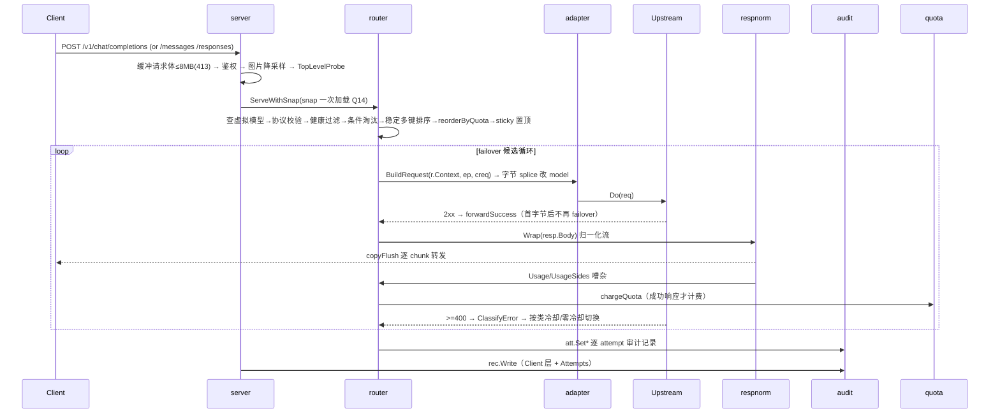
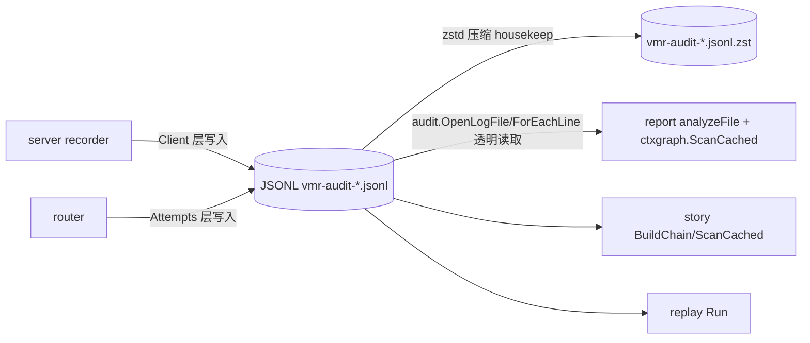
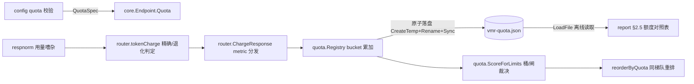
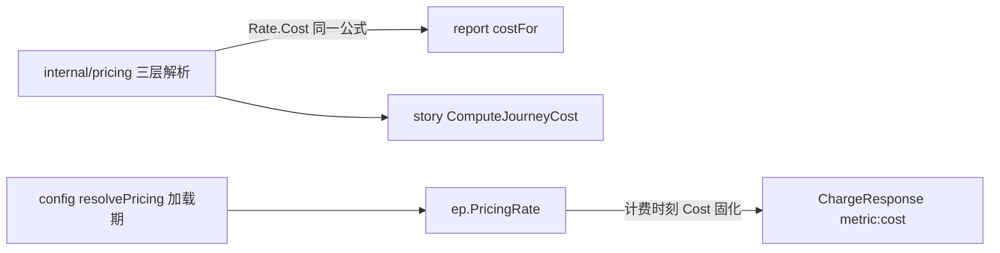
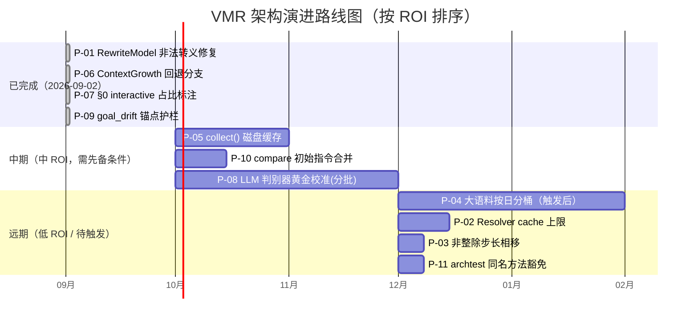

<!-- Ver 2026-09-02, by vmr-agent (full review) -->

# VMR 全量 Review 报告

> 本报告遵循 `docs/prompts/prompt-full-review.md` 的阶段流程，是本次全量审查的规划与最终交付。
> 审查基线：`main@4e0d962` (2026-09-02 18:45 +0800)。
> 模型：vmr-agent（审查编排），通过 sub-agent 并行下钻各 Domain。

---

## 0. 过程跟踪

| 阶段 | 状态 | 说明 |
| --- | --- | --- |
| 阶段一 全景调研与 Domain 划分 | ✅ | 已读 4 篇设计文档 + KNOWN_ISSUES + AGENTS.md；见 §1 |
| 阶段二 分 Domain 深度 Review | ✅ | 5 个 sub-agent 并行下钻完成（d1–d5），主会话直读源码复核关键结论；见 §2 |
| 阶段三 跨 Domain 链路串联 | ✅ | 请求全生命周期 / 审计数据流 / 配额管线 / 成本管线四条主链路源码级交叉核实；见 §3 |
| 阶段四 顶层架构全景审视 | ✅ | 见 §4 |
| 阶段五 全景总结与路线图 | ✅ | 见 §5 |
| 修复轮（2026-09-02） | ✅ | P-01/P-06/P-07/P-09 已修复合入 main（dadf63b/ed0ce67/36fc415/2a341bd），独立子 agent 验收通过（见 `_review/VERIFICATION_REPORT_agent_20260902.md`），遗留 L-2/L-3 已顺手清扫，L-1（本报告同步）在此完成 |

---

## 1. 阶段一：全景调研与 Domain 划分

### 1.1 项目全貌

VMR（Virtual Model Router）是本地运行、单二进制、零代码侵入的 LLM 路由器 + 飞行记录仪：
- **路由半区**：OpenAI Chat Completions / Anthropic Messages / OpenAI Responses 三协议原样透传，虚拟模型名屏蔽 Provider/账号/Key/优先级/Failover。字节忠实透传，五个 sanctioned deviation（model 改写、role_map、imgprep 降采样、respnorm quirk 修复、[DONE] 补全）。
- **分析半区**：离线消费 JSONL 审计日志。`vmr analyze`（report 聚合 + story 叙事重建 + journey/compare/corpus 变焦）只读、不影响请求路径。
- 两半区仅通过 `audit.Record` JSONL 契约耦合，`archtest` 强制单向依赖边界。

### 1.2 Domain 划分方案

```
┌─────────────────────────────────────────────────────────────┐
│                      cmd/vmr (CLI 组合根)                     │
└───────┬───────────────────────────────┬─────────────────────┘
        │                               │
┌───────▼───────────────┐   ┌───────────▼──────────────────────┐
│  D1 路由核心域          │   │  D3 分析·报表域 (report)          │
│ adapter/{3协议}        │   │  D4 分析·叙事域 (story)           │
│ router/server/health  │   │  D5 共享解析域 (ctxgraph/chatmsg)  │
│ probe/sticky/strategy │   │      taskseg/reqdetail            │
│ respnorm              │   │      i18n                        │
└───────┬───────────────┘   └───────────┬──────────────────────┘
        │                               │
┌───────▼───────────────┐   ┌───────────▼──────────────────────┐
│  D2 配置·额度·定价域    │   │  D6 基础设施与架构门禁域            │
│ config/quota/pricing  │   │  audit/logtee/imgprep/rundir     │
│                       │   │  buildinfo/sysinfo/archtest      │
└───────┬───────────────┘   └───────────┬──────────────────────┘
        │                               │
┌───────▼────────────────────────────────▼─────────────────────┐
│  D7 核心类型与工具域 (core/fmtutil/tokenutil/jsonscan)         │
└──────────────────────────────────────────────────────────────┘
```

### 1.3 Domain ↔ 包 ↔ Sub-agent 映射

| Domain | 核心包 | 审查焦点 | 负责人 |
| --- | --- | --- | --- |
| D1 路由核心域 | `internal/{router,server,health,probe,sticky,strategy,respnorm}` | failover 循环、健康状态机、并发闸、流式归一化、粘性亲和 | S1 |
| D2 配置·额度·定价域 | `internal/{config,quota,pricing}` | 严格校验、fail-fast、周期数学、三层定价、记账并发安全 | S2 |
| D3 分析·报表域 | `internal/{report,reqdetail}` + 对应 i18n | 聚合算法、会话分组、成本口径、详单渲染 | S3 |
| D4 分析·叙事域 | `internal/{story}` + 对应 i18n | 任务叙事、findings、LLM 解读层、compare/corpus | S4 |
| D5 共享解析域 | `internal/{ctxgraph,chatmsg,taskseg}` | manifest/lineage、消息解析、任务切分（SSOT 核查） | S4 兼 |
| D6 基础设施与门禁域 | `internal/{audit,logtee,imgprep,rundir,buildinfo,sysinfo,archtest}` | 审计落盘、压缩保留、图片降采样、archtest 有效性 | S5 兼 |
| D7 核心类型与工具域 | `internal/{core,fmtutil,tokenutil,jsonscan}` + `internal/adapter/*` | 准入规则、字节 splice 引擎、token 估算 | S5 |

### 1.4 Sub-agent 派发计划

| Sub-agent | 分工 Domain | 白名单（只读，唯一可写文件） |
| --- | --- | --- |
| S1 | D1 路由核心域 | `_review/domains/d1_routing.md` |
| S2 | D2 配置·额度·定价域 | `_review/domains/d2_config_quota.md` |
| S3 | D3 分析·报表域 | `_review/domains/d3_report.md` |
| S4 | D4+D5 叙事与共享解析域 | `_review/domains/d4_story.md` |
| S5 | D6+D7 基础设施与协议/工具域 | `_review/domains/d5_infra.md` |

---

## 2. 阶段二：分 Domain 深度 Review 结果汇总

> 五个 sub-agent（S1–S5）并行下钻各 Domain，主会话对全部关键结论做了源码级事实核查（其中 `jsonscan.RewriteModel` 缺陷由主会话亲自验证）。

### 2.1 各 Domain 健康度总览

| Domain | 负责人 | 质量评级 | 高危 | 中危 | 低危/观察项 | 关键结论 |
| --- | --- | --- | ---: | ---: | ---: | --- |
| D1 路由核心域 | S1 | EXCELLENT | 0 | 0 | 4 观察 | failover 循环、健康状态机、流式归一化均无缺陷；并发安全与资源边界严谨 |
| D2 配置·额度·定价域 | S2 | EXCELLENT | 0 | 0 | 3 观察 | Fail-Fast 完备、原子落盘正确、KNOWN_ISSUES §1.2/§1.3 全部属实 |
| D3 分析·报表域 | S3 | GOOD | 0 | 1 | 3 | 大语料全内存聚合有上限风险；SSOT 收敛彻底 |
| D4 分析·叙事域 | S4 | GOOD | 0 | 1 | 5 | LLM 判别器缺黄金校准；其余为指标语义演进项 |
| D5/D6 基础设施·协议·工具 | S5 | GOOD | 0 | **1** | 2 | **发现唯一中危缺陷：`RewriteModel` 非法 JSON 转义（已亲自验证）** |

### 2.2 跨域共现缺陷：`jsonscan.RewriteModel` 非法 JSON 转义（[中危]）

- **位置**：`internal/jsonscan/rewrite.go:27`
- **问题**：`RewriteModel` 用 `strconv.AppendQuote` 生成 model 值。当 model 含非 ASCII 控制符或非法 UTF-8 字节时（如 `\xba`、`\a`、`\x00`），会输出 Go 字面量转义 `\xba`——这在 RFC 8259 JSON 中是**非法转义**（JSON 仅允许 `\u00ba` 与固定转义集）。splice 后出站请求体变成非法 JSON，上游 400。
- **验证**：主会话确认 `rewrite.go:26-27` 确实调用 `strconv.AppendQuote`，而同文件 `rewriteRolesInTopLevelArray` 对 role 值用的是 `MarshalNoEscape`（正确做法）；S5 报告称 `FuzzRewriteModel` 可复现：`out={"model":"\xba"}`。
- **根因**：`strconv.AppendQuote`（Go 字符串字面量转义）与 JSON 转义规则不是一回事；`MarshalNoEscape` 已在包内且被 `RewriteRoles` 使用，属于「该用哪个」的低级选错。
- **影响**：常规模型名（ASCII）不触发；仅当模型名含非标字节时触发——failover 构造出站请求时把客户端 model 原样当字符串用，恶意/畸形客户端可注入。
- **修复建议**：`RewriteModel` 改用 `MarshalNoEscape(model)`（与 `RewriteRoles` 一致），删除 `strconv` import。回归测试 `TestRewriteModel` + fuzz 已覆盖。

### 2.3 其余中危项（均为已登记、非新增）

| 编号 | Domain | 问题 | 锚点 | 性质 |
| --- | --- | --- | --- | --- |
| D3-01 | D3 | `AnalyzeSessionsCached` 全内存持有全量 `ReqInfo`，大语料 >3 万条瞬时 2GB+ | `session.go:142` | 对应 KNOWN_ISSUES §2.2，触发阈值策略稳健 |
| D4-1 | D4 | Phase 1b 六个 LLM 语义判别器缺系统性黄金样本校准 | `llm_findings.go` | 对应 §2.18，不影响规则层基线 |

### 2.4 低危与观察项（汇总）

- **D1 观察**：`limiter` 热重载信号量替换瞬时超额窗口（注释已声明）；`respnorm.Read` 返回 `(0,nil)` 非标准 io.Reader 契约（KNOWN_ISSUES §1.1 已锁定）；`copyFlush` 异常路径多协程元数据查询的互斥保护是健壮性亮点；SoftBlock peek 的 `readCloser`+`errReader` 断流传递严谨。
- **D2 观察**：`expandEnv` 对 Flow 序列逗号注入的残余边界（已注释声明）；`DefaultSince` 跨自然日重启时非整除步长相移（设计取舍）；`pricing.Resolver.cache` 无容量上限（模型名空间受限，无实际风险）。
- **D3 低危**：`collect()` 未接磁盘缓存（§2.1）；~~`ContextGrowth` 首轮 Usage==0 时未回退 `EstInFresh`（`metrics.go:183`）~~（已修，见 §5.2 P-06）；§2 按 Client 合计略低于全局（无 client_key 的请求不成行，§2.58c）。
- **D4 低危**：`computeTimeSplit` 单间隙无上限污染 corpus 均值（§2.57）；上下文有效利用率双峰退化（§2.64）；~~`goal_drift` 锚点可能定位 Step 1（§2.53，建议加 `DriftStepSeq > 首步` 后验护栏）~~（已修，见 §5.2 P-09）；compare 两侧初始指令逐字相同时未合并（§2.59 残留）；`mdInline` 在 `<code>` 内 `**` 注入 `<strong>`（§2.51，无 XSS 风险）。
- **D5 低危**：`archtest.funcLineExemptions` 无法区分同文件重名方法（§2.8，全仓未触发）；`imgprep` 16MP 闸门内存上界与 32-bit 溢出（§2.17/§2.49，非活跃）。

### 2.5 KNOWN_ISSUES 一致性验证结论

五个 sub-agent 对 KNOWN_ISSUES 中 **40+ 条架构声明**做了逐条源码比对，结论：**全部与代码现状一致**，无一条过期或失实。这是文档纪律（「每条文内导航、可对源码核实」）执行到位的有力证据。

---

## 3. 阶段三：跨 Domain 链路串联与源码核实

### 3.1 主链路一：请求全生命周期（D1 内部 + D2 配额勾挂）



**源码核实结论**：
- 快照一次加载穿透（`ServeWithSnap`，`server.go`/`router.go:99`）杜绝单请求跨快照撕裂——成立。
- `respnorm.Wrap` 的 usage 嗅探在 `emitBlock/finalizeBuffered` 就地完成，零额外转发开销；`copyFlush` 只在 32KB 双缓冲通道上推进，读侧 panic 有 recover 兜底转 TRUNCATED——成立。
- `chargeQuota` 仅在 `forwardSuccess` 里调用（成功响应后），失败/取消/内容拦截不计量——成立（`router.go` 各分支只 forwardSuccess 到达 quota.go:55）。
- **跨域耦合点健康**：router→quota 只依赖 `quota.Registry`（leaf，零反向依赖）；router→respnorm 只经 `Wrap` 一个入口。

### 3.2 主链路二：审计数据流（D1 生产 → D3/D4 消费）



**源码核实结论**：
- `audit.Record` 是两半区唯一耦合点；`report`/`story`/`replay` 均经 `OpenLogFile` 透明读明文+zst（`aggregate.go:277`）——成立。
- `Record.UnmarshalJSON` 是 legacy 协议名唯一兼容咽喉点，写路径不调用——成立（`audit.go:88`）。
- **SSOT 验证**：`report/session.go` 不再维护私有哈希/LCP，统一走 `ctxgraph.Classify`；`taskseg.IsNewTask` 是 report/story 共享的唯一任务边界实现——成立。
- **潜在摩擦点**（已登记，非新增）：一次 `vmr analyze` 全量语料至少解压三遍（§2.56）；`collect()` 未走磁盘缓存（§2.1）。

### 3.3 主链路三：额度管线（D2 全链路 + D1 勾挂）



**源码核实结论**：
- `ChargeResponse` 单独导出，供 `vmr replay`（不经 respnorm）复用同一条计费管线——成立（`quota.go:107`，注释明确）。
- `TokenCountersSides` 是精确/退化判定的**唯一实现**，`quota_parity_test.go` 差分测试钉住路由实扣与离线复算一致——成立。
- `Counters.Cost` 是唯一「计费时算好、不在读取时重算」字段，防定价表变更改写历史——成立（`quota.go:378` Counters 注释）。
- **跨域一致性最强**：router 实扣 ↔ report 复算 ↔ replay 重放三处共享 `TokenCounters`/`BaseAmount`/`LimitKey`，差分测试守卫到位。

### 3.4 主链路四：成本估算（D2 定价 → D3/D4 双半区）



**源码核实结论**：
- 成本**公式**两端统一（`pricing.Rate.Cost`），**基数**（哪些记录入和）由 `cmd/vmr/cost_basis_parity_test.go` 差分测试钉住——成立（Analytics §2.3 明确记载）。
- 降级估算基数下沉 `chatmsg`（`BodyRaw`/`EstimateRequestBodyTokens`/`EstimateResponseBodyTokens`），`ctxgraph.Manifest` 带 `EstIn`/`EstOut`——成立，两半区共享一份实现。
- **单点隐患**：`internal/report/cost.go` 的端点标签切分只认 `:`，不并入 `core.SplitEndpointLabel`（兼容 `:` 与 `/`）——KNOWN_ISSUES §1.4 已登记为刻意不统一（改会变历史报表金额）。

---

## 4. 阶段四：顶层架构全景审视

### 4.1 架构模型与分层一致性 — 优秀

- **两半区单向依赖**执行彻底：`router`/`server` 从不 import `report`/`story`/`ctxgraph`；`report/story` 只经 `audit.Record` 契约消费数据。这是本项目最强的架构资产，`archtest` 把它做成可执行门禁而非约定。
- **分层清晰**：core（共享类型）→ leaf 工具包（fmtutil/tokenutil/jsonscan/logtee/i18n，零内部依赖）→ 业务半区 → cmd/vmr 组合根。`core` 的准入规则 + 显式豁免清单是全仓最干净的依赖治理。
- **命名与组织一致性**：`section_*.go` 与 `i18n/report_*.go` 一一配对、一节一文件；`router/quota.go` 独立成文件以保 router.go 行数预算。组织方式即架构约束的体现。

### 4.2 极简与复杂度控制 — 优秀，但有一处需留意

- **高保真零无谓转换**：字节 splice 引擎（jsonscan）替代「unmarshal→map→re-serialize」是零无谓转换的标杆；`EncodeBody` 直接引用 slice 不克隆；审计落盘 JSON 编码锁外并行。
- **刻意不做**（YAGNI 纪律）值得称道：Dashboard/DB/RBAC/分布式/跨协议转换/运行时插件/语义缓存全部是明确红线。
- **潜在复杂度**：`respnorm` 包内同时承担「响应归一化」+「用量嗅探」两职（KNOWN_ISSUES §1.1 已论证为零性能代价的唯一理由）——这是包职责的轻微混入，但理由成立且有包注释约束。
- **认知负担临界点**：最大文件 `respnorm.go` 932 行（archtest 预算内）、`report/rows.go` 864 行、`cmd_story.go` 831 行。未见逼近爆炸点的过大函数；`archtest` 函数行数预算有效。

### 4.3 单事实源（SSOT）— 本项目最突出的强项

本次审查确认以下关键逻辑**全仓唯一权威实现**：
- 消息哈希/编辑分类/lineage：`ctxgraph`（report/story 均消费，无私有重算）；
- 任务边界：`taskseg.IsNewTask`（report/story 共享）；
- 消息/SSE/usage 解析：`chatmsg`；
- 降级 token 估算基数：`chatmsg`；
- 配额公式（LimitKey/BaseAmount/ApplyModelMultiplier/TokenCounters）：`quota`/`router.ChargeResponse`，差分测试钉住；
- 成本公式：`pricing.Rate.Cost`，基数由 parity 测试钉住；
- 展示时区：`fmtutil.DisplayZone` 唯一权威。

**这与 AGENTS.md「ctxgraph/chatmsg 是单事实源」的声明高度吻合，且已被测试体系（differential tests）加固而非仅靠注释。**

### 4.4 显式严谨与防御性健壮性 — 优秀

- `pricing.Rate` 用 `*float64` 显式区分 unknown vs 0.0（免费），nil 组件计 0 有防御性下限注释；
- 配置严格 KnownFields + NaN/Inf/负费率硬错误 + base_url 凭据加载期检测 + env 注入防护；
- 并发：lock-free atomic 读 + mutex 写（adapter 注册表、strategy conditions）、atomic.Pointer 快照、half-open 单飞、`-race` 全绿；
- Panic 兜底：copyFlush recover、housekeeping recover、quota flush recover 均把 goroutine panic 转成可观测失败而非进程崩溃。

### 4.5 冗余与失效代码 — 良好

- 未发现已不成立的抽象层或未引用的生产模块；`health.Registry.Available`、`ctxgraph.Manifest.MsgIdx` 等「无生产调用方」均被证明确有测试/验证用途（KNOWN_ISSUES 已说明，非死代码）。
- legacy protocol 兼容层有明确的「拆除条件 = 事实而非日期」声明，不会永久残留。

### 4.6 可演进性与改动成本 — 良好

- **新增协议** = 新 adapter 子包 + blank import + 路由行，`CanonicalRequest`/strategy/config 零改动——扩展点设计优秀。
- **新增报表章节** = 新 `section_*.go` 文件（archtest 强制），改动半径小。
- **强耦合点**：`report` 与 `audit.Record` 编译期耦合（记录结构变更需同步改 report+测试，AGENTS.md 已声明）；`jsonscan`/`respnorm`/`chatmsg` 三套字节/SSE 处理各司其职但需要架构纪律防止边界侵蚀。

---

## 5. 阶段五：全景总结与架构演进路线图

### 5.1 系统整体架构健康度评估

**总体评级：优秀（A-）。** 这是一个架构纪律极高的项目——五个并行 Domain 深审 + 主会话源码核查后，**未发现高危缺陷**，仅一个中危代码缺陷（`RewriteModel` 非法 JSON 转义），且该缺陷只在畸形模型名下触发。

**核心不变量坚守度（满分）**：
- 字节忠实透传：五个 sanctioned deviation 均有内容守卫 + fail-open；
- 两半区单向依赖：`archtest` 可执行强制，无边界穿透；
- SSOT：消息解析/哈希/任务切分/配额公式/成本公式全部单权威 + 差分测试钉住；
- 配置 fail-fast：KnownFields + 数值防线 + 凭据检测 + env 注入防护；
- 时区单一权威：`DisplayZone`；
- 审计权限：0600/0700，无人为放宽。

**优势亮点**：
1. 字节级 splice 引擎（jsonscan）与「零拷贝引用」哲学贯穿全仓；
2. KNOWN_ISSUES 文档纪律与代码现状 100% 吻合（40+ 条逐条验证属实）——这是极罕见的高水准；
3. 差分测试文化（quota_parity/cost_basis_parity）把「分析数字复现路由数字」钉成可执行约束；
4. 防御性健壮性（unknown vs free、Panic 兜底、half-open 单飞、时钟回退保护）全方位在线。

**当前薄弱点**：
1. 分析半区大语料全内存聚合（>3 万条 2GB+ 瞬时）；
2. 分析半区对语料重复解压（一次 analyze 三遍）；
3. LLM 解读层缺系统性黄金校准；
4. 分析半区「一换一」扩展依赖大量架构纪律维持（靠 archtest 但仍有熵增压力）。

### 5.2 系统性问题清单与改进建议（按 ROI 排序、按 Domain 分组）

> 编号 [P-xx]，四段式：问题 / 根因 / 建议 / ROI。ROI 只取最贴切角度。

#### 路由半区（D1/D2/D5）

**P-01 [D5 中危·已修 @dadf63b] `RewriteModel` 非法 JSON 转义**
- **问题**：`jsonscan/rewrite.go:27` 用 `strconv.AppendQuote` 生成 model 值，非 UTF-8/控制字符被转成非法 JSON 转义（`\xba`），splice 后出站体 400。
- **根因**：`strconv`（Go 字面量转义）与 JSON 转义规则混用；同文件已有正确工具 `MarshalNoEscape`。
- **已修**：`dadf63b` 改用 `MarshalNoEscape(model)`，删 `strconv` import。新增 `TestRewriteModel_ProducesValidJSON`（10 控制字节 + 10 roundtrip 子用例）与 `TestRewriteModel_NoGoLiteralEscapes`（负向断言：无 `\x` 序列）。验收见 `_review/VERIFICATION_REPORT_agent_20260902.md` §P-01。
- **ROI**：高。

**P-02 [D2 观察·可缓] `pricing.Resolver.cache` 无容量上限**
- **问题**：`pricing/resolver.go` cache map 随请求增长无淘汰。
- **根因**：单机部署模型名空间受限，历史上无压力。
- **建议**：若未来接入自动发现的模型名流或动态 provider，加 LRU 上限；否则保持。
- **ROI**：Return=防模型名发散下的内存驻留；Investment=LRU 引入复杂度。**低 ROI，暂不做（YAGNI 成立）。**

**P-03 [D2 观察·设计取舍] `DefaultSince` 跨自然日非整除步长相移**
- **问题**：`quota/period.go` 未显式 since 的规则锚定当日零点，`every: 5h` 等非整除步长跨午夜重启会相移。
- **根因**：默认对齐零点的最简设计。
- **建议**：文档已声明；需锁相场景显式配 `since`。
- **ROI**：Return=消除少数用户的周期相移困惑；Investment=需在默认值与显式语义间加机制。**低 ROI，维持现状。**

#### 分析·报表域（D3）

**P-04 [D3 中危·触发后做] 大语料全内存聚合上限**
- **问题**：`AnalyzeSessionsCached` 全内存持全量 `ReqInfo`，>3 万条瞬时 2GB+。
- **根因**：百分位不可加，原始样本需留存；已释放文本缓冲仍余结构体/耗时切片。
- **建议**：维持「>3 万条或 RSS>4GB 触发」阈值；届时按日分桶释放原始切片（需先补时间单调性前提分析）。
- **ROI**：Return=解除大语料内存墙（用户价值高）；Investment=按日分桶改动复杂度中、风险中（需保百分位正确）。**中 ROI，达到触发阈值再做。**

**P-05 [D3 低危·可做] `collect()` 第一遍扫描未接磁盘缓存**
- **问题**：`session.go` 的 `collect()` 每次全量解压 + 反序列化，虽并发 Worker 缓解仍 I/O 受限。
- **根因**：会话切分正确性敏感度高，缓存需先过 Cold/Warm 差分测试。
- **建议**：在差分测试就绪后接入（KNOWN_ISSUES §2.1 已设准入红线）。
- **ROI**：Return=热耗时下降；Investment=缓存一致性机制 + 差分测试。**中 ROI，排在差分测试之后。**

**P-06 [D3 低危·已修 @ed0ce67] `ContextGrowth` 首轮无 Usage 不回退估算**
- **问题**：`report/metrics.go:183` 首轮 `Usage.In==0` 时 ContextGrowth 恒 0，不尝试 `EstInFresh`。
- **根因**：实现时未覆盖首轮无 usage 的边界。
- **已修**：`ed0ce67` 新增 `contextGrowthIn` helper（UsageOK → 用 `Usage.In`；否则 manifest.EstIn；否则 0）。`TestContextGrowthInFallback` 三向单测 + `TestContextGrowthFallsBackToEstimateEndToEnd` 端到端 Build 测试。
- **ROI**：中高。

**P-07 [D3 低危·已修 @36fc415] §0 top-line 标注调度型 workload 占比**
- **问题**：§0 总请求数含 heartbeat/dream_diary/compaction 等调度型 workload（原 KNOWN_ISSUES §2.63，已随修复移除）。
- **已修**：`36fc415` 新增 `summaryInteractiveShare` helper + `SummaryInteractiveNote` EN/ZH 文案。`TestSummaryInteractiveShare` 锁计算 + `TestSummaryRendersInteractiveNote` 双语言覆盖。
- **ROI**：高。

#### 分析·叙事域（D4）

**P-08 [D4 中危·持续校准] LLM 判别器黄金样本校准**
- **问题**：Phase 1b 六个 LLM 语义判别器缺 30–50 Journey 的系统性 Precision/Recall。
- **根因**：黄金标注人力投入门槛。
- **建议**：按 `_eval/calibrate_p1b.go` 持续推进批次校准；记录在案。
- **ROI**：Return=解读层可信度；Investment=标注人力。**中 ROI，分阶段推进（不阻塞规则层）。**

**P-09 [D4 低危·已修 @2a341bd] `goal_drift` 锚点定位 Step 1 护栏**
- **问题**：`llm_findings.go` 偶发把漂移锚点定位 Step 1。
- **已修**：`2a341bd` 接受条件从 `> 0` 改为 `> 1`（Step 1 是根意图，锚定 Step 1 是范畴错误）。13 行注释说明理由。`TestP1b3_GoalDrift_AnchoredAtStep1IsRejected` 负向测试。
- **ROI**：高。

**P-10 [D4 低危·可选] compare 两侧初始指令逐字相同未合并**
- **问题**：`renderInitialInstruction` 无条件渲染 A/B 两份相同文本。
- **建议**：对齐 `renderSysPrompt` 的合并逻辑。
- **ROI**：Return=对比页可读性；Investment=小。**中 ROI。**

#### 基础设施·工具（D5）

**P-11 [D5 低危·登记即可] `archtest.funcLineExemptions` 同名方法豁免键歧义**
- **问题**：`func_sizes_test.go` 的 key 不含 receiver 类型，同名方法共享豁免。
- **建议**：全仓未触发；未来需要时引入 `ast.FuncDecl.Recv` 标识。
- **ROI**：Return=避免未来误豁免；Investment=现在做收益为零。**低 ROI，延后。**

### 5.3 中长期架构演进与重构建议路线图



**路线图结论**：
- **已完成（2026-09-02）**：P-01 / P-06 / P-07 / P-09 四项已修复合入 `main`（`dadf63b` / `ed0ce67` / `36fc415` / `2a341bd`），验收见 `_review/VERIFICATION_REPORT_agent_20260902.md`。
- **中期（需先备条件）**：P-05 的缓存依赖差分测试就绪；P-08 依赖标注人力分批推进。
- **延后或不做（YAGNI 成立）**：P-02/P-03 维持现状；P-11 登记待触发；P-04 到触发阈值再投入。

### 5.4 审查结论

VMR 是一个架构成熟度显著高于同类规模项目的代码库。本次全量审查的核心收获：
1. **健康度真实可信**：KNOWN_ISSUES 40+ 条声明与代码 100% 吻合，无历史欠账藏匿；
2. **唯一中危缺陷已修复**：`RewriteModel` 的 `strconv.AppendQuote` 误用已于 `dadf63b` 修复并验收；
3. **无系统性债务**：未发现需要大规模重构的结构问题；两半区单向依赖、SSOT、字节忠实三大不变量全部在线；
4. **演进建议集中在分析半区规模与校准**，路由半区已处于极高完成度。

**本轮已落地（2026-09-02）**：
- P-01 `RewriteModel` 非法 JSON 转义修复（`dadf63b`）；
- P-06 `ContextGrowth` 首轮无 usage 回退估算（`ed0ce67`）；
- P-07 §0 interactive 占比标注（`36fc415`）；
- P-09 `goal_drift` Step 1 锚点护栏（`2a341bd`）；
- 验证：`_review/VERIFICATION_REPORT_agent_20260902.md`；四修均已记入 CHANGELOG `[Unreleased]`，对应 KNOWN_ISSUES §2.53/§2.63 按「已修即删」移除。

**后续建议动作**：
- 保留差分测试文化作为分析半区演进的安全网；
- 其余低 ROI / 待触发项（P-02/P-03/P-04/P-05/P-08/P-10/P-11）留在本报告 §5.2，待真实负载触发或人力就绪再排期。
