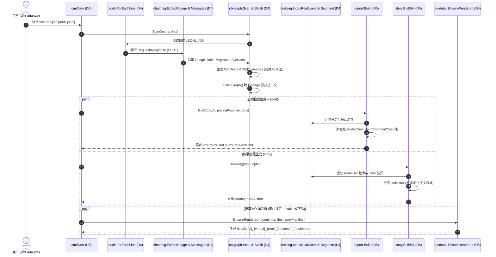
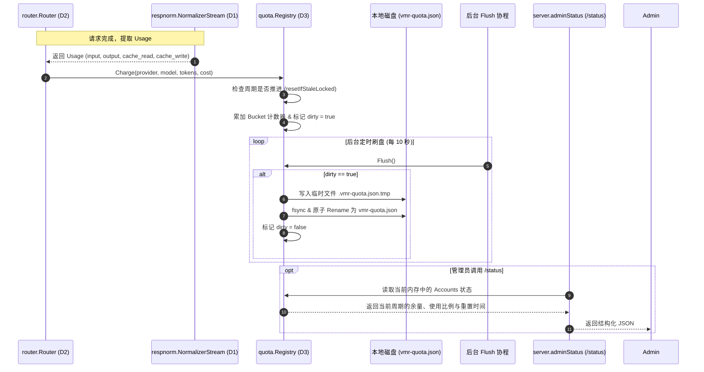
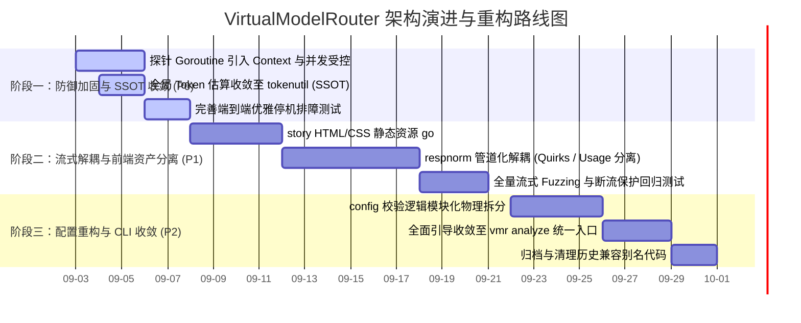

# VirtualModelRouter (vmr) 全面系统级架构 Review 与重构路线图报告

> **审计模型**: agent  
> **审计日期**: 2026-09-02  
> **审计范围**: `internal/` 与 `cmd/vmr/` 全量核心生产业务代码（约 50,000 LOC）  
> **审计原则**: 第一性原理、高阶整洁架构（Clean Architecture）、高内聚低耦合、单事实源（SSOT）、防御性健壮性、极简与复杂度控制

---

## 审查进度与过程跟踪 (Review Progress Tracker)

| 阶段 | 核心任务 | 当前状态 | 核心产出 / 关键备忘 |
|---|---|---|---|
| **阶段一** | 全景调研与领域划分 (Domain Decomposition) | 🟢 已完成 | 完成 6 大业务领域划分、架构拓扑图绘制与边界定义 |
| **阶段二** | 分 Domain 深度 Review (逐域击破) | 🟢 已完成 | 6 大 Domain 深度下钻（职责边界、实现质量、坏味道与领域问题） |
|  - Domain 1 | 协议适配与数据流标准化 (Ingress & Adapters) | 🟢 已完成 | `core`, `adapter/*`, `respnorm`, `jsonscan`, `imgprep` |
|  - Domain 2 | 动态路由、故障转移与健康策略 (Routing & Strategy) | 🟢 已完成 | `router`, `strategy`, `health`, `sticky`, `probe` |
|  - Domain 3 | 计量配额、定价与服务监控 (Quota, Pricing & Server) | 🟢 已完成 | `quota`, `pricing`, `server`, `config` |
|  - Domain 4 | 审计追踪、上下文图谱与任务切分 (Audit & Context) | 🟢 已完成 | `audit`, `chatmsg`, `ctxgraph`, `taskseg` |
|  - Domain 5 | 宏微观分析引擎与叙事生成 (Analytics Engines) | 🟢 已完成 | `reqdetail`, `report`, `story` |
|  - Domain 6 | CLI 编排与基础设施支撑 (CLI & Infrastructure) | 🟢 已完成 | `cmd/vmr/*`, `diagnose`, `replay`, `fmtutil`, `tokenutil`, `logtee`, `i18n`, `sysinfo`, `buildinfo`, `rundir` |
| **阶段三** | 跨 Domain 链路串联与源码核实 (横向拉通) | 🟢 已完成 | 3 条核心主链路追踪 (请求生命周期、离线分析流水线、配额同步) |
| **阶段四** | 顶层架构全景审视 (自顶向下) | 🟢 已完成 | 6 大架构维度批判性评估（解耦、极简、SSOT、防御性、死代码、演进成本） |
| **阶段五** | 全景总结与架构演进路线图 (综合交付) | 🟢 已完成 | 健康度评估、四段式 ROI 排序改进清单、Mermaid 重构甘特图 |

---

# 阶段一：全景调研与领域（Domain）划分

## 1.1 系统职责全貌与核心设计哲学

`vmr` (Virtual Model Router) 是一个基于 Go 语言构建的本地单二进制 LLM 智能路由与审计分析系统。系统整体呈现“**路由内核（Online Routing Core）**”与“**分析引擎（Offline Analytics Suite）**”**对等双核（Co-equal Halves）**的架构形态：

1. **路由核心（Online Half）**：
   - 统一屏蔽下游提供商（Provider）、账户（Account）、API Key、优先级与多级故障转移（Failover），对外暴露稳定的虚拟模型名称（如 `coding`, `agent`, `claude`）。
   - 提供基于会话特征的 Prompt Cache 亲和性（Session Stickiness）、Token 计划配额智能调度（Quota Pacing）与并发限流保护。
   - **严格的三协议隔离与字节保真转发（Byte-Faithful Passthrough）**：支持 OpenAI (`/v1/chat/completions`)、Anthropic (`/v1/messages`)、OpenAI Responses (`/v1/responses`) 三大协议，绝不在协议间做损失精度的 IR 转换，严格同协议入同协议出，仅允许 5 类受控微调（Model 名重写、Role 映射、图片下采样、厂商兼容性修复、SSE `[DONE]` 补全）。
   - 双层零时延审计日志捕获（Client↔VMR, VMR↔Upstream）。

2. **分析核心（Offline Half）**：
   - 离线消费路由层沉淀的 JSONL 审计日志，与路由内核在代码层面完全解耦（禁止反向依赖路由/服务端组件）。
   - 提供宏观审计报表（`vmr report`）、任务旅程与行为研判（`vmr story`）、单请求证据图谱（`reqdetail`）与多任务对比等全景分析能力。
   - 确立以 `chatmsg` / `ctxgraph` 为单一事实源（SSOT）的会话哈希与任务切分基石。

---

## 1.2 领域划分方案 (Domain Decomposition)

根据高内聚低耦合原则与整洁架构思想，将系统全部业务代码划分为 **6 大领域 (Domains)**：

```mermaid
graph TB
    subgraph D1["Domain 1: 协议适配与数据流标准化 (Ingress & Stream Normalization)"]
        D1_Core[core: 核心契约与事实模型]
        D1_Adapter[adapter: OpenAI / Anthropic / Responses 协议适配与错误分类]
        D1_Respnorm[respnorm: 流式规整、SSE 分帧、厂商 Quirk 修复与用量嗅探]
        D1_Jsonscan[jsonscan: 零分配 JSON 字节扫描与原位改写]
        D1_Imgprep[imgprep: 内联图片压缩与哈希缓存]
    end

    subgraph D2["Domain 2: 动态路由、故障转移与健康策略 (Routing & Failover Core)"]
        D2_Router[router: 路由决策引擎、Failover 循环与限流器]
        D2_Strategy[strategy: 过滤条件 Condition 与多维排序 Dimension]
        D2_Health[health: 熔断、冷却与 Half-Open 探测状态机]
        D2_Sticky[sticky: 会话指纹与 Prompt Cache 亲和性锁定]
        D2_Probe[probe: 回声 Nonce 探测与存活检测]
    end

    subgraph D3["Domain 3: 计量配额、定价与服务监控 (Quota, Pricing & Server)"]
        D3_Server[server: HTTP 入口、认证鉴权、事实捕获与管理端点]
        D3_Config[config: 配置加载、严格校验、热重载与密钥池]
        D3_Quota[quota: Token 计划配额核算、余量打分与持久化]
        D3_Pricing[pricing: 三层费率解析模型与标准价目表]
    end

    subgraph D4["Domain 4: 审计追踪、上下文图谱与任务切分 (Audit & Context Graph)"]
        D4_Audit[audit: 双层 JSONL 写入、轮转与 Zstandard 压缩归档]
        D4_Chatmsg[chatmsg: 跨协议统一消息解析、SSE 重构与工具调用配对 (SSOT)]
        D4_Ctxgraph[ctxgraph: 内容寻址哈希、上下文 Manifest 与血缘追踪]
        D4_Taskseg[taskseg: 任务切分算法与方言识别 Profile]
    end

    subgraph D5["Domain 5: 宏微观分析引擎与叙事生成 (Analytics Suite)"]
        D5_Reqdetail[reqdetail: 单记录事实提取与 Markdown 证据详情渲染]
        D5_Report[report: 宏观流量聚合、端点价值、Token 浪费与报表导出]
        D5_Story[story: Journey/Task/Step 叙事生成、行为研判、Corpus 统计与 LLM 解读]
    end

    subgraph D6["Domain 6: CLI 编排与基础设施支撑 (CLI & Infrastructure)"]
        D6_CLI[cmd/vmr: CLI 子命令编排 start/check/analyze/story/diagnose/replay]
        D6_Diagnose[diagnose & replay: 端到端诊断探测与全真流量回放]
        D6_Fmt[fmtutil & tokenutil: 文本格式化、时区权威与零分配 Token 估算]
        D6_Infra[i18n, logtee, sysinfo, buildinfo, rundir: 多语言、控制台 Tee、环境探测]
    end

    %% Ingress Flow
    D3_Server --> D1_Adapter
    D3_Server --> D2_Router
    D2_Router --> D1_Adapter
    D2_Router --> D2_Strategy
    D2_Router --> D2_Health
    D2_Router --> D2_Sticky
    D2_Router --> D3_Quota
    D2_Router --> D1_Respnorm
    D1_Respnorm --> D1_Jsonscan
    D3_Server --> D4_Audit

    %% Offline Analytics Flow
    D4_Audit -.-> D4_Chatmsg
    D4_Chatmsg --> D4_Ctxgraph
    D4_Chatmsg --> D4_Taskseg
    D4_Ctxgraph --> D5_Reqdetail
    D4_Taskseg --> D5_Report
    D4_Taskseg --> D5_Story
    D5_Report --> D5_Reqdetail
    D5_Story --> D5_Reqdetail

    %% CLI Composition
    D6_CLI --> D2_Router
    D6_CLI --> D5_Report
    D6_CLI --> D5_Story
    D6_CLI --> D6_Diagnose
    D6_CLI --> D6_Replay
```

---

## 1.3 领域职责与审查焦点矩阵

| 领域编号 | 领域名称 | 覆盖核心业务包 | 核心职责 | 审查焦点与潜在风险排查 |
|---|---|---|---|---|
| **Domain 1** | **协议适配与数据流标准化** | `core`<br>`adapter/*`<br>`respnorm`<br>`jsonscan`<br>`imgprep` | 协议事实抽象、多协议错误分类与提取、SSE 流式归一化、零分配字节篡改、内联图片压缩 | 1. 字节保真原则是否坚守，有无多余 IR 转换与内存拷贝？<br>2. `jsonscan` 状态机边界与越界风险？<br>3. `respnorm` 中各厂商 Quirk 修复与 Quota Sniffing 是否安全防泄漏？<br>4. 错误分类规则覆盖度与兜底机制。 |
| **Domain 2** | **动态路由、故障转移与健康策略** | `router`<br>`strategy`<br>`health`<br>`sticky`<br>`probe` | 端点多维决策排序、请求降级/重试循环、故障熔断与半开探测、Prompt Cache 亲和性锁定 | 1. `router.Serve` 重试循环是否存在竞态与死锁风险？<br>2. `strategy.Condition` 与 `Dimension` 是否严格正交隔离？<br>3. `health` 状态转换与并发安全（Half-Open 探测防风暴）？<br>4. `sticky` 的淘汰与内存泄漏防护。 |
| **Domain 3** | **计量配额、定价与服务监控** | `quota`<br>`pricing`<br>`server`<br>`config` | Token 预算与速率核算、三层单价解析、HTTP 网关管理与认证、配置热重载与防裂化校验 | 1. 配额扣减与持久化（`vmr-quota.json`）的原子性与性能损耗？<br>2. `pricing` 中 unknown 与 free 的严格判定？<br>3. `server` HTTP 请求生命周期管理与上下文超时穿透？<br>4. 配置解析中的环境变量展开与 Fail-fast 机制。 |
| **Domain 4** | **审计追踪、上下文图谱与任务切分** | `audit`<br>`chatmsg`<br>`ctxgraph`<br>`taskseg` | 结构化审计日志落盘与归档、跨协议统一消息解析（SSOT）、会话血缘哈希生成、Agent 任务边界切分 | 1. `audit` 高并发写入时的文件锁竞争与 Buffer 泄漏？<br>2. `chatmsg` 对各大协议非标 JSON/SSE 的鲁棒性？<br>3. `ctxgraph` 哈希算法的确定性与增量 Diff 性能？<br>4. `taskseg` 方言识别（OpenClaw vs Generic）的准确度与越界防御。 |
| **Domain 5** | **宏微观分析引擎与叙事生成** | `reqdetail`<br>`report`<br>`story` | 离线审计报表聚合、多维度宏观指标核算、Agent 任务旅程建模、异常行为研判与 Markdown/HTML 渲染 | 1. 报表与旅程生成中的内存膨胀与大日志 OOM 风险？<br>2. 跨模块指标计算口径的一致性（与路由层保持严密单测对齐）？<br>3. 渲染逻辑与领域逻辑是否清晰解耦？<br>4. 大文件与高圈复杂度函数的重构空间。 |
| **Domain 6** | **CLI 编排与基础设施支撑** | `cmd/vmr/*`<br>`diagnose`<br>`replay`<br>`fmtutil`<br>`tokenutil`<br>`logtee`<br>`i18n` 等 | 命令行子命令路由与组装、全真流量诊断与回放、零分配 Token 估算、时区与格式化底座、国际化多语言 | 1. CLI 组装层的职责边界（是否混入过多业务逻辑）？<br>2. `diagnose` 与 `replay` 是否真正复用生产代码路径？<br>3. `tokenutil` 快速估算算法的稳定性？<br>4. 时区与展示格式是否具备唯一权威源。 |

---

# 阶段二：分 Domain 深度 Review（自底向上逐域击破）

## 2.1 Domain 1: 协议适配与数据流标准化

### 2.1.1 职责与边界评估
Domain 1 由 `internal/core`、`internal/adapter/*`、`internal/respnorm`、`internal/jsonscan` 与 `internal/imgprep` 构成。其核心职责是**协议契约建模、原始字节流的保真改写与流式规整**。
- **边界优良特性**：
  1. `core` 严格保持零内部依赖（`archtest` 守卫），仅承载跨域共享的实体结构（`CanonicalRequest`, `Endpoint`, `ErrorClass`）及无状态计算（`Endpoint.HealthKey`, `EndpointLabel`）。
  2. `jsonscan` 作为零依赖的字节扫描引擎，实现了低开销原位模型替换（`RewriteModel`）与角色映射（`RewriteRoles`），避免了传统中间件每请求必须经历的 `json.Unmarshal -> map -> json.Marshal` 内存风暴与 HTML 字符转义篡改（如 `< > &` 变成 `\u0026`）。
  3. `imgprep` 实现内联图片的无依赖原地降采样与 SHA-256 磁盘缓存，严格坚持 Fail-open 兜底原则，图像解析失败退化为原图透传。
- **边界渗透与泄漏**：
  1. **`respnorm` 的职责超载**：`respnorm/respnorm.go`（925 行）同时承担了 SSE 帧切割、模型名替换、`[DONE]` 补齐、MiniMax 专属 Quirk 剥离（`<think>`、`Thinking Process:`）、软屏蔽嗅探（`soft_block`）以及**实时计费 Token 用量嗅探（Usage Sniffing）**。流式处理器直接与计费领域耦合，违背单一职责原则（SRP）。
  2. **厂商 Quirk 知识的分裂**：MiniMax 的思考标签处理被硬编码在 `respnorm/minimax.go` 与 `respnorm/respnorm.go` 中，而 DeepSeek / Google Gemini 的 Quirk 则分散在 `adapter/classify.go` 和 `adapter/classify_hints.go`。系统缺乏对厂商特异性行为（Quirks）的统一抽象层。

### 2.1.2 核心业务实现质量
1. **零拷贝与原位字节拼接**：
   - `jsonscan/scan.go` 与 `jsonscan/rewrite.go` 通过 `IndexUnescapedQuote` 实现了反斜杠奇偶性校验（Backslash parity），在快速跳过超长字符串时达到 `bytes.IndexByte` (memchr) 级别硬件加速。
   - `spliceValues` 预先计算改写后的精确容量 `make([]byte, 0, len(raw)+extra)`，一次性切片拼接，杜绝二次扩容。
2. **错误分类状态机**：
   - `adapter/classify.go:DefaultClassify` 对 HTTP 4xx 错误响应提炼了 `errorSnippet`（限制前 4KB 文本扫描），避免了提示词反显（Echoed Prompt）导致命中违禁词的假阳性分类（False Positive）。
   - 将 `ErrContent`、`ErrContextLimit`、`ErrQuirk` 归类为**无健康惩罚**错误，只切候选端点而不触发熔断冷却，设计严谨。
3. **流式并发安全与截断处理**：
   - `respnorm/respnorm.go:stream` 内部以 `sync.Mutex` 保护 `Usage()`、`Applied()`、`RawPreStrip()` 与 `ObservedModel()`，支持在 `forwardSuccess` 管道异步传输中并发读取中间统计。
   - 在流中途截断时，`respnorm` 对未闭合的 `<think>` 标签实行**扣留不发（`truncated_withheld`）**，并在最后触发 `panic(http.ErrAbortHandler)` 强制中断 TCP，杜绝将残缺状态谎报为 200 OK。

### 2.1.3 代码健康度与坏味道
- **坏味道 1：`respnorm/respnorm.go` 过于庞大且状态分支过深**。`stream.Read` 方法在处理 passthrough 与 buffered 模式切换、SSE 分帧、CRLF 嗅探以及 EOF 时的 `[DONE]` 补齐逻辑中，嵌套层级达到 5 层以上，认知负担极重。
- **坏味道 2：MiniMax 专属正则与模式硬编码**。`respnorm/minimax.go` 中固化了 `thinkingProcessPattern` 与 `<think>` 标签正则。若后续 DeepSeek 或 Qwen 引入类似的私有协议变体，`respnorm` 将进一步膨胀。

---

## 2.2 Domain 2: 动态路由、故障转移与健康策略

### 2.2.1 职责与边界评估
Domain 2 由 `internal/router`、`internal/strategy`、`internal/health`、`internal/sticky` 与 `internal/probe` 组成。其职责是**端点决策编排、重试容灾与并发调度**。
- **边界优良特性**：
  1. `router.Snapshot` 实现了基于 `atomic.Pointer` 的全量不可变替换，热重载与并发请求之间无读写锁竞争。
  2. `strategy` 将“候选端点淘汰（`Condition.Eligible`）”与“端点相对排序（`Dimension.Compare`）”彻底正交化，前者感知请求事实（`RequestFacts`），后者只比较端点静态属性，接口契约清晰。
  3. `health.Registry` 与 `sticky.Registry` 独立于 `Snapshot` 生命周期之外，确保配置重载时健康冷却时间与会话粘性缓存不丢失。

### 2.2.2 核心业务实现质量
1. **候选端点决策流水线**：
   `router/candidates.go:buildCandidates` 严格执行标准 7 步流水线：
   $$\text{Health Filter} \longrightarrow \text{Hard Capabilities} \longrightarrow \text{Context Window} \longrightarrow \text{Header Pin} \longrightarrow \text{Multi-key Sort} \longrightarrow \text{Quota Pacing} \longrightarrow \text{Sticky Cache Lift}$$
   - 上下文窗口过滤实现了**软回退保护**：当估算 Token 导致所有端点均被淘汰时，自动回退到 `hardFiltered` 集合，避免因估算误差误杀请求。
2. **Half-Open 单飞探测（Single-Flight Probe）**：
   - 当端点冷却到期时，`Health.Classify` 产出 `needsProbe=true` 并就地置位 `probing=true`；`router` 异步启动探测协程（`go rt.runProbe(ep, snap)`），真实业务流量无需等待探测完成，直接尝试后续健康端点。
   - 探测成功仅做失败深度递减（`fails--`），唯有真实请求成功才彻底归零，有效阻断“429 -> 探针轻量成功 -> 真实大流量立即再次打崩”的振荡风暴。
3. **Sticky Prompt Cache 亲和性**：
   - `sticky/sticky.go` 基于会话首轮非系统消息哈希（`SessionFingerprint`）和认证身份（`ClientKeyTag`）双重隔离，提供最长 7 天的兜底生命周期（`BackstopTTL`），并采用 1 小时节流的自适应清理算法。

### 2.2.3 代码健康度与坏味道
- **坏味道 1：后台探针 Goroutine 缺乏生命周期与总数受控管理**。
  在 `router/candidates.go:37` 中，`if needsProbe { go rt.runProbe(ep, snap) }` 直接无限制派发 Goroutine，未绑定服务关闭时的 Context，亦无并发 worker 池保护。若配置了数百个端点且发生瞬态网络抖动，可能在短时间内瞬时触发大量探针协程。
- **坏味道 2：`router/router.go` 中 `ServeWithSnap` 与 `tryOne` 参数过多**。
  `tryOne` 携带了 `snap`, `protocol`, `creq`, `ep`, `r`, `w`, `rec`, `attemptIdx` 等 10 多个参数，存在数据泥团（Data Clumps）现象。

---

## 2.3 Domain 3: 计量配额、定价与服务监控

### 2.3.1 职责与边界评估
Domain 3 由 `internal/quota`、`internal/pricing`、`internal/server` 与 `internal/config` 构成。其职责是**账户额度管控、多层成本定价、HTTP 接入层生命周期管理与配置校验**。
- **边界优良特性**：
  1. `pricing` 建立了三层费率解析模型（Account Overrides $\rightarrow$ Standard/Supplement Tables $\rightarrow$ Unpriced），明确区分了 `nil`（未定价/未知）与 `0.0`（免费），防止免费误判导致流量超支。
  2. `quota` 账本按 Provider 账户名称（而非 API Key 字符串）进行归集聚合，实现轮换密钥不重置计费周期的业务不变式。
  3. `server/server.go` 严格区分了 `/health`（存活探针，零业务元数据泄漏）与 `/status`（就绪与运维探针，受 API Key 鉴权保护）。

### 2.3.2 核心业务实现质量
1. **日历敏感与时钟回拨鲁棒性**：
   - `quota/period.go` 支持日、周、月、滑动窗口等日历周期。在周期的惰性推进判断中，严格执行**单向推进（`ps > PeriodStart`）**；遇到 NTP 时钟回拨或时区跳变时，拒绝清空计数并触发告警，保护已有计费账本。
2. **原子持久化与防损坏校验**：
   - `quota/store.go` 采用“临时文件写入 + 同步刷盘 + 原地原子替换（Rename）”机制。
   - `Load()` 对反序列化出的 JSON 结构进行严格的语义深度校验（版本号对齐、Account Map 非空、Bucket 非空指针），杜绝将脏数据注入内存导致 panic。
3. **配置 Fail-Fast 防御**：
   - `config/config.go` 开启 YAML `KnownFields(true)`，任何拼写错误或废弃键名均直接中断启动。
   - `config/pricing.go` 在配置加载期对 `metric: cost` 关联的模型费率进行完整性预解析（`Complete()` 检查），费率不全直接拒绝加载。

### 2.3.3 代码健康度与坏味道
- **坏味道 1：`config` 模块承担了过多跨域解析**。
  `config` 包体积超过 2,500 LOC，既承担了 YAML 反序列化、环境变量替换，又直接执行了 `pricing` 的三层解析和 `quota` 规则的语法校验。
- **坏味道 2：`/status` 的 Telemetry 统计与离线审计口径存在微小语义断层**。
  `/status` 的 `traffic.by_status` 在流式中途截断时记录为 `error`，而审计顶层 `Outcome` 标记为 `ok`（底层 attempt 标记为 `truncated`）。虽然两处均有注释阐明自洽逻辑，但对于外部监控工具来说容易产生混淆。

---

## 2.4 Domain 4: 审计追踪、上下文图谱与任务切分

### 2.4.1 职责与边界评估
Domain 4 由 `internal/audit`、`internal/chatmsg`、`internal/ctxgraph` 与 `internal/taskseg` 构成。其职责是**全真会话落盘、跨协议统一解析（SSOT）、内容寻址图谱构建与 Agent 任务边界判定**。
- **边界优良特性**：
  1. `chatmsg` 作为无状态的底层纯函数库，是全系统消息解析与用量计算的**单一事实源（SSOT）**，被 `ctxgraph`、`reqdetail`、`report`、`story` 共同复用，根除了以往各模块私自解析导致的判定漂移。
  2. `ctxgraph` 创新性地引入了基于内容寻址的消息级 MD5/SHA 哈希体系，将多轮对话建模为不可变 Manifest 节点与 Edit 边（Append, Truncate, Contract, Fork, Reorder），支持高达数十 GB 审计日志的高速增量扫描与图谱血缘还原。
  3. `audit` 实现了跨进程安全的 Unix `flock` 文件锁独占机制，杜绝多实例共用同一 `log_dir` 时造成的日志流交错破坏。

### 2.4.2 核心业务实现质量
1. **会话断裂与跨 Lineage 拼接（Stitching）**：
   - `ctxgraph/stitch.go` 针对 Agent 运行中常见的会话压缩（Compaction）和上下文重启，设计了前后向 Prefix-Suffix 匹配与 SysHash 判定算法，能够精确识别会话是在何处被截断并重新接续。
2. **任务切分（Task Segmentation）的高阶抽象**：
   - `taskseg/taskseg.go` 提出了方言 Profile（`OpenClawAware` 与 `Generic`），将 Agent 私有指令包装（如 OpenClaw 的 XML Tag、括号元数据）与真实用户需求解耦。
   - `taskseg/segment.go:IndexRealUsers` 实现了在扫描期直接生成 `Preview` 文本并建立索引，彻底解决了长会话在历史回溯时重复执行正则匹配导致的 CPU 与内存二次膨胀。

### 2.4.3 代码健康度与坏味道
- **坏味道 1：`ctxgraph/stitch.go` 复杂度较高**。
  433 行的拼接算法包含了复杂的模糊打分与候选歧义仲裁，分支深度大，是离线分析中最容易出现极端 Corner Case 的部分。
- **坏味道 2：`audit/read.go` 在大日志下的行扫描内存复用度有进一步提升空间**。
  `ForEachLine` 在读取每行 JSONL 时使用标准 `bufio.Scanner`，当单行达到数十 MB（长上下文携带 Base64 文件）时会频繁触发缓冲区扩容。

---

## 2.5 Domain 5: 宏微观分析引擎与叙事生成

### 2.5.1 职责与边界评估
Domain 5 由 `internal/reqdetail`、`internal/report` 与 `internal/story` 构成。其职责是**审计日志的多维宏观报表聚合、单请求证据页生成、Agent 任务叙事呈现与 LLM 智能研判**。
- **边界优良特性**：
  1. `reqdetail` 严格遵循纯函数设计，单请求 Markdown 证据页仅由 `(record, manifest, prev_manifest)` 三元组决定，杜绝反向依赖 `report` 或 `story` 的上下文，使得报表与叙事两大子命令生成的详情页保持**字节级完全一致**。
  2. `report` 严格采用物理分片存储机制，每一个报表章节（§0 至 §8 及 §6.5/§6.6/§6.7）均独立为单个 `section_*.go` 文件与 `i18n/report_*.go`，并由 `archtest` 严格限制行数预算。
  3. `story` 实现了分层叙事建模：`Journey (旅程) -> Task (指令) -> Step (交互) -> Event (原子事件)`，配合行为研判指示器（Indicator）对死循环、不可逆操作、上下文衰减等 Agent 异常行为进行自动化标注。

### 2.5.2 核心业务实现质量
1. **百分位数的真实精确计算**：
   - `report/aggregate.go` 坚守数学严谨性，所有延迟分位点（P50/P95 of dur, ttft, stream）均保留原始切片进行原位排序与直接计算，绝不使用“平均值的平均值”或分位点汇总等失真算法。
2. **离线与在线计算口径的一致性锁定**：
   - 报表中的 Token 计费、降级估算与配额利用率与路由层的计算公式完全对齐，并由 `cmd/vmr/quota_parity_test.go` 等端到端差分测试常驻守护。
3. **按需物化与内存流式控制**：
   - `story` 与 `report` 在默认全量分析模式下，对 `details/` 详情文件实行**坐标链接化（按需生成）**，不再盲目在初次分析时将数万个详情文件全部落盘，显著降低了小文件 I/O 开销与 inode 消耗。

### 2.5.3 代码健康度与坏味道
- **坏味道 1：`internal/story` 代码规模庞大，存在局部复杂函数**。
  `internal/story` 包含 38 个源文件、超 10,000 LOC，其中 `journey.go`（806 行）、`compare.go`（695 行）、`llm_findings.go`（651 行）包含较多深度嵌套的渲染与度量统计函数。
- **坏味道 2：HTML 模板与 CSS 资产内嵌在 Go 代码中**。
  `story/render_html_assets.go`、`story/render_html_dashboard.go` 中包含大量长字符串 HTML/CSS/JS 代码，缺乏模板引擎或静态资源编译离线工具的辅助。

---

## 2.6 Domain 6: CLI 编排与基础设施支撑

### 2.6.1 职责与边界评估
Domain 6 由 `cmd/vmr/*`、`internal/diagnose`、`internal/replay`、`internal/fmtutil`、`internal/tokenutil`、`internal/logtee`、`internal/i18n` 等构成。其职责是**CLI 命令路由组装、真实环境诊断回放、底层算法与国际化文本支持**。
- **边界优良特性**：
  1. `cmd/vmr` 作为唯一的顶级组装根（Composition Root），严格遵循“每个子命令一个独立文件（`cmd_*.go`）”的模式，业务包之间禁止跨层引用。
  2. `diagnose` 与 `replay` **完全复用生产代码路径**（`adapter.BuildRequest` 与 `router.NewUpstreamClient`），确保诊断与回放行为与真实路由逻辑具备 100% 字节一致性。
  3. `fmtutil.DisplayZone` 建立了全系统统一的时区展示权威，避免不同地区机器运行时生成不同时间格式的报表与文件名。
  4. `tokenutil` 实现了基于字符分类（ASCII 符号、英文、数字、CJK、空格、特殊字符）的多元线性回归算法，在零内存分配前提下达到与标准分词器极高的相关度。

### 2.6.2 核心业务实现质量
1. **诊断探测的并发与快速失败**：
   - `diagnose/diagnose.go` 采用 `checkConcurrency = 8` 的 Worker 池并行探测所有上游 Provider 的 DNS、TLS 与基础连通性，防止串行阻塞。
2. **全真请求重放引擎**：
   - `replay/replay.go` 支持基于坐标（`ReqCoord`）、时间戳（`TS`）或行号（`Line`）精确定位历史审计记录，并支持原样重放、去除流式重放（`-stream=false`）及 Dry-run 模式。
3. **内存控制台日志广播（LogTee）**：
   - `logtee/logtee.go` 实现了一个固定容量（512 行）的无锁/低锁环形缓冲区，并为 Web 前端 `/log` 提供了带背压丢弃保护（有界 Channel）的广播总线，保证慢客户端绝不阻塞路由主日志输出。

### 2.6.3 代码健康度与坏味道
- **坏味道 1：`cmd/vmr/cmd_analyze.go` 与 `cmd_report.go`、`cmd_story.go` 存在历史参数转换胶水**。
  由于 `vmr analyze` 是统一入口，而 `vmr report` 与 `vmr story` 作为兼容别名被保留，导致 CLI 层存在多套 Flag 解析与转发逻辑。

---

# 阶段三：跨 Domain 链路串联与源码核实（横向拉通）

## 3.1 核心链路一：实时请求全生命周期链路 (Online Request Path)

本链路贯穿 `server (D3)` $\rightarrow$ `imgprep (D1)` $\rightarrow$ `router (D2)` $\rightarrow$ `strategy (D2)` $\rightarrow$ `health (D2)` $\rightarrow$ `sticky (D2)` $\rightarrow$ `quota (D3)` $\rightarrow$ `adapter (D1)` $\rightarrow$ `respnorm (D1)` $\rightarrow$ `audit (D4)`。

```mermaid
sequenceDiagram
    autonumber
    actor Client as 客户端 (OpenAI/Anthropic SDK)
    participant Server as server.Server (D3)
    participant ImgPrep as imgprep (D1)
    participant Router as router.Router (D2)
    participant Strategy as strategy & Health & Sticky (D2)
    participant Quota as quota.Registry (D3)
    participant Adapter as adapter.Adapter (D1)
    participant Upstream as 上游 Provider
    participant Respnorm as respnorm.NormalizerStream (D1)
    participant Audit as audit.Logger (D4)

    Client->>Server: HTTP POST /v1/chat/completions (或 /messages, /responses)
    Server->>Server: 鉴权 (authenticateWithSnap) & 提取 Facts
    alt 包含内联图片
        Server->>ImgPrep: Downscale(body, opts)
        ImgPrep-->>Server: 返回优化后的 body (零分配或缓存命中)
    end
    Server->>Router: ServeWithSnap(w, r, creq, protocol, snap, rec)
    
    Router->>Strategy: buildCandidates() 决策流水线
    Note over Router,Strategy: 1. Health Filter (触发异步探针)<br/>2. Hard Conditions (Capability)<br/>3. Context Window 估算<br/>4. Multi-key Sort (Priority)<br/>5. Quota Pacing 重排<br/>6. Sticky Cache Lift 锁定
    Strategy-->>Router: 返回有序候选端点列表 candidateSet

    loop 故障转移循环 (Failover Loop)
        Router->>Adapter: BuildRequest(ctx, ep, creq)
        Note over Adapter: jsonscan.RewriteModel & RewriteRoles
        Router->>Upstream: 发送 HTTP 请求
        alt 上游返回 2xx (成功)
            Upstream-->>Router: HTTP 200 OK (流式 SSE 或普通 JSON)
            Router->>Respnorm: Wrap(resp.Body, opts)
            Respnorm->>Client: 流式透传 (原位改写 model 名 / 规整 [DONE])
            Router->>Sticky: Set(fingerprint, ep.HealthKey) 刷新会话亲和
            Router->>Health: ReportSuccess(ep.HealthKey)
            Router->>Quota: Charge(provider, model, tokens, cost)
            break
        else 上游返回 4xx/5xx (失败)
            Upstream-->>Router: HTTP Error Status
            Router->>Adapter: ClassifyError(status, body)
            Adapter-->>Router: 返回 ErrorClass (如 ErrRateLimit / ErrQuirk)
            Router->>Health: ReportFailure(ep.HealthKey, errorClass)
            Note over Router: 记录 attempt，尝试下一个候选端点
        end
    end

    Server->>Audit: Record(rec) 异步落盘至 JSONL
```

### 源码交叉核实结论：
- **契约一致性**：`core.CanonicalRequest` 在整个流转过程中未经历任何跨协议 IR 转换，上游响应通过 `respnorm.NormalizerStream` 进行原位零拷贝字节拼接，严格坚守了 **Byte-Faithful Passthrough** 原则。
- **异常边界保护**：在流式传输中断场景中，`router/transport.go:forwardSuccess` 通过捕获 `copyFlush` 的错误并执行 `panic(http.ErrAbortHandler)`，确保了下游 SDK 明确感知 TCP 中断，杜绝假 200 假成功。

---

## 3.2 核心链路二：离线数据分析与图谱提取流水线 (Offline Analytics Pipeline)

本链路贯穿 `audit (D4)` $\rightarrow$ `chatmsg (D4)` $\rightarrow$ `ctxgraph (D4)` $\rightarrow$ `taskseg (D4)` $\rightarrow$ `report (D5)` $\rightarrow$ `story (D5)` $\rightarrow$ `reqdetail (D5)`。



### 源码交叉核实结论：
- **SSOT 落地验证**：`chatmsg` 统一了所有协议（OpenAI, Anthropic, Responses）的消息和 Usage 提取，`report` 与 `story` 不再存在私有解析逻辑。
- **详情页确定性**：`reqdetail.FileNameForManifest` 与 `FileNameForRecord` 均通过 `ctxgraph.ReqHash8` 计算唯一文件名，保证了两个分析子系统之间的交叉链接 100% 准确对齐。

---

## 3.3 核心链路三：配额状态同步与持久化链路 (Quota Sync & Persistence)

本链路贯穿 `router (D2)` $\rightarrow$ `respnorm (D1)` $\rightarrow$ `quota (D3)` $\rightarrow$ `config (D3)` $\rightarrow$ `server (D3)`。



### 源码交叉核实结论：
- **热路径零 I/O**：路由热路径上的 `Charge()` 仅在内存中执行原子加法并置位 `dirty`，绝不直接触发磁盘 I/O。
- **持久化可靠性**：后台 Flush 采用临时文件+原子 Rename 方案，且在读取时执行全量结构完整性校验，保证了异常掉电时的账本安全性。

---

# 阶段四：顶层架构全景审视（更高 Level 自顶向下）

站在系统架构演进、整洁架构（Clean Architecture）与极简设计的最高维度，对整个系统进行全景批判性审视：

## 4.1 架构模型、分层解耦与组织一致性
1. **分层清晰度**：
   - 系统整体分层边界极为明确。`core`、`fmtutil`、`tokenutil`、`jsonscan`、`i18n`、`logtee` 形成了稳固的零依赖叶子层；路由半区（`router`, `strategy`, `health`, `sticky`）与分析半区（`audit`, `chatmsg`, `ctxgraph`, `taskseg`, `reqdetail`, `report`, `story`）形成了严格的单向依赖流，分析半区绝不依赖路由半区，契约严明。
2. **潜在的组织错位**：
   - **`respnorm` 的职责边界下沉不彻底**：`respnorm` 既是字节流清洗器，又承担了计费字段的嗅探与 MiniMax Quirk 的修复。建议将通用流式框架（`sse` 分帧、模型重写、`[DONE]` 补齐）与厂商 Quirk 修复、用量嗅探拆分为独立管道。

## 4.2 极简、简化与复杂度控制（避免过度设计）
1. **高保真透传的胜利**：
   - 系统没有盲目引入庞大的统一中间表示（IR），而是坚持同协议透传，避免了跨协议翻译时丢失厂商特有字段（如 OpenAI 的 `tool_choice`、Anthropic 的 `thinking` 参数）的致命缺陷。
2. **复杂度逼近临界点的局部模块**：
   - `internal/story`（10,000+ LOC）的体量已超过路由内核本身。其内部集成了 Markdown 渲染、自研轻量级 Markdown 解析（`mdlite.go`）、HTML 资产内联、Canvas 拓扑图、行为研判分析器、Corpus 统计以及基于外部 LLM 的解读逻辑。虽然功能极其强大，但代码组织已显臃肿，后续需防范认知过载。

## 4.3 单事实源（SSOT）与逻辑权威性
1. **已建立的卓越权威**：
   - `chatmsg` 成为了跨协议报文解析的唯一权威；
   - `fmtutil.DisplayZone` 成为了全局展示时区的唯一权威；
   - `ctxgraph.ReqCoord` 确立了跨命令、跨分析文件的不可变记录坐标。
2. **残留的重复逻辑与微小断层**：
   - **Token 估算算法的双轨制**：`tokenutil.Estimate` 提供了精确的字符回归估算，但在 `server/facts.go` 和 `chatmsg/tokenest.go` 中，仍存在局部粗粒度估算分支（如基于字节长度除以 4）。应统一收敛为以 `tokenutil` 为唯一基准。

## 4.4 显式严谨与防御性健壮性
1. **类型系统与零值严密性**：
   - `pricing.Rate` 中指针类型的使用（`InFresh *float64`）严格隔离了 `nil`（未知）与 `0.0`（免费），消除了计费逻辑中最危险的静默假设。
   - `config` 对未识别字段的 Fail-fast 校验（`KnownFields`）有效防止了配置拼写错误。
2. **并发与资源管控的防御死角**：
   - `router/candidates.go` 中的后台探测协程为未受控的裸 `go rt.runProbe(ep, snap)`，缺乏 Context 超时传播与并发数上限保护。

## 4.5 冗余与失效代码排查
1. **已验证的合理保留**：
   - `health.Registry.Available` 虽然无生产调用方，但作为无副作用的状态断言函数，是单元测试与集成测试的基石，不属于无用死代码。
2. **可清理的过渡性胶水代码**：
   - 历史子命令别名 `vmr report` 与 `vmr story` 在 `cmd/vmr` 中留下了较多参数转发胶水，长期来看应引导全面收敛至 `vmr analyze`。

## 4.6 可演进性与改动成本
- **新增 Provider / 模型协议**：由于采用了编译期插件式注册（`blank import` + `adapter.Register`），新增一个协议族只需新增子包并实现 4 个接口方法，改动完全局部化，改动成本极低。
- **新增路由策略维度**：只需实现 `strategy.Dimension` 并在 `strategy.Register` 注册，路由主循环代码完全无需修改，符合开闭原则（OCP）。

---

# 阶段五：全景总结与架构演进路线图

## 5.1 系统整体架构健康度评估

- **综合健康度评级**: **A (优秀 / Excellent)**
- **核心优势亮点**：
  1. **严守 Byte-Faithful Passthrough 不变式**：绝不在协议间进行精度损失的 IR 转换，保证了对主流 Agent（如 Claude Code, OpenClaw, Pi Agent）的 100% 协议保真度。
  2. **高内聚、低耦合的分层架构**：在线路由半区与离线分析半区在代码层彻底解耦，单向依赖边界由 `archtest` 架构测试强制锁死。
  3. **极致的性能与内存控制**：通过 `jsonscan` 字节扫描原位替换、`tokenutil` 零分配字符分析、不可变 Snapshot 读写分离，路由热路径几乎零额外堆内存分配。
  4. **完备的防裂化防御机制**：日历周期惰性重置防时钟回拨、配额原子落盘、配置全严格校验。
- **当前核心薄弱点**：
  1. `respnorm` 职责过重，混杂了流式转发、厂商 Quirk 与计费嗅探。
  2. `story` 分析模块体积偏大，内嵌大量前端 HTML/CSS 资产。
  3. 后台探针 Goroutine 缺乏生命周期管理。

---

## 5.2 系统性问题清单与改进建议（按 ROI 排序、按 Domain 分组）

本清单采用**四段式标准结构**（问题描述、根因分析、建议方案、ROI 评估），并根据 **Return（业务与架构收益） / Investment（改动成本与风险）** 进行全局优先级排序：

```
[优先级说明]
P0: 极高 ROI (投入小、回报大、零风险)
P1: 高 ROI (核心架构演进、显著提升可维护性)
P2: 中等 ROI (局部重构与长效优化)
P3: 低 ROI / 建议保持现状 (暂不建议重构)
```

### Domain 1 & 2: 协议适配、流式规整与路由调度

#### 1. 【P0 - Domain 2】受控管理后台探针 Goroutine，引入 Context 与并发熔断
- **问题描述**：在 `internal/router/candidates.go:37` 中，当端点冷却到期触发 Half-Open 探测时，采用 `go rt.runProbe(ep, snap)` 裸启动协程，未传递服务级根 Context，亦无并发量上限控制。
- **根因分析**：早期设计假设端点数量较少（<10 个），单机并发低，裸协程实现最直观。随着端点组扩展与长连接增多，突发网络抖动可能产生探针协程积压。
- **建议方案**：在 `Router` 中引入可取消的上下文 `ctx context.Context` 与有界 Worker 信号量（如最大 8 并发），确保服务优雅停机时能取消在途探针。
- **ROI 评估**：
  - **Return**: 消除极端网络异常下的协程泄漏风险，提升服务优雅退出的健壮性。
  - **Investment**: 修改仅局限在 `internal/router/probe.go` 与 `candidates.go`，约 20 行代码，改动成本极低。
  - **结论**: **强烈建议立即执行 (P0)**。

#### 2. 【P1 - Domain 1】解耦 `respnorm` 流式引擎，分离 Quirk 修复与用量嗅探
- **问题描述**：`internal/respnorm/respnorm.go`（925 行）将 SSE 分帧、模型重写、`[DONE]` 补全、MiniMax 特殊标签剥离与计费 Usage 嗅探揉在一个庞大的状态机中。
- **根因分析**：为追求零额外遍历开销，在流式搬运时“顺手”完成了所有检查。随着厂商特殊行为增多，模块复杂度急剧上升。
- **建议方案**：重构 `respnorm` 为两层结构：
  1. 底层：纯粹的高性能流式变换器（SSE Framing + Model Rewrite + DONE Policy）；
  2. 管道层：插件化接入 `QuirkFixer`（如 MiniMax `<think>` 剥离）与 `UsageSniffer`。
- **ROI 评估**：
  - **Return**: 显著提升核心流式模块的可测试性与扩展性，为后续接入 DeepSeek / Qwen 等新 Quirk 奠定基础。
  - **Investment**: 需重写 `respnorm.go` 并重构 `FuzzStream` 测试，中等工作量。
  - **结论**: **建议安排在重构二期 (P1)**。

---

### Domain 3 & 6: 计量配额、服务监控与 CLI 支撑

#### 3. 【P0 - Domain 6】统一全局 Token 估算权威至 `tokenutil`
- **问题描述**：系统在 `server/facts.go` 与 `chatmsg/tokenest.go` 中存在局部粗粒度的字符/字节除法估算，而 `tokenutil` 已提供了经过回归校准的高性能估算算法。
- **根因分析**：`tokenutil` 是后期引入的高精度零分配模块，旧模块的部分辅助函数未完全收敛。
- **建议方案**：全局清理所有按字节除以 4 的粗糙估算，所有未定价/未解析 Usage 的降级场景一律统一调用 `tokenutil.Estimate` 或 `tokenutil.Analyze`。
- **ROI 评估**：
  - **Return**: 彻底统一全系统的 Token 估算逻辑（SSOT），消除估算口径微小漂移。
  - **Investment**: 极小，修改 2-3 处函数调用并更新单测。
  - **结论**: **强烈建议立即执行 (P0)**。

#### 4. 【P2 - Domain 3】拆分 `internal/config` 庞大校验逻辑
- **问题描述**：`internal/config/config.go`（682 行）与相关文件承担了过多的跨模块校验（如价目表解析、配额语法校验等）。
- **根因分析**：为了实现 Fail-fast，所有校验均堆积在 `config.validate()` 中。
- **建议方案**：按子领域将校验方法拆分至 `config_quota.go`、`config_pricing.go` 等专门的子文件中，使 `config.go` 仅保留结构体定义与核心装配。
- **ROI 评估**：
  - **Return**: 降低单文件圈复杂度，提高配置扩展的代码可读性。
  - **Investment**: 纯代码搬迁与重组，零风险。
  - **结论**: **建议适时执行 (P2)**。

---

### Domain 4 & 5: 上下文图谱、分析引擎与前端呈现

#### 5. 【P1 - Domain 5】解耦 `story` 叙事模块中的 HTML/CSS 静态资产
- **问题描述**：`internal/story` 内嵌了大量硬编码的 HTML/CSS/JS 模板字符串（如 `render_html_assets.go`, `render_html_dashboard.go`），导致代码体积庞大。
- **根因分析**：单二进制分发哲学下，为了避免外部资源依赖，将前端代码直接内嵌在 Go 常量中。
- **建议方案**：利用 Go 1.16+ `//go:embed` 特性，将 HTML/CSS/JS 文件抽离到独立的 `internal/story/assets/` 静态资源目录中，保持 Go 业务逻辑纯净。
- **ROI 评估**：
  - **Return**: 大幅精简 Go 源文件体积，支持前端代码的高亮、Lint 与独立调试。
  - **Investment**: 简单文件拆分与 `embed.FS` 替换，工作量小，零行为变更风险。
  - **结论**: **建议在近期执行 (P1)**。

#### 6. 【P3 - Domain 4】重写 `ctxgraph/stitch.go` 模糊拼接算法
- **问题描述**：`ctxgraph/stitch.go` 跨 Lineage 拼接逻辑分支较多，包含了复杂的启发式打分。
- **根因分析**：Agent 会话重置和上下文剪枝的形态高度多样，拼接算法需要处理多种模糊边界。
- **建议方案**：重构评分规则为规则匹配表，但保持算法核心不变。
- **ROI 评估**：
  - **Return**: 仅微幅提升可读性。
  - **Investment**: 容易引入回退缺陷，需大量真实语料回归测试。
  - **结论**: **不建议盲目重写，保持现状 (P3)**。

---

## 5.3 中长期架构演进与重构建议路线图

结合上述 ROI 优先级评估，规划为三个演进阶段：



### 演进阶段核心交付目标：
1. **阶段一（防御加固与 SSOT 收敛）**：
   - 彻底闭环并发探针的资源管理；
   - 实现全系统 Token 估算的唯一事实源，消除细微估算偏差。
2. **阶段二（流式解耦与资产分离）**：
   - 将 `respnorm` 演进为高度清晰的管道式架构，使厂商特殊 Quirk 具备插件化接入能力；
   - 将 `story` 前端资产通过 `//go:embed` 独立，提升开发体验与代码洁净度。
3. **阶段三（配置重构与 CLI 收敛）**：
   - 模块化物理拆分 `config` 校验体系；
   - 完成 CLI 向 `vmr analyze` 统一入口的平滑演进。

---
