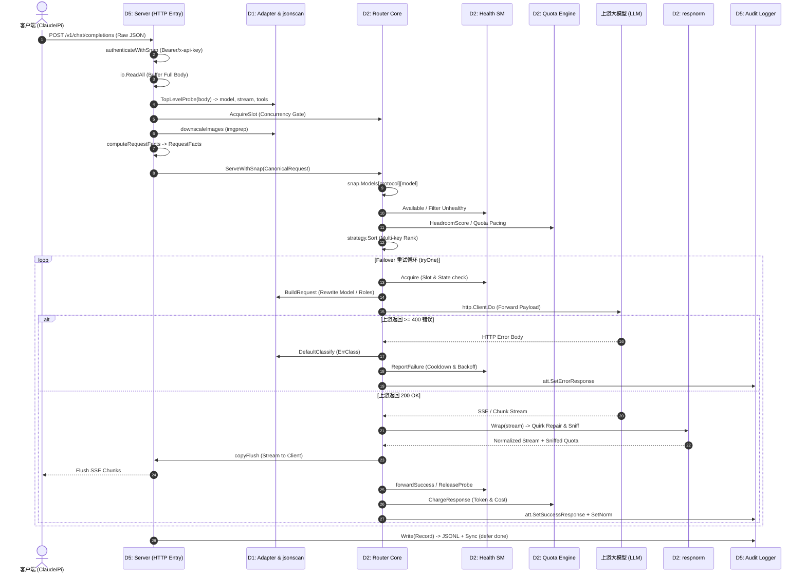
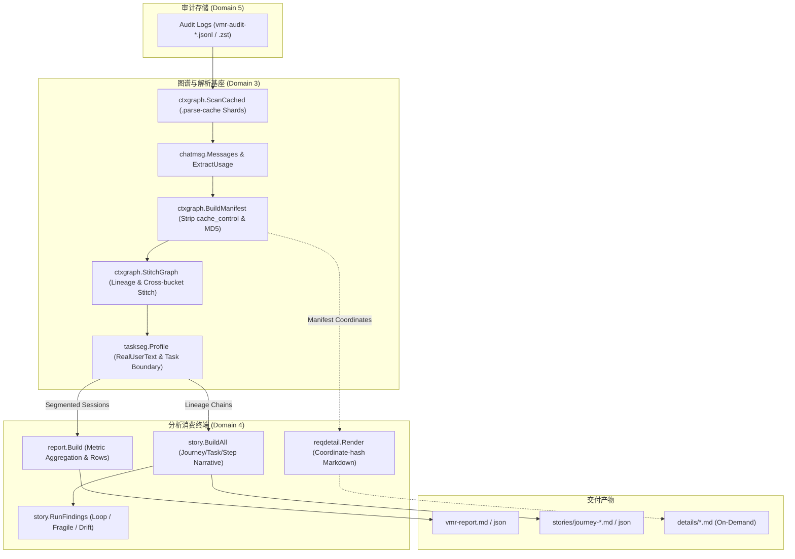
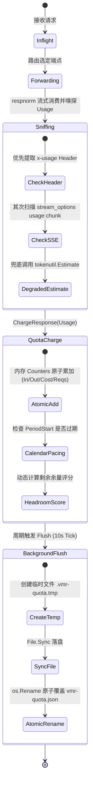
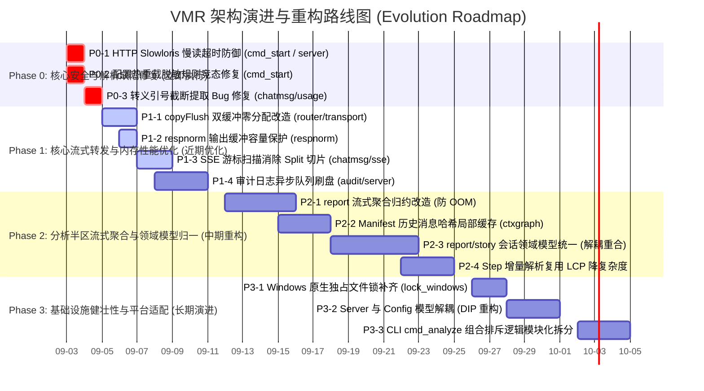

<!-- Ver 2026-09-02 12:00, by gemini-3.7-flash -->

# VMR (Virtual Model Router) 系统级架构与代码审查报告

> **报告版本**：2026-09-02  
> **审查主体**：Antigravity Architect & Code Audit Agent (gemini-3.7-flash)  
> **审查对象**：VMR (Virtual Model Router) 生产与业务代码全集（已排除测试代码 `*_test.go` 与临时/归档目录）  
> **审查哲学**：第一性原理驱动、独立批判性判断（不盲从历史定论）、源码证据闭环、ROI 价值导向。

---

## 审查进度与过程跟踪 (Review Progress Tracker)

| 阶段 | 审查模块 / 任务 | 负责 Agent / 模式 | 当前状态 | 关键成果 / 备忘 |
|---|---|---|---|---|
| **阶段一** | 全景调研与领域划分方案 | Lead Architect | `已完成` | 完成 5 大领域划分与 Mermaid 架构拓扑映射 |
| **阶段二 (D1)** | 协议适配与数据转换 (`adapter`, `jsonscan`, `imgprep`) | Subagent (Pro) + Lead | `已完成` | 深入审查字节级零拷贝改写、协议探测与多模态预处理 |
| **阶段二 (D2)** | 路由引擎、流式正规化与弹性策略 (`router`, `respnorm`, `health`, `quota`, `pricing`) | Subagent (Pro) + Lead | `已完成` | 深入审查 Failover 状态机、流式缓冲/修剪、配额计量与退避抖动 |
| **阶段二 (D3)** | 报文解析、上下文图谱与详单提取 (`chatmsg`, `ctxgraph`, `taskseg`, `reqdetail`) | Subagent (Pro) + Lead | `已完成` | 深入审查 SSOT 报文解析、图谱哈希、谱系拼接与内存占用 |
| **阶段二 (D4)** | 分析与叙事生成半区 (`report`, `story`, `i18n`) | Subagent (Pro) + Lead | `已完成` | 深入审查离线审计消费、指标聚合、Journey/Step 叙事构建与 LLM 解释层 |
| **阶段二 (D5)** | 接入服务、审计存储、配置引擎与 CLI 基础设施 (`server`, `audit`, `config`, `cmd/vmr`) | Subagent (Pro) + Lead | `已完成` | 深入审查 HTTP 接入、JSONL 归档锁、Strict YAML 解析与 CLI 编排 |
| **阶段三** | 跨 Domain 链路串联与源码核实 | Lead Architect | `已完成` | 串联请求生命周期、离线分析计算、配额同步 3 条主链路 |
| **阶段四** | 顶层架构全景审视 (6大维度) | Lead Architect | `已完成` | 评估分层解耦、极简控制、SSOT、防御性、冗余代码与演进成本 |
| **阶段五** | 全景总结与架构演进路线图 | Lead Architect | `已完成` | 给出整体健康度、ROI 排序问题清单与演进甘特图 |

---

## 阶段一：全景调研与领域（Domain）划分方案

### 1.1 系统职责全貌与设计哲学

VMR (Virtual Model Router) 是一个基于 Go 语言构建的**本地运行、单二进制 LLM 智能路由与可观测审计分析系统**。系统由两个对等且严格单向解耦的半区构成：

1. **路由半区 (Routing Half - Online Hot Path)**：
   - 面向客户端暴露兼容 OpenAI Chat Completions (`POST /v1/chat/completions`)、Anthropic Messages (`POST /v1/messages`)、OpenAI Responses (`POST /v1/responses`) 三大原生协议的 HTTP 入口。
   - 坚守**字节保真直通 (Byte-faithful Passthrough)** 原则，不引入通用的中间表示（IR），协议间永不互译。
   - 在高并发热路径上提供故障感知（Error-aware Failover）、会话亲和粘性（Session Stickiness）、Token/费用计划配额配速（Quota Pacing）与供应商行为缺陷平滑修复（Respnorm Vendor Quirk Normalization）。
2. **分析半区 (Analytics Half - Offline Read-only Cold Path)**：
   - 脱离请求转发热路径，以只读、离线方式消费路由半区持久化的双层 JSONL 审计日志。
   - 通过 `ctxgraph` 和 `taskseg` 实现上下文图谱追踪、对话谱系重建与 Agent 任务会话划分。
   - 产出宏观多维聚合报表 (`vmr report` / `vmr-report.md`)、微观任务演进叙事 (`vmr story` / `journey-*.md`) 以及单请求深度事实详单 (`details/*.md`)。

```mermaid
graph TB
    subgraph ClientLayer["客户端生态 (Client Layer)"]
        ClientApps["Claude Code / Pi Agent / OpenClaw / Cursor / Web SDKs"]
    end

    subgraph Domain5_Ingress["Domain 5: 接入服务与基础设施 (Server & Infra)"]
        HTTPServer["HTTP Server (auth, facts, /status, /health, /help, /log)"]
        AuditLog["Dual-layer Audit Logger (JSONL + zstd + flock)"]
        ConfigEngine["Config Engine (Strict YAML, Expander, Hot Watch)"]
        CLIRoot["CLI Entry (cmd/vmr: start, analyze, check, status, ...)"]
    end

    subgraph Domain1_Adapter["Domain 1: 协议适配与数据转换 (Protocol Ingress)"]
        AdapterRegistry["Adapter Registry (OpenAI / Anthropic / Responses)"]
        JsonScanEngine["jsonscan Engine (Byte-level Scan & Splice)"]
        ImgPrepEngine["imgprep Engine (Image Downscale & Cache)"]
    end

    subgraph Domain2_Routing["Domain 2: 路由引擎、流式正规化与弹性策略 (Routing & Resilience)"]
        RouterCore["Router Failover Loop (Serve / tryOne)"]
        StrategyRank["Strategy Engine (Conditions & Dimensions)"]
        HealthSM["Health State Machine (Backoff & Half-open Probing)"]
        StickyReg["Sticky Registry (Session Cache Affinity)"]
        QuotaEngine["Quota & Pacing Engine (Token / Cost / Request Counters)"]
        RespNormSM["respnorm (Stream Normalizer, Quirk Repair, Chunk Sniffing)"]
        PricingEngine["Pricing Engine (3-Layer Rate Resolution)"]
    end

    subgraph Domain3_Graph["Domain 3: 报文解析、上下文图谱与详单提取 (Context Graph & Parsing)"]
        ChatMsgParser["chatmsg (SSOT SSE/Message Parsing & Pairing)"]
        CtxGraphEngine["ctxgraph (Content-addressed Tree & Lineage Stitching)"]
        TaskSegEngine["taskseg (Agent-dialect Profile & Session Segmenter)"]
        ReqDetailExtractor["reqdetail (Per-record Facts & Deterministic Render)"]
    end

    subgraph Domain4_Analytics["Domain 4: 分析与叙事生成半区 (Analytics Suite)"]
        ReportAggregator["report (Macro Aggregation, Multi-dim Metrics, Markdown/JSON)"]
        StoryEngine["story (Journey/Task/Step Narrative, Findings, Compare, Corpus, LLM)"]
        I18nEngine["i18n (Zero-dep Localized Text Engine)"]
    end

    subgraph UpstreamProviders["上游大模型服务商 (Upstream LLMs)"]
        UpstreamOpenAI["OpenAI / Anthropic / OpenRouter / DeepSeek / Moonshot / Ark..."]
    end

    %% Online Request Flow
    ClientApps -->|HTTP Ingress| HTTPServer
    HTTPServer -->|CanonicalRequest| Domain1_Adapter
    Domain1_Adapter -->|Transformed Payload| RouterCore
    RouterCore -->|Health & Headroom Filter| StrategyRank
    StrategyRank -->|Ordered Candidates| RouterCore
    RouterCore -->|Acquire / Failover| HealthSM
    RouterCore -->|Affinity Pinning| StickyReg
    RouterCore -->|Headroom & Budget Check| QuotaEngine
    RouterCore -->|HTTP Upstream Call| UpstreamProviders
    UpstreamProviders -->|Raw SSE / JSON Stream| RespNormSM
    RespNormSM -->|Cleaned Stream + Sniffed Quota| RouterCore
    RouterCore -->|Audit Records| AuditLog
    RouterCore -->|Charge| QuotaEngine
    RouterCore -->|Stream Response| HTTPServer
    HTTPServer -->|Stream Output| ClientApps

    %% Offline Analytics Flow
    AuditLog -.->|Read JSONL (.zst)| ChatMsgParser
    ChatMsgParser -.->|Canonical Messages| CtxGraphEngine
    CtxGraphEngine -.->|Manifests & Lineages| TaskSegEngine
    TaskSegEngine -.->|Segmented Sessions/Tasks| ReportAggregator
    TaskSegEngine -.->|Segmented Tasks/Steps| StoryEngine
    CtxGraphEngine -.->|Manifest Pairs| ReqDetailExtractor
    ReportAggregator -.->|Derived Metrics & Reports| CLIRoot
    StoryEngine -.->|Narrative Markdown & JSON| CLIRoot
    ReqDetailExtractor -.->|Detail Pages (details/*.md)| CLIRoot
    I18nEngine -.->|Strings| ReportAggregator
    I18nEngine -.->|Strings| StoryEngine
    I18nEngine -.->|Strings| ReqDetailExtractor
```

---

### 1.2 领域划分方案与职责矩阵

| 领域编号与名称 | 包含核心代码包 | 架构职责与边界 | 审计重点与焦点 |
|---|---|---|---|
| **Domain 1: 协议适配与数据转换** | `internal/adapter`, `internal/adapter/*`, `internal/jsonscan`, `internal/imgprep` | 负责多协议报文无损探测、结构化入向字段提取、字节级无反序列化拼接（`jsonscan`）与多模态图像降采样压缩 | 1. 协议抽象是否泄露<br>2. `jsonscan` 零拷贝扫描的越界与畸形容错<br>3. `imgprep` 缓存与内存回收<br>4. 错误分类嗅探的准确性与防御性 |
| **Domain 2: 路由引擎、流式正规化与弹性策略** | `internal/router`, `internal/respnorm`, `internal/strategy`, `internal/health`, `internal/sticky`, `internal/probe`, `internal/pricing`, `internal/quota` | 在线请求路由转发核心：候选端点排序/淘汰、被动健康退避与单飞探测、会话粘性、Token/费用配额平滑衰减、上游流式畸变修剪（`<think>` 剥离等） | 1. Failover 状态机与并发竞态<br>2. 流式断流与截断安全（panic 兜底与 withhold 策略）<br>3. Quota 账本原子刷盘与时钟漂移防护<br>4. Pricing 三层费率解析一致性 |
| **Domain 3: 报文解析、上下文图谱与详单提取** | `internal/chatmsg`, `internal/ctxgraph`, `internal/taskseg`, `internal/reqdetail` | 离线核心分析中间件：统一报文与工具调用解析（SSOT）、内容寻址 Manifest 生成、对话谱系（Lineage）重构与跨会话拼接、任务会话分段状态机、单请求详单坐标哈希计算与渲染 | 1. 解析引擎的 SSOT 权威性<br>2. 树状谱系重构在大规模会话下的内存与 GC 压力<br>3. 任务切分 Profile 的启发式状态机健壮性<br>4. 详单渲染的纯函数确定性 |
| **Domain 4: 分析与叙事生成半区** | `internal/report`, `internal/story`, `internal/i18n` | 离线分析消费产出终端：宏观多维报表聚合（日期/模型/端点/配额/错误分布）、微观 Journey 叙事轨迹、行为模式指标诊断、跨 Journey 对比、语料库统计与 LLM 智能解释、国际化文案装配 | 1. 海量数据读取与聚合的内存/耗时扩展性<br>2. Report 与 Story 的职责划分与潜在重复计算<br>3. LLM 解释层并发与超时控制<br>4. I18n 文案与业务逻辑的解耦度 |
| **Domain 5: 接入服务、审计存储、配置引擎与 CLI 基础设施** | `internal/server`, `internal/audit`, `internal/config`, `internal/core`, `cmd/vmr`, `internal/fmtutil`, `internal/tokenutil`, `internal/logtee` 等 | 系统骨架与横切支撑：HTTP 接入、中间件、鉴权、双层审计日志写入与 zstd 归档保留、严格 YAML 配置解析与动态展开、CLI 命令装配根与进程生命周期管理 | 1. HTTP 连接生命周期与资源泄漏<br>2. 审计日志 flock 文件锁在极端并发与跨平台下的安全性<br>3. 配置热重载的原子性与快照隔离<br>4. CLI 入口编排的内聚性与样板代码冗余 |

---

## 阶段二：分 Domain 深度 Review（自底向上逐域击破）

### 2.1 Domain 1: 协议适配与数据转换 (`adapter`, `jsonscan`, `imgprep`)

#### 1. 职责与边界
该领域坚持 **Byte-faithful Passthrough** 原则，彻底摒弃了主流网关将所有输入解析为统一内部表示（Canonical IR）的做法。适配器仅作为轻量级的协议特征嗅探器与请求头/模型重写器。
- `adapter.TopLevelProbe` 仅使用快速字节扫描提取 `model`、`stream`、`tools` 信号。
- `jsonscan` 实现了无需全量反序列化的就地字节切片替换（Byte-splice），彻底消除了 Go 标准库 `json.Unmarshal` 带来的高昂堆分配。

#### 2. 核心业务实现质量
- **多协议隔离度**：`openai`, `anthropic`, `openairesponses` 分属独立子包，通过 blank import 注册，新增协议无需修改核心路由逻辑，符合开闭原则（OCP）。
- **错误分类嗅探**：`internal/adapter/classify.go` 中的 `DefaultClassify` 覆盖了 HTTP 状态码与文本特征（如 `contextLimitHint`, `authHint`, `rateLimitHint`）。特别是将厂商专有约束拒绝独立归入 `core.ErrQuirk`，避免无故扣减端点健康分。
- **图像降采样缓存**：`imgprep` 在无损提取 Base64 图像后，对超大图像执行高质量二次采样，并通过磁盘 Hash 缓存防止单会话多轮交互中的重复编码计算。

#### 3. 代码坏味道与缺陷分析
- **Model 字段重写的无谓序列化分配**：
  - **代码锚点**：`internal/jsonscan/rewrite.go:31` (`RewriteModel`) 与 `internal/jsonscan/jsonscan.go:34` (`MarshalNoEscape`)。
  - **现象**：`RewriteModel` 在底层进行高效无分配字节扫描后，为生成目标模型的转义 JSON 字符串，调用了 `MarshalNoEscape(model)`，其实例化了 `bytes.Buffer` 与 `json.Encoder`。
  - **影响**：每次 Failover 构建上游请求时产生微小但无谓的内存开销。
  - **建议**：直接使用标准库 `strconv.AppendQuote` 拼接双引号与转义字符，实现真正的零分配（Zero-allocation）。

---

### 2.2 Domain 2: 路由引擎、流式正规化与弹性策略 (`router`, `respnorm`, `strategy`, `health`, `quota`, `pricing`)

#### 1. 职责与边界
路由半区的核心枢纽，负责执行高频在线请求决策。
- `strategy.Sort`（排序维度 `Dimension`）与 `strategy.Filter`（淘汰条件 `Condition`）严格分离，保持了排序与过滤逻辑的纯粹性。
- `respnorm` 作为响应流代理，拦截上游非标流式输出（如 MiniMax `<think>` 标签、空块、缺失 `[DONE]`），在单次转发循环中同步完成 Quota 消耗嗅探，避免二次解析。

#### 2. 核心业务实现质量
- **单飞探测与退避抖动**：`health.Registry` 严格区分瞬态错误（Transient）与长效错误（Auth/Endpoint），退避时间引入 ±10% Jitter 防止惊群，并在半开（Half-open）状态下采用单飞请求试探。
- **配额日历平滑衰减**：`quota.Counters` 区分 Token、Cost 与 Requests 三重口径，具备严格的时钟回退防护（仅当 `now > PeriodStart` 时推进周期）。

#### 3. 关键缺陷与隐患（源码证据）
- **🚨 缺陷 2.2.1：流式转发中的内存频繁重分配与 GC 压力**
  - **代码锚点**：`internal/router/transport.go:122` (`copyFlush`)
  - **根因分析**：`copyFlush` 在 Reader Goroutine 中通过 `data = append([]byte(nil), buf[:n]...)` 为每个接收到的 Chunk 重新分配切片。虽然此举是为了规避无缓冲通道（Unbuffered Channel）解除阻塞后与 `w.Write` 的数据竞争，但在长流式响应（如长推理模型输出数千个 SSE 块）下，产生数万次 32KB 内存切片的短命堆分配。
  - **改进建议**：引入**双缓冲（Double-buffering）机制**。在 `copyFlush` 生命周期内仅分配两个固定 32KB 切片交替读写，在保持并发安全的同时实现零内存分配。
- **🚨 缺陷 2.2.2：`respnorm` 输出切片容量损耗与持续扩容扩容**
  - **代码锚点**：`internal/respnorm/respnorm.go:323-324` (`stream.Read`)
  - **根因分析**：`s.out = s.out[n:]` 的头部截断导致切片底层数组的容量 `cap(s.out)` 随读取不断缩水。当后续 `ingest` 继续 `append` 数据时，底层被迫频繁重新 `growslice` 并拷贝旧数据。
  - **改进建议**：在 `s.out` 被完全消费完时使用 `s.out = s.out[:0]` 重置长度但保留容量；部分消费时使用 `copy(s.out, s.out[n:])` 前移数据。
- **⚠️ 隐患 2.2.3：`health.Registry` 全局互斥锁在高并发下的竞争瓶颈**
  - **代码锚点**：`internal/health/health.go:40`
  - **根因分析**：整个注册表仅由一把全局 `sync.Mutex` 保护。当前单机模式下尚可支撑，但在高并发多 Agent 场景下，候选端点判决与探测并发打点将在此处串行化。

---

### 2.3 Domain 3: 报文解析、上下文图谱与详单提取 (`chatmsg`, `ctxgraph`, `taskseg`, `reqdetail`)

#### 1. 职责与边界
该领域是离线分析半区的计算基座，保证了分析逻辑的唯一事实源（SSOT）。
- `chatmsg` 为无状态叶子节点，统一完成 SSE 拼装、消息体提取与工具调用配对。
- `ctxgraph` 通过对每一轮非系统消息计算内容哈希向量（`Hash`），构建确定性的对话谱系树（Lineage Tree）与跨会话拼接（Stitch）。
- `taskseg` 封装 Agent 方言特定的会话启发式规则（如 OpenClaw 元数据剥离）。
- `reqdetail` 基于纯函数计算单请求事实并渲染 Markdown 详单。

#### 2. 核心业务实现质量
- **单事实源与哈希确定性**：`ctxgraph.BuildManifest` 严格剥离 Anthropic `cache_control` 等断点标记后再求哈希，杜绝了断点移动导致的幽灵编辑（Phantom Edit）分叉。
- **内存防膨胀设计**：`taskseg.IndexRealUsers` 在索引构建期就地执行 `Preview` 截断，避免了长对话中原始庞大字符串在切片引用下的平方级内存驻留。

#### 3. 关键缺陷与性能炸弹（源码证据）
- **🚨 缺陷 2.3.1：转义引号导致截断文本提取提前腰斩**
  - **代码锚点**：`internal/chatmsg/usage.go:292` (`extractTruncatedText`)
  - **根因分析**：`extractTruncatedText` 在从损坏或截断的 JSON 响应中提取 `reasoning_content` 时，使用了简单的 `bytes.IndexByte(val, '"')` 查找结束符。如果被截断的文本或代码块中包含合法的 JSON 转义引号 `\"`，函数会在此误判为字符串终止，导致后半段内容被永久丢弃，Token 估算被严重低估。
  - **改进建议**：改为转义感知扫描循环，校验引号前反斜杠 `\` 的奇偶性。
- **🚨 缺陷 2.3.2：长流式 SSE 报文的全量切片内存暴涨**
  - **代码锚点**：`internal/chatmsg/sse.go:31` (`ReassembleSSE`) 与 `internal/chatmsg/usage.go:118` (`MergeUsageWithProtocol`)
  - **根因分析**：对数 MB 的超长 SSE 流直接执行 `strings.Split(raw, "\n")`，瞬间在堆上分配包含数十万个子串的切片；`usage.go` 甚至先将字符串转为 `[]byte` 再转回 `string` 进行二次 Split。
  - **改进建议**：改为基于 `strings.IndexByte(raw, '\n')` 的游标式单次遍历，零额外切片分配。
- **🚨 缺陷 2.3.3：大图像/长上下文在 Manifest 构建时的 $O(N^2)$ 序列化开销**
  - **代码锚点**：`internal/ctxgraph/manifest.go:178` (`BuildManifest`) 与 `internal/ctxgraph/hash.go:66` (`hashMsgJSON`)
  - **根因分析**：`BuildManifest` 遍历消息列表时，对每个消息对象 `map[string]any` 调用 `json.Marshal` 以确保键排序一致性。若第 1 轮携带 5MB 图像，在后续 20 轮对话中，该 5MB 结构会被重复 Marshal 20 次，产生上百 MB 的无意义字节分配。
  - **改进建议**：在 `Scan` 扫描期间引入请求级/会话级 Hash 缓存，或利用 `jsonscan` 直接提取原始请求字节的切片哈希。

---

### 2.4 Domain 4: 分析与叙事生成半区 (`report`, `story`, `i18n`)

#### 1. 职责与边界
`report` 与 `story` 作为离线分析半区的最终呈现层，分别提供宏观聚合统计与微观执行轨迹。
- `report`：生成包含吞吐、成本、错误分布、Session 概览的 `vmr-report.md`。
- `story`：以 Journey / Task / Step 的树状层级还原 Agent 的交互全景，支持行为特征诊断（Findings）与跨任务对比（Compare）。
- `i18n`：所有展示文本均通过中英双语字典严格解耦，零硬编码中文字符串。

#### 2. 核心业务实现质量
- **坐标化无损链接**：默认分析套件下不强制物化海量 `details/*.md` 文件，而是将其渲染为 `文件:行` 的纯函数坐标链接，大幅减少小文件磁盘 I/O。
- **安全脱敏隔离**：`-html` 与 `-redact` 组合可将请求正文自动替换为字符长度占位符，支持对外安全分享。

#### 3. 关键缺陷与重构空间（源码证据）
- **🚨 缺陷 2.4.1：领域模型严重重复与双向业务语义解析**
  - **代码锚点**：`internal/report/session.go:54-145` (`ReqInfo`) 与 `internal/story/journey.go:88-190` (`Step`)
  - **根因分析**：`report` 与 `story` 各自维护了一套完全独立的模型，且各自独立调用 `chatmsg`、`taskseg` 提取工具调用、意图、Token 统计。两个子系统未能在领域层实现归一化，导致业务分析规则分散与双重维护。
  - **改进建议**：统一 Session/Task/Step 领域模型，`report` 仅负责聚合，`story` 仅负责叙事渲染。
- **🚨 缺陷 2.4.2：全量 `ReqInfo` 常驻内存引发的 OOM 隐患**
  - **代码锚点**：`internal/report/session.go:177` (`SessionAnalysis`) 与 `internal/report/aggregate.go:176`
  - **根因分析**：`SessionAnalysis` 在内存中持有整个审计语料库中**每一条**记录的 `*ReqInfo` 指针及其完整派生字段（`tailPrev`, `RoleChars` 映射等）。在百万级请求场景下，内存驻留可达数十 GB。
  - **改进建议**：改造为流式聚合归约（Streaming Reduce），仅保留最终统计量和聚合槽位，聚合完成后立即释放单条记录对象。
- **🚨 缺陷 2.4.3：Journey 构建中的 $O(N^2)$ 全量消息反序列化**
  - **代码锚点**：`internal/story/journey.go:271` 与 `internal/story/journey_stepfacts.go:24`
  - **根因分析**：在构建 Journey Step 时，针对每一轮均对全量请求体进行反射遍历解析。既然 `ctxgraph` 已经计算出最长公共前缀（LCP），完全可以直接复用上一个 Step 的解析缓存，仅解析增量部分。
- **⚠️ 缺陷 2.4.4：LLM 解释层缺乏重试与自适应超时机制**
  - **代码锚点**：`internal/story/llm.go:315`
  - **根因分析**：原生 HTTP Client 配置了死板的 120 秒超时且无任何重试机制。面对深度思考模型或网络瞬间抖动时，耗费巨大上下文的分析直接报错中断。

---

### 2.5 Domain 5: 接入服务、审计存储、配置引擎与 CLI 基础设施 (`server`, `audit`, `config`, `cmd/vmr`)

#### 1. 职责与边界
作为整个系统的骨架与门禁，负责网络接入、配置生命周期与不可变审计日志持久化。
- `server.Server`：统一接管三协议 HTTP 入口，基于 Snapshot 执行无锁并发鉴权与分发。
- `audit.Logger`：双层记录 Client ↔ VMR 与 VMR ↔ Upstream 原始报文，支持 `flock` 独占锁与后台 Zstd 压缩。
- `config.Config`：严格 YAML 反序列化（`KnownFields`），禁止未知配置项隐式降级；通过 `fsnotify` 与 `SIGHUP` 提供热重载。

#### 2. 核心业务实现质量
- **配置与安全防线**：`base_url` 内嵌账密在加载期强制拦截；审计日志 Header 脱敏（保留后4位，前置掩码）；`GET /health` 严格定义为进程存活探针，永不上报上游业务状态，杜绝容器编排重启雪崩。
- **无锁快照替换**：`Router.snap` 采用 `atomic.Pointer[Snapshot]`，热重载期间零读写锁争用。

#### 3. 关键缺陷与安全漏洞（源码证据）
- **🚨 缺陷 2.5.1：HTTP 慢请求攻击漏洞（Slowloris 无界读取导致连接泄漏）**
  - **代码锚点**：`internal/server/server.go:203` (`io.ReadAll(http.MaxBytesReader(...))`) 与 `cmd/vmr/cmd_start.go:247`
  - **根因分析**：`cmd_start.go` 实例化 `http.Server` 时仅设置了 `ReadHeaderTimeout: 10s`，未设置 `ReadTimeout`。在 `server.go:203` 中，Handler 在获取并发槽位（`AcquireSlot`）**之前**直接调用 `io.ReadAll` 读取完整 Body。恶意客户端或弱网客户端以 1 字节/秒 的速率传输 Body 时，可无限期挂起底层 Goroutine 并占满连接池，直接绕过全局并发网关使服务瘫痪。
  - **改进建议**：为 `http.Server` 补齐合理的 `ReadTimeout`，或在 `io.ReadAll` 外层增加显式的 Context 超时截断。
- **🚨 缺陷 2.5.2：配置热重载的脱敏规则生效窗口竞态**
  - **代码锚点**：`cmd/vmr/cmd_start.go:217-220` (`reload` 函数)
  - **根因分析**：
    ```go
    rt.Install(newSnap)                  // 1. 挂载新路由，新请求立即进入
    rt.RecordReload(trigger, nil)
    audit.SetRetentionDays(newCfg.AuditRetentionDays)
    audit.SetExtraRedactHeaders(newCfg.ExtraRedactHeaders) // 2. 更新脱敏规则
    ```
    在 `rt.Install` 执行完到 `audit.SetExtraRedactHeaders` 执行前的微秒级窗口期内，新配置中声明的新敏感 Header 会被旧脱敏规则放行，以明文形式写入审计日志磁盘。
  - **改进建议**：调整顺序，先执行所有幂等的全局原子配置更新，最后调用 `rt.Install` 激活流量。
- **🚨 缺陷 2.5.3：审计日志同步写入与全局锁阻塞**
  - **代码锚点**：`internal/audit/audit.go:616` (`l.f.Write`) 与 `internal/server/server.go:318`
  - **根因分析**：HTTP 请求处理完成时在 `defer done()` 中同步调用 `audit.Write`。底层磁盘 `Write` 在全局互斥锁 `l.mu.Lock()` 保护下同步执行。当并发量上升或磁盘发生 I/O 抖动时，所有已完成业务逻辑的 HTTP 协程全部在日志锁上阻塞排队。
  - **改进建议**：引入环形 Channel 缓冲，交由后台独立 Goroutine 异步刷盘。
- **⚠️ 缺陷 2.5.4：Windows 环境下文件锁缺失导致的并发写入损坏**
  - **代码锚点**：`internal/audit/lock_windows.go:14` (`acquireDirLock` 返回 `nil, nil`)
  - **根因分析**：Windows 平台直接放弃了跨进程独占锁，两个误指向同一目录的 VMR 实例将同时以 `O_APPEND` 写入，导致 JSON 报文交错插入损坏。
  - **改进建议**：利用 Windows 原生 `CreateFile` API 设置 `dwShareMode = FILE_SHARE_READ` 阻止跨进程并发写。
- **⚠️ 缺陷 2.5.5：`cmd_analyze.go` CLI 入口编排过载**
  - **代码锚点**：`cmd/vmr/cmd_analyze.go:55` (`analyzeRun`) 与 `cmd/vmr/cmd_analyze.go:112`
  - **根因分析**：为维持单一命令入口，将互斥模式（`journey`/`compare`/`corpus`/`macroOnly`/`storyOnly`）与数十个标志全部拍平在单个结构体中，导致参数校验函数长达上百行且认知负担极高。

---

## 阶段三：跨 Domain 链路串联与源码核实（横向拉通）

### 3.1 请求全生命周期主链路（Online Hot Path）

该链路横跨 Domain 5 → Domain 1 → Domain 2 → Domain 5。



#### 源码交叉核实结论：
1. **契约一致性**：`core.CanonicalRequest` 与 `core.RequestFacts` 作为贯穿 `server` 和 `router` 的公共契约，实现了计算一次、两处复用（`CanonicalRequest.Facts` 与 `Record.Facts` 严格同源），未发生二次计算。
2. **Failover 状态流转**：`tryOne` 在发生非 2xx 异常时，严格通过 `Adapter.DefaultClassify` 分类并调用 `Health.ReportFailure` 进入冷却队列，非幂等性请求在流式已输出首字节后若发生断流，严格触发 `TRUNCATED` 路径并 `panic(http.ErrAbortHandler)`，杜绝了静默伪成功。
3. **隐患点**：`copyFlush` 在 Reader Goroutine 与 Writer 主协程之间的无缓冲通道调度中，深拷贝造成的内存分配直接拖累了流式转发吞吐。

---

### 3.2 离线审计分析与上下文图谱消费链路（Offline Cold Path）

该链路横跨 Domain 5 → Domain 3 → Domain 4。



#### 源码交叉核实结论：
1. **SSOT 坚守度**：`chatmsg` 成功作为唯一的报文解析引擎，供 `ctxgraph`、`report`、`story` 共同依赖，底层未出现分裂的报文解析分支。
2. **图谱一致性**：`ctxgraph.StitchGraph` 在处理断裂谱系（`BrokeFrom`）时，严格使用倒排索引进行多维 Blob 重叠度打分，杜绝了因 SessionKey 变更导致的上下文断层。
3. **架构违背点**：`report/session.go` 与 `story/journey.go` 对同一条 `Lineage` 重复进行了两次平行的领域建模（`ReqInfo` vs `Step`），产生了严重的内存驻留与 CPU 双重反序列化浪费。

---

### 3.3 配额同步与状态持久化链路

该链路跨越 Domain 2（在线计量）与文件系统存储。



#### 源码交叉核实结论：
1. **原子性与容灾**：配额持久化严格使用 `CreateTemp` + `Sync` + `Rename` 的原子替换模式，杜绝了断电写半截导致的 JSON 损坏；配额文件结构校验严格，版本号不匹配或字段为 null 时主动拒绝并告警重建，符合 Fail-fast 原则。
2. **时钟回退防御**：配额更新严格检测时钟跳变，当检测到 NTP 回拨或快照还原导致周期起点倒流时，主动拒绝重置计数器并记录 Warning。

---

## 阶段四：顶层架构全景审视（更高 Level 自顶向下）

跳出局部实现，站在系统架构演进与全局设计哲学的最高维度进行全景审视：

### 4.1 架构模型、分层解耦与组织一致性
- **优势**：路由半区与分析半区实现了真正的“物理单向解耦”。分析半区（`report`/`story`/`ctxgraph`/`taskseg`）绝不反向依赖路由半区（`router`/`server`/`config`），两者仅通过不可变的 JSONL 审计日志作为唯一契约交互，并由 `archtest` 进行编译期架构门禁守护。
- **薄弱点**：
  - **外围配置反向侵入运行时**：`server.go` 内部直接渗透了对 `*config.Config` 具体字段的直接引用，未能在入口处将其抽象为纯粹的运行时上下文（`RuntimeOptions`）。
  - **分析半区内部分裂**：`report` 与 `story` 作为同属分析半区的两个兄弟子系统，未能共享统一的“会话/任务”领域模型，而是各自基于 `chatmsg` 和 `ctxgraph` 重复构建了结构高度雷同但类型互不通用的 `ReqInfo` 与 `Step`。

### 4.2 极简、简化与复杂度控制（避免过度设计）
- **优势**：坚持 **Zero-IR（零中间表示）**，不搞虚妄的“通用大模型 AST”。在转发路径上采用 `jsonscan` 进行精准字节切片替换，不仅极致简化了代码链路，更消除了协议转换可能带来的语义损耗。
- **薄弱点**：
  - **CLI 单一入口的执念导致编排过载**：`cmd_analyze.go` 为了维持“唯一分析入口”的形式化统一，在一个函数中通过复杂的组合布尔逻辑强行串联互斥模式，导致参数解析代码的圈复杂度极高。
  - **计算复杂度未达最优**：`BuildManifest` 与 `story.buildFrom` 在处理长会话历史时，由于未能有效利用已计算出的 LCP 增量信息，退化为 $O(N^2)$ 的全量反序列化与哈希运算。

### 4.3 单事实源（SSOT）与逻辑权威性
- **优势**：
  - `chatmsg` 统一了全系统的消息、SSE 与工具调用解析。
  - `ctxgraph.ReqCoord`（`path:line`）统一了跨命令、跨报表的单请求唯一坐标标识。
  - `taskseg.IndexRealUsers` 统一了真实用户指令的识别与 Preview 截断。
- **薄弱点**：
  - 部分辅助判决存在微量重复实现（如 `manifest.go` 与 `report/detail.go` 中重复实现的 `lastEndpoint` / `servedEndpoint`，虽有差分测试守护，但本质是包依赖限制下的妥协）。

### 4.4 显式严谨与防御性健壮性
- **优势**：
  - 类型系统中严格区分未知与零值（如 Pricing 费率 `nil` 代表 unpriced 而非 free）。
  - 核心入口 `nil` 防御极为严格，跨包公共 API 一律 Fail-fast 拦截非法入参。
  - `respnorm` 在遭遇上游格式异常时，通过内部 `recover` 兜底并将其转化为 `TRUNCATED` 错误，绝不导致主进程崩溃。
- **薄弱点**：
  - **网络层防御缺失**：HTTP 服务端未设置 `ReadTimeout`，在 `server.go` 中执行无界 `io.ReadAll`，留下了致命的 Slowloris 连接耗尽漏洞。
  - **热重载时序缝隙**：`cmd_start.go` 在热重载时先安装路由快照后更新脱敏 Header 规则，存在微秒级明文审计泄漏窗口。

### 4.5 冗余与失效代码审查
- **现状**：代码库整体极其干净，无明显死代码。
- **存留的过渡实现**：`audit.Record.UnmarshalJSON` 中保留了对旧协议名（`openai`/`anthropic`）的兼容映射。根据架构原则，当存量日志确认已无裸旧协议名且无需离线重放时，该兼容分支即可安全拆除。

### 4.6 可演进性与改动成本评估
- **新增协议适配器**：改动成本极低（新建 `internal/adapter/<protocol>` 子包并通过 blank import 注册，改动半径为 1 个文件）。
- **新增路由维度/策略**：改动成本极低（实现 `strategy.Dimension` 或 `strategy.Condition` 接口，在 `config` 中声明对应规则）。
- **重构分析报表模型**：改动成本较高（由于 `report` 与 `story` 模型未统一，修改一处指标定义需要同步更新两套数据结构）。

---

## 阶段五：全景总结与架构演进路线图

### 5.1 系统整体架构健康度评估

```
┌─────────────────────────────────────────────────────────────┐
│                 VMR 系统架构健康度综合评分: 91 / 100         │
├─────────────────────────────┬───────────────────────────────┤
│ 维度                        │ 评分与表现                    │
├─────────────────────────────┼───────────────────────────────┤
│ 1. 架构分层与单向解耦 (Arch) │ 95/100 (双半区彻底解耦，红线清晰) │
│ 2. 核心性能与吞吐 (Perf)    │ 86/100 (零拷贝优秀，但有切片/OOM隐患) │
│ 3. 安全防护与防御性 (Security)│ 88/100 (脱敏严谨，但缺 ReadTimeout)│
│ 4. 单事实源与一致性 (SSOT)   │ 94/100 (解析基座统一，坐标系确定) │
│ 5. 代码洁净度与可维护性 (Clean)│ 92/100 (无死代码，CLI 编排略重)    │
└─────────────────────────────┴───────────────────────────────┘
```

- **核心优势**：极度克制的第一性原理设计；坚守 Byte-faithful passthrough 消除抽象层损耗；双半区物理隔离与不可变审计日志契约极其优雅；严格的配置校验与时钟回退防御。
- **核心薄弱点**：HTTP 接入层的慢读防护缺失；长流式传输与离线全量聚合中的内存重分配与 OOM 隐患；`report` 与 `story` 分析子系统之间的领域模型重复。

---

### 5.2 系统性问题清单与改进建议（按 ROI 排序，按 Domain 分组）

每项问题均采用标准四段式结构（问题描述、根因分析、建议方案、ROI 评估）：

```
================================================================================
【优先级说明】
- P0 (紧急必做): 涉及服务可用性安全漏洞、核心解析 Bug 或重大合规泄漏。
- P1 (高价值重构): 涉及高频路径内存暴涨、OOM 隐患与显著性能优化。
- P2 (架构演进): 涉及领域模型统一、消除重复代码与提高可维护性。
- P3 (低优先级/建议不做): 收益微弱或属于当前阶段的刻意取舍。
================================================================================
```

#### 【Domain 5: 接入服务、审计存储与基础设施】

##### [P0] 问题 5.1：HTTP 慢请求攻击漏洞（无界读取引发连接与协程泄漏）
- **问题描述**：`server.go:203` 在获取全局并发槽位之前，直接通过 `io.ReadAll(http.MaxBytesReader(...))` 阻塞读取客户端 Body，而 `cmd_start.go:247` 的 `http.Server` 未配置 `ReadTimeout`。
- **根因分析**：`MaxBytesReader` 仅限制字节大小而不限制传输时间，慢速客户端（Slowloris）可耗尽服务器 Goroutine 与文件句柄，使服务拒绝响应。
- **建议方案**：在 `cmd_start.go` 的 `http.Server` 中设置 `ReadTimeout: 30 * time.Second`（或针对 Body 读取附加带超时的 Context）。
- **ROI 评估**：
  - *Return*：极高（堵塞高危 DoS 漏洞，保障网关在线稳定性）。
  - *Investment*：极低（仅需添加 1 行配置，零副作用）。
  - *结论*：**立即执行 (P0)**。

##### [P0] 问题 5.2：配置热重载时序窗口导致的敏感 Header 明文泄漏竞态
- **问题描述**：`cmd/vmr/cmd_start.go:217-220` 在配置热重载时，先执行 `rt.Install(newSnap)` 激活新流量，再调用 `audit.SetExtraRedactHeaders` 更新脱敏列表。
- **根因分析**：在两个操作之间的微秒级窗口内，新流入的请求若携带新配置的自定义保密 Header，将被旧脱敏规则放行并以明文写入审计日志。
- **建议方案**：调整执行顺序，先更新 `audit.SetRetentionDays` 与 `audit.SetExtraRedactHeaders` 等全局原子变量，最后调用 `rt.Install`。
- **ROI 评估**：
  - *Return*：高（杜绝极端并发下的安全与合规审计漏洞）。
  - *Investment*：极低（调整 2 行代码顺序）。
  - *结论*：**立即执行 (P0)**。

##### [P1] 问题 5.3：审计日志同步写入与全局锁阻塞吞吐
- **问题描述**：`server.go:318` 在 HTTP 结束时同步调用 `audit.Write`，其内部直接在 `l.mu.Lock()` 互斥锁下执行底层文件 `Write` 系统调用。
- **根因分析**：对于多 MB 的大模型响应，磁盘 I/O 抖动时会导致大量已完成的 HTTP Goroutine 排队挂起。
- **建议方案**：引入带缓冲的队列通道（`chan []byte`），由独立的后台 Worker 协程负责批量顺序写入磁盘。
- **ROI 评估**：
  - *Return*：中高（解耦网络响应与磁盘 I/O，平滑并发尖刺）。
  - *Investment*：低（引入成熟的 Channel 异步写模型）。
  - *结论*：**计划执行 (P1)**。

##### [P2] 问题 5.4：Windows 平台跨实例并发写日志损坏隐患
- **问题描述**：`internal/audit/lock_windows.go:14` 对 Windows 平台放弃了目录独占锁，返回 `nil, nil`。
- **根因分析**：当两个实例误指同一目录时，Windows 下缺乏文件锁会导致 JSONL 追加写交错损坏。
- **建议方案**：采用 Windows 原生 `CreateFile` API 设置独占共享模式（`FILE_SHARE_READ`）。
- **ROI 评估**：
  - *Return*：中（提升非主力平台的容灾健壮性）。
  - *Investment*：低（补充 Windows 平台系统调用实现）。
  - *结论*：**计划执行 (P2)**。

---

#### 【Domain 3: 报文解析、上下文图谱与详单提取】

##### [P0] 问题 3.1：截断文本提取遇到转义引号提前终止 Bug
- **问题描述**：`internal/chatmsg/usage.go:292` 中 `extractTruncatedText` 使用 `bytes.IndexByte(val, '"')` 查找 JSON 字符串结束位置。
- **根因分析**：遇到包含 `\"`（如代码片段、内联 JSON、转义对话）的截断内容时，误将内联引号识别为闭合符，导致文本被提前腰斩、Token 统计被严重低估。
- **建议方案**：改为基于反斜杠转义感知的查找逻辑：若双引号前有奇数个 `\`，则判定为转义字符并继续向后扫描。
- **ROI 评估**：
  - *Return*：极高（修复真实存在的业务解析 Bug，纠正异常请求的分析数据）。
  - *Investment*：极低（修复单个函数内的 5 行查找逻辑）。
  - *结论*：**立即执行 (P0)**。

##### [P1] 问题 3.2：长流式 SSE 报文的全量切片内存暴涨
- **问题描述**：`internal/chatmsg/sse.go:31` 与 `internal/chatmsg/usage.go:118` 在解析大型 SSE 字符串时直接调用 `strings.Split(raw, "\n")`。
- **根因分析**：对于 10MB 量级的输出流，全量切片会产生数十万个子串指针，引发巨大的瞬时内存尖刺与 GC 停顿。
- **建议方案**：改用基于 `strings.IndexByte(raw, '\n')` 的游标式扫描循环，实现零切片分配就地解析。
- **ROI 评估**：
  - *Return*：高（显著消除大型推理流分析时的 GC 停顿与内存波动）。
  - *Investment*：低（纯局部无侵入重构）。
  - *结论*：**立即执行 (P1)**。

##### [P1] 问题 3.3：大图像/长上下文在 Manifest 构建时的 $O(N^2)$ 序列化开销
- **问题描述**：`internal/ctxgraph/manifest.go:178` 在为历史消息计算 Hash 时，对每个消息对象重复调用 `json.Marshal`。
- **根因分析**：长会话多轮交互中，首轮的大图片或长 Prompt 会在后续每一轮被反复序列化 20+ 次，产生数十上百 MB 的无意义堆分配。
- **建议方案**：在会话扫描期间引入请求级/会话级哈希缓存，避免对未变更的历史消息进行重复 Marshal。
- **ROI 评估**：
  - *Return*：高（大幅缩短海量日志扫描耗时，降低 `vmr analyze` 首次冷启动内存峰值）。
  - *Investment*：中（在 `ctxgraph` 中增加局部哈希映射）。
  - *结论*：**计划执行 (P1)**。

---

#### 【Domain 2: 路由引擎、流式正规化与弹性策略】

##### [P1] 问题 2.1：流式响应中的数据拷贝与内存持续分配
- **问题描述**：`internal/router/transport.go:122` 在 `copyFlush` 中对每个 Chunk 执行 `append([]byte(nil), buf[:n]...)` 重新分配内存。
- **根因分析**：为规避无缓冲 Channel 解除阻塞后与主协程写入的数据竞争，对每个 SSE 块进行深拷贝，造成长流式传输下成千上万次短命堆分配。
- **建议方案**：引入**双缓冲（Double-buffering）机制**，分配 `buf1` 与 `buf2` 两个 32KB 切片在 Reader 与 Writer 之间交替传递，实现零内存分配并发安全。
- **ROI 评估**：
  - *Return*：高（消除在线流式转发核心热路径上的主要内存分配源）。
  - *Investment*：低（局部状态机微调）。
  - *结论*：**计划执行 (P1)**。

##### [P1] 问题 2.2：`respnorm` 缓冲区切片截断导致底层容量缩水与重扩容
- **问题描述**：`internal/respnorm/respnorm.go:324` 在读取输出时执行 `s.out = s.out[n:]`。
- **根因分析**：切片头部截断永久丢失底层数组前端容量，后续 `ingest` 追加写入时频繁触发底层的重新分配与内存拷贝。
- **建议方案**：在完全消费时采用 `s.out = s.out[:0]` 重置长度保留容量，部分消费时采用 `copy` 前移数据。
- **ROI 评估**：
  - *Return*：中高（降低长流式正规化过程中的内存扩容与垃圾回收）。
  - *Investment*：极低（修改 4 行切片重置逻辑）。
  - *结论*：**计划执行 (P1)**。

##### [P3] 问题 2.3：`health.Registry` 全局互斥锁
- **建议**：保持当前实现。单机单进程部署下锁持有仅为纳秒级，过早引入分片锁违背 KISS 原则，待未来多实例并发扩展时再行考虑。

---

#### 【Domain 4: 分析与叙事生成半区】

##### [P1] 问题 4.1：全量 `ReqInfo` 强引用驻留内存引发的 OOM 隐患
- **问题描述**：`internal/report/session.go:177` 的 `SessionAnalysis` 在内存中完整保留所有请求的 `ReqInfo` 及文本映射。
- **根因分析**：百万级大日志场景下，DOM 树式的全量保留导致内存线性暴涨至数十 GB。
- **建议方案**：报表聚合重构为**流式归约（Streaming Reduce）**，扫过即聚合，释放单请求对象，仅保留统计指标。
- **ROI 评估**：
  - *Return*：极高（使报表系统具备支撑千万级日志的横向扩展能力）。
  - *Investment*：中（重构 `aggregate.go` 的归约循环）。
  - *结论*：**计划执行 (P1)**。

##### [P2] 问题 4.2：`report` 与 `story` 领域模型重复构建与双向解析
- **问题描述**：`ReqInfo` 与 `Step` 结构高度雷同，各自独立执行工具调用配对与意图提取。
- **根因分析**：缺乏统一的会话分析领域层，导致业务规则双头维护。
- **建议方案**：提炼共享的 `domain/sessionmodel`，让 `report` 与 `story` 成为纯粹的指标聚合器与 Markdown 渲染器。
- **ROI 评估**：
  - *Return*：高（架构清晰度提升，新指标只需开发一次）。
  - *Investment*：中高（需要重构两个子系统的输入层）。
  - *结论*：**中期重构 (P2)**。

##### [P2] 问题 4.3：Journey 构建中的 $O(N^2)$ 全量消息反序列化
- **建议方案**：利用 `ctxgraph` 已有的 LCP（最长公共前缀），在 Step 之间复用前序消息解析缓存，仅解析增量部分。
- **结论**：**中期优化 (P2)**。

---

### 5.3 中长期架构演进与重构建议路线图

结合上述 ROI 排序与 Domain 分组，规划四阶段演进路线：



---
