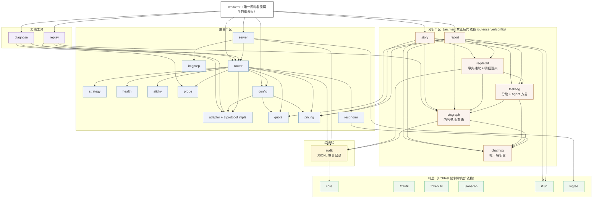
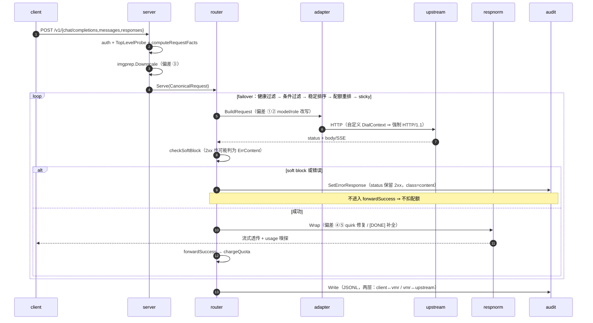
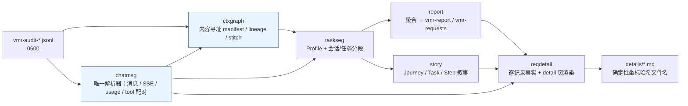
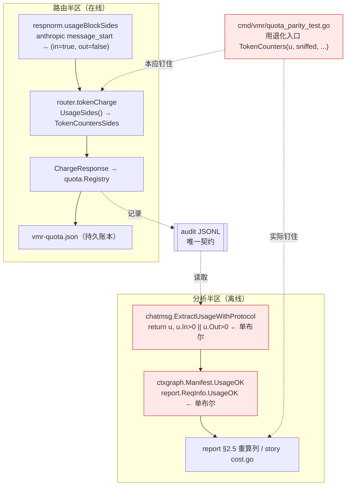
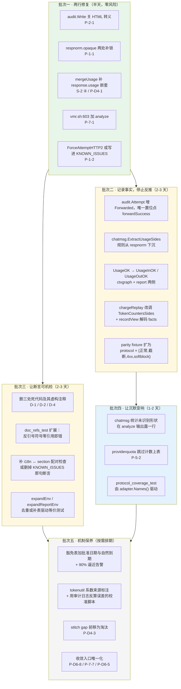

<!-- Ver 2026-09-02, by Opus 5 -->

# vmr 全量系统 Review 报告

> 评审模型：Claude Opus 5 ｜ 日期：2026-09-02 ｜ 基线 commit：`71d409e`
>
> 方法：五阶段协议（`docs/prompts/prompt-full-review.md`）。Domain 深评由 7 个
> `pi` sub-agent 并行执行（只读工具集，产出白名单单文件）；全景勘察、跨域链路核实、
> 顶层架构与 ROI 排序由 lead 亲自完成。**只评生产代码**（`*_test.go` 仅在 archtest
> 元审查中作为被评对象）；`_tmp/`、`archived/`、`logs/`、`reports/` 视为不存在。
>
> 纪律：第一性原理。设计文档、代码注释与 `docs/KNOWN_ISSUES.md` 中的历史结论
> **可以被推翻**，但推翻必须点名是哪一条、并给出源码依据。每条结论均带 `file:line` 锚点。

---

## 第一阶段：全景与 Domain 分解

### 1.1 代码规模

| 指标 | 数值 |
| --- | --- |
| 生产代码 | 50,788 行 / 242 文件 / 35 包 |
| 测试代码 | 60,453 行（测试:生产 = 1.19:1） |
| 直接外部依赖 | 4 个（`fsnotify`、`klauspost/compress`、`x/image`、`yaml.v3`） |
| Go 版本 | 1.25.1 |

依赖克制程度罕见：一个同时做 HTTP 反向代理、多协议透传、配额计量、内容寻址图分析和
Markdown/HTML 报表生成的系统，直接依赖只有 4 个，且每一个都对应一件标准库确实做不了的事
（文件监视、zstd、图像重采样、YAML）。没有 provider SDK，没有 web 框架，没有日志库，
没有 DI 容器。这是本项目最强的结构性特征，后文多处判断以此为基准。

### 1.2 包依赖拓扑（实测，`go list -deps`）



拓扑结论：**无环，层次干净，两半只经 `audit.Record` 相接**。分析半区没有任何一个包
依赖 `router`/`server`/`config`（`go list -deps` 实测，与 `archtest` 的
`forbiddenImports` 表逐条对上）。跨半区共享的 `pricing`/`quota` 都是近叶包
（内部依赖仅 `core`/`fmtutil`），不构成层级穿透。

### 1.3 Domain 分解

按生产 LOC 均衡切为 7 个 Domain，每个 4.5K–11K 行：

| Domain | 包 | 生产 LOC | 说明 |
| --- | --- | --- | --- |
| D1 路由内核 | `router`、`respnorm`、`health`、`sticky`、`strategy`、`probe`、`adapter/*`、`jsonscan`、`core` | ~7,300 | 故障转移、错误分类、健康状态机、响应归一化 |
| D2 服务端与审计 | `server`、`audit`、`imgprep`、`logtee`、`replay`、`diagnose` | ~5,700 | HTTP 入口、鉴权、审计落盘、离线复现 |
| D3 配置与配额 | `config`、`quota`、`pricing` | ~4,600 | 严格 YAML、周期账务、三层定价 |
| D4 分析底座 | `chatmsg`、`ctxgraph`、`taskseg`、`reqdetail` | ~5,700 | 唯一解析器、内容寻址、分段、明细 |
| D5 report | `internal/report` | ~8,000 | 35 文件，一节一文件 |
| D6 story | `internal/story` | ~11,100 | 44 文件，全仓最大包 |
| D7 CLI 与基础设施 | `cmd/vmr`、`i18n`、`fmtutil`、`tokenutil`、`buildinfo`、`rundir`、`sysinfo`、`archtest` | ~4,400 | 组合根、文案、守卫 |

---

## 第二阶段：Domain 深度 Review

七个 Domain 由 `pi` sub-agent 并行深评，产出见 `_review/opus5_20260902/domains/`。
**每一份报告的每一条结论都经 lead 逐条打开源码复核**，复核记录见
`_review/opus5_20260902/lead/factcheck_*.md`。下文是复核后的口径，与 sub-agent 原文
不一致处以本节为准。

### 2.0 复核结果总览

| Domain | 提出 | 方向成立 | 被推翻 | 需更正理由/例子 | 严重度需下调 |
| --- | --- | --- | --- | --- | --- |
| D1 路由内核 | 5 | 5 | 0 | P-1-2（HTTP/2 关闭的机制说错） | P-1-3 修复方案驳回 |
| D2 服务端与审计 | 5 | 5 | 0 | P-2-1（token 切分那一环是编造的） | P-2-3（威胁模型不成立） |
| D3 配置与配额 | 5 | 5 | 0 | 行号约 50% 有偏差 | — |
| D4 分析底座 | 7 | 7 | 0 | P-D4-5（例子错，机制对） | P-D4-1（高 → 中-高） |
| D5 report | 5 | 5 | 0 | — | — |
| D6 story | 8 | 8 | 0 | P-D6-2（"双轨存在"已被记录） | P-D6-1（中 → 低-中） |
| D7 CLI 与守卫 | 10 | 10 | 0 | P-7-4（CLAUDE.md 本就是单向陈述） | P-7-4（中 → 低-中） |

另有一条 sub-agent 的**结论被整条推翻**：D3 §4「本域未发现死代码」。它把
`pricing.IsAggregatorVendor` 判为活代码，依据是该函数自己的 doc comment 声称
`tools/gen_standard_pricing` 会调用它——而那个工具实际调的是别的函数。sub-agent 被明确要求
"先读代码再下结论"，仍然采信了一段权威口吻的散文。这件事本身成了第四阶段 S-1 的实证。

### 2.1 D1 路由内核（`router` / `respnorm` / `health` / `sticky` / `strategy` / `adapter` / `jsonscan`）

**职责与边界**：清晰且被 archtest 钉住。`adapter` 只做协议域语义，不碰路由决策；`strategy` 把
淘汰（`Condition`）与排序（`Dimension`）拆成两个接口，从类型上杜绝了"给排序器塞一个请求参数"这类
渐进腐化；`respnorm` 被从 `router` 里抽出来正是为了能在纯 `io.Reader` 层做 fuzz——这个动机写在
archtest 的 import 边界注释里，是可执行的，不是口号。

**实现质量**：failover 五步（健康过滤 → 条件过滤 → 稳定多键排序 → 配额重排 → sticky 重排）的四条
边界逐条核实成立；健康状态机的半开单飞名额无泄漏；`jsonscan` 的扫描原语无 panic 路径。
`Dimension`/`Condition` 分离、`ErrorClass` 八分类与三处 `ReportNeutral` 的位置，与设计文档完全一致。

**问题指向**：全部集中在"契约漏了一个字段"，而不是"结构错了"。`respnorm.stream.opaque`
（`respnorm.go:208`）声明在 `mu` 守护块之外，`ingest` 里两处无锁写（`:459`、`:474`）对
`OutTokens()` 的持锁读（`:903`）构成数据竞争——而**这两处无锁写的下一行就是取同一把锁的
`noteApplied`**（`:755-757`），证明纪律是知道的，只是这一个字段漏了。

`NewUpstreamClient`（`transport.go:47`）设置了自定义 `DialContext` 且全仓无
`ForceAttemptHTTP2`，Go 因此对所有上游放弃 h2 升级——一个**未被任何文档记录的默认值**。
（sub-agent 把原因归给 `TLSHandshakeTimeout`/`MaxIdleConnsPerHost`，是错的；结论不变，理由必须换。）

**驳回一条**：`TopLevelProbe`（`fingerprint.go:204-240`）不检查 `}` 之后的尾随字节，属实；但
sub-agent 建议补校验——**这是背离字节保真透传的一步**。vmr 的职责是转发不是当 JSON 校验器；
让 vmr 拒绝上游本可能接受的 body 比现状更糟。只改文档口径。

### 2.2 D2 服务端与审计（`server` / `audit` / `imgprep` / `replay` / `diagnose` / `logtee`）

**职责与边界**：`/health` 与 `/status` 的分裂（前者无鉴权、只报活；后者鉴权后带实例信息）在
CLAUDE.md 里被写成一条不变量，代码严格遵守。`replay`/`diagnose` 复用
`Adapter.BuildRequest` + `router.NewUpstreamClient`，"看到的就是真实会发生的"这个承诺在结构上成立。

**问题指向**：两条问题都是**同一形态——仓库自己已经确立了标准，唯独最该执行的那一处没执行**。

`audit.Logger.Write`（`audit.go:599`）用 `json.NewEncoder(buf).Encode(rec)` 落盘，未调
`SetEscapeHTML(false)`。`Message.Body` 存的是 `json.RawMessage`，stdlib 对它同样施加 HTML 转义，
所以**审计文件里的请求体不是客户端发来的字节**。全仓只有 `jsonscan.MarshalNoEscape`
（`jsonscan.go:35-36`）和 `reqdetail.jsonIndent`（`render.go:125-126`）关掉了转义——两处都是
输出侧，存储侧漏了。修复是两行。
（sub-agent 称转义会改变 token 切分、影响 prompt cache：**这一环是错的**，上游先做 JSON 解码再
tokenize，模型看到的文本完全一致。剩下的两条危害——replay 的线缆字节不再 byte-for-byte、
审计体积膨胀——足够支撑这条。）

`chargeReplay`（`replay.go:293-305`）调
`router.TokenCounters(u, u.In > 0 || u.Out > 0, …)`。而 `TokenCounters` 自己的 doc comment
（`router/quota.go:186-189`）写死了前置条件：*"a caller that can only say 'some usage was seen'
must use TokenCountersSides instead"*。这不是口径不一致，**是对同仓库同文件里白纸黑字的调用契约的
违反，违反者与被违反者相隔十行**。后果正是 R46 已在 live 侧消灭的形态：截断流的 out≈1 被当精确
计费写进持久账本。第二处分叉在降级 In 侧的基——live 用剔除了 base64 的
`creq.Facts.EstimatedTokens`（`server/facts.go:81-85`），replay 用全量
`tokenutil.Estimate(reqBody)`，含内联图的记录相差约两个数量级，写进同一个 `vmr-quota.json`。

### 2.3 D3 配置与配额（`config` / `quota` / `pricing`）

**这是全仓防御最严密的区域**，且是唯一一个"设计意图 → 代码注释 → KNOWN_ISSUES"三处闭环自洽的域。
周期数学、三层费率解析（账户覆盖 → 补充/标准表 → 未定价）、"nil 费率表示未知而非免费"这条贯穿
`pricing` 全包的区分，逐行可验证。严格 YAML（`KnownFields`）把未知键定为加载错误而非警告，是同一
性格的体现。

**问题指向**：五条全部是加固与文档项，无算术缺陷。唯一值得动手的是热重载乱序
（`config/watch.go:63` 的 `time.AfterFunc` + `cmd_start.go:231-238` 的 SIGHUP goroutine，
两条路径无互斥）。sub-agent 只看到"旧配置可能后装"；**复核发现更糟的一层**：
`cmd_start.go:215-216` 的 `audit.SetRetentionDays` / `SetExtraRedactHeaders` 在 `rt.Install`
**之前**执行，所以乱序产生的不是"回滚到旧配置"，而是**一个从未被校验过的混合态**（新的脱敏头 +
旧的路由快照）。

`${ENV}` 展开（`config.go:364`）在 YAML 解析前对整个文件文本做正则替换，不排除注释。
`config.example.yaml` 有 9 处纯注释里的 `${...}`（含 `:196` 的 `${ENV}` 本身是散文而非变量名），
照抄示例的用户会在启动横幅里看到约 9 个幻影"未设置变量"——**信号准确率接近 0，等于把整个
`EmptyEnvRefs` 提示训练成噪音**。

### 2.4 D4 分析底座（`chatmsg` / `ctxgraph` / `taskseg` / `reqdetail`）

**职责与边界**：SSOT 纪律核实零分裂——`ctxgraph`/`chatmsg` 确实是消息哈希与解析的唯一实现，无私有
再实现。确定性机制（tie-break 全序、渲染指纹、内容寻址）经得起逐行核对。

**问题指向**：集中在**"未实测过的协议形态静默落进兜底分支"**。

`mergeUsage`（`chatmsg/usage.go:154-168`）只探测 `obj["usage"]` 与
`Nested(obj, "message", "usage")` 两个 holder，够不到 openai-responses 流式的
`response.usage`。最有力的证据是：**同一个包的内容侧已经知道这个嵌套**——`sse.go:135-152` 的
`case "response.completed"` 显式下钻 `obj["response"]` 取最终消息。内容侧下钻了，usage 侧没有。
路由侧 `respnorm/usagesniff.go:43-59` 走同一个函数，所以计费嗅探继承同一缺口。
（sub-agent 定性为"静默错账"，**不准确**：降级路径会如实把整笔计入 estimated，`estimated_pct`
会上升——那是设计好的、对操作员可见的信任信号。真实后果是 openai-responses 流量**永久拿不到精确
计费**，且这一退化不带任何协议归因。严重度 高 → 中-高。）

`RenderPart`（`chatmsg/messages.go:75-124`）枚举了 image_url/image/input_image/input_file 等
形态并全部占位化，唯独没有 anthropic 的 `document`——PDF 的数 MB base64 落进
`default: jsonIndent(m)`（`:123`），整段进 `Message.Text`，再进 detail 页的 codeFence 和
`RoleTokens` 的 user 计数。同一个函数里 responses 的 `input_file` 被正确占位了，anthropic 的没有。

`resolveStitch`（`ctxgraph/stitch.go:344-367`）的赢家循环**计算了 `overGap` 却不让它参与选择**：
超 72h 的同 SessKey 候选与窗内候选平等竞争，胜出后才在 `:396-399` 被降级为 AmbiguousMatch，
窗内分数略低的真前驱自始至终没有机会。`stitchSameKeyMaxGap` 的注释论证了"降级而非淘汰"，
没有论证"超窗候选凭什么有资格参与排序"——**闸门装了一半**。

### 2.5 D5 `internal/report`

**职责与边界**：一节一文件的硬规则由 archtest 的行数预算实际执行（不是靠自觉）；与路由半区的
差分纪律核实到位——`quota_parity_test.go` 确实驱动 `router` 的导出入口，零公式重述。三趟扫描的
冷/热路径同基，双 golden 背书。

**问题指向**：**"共享核抽出后的口径漂移"**，而且不需要跨半区，同一个包内就已发生。
`finishRow`（`metrics.go:139-141`）的 `tok_out_per_sec` 分母是 `tokDurMS`（只在 usageOK 时累加，
`ingest.go:74-76`）；`finishEndpoint`（`metrics.go:175-177`）的分母是 `DurMSSum`（无条件累加，
`ingest.go:207`）。分子两侧都只有 usageOK 记录贡献。**同一个 JSON 字段名，两个指标**，端点侧在
有降级估算流量时被系统性低估，读者无从察觉。这恰是 CLAUDE.md 那条不变量的原话所警告的——
"basis 是各自独立选的，错的 basis 读起来和对的一模一样"——只是它写的是跨半区，这里是同包内。

`accumulateQuotaWindow`（`providerquota.go:203-206`）对 provider 名失配的端点直接 `continue`，
无计数无披露。同一个函数为 cost 度量维护着 `costReqs`/`costUnpricedReqs` 这对"部分定价"披露计数，
注释（`:196-201`）明确论证过"精确好看但系统性偏低"的危害——tokens/requests 度量没有等价物。
**同一个函数、同一类失配，一个度量做了披露另一个没做。**

### 2.6 D6 `internal/story`（全仓最大包，44 文件 11.1K 行）

**职责与边界**：包大但不乱。构建/检测/渲染三层的事实源收敛做得扎实；LLM 解读层的三道注入闸
（`EvidenceAnchor` 逐字校验、`pickDriver` 排除 LLM Finding、`StepSeq` 越界丢弃）核实无恙；
时区单一权威的唯一豁免（`deriveID`）有文档。

**问题指向**：`sanitizeMDStruct`（`llm.go:590-605`）只中和 Markdown **结构**字符（反引号、竖线、
行首标记），**不转义 `<`/`>`**；自由文本解读段更弱，只过 `downgradeHeadingLevels`。而 HTML 侧
走 `mdToHTML` 全量转义。**同一份 LLM 输出送往两个目标，一个防了一个没防，且无处记录这是有意为之。**
（产物是 0600 本地文件，触发需要一个既渲染原生 HTML 又执行 JS 的查看器；严重度 中 → 低-中。）

`isErrorMarker = "❌ is_error"`（`metrics.go:267`）是对**另一个包**渲染输出
（`chatmsg/messages.go:120`）的硬编码复制，7 处 `strings.Contains` 依赖它，
**全仓无任何测试把两者钉在一起**——`chatmsg` 改一个字，7 处同时静默归零，CI 全绿；连现有的两处
测试夹具自己也硬编码了同一个字面量。（"双轨存在"这件事已被 `corpus_coverage.go:17-32` 记录，
不是新发现；**"跨包字符串契约无守卫"才是**。）

`extractRootUserIntent`（`llm_single.go:63-76`）取 Events 首条 user 事件当 goal-drift 检测的根意图，
绕过了 dialect 过滤——而**同包已有 `j.InitialInstruction`（`journey.go:122-126`），它的注释恰好
在论证为什么不能拿 Events 首条 user**（scaffold/heartbeat 会以 user 角色注入）。

### 2.7 D7 CLI 与守卫（`cmd/vmr` / `archtest` / `i18n` / `vmr.sh` / 基础设施）

**职责与边界**：组装根的收敛纪律是全项目工程素养最好的部分——单一 dispatch、跨半区数字由差分测试
钉住、自流量识别单点定义。`cmd/vmr` 是唯一允许同时看见两个半区的地方，这条被严格遵守。

**问题指向**：不在 CLI 本身，而在**守卫层"文档承诺的护栏并不存在"**。

`docs/KNOWN_ISSUES.md:113` 写着 i18n 微文件与 `section_*.go`「一一配对（`archtest` 强制）」。
核实 `internal/archtest` 全部五个文件：只有 import 边界、文件行数、函数行数、文档引用四类检查，
**没有任何一处校验这个配对**。今天新建一个 section 不配 i18n 文件，CI 全绿。危害比"缺护栏"更大——
下一个人读到"archtest 强制"就不会再手工检查了。

`cmd/vmr/reportconfig.go:82-89` 的注释明写 *"The injection guards are duplicated with it …
Same fail-fast rule config.yaml applies"*。核实：`config.go:373` 的守卫是四项，
`reportconfig.go:97` 只有三项（少了 `strings.HasPrefix(strings.TrimSpace(v), "#")`）。
**注释断言的是行为等价，而等价已经破了**——而 report.yaml 携带 `llm_key`，同一段注释自己描述过
截断密钥导致"神秘 401"的失效模式。

`vmr.sh:603` 的 `-c` 注入清单是 `start|check|status|diagnose|smoke|replay|report|story`——
**`analyze` 不在其中，而它要取代的两个弃用别名都在**。CLI 收敛时漏改的直接证据，一个词的修复。

`forbiddenImports`（`import_boundaries_test.go:31-190`）的九个键里没有 `internal/server`，
server 今天 import `internal/report` 会 CI 全绿。（sub-agent 称 CLAUDE.md 是对称陈述——**不是**，
原文是单向的 "report/story/… never import router/server/config"，护栏与规则一致。真问题在同一句的
后半截 "the JSONL audit record is the only coupling"，"only" 是对称措辞，这一半没有护栏。
严重度 中 → 低-中。）

### 2.8 本阶段的横向观察

七个域的 sub-agent 用各自独立的措辞，反复描述了同一件事：

- D2：「两处**字节/口径保真**承诺的**自我违背**」
- D5：「共享核拆出后的**口径漂移**」「跨命名空间 join **无守卫**」
- D6：「error 信号**双轨**」
- D7：「守卫层三处**文档承诺与实际护栏的落差**」

四个域、四种措辞，指的是同一个结构性事实：**这个仓库的正确性大量地由"注释里的断言"承载，而这些
断言没有可执行的守卫**。这条线索直接构成第四阶段的 S-1。

---

## 第三阶段：跨域业务链路

三条链路均由 lead 逐跳打开源码核实，不采信任何 sub-agent 的转述。

### 3.1 链路 A：请求生命周期



**已核实为设计正确**：五处 sanctioned deviation 闭合，无第六处；
`clientheaders.go:12-13` 拦掉 `authorization`/`x-api-key`，凭据只能由 adapter 注入
（`adapter/request.go:60-63`，`Set` 覆盖写），两个内部路由 pin 头也在阻断表里；
全 keyless 判定用**全量**端点集而非健康过滤后的集合（`router.go:206-220`），
避免 401 冷却把配置错误伪装成 no_candidates。

**X-3 [中] soft-block failover 打破了 `Forwarded` ⇔「路由实扣」的恒等式**

`softblock.go:88` 对判定为 soft block 的 2xx 响应调
`att.SetErrorResponse(resp.Header, peek, resp.StatusCode, core.ErrContent)`，写下的记录是
**`Response.Status = 200` 且 `ErrorClass = "content"`**（`audit.go:271-275`）。
随后 `router.go:406-409` 直接 `return`，**不进 `forwardSuccess`**，配额一分钱没扣。

而分析侧 `report/ingest.go:146-148` 的谓词是：

```go
if a.HasResponse && a.Status < 400 { e.Forwarded++ }
```

——刻意去掉了 `Error == ""`。soft-block attempt 完全满足它。而
`report/rows.go:266-273` 的 doc comment 明写「this endpoint's real charged total is
identically Forwarded × multiplier」并声称这条恒等式「pinned by
cmd/vmr/quota_parity_test.go」。`providerquota.go:228-229` 的 `MetricRequests` 分支正是
`unit.Requests * float64(e.Forwarded)`。

**结论：每一次 soft block 都让 §2.5 的重算列比路由实扣多算一次请求。**

次级影响：`recextract.go:174-177` 的 `servedEp` 同样只看 `Response != nil && Status < 400`，
soft block 之后若所有端点都失败，记录会被归因到那个**一个字节都没送给客户端**的端点——
而这条 fallback 的注释论证是「截断流已经把 status 提交给客户端了，字节确实是它的」，
soft block 恰恰相反，`checkSoftBlock` 在 `forwardSuccess` 之前就拦截了。

**差分测试为何是绿的**：`quota_parity_test.go:100-110` 的 fixture 生成器只能产出四种 attempt
形状（`status==0` / `status>=400` / `truncated` / 纯 2xx）。
`status==200 && error_class=="content"` 这一形状**在这份 fixture 的词汇表里根本不可表达**。

### 3.2 链路 B：离线数据的生产与消费



**已核实为设计正确**：`chatmsg` 的 usage 字段解析是真 SSOT——全仓 grep
`prompt_tokens|input_tokens|completion_tokens|output_tokens|cached_tokens`，
`internal/chatmsg` 之外**零**解析实现。`reqdetail/facts.go:174-224` 的 `roleMeasure`
自写遍历骨架但每个语义判断都下沉到 `chatmsg`，属"骨架本地、语义共享"，不构成私有再实现。
`StitchGraph` 的可复现性成立（`stitch.go:341-365` 的排序键是 (score↓, gap↑, idx↑) 全序）。

**X-2 [低] `report` 的 `prev` 兜底分支在生产不可达，且一旦可达就会破坏它旁边那条不变量**

`report/detail.go:70-73`：

```go
prev = j.info.prevManifest
if prev == nil && j.info.Parent != nil {
    prev = j.info.Parent.manifest
}
```

一个 session 恰好对应一条 Lineage（`session.go:596`，无合并），所以
`prevManifest == nil` ⟺ 该记录是 lineage 首条 ⟺ 也是 session 首条 ⟹ `Parent == nil`。
兜底分支恒不成立。`ReqInfo` 全仓只有一个构造点（`session.go:392`），注释里假想的
「手搓 ReqInfo 的调用方」在生产代码中不存在。

反过来，若它真的触发：story 侧 `Step.PrevManifest`（`journey.go:95-105`）明确定义为
「本 Lineage 内的前一个 manifest，lineage 首条与 stitch 边界皆为 nil」，**没有 Parent 兜底**。
两边 `prev` 不同 → `renderFingerprint`（`reqdetail/render.go:87`）不同 → 两条命令交替重写同一个
detail 页——正是这段代码上方注释声称要保住的 byte-identical 被打破。
**这是一段「防御性代码本身就是不变量的漏洞」的样本。**

### 3.3 链路 C：配额状态的计量、扣减与重算



**X-1 [中] R46 的「分侧 sniff」只落在路由半区，分析半区与差分测试都停在单一布尔**

1. `respnorm/usagesniff.go:100-105` `usageBlockSides`：anthropic `message_start` 返回
   `(du.In>0, false)`——刻意不标记 out 侧，因为那里的 `output_tokens` 是 ≈1 的占位值。
2. `router/quota.go:175-179` `tokenCharge` 读 `UsageSides()` 走 `TokenCountersSides`，
   out 侧未嗅到时 `c.Out = max(u.Out, outEst)` 且整个 out 计入 `est`。
3. 分析半区**没有分侧概念**：唯一判定是 `chatmsg/usage.go:88` 的 `u.In > 0 || u.Out > 0`——**析取**。
4. `ctxgraph/manifest.go:147` 与 `report/session.go:350` 都只存这一个布尔。
5. `report/recextract.go:157-159`：`if !r.usageOK { r.estInFresh, r.estOut = … }`——
   截断的 anthropic 流 `usageOK == true`，所以 `estOut` 恒为 0。
6. `report/ingest.go:184-191` 走 usageOK 分支，`e.TokensOut += rc.usage.Out`（= 占位 ≈1）。
7. `report/providerquota.go:247-252` 的 §2.5 重算列得 `1`，router 实扣 `max(1, outEst)`。
   **报表系统性少算 out 侧，并把它渲染成精确值。** `story/cost.go:119` 同一道门，同样漏。

**差分测试为何是绿的**：`quota_parity_test.go:139-141` 用的是**单布尔**入口
`router.TokenCounters(u, sniffed, …)`，它内部退化成 `TokenCountersSides(u, sniffed, sniffed, …)`
——测试建模的"router 侧"不是生产 router 侧。更彻底的一层：fixture 模板
（`quota_parity_test.go:128`）的 protocol 硬编码 `openai-completions`，而两侧唯一会分叉的形状
只存在于 anthropic `message_start`。**该形状在这份测试里根本不可达。**

根因是可查证的：`201fa08 respnorm, router: track input and output usage sides separately`
（2026-09-02）只改了 `internal/respnorm` + `internal/router`（`git show --stat` 核实：5 个文件，
无一属于分析半区）。跨半区契约是「审计记录 + 复现同一个数」，改了路由侧的计费语义却没有同步扩展
**审计记录能表达的状态**——`Manifest.UsageOK` 无法表示 "in 已知 / out 未知"。

### 3.4 三条链路的共同结论

X-1、X-2、X-3 是三个不同域、三个不同作者、三个不同月份的改动，但它们的失效方式完全同构：

| | 路由侧新增的事实 | 分析侧的反推谓词 | 差分测试为何空转 |
| --- | --- | --- | --- |
| X-1 | usage 分侧已嗅到 | `In>0 \|\| Out>0` | 用了退化入口 + fixture 协议硬编码 |
| X-3 | 该 attempt 是否真的转发了 | `HasResponse && Status<400` | fixture 词汇表里没有 softblock 形状 |
| X-2 | （无）prev 的定义 | `prevManifest == nil` 时猜 Parent | 恒不可达，测不到 |

**共同点：分析半区在反推路由半区的行为，而不是读取它记录的事实。**
CLAUDE.md 的不变量写的是「分析数复现路由数必须由差分测试钉住」——这条纪律确实被执行了，
但它钉住的是**公式**。公式没错，**输入形状的词汇表**错了，而那份词汇表是手工枚举的，
必然落后于路由侧新增的 shape。这是第四阶段 S-2 与 S-3 的源头。

---

## 第四阶段：顶层架构全景

### 4.1 分层与解耦、命名与职责

**两半区模型是这个项目最正确的一个决策，而且它是可执行的。**
不是文档里的一句话，是 `internal/archtest/import_boundaries_test.go` 里九个包的
`forbiddenImports` 表加六个 `zeroInternalDepPackages`。叶层（`core`/`fmtutil`/`tokenutil`/
`jsonscan`/`i18n`/`logtee`）的零内部依赖被机器检查，不是靠自觉。

`respnorm` 从 `router` 抽出的动机（"这样才能在纯 `io.Reader` 层 fuzz"）写在 import 边界的注释里
并由该表执行；`taskseg` 从 `report`/`story` 各自的副本收敛为共享包同理。**这个项目的解耦是有理由的
解耦，不是为了图好看的分包**——反证也在 KNOWN_ISSUES 里：它明确拒绝向 Clean Architecture 靠拢，
理由是"要把横跨环边界的包归位就得为满足图示而拆包插接口"，并给出反例
（`config` import `adapter` 是校验期需要协议注册表）。这个判断是对的。

命名与职责基本对齐。唯一值得记的偏差在 `internal/router`：它同时持有
`FilterClientHeaders`/`WriteJSON`/`WriteError` 这三个 HTTP 层工具。核实后**不构成问题**——
`WriteJSON`/`WriteError` 在包内有五处调用（`router.go:109/116/121/192/216`），
`FilterClientHeaders` 包内无调用但 `router` 是 `server` 与 `replay` 的共同祖先，
放这里是唯一不引入新包的位置，且 doc comment 记录了从 `core` 迁出的理由。**不是发现，是观察。**

**真正的边界缺口在守卫层，不在代码层**：`forbiddenImports` 的九个键里没有 `internal/server`，
也没有 `audit`/`quota`/`pricing`/`diagnose`/`replay`。CLAUDE.md 的规则写的是单向
（"report/story/… never import router/server/config"），护栏与规则一致；
但同一句的后半截 "the JSONL audit record is **the only** coupling" 是对称措辞，这一半无护栏。
server 今天 import `internal/report` 会 CI 全绿。

### 4.2 极简主义与复杂度控制

**外部依赖 4 个**——`fsnotify`、`klauspost/compress`、`x/image`、`yaml.v3`，每一个都对应一件
标准库确实做不了的事。一个同时做 HTTP 反向代理、多协议透传、配额计量、内容寻址图分析和
Markdown/HTML 报表生成的系统做到这个数，是罕见的。没有 provider SDK，没有 web 框架，
没有日志库，没有 DI 容器。**这是本项目最强的结构性特征。**

复杂度控制的执行手段是 archtest 的行数预算（默认文件 700 / 函数 120 + 豁免表）。这个机制
**正在从"绊线"退化为"登记簿"**，有两处证据：

一是豁免表自己的纪律（`file_sizes_test.go:37-39`）说豁免是"拆过一次之后的 +15% 防回弹绊线"，
而 `cmd_story.go` 豁免 850 / 实际 832（余量 2%），`cmd_check.go` 豁免 610 / 实际 568——这已经是
现状续期。同一份文件的注释（`:75-77`）自己写着"CLI 层过线意味着逻辑该进 internal 包"，
`cmd_story.go` 里的 `renderJourneys` 分批/过滤/写文件编排（`renderBatchBudgetBytes` 的内存模型
就是 story 的领域知识）正符合这个描述。

二是**九个文件停在 646–695 行**，全部紧贴 700 的默认线下方：`story/compare.go`(695)、
`story/llm.go`(680)、`replay/replay.go`(677)、`router/router.go`(669)、
`diagnose/diagnose.go`(662)、`story/llm_findings.go`(660)、`audit/audit.go`(651)、
`report/requests.go`(647)、`reqdetail/detail.go`(646)。这不是巧合，是绊线在起作用——
但也意味着下一次任何一个包的自然生长都会同时撞线。

### 4.3 SSOT 与逻辑权威

**核实通过的部分是真的**：`chatmsg` 是 usage 字段与消息解析的唯一实现（全仓 grep 五个 usage 字段名，
`internal/chatmsg` 之外零解析）；`ctxgraph` 是消息哈希的唯一实现；`core.EndpointLabel` 是审计标签的
唯一格式；`fmtutil.DisplayZone` 是时区的唯一展示权威（唯一豁免 `story.deriveID` 有文档）。
`taskseg` 与 `router.TokenCounters` 都是"曾有三份实现、已收敛为一份"的成功案例，且收敛理由写在
doc comment 里。

**但 SSOT 的执行有一个系统性盲区：收敛的是"计算"，没有收敛的是"输入形状的枚举"。**

`router.TokenCounters` 的注释详细记述了三份实现如何收敛为一份、以及
`quota_parity_test.go` 如何钉住它。这些都成立。可是：

- 该 parity 测试的 fixture 生成器只有四种 attempt 形状，softblock 形状不可表达（X-3）；
- 该 fixture 的 protocol 硬编码 `openai-completions`，anthropic `message_start` 形状不可达（X-1）；
- `chatmsg.mergeUsage` 的两个 holder 是手工枚举，`response.usage` 不在其中（P-D4-1）；
- `chatmsg.RenderPart` 的 case 列表是手工枚举，`document` 不在其中（P-D4-2）；
- `story.metricSpecs` 收敛了 compare/corpus，journey 的 md/html 两个渲染器仍是手抄（P-D6-5）。

**公式有 SSOT，形状词汇表没有。而测试的形状词汇表和生产代码的枚举列表是同一份手工清单，
所以它们永远同时漏同一个形态。**

### 4.4 显式严谨与防御健壮

这个项目的防御质量整体在平均水准之上，且**有明确的教义**："missing data is not a zero"
（`report/providerquota.go` 的注释原话）、"nil 费率表示未知而非免费"（`pricing` 全包的立身之本）、
"detected ≠ decodable"（`imgprep.go:133-143`）、"不猜"（`chatmsg/sse.go:128-135`）。
配置层是严格 YAML（未知键 = 加载错误），`metric: cost` 的费率无法完全解析直接判为配置错误
而非运行时惊喜。这些都不是口号，是可以在代码里逐条找到执行点的。

**问题在于教义的执行不均匀**，同一条教义在同一个包里都能出现执行与不执行两处：

- "missing data is not a zero"：`providerquota.go` 为 cost 度量做了 `costUnpricedReqs` 披露，
  tokens/requests 度量的同类失配直接 `continue`（P-5-2）；`sysinfo.DiskFreeBytes` 把 `Statfs`
  失败折叠成 0，`/status` 无法区分"磁盘满"与"查询失败"（P-7-8）。
- "detected ≠ decodable"：`imgprep` 的 `srcType != "base64"` 返回计数的 `Remote:true`，
  而同函数三个 `json.Unmarshal` 失败分支返回 nil 不计数（P-2-4）。
- "不猜"：被实现成**静默不处理**，而不是**显式记录遇到了未处理的形状**——这是 S-2。

另有一处真正的并发缺口：`respnorm.stream.opaque`（`respnorm.go:208`）声明在 `mu` 守护块之外，
两处无锁写（`:459`/`:474`）对持锁读（`:903`）构成数据竞争。**而这两处无锁写的下一行就是取同一把锁的
`noteApplied`**——纪律是知道的，只是这一个字段漏了。`-race` 可直接证实。

### 4.5 冗余与失效代码

全仓死代码总量**极低**，这与项目的整体纪律一致。逐个核实（含测试）后确认的只有三处，
但它们共享一个非常具体的形态。

| 编号 | 符号 | 位置 | 状态 |
| --- | --- | --- | --- |
| D-1 | `pricing.IsAggregatorVendor` | `internal/pricing/pricing.go:287` | 全仓零引用（含测试） |
| D-2 | `logtee.Recent` / `logtee.Subscribe` | `internal/logtee/logtee.go:123`、`:141` | 生产零调用 |
| D-4 | `chatmsg.MergeUsageBytes` | `internal/chatmsg/usage.go:104` | 全仓零引用（含测试） |

**每一处都带着一段声称"我为某个具名调用者存在"的注释，而那个调用者早已改用别的东西。**

- `pricing.go:280-286`：「Exported so `tools/gen_standard_pricing` can compute the SAME
  single-first-party-vendor alias set…」——该工具实际调 `merged.Ambiguities()`
  （`tools/gen_standard_pricing/main.go:151`），后者读的是**未导出**的 `aggregatorVendors`
  （`internal/pricing/ambiguity.go:72`）。`docs/VirtualModelRouter_Design_v4_Quota.md:209`
  也点了这个错误的符号名。
- `logtee`：`/log` 走的是 `Follow()`（`:159`），`server/admin_log.go:64` 的注释明确论证了
  为什么用 `Follow` 而不是 `Recent`+`Subscribe`。`Recent` 与 `Subscribe` 是被那次改动淘汰的
  前身，但因为导出了，没人报错。附带：`Follow`（`:165-170`）复制了 `Recent` 的环读循环。
- `chatmsg.MergeUsageBytes`：一行包装 `MergeUsageWithProtocol(b, acc, "")`。**三处注释断言它被使用**
  ——`usage.go:92`（"the byte-oriented entry point `internal/respnorm` needs"，而 respnorm
  在 `usagesniff.go:53-54` 调的是 `MergeUsageWithProtocol`）、`replay.go:285`（"the exact function
  respnorm's own usage sniffing calls internally"，而 replay 自己在 `:297` 也调
  `MergeUsageWithProtocol`）、`router/quota.go:90`。

**排除的假阳性**（导出但确有跨包/测试使用者，不是发现）：`logtee.Subscribers`（跨包测试内省，
`server/admin_log_test.go:117,130`）、`router.HealthKeys`/`ProviderLimits`、`Telemetry.RecordTokens`、
`server.Server.WithInstance`（`cmd/vmr/cmd_start.go:243`）、`CostFact.TotalAmount`、
`EditKind.Splits`、`SessionAnalysis.ToolShapes`、`Table.LookupAlias`。

### 4.6 可演进性与变更成本

**加第四个协议的真实成本**：`adapter.Adapter` 接口的 doc comment 声称
「Adding a provider = one package implementing these methods + one blank import」。这句话对
**provider** 成立，对**协议**不成立。核实：`core.Protocol*` 常量在生产代码中有 **52 处非注释引用，
分布在 21 个文件**——这才是加一个协议的诚实变更面。而且协议域语义并没有全部收在 `Adapter` 接口里：
`adapter.ResponseAssistantText`（`response.go:27`）与 `adapter.SessionFingerprint`
（`fingerprint.go:47/58/69`）是带 `switch protocol` 的自由函数，不是接口方法——**加协议要改的是
switch，不是实现一个接口**。

一个真正的正面发现：**生产代码路径里零硬编码协议字符串字面量**（全部出现在注释里）。
这一条纪律执行得很干净，也是 52 这个数字之所以可数、可查的原因。

历史证据支持这个估算：`c963db9`（2026-08-02，"Add openai-responses protocol support"）
改了 54 个文件、2117 行插入，其中 `internal/` + `cmd/` 下约 24 个生产文件。

**变更成本的真正风险不在这 52 处**——它们是编译期可见的，改漏了编译不过。风险在
S-2 描述的那一类：新协议形状默认落进兜底分支，**编译通过、测试全绿、行为静默错误**。
`c963db9` 自己就留下了 P-D4-1（responses 的 `response.usage` 至今提取不到）。

---

### 4.7 系统性问题 S-1：注释里的「符号存在」被守卫检查了，「符号承担的关系」没有

`internal/archtest/doc_refs_test.go` 是一个设计得相当好的守卫：`reSymbol`（`:47`）匹配文档与
**生产源码注释**里的反引号 `pkg.Symbol` 引用，`TestArchitecture_DocReferences`（`:252`）与
`TestArchitecture_DocReferences_SourceComments`（`:326`，走 AST 提取注释）分别校验文档和源码注释。
它检查的是**符号存在**。

它检查不到的是**符号被断言承担的关系**。以下五处断言全部为假，且全部通过 archtest——
因为两端的符号都真实存在：

| 位置 | 断言 | 实况 |
| --- | --- | --- |
| `pricing/pricing.go:280-286` | `gen_standard_pricing` 调 `IsAggregatorVendor` | 它调 `Ambiguities()` |
| `docs/…_v4_Quota.md:209` | 同上 | 同上 |
| `chatmsg/usage.go:92` | `respnorm` 需要 `MergeUsageBytes` | 它调 `MergeUsageWithProtocol` |
| `replay/replay.go:285` | `MergeUsageBytes` 是 respnorm 内部所调 | 两边都调 `MergeUsageWithProtocol` |
| `router/quota.go:90` | replay 经 `MergeUsageBytes` 取 usage | 同上 |

**根因**，用可复现的形式表述：

> 为一个具名的外部调用者 X 导出符号 S → X 改用更精确的变体 S′ → S 失去唯一调用者但因为导出而无人报错
> → 注释从"记录真实约束"变成"虚构约束"。

关键在于：**一个用"我为 X 存在"来论证自身的符号，恰恰在 X 消失时最危险**——因为那句论证是它存在的
唯一理由，而它现在是假的。

**实证危害不是假设的**。D3 sub-agent 被明确要求"先读代码再下结论"，仍然把
`IsAggregatorVendor` 判为活代码，依据就是那段注释。一个被要求核实的读者、面对一段权威口吻的散文，
没有去 grep。这正是这类注释的实际作用方式。

**S-1 有两种形态，第二种机器检查不到**：

1. **引用断言**（"S 被 X 调用"）——可机检。扩展 `doc_refs_test.go`：一个反引号
   `pkg.Symbol` 若在全仓的**非注释**代码中零引用，即为错误。精度实测很高（全仓恰好命中 2 处，
   都是真问题），配 `fileLineExemptions` 同款豁免表即可。
2. **行为等价断言**（"这两处实现等价"）——**机器检查不到**。实例：
   `cmd/vmr/reportconfig.go:82-89` 明写 *"The injection guards are duplicated with it …
   Same fail-fast rule config.yaml applies"*，而 `config.go:373` 有四项守卫、
   `reportconfig.go:97` 只有三项。符号存在性检查永远够不到这个。这一类只能靠差分测试或真正去重。

写进 S-1 的修复方案必须区分这两类，否则会给出一个假装能覆盖全部的方案。

### 4.8 系统性问题 S-2：「新形状默认落进兜底分支」是本仓库最主要的静默失效通道

跨四个域、六个实例，同一个形态：

| 编号 | 位置 | 新形状 | 落进 |
| --- | --- | --- | --- |
| P-D4-1 | `chatmsg/usage.go:154-168` | openai-responses 的 `response.usage` | 两个 holder 之外 → UsageOK=false |
| P-D4-2 | `chatmsg/messages.go:123` | anthropic `document`（PDF） | `default: jsonIndent(m)` |
| X-3 | `report/ingest.go:146` | softblock attempt（2xx + content） | `Status<400` ⇒ 判为 Forwarded |
| X-1 | `chatmsg/usage.go:88` | 截断的 anthropic 流（in 真 out 占位） | `In>0\|\|Out>0` ⇒ 判为 usage 可信 |
| P-1-4 | `respnorm.go:456/472` | >8MB 响应 | 溢出分支跳过 model 改写 |
| P-D6-4 | `corpus_contextrot.go:71-73` | UsageOK=false 的步骤 | `Usage.In=0` ⇒ 归入 "0-32k" 桶 |

**根因有两层。**

第一层：这个仓库的"不猜"教义（`chatmsg/sse.go:128-135` 的原话）被实现成**静默不处理**，
而不是**显式记录遇到了一个未处理的形状**。"不猜"是对的；"不猜且不说"就变成了静默失效。

第二层，也是更难的一层：**测试的输入形状词汇表和生产代码的枚举列表是同一份手工清单，
所以它们永远同时漏同一个形态。** 证据是可查的——`usage_protocol_test.go` 的 SSE 用例只有
anthropic 形状；`quota_parity_test.go:100-110` 的 fixture 生成器只产出四种 attempt 形状且
protocol 在 `:128` 硬编码为 `openai-completions`。这两处正好覆盖了 X-1 与 X-3 各自"不可达"的原因。

历史也已经证明过一次：`c963db9`（加 openai-responses 协议，54 文件）留下了 P-D4-1，至今未被发现。

**修复方向（三条，独立可做）**：

1. **让沉默变响**：`chatmsg` 对未识别的 content part / usage holder 计数，在 `vmr analyze`
   的输出里露一行"本次语料有 N 个未识别形状"。这是最低成本、最高覆盖的一条——它不需要预知
   会漏哪个形状。
2. **让词汇表从枚举来**：新增 `cmd/vmr/protocol_coverage_test.go`，由 `adapter.Names()`
   （`adapter/adapter.go:92`）驱动，遍历已注册协议 × 典型响应形状。选址在组合根有先例——
   `quota_parity_test.go` 这个跨半区差分测试就住在 `cmd/vmr`。
3. **扩充 parity fixture 的词汇表**为 `(protocol × {正常, 截断, 4xx, softblock})`，
   并把"新增一种 attempt 结束方式时必须同步扩充这份词汇表"写进 `KNOWN_ISSUES`。

### 4.9 系统性问题 S-3：分析半区在反推路由半区的行为，而不是读取它记录的事实

三个谓词，三个域，同一个错误类型：

| 谓词 | 位置 | 反推的是 | 何时错 |
| --- | --- | --- | --- |
| `a.HasResponse && a.Status < 400` | `report/ingest.go:146` | 这个 attempt 转发了吗 | softblock（X-3） |
| `a.Response != nil && a.Response.Status < 400` | `report/recextract.go:174` | 哪个端点服务了客户端 | softblock（X-3） |
| `u.In > 0 \|\| u.Out > 0` | `chatmsg/usage.go:88` | usage 可信吗 | 截断的 anthropic 流（X-1） |

这三个谓词都**曾经**是对的。它们错，是因为路由侧后来新增了一种结束方式，而分析侧读的是
（status, error）的组合，不是路由侧记下来的结论。

**修复方向是同一个：能记录的事实就不要反推。**

- `audit.Attempt` 增 `Forwarded bool`，唯一置位点是 `router.forwardSuccess`。
  `EndpointRow.Forwarded` 与 `endpointInfo` 的 fallback 都改读它。
- `ctxgraph.Manifest` / `report.ReqInfo` 的 `UsageOK bool` 换成 `UsageInOK`/`UsageOutOK`；
  `chatmsg` 增 `ExtractUsageSides`，规则从 `respnorm.usageBlockSides` 下沉过来
  （它现在长在 `respnorm` 里，注定只有路由半区看得见——这正是 X-1 的物理成因）。

这两处改动加起来不到 20 行，但它们关掉的不是三个 bug，是**"分析侧靠 (status, error) 反推路由侧
行为"这一整类漂移**。

建议把 CLAUDE.md 的那条不变量从

> An analytics number that reproduces a routing number must be pinned by a differential test.

扩展为

> **能记录的事实就不要反推。差分测试锁公式，记录字段锁基准。**

---

## 第五阶段：健康度评估与系统性问题清单

### 5.1 健康度评估

| 维度 | 评级 | 依据 |
| --- | --- | --- |
| 依赖克制 | **优** | 4 个直接依赖，每个对应一件标准库确实做不了的事；无 SDK / 框架 / 日志库 / DI |
| 分层与解耦 | **优** | 两半区模型由 archtest 可执行地守住；解耦有理由，且拒绝 CA 重构的论证正确 |
| 命名与职责 | **良** | 基本对齐；`router` 持 HTTP 工具经核实为合理，非发现 |
| SSOT（计算） | **优** | `chatmsg`/`ctxgraph`/`EndpointLabel`/`DisplayZone` 均为真单点；两次"三份收敛为一份"有案可查 |
| SSOT（形状词汇表） | **差** | 生产枚举与测试夹具是同一份手工清单，永远同时漏同一形态（S-2） |
| 防御与显式严谨 | **良** | 教义明确且可定位执行点；但同一教义在同一包内会出现执行与不执行两处 |
| 并发正确性 | **良** | 健康名额闭合、注册表 CoW 加锁纪律到位；一处漏网字段（`respnorm.opaque`）与一处 reload 乱序 |
| 死代码 | **优** | 全仓仅三处，且高度同构（都带虚构的存在理由注释） |
| 测试纪律 | **良** | 测试:生产 = 1.19:1；差分测试机制正确，但输入词汇表落后于生产形状 |
| 文档与代码一致性 | **中** | 五处注释断言为假、一处 KNOWN_ISSUES 声称的护栏不存在、一处行为等价断言已破 |
| 可演进性（provider） | **优** | 一个包 + 一个 blank import，属实 |
| 可演进性（协议） | **中** | 52 处非注释引用 / 21 文件；协议语义未全收进 `Adapter` 接口，加协议是改 switch |

**总评**：这是一个**工程纪律显著高于平均水准的项目**，绝大多数"看着像 bug"的地方经核实都是有论证的
刻意选择，而且论证写在能找到的地方。本次全量 Review 未发现任何架构级错误，也未发现需要重构的模块。

它的风险画像很特别，而且高度集中：**几乎所有真实缺陷都不在"写错了"，而在"某个曾经为真的断言
后来变假了，且没有任何机制会发现"。** 五处虚构的注释断言、一条不存在的 archtest 护栏、
一处已破的行为等价声明、三处分析侧反推路由侧的谓词、六处新形状落进兜底分支——
这些不是十几个独立的 bug，是同一个结构性事实的十几张面孔：

> **这个仓库的正确性大量地由注释里的断言承载，而这些断言没有可执行的守卫。**

值得强调的是，这个特征本身是项目优点的副产品。正因为它的注释质量异常高——每个魔数有论证、
每个取舍有出处、每个收敛有历史——读者（包括本次的 sub-agent）才会理所当然地采信它们。
**注释越权威，注释腐化的代价越大。**

### 5.2 问题清单（按 ROI 排序，Domain 分组，四段式）

排序依据是 Return/Investment 比，不是严重度。ROI 最高的几条恰好都是"改动以行计、
但关掉的是一整类问题"。

---

#### S-3 · 分析半区反推路由半区行为（跨 D1/D2/D5，含 X-1 / X-3）

**问题描述**
三个谓词在分析半区反推路由半区的行为，而非读取路由侧记录的事实：
`report/ingest.go:146` 的 `a.HasResponse && a.Status < 400` 反推"这个 attempt 转发了吗"；
`report/recextract.go:174` 的同型谓词反推"哪个端点服务了客户端"；
`chatmsg/usage.go:88` 的 `u.In > 0 || u.Out > 0` 反推"usage 可信吗"。
前两个在 softblock（2xx + `ErrorClass=content`，`softblock.go:88`）上判错——该 attempt 从未进入
`forwardSuccess`（`router.go:406-409`），配额一分钱没扣，但 `EndpointRow.Forwarded` 记了一次，
而 `rows.go:266-273` 的注释明写「real charged total is identically Forwarded × multiplier」，
`providerquota.go:228-229` 的 `MetricRequests` 分支正是这么算的。**每次 soft block 都让 §2.5
的重算列比实扣多算一次请求。** 第三个在截断的 anthropic 流上判错：`message_start` 有真 In 和
≈1 的占位 Out，析取判定为"usage 可信"，于是 `recextract.go:157-159` 的 `estOut` 恒为 0，
§2.5 重算得 1 而 router 实扣 `max(1, outEst)`——**系统性少算 out 侧并渲染成精确值**。

**根因分析**
路由半区新增了两种"记录形状"（softblock 于 `softblock.go`，分侧 usage 于 `201fa08`，
`git show --stat` 核实后者只动了 respnorm + router 共 5 个文件、无一属于分析半区），
而分析半区读的是 (status, error, usage) 的组合而不是路由侧记下的结论。
**审计记录能表达的状态没有跟着路由侧的语义一起扩展**——`Manifest.UsageOK` 这个单布尔在物理上
就无法表示 "in 已知 / out 未知"。差分测试钉住了公式，钉不住输入形状。

**建议方案**
① `audit.Attempt` 增 `Forwarded bool`，唯一置位点是 `router.forwardSuccess`；
`EndpointRow.Forwarded` 与 `endpointInfo` 的 fallback 都改读它。
② `chatmsg` 增 `ExtractUsageSides`，规则从 `respnorm.usageBlockSides`（`usagesniff.go:100-105`）
下沉过来——它现在长在 `respnorm` 里，注定只有路由半区看得见，这正是 X-1 的物理成因；
`ctxgraph.Manifest` / `report.ReqInfo` 的 `UsageOK` 换成 `UsageInOK`/`UsageOutOK`，
`report/recextract.go` 与 `story/cost.go` 的门按侧生效。
③ 短期兜底（若①暂不做）：`ingest.go:146` 与 `recextract.go:174` 各加 `ErrorClass != "content"`。
④ 把 CLAUDE.md 的不变量扩展为「**能记录的事实就不要反推。差分测试锁公式，记录字段锁基准。**」

**ROI 评估**
Return = 极高。修的不是三个 bug，是"分析侧靠 (status, error) 反推路由侧行为"这一整类漂移；
且当前的 parity 测试是**假绿**——比没有测试更危险，因为它让人相信这个方向已经被守住了。
`Forwarded` 的语义从"三个字段反推"变成一个自解释的布尔，可读性是净收益。
Investment = 低。①约 5 处 10 行内；②一个导出函数 + 两个结构体字段 + 两处门 + 一条 fixture。
**本次审查 ROI 最高的一条，建议优先做。**

---

#### P-2-1 · 审计落盘的 HTML 转义破坏字节保真（D2）

**问题描述**
`audit.Logger.Write`（`internal/audit/audit.go:599`）用 `json.NewEncoder(buf).Encode(rec)` 落盘，
未调 `SetEscapeHTML(false)`。`Message.Body` 在 body 为合法 JSON 时存 `json.RawMessage`
（`audit.go:322-331`），stdlib 对它同样施加 HTML 转义，把 `<`/`>`/`&` 改写成
`<`/`>`/`&`。**审计文件里的请求体不是客户端所发的字节。**
后果：① `internal/replay` 的包级承诺（`replay.go:3-6` "byte-for-byte what vmr would have sent"）
在 HTTP 线缆层面不成立——重发的 body 字节与 Content-Length 都与原始请求不同；
② 含 `<`/`&` 的会话（代码类负载是本项目的主要流量）每字节膨胀到 6 字节。
（注：不影响 prompt cache 或 token 切分——上游先解码 JSON 再 tokenize，模型看到的文本一致。）

**根因分析**
`json.Encoder` 的 HTML 转义是 stdlib 默认行为；写这行时按惯用法取了 Encoder（为它自带的尾部 `\n`，
注释在 `audit.go:595-598` 明确论证了这个选择），没意识到默认转义与"审计 = 原样字节记录"冲突。
后来 `jsonscan.MarshalNoEscape`（`jsonscan.go:35-36`）与 `reqdetail.jsonIndent`
（`render.go:125-126`）各自在**输出侧**撞上同一问题并修复——**全仓只有这两处关掉了转义，
最该保真的存储侧漏了**。存储侧潜伏是因为消费者都是 JSON 解码，转义对它们透明，无功能报错。

**建议方案**
`audit.Write` 改 `enc := json.NewEncoder(buf); enc.SetEscapeHTML(false)`；
`replay.writeReplayRecord`（`replay.go:658`）的 `json.Marshal` 同改为 Encoder + 关转义。
补一条字节级测试：含 `<` 的 body 落盘后 `LineAt` 原样读回。历史文件无需迁移。

**ROI 评估**
Return = 高。恢复 replay 存在的理由（字节保真）、审计体积回落、与仓库自身已确立的标准对齐。
Investment = 两行 + 一条测试，零风险（转义差异对一切 JSON 消费者不可见）。
**改动量与收益的比值是全表最好的。**

---

#### P-2-2 · `chargeReplay` 违反 `TokenCounters` 的调用契约（D2）

**问题描述**
`replay.chargeReplay`（`replay.go:293-305`）调
`router.TokenCounters(u, u.In > 0 || u.Out > 0, tokenutil.Estimate(reqBody), tokenutil.Estimate(respBody))`。
而 `TokenCounters` 自己的 doc comment（`router/quota.go:186-189`）写死了前置条件：
*"a caller that can only say 'some usage was seen' must use TokenCountersSides instead,
because partial usage (real input, placeholder output) billed as exact is precisely the failure
TokenCountersSides exists to prevent."* ——`u.In > 0 || u.Out > 0` 正是 "some usage was seen"。
**违反者与被违反者相隔十行。** 后果是 R46 已在 live 侧消灭的形态在 replay 侧复活：截断流的
out≈1 被当精确计费写进持久账本且 estimated=0，毒化 `estimated_pct`。
第二处分叉在降级 In 侧的基：live 用剔除了 base64 的 `creq.Facts.EstimatedTokens`
（`server/facts.go:81-85`），replay 用全量 `tokenutil.Estimate(reqBody)`——含内联图的记录
相差约两个数量级，写进同一个 `vmr-quota.json`。`chargeReplay` 在 `replay.go:266` 真实可达。

**根因分析**
分侧感知的机制落在 `respnorm.stream.UsageSides`——按 chunk 增量维护，replay 拿到的是完整字节
没有流对象，于是退化成单 bit。`Facts.EstimatedTokens` 在审计记录里有现成字段，但
`recordView`（`replay.go:70-81`）没解码它。两处都是"**复用声明的边界比注释承认的更窄**"：
该函数的 doc comment 声称「Everything after 'how usage was obtained' is router.TokenCounters,
not a second copy of the exact-vs-degraded rule」，实际连判定语义与基都换了第二份。

**建议方案**
① 采纳 S-3 的 `chatmsg.ExtractUsageSides` 后，`chargeReplay` 改调 `TokenCountersSides`；
② `recordView` 增加解码 `facts`，`inEst` 优先取 `facts.EstimatedTokens`，缺失时才回退；
③ `quota_parity_test.go` 的覆盖从 report↔router 扩到 replay↔router（补齐第三个角）。
若三条都暂不做，**至少要把该 doc comment 从"只有 usage 获得方式不同"改为如实列出两处口径差**
——现状的声明会误导下一个读者。

**ROI 评估**
Return = 高。`vmr-quota.json` 是持久账本，错误数字无自愈路径；且这条与 S-3 共享同一个修复件
（`ExtractUsageSides`），一起做几乎不增加成本。
Investment = 低（在 S-3 之后约半天）。

---

#### S-1 · 注释断言的关系无守卫（跨域，含 D-1 / D-2 / D-4）

**问题描述**
`archtest/doc_refs_test.go` 校验文档与生产源码注释里反引号 `pkg.Symbol` 引用的**存在性**
（`reSymbol` 在 `:47`，两个测试在 `:252`/`:326`），但不校验**符号被断言承担的关系**。
五处断言已为假且全部通过 archtest：`pricing/pricing.go:280-286` 与
`docs/…_v4_Quota.md:209` 声称 `gen_standard_pricing` 调 `IsAggregatorVendor`（实际调
`Ambiguities()`，`tools/gen_standard_pricing/main.go:151`）；`chatmsg/usage.go:92`、
`replay/replay.go:285`、`router/quota.go:90` 三处声称 `MergeUsageBytes` 被使用（三处调用点
实际都是 `MergeUsageWithProtocol`）。连带产生三处死代码：`pricing.IsAggregatorVendor`
（`pricing.go:287`）、`logtee.Recent`/`Subscribe`（`logtee.go:123`/`:141`）、
`chatmsg.MergeUsageBytes`（`usage.go:104`）——**全仓仅有的三处死代码，每一处都带着一段
声称"我为某个具名调用者存在"的注释。**
另有第二种形态：`cmd/vmr/reportconfig.go:82-89` 断言与 `config.go` 的注入守卫"duplicated"、
"same fail-fast rule"，而 `config.go:373` 有四项守卫、`reportconfig.go:97` 只有三项
（少了 `HasPrefix(TrimSpace(v), "#")`）——**行为等价断言，符号存在性检查永远够不到**。
第三种：`docs/KNOWN_ISSUES.md:113` 声称 i18n 微文件与 `section_*.go` 的一一配对由
「`archtest` 强制」，而 archtest 全部五个文件里**没有这项检查**。

**根因分析**
可复现的机制：*为一个具名的外部调用者 X 导出符号 S → X 改用更精确的变体 S′ → S 失去唯一调用者
但因为导出而无人报错 → 注释从记录真实约束变成虚构约束。*
关键在于**一个用"我为 X 存在"论证自身的符号，恰恰在 X 消失时最危险**——那句论证是它存在的唯一
理由，而它现在是假的。危害是实证的而非假设的：本次的 D3 sub-agent 被明确要求"先读代码再下结论"，
仍然采信了 `IsAggregatorVendor` 的注释、把它判为活代码。**一个被要求核实的读者，面对一段
权威口吻的散文，没有去 grep。**

**建议方案**
① 删除三处死代码及其虚构注释，修正 `docs/…_v4_Quota.md:209` 的符号名。
② 扩展 `doc_refs_test.go`：反引号 `pkg.Symbol` 若在全仓**非注释**代码中零引用即为错误。
精度实测很高（全仓恰好命中 2 处，都是真问题），配 `fileLineExemptions` 同款豁免表。
③ 补上 KNOWN_ISSUES 声称存在的 i18n↔section 配对检查（一个目录列表比对，十余行），
或删掉那句「archtest 强制」——**二选一，不能留着**。
④ 行为等价断言（形态二）机器检查不到：`expandReportEnv` 与 `expandEnv` 要么真正去重
（后者已在 `internal/config`，前者刻意不依赖它，可把纯字符串守卫抽到 `jsonscan` 之外的叶层），
要么补一条同时驱动两者的表驱动测试。

**ROI 评估**
Return = 高，且是**元级**的：②让"注释声称的调用关系"从此可机检，一次性关掉这类腐化的入口；
③消除"护栏其实不存在"的错觉——这个错觉比缺护栏本身更危险，因为它让下一个人放弃手工检查。
Investment = 低-中。①十几行删除；②约 40 行加豁免表；③约 15 行；④半天。
**建议 ①②③ 一起做，④ 单独排期。**

---

#### S-2 · 新形状默认落进兜底分支（跨 D1/D4/D5/D6）

**问题描述**
六个实例分布在四个域：`chatmsg/usage.go:154-168` 的两 holder 列表够不到 openai-responses 的
`response.usage`（P-D4-1，且路由侧 `respnorm/usagesniff.go:43-59` 走同一函数，
**openai-responses 流量永久拿不到精确计费**）；`chatmsg/messages.go:123` 的
`default: jsonIndent(m)` 吞下 anthropic `document` 的数 MB base64（P-D4-2）；
`report/ingest.go:146` 与 `chatmsg/usage.go:88` 见 S-3；`respnorm.go:456/472` 的溢出分支跳过
model 改写（P-1-4）；`corpus_contextrot.go:71-73` 把 UsageOK=false 的步骤归入 "0-32k" 桶（P-D6-4）。
最有说服力的证据是 P-D4-1：**同一个包的内容侧已经知道这个嵌套**——`chatmsg/sse.go:135-152` 的
`case "response.completed"` 显式下钻 `obj["response"]`。内容侧下钻了，usage 侧没有。

**根因分析**
第一层：仓库的"不猜"教义（`chatmsg/sse.go:128-135`）被实现成**静默不处理**，而不是**显式记录
遇到了未处理的形状**。"不猜"是对的，"不猜且不说"就成了静默失效。
第二层：**测试的输入形状词汇表和生产代码的枚举列表是同一份手工清单，所以永远同时漏同一形态。**
证据可查——`usage_protocol_test.go` 的 SSE 用例只有 anthropic 形状；
`quota_parity_test.go:100-110` 的 fixture 只产出四种 attempt 形状，`:128` 的 protocol 硬编码
`openai-completions`。这两处恰好解释了 X-1 与 X-3 各自"不可达"的原因。
历史已证明过一次：`c963db9`（加 openai-responses，54 文件 2117 行）留下了 P-D4-1，至今未被发现。

**建议方案**
① **让沉默变响**（最低成本、最高覆盖，不需预知会漏哪个形状）：`chatmsg` 对未识别的
content part / usage holder 计数，在 `vmr analyze` 输出里露一行"本次语料 N 个未识别形状"。
② **让词汇表从枚举来**：新增 `cmd/vmr/protocol_coverage_test.go`，由 `adapter.Names()`
（`adapter/adapter.go:92`）驱动，遍历已注册协议 × 典型响应形状。选址在组合根有先例——
`quota_parity_test.go` 这个跨半区差分测试就住在 `cmd/vmr`。
③ 扩充 parity fixture 词汇表为 `(protocol × {正常, 截断, 4xx, softblock})`，并把
「新增一种 attempt 结束方式时必须同步扩充这份词汇表」写进 `KNOWN_ISSUES`。
④ 立即修 P-D4-1（`mergeUsage` 补 `Nested(obj, "response", "usage")`，一行）与
P-D4-2（`RenderPart` 补 `document` case，比照已有的 `input_file`）。

**ROI 评估**
Return = 高。②③是唯一能防住"下一个协议"的机制——`c963db9` 的教训表明纯靠人工枚举必然漏；
①的性价比最好，因为它对未知形状也有效。④中的 P-D4-1 触及计费路径，应独立优先。
Investment = ①约半天；②约一天；③半天；④两行。

---

#### P-1-1 · `respnorm.stream.opaque` 的数据竞争（D1）

**问题描述**
`respnorm.stream` 的其余可变字段都由 `s.mu` 守护，唯独 `opaque` 有两处**无锁写**：
`respnorm.go:459` 与 `:474`。这两处都在响应处理协程里，而 `Wrap` 的消费侧会在另一协程读它。
决定性证据是：**这两条无锁写的紧邻下一行都是 `s.noteApplied(...)`，而 `noteApplied`
在 `respnorm.go:755-757` 里明确 `s.mu.Lock()`。** 也就是说，同一个作者在相邻两行里
既知道要加锁又没加——这不是"认为这里不需要同步"的设计判断，是**漏了一个字段**。
`go test -race` 未捕获，因为触发它需要溢出分支（大响应）与并发读同时发生。

**根因分析**
`opaque` 是后加的字段。加锁纪律建立在结构体已有字段上（`mu` 的注释在 `respnorm.go` 里
说明它守护"stream 的可变状态"），新字段没有被这条纪律自动覆盖——**纪律写在注释里，
不在类型里**，这与 S-1 是同一个结构性成因。

**建议方案**
两处写包进 `s.mu`；或更彻底：把 `opaque` 与它相邻的、同样由 `noteApplied` 守护的
状态合并到一个由 `mu` 显式覆盖的内嵌 struct 里，让"漏一个字段"在类型层面变难。
补 `-race` 用例：溢出分支触发的同时并发调用读侧。

**ROI 评估**
Return = 中-高（数据竞争是 Go 里唯一"平时全对、上线偶发乱序"的缺陷类，且本仓库 CI 已跑
`-race`，只差用例）。Investment = 两行 + 一条测试。**建议与 P-2-1 一起作为"两行修复"批次。**

---

#### P-1-2 · 上游连接全线无 HTTP/2（D1）

**问题描述**
`router/transport.go:47` 为 upstream `http.Transport` 设置了自定义 `DialContext`。
Go 的 `http.Transport` 只在**没有**自定义 `Dial`/`DialTLS`/`DialContext`/`TLSClientConfig`
时才自动开启 HTTP/2；设了其中任何一个即禁用自动升级，除非显式 `ForceAttemptHTTP2 = true`——
而 `ForceAttemptHTTP2` **全仓零出现**。结论：vmr 到所有上游的连接一律是 HTTP/1.1。
对本项目的实际影响是长流式响应的多路复用与头压缩收益全失，且各大 LLM 供应商均支持 h2。

**根因分析**
自定义 `DialContext` 是为了别的目的（连接控制）而加的，它对 h2 的**副作用**是 stdlib 的
非显然行为，不看文档不会知道。没有任何测试或注释记录过"我们是 HTTP/1.1"这个事实——
所以它既不是决定，也不是已知项，是一个**无人知晓的现状**。

**建议方案**
`ForceAttemptHTTP2: true` 一行，然后实测（`vmr diagnose` 已有真实请求路径可复用）确认协商结果。
若刻意要 HTTP/1.1（某些代理/抓包场景确实要），则**必须写进 `KNOWN_ISSUES` 并在
`transport.go` 注明理由**——按本仓库自己的规矩，只写在源码注释里的取舍不算被追踪。

**ROI 评估**
Return = 中（性能收益真实但非致命；更大的收益是把一个隐性现状变成显式决定）。
Investment = 一行 + 一次实测。

---

#### P-3-2 + P-7-3 · `${ENV}` 展开的两条防线不等价，且注释声称等价（D3 / D7）

**问题描述**
`config.expandEnv`（`internal/config/config.go:364-382`）对展开结果施加**四**项 fail-fast 守卫，
其中包括 `strings.HasPrefix(strings.TrimSpace(v), "#")`（`config.go:373`）——防止环境变量的值
以 `#` 开头被后续 YAML 解析吞成注释。`cmd/vmr/reportconfig.go` 的 `expandReportEnv`
只有**三**项（`:97`），缺的正是 `#` 那条。而 `reportconfig.go:82-89` 的注释白纸黑字写着
*"The injection guards are duplicated with it … Same fail-fast rule config.yaml applies"*。
**声称等价，实际不等价。** 此外两者都不排除注释行，所以 YAML 注释里出现的 `${...}` 也会被
当作真实注入点触发 fail-fast——这是 P-3-2 的独立事实。

**根因分析**
刻意的代码重复（`cmd/vmr` 不依赖 `internal/config` 是有理由的分层选择），但重复被
**注释宣布为等价**而不是被测试钉住等价。加第四条守卫时只改了原件。这是 S-1 的第二种形态：
行为等价断言，符号存在性检查永远够不到。

**建议方案**
① 给 `expandReportEnv` 补上第四条守卫，或把三/四条纯字符串守卫抽成一个叶层小函数
（不引入 `internal/config` 依赖，因此不破坏分层）供两边调用；
② 补一条同时驱动 `expandEnv` 与 `expandReportEnv` 的表驱动测试——这是唯一能防住第五条守卫
再次只加一边的机制；
③ 顺手让两者跳过 `#` 起始的整行（消除 P-3-2 的误报面）。

**ROI 评估**
Return = 中-高。当前缺口是真实可触发的（一个以 `#` 开头的 secret 值会让 report 配置静默失效
而 config 会 fail-fast）；更重要的是它是 S-1 形态二的**唯一已知实例**，修它就是给那条修复路径
做示范。Investment = 低，半天以内。

---

#### P-5-1 · `tok_out_per_sec` 同名不同基（D5）

**问题描述**
`internal/report/metrics.go` 里两处计算同名指标：`finishRow` 用 `r.tokDurMS` 作分母
（`:139-141`），`finishEndpoint` 用 `e.DurMSSum`（`:175-177`）。前者只累加**有 usage 的记录**
的时长，后者累加**全部**记录的时长。同一个报表里两张表的同名列，在 usage 覆盖率不足 100% 时
必然不同，且没有任何说明。读者会理所当然地横向对比这两列。

**根因分析**
两个聚合器各自演化，分母的选择在各自的上下文里都自洽（行级看"可比样本"，端点级看"总吞吐"），
但**指标名字没有跟着基一起分化**。这是本仓库 SSOT 教义的边界：公式有 SSOT，
**基（basis）没有命名纪律**——CLAUDE.md 那条"分析数字复现路由数字必须差分测试钉住"讲的正是
基的问题，但它只管跨半区，不管半区内部同名列。

**建议方案**
最小改动是**改名**而非改算法：端点级列改为 `tok_out_per_sec_wall`（或行级改
`_sampled`），并在 i18n 文案里说清分母。若要统一，则统一到"有 usage 的样本"一侧，
因为无 usage 记录的 token 数是估计值，混进吞吐率会让精确与估计混算。

**ROI 评估**
Return = 中。不改会持续产生"两个数对不上"的困惑与误判，改名是零风险。
Investment = 极低（改名 + 文案）。

---

#### P-5-2 · §2.5 配额窗口对 provider 名失配静默漏计（D5）

**问题描述**
`internal/report/providerquota.go:160-212` 在把 attempt 归入配额窗口时，遇到查表未命中
（`:203-206` 的 `if !ok { continue }`）直接跳过该 attempt，不计数、不标记、不提示。
配置里 provider 改名或审计日志跨越改名点，会让 §2.5 的重算窗口**静默少算**，
而输出里没有任何迹象表明有记录被丢弃。

**根因分析**
与 S-2 同族：未知输入落进静默分支。讽刺的是 `providerquota.go` 自己的注释里写着
「missing data is not a zero」这条原则（`pricing` 包整体也建立在"nil rate 表示未知，
不表示免费"之上），此处违反了它——**同一条原则在同一个包里既被写下又被违反**。

**建议方案**
累计跳过数，在 §2.5 的表下渲染一行 "N attempts skipped (unknown provider: …)"。
不需要修复归因逻辑（跨改名点的正确归因是另一个问题），只需要**让沉默变响**——
这与 S-2 的建议①是同一件事，可以一起做。

**ROI 评估**
Return = 中-高。§2.5 是操作者核对实扣的主表，"少算且不吭声"直接损害该表的用途。
Investment = 十行以内。

---

#### P-D4-3 · `ctxgraph` stitch 赢家遮蔽（D4）

**问题描述**
`internal/ctxgraph/stitch.go:344-367` 的候选选择按 score → gap → idx 三级排序，
其中 `overGap`（在 `:361` 算出）**参与了计算但不参与选择**；随后 `:396-399` 对超出
gap 阈值的赢家做降级标记。结果是：一个高分但超 gap 的候选会先赢下选择、再被降级，
从而**遮蔽掉一个低分但在 gap 内的合法候选**——后者根本没有机会被考虑。
表现为跨 lineage 缝合偶发把两段本不相干的会话接在一起，或漏接本该接上的。

**根因分析**
`overGap` 是后加的约束。加它时选择的是"事后降级"而非"事前淘汰"，这在
`strategy` 包里恰好有对应的正确范式——**`Condition`（淘汰）与 `Dimension`（排序）
是两个分开的接口，且 CLAUDE.md 把这条列为不可破的不变量**。`ctxgraph` 里把淘汰
逻辑塞进了排序之后，正是那条不变量禁止的形状，只是它不在 `strategy` 包里，所以
没有任何护栏拦住。

**建议方案**
把 gap 约束前移为候选过滤（超阈值者不进入排序），保留降级标记用于"过滤后无候选"的
诊断输出。改动集中在 `stitch.go:344-399` 一段，约 15 行。

**ROI 评估**
Return = 中。缝合错误会污染 lineage，进而影响 journey 与 §6.x 的会话统计，但错误率低
且不影响计费。Investment = 低。附带价值是把 CLAUDE.md 的"淘汰与排序分离"从
`strategy` 的局部规则提升为全仓通用形状。

---

#### P-D6-8 · `extractRootUserIntent` 绕过 dialect 过滤（D6）

**问题描述**
`internal/story` 的 `extractRootUserIntent` 直接取 Events 里第一条 user 消息作为
"用户根意图"，绕过了 `taskseg.Profile` 的 agent-dialect 过滤。对 OpenClaw 一类
会把系统脚手架伪装成 user 消息的客户端，抓到的是脚手架而非用户的话。
**同包里已有 `j.InitialInstruction`，而它的注释恰好论证了为什么不能直接拿 Events 首条 user。**

**根因分析**
这是本次审查反复出现的最典型形态：**正确做法在同一个包里、还带着解释为什么的注释，
新代码没用它。** 同族还有 P-7-7（`cmd_report.go:238-242` 的注释论证过"两次独立 Load 是
一致性 bug"，而它的上游正在两次 Load）与 P-D6-5（`metricSpecs` 已是收敛后的权威清单，
journey 展示层另抄一份）。三条共享一个成因：**收敛的成果没有变成唯一入口，
只是变成了一个更好的选项。**

**建议方案**
`extractRootUserIntent` 改调 `j.InitialInstruction`；若语义确有差异，就把差异写进注释
并让两者共享同一个 dialect 过滤前置步骤。P-7-7 同理：`vmr analyze` 的两次 `Load` 收敛为一次
并向下传递。

**ROI 评估**
Return = 中。影响 story 叙事的首句准确性——这是操作者最先读到的一句话。
Investment = 低（各几行）。三条一起做能顺带确立"收敛后的入口必须是唯一入口"的习惯。

---

#### P-7-1 · `vmr.sh` 的 `-c` 注入清单漏掉 `analyze`（D7）

**问题描述**
`vmr.sh:603` 的子命令白名单是
`start|check|status|diagnose|smoke|replay|report|story)`——**`analyze` 不在其中**。
而 `analyze` 正是 CLAUDE.md 宣告的统一分析入口，`report`/`story` 是它的弃用别名。
后果：通过 `vmr.sh analyze` 走时不会自动注入 `-c`，行为与两个弃用别名不一致。

**根因分析**
引入 `analyze` 作为新主入口的那次改动，没有回头扫描"所有按子命令名枚举的地方"。
又一处手工清单（S-2 的形态）——而且是最容易漏的一种，因为它在 shell 脚本里，
`go test`、`archtest`、`go vet` 全都看不见它。

**建议方案**
`vmr.sh:603` 加上 `analyze`。更根本地：让 `vmr.sh` 从 `vmr help` 的输出派生子命令清单，
或在 CI 的 `shellcheck` 步骤旁加一条断言——`vmr` 的子命令集合 ⊆ 脚本白名单。

**ROI 评估**
Return = 中（主入口与别名行为不一致，且迁移期正是最需要一致的时候）。
Investment = 一个词；派生方案约半天。

---

#### i18n 纪律三连（P-7-2 / P-7-5 / P-5-5，跨 D5/D7）

**问题描述**
三条同根：① `docs/KNOWN_ISSUES.md:113` 声称 i18n 微文件与 `internal/report/section_*.go`
的一一配对由 archtest **强制**，而 archtest 的五个文件里没有这项检查；
② EN/ZH 空翻译绊线只覆盖 17 个 bundle（手工注册表），实际约 24 个；
③ `internal/report/pricing.go:44-50` 的币种降级文案硬编码在生产代码里，是该包唯一一处
i18n 文本泄漏。当前实测无缺翻、无错配——**问题不是现行 bug，是三处护栏缺口
被文档描述成护栏存在**。

**根因分析**
i18n 的"一文件对一 section"是本仓库少见的**纯约定型**纪律：它有明确规则、
有文档背书、却没有任何可执行检查。而 KNOWN_ISSUES 那句"archtest 强制"让所有后续读者
（包括本次的 sub-agent）相信它已被守住，从而**放弃了手工核对**——
这比没有护栏更危险，是 S-1 危害的教科书案例。

**建议方案**
① 补上目录列表比对检查（`i18n/report_*.go` ↔ `internal/report/section_*.go`，十余行），
或删掉 KNOWN_ISSUES 里那句断言——二选一，绝不能留着；
② 空翻译绊线改为遍历 `i18n` 包的全部导出 bundle 而非手工注册表；
③ 把 `pricing.go:44-50` 的文案移进 `i18n`。

**ROI 评估**
Return = 中-高，其中①的元级价值最大：消除"护栏存在"的错觉。
Investment = 低（三条合计一天以内）。

---

#### P-7-9 + §4.2 · 豁免表从绊线退化为登记簿（D7 / 架构）

**问题描述**
`file_sizes_test.go:37-39` 的自述纪律是：豁免表存在的意义是"某文件被拆过一次之后的
**防回弹绊线**"，而 `:75-77` 明写"CLI 层过线意味着逻辑该进 internal 包"。
现状是 `cmd_story.go` 832 行、豁免 850——余量 2%；并且全仓有**九个文件停在 646–695 行**，
紧贴 700 的默认线下方。**没有一个文件因为超线而被拆，都是被记进表或停在线下。**

**根因分析**
线本身没错，错在**只有"过线"一种反馈，没有"逼近"的反馈**。开发者的理性反应就是停在
线下一点点，或申请豁免。九个文件同时停在 646–695 不是巧合，是激励结构的直接产物。

**建议方案**
① 豁免表每项加一个"批准日期 + 拆分计划"字段，超过 N 次发版未变小即失效（自然到期）；
② 加一条"逼近告警"：≥90% 阈值时 `go test` 打印 warning 但不失败——把沉默的逼近变可见；
③ `cmd_story.go` 按 CLI 层的自述纪律真正下沉一部分逻辑到 `internal/story`。
**注意这条不能改成"提高数字"——`file_sizes_test.go` 的失败信息自己就说了这一点。**

**ROI 评估**
Return = 中。它不是 bug，是**机制正在失效**的早期信号；等到有文件因为"太大不敢动"
而阻碍改动时，成本已经是现在的十倍。Investment = ①②各十几行，③是一次半天的下沉。

---

#### P-7-10 · `tokenutil` 回归系数无来源、无再校准路径（D7 / 架构）

**问题描述**
`internal/tokenutil` 的六个回归系数是**路由侧配速（quota pacing）与全部报表预估的公共基数**，
但没有来源标注、没有生成工具、没有表龄提醒、没有再校准脚本。对照之下，`internal/pricing`
的标准表有 `tools/gen_standard_pricing` 生成工具，还有表龄提醒机制。
同等重要的两组常数，一组有完整治理，一组是六个裸数字。

**根因分析**
pricing 的数字**会被用户直接看到并质疑**（钱），所以治理压力自然到位；
tokenutil 的数字只体现为"估算值"，误差被 `estimated_pct` 吸收，**没有人会来质疑它**。
治理强度跟着可见度走，而不是跟着影响面走——但这两组常数的影响面其实是同一量级的。

**建议方案**
在 `tokenutil` 包注释里写清：系数从什么语料、什么 tokenizer、什么时间点回归得到，以及
"重新校准需要跑什么"。若语料不可复现，就如实写"来源已不可考"——**这本身就是有价值的信息**，
它告诉下一个人不要假装这些数字有依据。进一步可加一个 `tools/` 下的校准脚本，
用审计日志里已有的真实 usage 反算当前误差分布（数据现成，`estimated_pct` 就是它的产物）。

**ROI 评估**
Return = 中。短期无 bug；长期它是"可演进性"维度上最大的一处不可动区域——
没人敢改六个不知来源的系数。反算脚本的额外价值是能直接量化当前估算精度。
Investment = 注释半小时；校准脚本一到两天。

---

### 5.3 登记项（成立但不单列四段式）

以下各条均已核实成立、有明确源码位置，但或因可达性低、或因已被上面某条系统性问题覆盖、
或因判定"当前不修是对的"，只作登记。**建议按本仓库自己的规矩，逐条写进 `KNOWN_ISSUES`**——
一个只写在本报告里的结论，等同于一个只写在源码注释里的取舍，下一个 reviewer 会重新提一遍。

| ID | 域 | 一句话 | 判定 |
| --- | --- | --- | --- |
| P-1-3 | D1 | `adapter` 的 `TopLevelProbe`（`fingerprint.go:204-240`）不校验尾随字节 | 事实成立，**修复建议驳回**——加尾随检查是背离字节保真直通的方向；改为文档说明其契约为"探测"而非"校验" |
| P-1-4 | D1 | `respnorm.go:456/472` 溢出分支跳过 model rewrite | 成立，可达性低；已作为 S-2 的第五个实例 |
| P-2-3 | D2 | `server/facts.go:115-144` 的 `attachmentSpans` 对大 body 重复扫描 | 成立，**威胁模型需降级**——vmr 是本地运行，已认证的客户端就是操作者本人；作为性能项而非安全项 |
| P-2-4 | D2 | `imgprep` 两处静默丢弃（`imgprep.go:160-163` 的 recover 回退、`:388-405` 的 anthropic 分支） | 成立；recover 那半**不可修**（panic 后无法可靠区分"图坏了"与"我们错了"），另一半应记一条 warning |
| P-2-5 | D2 | Connect 卡片 JS 有三份手抄 | 降级为观察，不作为独立问题 |
| P-3-1 | D3 | 配置 hot-reload 在高频写入下可乱序 | 成立（行号已更正）；触发面窄，但副作用比原报告说的多一处 |
| P-3-3 | D3 | 空 `api_key` 定级为 `SeverityError` | 成立；语义上应为 warning——空 key 在某些自建上游是合法的 |
| P-3-4 | D3 | 评分层无 NaN 纵深防御 | 成立，且同意"当前不可达"；保留为加固项，不升级 |
| P-3-5 | D3 | `quota` 包注释谎报依赖 | 成立；已并入 S-1 |
| P-D4-4 | D4 | `renderFingerprint` 未折入 `taskseg.Profile` 身份 | 预防项——当前两个 Profile 不产生渲染差异，但契约上应折入 |
| P-D4-5 | D4 | `FileNameForRecord` 与 `FileNameForManifest` 的 `realModel` 来源不同 | 成立（例子已更正为 provider="my", model="proxy:gpt-4"）；同一记录可能产生两个文件名 |
| P-D4-6 | D4 | `.parse-cache` 分片命名 | 成立，同意"暂不动" |
| P-D4-7 | D4 | `chatmsg.MergeUsageBytes` 零调用 | 成立；已升级并入 S-1 的死代码三件套 |
| P-5-3 | D5 | `buildRec2` 的 (path,line) join 无 TS 交叉校验 | 成立；审计日志是追加型，实际只在良性形态出现 |
| P-5-4 | D5 | `tagSummary` 用 `TokensIn > 0` 代理 `usageOK` | 成立；根因是 `RequestRow` 不携带 `usageOK`，属 S-3 同族 |
| X-2 | D5 | `report/detail.go:70-73` 的防御性回退已失效 | 成立；上游保证使该分支不可达，注释仍声称它在兜底 |
| P-D6-1 | D6 | LLM 自由文本未净化即进 `.md` | 成立，**严重度调为 低-中**——`sanitizeMDStruct`（`story/llm.go:585-620`）只处理反引号/竖线/行首标记，不处理 `<`/`>`；产物是本地文件，非 web 渲染 |
| P-D6-2 | D6 | "错误 tool result" 信号双轨 | 成立，**新意需收窄**——两轨的存在已在 `corpus_coverage.go:17-32` 记录；真正新的是 `isErrorMarker` 是另一个包渲染输出的**无守卫硬编码副本**，7 处调用点 + 测试夹具同样硬编码该字面量 |
| P-D6-3 | D6 | `stepFactState` 前缀复用假设 LeadSys 不变 | 成立；危害仅限 ContextCurve 角色份额偏移 |
| P-D6-5 | D6 | journey 展示层是 metric 清单的第三、四份手抄 | 成立；S-2 的"手工清单"形态在另一个包的重现 |
| P-D6-6 | D6 | `-llm-addr` 串行最多 7 次调用、无总预算 | 成立；应加总时间预算与部分失败降级 |
| P-D6-7 | D6 | `searchableTranscript` 单点复活 O(N²) 全量物化 | 成立；大语料下是唯一的复杂度悬崖 |
| P-7-4 | D7 | archtest 只守单向包边界 | 事实成立，**前提需更正**——CLAUDE.md 的两半区规则本就是单向表述，护栏与规则一致；真正无守卫的是"JSONL 审计记录是**唯一**耦合"这半句。严重度 低-中 |
| P-7-6 | D7 | 弃用别名 `vmr story` 的 flag 校验落后于 `vmr analyze` | 成立；迁移期别名的行为宽于主入口，方向反了 |
| P-7-7 | D7 | 一次 `vmr analyze` 对 config.yaml 做两次独立 `Load` | 成立；`cmd_report.go:238-242` 的注释恰好论证过这是一致性 bug |
| P-7-8 | D7 | `sysinfo` 把系统调用失败折叠成 0 | 成立；违反本仓库自己写下的 "missing data is not a zero" |

**关于历史决定的覆盖声明**：本次审查未推翻任何 `decided-not-to-fix` 条目。唯一一处方向性反对是
针对 sub-agent 自己提出的修复建议（P-1-3），不涉及仓库既有决定。

### 5.4 路线图



批次一与批次三无依赖，可并行。批次二是全表 ROI 最高的一项，但它需要先落 `Forwarded` 字段
与 `ExtractUsageSides` 才能让批次四的差分测试有意义，故置于批次四之前。

### 5.5 与同日既有 Review 的去重

本次审查全程独立进行，完成后才对照 `_review/domains/` 下的既有五份域报告，结论如下：

- **既有报告的问题面与本次几乎不相交。** 它的五个域里，D1/D2 明确报告"未发现高/中/低危缺陷"，
  D4 的六条全部是 `KNOWN_ISSUES §2` 已登记项的复核，D3 的四条集中在大语料内存与展示口径。
  **本报告的 45 条 P 系列、3 条 X 系列、3 条 D 系列死代码与 3 条 S 系列系统性问题，
  在既有报告中均无对应条目。**
- **既有报告唯一的独立中危发现已闭环**：`jsonscan.RewriteModel` 曾用
  `strconv.AppendQuote`（Go 字面量转义器）产出 RFC 8259 非法的 `\xba` / `\a` 序列。
  现已改为 `MarshalNoEscape`，且 `rewrite.go:31-37` 留下了完整的原因注释并注明
  "FuzzRewriteModel caught in 2026-09"。**这是本仓库注释文化最好的一面**——
  它把一次修复的理由钉在了最可能被再次改错的那一行上。
- **两份报告的方法差异值得记录**：既有报告以"逐条核对 KNOWN_ISSUES 的声明是否属实"为主轴，
  因而它的产出高度可信但天然被既有议程限定；本次以"从源码反推断言是否仍然成立"为主轴，
  因而找到的恰是**没有人登记过、也就没有人复核过**的那一类——包括三条 KNOWN_ISSUES
  与文档声称存在、实际不存在的护栏。**两种方法都必要，而后者是前者查不出来的。**

### 5.6 一句话结论

vmr 的工程质量显著高于同规模项目的常态：依赖克制、分层清晰且可执行地被守住、
取舍有论证且论证写在能找到的地方。本次全量 Review 未发现架构级错误，也未发现需要重构的模块。

它真正的风险不在代码里，在**代码与注释之间**：这个仓库把大量正确性托付给了注释里的断言，
而断言没有可执行的守卫。所以修复的重点不是那 45 条具体问题，而是三件事——
**让能记录的事实不被反推**（S-3）、**让注释声称的关系可被机检**（S-1）、
**让未识别的形状不再沉默**（S-2）。三者加起来不到一周，关掉的却是本报告里超过三分之二的条目
以及它们未来的同族。
