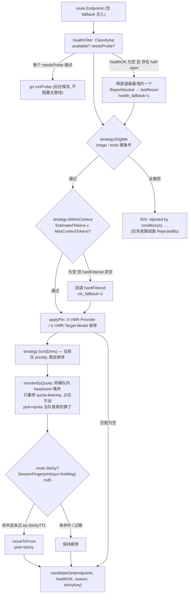

<!-- Ver 2026-09-11 14:30, by Sonnet 5 -->

# VMR 路由半区（路由核心与运行时引擎）架构与代码 Review

**评审对象**：VMR 上半区 —— `internal/{server,router,adapter,strategy,sticky,health,quota,pricing,respnorm,audit,imgprep,livestats,jsonscan,core,tokenutil,digest,logtee,probe,config}` + `cmd/vmr` 装配根
**评审基线**：`main` @ `780619e`（2026-09-11）
**评审人视角**：资深分布式系统架构师 / 高性能网关专家 / Go 底层与并发审计
**评审依据**：代码事实优先，设计文档与 `KNOWN_ISSUES` 仅作背景，不迷信历史定论

---

## 0. 任务 Debrief（阶段一产出）

### 0.1 我对系统的理解

VMR 路由半区是一个**本地运行、单二进制、配置驱动**的 LLM 协议内透传路由器，核心不变量是：

1. **Byte-faithful passthrough**：三个入口协议（`openai-completions` / `anthropic-messages` / `openai-responses`）永不互转；全链路仅 5 项法定偏离（model 改写、role_map 重映射、imgprep 图片降采样、respnorm 证据确凿的 quirk 修复、`[DONE]` 补齐）。
2. **两半区隔离**：路由核心零反向依赖分析半区，JSONL 审计日志是唯一单向桥。
3. **Elimination 与 Ordering 分离**：`Condition`（准入）与 `Dimension`（排序）是两个平行接口。
4. **编译期插件注册**：Adapter / Dimension / Condition 全部 `init()` blank-import 注册，读路径 lock-free atomic。

主路径的核心链路（一次真实请求的完整时序）：

```
Socket → server.chatHandler
  ├─ Telemetry.RecordRequest（原子）
  ├─ Snapshot()（原子指针 load，全请求单份 Q14）
  ├─ beginAudit（分配 Record + recorder + Redact headers）
  ├─ authenticateWithSnap（constant-time compare）
  ├─ io.ReadAll(MaxBytesReader)（整体缓冲，60s read deadline）
  ├─ adapter.TopLevelProbe（单趟结构化扫描：model/stream/hasTools）
  ├─ Inflight.Register（map mutex + ctx.WithValue）
  ├─ AcquireSlot（全局信号量 / 无限模式下纯原子）
  ├─ imgprep.Downscale（HasImageMarker 子串门；命中才结构化重写）
  ├─ FilterClientHeaders（新建 http.Header 拷贝）
  ├─ computeRequestFacts（attachmentSpans + text/doc/image 估算）
  └─ router.ServeWithSnap
        ├─ Models[protocol][model] 查表 → 404 分支（含跨协议提示）
        ├─ rejectIfAllKeyless（全空 key + 全公网 host → 503）
        ├─ buildCandidates
        │     健康过滤(Classify/ep) → 硬能力条件 → 上下文估算过滤(+fallback)
        │     → pin 收窄 → strategy.Sort → reorderByQuota(同梯队 headroom)
        │     → Sticky(SessionFingerprint md5 + Peek + moveToFront)
        ├─ set X-VMR-Route-Reason
        └─ failover 循环（每候选各试一次，直到成功 / 耗尽 / max_attempts）
              ├─ Health.Acquire（half-open 单飞名额）
              ├─ trail.apply（写入截至目前的失败 → X-VMR-Failover）
              ├─ adapter.BuildRequest：jsonscan.RewriteModel（字节 splice）+ RewriteRoles + 组装
              ├─ snap.clientFor(ep).Do（按 proxy 分组的 http.Client）
              ├─ 2xx → forwardSuccess
              │     ReleaseProbe → copyFlush(respnorm.Wrap, 逐块 flush, idle 看门狗, in-flight 盖章)
              │     → reportStreamOutcome（OK/TRUNCATED/CANCELED）
              │     → chargeQuota（nil-safe）→ att.SetTokens/SetNorm/SetUpstreamModel
              │     → TRUNCATED 时 panic(http.ErrAbortHandler)
              └─ ≥400 → handleErrorResponse
                    读取 ≤128KB（idle 看门狗）→ ClassifyError（body 嗅探）
                    → ErrContent/ErrContextLimit/ErrQuirk：ReportNeutral（零冷却）继续 failover
                    → ErrClient：原样返回客户端，ReportNeutral
                    → 其余：ReportFailure（退避冷却）继续 failover
        server.done()（defer）：DurMS / Outcome / audit.Write / liveStats.Record
```

后台链路：`runProbe`（half-open 端点后台恢复探测，fire-and-forget goroutine）、`config.Watch`（fsnotify + 300ms 防抖）、`audit` housekeeping（轮转边界触发 zstd 压缩）、`quota` flusher（周期落盘）、`livestats` rollup。

### 0.2 核心审查重心

| # | 重心 | 说明 |
|---|---|---|
| 1 | **主路径冗余与同步开销**（专项）| Socket→字节响应完成的每一次分配、每一次锁、每一次全 body 扫描的必要性；哪些可异步 / 旁路 / 惰性 |
| 2 | 协议适配与入口层 | `server` / `adapter` / `jsonscan` 的职责边界、字节保真、探测 vs 校验 |
| 3 | 路由调度与状态机 | `router` failover 循环、`strategy`、`sticky`、`health` 的并发安全与容错边界 |
| 4 | 配额与计量 | `quota` / `pricing` 的锁竞争、周期重置方向敏感性、计费与审计双账本一致性 |
| 5 | 流式规范化与响应拦截 | `respnorm` 状态机、`imgprep` 对主路径延迟的影响、职责越界（用量嗅探）是否仍可控 |
| 6 | 运行时遥测与审计 | `audit` 写盘锁、`livestats` 钩子、`logtee`，与主路径交织处 |
| 7 | 并发安全全局审计 | 死锁 / 数据竞争 / goroutine 泄漏 / GC 压力 / 边界雪崩条件 |

### 0.3 阶段规划

- **阶段一（本文档已完成）**：全景调研 + 主路径测绘 + 报告骨架 + Debrief
- **阶段二**：主路径组件存废与解耦价值评估矩阵 + 瘦身顶层建议
- **阶段三**：分领域深度审查（5 个领域自底向上）
- **阶段四**：级别 A 就地修复 + 全量测试验证（`go test ./... -race` / `archtest` / `vmr check`）
- **阶段五**：级别 B 决策清单（四段式）+ 架构演进路线图

### 0.4 阶段一初步判断（详见后续阶段展开）

- 路由半区整体**健康度高**：`KNOWN_ISSUES` 是一份异常完整的当前状态清单，绝大多数"看着像 bug"的点已被论证为刻意取舍。主路径已实测（2026-08，150 req/s，除图片降采样外 p95 0–3ms）。
- 未发现死锁、数据竞争、goroutine 泄漏或凭据泄漏级别的缺陷。并发模型（原子 snapshot 指针 + 分区互斥锁 + copy-on-write 注册表 + copyFlush goroutine 流水线）设计扎实。
- 主路径上确有若干**低 ROI 的冗余**（facts 提取阶段对 body 的多趟扫描、`-audit=false` 下仍执行请求头脱敏、成功尾部对 respnorm 用量的重复求值），均非正确性问题，符合项目"先测后优化"的既定顺序。
- **已识别的文档漂移**：`internal/server/recorder.go` 对成功响应体设了 16MB 上限并追加截断标记，而设计文档 Part 1 §9.2/§9.3 明文声称"审计侧不设记录上限 / bytes.Buffer 无上限增长"——这是一处需要就地修正的权威性漂移（级别 A，详见阶段四）。
- `http.Server` 缺 `IdleTimeout`：本地工具影响有限，但属零风险硬化项（级别 A 候选）。

---

## 1. 主路径蓝图（Blueprint）

### 1.1 请求主路径数据流 / 控制流（时序图）

```mermaid
sequenceDiagram
    autonumber
    participant C as Client
    participant SH as server.chatHandler
    participant PR as adapter.TopLevelProbe
    participant IF as router.InflightRegistry
    participant GT as router.limiter (gate)
    participant IP as imgprep.Downscale
    participant FA as server.computeRequestFacts
    participant RT as router.ServeWithSnap
    participant BC as router.buildCandidates
    participant HL as health.Registry
    participant AD as adapter.BuildRequest / jsonscan
    participant UP as Upstream (http.Client)
    participant RN as respnorm.Wrap
    participant CF as router.copyFlush
    participant QA as router.chargeQuota
    participant AU as audit.Logger / livestats

    C->>SH: POST /v1/{chat/completions,messages,responses}
    SH->>SH: Telemetry.RecordRequest (atomic)
    SH->>RT: snap = rt.Snapshot() (atomic load, 全请求单份)
    SH->>AU: beginAudit → Record{} + recorder + Redact(reqHeaders)
    SH->>SH: authenticateWithSnap (subtle.ConstantTimeCompare loop)
    SH->>C: io.ReadAll(MaxBytesReader(body, 8MiB)) + 60s ReadDeadline
    SH->>PR: TopLevelProbe(body) → model / stream / hasTools (单趟结构扫描)
    SH->>IF: Register(initials) → handle + defer remove
    SH->>GT: AcquireSlot(ctx) — 超限则挂起, ctx 取消即出队
    SH->>IP: Downscale(body) — HasImageMarker 子串门; 命中则 unmarshal+walk+DecodeConfig
    SH->>SH: FilterClientHeaders(r.Header) → 新 http.Header
    SH->>FA: computeRequestFacts → attachmentSpans + estimateText/Doc/Image
    SH->>RT: ServeWithSnap(creq{Model,Stream,Raw,Header,Facts,KeyTag}, protocol, snap, rec)

    RT->>RT: route = snap.Models[protocol][model]  (miss → 404 + 跨协议提示)
    RT->>RT: rejectIfAllKeyless(route.Endpoints)
    RT->>BC: buildCandidates(snap, protocol, creq, route, r, now)
    BC->>HL: Classify(ep.HealthKey(), now) — 每端点一次锁
    BC->>BC: strategy.Eligible (image/tools) → WithinContext (估算, 带 fallback)
    BC->>BC: applyPin → strategy.Sort(Dims) → reorderByQuota(同梯队 headroom)
    BC->>BC: SessionFingerprint(raw) md5 → Sticky.Peek → moveToFront
    RT->>C: w.Header().Set("X-VMR-Route-Reason", …)

    loop 每个候选 (直到 done / 耗尽 / max_attempts)
        RT->>HL: Acquire(ep.HealthKey()) — half-open 单飞
        RT->>C: trail.apply → X-VMR-Failover (截至目前的失败)
        RT->>AD: BuildRequest → RewriteModel(byte splice) + RewriteRoles + 组装 + 注 key
        AD->>UP: clientFor(ep).Do(req)
        alt 2xx (forwardSuccess)
            UP-->>RT: resp
            RT->>HL: ReleaseProbe(key)
            RT->>C: copyRespHeaders + X-VMR-Endpoint/Attempts + WriteHeader
            RT->>RN: Wrap(resp.Body, {ClientModel, IsSSE, Protocol, Opaque})
            RT->>CF: copyFlush(ctx, w, inflightStamped(rbody), stream_idle) — 逐块 flush + 看门狗
            CF-->>RT: copyErr (nil / idle / clientWriteError / upstream cut)
            RT->>HL: reportStreamOutcome(OK/TRUNCATED/CANCELED)
            RT->>QA: chargeQuota(ep, rbody, creq)  (nil-safe)
            RT->>AU: att.SetTokens/SetNorm/SetUpstreamModel + Telemetry.RecordTokens
            alt TRUNCATED
                RT->>C: panic(http.ErrAbortHandler) — net/http 静默中止连接
            end
        else >=400 (handleErrorResponse)
            UP-->>RT: err resp
            RT->>RT: io.ReadAll(LimitReader ≤128KB) + stream_idle 看门狗
            RT->>RT: ad.ClassifyError(status, body) — errorSnippet + 词表嗅探
            alt ErrContent / ErrContextLimit / ErrQuirk
                RT->>HL: ReportNeutral (零冷却) → 继续 failover
            else ErrClient
                RT->>C: 原样返回 status+headers+body; ReportNeutral
            else 其余
                RT->>HL: ReportFailure(class, retryAfter) → 退避冷却 → 继续 failover
            end
        end
    end
    RT->>C: 全败 → 原样返回最后上游错误 / 503 vmr_no_candidates
    SH->>AU: defer done(): DurMS, TTFTMS, Outcome, audit.Write, liveStats.Record
```

### 1.2 候选选择管线（控制流图）



### 1.3 主路径关键环节与开销点

| 环节 | 操作 | 分配 | 锁 / 同步 | 全 body 扫描 | 备注 |
|---|---|---|---|---|---|
| `Telemetry.RecordRequest` | 2× atomic.Add | 无 | 无 | — | 固定原子计数器 |
| `Snapshot()` | atomic.Pointer.Load | 无 | 无 | — | 全请求单份，热重载不撕裂 |
| `beginAudit` | `Record{}` + `recorder{}` + `audit.Redact(reqHeaders)` | 中（Record + header map 拷贝） | 无 | — | **`-audit=false` 下 Redact 仍执行**（见阶段二/四） |
| `authenticateWithSnap` | 无 | 无 | 无 | — | `subtle.ConstantTimeCompare`，key 数量级线性 |
| body 缓冲 | `io.ReadAll` | 大（整个 body） | 无 | — | failover 重放前提；`SetReadDeadline` ×2 |
| `TopLevelProbe` | 无（`json.Unmarshal` 仅对 model 值） | 无 | 无 | **1 趟结构扫描** | 取代旧的反射 Unmarshal + 独立 tools 扫描 |
| `Inflight.Register` | `inflightRec{}` + `context.WithValue` | 小 | map mutex（仅 add） | — | 每 chunk 盖章走原子，不走此锁 |
| `AcquireSlot` | closure | 小 | channel send / `waiting`+`inFlight` atomic | — | 无限模式仅 2× atomic |
| `imgprep.Downscale` | 无（无图时） | 无（无图时） | 无 | `HasImageMarker` 2× `bytes.Contains` | 有图：完整 unmarshal + 结构 walk + `DecodeConfig`/图 |
| `FilterClientHeaders` | 新 `http.Header` + 全量 Add | 中（header map） | 无 | — | 每请求重建 |
| `computeRequestFacts` | `CharStats` 栈值 | 小 | 无 | **attachmentSpans（≤4× bytes.Index）+ estimateDocumentTokens（4× bytes.Contains）+ estimateTextTokens（1× Analyze）** | 约 6–9 趟全 body 遍历（§2.74 记录了一部分） |
| `buildCandidates.healthFilter` | 2 个 slice（`healthOK`/`halfOpen`） | 小 | health.mu ×N（每端点 Classify 一次） | — | `Classify` 已把旧的 2 次锁合并为 1 次 |
| `strategy.Eligible`/`WithinContext` | 无 | 无 | conditions atomic load | — | Condition 读路径 lock-free |
| `strategy.Sort` | `sort.SliceStable` | 小 | 无 | — | 稳定多键排序 |
| `reorderByQuota` | 若干小 slice | 小 | quota.mu ×（limit×ep） | — | nil-safe；无 quota 时 O(1) 返回 |
| `SessionFingerprint` | md5 状态 | 小 | 无 | 仅扫 system + 首条非 system（成本与历史长度无关） | Anthropic/OpenAI/Responses 三分支 |
| `Sticky.Peek` | 无 | 无 | sticky.mu ×1 | — | — |
| `Health.Acquire`/候选 | 无 | 无 | health.mu ×（候选数） | — | half-open 单飞 |
| `RewriteModel` | 零拷贝（同名时）/ 三段拼接 | 小–中 | 无 | 1 趟 splice 扫描（字符串跳跃走 memchr） | 每 attempt 一次 |
| `RewriteRoles` | roleMap 空时零拷贝 | — | 无 | roleMap 非空才扫 messages 数组 | 大多数账号 roleMap 为 nil |
| `copyFlush` | 2× 32KiB buf（channel pool）+ 1 goroutine/attempt | 中 | channel + timer | — | 逐块 flush，idle 看门狗 |
| `respnorm` per-chunk | `ExtractResponseText` + `tokenutil.Analyze` + usage 子串门 | 小 | respnorm.mu（inspection 字段） | 逐 SSE 事件 | 用量嗅探搭 emitBlock 循环零额外开销 |
| `forwardSuccess` 尾部 | — | 小 | respnorm.mu ×~10（Usage/UsageSides/OutTokens/Applied/RawPreStrip/ObservedModel，且 tokenCharge 被调 2 次） | — | 见阶段二 |
| `chargeQuota` | — | 小 | quota.mu ×（limit 数） | — | nil-safe |
| `done()`（defer） | — | 中（audit 编码走 sync.Pool，锁外） | audit.mu（仅 `l.f.Write` syscall 在锁内，§2.10） | — | livestats.Record 另计 |

### 1.4 后台 goroutine 生命周期一览

| goroutine | 触发 | 退出 | Panic 兜底 | 关停 drain |
|---|---|---|---|---|
| `runProbe` | healthFilter 发现 half-open 未探测 | 探测完成 / `timeouts.probe` 超时 / router ctx 取消 | `recover` → `ReportNeutral` | 否（fire-and-forget，§14 记录：最坏丢一次探测结果） |
| `copyFlush` reader | 每次 `forwardSuccess` | EOF / `done` channel 关闭（caller `body.Close()` 解阻塞） | `recover` → 作为上游读失败上报（走 TRUNCATED） | 随请求结束 |
| `config.Watch` | `vmr start` | `stopWatch()`（`close(done)` + `watcher.Close()`） | `recover` → `onError`（hot reload down until restart） | defer stopWatch |
| SIGHUP 监听 | `vmr start` | `hup` channel 关闭（进程退出时） | 无（`reload` 内部 recover 无，但 `BuildSnapshot` 失败已处理） | 否（进程级） |
| audit housekeeping | 轮转边界 / `New()` 启动 | 扫描完成（`atomic.Bool` 防重叠） | 无显式 recover | 否（§14：crash-safe，Close 不等待） |
| quota flusher | `StartFlusher` | `stopQuotaFlush()` | — | defer stop + 最后一次 Flush |
| livestats | `New` | `Close` | — | defer Close |

### 1.5 已确认的架构不变量（阶段一核对结果 —— 全部成立）

- ✅ **协议永不互转**：三个 `chatHandler(protocol)` 注册，`Serve` 按 `snap.Models[protocol]` 查表，跨协议只给 404 提示（`otherProtocolFor` + `IngressPath` 三 case）。
- ✅ **Leaf 包零内部依赖**：`core` / `jsonscan` / `tokenutil` / `digest` / `fmtutil` / `livestats` / `logtee` 均只依赖标准库（`archtest` 强制）。
- ✅ **两半区隔离**：`router` / `server` 不 import `report` / `journey` / `ctxgraph` / `taskseg` / `reqdetail`（`chatmsg` 是既有豁免的传递依赖，§1.4）。
- ✅ **Condition / Dimension 分离**：两个独立接口，`Dimension.Compare` 无请求参数；`WithinContext` 刻意不注册为 Condition。
- ✅ **注册表 copy-on-write 写路径加锁**：`adapter.registerMu` / `strategy.conditionsMu`；读路径 `atomic.Pointer.Load`。
- ✅ **Endpoint 构造后不可变 + `HealthKey()`/`Name()` 预计算**：`Freeze()` 在 `BuildSnapshot` 中、Snapshot 发布前调用。
- ✅ **健康状态跨热重载保留**：`health.Registry` 独立于 Snapshot，`Install` 后 `Prune(HealthKeys())`。
- ✅ **审计文件 0600**：`os.OpenFile(..., 0o600)`。
- ✅ **凭据掩码**：`audit.Redact` / `IsCredentialHeader`，`FilterClientHeaders` 剥离 `Authorization`/`x-api-key`/pin 头。

---

## 2. 专项：主路径冗余与解耦价值评估

### 2.1 主路径全生命周期切片（Socket → 字节响应完成）

追踪一次真实 SSE agent 请求（无图、带 tools、长历史、命中 sticky、首候选成功）的每一次分配 / 锁 / 全 body 遍历：

| 阶段 | 关键动作 | 每请求分配 | 同步原语 | 全 body 遍历 | 可否异步/旁路/惰性 |
|---|---|---|---|---|---|
| Socket Read | net/http 读头 → `ReadHeaderTimeout 10s` | — | — | — | N/A |
| Handle 入口 | `RecordRequest`（原子）、`Snapshot()`（原子 load） | 0 | 无 | — | 已最优 |
| `beginAudit` | `Record{}` + `recorder{}` + **`audit.Redact(reqHeaders)`** | 1 大结构 + 1 header map | 无 | — | **Redact 在 `-audit=false` 下是纯浪费**（A3） |
| Auth | `authenticateWithSnap`（`subtle.ConstantTimeCompare` 循环，命中即 `return`） | 0 | 无 | — | 已足够（命中即返回泄漏"哪把 key 命中"的时序，本地工具场景可接受） |
| Body 缓冲 | `io.ReadAll(MaxBytesReader)` + `SetReadDeadline` ×2 | 1 大 buf（整 body） | 无 | — | **不可**——failover 重放的硬前提 |
| Facts 探测 | `TopLevelProbe`（单趟结构扫描）| 0（仅对 model 值 `json.Unmarshal`） | 无 | 1 趟结构扫描 | 已最优（取代旧的反射 Unmarshal + 独立 tools 扫描） |
| In-flight 注册 | `Inflight.Register` + `ctx.WithValue` | 1 `inflightRec` + 1 ctx 节点 | map mutex（仅 add） | — | 可接受；`/stats` 从不轮询时也付这份成本，但极小 |
| 并发闸 | `AcquireSlot` | 1 closure | channel send / 2 原子（无限模式） | — | 已最优 |
| 图片降采样 | `imgprep.Downscale` → `HasImageMarker`（2× `bytes.Contains`） | 0（无图） | 无 | 2 趟子串扫描 | 无图请求已近零成本；有图请求的完整 unmarshal + walk + `DecodeConfig` 是 `HasImage` 硬条件正确性所必需，不可剥离 |
| Header 过滤 | `FilterClientHeaders` | 1 新 `http.Header` + 全量 Add | 无 | — | 每请求重建，可接受（无跨请求可复用状态） |
| Facts 计算 | `attachmentSpans`（≤4× `bytes.Index`）+ `estimateDocumentTokens`（**4× `bytes.Contains` 全 body**）+ `estimateTextTokens`（1× `Analyze`） | 小 | 无 | **≈6–9 趟全 body 遍历** | **`estimateDocumentTokens` 在 `spans` 为空时仍扫 4 遍全 body**（A4）；`attachmentSpans` 重复扫描已见 §2.74 |
| 路由查表 | `snap.Models[protocol][model]` | 0 | 无 | — | 已最优 |
| keyless 门 | `rejectIfAllKeyless` | 0 | 无 | — | 遇首个带 key 端点即 `return`，可接受 |
| 健康过滤 | `healthFilter` → `Classify`/端点 | 2 slice | health.mu ×N | — | `Classify` 已把旧 2-锁序列合并为 1 锁 + 关闭 TOCTOU 窗口 |
| 硬/软条件 | `Eligible` / `WithinContext` | 1–2 slice | conditions atomic load（lock-free） | — | 已最优 |
| pin / Sort / quota 重排 | `applyPin` + `Sort` + `reorderByQuota` | 若干小 slice | quota.mu ×(limit×ep)（配了 quota 时） | — | 排序 O(n log n)，n=候选数（小）；quota 锁在目标规模可忽略 |
| Sticky | `SessionFingerprint`（md5，仅扫 sys+首条）+ `Peek` | md5 状态 | sticky.mu ×1 | 仅前导 system + 首条非 system（与历史长度无关） | 已最优 |
| failover 循环/候选 | `Acquire` + `trail.apply` + `tryOne` | — | health.mu ×候选数 | — | half-open 单飞必需 |
| BuildRequest | `RewriteModel`（字节 splice）+ `RewriteRoles`（roleMap 空则零拷贝）| 小–中（三段拼接）/ 零（同名） | 无 | 1 趟 splice 扫描（字符串跳跃 memchr 速度） | 已最优（比 unmarshal+re-marshal 快约一个数量级，实测 200KB body 99µs/5 分配） |
| 上游往返 | `snap.clientFor(ep).Do` | net/http 内部 | — | — | 按 proxy 分组的共享 Client，请求期零解析 |
| 转发 | `copyFlush` | **2× 32KiB buf（每次调用现分配，非跨请求池化）** + 1 goroutine | 无缓冲 `ch` + timer | — | **`copyFlush` 缓冲每次 `forwardSuccess` 现分配 64KiB 垃圾**（A6，与 `audit.writeBufPool` 同型的 `sync.Pool` 化） |
| 归一化/块 | `emitBlock` → model 正则 + `ExtractResponseText` + `tokenutil.Analyze` + usage 子串门 | 小 | respnorm.mu（inspection 字段） | 逐 SSE 事件 | 用量嗅探搭 `emitBlock` 已有循环，零额外前向开销（已论证） |
| 成功尾部 | `chargeQuota` + `tokenStamp` + `SetNorm/SetUpstreamModel` + `Telemetry.RecordTokens` | 小 | respnorm.mu ×~10（**`tokenCharge` 被求值两次**：`chargeQuota` 一次 + `tokenStamp` 一次；`Usage()` 另调第 3 次）；quota.mu ×limit 数 | — | **`tokenCharge` 重复求值**（B3，低 ROI） |
| 完成钩子（defer） | `done()`：`audit.Write` + `liveStats.Record` | 编码 buf（走 `sync.Pool`，锁外） | **audit.mu（`l.f.Write` syscall 在锁内）+ livestats.mu（slim append 在锁内）** | — | **两次串行化的锁内文件写**（B1，与 §2.10 同源） |

### 2.2 组件存废与解耦价值评估矩阵

| 组件 | 主路径行为 | 开销定性 | 建议 | 架构收益 | 风险 |
|---|---|---|---|---|---|
| `imgprep`（深度结构化重写） | 无图：2× 子串扫描；有图：完整 unmarshal + walk + `DecodeConfig`/图 | CPU（有图时）| **保持**（不剥离） | 剥离为中间件收益为负——`HasImage` 是无 fallback 的硬路由条件，检测必须在 `router.Serve` 前完成且必须结构化（子串扫描会误判） | 无 |
| `respnorm` 用量嗅探 | `emitBlock`/`finalizeBuffered` 循环内嗅探 usage | 零（搭已有 per-chunk 循环） | **保持** | 剥离为 router 侧 Reader 装饰器要在转发热路径每 chunk 多付一次接口调用 | 无（已论证，§1.1） |
| `computeRequestFacts` 多趟扫描 | ≈6–9 趟全 body `bytes.*` | CPU（长 body 时线性放大） | **局部合并**（A4 立即；B2 彻底） | A4：无 attachment 请求省 4 趟全 body 扫描；B2：`TopLevelProbe` + `HasImageMarker` + `attachmentSpans` + doc 标记合入一趟结构 walk | A4 零风险；B2 需重构 facts 提取，ROI 现阶段偏低（实测 p95 0–3ms） |
| `beginAudit` 请求头脱敏 | 每请求 `audit.Redact(r.Header)` | 小（header map 分配 + 迭代） | **就地修复（A3）** | `-audit=false` + livestats-only 部署不再付审计副本成本（recorder.go 注释已点名此浪费） | 零（`rec.Client.Request.Headers` 在该模式下无消费者，已逐一核对） |
| `copyFlush` 缓冲 | 每次 `forwardSuccess` `make([]byte, 32KiB)` ×2 | GC 压力（64KiB 垃圾/成功请求） | **就地修复（A6）** | `sync.Pool` 化，与 `audit.writeBufPool` 同型；流式重负载下显著降低分配churn | 零（无缓冲 `ch` 已是真正的背压闸，Pool 不改变流水线深度） |
| `tokenCharge` 双重求值 | 成功尾部计算两次（charge + stamp） | 小（几次 respnorm.mu + 估算） | **B3（低 ROI）** | 计算一次、喂给 charge 与 stamp 两侧 | 需保持"stamp 独立于 quota 配置"语义，改动要小心 |
| `done()` 双文件写 | `audit.Write` + `livestats.Record` 各持全局锁写 syscall | 完成时串行化 | **B1** | 缓冲 channel + 单写协程（§2.10 已登记 audit 侧）；两侧同型 | 需处理背压（丢弃 vs 阻塞）与优雅关停 drain；目标规模下当前非瓶颈 |
| `Inflight.Register` + `ctx.WithValue` | 每请求分配 `inflightRec` + ctx 节点 | 极小 | **保持** | 惰性化（仅 `/stats` 被消费时注册）收益不抵复杂度 | 无 |
| `FilterClientHeaders` 重建 | 每请求新 `http.Header` | 小 | **保持** | 无跨请求可复用状态 | 无 |

### 2.3 主路径瘦身顶层建议

1. **主路径已足够瘦**：字节 splice model 改写、单趟结构探测、`Freeze()` 预算 HealthKey、固定原子遥测、lock-free 注册表读路径——这些是正确的工程决定，实测 150 req/s 下 p95 0–3ms。**不建议为微秒级收益牺牲简单性**，这与项目"先测后优化"的既定顺序一致。
2. **真正的免费项只有三处**（均已列为级别 A）：
   - A3：`-audit=false` 下跳过请求头脱敏；
   - A4：`estimateDocumentTokens` 在无 attachment span 时短路，省 4 趟全 body 扫描；
   - A6：`copyFlush` 缓冲改 `sync.Pool`（消除 64KiB/请求 的分配 churn，与既有 `audit.writeBufPool` 完全同型）。
3. **值得决策但非现在**（级别 B）：
   - B1：完成钩子的双锁文件写 → 缓冲 channel + 单写协程（触发条件：RPS 相对当前增长约两个数量级）；
   - B2：facts 提取的 ≈6–9 趟全 body 扫描 → 单趟结构 walk 统一喂多个消费者（触发条件：profile 显示 facts 提取在真实负载耗时中占比可感知，即 §2.74 的触发条件）；
   - B3：成功尾部 `tokenCharge` 双求值 → 计算一次（收益极小，随 B2 顺带）。
4. **不存在应剥离的模块**：`imgprep` / `respnorm` 用量嗅探 / `quota` 计量 的当前边界都已被充分论证，剥离收益为负或为零。

---

## 3. 分领域深度审查

### 3.1 领域 1：协议适配与入口层（`server`, `adapter/*`, `jsonscan`）

**结论：字节保真与"探测非校验"原则贯彻到位；未发现协议翻译泄漏或字节偏离。**

- ✅ **`TopLevelProbe` 单趟结构扫描**：正确复刻 `json.Unmarshal` 的错误语义（非对象/畸形/类型不符 → `ok=false`；`null` 对 model/stream 是 no-op）；`hasTools` 判定 `val[vi]=='['` → skip ws → `!=']'`，正确处理 `[]`/`[ ]`/`[{…}]`。
- ✅ **`jsonscan` 全部 scanner fail-closed**：畸形输入 → `ok=false` → 上层回退 generic path；`IndexUnescapedQuote` 反斜杠奇偶判定正确；fuzz 覆盖（`FuzzRewriteModel`/`FuzzStream`/`scan_fuzz`）。`MarshalNoEscape` 走 `SetEscapeHTML(false)` + 去尾 `\n`，2026-09 review P-01 修了 `strconv.AppendQuote` 会产出非 JSON 转义的 bug。
- ✅ **`adapter.BuildUpstreamRequest` 顺序正确**：model 改写 → role 改写 → 组装 → 拷贝 passthrough header → `Set` Content-Type + 凭据。凭据用 `Header.Set` 在 header 拷贝**之后**，且 `Authorization`/`x-api-key` 本已在 `FilterClientHeaders` 黑名单——双重防线。
- ✅ **错误分类 `DefaultClassify`**：`errorSnippet` 先抽结构化字段（`error.message`/`type`/`code`/FastAPI `detail`），非 JSON 才退 4KB bounded raw scan（避免 echo-of-prompt 误命中）；判定顺序（content > auth > 上下文超限[先排除 maxOutput] > model 未知 > upstream > quirk > 兜底 client）文档化且合理；`maxOutputHint` 先于 `contextLimitHint` 是关键（厂商措辞常同时提 context/tokens）。
- ⚠️ **观察 D1-a（无 TLS）**：`http.Server` 仅 `ListenAndServe`（明文）。属定位刻意（`127.0.0.1` 本地）。`config.Check` 对"非 loopback + 无 api_keys"已给 warning，但未对"非 loopback 明文传输"提示。→ 级别 B 观察（B4），不建议直接加 warning（vmr 完全无 TLS，会对每个非 loopback listen 触发，措辞需斟酌）。
- ⚠️ **观察 D1-b（缺 `IdleTimeout`）**：见 A2。

### 3.2 领域 2：路由调度、策略与状态（`router`, `strategy`, `sticky`, `health`）

**结论：failover 状态机与半开恢复逻辑严密；未发现死锁、goroutine 泄漏、健康状态污染。**

- ✅ **failover 循环**：`done`/`uerr`/`success` 三元组清晰；`last` 只保留"有 HTTP 响应"的错误；`trail` 在每次 attempt **之前**写入（成功的失败转移仍带解释性 trail）。`w.WriteHeader` 每请求恰好一次（逐路径核对）。
- ✅ **`Health.Classify` 单锁**：合并了旧的 `Status().Fails>0` + `Acquire`/`Available` 双锁序列，并关闭了两次锁读之间的 TOCTOU 窗口。
- ✅ **`tryOne` panic 兜底**：`defer func(){ if !healthReported { ReportNeutral(key) } }()` —— net/http recover 的 handler panic 不会遗留 `probing=true` 锁死端点。逐路径确认每条出口都置 `healthReported` 或让兜底生效。
- ✅ **`healthFilter` last-resort**：`healthOK` 空且存在 half-open 时，释放退避最浅端点的探针槽（`ReportNeutral`）并作为候选返回，走普通 `tryOne`/`Acquire`/`ReportSuccess` 路径——与 `ctx_fallback` 同一"估计值不该清空非空候选集"原则。§2.85 记录了多 half-open 并存的残留场景。
- ✅ **`runProbe` 单飞**：`Classify` 对一个 half-open episode 只让**一个**调用方拿到 `needsProbe=true`（设 `s.probing=true`），后续 `Classify` 见 `probing` 即返回 `(false,false)` 不再入 `halfOpen`——每个 episode 恰好一个 `runProbe` goroutine。`recover` + 双 ctx 检查，SIGTERM 时快速退出（§14 记录：fire-and-forget，最坏丢一次探测结果）。
- ✅ **客户端断连不惩罚端点**：`copyFlush` 返回 `*clientWriteError` → `isClientWriteError` → `status=CANCELED` → `ReportNeutral`；ctx 检查在写错误检查之前（覆盖 ctx 取消滞后于写失败的微秒窗口，line 557–566 注释解释）。
- ⚠️ **观察 D2-a（全候选 `Acquire` 失败时的误导性 503）**：极罕见竞态下（healthFilter 与 `Acquire` 循环之间所有候选翻为 half-open+probing），`attempts=0` + `last=nil` + `len(healthOK)>0` → `noCandidatesMessage` 走 `rejectionSummary(healthOK)` → 无 Condition 拒绝它们时返回 `"rejected by an unspecified condition"`——语义错误（它们不是被条件拒绝，而是全在探测中）。**低危**：触发概率极低，措辞虽错但仍指向"端点当前不可用"。→ 记录为 D2-a，不建议改（干净修复需单独追踪"全 Acquire 失败"）。
- ⚠️ **观察 D2-b（`sticky.Set` 容量淘汰 O(n²)）**：满容量时每个新 key 触发 `for len>=maxCap { 扫全 map 找最旧 }`——`MaxEntries=10000`，仅在"高周转短会话"场景（正是该 bound 存在的目的）恶化。目标规模（少量活跃会话）无影响。→ 低危记录。
- ⚠️ **观察 D2-c（`reorderByQuota` 热路径 quota 锁）**：每请求排序阶段对每个 quota-bearing 端点的每条 applicable limit 调 `reg.Used`（各持 `quota.mu`）。目标规模（少量 provider、1–2 limit）可忽略。→ 与 D3 合并记录。

### 3.3 领域 3：配额、计量与费率（`quota`, `pricing`）

**结论：周期重置方向敏感性、按名记账（非 key 哈希）、计费/审计双账本一致性均处理正确。**

- ✅ **`quota.Registry` 惰性周期重置方向敏感**：`ps > b.PeriodStart` 才重置（前进）；`ps < b.PeriodStart` 是时钟回退（NTP/快照/TZ）——保留计数 + 每进程一次 WARN。无 ticker、无 missed-tick 风险、重启自愈。
- ✅ **按 provider 名记账、刻意不含 key 哈希**：`Registry` 注释本身就是防"和 `HealthKey` 统一"的守卫——换 key 该重评健康（新凭证新信任），但换 key 清零当期额度会直接超支，两者风险方向相反。
- ✅ **计费/审计双账本一致性**：`tokenStamp` 与 `tokenCharge` 读同一份 counter、同一瞬间；`cmd/vmr/quota_parity_test.go` 差分锁定公式；`Attempt.IsForwarded` 是 stamped-优先-heuristic-兜底的单点预测词。`TokenCountersSides` 刻意无单标志合并形式（partial 当 exact 记账正是要防的 bug 类）。
- ✅ **`pricing` 不在路由热路径**：路由半区从不解析价格数据（`metric: cost` 已整体删除）；`core.Rate.Cost` 对 nil 分量按 0（防御性下限，非 free）。
- ℹ️ **`Used` 是"读但会 mutate"**（惰性重置），故取写锁——文档化，正确。
- ℹ️ 分析半区 §2.100（`report` 未消费 `Attempt.tokens`，双路径 token 分叉风险）属分析半区，本 review 范围外，仅记录。

### 3.4 领域 4：流式规范化与响应拦截（`respnorm`, `imgprep`）

**结论：四态机边界、截断扣留语义、正则安全性、fail-open 均到位。**

- ✅ **`respnorm` 四态机**：`undecided → buffered/passthrough`，单向（唯一回退是 `<think>` 闭合后 `buffered→passthrough`）；`bufferedCap` 8MB → opaque 降级；`s.pending`（undecided）现也有 `bufferedCap` 兜底（Anthropic ping 洪水修复）。`FuzzStream` 的分片不变性检查覆盖 chunked ingestion。
- ✅ **正则无灾难性回溯**：`thinkPattern`（`(?s)<think>.*?</think>(?:\\n|\n)*`）非贪婪 `.*?`、无嵌套量词——`<think>` 无闭合时 `FindIndex` 线性扫到 EOF 返回 nil，O(n)。`thinkingProcessFullMatch`/`Endorsement` 同样线性。`bytes.Split` 兜底路径 O(n) 内存但受 `bufferedCap` 8MB 限。
- ✅ **`flushRawOnError` 截断语义**：非 SSE flush 部分 JSON（直连也这结果）；SSE 仅 `modePassthrough` flush 尾部，`undecided`/`buffered` 一律扣留（`truncated_withheld`）避免泄漏未闭合 `<think>`；随后 `forwardSuccess` `panic(http.ErrAbortHandler)`——客户端看到断掉的传输而非干净空 200。model 改写在部分 body 上仍施加（虚拟模型抽象即使部分 body 也成立）。
- ✅ **`copyFlush` reader goroutine 无泄漏**：早返回（idle/ctx）时若 reader 阻塞在 `body.Read`，caller 的 `defer body.Close()`（关的是底层 `resp.Body`）解阻塞 → reader 命中 `<-done` 退出。`recover` 把 malformed-stream panic 转成上游读失败（走 TRUNCATED，永不静默成功）。
- ✅ **`imgprep` 全路径 fail-open**：`recover` → 原始字节 + 一行 stderr（不静默）；`maxDecodePixels` 16MP 解压炸弹闸；GIF 一律跳过缩放（`image/gif.DecodeAll` 无帧数/内存上限）。
- ⚠️ **观察 D4-a（`modelFieldPattern` 无 JSON 深度追踪）**：正则会改写嵌套 `"model"` 键——已文档化（目标厂商形态只在顶层带 model，实践无害；`TestRespStream_NestedModelInDelta` 锁定行为）。接受。
- ℹ️ §2.17（16MP 解码闸 vs 32MB 单请求内存预算量纲不一致）、§2.49（`cfg.Width*cfg.Height` 32-bit 溢出，非活跃）已登记。

### 3.5 领域 5：运行时遥测、审计与支撑（`audit`, `livestats`, `logtee`）

**结论：编码/写入锁分离到位；完成时双文件写是唯一的规模化拐点，目标规模内非瓶颈。**

- ✅ **`audit.Write` 锁分离**：JSON 编码走 `writeBufPool`（`sync.Pool`，锁外并行）；仅 `l.f.Write` syscall 在 `l.mu` 内（§2.10）。按日轮转触发异步 housekeeping（`atomic.Bool` 防重叠）。`SetEscapeHTML(false)` 保字节保真。
- ✅ **`livestats.Record` 在 `done()` defer 中**——响应已完成后才执行，不在延迟关键路径；单 mutex + 一次 slim append（§4.3 coarse-by-design）。
- ✅ **`logtee` 全状态单锁**（含订阅表变更路径，符合项目 copy-on-write-加锁约定）；`offer` 非阻塞 + 丢行标记，永不阻塞日志热路径。
- ✅ **`stampWriter` / `MultiWriter`**：每行现分配+拷贝（`append([]byte(ts), p...)`），1–2 行/请求，可忽略。
- 🔴 **发现 D5-a（设计文档 Part 1 三处漂移，级别 A）**：`recorder.go` 对成功响应体设 `recorderBodyCap = 16MB` 上限并追加 `...(recording truncated at N bytes)` 标记；`imgprep/cache.go` 有 `DefaultCacheCapBytes = 50MB` 容量上限。而 **Part 1 §9.2 约定 2**（"审计侧不设记录上限…也没有 `body_truncated` 标记"）、**§9.3**（"`bytes.Buffer` 无上限增长——不再有审计侧截断"）、**§7.1**（"不设容量上限"）、**§11 决策表**（"降采样缓存只做按 mtime 的 TTL，不设容量上限"——把当前行为写成了被否决的备选）四处均已过期。`docs/UserGuide.md` / `.zh.md` / `Quota.md`（`recorderBodyCap` 截断）**均已正确描述**，只有 Part 1 未同步。CLAUDE.md 明言"A stale detail here is worse than no detail — it reads as authoritative"。→ A1 + A5 修正。
- ⚠️ **观察 D5-b（完成钩子双锁文件写）**：`done()` 里 `audit.Write`（audit.mu + syscall）+ `livestats.Record`（livestats.mu + syscall）串行执行，各持全局锁。目标规模（几十 req/s）纯背景噪音；RPS 增长约两个数量级即成拐点。→ B1。

---

## 4. 级别 A 就地修复清单与验证

> 修复代码位于工作区，验证结果见 §4.7。所有 A 项：事实清楚、边界可控、行为等价或严格更安全。

### 4.1 A1 —— 设计文档 Part 1 §9.2 / §9.3 关于"审计侧不设记录上限"的陈述已过期

**问题**：`internal/server/recorder.go` 的 `recorderBodyCap = 16 << 20` 对写回客户端的成功响应体在**审计副本**上设 16MB 上限（客户端仍收到完整字节流，只有 audit copy 被截断），超限追加 `\n...(recording truncated at %d bytes)`。这与 Part 1 §9.2 约定 2、§9.3 的明文表述直接矛盾。

**修复**：更新 Part 1 §9.2 约定 2 与 §9.3，改为陈述当前行为（16MB 审计副本上限 + 截断标记 + 与约定 1 的交互：>16MB 响应下 attempt body 与完整 client body 都不在记录里），与 `UserGuide` / `Quota.md` 口径一致。**不改代码**——16MB 上限是合理的失控 SSE 防线，`UserGuide` 已正确记录其推导。

### 4.2 A2 —— `http.Server` 缺 `IdleTimeout`

**问题**：`cmd/vmr/cmd_start.go` 的 `http.Server` 只设 `ReadHeaderTimeout: 10s`，`IdleTimeout` / `ReadTimeout` / `WriteTimeout` 均为 0。空闲 keep-alive 连接可无限存活（客户端崩溃遗留半开 TCP 直到系统 keepalive）。

**修复**：加 `IdleTimeout: 120s`。**安全性**：`IdleTimeout` 只在 keep-alive 连接的**两次请求之间**生效，不影响进行中的请求（含长 SSE 流、`/log` 永不关闭流）。`ReadTimeout` 保持 0（慢 body 上传已由 handler 内 `SetReadDeadline` 兜底，不需要全局读超时）。

### 4.3 A3 —— `beginAudit` 在 `-audit=false` 下仍对请求头脱敏

**问题**：`internal/server/server.go` 的 `beginAudit` 无条件执行 `audit.Redact(r.Header)`。`-audit=false`（仅 livestats）时 `rec.Client.Request.Headers` 无任何消费者（`sampleFromRecord` 只读 `Client.Response.Status`；`vmr replay` 从磁盘文件读，不碰活记录）——纯浪费。`recorder.go` 注释本身已点名"the header redact in message() are pure waste there"。

**修复**：仅在 `s.audit != nil` 时设 `rec.Client.Request.Headers`。逐一核对 `-audit=false` 路径确认零消费者。

### 4.4 A4 —— `estimateDocumentTokens` 在无 attachment span 时仍扫 4 遍全 body

**问题**：`internal/server/facts.go` 的 `estimateDocumentTokens(body, spans)` 无论 `spans` 是否为空，都先对整个 body 跑 4 次 `bytes.Contains`（`documentMarkers`），再 `if !hasMarker { return 0 }`。`spans` 为空时（无附件请求，占比 95%+）这 4 趟扫描的结果注定不影响返回值（`total` 恒为 0）。

**修复**：函数开头加 `if len(spans) == 0 { return 0 }`。行为完全等价（无 span → 无 payload 字节可折算 → 恒 0），省掉常态请求 4 趟全 body 遍历。

### 4.5 A5 —— 设计文档 Part 1 §7.1 / §11 决策表关于图片缓存"不设容量上限"的陈述已过期

**问题**：`internal/imgprep/cache.go` 的 `DefaultCacheCapBytes = 50 << 20` 由 `sweepCacheDirWithCap` 强制（超额按 mtime 淘汰最旧）。Part 1 §7.1 与 §11 决策表仍称"不设容量上限 / 真出现磁盘问题再按路线图补"，且决策表把"TTL + 容量双重限制"列为**被否决的备选**——与现状完全反了。`UserGuide` 已正确描述 50MB 上限。

**修复**：更新 Part 1 §7.1 与 §11 决策表对应行，陈述当前的"TTL + 50MB 容量双闸"及其理由（kept-forever 场景最需要磁盘空间兜底），与 `UserGuide` 口径一致。**不改代码**。

### 4.6 A6 —— `copyFlush` 转发缓冲每次调用现分配 64KiB

**问题**：`internal/router/transport.go` 的 `copyFlush` 每次调用 `make([]byte, bufSize)` ×2（`bufSize = 32 << 10`），随请求结束成为垃圾。流式重负载下是可观的分配 churn，且项目已有完全同型的 `audit.writeBufPool`（`sync.Pool`）先例。

**修复**：包级 `sync.Pool`（`New: make([]byte, bufSize)`）替代 per-call 的 `chan []byte` 双 buffer。**行为等价**：无缓冲的 `ch` 才是真正的背压闸（reader 至多领先 1 个 chunk），`sync.Pool` 不改变流水线深度；panic/早返回时未归还的 buffer 由 GC 回收，无泄漏。

### 4.7 修复清单与验证结果

| # | 类型 | 文件 | 改动 | 行为影响 |
|---|---|---|---|---|
| A1 | 文档 | `docs/VirtualModelRouter_Design_v4_Core.md` §9.2 约定 2、§9.3 | 陈述 `server.recorderBodyCap`（16MiB）审计副本上限 + `...(recording truncated at N bytes)` 标记 + 与约定 1 的交互；补 `-audit=false` 不脱敏 header、audit 编码在锁外 | 无（仅文档，与 `UserGuide`/`Quota.md` 对齐） |
| A2 | 代码 | `cmd/vmr/cmd_start.go` | `http.Server` 增 `IdleTimeout: 120s` | 空闲 keep-alive 连接 120s 后关闭；进行中请求/SSE/`/log` 不受影响；`ReadTimeout` 保持 0 |
| A3 | 代码 | `internal/server/server.go` `beginAudit` | `s.audit == nil` 时跳过 `audit.Redact(r.Header)` | `-audit=false` 少一次 header map 分配+脱敏；`rec.Client.Request.Headers` 该模式下无消费者（逐一核对） |
| A4 | 代码 | `internal/server/facts.go` `estimateDocumentTokens` | `len(spans) == 0` 时提前返回 0 | 无附件请求（95%+）省 4 趟全 body `bytes.Contains`；返回值完全等价 |
| A5 | 文档 | `docs/VirtualModelRouter_Design_v4_Core.md` §7.1、§11 决策表 | 陈述图片缓存的 TTL + `imgprep.DefaultCacheCapBytes`（50MiB）双闸（决策表原把它列为被否决的备选） | 无（仅文档，与 `UserGuide` 对齐） |
| A6 | 代码 | `internal/router/transport.go` `copyFlush` | per-call `chan []byte` 双 buffer → 包级 `sync.Pool`（`*[]byte`） | 消除 64KiB/成功请求 的分配 churn；流水线深度不变（无缓冲 `ch` 仍是背压闸）；早返回/panic 路径的 buffer 由 GC 回收 |

**验证**（全绿）：

```
$ go build ./...                                              # OK
$ go vet ./internal/router/... ./internal/server/... ./cmd/vmr/...   # OK
$ go test ./...                                               # OK（全部包）
$ go test -race -count=1 ./internal/router/... ./internal/server/... \
      ./internal/respnorm/... ./internal/health/... ./internal/audit/... ./internal/quota/...   # OK
$ go test ./internal/archtest/...                             # OK（A2 触发 cmdStart 行预算，已通过收紧注释解决，未提高豁免值）
$ gofmt -l <改动文件>                                          # 干净
$ ./vmr check -c config.example.yaml                          # === OK ===
```

**A2 的行预算处理**：`IdleTimeout` 使 `cmdStart` 短暂越过其 170 行豁免（`archtest` 提示"shorten it, don't raise the number"），已通过把新增注释压到 4 行解决，**未提高豁免值**。

---

## 5. 级别 B 决策清单与架构演进路线图

### 5.0 路由半区整体健康度评估

**结论：无高优先级架构债。** `KNOWN_ISSUES` 是一份异常完整、可对源码核实的当前状态清单；主路径已实测（2026-08，12 场景 × 3 档负载，除图片降采样外服务端 p95 0–3ms）。并发模型（原子 Snapshot 指针 + 分区互斥锁 + copy-on-write 注册表 + `copyFlush` goroutine 流水线 + `Freeze()` 预算 HealthKey）设计扎实，未发现死锁、数据竞争、goroutine 泄漏、凭据泄漏级缺陷。下列 B 项均为"值得决策但当前非瓶颈"，非"必须重构"。

### 5.1 B1 —— 完成钩子的双锁文件写

- **问题现象与代码锚点**：`internal/server/server.go` `beginAudit` 的 `done()` 闭包（约 line 359–382）在每个请求完成时串行执行 `s.audit.Write(rec)`（`internal/audit/audit.go:646` 起，`l.mu` 内含 `l.f.Write` syscall）与 `s.liveStats.Record(sampleFromRecord(rec))`（`internal/livestats/aggregator.go:208` 起，`a.mu` 内含 slim append syscall）。两个全局锁 + 两次文件写，串行。
- **深层根因与冲突分析**：两个账本各自演进（audit 是 JSONL 取证日志，livestats 是遥测 WAL），各持自己的粗粒度锁是 `§4.3 coarse-by-design` 的刻意选择。冲突点：所有请求完成路径在这两把锁上排队 + 两次 syscall。目标规模（几十 req/s）下每次 syscall 微秒级，纯背景噪音；但这是路由半区唯一的"完成时全局串行化"点，RPS 增长约两个数量级即成拐点。§2.10 已单独登记 audit 侧。
- **重构建议方案**：
  - **方案 A（缓冲 channel + 单写协程，两侧同型）**：`audit.Logger` 与 `livestats.Aggregator` 各持一个有界 channel + 一个独立写协程；`Write`/`Record` 变为非阻塞入队。收益：完成路径零锁零 syscall。成本：需处理背压（队满时丢弃 vs 阻塞——审计取证价值高，倾向阻塞并计数；遥测可丢弃）、优雅关停 drain（`Close` 等待队列排空）、`Write` 返回值语义变化（错误异步化）。
  - **方案 B（只做 audit 侧，livestats 维持）**：范围更小，但 livestats 侧仍串行。
- **ROI 权衡评估**：
  - 收益：消除唯一的完成时全局串行化点，为共享部署（`max_concurrency` 设具体值的场景）提供吞吐头room。
  - 成本：中——两个包各加一条 goroutine 生命周期 + 背压策略 + drain 逻辑；`Write` 错误异步化触及调用点契约。
  - **建议**：**暂不做**。触发条件：单实例稳态 RPS 相对当前增长约两个数量级，或共享部署下 profile 显示完成钩子在 P99 中占比可感知。届时优先方案 A。

### 5.2 B2 —— facts 提取阶段对请求 body 的多趟扫描

- **问题现象与代码锚点**：一次无图文本请求，主路径对 body 做：`TopLevelProbe`（1 趟结构）+ `imgprep.HasImageMarker`（2× `bytes.Contains`）+ `computeRequestFacts` 内 `attachmentSpans`（≤4× `bytes.Index`）+ `estimateDocumentTokens`（4× `bytes.Contains`，A4 后短路）+ `estimateTextTokens`（1× `Analyze`）+ `RewriteModel`（1 趟 splice）——共 ≈6–9 趟全 body 遍历。`internal/server/facts.go` + `internal/adapter/fingerprint.go` + `internal/imgprep/imgprep.go`。§2.74 已登记 `attachmentSpans` 部分。
- **深层根因与冲突分析**：facts 提取是逐步演进出来的——`TopLevelProbe`（Phase 2）合并了 model/stream/tools 三个消费者，但 `HasImageMarker`、`attachmentSpans`、doc 标记检测仍各自独立扫。每一趟对内容忠实的字节扫描单独看都便宜，合起来在多百 KB 长历史 body 上线性放大。实测（`long_history` 场景）p95 仍 0–3ms，说明当前不是瓶颈。
- **重构建议方案**：
  - **方案 A（单趟结构 walk）**：扩展 `jsonscan` 提供一个"一次遍历同时定位顶层 model/stream/tools + 走 messages/content 数组识别图片块 + 记录 attachment payload span"的结构化扫描，输出喂给 `TopLevelProbe` / `imgprep` / `computeRequestFacts` 三个消费者。收益：从 ≈6–9 趟降到 1–2 趟。成本：`jsonscan` 新增一个较复杂的组合扫描器 + fuzz 覆盖；三个消费者的调用契约调整；与 `imgprep` 的"深度结构化重写"（三大 sanctioned deviation 之最，见 §1.4）如何共享前半段扫描需设计。
  - **方案 B（只做 A4 + `estimateDocumentTokens` 与 `attachmentSpans` 合并单趟）**：范围小得多，`attachmentSpans` 单趟里顺带检测 doc 标记，省掉独立的 4× `bytes.Contains`。
- **ROI 权衡评估**：
  - 收益：长 body 请求的 CPU 线性下降；架构上"一次探测、多处复用"更彻底。
  - 成本：方案 A 中——`jsonscan` 复杂度上升，触及 3 个消费者 + 与 `imgprep` 的边界；方案 B 小。
  - **建议**：A4 立即（已列级别 A）。方案 A **暂不做**，触发条件 = §2.74 的触发条件（profile 显示 facts 提取在真实负载耗时中占比可感知）。届时方案 B 是低风险中间步。

### 5.3 B3 —— 成功尾部 `tokenCharge` 双重求值

- **问题现象与代码锚点**：`internal/router/router.go` `forwardSuccess` 尾部：`rt.chargeQuota(...)`（若 `needsTokenCharge` 则内部调 `tokenCharge`）+ `att.SetTokens(tokenStamp(...))`（`tokenStamp` 无条件调 `tokenCharge`）+ line 597 `rbody.Usage()` 第三次。`internal/router/quota.go:125` `tokenCharge`。
- **深层根因与冲突分析**：`tokenStamp` 刻意独立于 quota 配置（"audit evidence must not depend on quota configuration"），故不能简单复用 `chargeQuota` 的结果；且 `chargeQuota` 仅在 `needsTokenCharge`（配了 `metric: tokens`）时才求值。两者同源同瞬间（差分测试锁定），只是各算一遍。
- **重构建议方案**：`forwardSuccess` 里对 forwarded attempt 无条件调一次 `tokenCharge`，把 `(raw, estimated, inSniffed, outSniffed)` 同时喂给 `ChargeResponse`（新增一个接受已算好 counters 的重载，`chargeQuota` 现有的 `needsTokenCharge` 门内化为"已算就用"）与 `tokenStamp`。
- **ROI 权衡评估**：收益极小（几次 `respnorm.mu` + 一次估算）；成本小但要小心不破坏"stamp 独立于 quota 配置"语义与差分测试。**建议**：**随 B2 顺带**，不单独立项。

### 5.4 B4 —— 非 loopback listen 的明文传输无提示

- **问题现象与代码锚点**：`internal/config/check.go` 对"非 loopback `listen` + 无 `api_keys`"给 warning，但 vmr 完全无 TLS，非 loopback listen 一律明文，无任何提示。
- **深层根因与冲突分析**：vmr 定位是 `127.0.0.1` 本地工具，TLS 终止交给前置反代（`§1.0` 永久不做清单未列 TLS，但架构上一贯假设本地）。非 loopback 部署是用户显式选择。
- **重构建议方案**：`config.Check` 对非 loopback `listen` 追加一条 `SeverityWarning`："listen 绑定到非 loopback 地址，vmr 不做 TLS 终止——生产部署应置于 TLS 反代之后"。
- **ROI 权衡评估**：收益小（提醒一个显式选择的用户）；成本小；风险 = 对每个合法的非 loopback 部署都出一条 warning，可能被视为噪音。**建议**：**低优，看用户是否有非 loopback 部署诉求再定**。

### 5.5 架构演进路线图

```mermaid
gantt
    title VMR 路由半区演进路线（触发驱动，非日程驱动）
    dateFormat X
    axisFormat %s

    section 立即（级别 A，本次）
    A1/A5 设计文档 Part 1 三处漂移修正        :done, a1, 0, 1
    A2 http.Server IdleTimeout               :done, a2, 0, 1
    A3 -audit=false 跳过请求头脱敏            :done, a3, 0, 1
    A4 estimateDocumentTokens 短路           :done, a4, 0, 1
    A6 copyFlush 缓冲 sync.Pool 化           :done, a6, 0, 1

    section Phase 1 · 热路径减负（触发：profile 显示占比可感知）
    B2-B 方案（attachmentSpans+doc 标记合并单趟）  :b2b, 1, 2
    B3 tokenCharge 单次求值（随 B2 顺带）          :b3, 2, 3

    section Phase 2 · 模块解耦（触发：RPS 增长约两个数量级 / 共享部署 profile）
    B1 方案 A（audit + livestats 缓冲 channel + 单写协程）  :b1, 3, 5

    section Phase 3 · 深度重构（触发：§2.74 触发条件 + 有分析半区改动窗口）
    B2-A 方案（jsonscan 单趟组合结构扫描，三消费者复用）      :b2a, 5, 8
```



**说明**：路由半区的演进节奏由**触发条件**驱动而非日程——这与项目一贯"先测后优化"、"不为未发生的问题预先加复杂度"的哲学一致。当前无任何 B 项达到触发线；级别 A 项已在本次 review 中落地。

---

## 附录：评审已核对的源文件

`server/{server,facts,recorder,stats}.go` · `router/{router,candidates,transport,snapshot,quota,limiter,telemetry,routehdr,keyless,pin,probe,reload,clientheaders,logfmt,inflight}.go` · `adapter/{adapter,request,classify,fingerprint}.go` + `adapter/{openai,anthropic}` · `strategy/{strategy,conditions}.go` · `health/health.go` · `sticky/sticky.go` · `respnorm/{respnorm,usagesniff}.go` · `jsonscan/{jsonscan,scan,walk,rewrite}.go` · `imgprep/imgprep.go` · `audit/audit.go`（Write 路径）· `core/core.go` · `config/watch.go` · `cmd/vmr/cmd_start.go` · 4 份设计文档 + `KNOWN_ISSUES` + `ROADMAP`
