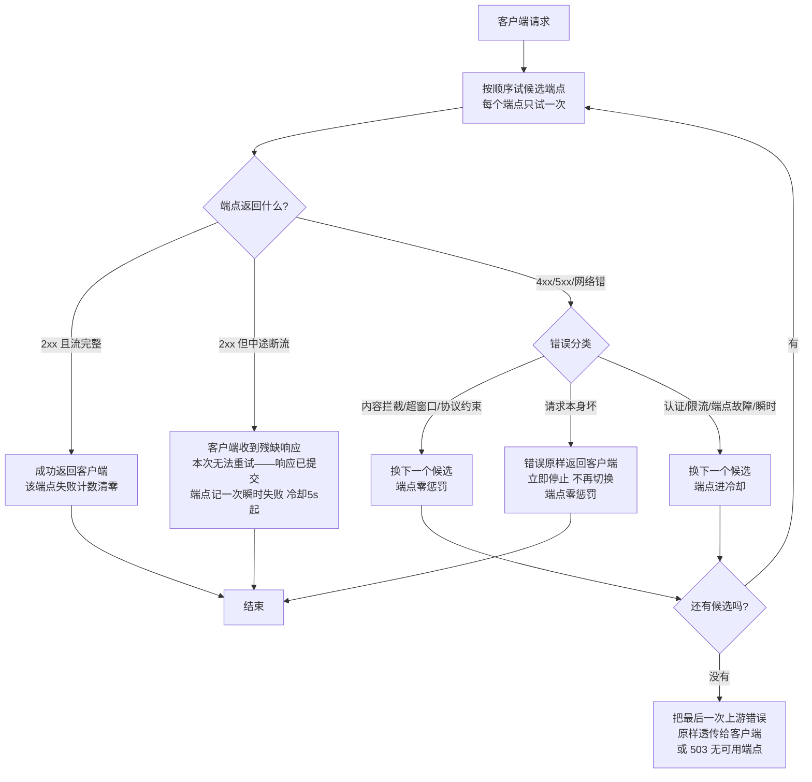
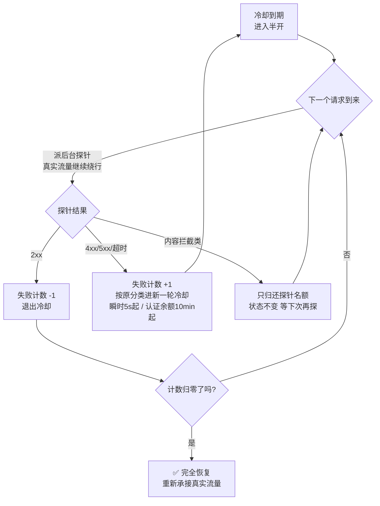

# vmr 端点失败处理与恢复机制全解

本文解读 vmr 中"一个上游端点失败之后，系统如何处置它、如何冷却、如何探测、如何恢复、反复失败怎么办"的完整链路。所有结论均以当前代码为准，出处标注到文件与函数。

## 0. 涉及的代码模块

| 位置 | 职责 |
| --- | --- |
| `internal/adapter/classify.go` + `classify_hints.go` | `DefaultClassify` 错误分类（决定后续一切处理的第一站） |
| `internal/health/health.go` | 健康状态机：冷却、指数退避、半开单飞探针槽 |
| `internal/router/router.go` | failover 循环（`Serve` / `tryOne` / `handleErrorResponse` / `forwardSuccess`） |
| `internal/router/candidates.go` | 候选管线：健康过滤 → 半开探测派发 → last-resort 兜底 |
| `internal/router/probe.go` | `runProbe`：半开端点的后台恢复探测 goroutine |
| `internal/probe/probe.go` | 探测请求构造（nonce 回显）+ 回显校验 |
| `internal/core/core.go` | `ErrorClass` 枚举、`Endpoint.HealthKey` |

分工原则：`internal/health` 只维护状态机，**不知道**半开端点具体怎么被重新验证；探测策略全部在 `internal/router`。

## 1. 第一站：错误分类

HTTP 响应 ≥400 时，`tryOne` 调用 `ad.ClassifyError(status, body)`。三个协议适配器共享 `DefaultClassify`，Anthropic 额外覆盖一个 529（overloaded）→ `ErrTransient`。

分类不是只看状态码，还做 **body 嗅探**（实测各家 status 习惯不一）：`errorSnippet` 先把结构化 body 归约成 `error.message` / `error.type` / `error.code` 的拼接文本（非 JSON body 则扫描前 4KB 原文）。

显式状态码分支先行（`DefaultClassify` 顶部）：451→`ErrContent`；401→`ErrAuth`；403→内容词命中 `ErrContent`，余额耗尽词命中 `ErrEndpoint`，否则 `ErrAuth`（OpenRouter 用 403 报 moderation，也报余额）；402/404→内容词命中 `ErrContent`，否则 `ErrEndpoint`；408→`ErrTransient`；429→余额/额度耗尽词命中 `ErrEndpoint`，否则 `ErrRateLimit`；其余 4xx 按下述词表顺序；5xx 及未知→`ErrTransient`。

通用 4xx 分支的词表固定顺序（中英并收）：

1. 内容合规拦截（`contentHint`）——最优先，因为内容词可能包含 "model" 等词，必须先判；
2. OAuth 标准错误码（`authHint`：`invalid_grant` / `invalid_token` / `token has expired`）——中转型网关会用 400 回报自身的 token 刷新失败；
3. 上下文超限（`contextLimitHint`，命中前先排除 `maxOutputHint`）；
4. 模型未知（"model" + "unknown/not found/…"）；
5. 网关自报转发失败（`upstreamHint`）；
6. 厂商专属协议约束（`vendorQuirkHint`：DeepSeek `reasoning_content` 回传、Gemini `thought_signature` 等）；
7. 兜底 → `ErrClient`。

词表命中后仍遵守"内容优先"原则——403/402/404/429/通用 4xx 都先过 `contentHint`，一条被内容拦截的请求无论借哪个状态码出现都必须继续 failover 且不冷却端点。

分类结果与处理去向：

| 分类 | 典型来源 | failover？ | 健康惩罚？ | 冷却曲线 |
| --- | --- | --- | --- | --- |
| `ErrClient` | 请求本身坏（兜底 4xx） | 否——原样返回客户端，终止 | 无 | 零冷却 |
| `ErrAuth` | 401/403、OAuth 错误码 | 是 | 有 | long（10min 起） |
| `ErrRateLimit` | 429（非额度耗尽措辞） | 是 | 有 | `Retry-After` 优先，否则 short |
| `ErrEndpoint` | 402/404、额度/余额耗尽措辞、模型未知、网关转发失败 | 是 | 有 | long（10min 起） |
| `ErrTransient` | 5xx/408/529/超时/网络错误 | 是 | 有 | short（5s 起） |
| `ErrContent` | 内容拦截（451、moderation 词表） | 是 | 无 | 零冷却 |
| `ErrContextLimit` | 会话超上下文窗口 | 是 | 无 | 零冷却 |
| `ErrQuirk` | 厂商协议约束拒绝 | 是 | 无 | 零冷却 |

设计动机：`ErrContent`/`ErrContextLimit`/`ErrQuirk` 是"**按请求**"而非"按端点"的错误——各厂内容敏感度不同、窗口大小是端点静态属性、历史形态不合某端点的规则，这些都与端点是否健康无关，换端点常能成功，所以继续 failover 但绝不冷却（否则一条敏感请求就把健康端点打下线）。

另有四个错误类只在审计侧使用（`ErrBuild`/`ErrNetwork`/`ErrCanceled`/`ErrTruncated`），对应"HTTP 响应到达之前"的失败，从不进入健康状态机。

## 2. failover 循环：每类错误的即时出路

`Serve` 按候选顺序走 `tryOne`（`max_attempts > 0` 时封顶尝试次数，默认 0 = 不限，走完全部候选）。每个候选**只试一次**——循环内不会对同一端点重试；是否再给它机会由健康状态机在后续请求里决定。

`tryOne` 内部的处理矩阵：

| 情形 | 健康报告 | 后续动作 |
| --- | --- | --- |
| 请求构建失败（`BuildRequest` 出错） | `ReportNeutral`（vmr 自身/客户端的问题，绝不冷却端点） | 继续下一候选 |
| 上游拨号/网络错误 | `ReportFailure(ErrTransient)` → 5s 曲线 | 继续下一候选 |
| 客户端中途断连 | `ReportNeutral`（与上游健康无关） | 终止（无事可写） |
| ≥400 响应 body 读取失败/超时（stream_idle 看门狗） | `ReportFailure(ErrTransient)` | 继续下一候选 |
| `ErrContent` / `ErrContextLimit` / `ErrQuirk` | `ReportNeutral`，零冷却 | 继续下一候选（错误记入返回候选） |
| `ErrClient` | `ReportNeutral`，零冷却 | **原样返回客户端，终止 failover**（每个端点都会同样失败） |
| 其余（Auth/Endpoint/RateLimit/Transient） | `ReportFailure(class, Retry-After)` | 继续下一候选 |
| 2xx | 先 `ReleaseProbe` 释放探针槽，流结束后按流结局补报（见下） | 提交响应给客户端，终止 |

2xx 之后健康结论**延迟到流结束**才报（`reportStreamOutcome`），因为 200 头之后中途断流是中转层最常见的失败形态：

- 流完整结束 → `ReportSuccess`（状态清零，见 §4）；
- 上游中途断流（`TRUNCATED`，200 已提交、无法再 failover）→ `ReportFailure(ErrTransient)` → 5s 曲线加深；
- 客户端断连（`CANCELED`）→ `ReportNeutral`。

**全部候选失败后**的返回语义：

- 有过真实上游响应 → 把**最后一次**上游错误原样透传（status + headers + body，`Retry-After`、限流头都原样到达客户端）；
- 全是构建/网络失败（没有任何 HTTP 响应）→ 503 `vmr_no_candidates`，文案区分：pin 落空 / 条件淘汰全部 / 全员冷却中；
- 响应头可观测：`X-VMR-Attempts`、`X-VMR-Route-Reason`（`cooldown=N` 计的是"健康过滤剔除的端点数"，含冷却中与半开）、`X-VMR-Failover`（逐个失败端点及状态码）、成功另带 `X-VMR-Endpoint`。

## 3. 冷却与退避参数（`health.ReportFailure`）

失败进入 `ReportFailure(key, class, retryAfter, now)` 后：

**两条退避曲线**（`transientBase=5s / transientCap=5min`；`longBase=10min / longCap=1h`）：

```
短曲线（ErrRateLimit / ErrTransient，及兜底分支）：
  有 Retry-After → cooldown = min(Retry-After, 1h)，不加抖动
                   （429/503 都可能带，503 也尊重——OpenRouter 实测）
  无             → 5s × 2^(fails-1)，封顶 5min：5s, 10s, 20s, 40s, 80s, 160s, 300s（7 档）…
长曲线（ErrAuth / ErrEndpoint）：
  10min × 2^(fails-1)，封顶 1h：10min, 20min, 40min, 1h, 1h…
```

首档 5s 是有意的下限：探针是个 `max_tokens=300` 的小请求，对"慢而未死"的上游的通过率系统性高于真实的大请求——首档太短，"失败 → 探针过 → 端点回池原优先级 → 按配置序路由的新流量马上再撞 → 又超时"的灰区振荡会跑得太快，每轮烧满一个 `response_header` 超时。5s 把振荡频率压到 1/2.5，同时单次瞬时失败的代价仍然很轻。

- **±10% 抖动加在封顶之后**——封顶的端点若整点齐射会同步到期、同步重探，抖动就是防这个；副作用是抖动值可超名义 cap 至多 10%（1h → 最多约 66min）。`Retry-After` 路径**不加**抖动——那是上游指定的节奏。
- `Retry-After` 同样封顶 1h：它是上游可控输入，畸形超大值不得把端点锁死到进程重启。
- **`fails` 的语义是"当前退避曲线下的连续失败深度"**：在 long 组（Auth/Endpoint）与其它类之间切换时重置为 1——一串便宜的 5xx 不能把首个 401 的 long 曲线直接顶到 1h 封顶，反之一次长期故障后的首个瞬时失败也不会过度加深。它**不是**历史累计失败次数。
- `ErrContent`/`ErrContextLimit`/`ErrQuirk`/`ErrClient` 虽在 `ReportFailure` 的 switch 分支里，但调用侧从不把这几类送进来（全部走 `ReportNeutral`），实际效果就是零冷却。

## 4. 健康状态机与半开

**键**：`HealthKey() = <protocol>/<provider>/<model>/<sha256(apiKey)前4字节hex>`——换 API Key 即换身份，新凭证获得全新的信任评估（故意的）。注册表挂在 Router 上、独立于配置快照：**热重载不清零冷却**（否则每次改配置都把 429 中的端点放出来重打），重载后 `Prune` 清掉配置里已删除的端点；**重启即清零**，不持久化。

四态：

```
Healthy（无记录或 fails==0）──────── 真实流量正常放行
   │ 失败
   ▼
Cooling（fails>0，now < cooldownUntil）── 健康过滤剔除，不可达
   │ 冷却到期
   ▼
Half-open idle（fails>0，冷却已过期，无探针占用）
   │ Classify 认领单飞探针槽（probing=true）
   ▼
Probing（probing=true）── 真实流量恒不放行；只有后台探针（或 last-resort 真实请求）占着槽
   │ 探测结局
   ├─ 探针 2xx → ReportProbeSuccess：fails--，冷却清零 → fails==0 则回 Healthy；否则回 Half-open idle
   ├─ 探针失败 → ReportFailure：fails++，设新冷却 → 回 Cooling
   └─ 中性（Neutral/Release）→ 只归还槽，状态不变 → 回 Half-open idle
```

`Classify(key, now)` 是路由侧每次请求对每个候选端点的**一次锁定读**，返回 `(available, needsProbe)`：冷却中 → `(false,false)`；半开且无探针 → 当场认领槽并返回 `(false,true)`；半开但已有探针 → `(false,false)`；健康 → `(true,false)`。

注意两点：
- 半开端点**永远不放行真实请求**（唯一例外见 §6 last-resort）；`ReportSuccess`（真流量成功清零）只可能发生在端点已完全可用之后，或 last-resort 路径上。
- 本地配额估算耗尽**不会**触发健康冷却（按估算值熔断等于自制故障）；真正的硬信号是上游返回的 402/429，已由 `ErrEndpoint`/`ErrRateLimit` 分类与冷却覆盖。

## 5. 半开恢复探测（`runProbe`）

**触发是纯请求驱动的，没有后台定时探测**：每个请求构建候选列表时（`buildCandidates` → `healthFilter`）对每个端点做 `Classify`，返回 `needsProbe` 的端点由第一个发现的请求认领槽位并 `go runProbe(ep, snap)`。真实请求**不等探测**，把该端点当不可用直接路由到下一候选——探测与真实流量完全解耦，恢复检测时长与任何具体请求的体量无关。没有流量到达就没有探测（恢复速度因此与请求率正相关）。

**探测请求的构造**（`internal/probe`）：

- Chat-Completions 形状端点用 `probe.Request`：单条 `user` 消息，内容为"请原样回显这个一次性 nonce"，`max_tokens: 300`（实测部分推理模型会把预算耗在 `<think>` 块上，预算太小会大面积假失败）；
- `openai-responses` 端点按 `ep.AdapterType` 分派到 `probe.ResponsesRequest`（顶层 `input` 形状）——发错形状的 body 会被上游当坏请求拒绝、误分类为 `ErrClient` 而释放探针，端点将**永久锁死在半开态**；
- nonce 形如 `VMR-PROBE-<8字节hex>`，子串命中即证明响应是本次新生成的（防网关用缓存/兜底响应假装 200）；
- 超时受 `timeouts.probe` 约束，**默认 15s**，刻意远小于 `response_header` 的 120s（探测要快且便宜；`vmr check` 会对两者倒挂告警）；响应体读取封顶 32KB。

**探测结果的判定**——与真实流量走完全相同的 `ClassifyError` 分类器：

| 探测结局 | 健康报告 | 效果 |
| --- | --- | --- |
| 路由器 ctx 已关闭（进程退出中） | `ReportNeutral` | 只归还槽 |
| `BuildRequest` 失败 | `ReportNeutral` | vmr 自身构建问题，不惩罚 |
| 网络错误（拨号/超时/探测超时，`timeouts.probe` 到期同样走这里） | `ReportFailure(ErrTransient)` | 5s 曲线加深，设新冷却 |
| ≥400，分类为 `ErrContent`/`ErrClient`/`ErrContextLimit`/`ErrQuirk` | `ReportNeutral` | 探测请求自身的问题，与端点健康无关（后两类实际几乎不可达，防御性包含） |
| ≥400，其余分类（含 `upstreamHint` 命中的 `ErrEndpoint`） | `ReportFailure(class, Retry-After)` | 按原分类计相应冷却 |
| 2xx | `ChargeResponse`（配额 requests 口径 +1、tokens 记 0）+ `ReportProbeSuccess` | 见 §6 |
| goroutine panic | `recover` → `ReportNeutral` | 兜底归还槽 |

回显校验（`probe.Echoed`）只打日志、**不判生死**：能应答 2xx 的端点就是真实流量可用的端点，模型偶尔不遵循指令不应误伤它。`vmr diagnose` 则相反，对缺失回显发警告——一次性人工检查可以更严格（两者差异见 §9）。

**探针槽不变式**：每次认领必须在 Success / Failure / Neutral / Release 四种结局中恰好归还一次。漏掉任何一类中性结局（内容拦截、上下文超限、厂商约束、ErrClient），`probing` 就会永久为 true，端点锁死到进程重启。`tryOne` 还有 panic 兜底 defer：凡未报过结论一律补 `ReportNeutral`。这条不变式由 `internal/server/active_probe_test.go` 的回归测试钉死。

## 6. 探测成功后的恢复：衰减，不清零

`ReportProbeSuccess`：`fails--`、冷却清零、归还槽——**但不把 fails 清零**。

- fails>0 期间端点依旧处于半开态、依旧不放真实流量；下一个到达的请求会再次派探针；**连续多次探针成功逐级衰减到 0** 后，端点才恢复完全可用。
- 为什么不直接清零：探针是 `max_tokens=300` 的小请求，对限流/上下文受压端点的成功率**系统性高于**真实的大请求。用最容易通过的信号解除对最容易失败流量的保护，正是"429 → 5s 冷却 → 探针成功 → 满载流量 → 429"振荡循环的成因。
- 深退避恢复需要连续多次探针成功，中间任何一次失败（含真实失败）都会 `fails++` 并设新冷却，重新来过。
- 配额记账：探针按 requests 口径计 1（消耗了真实上游额度），token 侧不解析 usage 记 0（诚实下界）；只在 2xx 时计，错误响应多数厂商不计量。

**唯一例外——last-resort 真实请求可以直接清零**（`healthFilter`，`X-VMR-Route-Reason` 带 `health_fallback=1`）：当某请求发现所有端点都被健康过滤剔除（全在冷却或半开）且存在半开端点时，释放其中**退避最浅**（fails 最小，平手按配置序）的一个（`ReportNeutral` 归还 `Classify` 刚占的槽），把它作为本轮唯一真实候选放行——"健康过滤是估计值，不该清空非空候选集，交给一次真实尝试去判断"的同一设计原则。这次真实请求走普通 `tryOne` 路径：成功 → `ReportSuccess` **直接清零**；失败 → `ReportFailure` 加深。若该端点被下游硬条件/上下文/pin 过滤掉，本轮不消耗探针，下一请求重新认领。已知的边界取舍：若它其实仍未恢复，这次真实请求要等 `response_header`（120s）超时才失败而不是秒回 503——只在"反正全候选都会 503"的极端场景触发（KNOWN_ISSUES 的半开恢复深度退避解除条目记录了完整取舍与"触发即重估"条件）。

## 7. 多次失败：汇总

- **连续同类失败** → 指数加深（5s→5min；10min→1h），深度受封顶约束，抖动防同步齐射；
- **失败类别切换**（瞬时 ↔ 长冷却类）→ 深度重置为 1，两条曲线互不污染；
- **探测失败与真实失败同一状态机、同一曲线、同一深度计数**——反复"探了又挂"会持续加深；
- **反复探针成功** → 逐级衰减恢复，深度越深恢复越慢（弱信号换强信任）；
- **多候选同时半开且全员不可用** → last-resort 挑退避最浅者放行一个真实请求；
- **单请求内** → 每端点只试一次，`max_attempts` 封顶尝试次数；同端点重试不会发生，再给机会是状态机的事。

## 8. 可观测性

- **`GET /status`**（及 `vmr status`）：每个端点的 `health` 块——`consecutive_failures`、`cooldown_until`、`last_error`（分类字符串）、`available`（仅指"冷却已过期"，比名字窄）、`probing`（当前是否有探针占着单飞槽）、`serving`（**真正**回答"此刻会不会路由真实流量"，半开窗口恒为 false——告警盯这个字段）。
- **实时日志**：真实请求每条尝试带 `status/class/cooldown=/attempt=`；探测行带独立前缀，含 `status=`/`class=`/`echoed=`/`cooldown=`/`(no cooldown)`。
- **响应头**：`X-VMR-Attempts` / `X-VMR-Route-Reason`（`cooldown=N`、`health_fallback=1`）/ `X-VMR-Failover` / `X-VMR-Endpoint`。
- **审计日志**：每次尝试的 `ErrorClass`、状态码、耗时齐全；**探针请求不写审计**（analyze 侧看不到探活消耗，已知取舍）。

## 9. 运行时探测 vs `vmr diagnose`

| | 运行时后台探测（`runProbe`） | `vmr diagnose` 连通性测试 |
| --- | --- | --- |
| 目的 | 恢复半开端点 | 一次性人工排障 |
| 请求形状 | `probe.Request` 单条 user 消息 | openai-completions 端点用 `RoleCompatRequest`（首条 `developer` role 试探 role 兼容性） |
| 回显缺失 | 只记日志，2xx 即算恢复 | 警告而非判通过（防网关假装成功） |
| 健康注册表 | 读写 | 只读不碰（独立一次性进程，物理上碰不到运行态） |
| 审计 | 不写审计日志 | 不写审计日志 |

## 10. 一个端到端时间线示例

某虚拟模型下端点 A（transient 曲线）：

1. 请求 1 → A 返回 500 → `fails=1`，冷却 5s±抖动 → failover 到候选 B，成功；
2. 冷却期内：A 被健康过滤剔除，所有流量绕行；
3. 冷却到期后请求 2 到达：`Classify` 判 A 半开 → 认领探针槽、起 `go runProbe`；请求 2 本身继续走 B；
4. 探针得到 200 → `fails 1→0`，A 回到完全可用；下个请求起 A 恢复承接流量（failover 成功已把 sticky 指针移到 B，回撞 A 的只会是**无 sticky 指针、按配置序路由的新流量**——正是 §12.3 登记的灰区振荡形态）。

对照：若步骤 4 探针 500 → `fails=2`，冷却 10s±抖动；再到期再探，如此往复。若 A 的 key 失效（401）→ `fails` 重置为 1（切换到 long 曲线），冷却 10min，20min，40min，1h…每轮冷却到期后由到达的请求触发一次探针（探针也吃 401 → `ReportFailure(ErrAuth)` 继续加深），直到凭证恢复可用后探针开始逐级衰减；若是直接换新 key（热重载），则新 key 是全新健康身份，立即可用，无需衰减。

## 11. 出处索引

- Part 1 设计文档（`VirtualModelRouter_Design_v4_Core`）的「调度与健康」一节：冷却/半开/探测的完整设计与"探针槽必还"不变式；「错误分类」一节：词表与判定顺序。
- `KNOWN_ISSUES.md` 的 deliberate-tradeoffs 部分：`fails` 跨曲线重置语义、`ReleaseProbe` 与 `ReportNeutral` 分立、探针成功只衰减不清零、退避抖动含封顶、探针配额计费口径、冷却参数硬编码不调参、last-resort 的深度退避解除策略（含"触发即重估"条件）；灰区振荡（探针放行把灰区端点送回常规池首选位）的根因、治本候选方案与触发条件登记在 §2.99。

---

## 12. 场景速查：出了这种错，后面会发生什么

本章用实际场景直读前面几节，不引入新事实。

### 12.1 总流程



### 12.2 逐场景

每场景三行：**vmr 做什么**（单行流程）、**客户端看到什么**、**端点受罚吗**。

**场景 A：上游 500 / 超时 / 网络挂了**

> 流程：A 返回 500 → A 冷却 5s → 自动换 B → B 成功返回

- **客户端**：多半无感，只是慢了一点。响应头 `X-VMR-Failover: a/model:500` 告诉你换过；全候选都挂时收到最后一次 5xx 原文。
- **惩罚**：有，短曲线。第 1 次失败 5s，连续失败翻倍：10s→20s→40s→80s→160s→300s（7 档）封顶。
- **出来方式**：冷却到期后下一个请求触发探针（见 12.3）。

**场景 B：429 限流**

> 流程：429 带 `Retry-After: 30` → A 冷却 30s → 换 B

- **惩罚**：有。上游说等多久就等多久（封顶 1h）；没带 `Retry-After` 就走 5s 短曲线。
- **特例**：429 的 body 里写着"余额/quota 耗尽"（`insufficient quota`、"余额不足"等）→ 不按限流处理，改走场景 D 的长冷却。

**场景 C：401/403 key 失效**

> 流程：A 返回 401 → A 冷却 10min → 换 B

- **惩罚**：有，长曲线：10min→20min→40min→1h 封顶。
- **循环**：每轮冷却到期后探针会再试，仍 401 就再加深。恢复有两条路：**服务端把同一把 key 修复**（解封/恢复）→ 下一次探针 200 开始逐级衰减回来；**在配置里换成新 key**（热重载）→ 新 key 是全新的健康身份，零失败记录，**立即可用**，旧身份的冷却记录随重载自动清除（Prune）。

**场景 D：402 余额用尽 / 404 模型名写错 / 网关自报转发失败**

> 流程：A 返回 402 → A 冷却 10min → 换 B

- **惩罚**：有，同场景 C 的长曲线。
- **出来方式**：完全靠探针自愈——你充值后（或配额窗口刷新后）最多 1h 内的某次探针会打到 200，端点自动回归，不用重启、不用改配置。冷却封顶 1h 就是为了这个恢复节奏。

**场景 E：内容被拦 / 超上下文窗口 / 厂商协议约束（如 DeepSeek 要求回传 reasoning_content）**

> 流程：A 拒了 → A 不受任何惩罚 → 换 B → B 可能接受同样内容

- **惩罚**：**零**。这三类是"这条请求不合它"，不是"它坏了"——一条敏感内容不该把健康端点打下线。
- **客户端**：候选里有人接就成功；全员都拦时收到最后一次内容错误原文。

**场景 F：请求本身坏（400 参数错）**

> 流程：A 返回 400（分类为 ErrClient）→ **立即停止切换** → 错误原样返回

- **惩罚**：零。**不换**候选——每个端点都会同样拒绝这条请求，切了白切。
- **客户端**：看到的就是上游的原始 400，和直连一样。

**场景 G：200 OK 但流中途断了（TRUNCATED）**

> 流程：A 返回 200 → vmr 开始向客户端转发 → 转发到一半上游断了 → 残缺响应已发出，**本次无法重试** → A 记一次瞬时失败，冷却 5s 起

- **客户端**：拿到 200 头 + 一部分内容，连接断掉。SDK 层面这是一个报错的流，客户端只能整条请求重发（vmr 不能替它重发——重发会产生重复回复）。
- **惩罚**：**有**。200 之后中途断流是中转层最典型的故障形态，所以按瞬时错误记一次失败、进短冷却；下个请求起别的候选优先。
- **没有"降权"**：vmr 没有"降权/阴影分数"机制，惩罚就是冷却剔除（期间没人用它）+ 半开探针验证；恢复后完全平等，不留历史阴影。唯一的"权重类"重排是配额感知路由，那是按你配置的额度水位主动排序，与失败无关。

**场景 H：200 OK 完整跑完**

> 流程：成功 → 该端点失败计数清零（此前有失败也一次归零）→ sticky 亲和指针移到它

- **惩罚**：无。这是唯一的"完全恢复"信号（探针 200 只是衰减，见 12.3）。

**场景 I：所有候选都失败 / 都在冷却**

> 流程：全试完都挂 → 返回最后一次上游错误原文；一个都试不了 → 503 `vmr_no_candidates`

- 503 的文案会区分原因：全员冷却中 / pin 指定错了 / 硬条件把候选全淘汰了。
- **唯一例外**：如果存在已过冷却期的半开端点，会放行其中退避最浅的一个**真试一次**（响应头带 `health_fallback=1`）——反正都要 503 了，不如赌一把真实请求。

### 12.3 探针恢复循环（半开端点专用）

冷却到期 ≠ 立刻恢复使用。到期后端点进入"半开"：**真实流量仍然绕行**，只有一个小探针请求替它检查。



为什么探针 200 不直接清零：探针是个 `max_tokens=300` 的小请求，对限流/受压端点的成功率天然高于真实的 20 万 token 请求——小请求过了就放满载流量，正是"429→冷却→探针过→又 429"振荡的成因。所以深度 N 的退避需要连续 N 次探针成功才完全恢复，中途任何一次失败立即重新加深。

**已知残留（登记待评估，`KNOWN_ISSUES` §2.99）**：上述机制存在一个无法靠探针自身堵死的缺口——对"慢而未死"的灰区上游（探针能过、真实大请求过不去），连续探针成功仍会把端点送回常规池的**配置原优先级**，无 sticky 指针的新流量按配置序再次先撞它，每个新会话吃一次满 `response_header` 超时，如此循环。transient 首档 2s→5s（2026-08）只是把振荡频率压到 1/2.5，不改结构。治本候选方案（探针只衰减到深度 1、最后一步由真实流量终审）已在 §2.99 登记完整设计、代价与触发条件——先用 5s 观察，规律性复现再实施。
