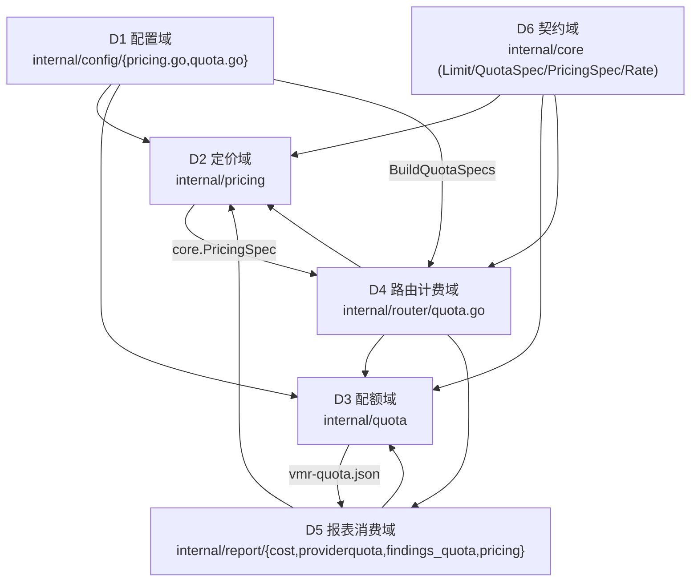
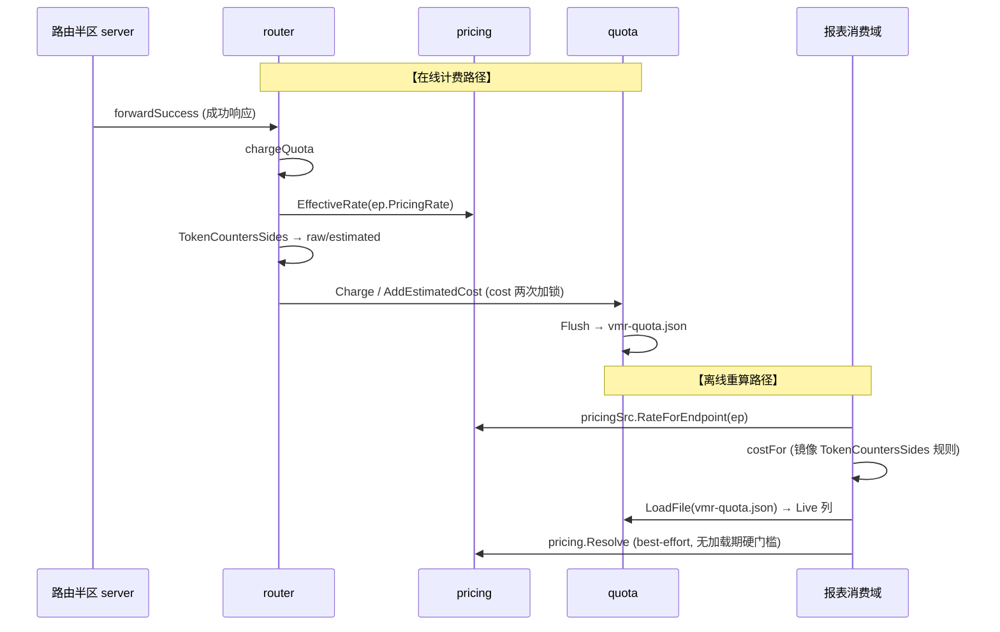
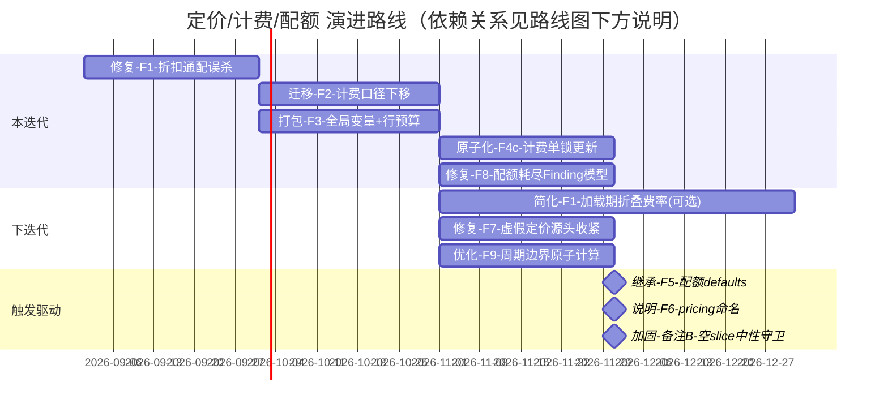

<!-- Ver 2026-09-03, by agent — 定价/计费/配额 专题架构 Review -->
<!-- 本报告按 full-review 方法论（阶段一~五）执行，范围仅限定价、计费、配额；对源码逐条复核后合并吸收了 Billing_Quota_Pricing_2026-09 全部有效内容。 -->

# 定价 · 计费 · 配额 专题 Review（agent · 2026-09-03）

> **定位**：一次范围严格限定在"定价 / 计费 / 配额"的系统级架构 Review。方法沿用 full-review 五阶段；但**覆盖范围收窄**为定价、计费、配额相关的模块、代码、功能（`internal/pricing`、`internal/quota`、`internal/config` 的 pricing/quota 部分、路由半区计费路径 `internal/router/quota.go`、分析半区配额/成本消费面 `internal/report/{cost,providerquota,findings_quota,pricing}.go`、`cmd/vmr` 配额入口、`core` 的 `QuotaSpec`/`PricingSpec`/`Limit` 契约）。
> 前身文档 `Billing_Quota_Pricing_2026-09` 的全部有效内容（P1–P6、配额周期时区裁决、`every` 语法备注、优先级矩阵与依赖关系）已在下文逐条合并吸收，状态更新为"本轮源码复核结论"；确认吸收完整后，前身文档被删除。
> 仅审业务代码；测试代码本体不审，但差分测试（`cmd/vmr/quota_parity_test.go`）作为机制在阶段三评估。

---

## 阶段零：前身文档吸收核对表

| 前身条目 | 本轮源码复核 | 本篇定位 |
| --- | --- | --- |
| P1 定价"死抽象" | **不成立**（本轮实测推翻：递归折扣链真实可达且在热路径生效），已重写为"校验器误杀" | F1 |
| P2 计费口径双份 | **成立**，锚点更精确（`cost.go` + `recextract.go` 两处镜像） | F2 |
| P3 报表全局变量 + 行预算 | **成立**（`lastSkipped*` 全局、`aggregate.go` 599 行） | F3 |
| P4 配额并发 (a/b/c) | **成立**（单一 `sync.Mutex`；cost 路径两次加锁） | F4 |
| P5 token_weights/model_multipliers 跨 Limit 重复 | **成立**（配置侧 fail-fast 仍在） | F5 |
| P6 `pricing` 字段名语义模糊 | **成立**（`pricing.go` 双重角色仍存） | F6 |
| 配额周期走本地时区（裁决维持现状） | **维持**，补一条耦合风险注记 | 裁决 A |
| `every` 自创语法（d/w/mo） | 维持；并确认"时长单位统一"可复用 `parseEvery` | 备注 A |
| 新增：报表把"未完全解析/折扣悬空"费率当已定价 | **本轮新发现**（见 §5 F7） | F7 |
| 新增：§7 配额耗尽 Finding 对模型级配额缺失模型信息 | **本轮新发现**（见 §5 F8） | F8 |
| 新增：`PeriodStart`/`PeriodEnd` 在评分热路径存在双重冗余计算 | **本轮新发现**（见 §5 F9） | F9 |

---

## 阶段一：领域划分

定价/计费/配额贯穿两个半区，按架构职责划为 6 个 Domain（本专题边界内）：



- **D1 配置域**：`pricing`/`quota` 的 YAML 形态、校验、`resolvePricing` 加载期定价。审查焦点：fail-fast 完整性、校验是否与运行期能力错位。
- **D2 定价域**：三层费率解析、折扣链、别名/前缀消歧、币种归一。焦点：SSOT、分层纯净、失效抽象。
- **D3 配额域**：周期数学、计数/评分、落盘。焦点：并发模型、周期边界、零值语义。
- **D4 路由计费域**：响应计量、配额扣减、按 headroom 重排。焦点：口径归属、热路径代价。
- **D5 报表消费域**：成本估算、§2.5 配额对照、配额耗尽 finding。焦点：与路由口径是否复刻、全局状态。
- **D6 契约域**：跨两半区必须一致的运行态类型。焦点：nil=未知 vs 0=免费是否传到边界。

---

## 阶段二：分 Domain 深审

### D1 配置域（internal/config）

**职责与边界**：干净。`pricing.go` 负责 `pricing:` 块与 `metric: cost` 加载期定价；`quota.go` 负责 `quota:` 块与 Limit 校验。两文件均因行预算从 `config.go` 拆出。

**质量点**：
- 校验远超"合法即可用"：`firstDeadOverride`（`pricing.go:177`）拒绝 first-match-wins 下永远不可达的规则；`resolvePricing`（`pricing.go:357-371`）对 `metric: cost` 的每个模型做完整四分量 `Complete` 校验；`validateQuota` 做跨 Limit 桶键冲突检测（`quota.go:100-119`）；`parseEvery` 自创 d/w/mo 语法。fail-fast 严格到位。
- **迁移陷阱**：`QuotaConfig.TokenWeights/ModelMultipliers` 作为账号级字段保留占位，只报错误指引新位置（`quota.go:44-48`）——不是"静默忽略"，这是诚实的迁移策略。
- **隐患**：`validateQuota` 的"重复 limit key"检测把 `Metric + EveryText` 全相等才判冲突（`quota.go:100-119`）。但 `LimitKey` 是 `metric/every[#model=...]` 拼接，`Since` 不参与键——两条件（同 metric+every）若 `Since` 不同但 `Models` 相同，桶其实共用同一 key。检测逻辑**把 `Since` 排除在冲突判据之外是对的**（键不含 since），但校验器在"每模型 vs 共享"与 `ModelSetsOverlap` 上的组合被认真处理过——这是一处经过推敲的实现，无问题。

### D2 定价域（internal/pricing）

**职责与边界**：叶包，只依赖 core+stdlib+yaml。`Rate`（`pricing.go:78-95`）把 nil=未知、0=免费编码进类型；`Complete/MissingComponents`（`pricing.go:66-118`）支撑加载期硬门槛。

**质量点**：
- 四步自动消歧 + basename 重试（`resolve.go:117-186`）逻辑自洽、终止性有证明；vendor precedence 只收窄不改变既有结果，注释明确。
- `Merge`（`pricing.go:343-369`）按 key 整行覆盖而非逐分量——"显式优于部分"一致。
- **校验器与解析器语义不一致**：`resolveChain`（`internal/pricing/resolve.go`）实现**递归折扣下钻**（discount over override），且"具体折扣 + 通配显式"与"双层折扣"两种形态都能通过校验并在热路径生效；只有"通配折扣在前"被 `firstDeadOverride` 判死 —— 那恰是该递归唯一为之设计的形态（见 F1）。
- **已知非修**：`RateForEndpoint`（`resolver.go:103-117`）用严格 `":"` 拆分、刻意不用 `core.SplitEndpointLabel` 的旧 `"/"` 形式——文档化的历史报表保真取舍。

### D3 配额域（internal/quota）

**职责与边界**：干净。周期数学（`period.go`）、计数（`quota.go`）、评分（`score.go`）、落盘（`store.go`）分离。

**质量点**：
- 周期数学是本题最易错处：`addMonthsClamped`（`period.go:141-166`）手工处理月末溢出，`findK`（`period.go:95-110`）种子+短走查 O(1)，`DefaultSince`（`period.go:178-217`）锚定固定日历边界保证重载幸存——均有注释论证，质量高。
- **并发模型**：`Registry` 单一 `sync.Mutex`（`quota.go:222`），读路径 `Used`（`quota.go:337`）也持排他锁；cost 计费 `Charge` + `AddEstimatedCost`（`quota.go:320/357`）对同一笔请求分两次锁更新。见 F4。
- **`BucketIndex` 平局/空哨兵**：`ScoreForLimits`（`score.go:152-166`）空 slice 时 `score` 初始化为 `HeadroomCap`（5.0）并原样返回——空查询被当作"最大余量"，而非"无配额"。调用方都先 guard `len>0`，故不触发；但函数本身是脚枪（见备注 B）。
- **落盘**：`Flush`（`store.go:61-140`）temp+rename+fsync、0600，锁内快照、锁外 marshal+IO；错误恢复 dirty。质量高。见 F4(b) 的序列化说明。

### D4 路由计费域（internal/router/quota.go）

**职责与边界**：干净。`chargeQuota`/`ChargeResponse` 只被 `forwardSuccess` 与 `replay` 调用，不计费失败/中止/内容拒绝；`reorderByQuota` 只在 `strategy.Sort` 后、sticky 前重排（唯一正确接入点）。

**质量点**：
- `ChargeResponse`（`quota.go:108-146`）是三 metric 分派 + `model_multipliers` 缩放 + cost 定价的尾部，被 `replay/charge.go` 复用——复推 `vmr replay` 计费正向收敛。
- **口径归属争议**：精确 vs 降级判定的`权威实现`是 `TokenCountersSides`（`quota.go:230-260`），却被放在**路由包**里（见 F2）。
- **热路径**：`metric: cost` 每笔请求调用 `pricing.EffectiveRate(ep.PricingRate)`（`quota.go:127`）做链式解析（见 F1 的热路径推论）。

### D5 报表消费域（internal/report）

**职责与边界**：只读离线。`cost.go` 成本公式、`providerquota.go` §2.5 对照表、`findings_quota.go` 配额耗尽 finding。

**质量点**：
- "待计费而未定价"的降级用 `nil`/`-` 表达而非 0（`providerquota.go:330-358`），方向正确。
- **全局状态退化**：`lastSkippedAttempts`/`lastSkippedProviders`（`providerquota.go:215-216`）是包级可变全局，在构建与渲染两阶段间传值（见 F3）。
- **口径复刻**：`costFor`（`cost.go:20-41`）+ `recextract.go:166-176` 复刻 `TokenCountersSides` 的降级/max 规则（见 F2）。

### D6 契约域（internal/core）

- `Rate`/`PricingSpec`/`PricingOverride`/`Limit`/`QuotaSpec` 均把 nil=未知 vs 0=免费推进到边界；`PricingSpec.Base` 不能单独折叠的论证成立（折进 Base 又留在 Overrides 会双重计算），与 F1 无关 —— F1 的对象是校验器，不是这条论证。
- `TokenWeights` 零值是 `{0,0,0,0}` 而非"全 1"，`NewTokenWeights` 是唯一正确起点（`core.go:440-461`）——靠 `DefaultTokenWeight`+注释防踩。

---

## 阶段三：跨域链路串联与源码核实

### 计费口径链路（一请求的手工 vs 离线两条径）



**源码级交叉核实**：
- **契约一致性**：`core.Rate`（零依赖）与 `pricing.Rate` 结构同构，靠 `toCore/fromCore` 转换——"core 不能 import pricing"这一零依赖约束的代价，被显式注释为有意为之。✅
- **口径分裂**：在线口径权威在 `router.TokenCountersSides`，离线条径在 `report.costFor`/`recextract` 各复刻一份，靠 `quota_parity_test.go` 兜底。✅ 见 F2。
- **双半区契约一致性**：`PricingSpec.Currency` 必须由配置路径与离线路径各自 label 同一币种，`Resolver` 的 `currency`/`tableFactor` 存于全局而非 per-provider 正是为修一个真实 bug（`resolver.go:57-95`）。✅ 干净。
- **跨层渗透**：`quota` 叶包 import `fmtutil` 取 `DisplayZone`（`period.go:113-139`）——周期边界（会计概念）用了"展示"时区。见裁决 A 的耦合注记。

---

## 阶段四：顶层架构全景审视

### 1. 分层解耦与组织一致性
- 本专题内分层**基本彻底**：`pricing`/`quota` 是共享叶，路由与报表都调它们；`cost.go` 与 `router/quota.go` 共享 `pricing.Rate.Cost`。
- **两处组织错位**（问题类）：
  - 精确/降级判定的权威实现 `TokenCountersSides` 被困在**路由包**（本该属"用量语义"→解析或配额包），导致报表被迫复刻 → F2。
  - `quota` 把"展示时区"用于"会计周期" → 裁决 A（维持但记耦合）。
- `internal/replay` 直接调 `router.TokenCountersSides`（它本来就能 import router），无漂移；真正的裂缝只在 `report` 侧。

### 2. 极简/简化/复杂度控制
- **语义分裂**：`resolveChain` 的折扣下钻与 `firstDeadOverride` 的 first-match-wins 建模互相矛盾，代价是一种真实需求无法表达 → F1。
- `cost.go` 的 `addCost`（`cost.go:75-84`）把"五桶都要加"从手写五遍收敛成共享调用——这正是反例：本应共享却散落的模式，在 `TokenCountersSides` 处又犯了。
- `Rate` 双类型（`pricing.Rate` vs `core.Rate`）+ 转换器，是零依赖约束的合理成本，不算过度设计。

### 3. 单事实源（SSOT）与逻辑权威性
- **本专题范围内，SSOT 面临三处风险**：
  - 精确/降级规则两处复刻（F2）。
  - 报表"定价判定"用 `CostEstimate != nil`（`cost.go:66`）是否已定价——与"rate 是否能解析"挂钩，但**不完全解析**的 rate 也会 `!= nil` → F7。
  - `quota.ScoreForLimits` 空 slice 返回 `HeadroomCap` 与调用方 guard 的约定靠记忆维持（备注 B）。

### 4. 显式严谨与防御性健壮性
- 类型系统对"未知 vs 免费"的区分贯彻到位（`Rate` 指针、`Complete`、加载期硬门槛）。
- fail-fast 严格：`pricing.currency` 无汇率即报错（`pricing.go:250-258`），NaN/Inf/负费率读表即拒（`pricing.go:520-585`）。
- 一处可改进：`pricing.Rate.Cost`（`pricing.go:158-174`）对 nil 分量贡献 0，注释自认"防御性底线，非文档化降级路径"——在报表 best-effort 语境里这**就是**降级路径，见 F7。

### 5. 冗余与失效代码
- 本专题范围内**没有确认的失效代码**：`resolveChain` 的递归经实测可达（F1 的复核批注）。
- `PricingSpec.Base`"不能折叠"的论证成立且与现实一致；可折叠的是**整条链的结果**（一个已解析 `Rate`），不是 `Base` 本身 —— 两者不是一回事，见 F1 的正交简化项。

### 6. 可演进性与改动成本
- 计费口径若改动：需要同时改 `router.TokenCountersSides`、`report.costFor`、`report/recextract.go`、外加跑 `quota_parity_test.go`——**跨 4 处**，正是 F2 的结构隐患。
- 任一 `Config` 字段改动（如把 `token_weights` 上提）→ `config/{pricing,quota}.go`、`snapshot.go`、`/status` JSON 契约、`vmr check`、`report` 联动，成本真实存在（F5 已确认"不上提"是对的）。

---

## 阶段五：问题清单（四段式）与演进路线图

### 按 ROI 排序、按 Domain 分组的系统性清单

#### F1 · 折扣叠加：递归解析是活的，被加载校验单方面误杀 【D2 定价域 × D1 配置域 · 前身 P1 · ROI 中高】

> **[复核批注]** 原判断（"`resolveChain` 是死抽象、合法配置链深恒 ≤1、多层叠加 100% 不可达"）经源码 + 实测**不成立**，本条已按事实重写。实测三种形态：① `[{model: X, discount: 0.5}, {model: "*", <显式四要素>}]` —— 加载通过，`EffectiveRate(X)` = 0.5 × 显式费率（递归下钻到的是另一条 Override，不是 Base）；② `[{model: X, discount: 0.5}, {model: "*", discount: 0.8}]` —— 加载通过，`EffectiveRate(X)` = 0.4 × Base，两层折扣真实叠加；③ 只有"通配折扣在前 + 具体规则在后"被 `firstDeadOverride` 拒绝。即：递归链在 `metric: cost` 热路径上真实生效，删掉它是行为回归。

- **问题描述**：
  *底层矛盾*：`resolveChain`（`internal/pricing/resolve.go`）的语义是"折扣型规则**不终结匹配**，向下继续解析再缩放"；而配置校验 `firstDeadOverride`（`internal/config/pricing.go`）建模的是纯 first-match-wins —— 只要前面出现过 `"*"`，其后所有规则一律判死，不区分该通配是 Explicit 还是 Discount。于是 `[{model: "*", discount: 0.8}, {model: gpt-4o, <显式四要素>}]` 在解析器看来正是 0.8 × 专属价（设计文档"通配折扣叠在具体费率之上"的原意），却被校验器以 `model "gpt-4o" can never activate ... first-match-wins always picks that one first` 拒绝启动 —— 这句提示本身断言了一个解析器并不实现的语义。
  *实际影响*：
  - **不改**："全账号 8 折 + 个别模型专属价"这一需求**无法表达**。唯一能通过校验的近似写法是把专属价写在前、通配折扣写在后，但它对被专属定价的模型根本不打折 —— 用户很容易据此以为折扣已生效，而 `metric: cost` 会按未打折的价格实扣配额。
  - **改了**：折扣型通配不再终结后续规则，上述写法直接可用；校验器与解析器对"折扣"的语义重新一致。
- **根因**：时间维度（P0-A）被砍后，校验器加严清理"重复规则"时按 first-match-wins 一刀切建模，未区分 Explicit / Discount 两种规则形态；`resolveChain` 的下钻语义没有同步进校验器。前身 P1 把这个"校验器单方面收窄"误读成了"运行期能力失效"。
- **建议方案**：收窄 `firstDeadOverride` —— `seenWildcard` 仅在通配规则为 **Explicit** 形态时置位（折扣型通配不终结匹配，其后规则仍可达）；同 model 重复的判死同理只在前一条为 Explicit 时成立。错误文案同步改写。**不要删除 `resolveChain`**。
- **可选的正交简化（与上面独立排期）**：`EffectiveRate` 无时间维度、是 spec 的纯函数，因此可在加载期折叠成单个已解析 `Rate` 挂到 `core.Endpoint` 上，热路径变一次字段直读，`core.PricingSpec` 的 `Base+Overrides` 可收进 `internal/pricing`（离线 `Resolver` 的 memo 同样只需缓存 `Rate`）。但这是结构简化，不是"删死代码"：`resolveChain` 只是从每请求移到每次加载/每次 memo miss，仍然必须存在；热路径省下的是一次 ≤3 元素切片遍历，量级可忽略，不要拿它当收益。
- **ROI**：Return 中高（修一个真实的配置误杀 + 消除校验器与解析器的语义分裂）；Investment 低（校验器一处分支 + 文案 + 测试）。**本迭代做**。折叠优化优先级低于误杀修复，可缓做。

#### F2 · 计费口径双份维护：权威实现被困路由包，报表复刻一份 【D4 路由计费域 × D5 报表消费域 · 前身 P2 · ROI 中高】

> **[复核批注]** 结论与方案成立（`report` 允许 import `quota`，入参改纯标量后不破坏叶包边界，已对 archtest 的 `forbiddenImports` 核过）。两处失实需更正：① 历史事故不是"路由层修复失败重试的扣费口径、报表层漏改"——真实事故见 commit `66006f1`：§2.5 的 tokens 列对无 usage 对象的请求记 0，而路由按字节估算真实扣了配额（同批还修了一个 api_keys 间 failover 导致端点行重复计数的 basis bug）；② 真正的口径复刻点是 `cost.go` 的 `costFor` 与 `recextract.go` 的 est 填充**两处**，`accumulateQuotaWindow` 只是把已拆好的字段相加、不含降级判定，迁移时不必动它。

- **问题描述**：
  *典型业务场景*：流式请求返回时，若服务商的响应头或分块数据中未返回精确的缓存命中量（部分字段缺失），系统必须决定降级策略——“未嗅探到的分量是用本地估算替代还是按 0 计算，以及输出 token 是取 upstream 报的还是本地估算的最大值 `max(u.Out, outEst)`”。
  *底层失效矛盾*：这套决定“这笔请求到底算多少钱”的核心折算口径，目前权威实现在路由包的 `TokenCountersSides`（`internal/router/quota.go`）；但由于架构分层严格禁止报表包（`internal/report`）引用路由包，报表在成本聚合（`cost.go`）与记录提取（`recextract.go`）中**全凭人工记忆又硬编码复刻了一模一样的降级逻辑**。
  *改与不改的实际影响*：
  - **不改**：历史提交中已经发生过一次真实漂移事故（路由层修复了失败重试的扣费口径，报表层却漏改，导致控制台看到的扣除配额与报表账单对不上数），全凭一份脆弱的跨包差分测试（`quota_parity_test.go`）在兜底。未来任何人微调计费降级规则，都必须在两个隔离包里同时手改 3 处。
  - **改了**：将核心折算函数下沉至共享的底层配额包（`internal/quota`），路由与报表共同调用同一个权威实现，从根源上消灭口径撕裂的物理可能。
- **根因**：该函数本质是"用量折算语义"，应归配额包（`quota`，接收纯标量或 `quota.Counters`，避免跨包耦合 `chatmsg.Usage`）；只因第一个调用方在路由器，就写在了那儿。同批其他公式（基础用量 `BaseAmount`、模型倍率 `ApplyModelMultiplier`）已下沉 `quota` 共享，这是漏网的最后一个。
- **建议方案**：迁到 `internal/quota`（入参重构为纯标量或基础计数，解耦上层 `chatmsg.Usage`），路由与报表都调这一个实现；`replay` 继续用；差分测试继续保留作为锁定两半区统计基准（Basis）一致性的防御护栏。迁移时把 `report` 侧复刻点（`costFor`、`recextract`、`accumulateQuotaWindow`）统一改为调用它。
- **ROI**：Return 中高（计费正确性结构性隐患）；Investment 中。**本迭代做**。与 F4(c)、F7 同属计费/口径路径，可顺路原子化。

#### F3 · 报表包全局变量退化 + 聚合文件贴死行数预算 【D5 报表消费域 · 前身 P3 · ROI 中】

> **[复核批注]** 事实核对无误（`buildProviderQuotaRows` 已持有 `rep *Report2`；`aggregate.go` 599 行 / 预算 600；渲染侧 `renderProviderQuotaTable` 同样已拿到 `rep`，改签名成本为零）。一处夸大："顺序或并发生成两份报表导致提示丢失"当前**不可触发**——`report.BuildCached` 全仓只有 `cmd/vmr/cmd_report.go` 一个调用点且单线程。真实收益是 JSON 契约补齐 + 消除包级全局与测试对全局的直接读写，不是修一个现存的正确性 bug。

- **问题描述**：
  *典型业务场景*：离线分析日志时，若日志中包含未在当前 `config.yaml` 中注册的第三方服务商请求，报表在聚合阶段会跳过这些记录，并在最终控制台与 Markdown 输出中提示用户：“本次分析跳过了 N 次未知 provider 的请求”。
  *底层失效矛盾*：为了在“数据聚合”和“报表渲染”两个先后阶段之间传递“跳过了多少条记录”这一统计数字，代码在 `internal/report/providerquota.go` 中声明了包级全局变量。当时是因为主聚合文件 `aggregate.go` 代码行数已逼近 600 行的架构门禁上限，开发者为了逃避改签名会占用行数的错觉，直接用全局变量走捷径绕过门禁。
  *改与不改的实际影响*：
  - **不改**：一旦外部出现顺序分析两份日志或并发生成报表，后一份运行会直接抹零全局变量，导致前一份报告的跳过提示静默丢失；且全局变量的数据无法导出到结构化 JSON 报表中，破坏了 JSON 作为唯一事实源的契约。
  - **改了**：函数调用处其实早已传入了 `Report2` 结构体，只需在该结构体上加两个 skip 字段并在聚合时就地写入，零签名改动、零行数压力，彻底清除全局变量并补齐 JSON 报表数据。
- **根因**：两阶段数据交换缺一个结构体承载；行预算压力逼出全局变量。
- **建议方案**：直接处理：`aggregate.go` 调用处已传入 `rep *Report2`，只需在 `rows.go` 的 `Report2` 结构体中增加 skip 字段并在 `buildProviderQuotaRows` 内部就地写入 `rep`（信息自然进 JSON、补契约缺口、删掉测试对全局的直接操作），无需修改任何函数签名，零行数预算压力。同时把"Worker 因范围白名单采取的临时方案，合并时须被识别并当场修正或显式登记"记为流程教训。
- **ROI**：Return 中（架构退化消除 + 隐性正确性 bug + JSON 契约补齐）；Investment 中低。**本迭代做**。与 F2 同在 report 包，可同批。

#### F4 · 配额子系统并发模型 【D3 配额域 · 前身 P4 · ROI 中低 · 机会性】

> **[复核批注]** `/status` 每行两次加锁（`Used` + `EstimatedCostFor`）属实；但 `AddEstimatedCost` 只在存在未嗅探侧时才调用（`ChargeResponse` 的 `if !inSniffed || !outSniffed`），全嗅探的 cost 请求只有一次加锁——"每次请求双倍锁开销"不成立。裂缝的真实危害也不是"时钟回退误判"本身，而是：两次调用之间若另一 goroutine 触发了周期滚动，后到的 `AddEstimatedCost` 因携带旧 `periodStart` 会被 `resetIfStaleLocked` 判为时钟回退（误报一次 WARN），并把估算额记进已清零的新周期。(c) 的原子合并方向正确，这条才是它的论据。

- **问题描述**：
  *典型业务场景*：线上运行金额配额控制（`metric: cost`）时，每个请求成功后系统需要扣减配额并标记估算成本；与此同时，外部正在通过 `/status` 接口监控配额使用率，调度器也在对多个候选端点进行余量打分。
  *底层失效矛盾*：路由层在计费时，先获取一次全局锁调用 `Charge`，释放锁；紧接着又获取一次全局锁调用 `AddEstimatedCost`。两次加锁之间存在可观测的时间裂缝；此外，`/status` 监控接口在组装配额状态时，对每条 Limit 也是先锁一次查已用额度，再锁一次查估算成本。
  *改与不改的实际影响*：
  - **不改**：在高并发请求下，读者有概率在微小裂缝中读到“扣费已发生、但估算成本未就绪”的中间割裂态，若恰逢自然月/自然日周期边界，理论上存在跨周期时钟回退误判风险；同时每次请求和每次监控查询都承受了双倍的锁竞争开销。
  - **改了**：维持单一互斥锁（Go 读写锁不支持原子升级且配额读取伴随惰性重置，单锁更安全轻量）；将扣费与估算标记合并为一次锁内原子调用，监控读取侧提供快照接口一次性读出，消灭观测裂缝并减半锁争用。
- **根因**：单锁最简单，但把"读"与"写"、把"计数"与"估算标记"绑在同一次互斥；`EstimatedCost` 为省一次方法重载被拆成独立 call。
- **建议方案**：维持单一 `sync.Mutex`（Go `sync.RWMutex` 不支持原子锁升级，且 `Used` 含周期重置变异，单锁在此处开销更轻更安全）；优先落实 (c) 将 cost 估算并进 `Charge` 一次锁内原子更新（或让 `AddEstimatedCost` 与 `Charge` 合并为单锁调用）；读侧提供快照接口，消除 `/status` 对每条 Limit 连续调用 `Used` 与 `EstimatedCostFor` 的双重加锁；落盘保持单 flusher（必要性低）。
- **ROI**：Return 中、Investment 低到中。**机会性做，优先 (c) 原子合并**（与 F2 同属计费路径，顺路）。.

#### F5 · token_weights / model_multipliers 多条 Limit 重复配置 【D1 配置域 · 前身 P5 · ROI 中（设计选择）】

> **[复核批注]** 锚点方案已实测：`KnownFields(true)` 严格模式下 YAML merge key（`<<: *anchor`）能正常展开进 `LimitConfig`，"零代码"成立。（示例里两条 Limit 共享同一 `amount` 只是写法示意，实际应各自覆盖。）

- **问题描述**：
  *典型业务场景*：用户为一个提供商同时配置多级复合配额（例如 `1d` 限制 100 万 token、`1w` 限制 500 万 token、`1mo` 限制 2000 万 token），且需要为 Prompt Caching 指定四分量权重（如 `cache_read: 0.1, cache_write: 1.25`）。
  *底层设计取舍*：目前这套权重必须在 `1d`、`1w`、`1mo` 每条 Limit 内部各写一遍，无法在 Provider 顶层写一份自动继承。这是系统刻意支持的分层设计——短周期速率闸按原始次数等权拦截、长周期账单桶按四分量精确折算，强行放顶层会导致两者无法独立表达。
  *改与不改的实际影响*：
  - **改代码（不推荐）**：在 Go 配置解析层硬做多层默认值继承树，会大幅增加校验复杂度与配置二义性。
  - **利用已有特性（推荐）**：用户直接使用 YAML 原生锚点（`&tw_default` 与 `*tw_default`）即可一行实现多窗口复用，零代码侵入。保持现状是最佳工程选择。
- **根因**：无——是刻意分层。分层事实（均已 fail-fast）：`model_multipliers` 对 `cost` 报错（`config/quota.go`，cost 走 `pricing.overrides`）；对 `requests/tokens` 合法；`token_weights` 仅 `metric: tokens` 合法（`config/quota.go`）。
- **建议方案**：优先 **YAML 锚点**（零代码）：

  ```yaml
  quota:
    limits:
      - &tw_default
        metric: tokens
        every: 1d
        amount: 1000000
        token_weights: {in_fresh: 1.0, cache_read: 0.1, cache_write: 1.25, out: 4.0}
      - <<: *tw_default
        every: 1w
      - <<: *tw_default
        every: 1mo
  ```
  仅当真实场景出现"三条以上 Limit 共享同一份"且用户嫌锚点丑，再上 **defaults 继承**（`Provider.QuotaDefaults *TokenWeightsConfig`，Limit 留空回退；与 `ImageDownscaleMaxPx` 的 global-default/per-model-override 同构，`*int/*bool/*Duration` 指针三态已有先例）。`token_weights` 与 `model_multipliers` 同步处理。
- **ROI**：Return 中（消除重复），Investment 锚点零代码 / defaults 继承中。**锚点随文档更新；defaults 继承由真实场景触发**。

#### F6 · `pricing` 字段名语义模糊（计费 vs 报表） 【D1 配置域 · 前身 P6 · ROI 低】

- **问题描述**：
  *典型业务场景*：用户在编写 `config.yaml` 时看到 `providers[].pricing` 配置块。
  *用户困惑与设计现实*：配了 `metric: cost` 配额时，该块是必填的计费依据；但在没有配置任何配额控制时，用户依然可以填写该块，它完全不影响线上路由，纯粹是为了让离线分析工具 `vmr report` 输出准确的金额花费。同一个字段名承载了“在线强制配额约束”与“离线报表估算辅助”双重语义，初学者单看 YAML 无法分辨。
  *改与不改的实际影响*：
  - **改代码**：如果把字段强行改名为 `billing:` 或拆成两套配置，会直接破坏已有线上配置的向后兼容性。
  - **改文档**：仅在文档和示例配置中加入两行清晰注释说明双重用途，零代码成本消灭理解混淆。
- **根因**：字段命名承载了两种职责。
- **建议方案**：改名 `billing:`（破坏向后兼容）或仅在文档/示例注释显式说明"没配 `metric: cost` 时，pricing 块只影响报表 $ 估算精度"。
- **ROI**：价值低、成本极低。**仅文档说明**。

#### F7 · 报表把"未完全解析/折扣悬空"费率当已定价处理 【D2 定价域 × D5 报表消费域 · 本轮新发现 · ROI 中低】

> **[复核批注]** 机制核实成立（`Resolve` 在 `!tableHit` 且只匹配到折扣时返回 `ok=true` + 全空 `Rate`，`Rate.Cost` 得 0，`accumulateCost` 据此分配 `CostEstimate`）。一处需收窄：§2 成本章并非全无标记——`pr.Complete()` 为假会置 `EndpointRow.CostRateIncomplete`，`section_cost.go` 会渲染一条"费率不完整"的计数提示（但表格行内仍是精确的 `$0.00`）。**完全没有标记的是 §2.5**：`costAnyPriced` 把全空费率算作"已定价"，`WindowUnpricedPct` 因此保持 0。方案 (1)(2) 成立；(1) 的判据等价于"链必然终止在某条 Explicit 上"，因为 `resolveChain` 只会穿过折扣、停在第一条 Explicit。

- **问题描述**：
  *典型业务场景*：用户在配置中写了一条全通配打折规则 `pricing.overrides: [{model: "*", discount: 0.8}]`，但该模型是一个未收录在官方标准定价表中的小众或自建模型（在表里完全查不到基准价格）。
  *底层失效矛盾与严重后果*：费率解析引擎在标准表查无此模型的情况下，仅凭匹配到了这条打折规则，就误报“解析成功”，拿 0.8 乘空 Base 算出了全空的费率值。报表在计算费用时，全空费率算出的金额恰好是 `$0.00`，报表便误以为该模型已被有效定价，将 `$0.00` 记入配额窗口，并在报表窗口消耗列渲染出绿色的精确金额 `0.00`。
  *改与不改的实际影响*：
  - **不改**：运维人员看到一个模型明明产生了成千上万次调用，报表却显示花费 `$0.00`，造成“该模型完全免费”的严重财务误导，绕过了原本对未定价模型应显示的 `-`（未知费率标记）。
  - **改了**：在源头拦截无基准价的纯折扣悬空规则，并在消费侧增加空费率检查，报表忠实展示 `-`，捍卫“宁可显示未知，绝不谎报为零（missing beats wrong）”的最高准则；同时完全保留缺失 prompt cache 费率的主流模型的正常降级估算能力。
- **根因**：`pricing.Resolve` 在 `!tableHit` 时只要匹配到 override 就虚假返回 `ok=true`，若 override 全为折扣则折算为全空 `Rate{}`；而 `pricing.Rate.Cost` 对 nil 分量按 0 处理，全空 Rate 算得 `0.0`，导致 `accumulateCost` 误将 `$0.00` 赋值给 `CostEstimate` 指针，绕过了未定价检查。
- **影响**：仅 `vmr report`（离线口径）。`metric: cost` 在线路径不受影响——`Complete` 硬门槛挡住（`internal/config/pricing.go`）。
- **建议方案**：源头治理 + 消费侧兜底。(1) `pricing.Resolve` 在 `!tableHit` 时，必须确保匹配规则中至少有一条显式 `Explicit` 规则，否则视为悬空折扣直接返回 `nil, false`；(2) `pricing.Rate` 增加 `IsEmpty() bool`（四分量全空），报表 `accumulateCost` 仅在 `!pr.IsEmpty()` 时才分配 `CostEstimate`。保留部分定价模型（`CostRateIncomplete`）的正常降级估算，精准杜绝悬空折扣产生的全 0 虚假定价。`F7` 与 F2 同批修最省。
- **ROI**：Return 中低（报表计费正确性/不可信的 0）；Investment 低（两处简单判定 + 测试）。**随 F2 一并处理**。

#### F8 · §7 配额耗尽 Finding 对模型级配额（Scope/per-model）信息缺失，告警指向失真 【D5 报表消费域 · 本轮新发现 · ROI 中】

- **问题描述**：
  *典型业务场景*：用户在某个服务商下设置了复合限额，账号整体配置了充裕的月度总限额，但为了防止某昂贵旗舰模型被突发脚本打穿，专门对它设置了严格的模型级限额（如 `models: [gpt-4o]`，日配额较紧）。
  *底层失效矛盾*：当该旗舰模型在短时间内被频繁调用、配额耗尽触发熔断时，报表引擎在 §7“问题与异常（Findings）”中生成了耗尽告警。但由于告警生成函数只接收了 Provider 名称，导致报告中赫然写着：`Implicated: openai`，完全丢失了具体触发耗尽的模型 `gpt-4o`。
  *改与不改的实际影响*：
  - **不改**：运维人员收到告警后，误以为整个 OpenAI 账号额度耗尽挂掉，可能会盲目去充值主账号，或者错误地将其他所有便宜模型（如 mini）的流量全量切走。
  - **改了**：告警文本精准显示受限模型范围（如 `openai (gpt-4o)`），运维人员一眼即可看清是子模型单点耗尽还是全局账号耗尽，排障决策零偏差。
- **根因**：P3 引入模型作用域（Scope/Per-Model Limit）后，报表行结构 `ProviderQuotaRow` 增加了 `Models` 字段，但 `findings_quota.go` 及对应 i18n 文本模板未同步扩展，仍沿用 P1/P2 时期仅包含 provider 的入参。
- **建议方案**：
  1. 扩展 `ProviderQuotaExhaustionFinding` 的签名，传入 `models []string`；
  2. 若 `len(models) > 0`，在 `Implicated` 或 `Value` 中显式标明模型范围（如 `openai (gpt-4o)` 或在 Value 中增加 `· gpt-4o`）；
  3. 同步调整 `internal/i18n/report_efficiency.go` 的中英文模板与对应单元测试。
- **ROI**：Return 中（消除多模型配额场景下的告警误导）；Investment 低（修改 1 处调用与 2 处 i18n 模板）。建议本迭代顺路完成。

#### F9 · `PeriodStart` 与 `PeriodEnd` 在评分热路径存在双重冗余计算 【D3 配额域 · 本轮新发现 · ROI 中低】

> **[复核批注]** 冗余属实，且比描述的更多：`scoreForEndpoint` 每条 Limit 实跑**三次** `findK`（`Used` 用的 `PeriodStart`，加 `ScoreForLimit` 内的 `PeriodStart`/`PeriodEnd`）。但 `findK` 是"除法定种子 + 常数步走查"，单次纳秒量级，相对一次上游 HTTP 请求可忽略——"热路径 CPU 开销"撑不起收益，真正理由只有 API 自洽（周期起止本就该一次取回）。Return 宜降为低，仍值得顺手做。

- **问题描述**：
  *典型业务场景*：每个线上请求进入路由核心时，调度器都要对候选列表中的所有可用端点，按当前配额余量（Headroom）进行实时的评分与动态重排。
  *底层失效矛盾*：余量打分函数需要知道配额周期的起点与终点。现有代码先调用 `PeriodStart` 执行了一遍完整的日历算法（查找当前时间步长、处理自然月月末 28/30/31 天自适应钳制），接着立刻调用 `PeriodEnd`，以完全相同的入参把这套复杂的日历算法**从头到尾重复执行了一遍**。
  *改与不改的实际影响*：
  - **不改**：在线请求调度热路径上，候选列表里的每个端点、每条 Limit 都在做两倍的日历查找与时间运算，存在冗余的 CPU 开销。
  - **改了**：抽象出一个原子函数 `PeriodBounds`，一次日历定位同时返回起止时间 `(start, end)`，API 语义更自然，且彻底消除热路径上的重复日历换算。
- **根因**：API 设计时仅暴露了独立的 `PeriodStart` 与 `PeriodEnd`，未提供成对获取周期边界的原子函数 `PeriodBounds(l core.Limit, now time.Time) (start, end time.Time)`。
- **建议方案**：在 `internal/quota/period.go` 中实现 `PeriodBounds`，一次 `findK` 同时返回 `step(since, k)` 和 `step(since, k+1)`；`ScoreForLimit`、`QuotaStatus`（`router/quota.go`）和 `providerquota.go` 均改为调用 `PeriodBounds`。`PeriodStart` 与 `PeriodEnd` 保留为调用 `PeriodBounds` 并取其一的轻量包装。
- **ROI**：Return 中低（消除热路径重复日历计算，代码更自洽）；Investment 低（不到 15 行代码）。建议机会性或下迭代完成。

#### 备注 B · `ScoreForLimits` 空 slice 返回最大余量 （D3 配额域 · 脚枪）
- `internal/quota/score.go` 中 `ScoreForLimits` 初始设为 `HeadroomCap`（5.0），空 `limits` 原样返回。调用方（`reorderTier`/`scoreForEndpoint`）都先有非空前置保护，故生产不触发。
- *严重误区纠偏与改动影响*：Headroom 余量评分算法的取值区间是 0.0 ~ 5.0。其中 **0.0 代表配额已 100% 耗尽**（惩罚最低分，会被直接降级压制）；而 **1.0 才是用量与时间步调一致的中性基准分**；5.0 是完全无消耗的最大余量分。原文档曾提议“空 slice 显式返回 0（中性）”，这是一个极其危险的逻辑倒挂——若真返回 0，未配置配额的端点会被误判为“配额已耗尽”而被调度器打入冷宫。做防御性重构时，空输入只应返回 1.0（中性不奖不惩）或保持 5.0（无配额即无约束），**绝对不能返回 0**。

#### 裁决 A · 配额周期边界走本地时区（维持现状，记耦合注记） 【D3 配额域 × D6 契约域】
- 曾有报告"跨时区月末错位"。复核：配额周期按**本地时区**计算是明确论证过的决策（"本地时区最贴近运维者心智模型"，`internal/quota/period.go` 中引用 `fmtutil.DisplayZone`），所述锚点日偏移是已知边界，非缺陷。**维持现状**。耦合注记：`quota`（会计概念）为周期边界使用 `fmtutil.DisplayZone`（展示概念）——`DisplayZone` 是进程级固定，若其值在两次运行间改变，`PeriodStart` 平移会触发 `resetIfStaleLocked` 的"新周期"判定、清空计数。这是隐性耦合；可在文档补一句"显式 `since` 建议用本地时区偏移书写"以降低误读。精确说：只有 `DisplayZone` 变化导致 `PeriodStart` **前移**才会命中 `resetIfStaleLocked` 的清零分支；后移被当作时钟回退处理（保留计数 + 一次 WARN），不清零。

#### 备注 A · `every` 自创后缀语法（维持，可复用）
- `quota.limits[].every` 的 `1d/1w/1mo` 是自创语法，因 Go `time.ParseDuration` 无 d/w/mo（`internal/config/quota.go` 的 `parseEvery`）。**合理，勿"统一"掉**。若日后统一全配置时间字段（`*_days → Duration`），`config.Duration` 的 parser 可直接复用 `parseEvery`；且二者已在同一文件（`quota.go`）相邻，改造成本低。该统一属跨字段一致性问题，不在本专题展开。

---

### 架构健康度评估

**优势与坚守的不变量**：
- "nil=未知、0=免费"从 `Rate`（`core`/`pricing`）一路贯彻到配置校验与报表降级——本项目最一致的语义。
- 三层费率解析（账号 override → 表 → ×汇率到币种）干净分层；`metric: cost` 加载期硬门槛是真"fail-fast"。
- Period 数学严谨（月末钳制、O(1) findK、重载幸存）——全工程最易错处反而做得最扎实。
- `quota` 按 provider **名称**记数（轮换 key 不清零）是防 bug 的正确决策，注释作为反"再协调"护栏明确存在。
- 两域共享叶（`pricing.Rate.Cost`/`quota.BaseAmount`/`ApplyModelMultiplier`）已经收敛，方向正确。

**当前薄弱点**：
1. 精确/降级口径的权威实现困在路由包，报表被迫复刻（F2）——本专题最突出的 SSOT 裂缝。
2. 配置校验比解析器更严，误杀了"通配折扣叠在具体费率之上"这一唯一写法（F1）—— 校验器与解析器对同一语义各建一套模型。
3. 报表建模退化为包级全局（F3）——范围白名单泄漏 + 行预算双重压力源。
4. 报表"已定价"判定与"可完全解析"不同构（F7）——`missing beats wrong` 被绕过。
5. `quota` 单锁 + cost 双锁成习惯，非 bug 但仍值得一次原子化收敛（F4）。
6. §7 配额耗尽 Finding 对多模型独立配额（Per-Model Limit）丢失作用域信息，引发误判（F8）。
7. 配额周期边界计算在热路径存在重复的 `findK` 冗余开销（F9）。

### 中长期架构演进路线图



**依赖关系**：F1 与 F7 同在 `internal/pricing` 的规则匹配路径上（一个收窄校验器、一个收紧 `Resolve` 的 `ok` 判据），宜同批；F2→F4(c)→F7 同属计费/口径路径，强相关，建议一条流水线（F2 下移口径后，F4(c) 的单锁更新与 F7 的 `Resolve` 源头收紧顺路做）；F3 与 F8 同在 report 包，可并行、同批合入。

**"不建议做 / 缓做"结论**：F5 的 defaults 继承、F6 的 `billing` 改名、F1 的加载期折叠优化——均在真实场景触发前不做，避免为不存在的需求加复杂度；配额周期时区（裁决 A）明确维持现状；备注 B 严禁改为返回 0。

---

## 收尾：吸收与删除确认

- 前身 `Billing_Quota_Pricing_2026-09` 的 6 条问题（P1–P6）、时区裁决（§3 裁决不做）、`every` 语法备注（§4）、优先级矩阵与依赖关系（§5/§6）已在阶段零核对表 + 各 F 条目中**逐条合并**，状态更新为源码复核结论。
- 本篇新增独立结论：F7（已定价判定）、F8（配额耗尽 Finding 模型缺失）、F9（周期边界重复计算）、备注 B（空 slice 脚枪研判）、裁决 A 的耦合注记、阶段四的架构顶层审视。
- 确认吸收完整后，删除 `Billing_Quota_Pricing_2026-09`。
