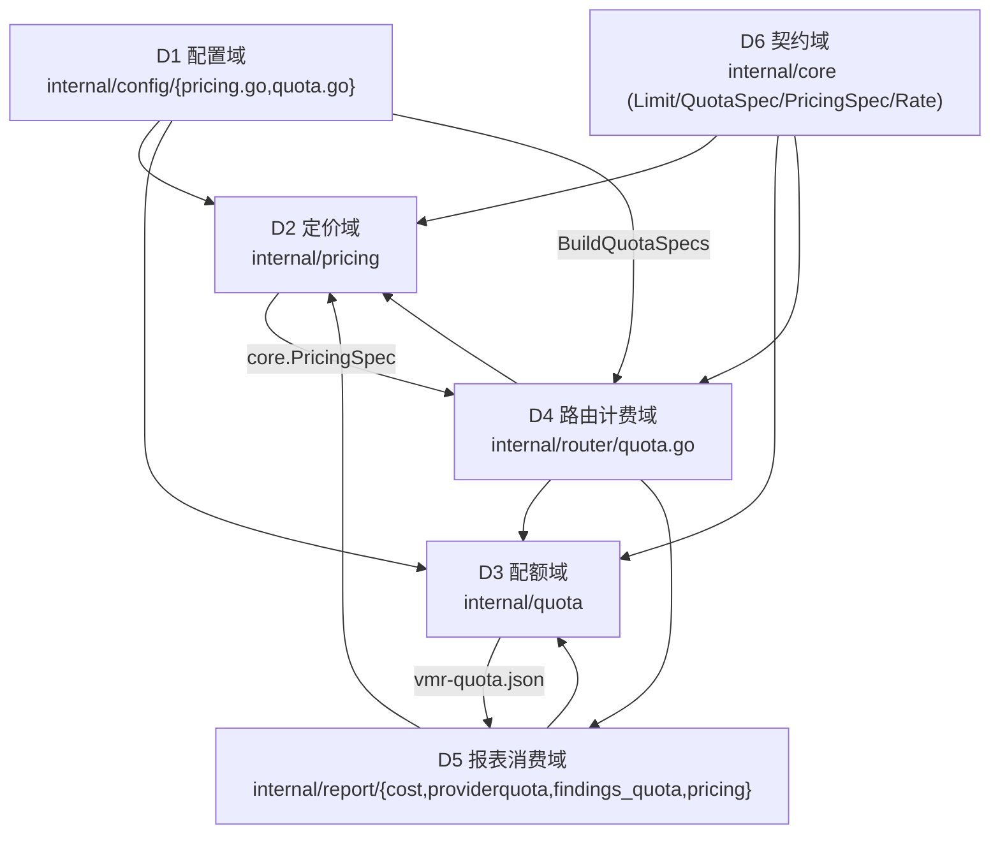
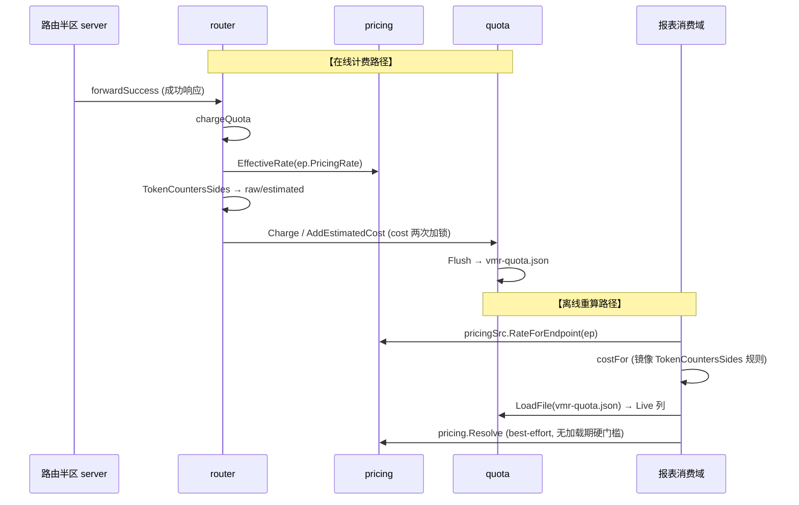

<!-- Ver 2026-09-03, by agent — 定价/计费/配额 专题架构 Review -->
<!-- 本报告按 full-review 方法论（阶段一~五）执行，范围仅限定价、计费、配额；对源码逐条复核后合并吸收了 Billing_Quota_Pricing_2026-09 全部有效内容。 -->

# 定价 · 计费 · 配额 专题 Review（agent · 2026-09-03）

> **落地状态(2026-09-05,最终复核)**：F1-F9 + 备注 A/B + 裁决 A + N3 + L2 全部落地或确认维持，四轮独立终审后又做了一轮分歧收口（`ISSUE_DIVERGENCE_RESOLUTION_claude-sonnet-5_2026-09-04.md`：F9 在 `report` 侧的收口逃逸补齐、`AddEstimatedCost`/`EstimatedCostFor` 死代码删除、`TokenCountersSides` 注释订正、N3 补只读基线测试）。复核过程新发现的 N2 / N5 / N9（三份文档交叉核对 + 逐条源码抽样验证 + 第一性原理分析）也已全部落地或裁决：N2 第一步落地（`Endpoint.PricingRate` 改持 `pricing.FoldSpec` 折叠出的 `*core.Rate`，热路径字段直读、override 链不再进实时路由热路径；成本公式收敛 `core.Rate.Cost`；`core.PricingSpec` 迁入 `internal/pricing` 维持触发驱动，登记见 `KNOWN_ISSUES` §2.89）、N5 落地（等周期次级裁决 + `vmr check` 打印桶/闸角色）、N9 裁决不修（纯日志残留，完整理由见 `KNOWN_ISSUES` §2.91）。本专题原始范围与复核新发现的技术债至此全部清零或转为确认维持/裁决不修，阶段五按"已解决只留标题 + 状态标签"重构，四段式正文与复核细节移入 `ISSUE_RESOLUTION_REPORT.md`。**驳回**：N8「nil Facts panic」——`core.CanonicalRequest.Facts` 是值类型，类型混淆。

> **定位**：一次范围严格限定在"定价 / 计费 / 配额"的系统级架构 Review。方法沿用 full-review 五阶段；但**覆盖范围收窄**为定价、计费、配额相关的模块、代码、功能（`internal/pricing`、`internal/quota`、`internal/config` 的 pricing/quota 部分、路由半区计费路径 `internal/router/quota.go`、分析半区配额/成本消费面 `internal/report/{cost,providerquota,findings_quota,pricing}.go`、`cmd/vmr` 配额入口、`core` 的 `QuotaSpec`/`PricingSpec`/`Limit` 契约）。
> 前身文档 `Billing_Quota_Pricing_2026-09` 的全部有效内容（P1–P6、配额周期时区裁决、`every` 语法备注、优先级矩阵与依赖关系）已在下文逐条合并吸收，状态更新为"本轮源码复核结论"；确认吸收完整后，前身文档被删除。
> 仅审业务代码；测试代码本体不审，但差分测试（`cmd/vmr/quota_parity_test.go`）作为机制在阶段三评估。

---

## 阶段零：前身文档吸收核对表

| 前身条目 | 本轮源码复核 | 本篇定位 |
| --- | --- | --- |
| P1 定价"死抽象" | **不成立**（本轮实测推翻：递归折扣链真实可达且在热路径生效），已重写为"校验器误杀" | F1 |
| P2 计费口径双份 | **成立**，锚点更精确（`cost.go` + `recextract.go` 两处镜像） | F2 |
| P3 报表全局变量 + 行预算 | **成立**（`lastSkipped*` 全局、`aggregate.go` 599 行） | F3 |
| P4 配额并发 (a/b/c) | **成立**（单一 `sync.Mutex`；cost 路径两次加锁） | F4 |
| P5 token_weights/model_multipliers 跨 Limit 重复 | **成立**（配置侧 fail-fast 仍在） | F5 |
| P6 `pricing` 字段名语义模糊 | **成立**（`pricing.go` 双重角色仍存） | F6 |
| 配额周期走本地时区（裁决维持现状） | **维持**，补一条耦合风险注记 | 裁决 A |
| `every` 自创语法（d/w/mo） | 维持；并确认"时长单位统一"可复用 `parseEvery` | 备注 A |
| 新增：报表把"未完全解析/折扣悬空"费率当已定价 | **本轮新发现**（见 §5 F7） | F7 |
| 新增：§7 配额耗尽 Finding 对模型级配额缺失模型信息 | **本轮新发现**（见 §5 F8） | F8 |
| 新增：`PeriodStart`/`PeriodEnd` 在评分热路径存在双重冗余计算 | **本轮新发现**（见 §5 F9） | F9 |

---

## 阶段一：领域划分

定价/计费/配额贯穿两个半区，按架构职责划为 6 个 Domain（本专题边界内）：

- **D1 配置域**：`pricing`/`quota` 的 YAML 形态、校验、`resolvePricing` 加载期定价。审查焦点：fail-fast 完整性、校验是否与运行期能力错位。
- **D2 定价域**：三层费率解析、折扣链、别名/前缀消歧、币种归一。焦点：SSOT、分层纯净、失效抽象。
- **D3 配额域**：周期数学、计数/评分、落盘。焦点：并发模型、周期边界、零值语义。
- **D4 路由计费域**：响应计量、配额扣减、按 headroom 重排。焦点：口径归属、热路径代价。
- **D5 报表消费域**：成本估算、§2.5 配额对照、配额耗尽 finding。焦点：与路由口径是否复刻、全局状态。
- **D6 契约域**：跨两半区必须一致的运行态类型。焦点：nil=未知 vs 0=免费是否传到边界。

---

## 阶段二：分 Domain 深审

### D1 配置域（internal/config）

**职责与边界**：干净。`pricing.go` 负责 `pricing:` 块与 `metric: cost` 加载期定价；`quota.go` 负责 `quota:` 块与 Limit 校验。两文件均因行预算从 `config.go` 拆出。

**质量点**：
- 校验远超"合法即可用"：`firstDeadOverride`（`pricing.go:177`）拒绝 first-match-wins 下永远不可达的规则；`resolvePricing`（`pricing.go:357-371`）对 `metric: cost` 的每个模型做完整四分量 `Complete` 校验；`validateQuota` 做跨 Limit 桶键冲突检测（`quota.go:100-119`）；`parseEvery` 自创 d/w/mo 语法。fail-fast 严格到位。
- **迁移陷阱**：`QuotaConfig.TokenWeights/ModelMultipliers` 作为账号级字段保留占位，只报错误指引新位置（`quota.go:44-48`）——不是"静默忽略"，这是诚实的迁移策略。
- **隐患**：`validateQuota` 的"重复 limit key"检测把 `Metric + EveryText` 全相等才判冲突（`quota.go:100-119`）。但 `LimitKey` 是 `metric/every[#model=...]` 拼接，`Since` 不参与键——两条件（同 metric+every）若 `Since` 不同但 `Models` 相同，桶其实共用同一 key。检测逻辑**把 `Since` 排除在冲突判据之外是对的**（键不含 since），但校验器在"每模型 vs 共享"与 `ModelSetsOverlap` 上的组合被认真处理过——这是一处经过推敲的实现，无问题。

### D2 定价域（internal/pricing）

**职责与边界**：叶包，只依赖 core+stdlib+yaml。`Rate`（`pricing.go:78-95`）把 nil=未知、0=免费编码进类型；`Complete/MissingComponents`（`pricing.go:66-118`）支撑加载期硬门槛。

**质量点**：
- 四步自动消歧 + basename 重试（`resolve.go:117-186`）逻辑自洽、终止性有证明；vendor precedence 只收窄不改变既有结果，注释明确。
- `Merge`（`pricing.go:343-369`）按 key 整行覆盖而非逐分量——"显式优于部分"一致。
- **校验器与解析器语义不一致**：`resolveChain`（`internal/pricing/resolve.go`）实现**递归折扣下钻**（discount over override），且"具体折扣 + 通配显式"与"双层折扣"两种形态都能通过校验并在热路径生效；只有"通配折扣在前"被 `firstDeadOverride` 判死 —— 那恰是该递归唯一为之设计的形态（见 F1）。
- **已知非修**：`RateForEndpoint`（`resolver.go:103-117`）用严格 `":"` 拆分、刻意不用 `core.SplitEndpointLabel` 的旧 `"/"` 形式——文档化的历史报表保真取舍。

### D3 配额域（internal/quota）

**职责与边界**：干净。周期数学（`period.go`）、计数（`quota.go`）、评分（`score.go`）、落盘（`store.go`）分离。

**质量点**：
- 周期数学是本题最易错处：`addMonthsClamped`（`period.go:141-166`）手工处理月末溢出，`findK`（`period.go:95-110`）种子+短走查 O(1)，`DefaultSince`（`period.go:178-217`）锚定固定日历边界保证重载幸存——均有注释论证，质量高。
- **并发模型**：`Registry` 单一 `sync.Mutex`（`quota.go:222`），读路径 `Used`（`quota.go:337`）也持排他锁；cost 计费 `Charge` + `AddEstimatedCost`（`quota.go:320/357`）对同一笔请求分两次锁更新。见 F4。
- **`BucketIndex` 平局/空哨兵**：`ScoreForLimits`（`score.go:152-166`）空 slice 时 `score` 初始化为 `HeadroomCap`（5.0）并原样返回——空查询被当作"最大余量"，而非"无配额"。调用方都先 guard `len>0`，故不触发；但函数本身是脚枪（见备注 B）。
- **落盘**：`Flush`（`store.go:61-140`）temp+rename+fsync、0600，锁内快照、锁外 marshal+IO；错误恢复 dirty。质量高。见 F4(b) 的序列化说明。

### D4 路由计费域（internal/router/quota.go）

**职责与边界**：干净。`chargeQuota`/`ChargeResponse` 只被 `forwardSuccess` 与 `replay` 调用，不计费失败/中止/内容拒绝；`reorderByQuota` 只在 `strategy.Sort` 后、sticky 前重排（唯一正确接入点）。

**质量点**：
- `ChargeResponse`（`quota.go:108-146`）是三 metric 分派 + `model_multipliers` 缩放 + cost 定价的尾部，被 `replay/charge.go` 复用——复推 `vmr replay` 计费正向收敛。
- **口径归属争议**：精确 vs 降级判定的`权威实现`是 `TokenCountersSides`（`quota.go:230-260`），却被放在**路由包**里（见 F2）。
- **热路径**：`metric: cost` 每笔请求调用 `pricing.EffectiveRate(ep.PricingRate)`（`quota.go:127`）做链式解析（见 F1 的热路径推论）。

### D5 报表消费域（internal/report）

**职责与边界**：只读离线。`cost.go` 成本公式、`providerquota.go` §2.5 对照表、`findings_quota.go` 配额耗尽 finding。

**质量点**：
- "待计费而未定价"的降级用 `nil`/`-` 表达而非 0（`providerquota.go:330-358`），方向正确。
- **全局状态退化**：`lastSkippedAttempts`/`lastSkippedProviders`（`providerquota.go:215-216`）是包级可变全局，在构建与渲染两阶段间传值（见 F3）。
- **口径复刻**：`costFor`（`cost.go:20-41`）+ `recextract.go:166-176` 复刻 `TokenCountersSides` 的降级/max 规则（见 F2）。

### D6 契约域（internal/core）

- `Rate`/`PricingSpec`/`PricingOverride`/`Limit`/`QuotaSpec` 均把 nil=未知 vs 0=免费推进到边界；`PricingSpec.Base` 不能单独折叠的论证成立（折进 Base 又留在 Overrides 会双重计算），与 F1 无关 —— F1 的对象是校验器，不是这条论证。
- `TokenWeights` 零值是 `{0,0,0,0}` 而非"全 1"，`NewTokenWeights` 是唯一正确起点（`core.go:440-461`）——靠 `DefaultTokenWeight`+注释防踩。

---

## 阶段三：跨域链路串联与源码核实

### 计费口径链路（一请求的手工 vs 离线两条径）

**源码级交叉核实**：
- **契约一致性**：`core.Rate`（零依赖）与 `pricing.Rate` 结构同构，靠 `toCore/fromCore` 转换——"core 不能 import pricing"这一零依赖约束的代价，被显式注释为有意为之。✅
- **口径分裂**：在线口径权威在 `router.TokenCountersSides`，离线条径在 `report.costFor`/`recextract` 各复刻一份，靠 `quota_parity_test.go` 兜底。✅ 见 F2。
- **双半区契约一致性**：`PricingSpec.Currency` 必须由配置路径与离线路径各自 label 同一币种，`Resolver` 的 `currency`/`tableFactor` 存于全局而非 per-provider 正是为修一个真实 bug（`resolver.go:57-95`）。✅ 干净。
- **跨层渗透**：`quota` 叶包 import `fmtutil` 取 `DisplayZone`（`period.go:113-139`）——周期边界（会计概念）用了"展示"时区。见裁决 A 的耦合注记。

---

## 阶段四：顶层架构全景审视

### 1. 分层解耦与组织一致性
- 本专题内分层**基本彻底**：`pricing`/`quota` 是共享叶，路由与报表都调它们；`cost.go` 与 `router/quota.go` 共享 `pricing.Rate.Cost`。
- **两处组织错位**（问题类）：
  - 精确/降级判定的权威实现 `TokenCountersSides` 被困在**路由包**（本该属"用量语义"→解析或配额包），导致报表被迫复刻 → F2。
  - `quota` 把"展示时区"用于"会计周期" → 裁决 A（维持但记耦合）。
- `internal/replay` 直接调 `router.TokenCountersSides`（它本来就能 import router），无漂移；真正的裂缝只在 `report` 侧。

### 2. 极简/简化/复杂度控制
- **语义分裂**：`resolveChain` 的折扣下钻与 `firstDeadOverride` 的 first-match-wins 建模互相矛盾，代价是一种真实需求无法表达 → F1。
- `cost.go` 的 `addCost`（`cost.go:75-84`）把"五桶都要加"从手写五遍收敛成共享调用——这正是反例：本应共享却散落的模式，在 `TokenCountersSides` 处又犯了。
- `Rate` 双类型（`pricing.Rate` vs `core.Rate`）+ 转换器，是零依赖约束的合理成本，不算过度设计。

### 3. 单事实源（SSOT）与逻辑权威性
- **本专题范围内，SSOT 面临三处风险**：
  - 精确/降级规则两处复刻（F2）。
  - 报表"定价判定"用 `CostEstimate != nil`（`cost.go:66`）是否已定价——与"rate 是否能解析"挂钩，但**不完全解析**的 rate 也会 `!= nil` → F7。
  - `quota.ScoreForLimits` 空 slice 返回 `HeadroomCap` 与调用方 guard 的约定靠记忆维持（备注 B）。

### 4. 显式严谨与防御性健壮性
- 类型系统对"未知 vs 免费"的区分贯彻到位（`Rate` 指针、`Complete`、加载期硬门槛）。
- fail-fast 严格：`pricing.currency` 无汇率即报错（`pricing.go:250-258`），NaN/Inf/负费率读表即拒（`pricing.go:520-585`）。
- 一处可改进：`pricing.Rate.Cost`（`pricing.go:158-174`）对 nil 分量贡献 0，注释自认"防御性底线，非文档化降级路径"——在报表 best-effort 语境里这**就是**降级路径，见 F7。

### 5. 冗余与失效代码
- 本专题范围内**没有确认的失效代码**：`resolveChain` 的递归经实测可达（F1 已核实并落地）。
- `PricingSpec.Base`"不能折叠"的论证成立且与现实一致；可折叠的是**整条链的结果**（一个已解析 `Rate`），不是 `Base` 本身 —— 两者不是一回事，见阶段五·附 N2。

### 6. 可演进性与改动成本
- 计费口径若改动：需要同时改 `router.TokenCountersSides`、`report.costFor`、`report/recextract.go`、外加跑 `quota_parity_test.go`——**跨 4 处**，正是 F2 的结构隐患。
- 任一 `Config` 字段改动（如把 `token_weights` 上提）→ `config/{pricing,quota}.go`、`snapshot.go`、`/status` JSON 契约、`vmr check`、`report` 联动，成本真实存在（F5 已确认"不上提"是对的）。

---

## 阶段五：问题清单（四段式）与演进路线图

> **2026-09-04 复核重构说明**：F1–F9 + 备注 A/B + 裁决 A 经三支 `fix/pqb-{p,q,r}` 落地、四轮独立终审、一轮分歧收口后全部关闭或确认维持。本轮复核（三份文档逐条交叉核对 + 对当前工作区源码抽样验证）确认原始清单在本专题范围内的技术债已清零，据此把"已解决 / 已确认"项压成"标题 + 状态标签"；四段式正文、复核过程与逐条 ROI 裁决的权威记录移到 `ISSUE_RESOLUTION_REPORT.md`（Phase 1 复核 + ROI 裁决 + Phase 2 落地账本）与 `ISSUE_DIVERGENCE_RESOLUTION_claude-sonnet-5_2026-09-04.md`（四轮终审后的分歧收口）。复核过程新发现的问题单列"阶段五·附"，2026-09-05 全部处置完毕后压成同一张"已解决 / 已驳回"表。

### 一、原始问题清单（F1–F9 + 备注 / 裁决）

#### 已解决 / 已确认

| 编号 | 标题 | 状态 |
| --- | --- | --- |
| **F1** | 折扣叠加：递归解析是活的，被加载校验单方面误杀 | 已落地 |
| **F2** | 计费口径双份维护：权威实现被困路由包，报表复刻一份 | 已落地 |
| **F3** | 报表包全局变量退化 + 聚合文件贴死行数预算 | 已落地 |
| **F4** | 配额子系统并发模型（单锁 + cost 双锁 + `/status` 双锁） | 已落地 |
| **F5** | token_weights / model_multipliers 多条 Limit 重复配置 | 已落地（文档） |
| **F6** | `pricing` 字段名语义模糊（计费 vs 报表） | 已落地（文档） |
| **F7** | 报表把"未完全解析 / 折扣悬空"费率当已定价处理 | 已落地 |
| **F8** | §7 配额耗尽 Finding 对模型级配额信息缺失 | 已落地 |
| **F9** | `PeriodStart` 与 `PeriodEnd` 在评分热路径双重冗余计算 | 已落地 |
| **备注 B** | `ScoreForLimits` 空 slice 返回最大余量（脚枪） | 已落地 |
| **裁决 A** | 配额周期边界走本地时区 | 确认维持 |
| **备注 A** | `every` 自创后缀语法（d / w / mo） | 确认维持 |

#### 尚未解决

原始清单无独立残留待办。两处"部分落地"的尾巴转入"阶段五·附"跟踪，均已处置完毕，不在此重复：

- F1 的"加载期把 `EffectiveRate` 折叠为静态 `Rate` 挂 `Endpoint`"可选正交优化 → **N2**（已落地第一步）。
- F4 的 `rollbackWarned` 进程级 latch 残留（F4 已消除其主要误触发源）→ **N9**（裁决不修）。

### 二、架构健康度评估（更新）

**优势与坚守的不变量**（维持不变）：
- "nil=未知、0=免费"从 `Rate`（`core` / `pricing`）一路贯彻到配置校验与报表降级——本项目最一致的语义。
- 三层费率解析（账号 override → 表 → ×汇率到币种）干净分层；`metric: cost` 加载期硬门槛是真"fail-fast"。
- Period 数学严谨（月末钳制、O(1) findK、重载幸存）——全工程最易错处反而做得最扎实。
- `quota` 按 provider **名称**记数（轮换 key 不清零）是防 bug 的正确决策，注释作为反"再协调"护栏明确存在。
- 两域共享叶（`pricing.Rate.Cost` / `quota.BaseAmount` / `ApplyModelMultiplier`）已经收敛，方向正确。

**原"当前薄弱点"7 条的现状**：F2（口径 SSOT 裂缝）、F1（校验器 / 解析器语义分裂）、F3（包级可变全局退化）、F7（`missing beats wrong` 被绕过）、F4（单锁 + cost 双锁积习）、F8（Finding 丢作用域）、F9（热路径重复 `findK`）已于 2026-09-04 全部闭合。落地后残留的架构自洽项收敛为"阶段五·附"的 N2 / N5 / N9，三项已于 2026-09-05 全部落地或裁决（N3 / L2 已于 2026-09-04 裁决落地，见各自条目）。

### 三、中长期架构演进路线图（更新）

原路线图"本迭代 / 下迭代 / 触发驱动"各项已全部落地或转为登记项，原 gantt 作废。本专题（定价 / 计费 / 配额）原始范围与复核过程新发现的技术债均已清零、确认维持或裁决不修，无排期中的剩余工作，仅 N2 留一处不单独排期的触发驱动残留：

| 项 | 类型 | 最终处置 |
| --- | --- | --- |
| N2 | 已落地（第一步） | 折叠预解析 `Rate` 已挂 `Endpoint`（热路径字段直读）；`core.PricingSpec` 迁入 `internal/pricing` 待 `core` / `config` 下次有改动时顺路做，不单独排期 |
| N5 | 已落地 | 等周期次级裁决 + `vmr check` 打印桶/闸角色，角色不再依赖 YAML 书写顺序 |
| N9 | 裁决不修 | 纯日志残留，见 `KNOWN_ISSUES` §2.91 完整理由；不再设修复触发 |
| N3 | 已裁决落地（2026-09-04） | 采纳二值保险丝语义，见"阶段五·附" N3 条目 |
| L2 | 已裁决落地（2026-09-04） | 删 `router.TokenCounters`，单标志合并入口不复活（见"阶段五·附" L2 条目） |

---

## 阶段五·附 — 复核与落地过程新发现问题

> N1–N9 来自 Phase 1 五路并行只读复核；分歧 #1 / #3 / #4 与 L2 来自四轮独立终审后的分歧收口。逐条源码取证见 `ISSUE_RESOLUTION_REPORT.md` 的复核结论合并表与 `ISSUE_DIVERGENCE_RESOLUTION_claude-sonnet-5_2026-09-04.md` 的逐项取证。

### 一、已解决 / 已驳回

| 编号 | 标题 | 状态 |
| --- | --- | --- |
| **N1** | `parseRateRow` 接受四分量全空的费率行（`tableHit=true` 绕过 F7 的 `!tableHit` 防御） | 已落地（随 F7） |
| **N2** | `core.Endpoint.PricingRate` 持 `*PricingSpec`，`metric: cost` 热路径每笔请求重跑一次链式解析 | 已落地（第一步：`BuildSnapshot` 折叠 `*core.Rate` 挂 `Endpoint`，热路径字段直读；残留 `core.PricingSpec` 迁入 `internal/pricing` 触发驱动，见 `KNOWN_ISSUES` §2.89） |
| **N3** | `ScoreForLimits` 闸封顶把整个 provider 评分压到 ≤1.0，带闸账号的桶抢跑失效 | 已裁决落地 |
| **N4** | `Limit.Since` 零值致 `findK` 巨大 k / 潜在死循环 | 已落地（`PeriodBounds` 入口 guard） |
| **N5** | 周期长度相同的多条 Limit，`BucketIndex` 的桶 / 闸角色取决于 YAML 书写顺序 | 已落地（`preferBucket` 次级裁决 + `vmr check` 打印 `role=`） |
| **N6** | §2.5 配额子表格完全缺 Scope / Model 列，同 provider 多 Limit 行在 Markdown 里不可辨 | 已落地 |
| **N7** | `renderSkippedAttemptsNote` 在表格 guard 外被无条件调用，skip 统计随表格空而静默消失 | 已落地（随 F3） |
| **N8** | ~~`tokenCharge` 裸解引用 `creq.Facts.EstimatedTokens` 致 nil panic~~ | 驳回·类型混淆 |
| **N9** | `Registry.rollbackWarned` 是进程级一次性 latch，误触发后真实时钟回退永久静默 | 裁决不修，见 `KNOWN_ISSUES` §2.91 |
| **分歧 #1** | F9 在 `internal/report/providerquota.go` 仍成对调用 `PeriodStart` / `PeriodEnd`，未收敛到 `PeriodBounds` | 已落地（收口到单次 `PeriodBounds`） |
| **分歧 #3** | `Registry.AddEstimatedCost` / `EstimatedCostFor` 是仅 `store_test.go` 保活的 deprecated 包装 | 已落地（删除，测试改调 `ChargeCost` / `Snapshot`） |
| **分歧 #4** | `router.TokenCountersSides` doc 注释把在线主调用方 `tokenCharge` 漏成"仅 replay / 测试" | 已落地（注释 + CHANGELOG 订正） |
| **L2** | `router.TokenCounters`（非 sides 形式）疑似仅测试保活 | 已裁决落地（删除） |

> N8 驳回依据：`core.CanonicalRequest.Facts` 是值类型（`RequestFacts`，非指针），复核 Agent 混淆了 `audit.Record.Facts`（`*RequestFacts`，`replay` 侧才需判空）。四轮终审 + 分歧收口两次独立复核一致确认驳回正确。

---

## 收尾：吸收与删除确认

- 前身 `Billing_Quota_Pricing_2026-09` 的 6 条问题（P1–P6）、时区裁决（§3 裁决不做）、`every` 语法备注（§4）、优先级矩阵与依赖关系（§5/§6）已在阶段零核对表 + 各 F 条目中**逐条合并**，状态更新为源码复核结论。
- 本篇新增独立结论：F7（已定价判定）、F8（配额耗尽 Finding 模型缺失）、F9（周期边界重复计算）、备注 B（空 slice 脚枪研判）、裁决 A 的耦合注记、阶段四的架构顶层审视。
- 确认吸收完整后，删除 `Billing_Quota_Pricing_2026-09`。
