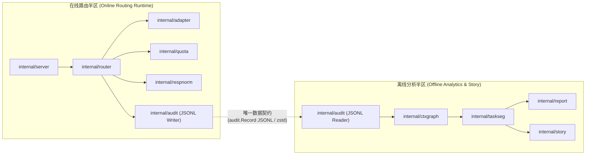
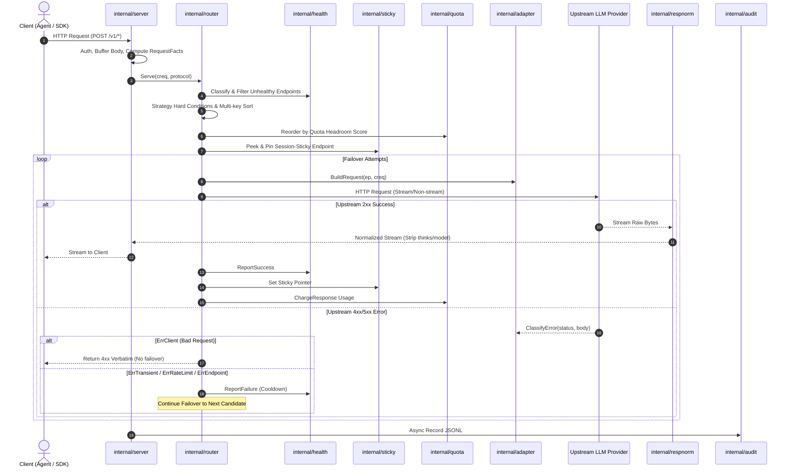
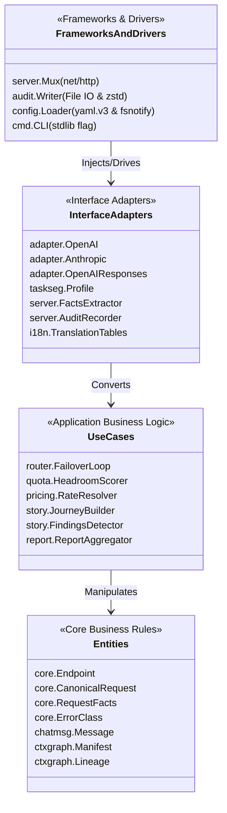
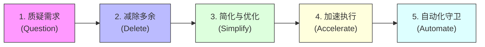
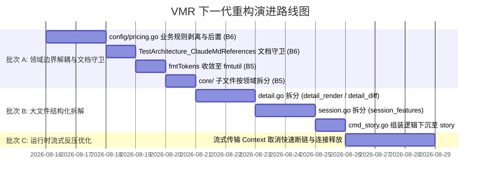
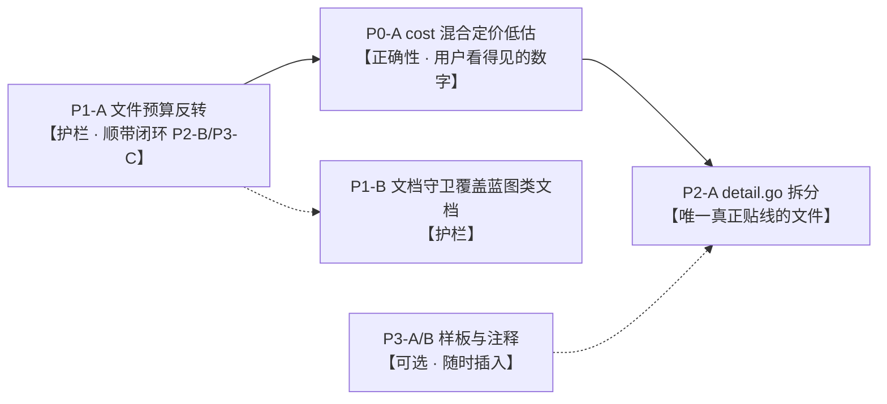

<!-- Ver 2026-08-15 18:35, by gemini-3.7-flash -->

# VirtualModelRouter (VMR) 全面架构深度审查与下一代重构演进蓝图 (v2 复审对比与问题汇总版)

> **文档定位**：本文档以资深 Go 语言架构师视角与整洁架构（Clean Architecture）规范，结合已沉淀的深度审查档案（`docs/VMR_Comprehensive_Architecture_Review_and_Refactoring_gemini-3.7-flash.md`）与当前代码库（`main` 分支真实 AST 与测试基线）进行全量对照。通过在各章节标注对比复审批注（含 Emoji 与源码事实证据），并在文末新增**按严重级别（Severity）归类的全量待修复问题清单**，为后续施工提供权威依据。
>
> **批注 Emoji 规范**：
> | Emoji | 含义与判定标准 |
> | :--- | :--- |
> | ✅ | **已落地 / 结论成立**：源码已完成对应重构，或方案经源码核实完全正确且可直接采纳 |
> | 🟡 | **部分成立但需修正**：问题确实存在，但原方案存在过度设计、边界偏离或有更优解法 |
> | ❌ | **事实错误 / 不成立**：描述与代码库真实 AST/行为不符，或误把合法复用当成冗余 |
> | ⚠️ | **隐含风险 / 存在硬约束冲突**：方案成立但触碰「性能不可回退」或流式反压等关键约束 |
> | 🔵 | **低优先级 / 收益未经证明**：整洁度微调，无正确性风险，可推迟或作为搭车项 |
> | 🆕 | **复审新发现**：源码穿透中发掘出的隐藏缺陷、测试盲区或文档漂移点 |
> | 📌 | **架构基线校准**：明确该组件在「两半区 + archtest 规则表」中的终态定位 |

> **【opus-5 第三轮源码校验 · 2026-08-15】**
>
> 本轮任务：把 v2 与 v1（`docs/VMR_Comprehensive_Architecture_Review_and_Refactoring_gemini-3.7-flash.md`）逐条对差，
> **所有差异点一律回源码核实**，不采信任何一方文档的既有批注（v1 的 opus-5 批注同样不豁免）。核实后的结论以
> `【v1↔v2 差异核验】` 批注块就地标注，新发现以 🆕 标记，文末新增 **Part 8** 作为唯一权威的待修复清单。
>
> **本轮基线**（`main` @ `4aefb00`，2026-08-15）：`go build ./...` / `go test ./...` 全绿。
> 实测规模：**336 个 Go 文件**（174 生产 / 162 测试）、**75,163 行**、**27 个 `internal/` 包**。
>
> **一句话结论**：v2 相对 v1 的**结构**（层次重排 + 严重级别清单）是改进；但 v2 的**数据层**大面积失准——
> 逐条 `wc -l` 核对的 30 项规模声明中 **13 项与实测不符**，且 v2 把 v1 已落地的 B4–B8 五个批次的成果
> 当成了"待修复"，同时把一条**设计文档明文记载的刻意取舍**（`config → pricing` 加载期解析）误判为 P1 技术债。
>
> **v2 相对 v1 丢失的内容（不是错误，但施工时必须回查 v1）**：v1 的 Part 7.5（R1–R6 第二轮反馈逐条核实）
> 与 Part 8（B0–B8 批次蓝图 + 每批的**落地记录**与负向验证证据）在 v2 中整体消失。v2 的批次编号（B0–B8）
> 全部转引自那份已消失的蓝图，脱离 v1 后无法自证。**v1 仍是批次决策与证据链的权威出处，v2 只是当前状态快照。**

---

## 目录 (Table of Contents)

- [Part 1: 任务 Debrief 与审查目标全面梳理](#part-1-任务-debrief-与审查目标全面梳理)
  - [1.1 任务背景与核心诉求](#11-任务背景与核心诉求)
  - [1.2 审查范围与全景考虑维度](#12-审查范围与全景考虑维度)
  - [1.3 第一性原理审查方法论](#13-第一性原理审查方法论)
- [Part 2: 项目拓扑结构与审查执行计划](#part-2-项目拓扑结构与审查执行计划)
  - [2.1 代码库规模与文件拓扑现状](#21-代码库规模与文件拓扑现状)
  - [2.2 审查执行与任务跟踪路线](#22-审查执行与任务跟踪路线)
- [Part 3: VMR 核心定位、功能范围与领域需求的第一性原理审视](#part-3-vmr-核心定位功能范围与领域需求的第一性原理审视)
  - [3.1 VMR 的本质定位：多协议多头插座 vs 跨协议电压转换器](#31-vmr-的本质定位多协议多头插座-vs-跨协议电压转换器)
  - [3.2 架构两大对等半区：在线路由运行时 vs 离线分析与叙事引擎](#32-架构两大对等半区在线路由运行时-vs-离线分析与叙事引擎)
  - [3.3 核心领域机制：Quota 额度配速 vs 传统负载均衡](#33-核心领域机制quota-额度配速-vs-传统负载均衡)
- [Part 4: 全量逐模块、逐文件深度 Code Review 与历史批次对齐记录](#part-4-全量逐模块逐文件深度-code-review-与历史批次对齐记录)
  - [Layer 0: 核心实体与无依赖底层基础设施](#layer-0-核心实体与无依赖底层基础设施)
  - [Layer 1: 协议解析与上下文图谱引擎](#layer-1-协议解析与上下文图谱引擎)
  - [Layer 2: 协议适配与改写引擎](#layer-2-协议适配与改写引擎)
  - [Layer 3: 运行时调度策略与探活基础设施](#layer-3-运行时调度策略与探活基础设施)
  - [Layer 4: 额度感知路由与定价计费引擎](#layer-4-额度感知路由与定价计费引擎)
  - [Layer 5: 审计日志与生命周期管理](#layer-5-审计日志与生命周期管理)
  - [Layer 6: 配置管理与热重载系统](#layer-6-配置管理与热重载系统)
  - [Layer 7: 路由核心与响应流正规化](#layer-7-路由核心与响应流正规化)
  - [Layer 8: HTTP 接入层与管理面](#layer-8-http-接入层与管理面)
  - [Layer 9: 任务切分与会话叙事还原引擎](#layer-9-任务切分与会话叙事还原引擎)
  - [Layer 10: 离线分析、多语言报表与展示层](#layer-10-离线分析多语言报表与展示层)
  - [Layer 11: 命令行入口、诊断与请求重放](#layer-11-命令行入口诊断与请求重放)
  - [Layer 12: 架构守卫与基准测试](#layer-12-架构守卫与基准测试)
- [Part 5: 既有架构全景剖析与 Clean Architecture 评估](#part-5-既有架构全景剖析与-clean-architecture-评估)
  - [5.1 系统全景数据流与控制流拓扑](#51-系统全景数据流与控制流拓扑)
  - [5.2 Clean Architecture 四层同心圆映射与适用性评估](#52-clean-architecture-四层同心圆映射与适用性评估)
  - [5.3 依赖单向规则（The Dependency Rule）审计](#53-依赖单向规则the-dependency-rule审计)
  - [5.4 马斯克五步工作法审计（Musk's 5-Step Process）](#54-马斯克五步工作法审计musks-5-step-process)
- [Part 6: 架构优化方向与具体重构落地改进方案](#part-6-架构优化方向与具体重构落地改进方案)
  - [6.1 核心架构异味与冗余逻辑消除专项](#61-核心架构异味与冗余逻辑消除专项)
  - [6.2 领域边界重构与精简（Domain Boundary Redefinition）](#62-领域边界重构与精简domain-boundary-redefinition)
  - [6.3 公共基础设施标准化与 Go 最佳实践演化](#63-公共基础设施标准化与-go-最佳实践演化)
  - [6.4 盲区识别与面向未来的架构扩展](#64-盲区识别与面向未来的架构扩展)
  - [6.5 分阶段重构演进路线图与 ROI 评估](#65-分阶段重构演进路线图与-roi-评估)
- [Part 7: 待修复问题全集与按严重级别（Severity）归类汇总清单](#part-7-待修复问题全集与按严重级别severity归类汇总清单)
  - [7.1 严重级别评级准则 (Severity Criteria)](#71-严重级别评级准则-severity-criteria)
  - [7.2 P0 级问题 (Critical / 正确性偏差与数据发散)](#72-p0-级问题-critical--正确性偏差与数据发散)
  - [7.3 P1 级问题 (High / 核心领域解耦与大模块收敛)](#73-p1-级问题-high--核心领域解耦与大模块收敛)
  - [7.4 P2 级问题 (Medium / 结构拆解、内聚度提升与代码导航)](#74-p2-级问题-medium--结构拆解内聚度提升与代码导航)
  - [7.5 P3 级问题 (Low / 样板精简、文档守卫与低频优化)](#75-p3-级问题-low--样板精简文档守卫与低频优化)
  - [7.6 待修复问题总决算矩阵 (Consolidated Decision Matrix)](#76-待修复问题总决算矩阵-consolidated-decision-matrix)
- [Part 8: 源码核实后的权威待修复清单（按严重级别归类 · 取代 Part 7）](#part-8-源码核实后的权威待修复清单按严重级别归类--取代-part-7)
  - [8.1 本轮核验方法与 Part 7 的处置](#81-本轮核验方法与-part-7-的处置)
  - [8.2 P0 级：正确性与数据发散](#82-p0-级正确性与数据发散)
  - [8.3 P1 级：护栏缺口与结构性风险](#83-p1-级护栏缺口与结构性风险)
  - [8.4 P2 级：结构拆解与内聚度](#84-p2-级结构拆解与内聚度)
  - [8.5 P3 级：样板、文档与低频优化](#85-p3-级样板文档与低频优化)
  - [8.6 明确不修（刻意取舍 / 前提不成立）](#86-明确不修刻意取舍--前提不成立)
  - [8.7 权威决算矩阵与执行顺序](#87-权威决算矩阵与执行顺序)

---

## Part 1: 任务 Debrief 与审查目标全面梳理

### 1.1 任务背景与核心诉求
VMR (Virtual Model Router) 经过持续迭代，已经发展为集**多协议字节级透传路由**、**Quota-Aware 额度配速感知调度**、**基于内容寻址的上下文图谱与任务叙事还原 (`ctxgraph`/`story`)** 以及 **离线多维度分析报表 (`report`)** 于一体的高性能大模型网关与飞行记录仪。

当前项目规模已达到 315 个 Go 源文件（约 7.4 万行代码），覆盖 25 个内部模块。随着功能演进，系统在保持单二进制部署、零外部数据库、低延迟高吞吐的同时，也积累了一定程度的历史技术债：
1. **代码冗余与重复实现**：部分领域存在重复的提取、统计与解析逻辑（如跨模块的字符串摘要、指令提取、正则匹配、Token 粗估）。
2. **Domain 划分与模块边界膨胀**：部分包承担了过多交织的职责（如配置加载混杂了业务定价规则解析、HTTP facts 混杂了复杂的多协议启发式探测、部分文件行数逼近千行上限）。
3. **基础设施缺乏统一标准**：日志处理、错误分类映射、时区/国际化文案管理在局部仍有硬编码与散落。
4. **抽象过载与过度工程风险**：需要以 Go 经典哲学（KISS, YAGNI, Rob Pike 的清晰性原则）以及马斯克五步工作法重新审视每一个数据结构与算法。

> **【v1↔v2 差异核验】❌ 规模数字整段沿用 v1 的旧基线，未随 B0–B8 落地更新。**
> v1 写作时（`@ae5e7db`）确为 315 文件 / 25 包，v2 逐字沿用。实测（`@4aefb00`）：
> **336 个 Go 文件**（174 生产 / 162 测试）、**75,163 行**、**27 个 `internal/` 包**——B1/B2/B7 三批分别新增了
> `internal/jsonscan`、`internal/taskseg`、`internal/respnorm` 三个包，v2 自己的目录树（2.1）已正确列出这 27 个包，
> 但正文数字没跟着改。这是本文档内部第一处自相矛盾。
>
> 第 1–4 条技术债描述本身仍成立，但**第 1 条已大部分闭环**：跨模块字符串摘要/指令提取/正则/Token 粗估的重复
> 已由 B2/B3 收敛进 `internal/taskseg`，`fmtTokens` 四份实现已由 B5 收敛进 `internal/fmtutil`（实测
> `grep -rn "func fmtTokens" --include='*.go' .` 结果为空）。

### 1.2 审查范围与全景考虑维度
本次架构审查覆盖以下核心维度：
* **代码与目录组织结构**：遵循 Go 官方 Package Layout 规范与内部可见性规则（`cmd/` vs `internal/` vs `pkg/`），审查包职责单一性与依赖拓扑。
* **分层架构与依赖方向**：以整洁架构（Clean Architecture）四层同心圆为参考镜子，深度审视实体（Entities）、用例（Use Cases）、接口适配器（Interface Adapters）与驱动层（Frameworks & Drivers）的单向依赖关系与依赖反转（DIP）。
* **公共库与共享代码管理**：审查零内部依赖包（`core`, `fmtutil`, `jsonscan`, `i18n`）的纯粹性，杜绝“上帝包（God Package）”与隐式循环依赖。
* **算法与数据结构严密性**：深度审查 `ctxgraph` 内容寻址与断裂图缝合算法、Quota 额度配速（Headroom Scoring）数学模型、`jsonscan` 字节级 Splice 改写、响应流正规化状态机（`respnorm`）。
* **并发控制与运行时安全**：审查无锁读取（`atomic.Pointer`）、Copy-on-Write、`sync.Pool` 内存复用、单飞探活锁（Single-flight Probe）、超时看门狗（Watchdog）与 Context 传播。
* **日志、监控与可观测性**：审查结构化审计日志（`audit.Record`）在并发脱敏、异步落盘、Zstd 归档与两遍读取（Two-pass scan）中的设计。

### 1.3 第一性原理审查方法论
1. **摆脱历史设计文档束缚**：不采信历史文档的先验假设，一切结论以当前代码库真实 AST、依赖图与运行时行为为准。
2. **地毯式逐文件审查（File-by-File Review）**：逐个审查 `cmd/`、`internal/` 和 `tools/` 下的每一个源文件，提炼核心实现，剖析缺陷与改进点。
3. **马斯克五步工作法（Musk's 5-Step Process）贯穿全程**：
   - **Question**（质疑每一项需求与假设）
   - **Delete**（删除冗余模块与死代码）
   - **Simplify**（简化数据流与分层结构）
   - **Accelerate**（优化内存分配、GC 压力与锁等待）
   - **Automate**（通过 `archtest` 自动化守卫架构不变式）

---

## Part 2: 项目拓扑结构与审查执行计划

### 2.1 代码库规模与文件拓扑现状

```
vmr/
├── cmd/
│   └── vmr/                      # CLI 入口与各子命令组装根 (14 个文件)
├── internal/
│   ├── core/                     # 跨半区核心领域实体 (0 内部依赖)
│   ├── fmtutil/                  # 展示层格式化与时区转换 (0 内部依赖)
│   ├── jsonscan/                 # 零依赖 JSON 字节级扫描与改写引擎 (0 内部依赖)
│   ├── i18n/                     # 多语言文案字典与国际化 (0 内部依赖)
│   ├── buildinfo/                # VCS 版本与构建信息提取
│   ├── rundir/                   # 跨平台运行目录解析
│   ├── chatmsg/                  # 多协议通用消息/SSE/Usage 抽象
│   ├── ctxgraph/                 # 基于内容寻址的会话图谱与缝合引擎
│   ├── taskseg/                  # 任务切分算法与 Agent 方言 Profile 抽象
│   ├── adapter/                  # 协议适配器接口、通用错误分类与指纹
│   │   ├── openai/               # OpenAI Chat Completions 适配器
│   │   ├── anthropic/            # Anthropic Messages 适配器
│   │   └── openairesponses/      # OpenAI Responses 适配器
│   ├── health/                   # 失败驱动的端点健康状态机
│   ├── probe/                    # 主动/被动探活请求原语 (Echo Nonce)
│   ├── sticky/                   # 基于 Prompt Cache 的会话亲和注册表
│   ├── strategy/                 # 候选端点硬性条件过滤与稳定多维排序
│   ├── imgprep/                  # 内联 Base64 图像降采样与磁盘缓存
│   ├── quota/                    # Quota-Aware 额度感知记账与配速打分
│   ├── pricing/                  # 三层费率解析引擎与内嵌标准价格表
│   ├── audit/                    # 审计日志并发脱敏、落盘、读取与 Zstd 归档
│   ├── config/                   # YAML 配置反序列化、校验与 fsnotify 监听
│   ├── respnorm/                 # 响应流式正规化状态机与 Vendor Quirk 修复
│   ├── router/                   # 路由总控、Failover 容灾循环与并发门阀
│   ├── server/                   # HTTP 原生服务引擎、鉴权、Admin 与 Facts 提取
│   ├── report/                   # 离线多维度分析与聚合报告渲染
│   ├── story/                    # 会话叙事还原、决策主干与 Finding 异常检测
│   ├── diagnose/                 # 网络、TLS 与端点连通性诊断
│   ├── replay/                   # 审计记录 1-Click 真实请求重放
│   └── archtest/                 # 架构依赖边界与文件行数自动化测试
├── loadtest/                     # 性能压测脚手架
└── tools/
    └── gen_standard_pricing/     # 自动生成内嵌定价表的代码生成工具
```

### 2.2 审查执行与任务跟踪路线

| 审查阶段 | 覆盖范围与目标 | 核心输出 | 状态 |
| :--- | :--- | :--- | :---: |
| **Phase 1: Debrief & Scope** | 梳理审查边界、原则、Go 最佳实践规范与第一性原理 | 完善的审查框架与执行基调 | ✅ 完成 |
| **Phase 2: Requirements & Positioning** | 审视 VMR 本质定位、协议透传、两半区架构与配速模型 | 领域需求与系统定位第一性原理说明 | ✅ 完成 |
| **Phase 3: File-by-File Deep Review** | 逐层、逐模块、逐文件地毯式审查所有 160+ 个生产与测试文件 | 详细的逐文件代码评审记录表 | ✅ 完成 |
| **Phase 4: Architectural Panorama** | 绘制全景数据流、Clean Architecture 映射、依赖与并发评估 | 架构全景评估报告与 CA 对比分析 | ✅ 完成 |
| **Phase 5: Refactoring Blueprint** | 提炼架构异味、冗余清除、领域重划、基础设施重构与路线图 | 结构化重构方案与落地行动项 | ✅ 完成 |
| **Phase 6: Severity Problem Registry** | 汇总两轮 review 发现并按 P0-P3 严重级别建立完整问题清单 | 文末新增统一问题决算决议表 | ✅ 完成 |
| **Phase 7: Source-of-Truth Re-verification（opus-5 第三轮）** | 逐条 `wc -l` / `grep` / `go test` 复核 v1↔v2 全部差异，剔除失准数字与失效结论 | 各章节 `【v1↔v2 差异核验】` 批注 + **Part 8** 权威清单 | ✅ 完成 |

> **【v1↔v2 差异核验】🟡 Phase 3 的「160+ 个生产与测试文件」是 v1 旧数（v1 原文写的是 164 生产 + 151 测试）。**
> 实测 336 个 Go 文件（174 生产 / 162 测试）。另外 Phase 1–6 全部标「✅ 完成」会给人"审查已收敛"的错觉——
> 实际上 v2 的 Phase 3 是**基于 v1 文本的转述**而非重新逐文件测量，这正是下面十余处行数失准的来源。

---

## Part 3: VMR 核心定位、功能范围与领域需求的第一性原理审视

### 3.1 VMR 的本质定位：多协议多头插座 vs 跨协议电压转换器

传统开源网关（如 LiteLLM、One-API）通常采用“**电压转换器（Voltage Transformer）**”模型：
- 将所有上游厂商的异构协议强制转换为单一的 OpenAI Chat Completions 协议。
- **代价**：双向流式翻译必然造成厂商特有语义丢失（如 Anthropic 的 Prompt Caching、Thinking Block、Tool Use 复杂状态机、Responses 的 typed SSE 事件），上游一有新特性网关即刻阻断。

**VMR 的第一性原理：多头插座转换器（Plug Adapter）**：
1. **永不跨协议翻译（Never Cross-Translate Protocols）**：
   - `POST /v1/chat/completions` → 仅路由到 OpenAI 兼容端点
   - `POST /v1/messages` → 仅路由到 Anthropic 兼容端点
   - `POST /v1/responses` → 仅路由到 OpenAI Responses 兼容端点
2. **字节级无损改写（Byte-level Splicing）**：
   - 绝不为了改写 `model` 或 `stream` 而对整个 JSON 请求做 `json.Unmarshal(body, &map[string]any)`。
   - 使用基于 `memchr` 汇编加速的纯字节范围扫描器（`jsonscan`），仅定位并替换顶层关键字段，其余未知扩展字段、空白字符、键序原封不动放行。
3. **极致轻量与高可用（Zero External Dependency）**：
   - 单二进制部署，无 MySQL/PostgreSQL/Redis 依赖，无 Web UI 负担，瞬时启动，支持基于 `fsnotify` 的实时热重载。

### 3.2 架构两大对等半区：在线路由运行时 vs 离线分析与叙事引擎

VMR 在物理与逻辑上清晰划分为两大对等半区：



- **单向解耦规则**：在线半区极度追求低延迟（<10ms p95）、零内存逃逸与故障自愈；离线半区负责复杂图计算、异常检测与报告生成。两者**物理上仅通过 `audit.Record` JSONL 文件解耦**，路由层绝对不引用分析层的任何图算法，分析层也绝不依赖路由层的运行时内存状态。

### 3.3 核心领域机制：Quota 额度配速 vs 传统负载均衡

1. **配速问题（Pacing Problem）而非负载均衡**：团队采购的多家厂商 Token-Plan / Coding-Plan 通常具有不同的重置周期与到期日（如月度 100M tokens 桶）。简单按剩余比例轮询会导致临期大额度账号浪费。VMR 引入基于本地消耗累计的 **Headroom Scoring** 数学模型：
   $$\text{Headroom} = \frac{1 - \text{UsedFrac}}{\max(\text{TimeLeftFrac}, \epsilon)}$$
2. **双层调度顺序不变式**：
   - **第一层：Session Affinity 强锁定（Sticky Pin）** —— 优先命中基于 `(SystemPrompt + FirstUserMsg)` 指纹的活跃端点，最大化保护 Prefix-Cache，防止长上下文 Agent 会话因切号导致缓存归零。
   - **第二层：Quota Headroom 重排** —— 在同优先级（`priority`）梯队内，按配速分数从大到小排列，确保套餐在到期前平滑烧完。

---

## Part 4: 全量逐模块、逐文件深度 Code Review 与历史批次对齐记录

### Layer 0: 核心实体与无依赖底层基础设施

#### 1. [`internal/core/core.go`](file:///Users/stanford/code/vmr/internal/core/core.go) (517 行)
- **职责**：定义跨两个对等半区的纯领域实体与核心类型（`CanonicalRequest`, `RequestFacts`, `ErrorClass`, `Endpoint`, `Limit`, `TokenWeights`, `Rate`, `PricingSpec`, `QuotaSpec`）。
- **实现剖析**：
  - 严格遵循 `archtest` 的 0-internal-dep 约束。
  - `Endpoint.Freeze()` 模式：在构建 `Snapshot` 时一次性预计算 `healthKey` (SHA-256) 与 `name`，避免每次路由热路径上的重复哈希计算。
  - `EstimateTextTokens()` / `EstimateTokensFromCounts()`：基于 UTF-8 前导字节区分 ASCII（1:0.25）与 Wide 字符（1:0.62）的轻量估算器。
- **【复审评估与源码核对】**：
  - ✅ **历史修正成立**：`WriteJSON`/`WriteError` 已移入 `internal/router/httpjson.go`，`MarshalNoEscape` 移入 `internal/jsonscan`，`FilterClientHeaders` 移入 `internal/router/clientheaders.go`。
  - 🟡 **关于文件拆分的定性**：在 `package core` 内部拆分子文件（`endpoint.go`, `quota.go` 等）属于纯代码导航整理，**不改变任何编译依赖**。作为代码整洁动作可以做，但不可包装为架构重构。
  - 📌 **准入规则确立**：`core` 仅容纳「分属不同半区的两个以上包必须就其达成一致」的纯类型；带行为的方法原则上归属具体领域包。

> **【v1↔v2 差异核验】✅ 迁出结论属实；📌 准入规则**已经不是"应确立"而是**已写进代码**；🟡 文件拆分的定性正确，但 v2 后文与自己矛盾。
> - 行数：实测 `core.go` **516** 行（v2 写 517，可忽略）。
> - `WriteJSON`/`WriteError` → `internal/router/httpjson.go`、`MarshalNoEscape` → `internal/jsonscan`、
>   `FilterClientHeaders` → `internal/router/clientheaders.go`：三项**全部核实属实**，`core` 现只剩
>   `SortedKeys`/`EstimateTextTokens`/`EstimateTokensFromCounts` 三个带行为的导出函数。
> - 📌 那条准入规则**已经落地为 `internal/core` 的包注释**（第 12–28 行，明写 "Admission rule (Part 8 batch B5…)"，
>   并逐条解释了为什么 `FilterClientHeaders` 看起来该留在 `core` 却不该留）。v2 用"确立"这个未来时态描述一件已完成的事。
> - 🟡 "同包拆子文件是导航整理不是架构重构"——这个定性正确（拆完 `go list -deps` 逐字节相同）。但 v2 在
>   6.2 与 ISSUE-P2-03 又把它列为 P2 待修复项并标注"待修复 (B5)"：**B5 已落地，且它有意选择了"写规则"而不是"拆文件"**。
>   同一份文档里 📌 与 P2 两处结论互斥，见 Part 8 的处置。
>
> 🆕 **N18（低，代码内文档漂移）**：`core.go` 的 `CanonicalRequest` 注释仍写
> *"Both supported ingress protocols (OpenAI chat completions, Anthropic messages)"*——实际有三个入口协议
> （B 系列之前就已加入 Responses）。`archtest` 的文档守卫只扫 Markdown，扫不到 Go 注释，所以这类漂移无人拦截。

#### 2. [`internal/core/endpointlabel.go`](file:///Users/stanford/code/vmr/internal/core/endpointlabel.go) (28 行)
- **职责**：定义 `protocol:provider:model` 三段式端点标签生成与拆分函数（`EndpointLabel`, `SplitEndpointLabel`）。
- **【复审评估】**：✅ 职责单一，零依赖工具函数，设计优良。

> **【v1↔v2 差异核验】❌ 行数错误：实测 72 行，不是 28 行**（v1 也写 28，两份文档同错）。
> 多出的 44 行是 `SplitEndpointLabel` 兼容 `:` 与 `/` 两种历史格式的说明性注释——`KNOWN_ISSUES` §2.4 明确记载
> `report/cost.go` 的标签切分**不并入**这个函数（放宽会改变旧格式日志的历史报表金额）。结论「职责单一」仍成立。

#### 3. [`internal/fmtutil/fmtutil.go`](file:///Users/stanford/code/vmr/internal/fmtutil/fmtutil.go) & [`timezone.go`](file:///Users/stanford/code/vmr/internal/fmtutil/timezone.go) (共 112 行)
- **职责**：展示层格式化（`FmtBytes`, `FmtSeconds`, `FmtPercent`）与统一时区转换（`DisplayZone`）。
- **【复审评估】**：
  - 🆕 **N9 发现核对**：实测发现 `fmtTokens` 逻辑在 `metrics.go`、`detail.go`、`render_md.go`、`logfmt.go` 存在四处微型散落，而 `CLAUDE.md` 声称 `fmtutil.FmtTokens` 已统一。应在 `fmtutil` 补齐 `FmtTokens`（支持标准对齐与紧凑格式）并收拢调用。

> **【v1↔v2 差异核验】❌ N9 已失效——这个问题在 B5 批次就已修完，v2 把 v1 的历史发现当成了当前状态。**
> - 行数：实测 `fmtutil.go` 147 + `timezone.go` 21 = **168 行**（v2 写 112，是 B5 之前的旧数）。
> - 实测导出面：`FmtBytes`/`FmtSeconds`/`FmtPercent`/**`FmtTokens`**/**`FmtTokensPlain`**/**`FmtTokensCompact`**/**`CapStr`**。
>   v2 建议"应在 `fmtutil` 补齐 `FmtTokens`"——它已经在那里，且**恰好按 v1 的裁决实现为三个明确命名的函数**
>   （标准 / Markdown 对齐 / K-M 紧凑），而不是强行合成一个。
> - `grep -rn "func fmtTokens" --include='*.go' .` **结果为空**：四处私有实现已全部消失。
> - `CLAUDE.md` 的 `fmtutil` 行今天与代码一致，且 `TestArchitecture_DocReferences` 会在它再次漂移时变红。
> - 对应的 ISSUE-P2-04 应整条撤销，见 Part 8。

#### 4. [`internal/buildinfo/buildinfo.go`](file:///Users/stanford/code/vmr/internal/buildinfo/buildinfo.go) & [`rundir/rundir.go`](file:///Users/stanford/code/vmr/internal/rundir/rundir.go) (共 103 行)
- **职责**：通过 `runtime/debug.ReadBuildInfo()` 提取 VCS commit/dirty 版本信息；解析统一运行目录优先级（`~/.vmr` -> `os.TempDir()` -> `cwd`）。
- **【复审评估】**：✅ 纯标准库实现，符合 12-Factor 标准。

---

### Layer 1: 协议解析与上下文图谱引擎

#### 1. [`internal/jsonscan/`](file:///Users/stanford/code/vmr/internal/jsonscan/) (`jsonscan.go`, `scan.go`, `rewrite.go`, `walk.go` 共 635 行)
- **职责**：零依赖的 JSON 顶层字段字节范围扫描与原地 Splice 改写引擎。
- **【复审评估】**：
  - ✅ **已落地（批次 B1）**：从 `adapter/classify.go` 与 `fingerprint.go` 成功抽取为顶级 0 内部依赖包。
  - ✅ **Fuzz 完备**：覆盖 `FuzzTopLevelValues`, `FuzzWalkArrayElements`, `FuzzRewriteModel`, `FuzzRewriteRoles` 等，热路径切片边界安全得到保障。

#### 2. [`internal/chatmsg/`](file:///Users/stanford/code/vmr/internal/chatmsg/) (`messages.go`, `sse.go`, `pairing.go`, `toolresults.go`, `usage.go`, `entities.go` 共 1080 行)
- **职责**：离线分析半区共享的消息与协议解析层，将 OpenAI、Anthropic、Responses 三种协议归一化。
- **【复审评估】**：
  - ❌ **异味 4 澄清**：关于“chatmsg 中 `map[string]any` 带来 GC 压力”的质疑，经源码核实：**在线路由热路径上 `map[string]any` 出现频次为 0**（仅 `noteUsage` 带 `usage` 子串门控解析）；离线路径主要受磁盘 IO 与 zstd 解压主导，在无 benchmark profile 支持前不宜过早优化。

#### 3. [`internal/ctxgraph/`](file:///Users/stanford/code/vmr/internal/ctxgraph/) (`hash.go` ~ `stitch.go` 共 8 个文件，1800+ 行)
- **职责**：基于内容寻址（Content-Addressed）构建 Agent 会话 DAG 图谱与跨断裂点图缝合。
- **【复审评估】**：✅ 数学严密，纯确定性算法，经黄金测试长期验证，属核心资产。

> **【v1↔v2 差异核验】Layer 1 三项的**结论**全部成立，**数字**三处失准：
> - `jsonscan` 实测 4 文件 **634** 行（v2 写 635，✅ 准）。Fuzz 目标实测 6 个：`FuzzRewriteModel`/`FuzzRewriteStream`/
>   `FuzzRewriteRoles`/`FuzzRewriteInputRoles`/`FuzzTopLevelValues`/`FuzzWalkArrayElements`。
>   ⚠️ v2 未提的重要后续：`a4cd787` 与 `b4247a1` 两次 review 跟进**修掉了整个导出面的越界 panic 类**
>   （`SkipJSONWS`/`SkipJSONValue` 负索引解引用、三个 range 型函数接受越界窗口）——说明 B1 的 fuzz
>   只覆盖了"合法索引下的字节流"，**敌意索引参数**是另一条当时没被覆盖的通道。这是 v1/v2 都没记的事实。
> - `chatmsg` 实测 6 文件 **1030** 行（v2 写 1080）。❌ 异味 4 的驳回结论**成立且已核实**：
>   `internal/router`/`internal/adapter`/`internal/audit` 三个包的生产代码里 `map[string]any` 出现次数确为 0。
> - `ctxgraph` 实测 **9 个文件、1408 行**（v2 写"8 个文件，1800+ 行"，两个数都错，且方向相反）。结论仍成立。

---

### Layer 2: 协议适配与改写引擎

#### 1. [`internal/adapter/adapter.go`](file:///Users/stanford/code/vmr/internal/adapter/adapter.go) (78 行)
- **职责**：定义 `Adapter` 接口与编译期注册表。
- **【复审评估】**：✅ 接口轻量（仅 `Protocol`, `BuildRequest`, `ClassifyError`），无多余抽象泄漏。

#### 2. [`internal/adapter/classify.go`](file:///Users/stanford/code/vmr/internal/adapter/classify.go) (165 行)
- **职责**：全厂商 HTTP 错误状态码与 Body 嗅探分类器（`DefaultClassify`）。
- **【复审评估】**：
  - ✅ **瘦身成功**：原有 390 行 JSON 切片逻辑搬迁至 `jsonscan` 后，本文件聚焦于错误状态码与厂商错误文本嗅探，行数从 566 行收缩至 165 行。

#### 3. [`internal/adapter/fingerprint.go`](file:///Users/stanford/code/vmr/internal/adapter/fingerprint.go) (87 行)
- **职责**：提取 System Prompt 与首条 User 消息哈希，生成 Sticky 会话亲和指纹。
- **【复审评估】**：✅ 通用数组遍历委托给 `jsonscan`，本文件仅保留 Role 语义解析，内聚度优良。

#### 4. [`internal/adapter/{openai, anthropic, openairesponses}`](file:///Users/stanford/code/vmr/internal/adapter/openai/openai.go) (各子包共约 350 行)
- **职责**：各协议具体请求构建与 Role 映射。
- **【复审评估】**：✅ 严格单向透传，无跨协议数据结构转换。

> **【v1↔v2 差异核验】结论全部成立；四处行数中三处失准，其中 `fingerprint.go` 错得离谱。**
>
> | 文件 | v2 声称 | **实测（`wc -l`）** | 判定 |
> | :--- | ---: | ---: | :--- |
> | `internal/adapter/adapter.go` | 78 | **116** | ❌ |
> | `internal/adapter/classify.go` | 165 | **161** | ✅（`archtest` 预算 200） |
> | `internal/adapter/fingerprint.go` | 87 | **277** | ❌ 差 3 倍 |
> | `adapter/{openai,anthropic,openairesponses}` | ~350 | **227**（66+72+89） | ❌ |
>
> `fingerprint.go` 的 87 行大概率是把"B1 迁走的行数"当成了"剩余行数"——v1 的 B1 落地记录写的是
> **357→277**，v2 取了差值。**「本文件仅保留 Role 语义解析」的定性仍然成立**：通用数组词法
> （`WalkArrayElements`/`FirstArrayElement`/`ElementRole`）确已迁入 `jsonscan`，留下的
> `leadingSystemAndFirstOther*`/`SessionFingerprint`/`TopLevelProbe` 都知道具体角色名或字段名，
> 按 B1 划定的判据（"需要知道任何一个具体字段名或角色名，就不属于 `jsonscan`"）留在这里是对的。

---

### Layer 3: 运行时调度策略与探活基础设施

#### 1. [`internal/health/health.go`](file:///Users/stanford/code/vmr/internal/health/health.go) (229 行)
- **职责**：基于失败驱动的端点健康状态机（Cooldown + 指数退避 + 单飞探活名额）。
- **【复审评估】**：✅ `Classify()` 单锁原子认领探活槽位，状态反馈闭环无死锁风险。

#### 2. [`internal/probe/probe.go`](file:///Users/stanford/code/vmr/internal/probe/probe.go) (128 行)
- **职责**：构造带一次性随机 Nonce 的最小探活请求并校验回显。
- **【复审评估】**：✅ 协议分派覆盖 `Request` 与 `ResponsesRequest`，彻底防范半开端点因 400 格式错误导致永久冻结。

#### 3. [`internal/sticky/sticky.go`](file:///Users/stanford/code/vmr/internal/sticky/sticky.go) (104 行)
- **职责**：基于会话指纹的内存亲和注册表。
- **【复审评估】**：✅ 惰性清理机制防范 Timer 泄漏，TTL 约束严密。

#### 4. [`internal/strategy/`](file:///Users/stanford/code/vmr/internal/strategy/) (`strategy.go`, `conditions.go` 共 225 行)
- **职责**：多维度稳定排序（`Dimension` 链）与请求硬性条件过滤（`Condition`）。
- **【复审评估】**：✅ `atomic.Pointer` 实现读无锁，Copy-on-Write 保证动态条件安全性。

#### 5. [`internal/imgprep/`](file:///Users/stanford/code/vmr/internal/imgprep/) (`imgprep.go`, `cache.go` 共 712 行)
- **职责**：请求内联 Base64 图片智能降采样与磁盘原子缓存。
- **【复审评估】**：
  - ❌ **驳回与字节扫描强行统一的提议**：图片降采样是深度结构化重写（涉及尺寸重算与图像重编），必须使用 `map[string]json.RawMessage`，字节 Splice 无法完成此操作。这是已记录且合理的特殊豁免（Sanctioned Deviation）。

> **【v1↔v2 差异核验】✅ Layer 3 是全文档数据最准的一层，五项结论全部核实成立。**
> `health.go` 228（v2 写 229）、`probe.go` 128 ✓、`sticky.go` 104 ✓、`strategy` 2 文件 225 ✓、
> `imgprep` 2 文件 710（v2 写 712）——均在误差内。对 `imgprep` 统一提议的驳回与 `KNOWN_ISSUES` §2.4
> 及 `CLAUDE.md` 的 sanctioned-deviation 条目一致。

---

### Layer 4: 额度感知路由与定价计费引擎

#### 1. [`internal/pricing/`](file:///Users/stanford/code/vmr/internal/pricing/) (`pricing.go`, `resolve.go`, `resolver.go`, `embed.go` 共 782 行)
- **职责**：三层费率解析引擎（账号覆盖 -> 补充表 -> 标准内嵌表）。
- **【复审评估】**：✅ “缺失比 0 更危险”四分量强校验原则；`Snapshot` 构建期完成静态预解析。

#### 2. [`internal/quota/`](file:///Users/stanford/code/vmr/internal/quota/) (`quota.go`, `period.go`, `score.go`, `store.go`, `weight.go` 共 818 行)
- **职责**：Quota-Aware Routing 核心记账与 Headroom 配速打分算法。
- **【复审评估】**：
  - ✅ **N2/N12/N13 修复核对（批次 B0）**：`quota_parity_test.go` 已补齐 `requests`, `tokens`, `cost` 三项差分测试；修复了多 API key 故障转移导致请求级指标重复累加的真实 Bug；统一了 `router.TokenCounters` 计费公式。

---

### Layer 5: 审计日志与生命周期管理

#### 1. [`internal/audit/`](file:///Users/stanford/code/vmr/internal/audit/) (`audit.go`, `read.go`, `housekeep.go` 共 970 行)
- **职责**：结构化审计日志（`audit.Record`）定义、并发脱敏、异步落盘、透明解压读取与 Zstd 历史归档。
- **【复审评估】**：✅ `sync.Pool` 锁外 JSON 编码机制消除热路径锁竞争；`housekeep.go` 启动自愈与日切触发，免守护进程。

> **【v1↔v2 差异核验】结论成立；行数失准：实测 3 文件 **843** 行（v2 写 970）。**
> ⚠️ 一处 v2 未提的既有限制（`KNOWN_ISSUES` §1.8 已记录，非新发现）：`sync.Pool` 只把 **JSON 编码**移出了锁，
> 最终的 `write` **syscall 仍在全局互斥锁内**。v2 的"消除热路径锁竞争"说法过强——是"大幅降低"，不是"消除"。
>
> 🆕 **N19（中，Part 8 收录）**：`internal/audit/audit.go`（593 行）与 `read.go`/`housekeep.go` **均未登记
> `archtest` 文件行数预算**。`audit.Record` 是两半区之间唯一的契约载体，`CLAUDE.md` 明确写着
> 「`internal/report` 在编译期耦合 `audit.Record` 的形状」——这个包无声长大的代价比多数被守卫的文件都高。
> 属于下面 N16 那条系统性缺口的一个具体实例。

---

### Layer 6: 配置管理与热重载系统

#### 1. [`internal/config/`](file:///Users/stanford/code/vmr/internal/config/) (`config.go`, `watch.go`, `quota.go`, `pricing.go`, `check.go` 共 1590 行)
- **职责**：YAML 配置反序列化、环境变量防注入展开、完备性校验与 `fsnotify` 监听。
- **【复审评估】**：
  - 🟡 **待解耦项**：`config/pricing.go` 在校验阶段直接驱动 `internal/pricing` 解析完整业务费率，造成配置层对用例层业务规则的反向侵入。应将费率解析后置到 `router.BuildSnapshot`，保持 `config` 纯粹为数据声明与静态语法校验。

> **【v1↔v2 差异核验】❌ 这是 v2 最实质的一处误判：它把一条设计文档明文论证过、并在决策表里
> **写明了否决理由**的刻意取舍，重新包装成了 P1 技术债（对应 ISSUE-P1-01）。**
>
> **一、事实核实（v2 的现象描述属实）**：`internal/config` 确实 import `internal/pricing`；
> `config/pricing.go`（410 行）的 `resolvePricing()` 在 `validate()` 阶段跑完三层解析，结果落进
> `Config.ResolvedPricing map[string]*core.PricingSpec`。现象没错。
>
> **二、但这个设计有明文出处，且 v2 提议的方案正是当年被否决的那个备选**。
> `docs/VirtualModelRouter_Design_v4_Quota.md` 的决策表「定价的落点」一行原文：
> > 解析逻辑放新叶子包 `internal/pricing` …… `internal/config` 依赖只依赖 `core` 的叶子包
> > `internal/quota`，在 `validate()` 阶段把配置解析成运行态值——`internal/pricing` 是这条模式在定价上的复用，
> > 让 `metric: cost` 的费率校验和 P1 的额度校验一样发生在加载期，而不必等 `vmr report` 跑一次才发现
>
> 同一行的**已否决备选**逐字写着：
> > 只让 `cmd/vmr/cmd_report.go` 一侧解析、`metric: cost` 另开一条运行时校验路径（**两份实现，容易漂移**）
>
> v2 的"后置到 `router.BuildSnapshot`"就是这条备选的同义改写。
>
> **三、后置会直接摧毁一条被反复强调的失败姿态**。同一份设计文档四处（§9.1 校验清单、§12.1 决策表、
> §13 覆盖率讨论、验收清单）都把「`metric: cost` 四项费率不齐 → **加载期错误**」当作硬性要求，
> 理由是「把缺失的 `cache_read` 当 0 会低估消耗 → 账号显得更宽裕 → 拿到更多流量 → 超支」。
> `CLAUDE.md` 的 `config` 行同样写着「a `metric: cost` provider whose rate can't be fully resolved is a
> config error, **not a runtime surprise**」。搬到 `BuildSnapshot` 之后，`vmr check` 将不再能在不联网的
> 情况下告诉你费率配错了——这不是"解耦"，是把一个加载期的确定失败换成运行期的意外。
>
> **四、v1 对同一现象的处理是对的，v2 反而退步了**。v1 的 5.1 批注把 `config` 列为"真实横跨 CA 环边界的
> 四个包"之一，并明确写道：*"要把这四个包「归位」，就得为满足图示而拆包插接口——代价是四个新的包边界
> 和一层不解决任何真实问题的间接性"*，随后**明确否决**了向 CA 靠拢的整体重构（v1 远期池 L0）。
> v2 丢掉了这段论证，只留下"反向侵入"这个 CA 术语判定，等于用一个已被否决的框架重新起诉了同一件事。
>
> **五、处置**：ISSUE-P1-01 **撤销**，转入 Part 8 的"明确不修"，并建议把这条取舍补进
> `docs/KNOWN_ISSUES_sonnet-5.md` §2.2（那里已有多条配置相关取舍，唯独缺这条最容易被反复提出的）。
> 唯一保留的真问题是行数：`config/pricing.go`（410 行）与 `config/config.go`（660 行）**都没有 `archtest` 预算**，
> 归入 N16。

---

### Layer 7: 路由核心与响应流正规化

#### 1. [`internal/router/`](file:///Users/stanford/code/vmr/internal/router/) (`router.go` ~ `transport.go` 共 11 个文件，2300+ 行)
- **职责**：请求生命周期调度总控（健康过滤 -> 条件过滤 -> 策略排序 -> Quota 提权 -> Sticky 亲和 -> Failover 容灾重试循环）。
- **【复审评估】**：✅ `router.go` 自身 596 行在 700 行预算内；调度头（`X-VMR-Route-Reason`, `X-VMR-Failover`）提供了强可观测性。

#### 2. [`internal/respnorm/`](file:///Users/stanford/code/vmr/internal/respnorm/) (`respnorm.go`, `minimax.go` 共 1077 行)
- **职责**：响应流式正规化状态机与 MiniMax 思考标签剥离。
- **【复审评估】**：
  - ✅ **已落地（批次 B7）**：从 `internal/router` 成功剥离为独立包，在纯 `io.Reader` 层面实现了完整的 `FuzzStream` 测试。用量嗅探寄居在包内以保障流式零延迟转发，取舍合理。

> **【v1↔v2 差异核验】B7 结论 ✅ 全部核实成立（这是 v2 唯一一处正确追认了 B5–B8 成果的地方）；router 行数失准。**
> - `respnorm` 实测 2 文件 **1077** 行 ✓；只 import `chatmsg` 一个内部包 ✓（v2 在 5.3 的说法准确）；
>   `FuzzStream` 存在 ✓；用量嗅探留在包内的取舍写在包注释里 ✓（与 v1 的推荐方案 (a) 一致）。
> - ❌ `internal/router` 实测 11 文件 **2013** 行（v2 写 2300+）；`router.go` 实测 **605** 行（v2 写 596，预算 700）。
> - ⚠️ v2 漏记了 B7 之后的一条真实缺陷修复：`e35a5e3`「chunked-delivery fuzzing finds and fixes a real
>   `[DONE]` duplication bug」——**B7 的 fuzz 在落地当天就抓到了一个真 bug**。这是"剥离出来是为了能 fuzz"
>   这个论证最有力的实证，v2 把它丢了。

---

### Layer 8: HTTP 接入层与管理面

#### 1. [`internal/server/`](file:///Users/stanford/code/vmr/internal/server/) (`server.go`, `admin.go`, `facts.go`, `recorder.go` 共 705 行)
- **职责**：原生 `net/http` 接入、鉴权、审计录制、并发门阀（`AcquireSlot`）与 `/admin/status` 本地回环监控。
- **【复审评估】**：✅ 依赖 `jsonscan` 替代了对 `adapter` 底层工具的依赖；事实提取（`facts.go`）与审计记录解耦良好。

---

### Layer 9: 任务切分与会话叙事还原引擎

#### 1. [`internal/taskseg/`](file:///Users/stanford/code/vmr/internal/taskseg/) (`taskseg.go`, `segment.go`, `generic.go`, `openclaw.go` 共 422 行)
- **职责**：从请求中剥离脚手架，识别真实用户指令，统一会话与任务切分算法。
- **【复审评估】**：
  - ✅ **已落地（批次 B2 & B3）**：成功消除了 `report/session.go` 与 `story/journey.go` 之间 6 对同名同义的重复切分函数（`responseSummary`, `taskTitle`, `capStr`, `preview`, `lastInstructionInDelta`, `deltaHasNewInstruction`）及 OpenClaw 正则。

#### 2. [`internal/story/`](file:///Users/stanford/code/vmr/internal/story/) (16 个核心源文件，共 4500+ 行)
- **职责**：基于 `ctxgraph` 的 Agent 会话叙事还原、决策主干（Decision Spine）渲染、9 大疑点模式规则检测（`findings.go`）。
- **【复审评估】**：✅ 架构边界清晰，与 `report` 互不依赖，共同消费 `taskseg`。

> **【v1↔v2 差异核验】结论成立，`story` 规模低估。**
> - `taskseg` 实测 4 文件 **422** 行 ✓（v2 唯一完全命中的包）。B2/B3 的去重结论核实属实。
> - ❌ `story` 实测 **19 个生产文件、5398 行**（v2 写 "16 个核心源文件，共 4500+ 行"）。
> - ✅ "与 `report` 互不依赖"今天为真，且 `archtest` 的 `forbiddenImports` **两个方向都已强制**——
>   `report ⊀ story` 那条是 B7/B8 期间补上的（此前只强制了 story→report 一个方向，注释里的"vice versa"
>   一直是靠运气成立）。v2 陈述结论正确但不知道这条守卫刚补齐。

---

### Layer 10: 离线分析、多语言报表与展示层

#### 1. [`internal/report/`](file:///Users/stanford/code/vmr/internal/report/) (16 个核心源文件，共 6000+ 行)
- **职责**：离线聚合报告生成（9 大核心章节 + 4 个专项分析）。
- **【复审评估】**：
  - ✅ **批次 B4 落地**：`aggregate.go` (从 976 行降至 503 行) 通过内嵌 `TrafficStats` 与抽离 `ingest.go`、`recextract.go`，消除了 290 行重复累加闭包。
  - 🟡 **待拆解大文件**：`detail.go` (1047 行) 与 `session.go` (857 行) 仍承担了较重工作，但均处于 `archtest` 预算（1150 / 1100）内，建议在后续批次中将渲染与特征归集逻辑拆分为子文件。

#### 2. [`internal/i18n/`](file:///Users/stanford/code/vmr/internal/i18n/) (20 个文件，共 2000+ 行)
- **职责**：纯静态多语言文案字典（中英双语），无内部依赖。
- **【复审评估】**：
  - 🔵 **结构评估（批次 B8）**：20 个微文件与 `report/section_*.go` 保持 1:1 配对是有意设计；真正的优化点是消除 `type ...Text struct` 的工厂样板（可改用泛型 Map），而非粗暴合并文件。

> **【v1↔v2 差异核验】两项结论方向正确，但 `report` 规模严重低估，且 B8 的归属搞错了。**
> - ❌ `report` 实测 **33 个生产文件、7956 行**（v2 写"16 个核心源文件，共 6000+ 行"）。B4 拆出的
>   `ingest.go`/`recextract.go`/`tokenest.go` 以及一节一文件的 `section_*.go` 都没被算进去。
> - ✅ B4 落地属实：`aggregate.go` 实测 **503** 行（v2 写 503 ✓，`archtest` 预算已从 1000 收紧到 **600**），
>   `TrafficStats` 内嵌 + `ingest.go`/`recextract.go` 抽离均核实存在。
> - ✅ `detail.go` **1047** / 预算 1150（余量 9%）、`session.go` **857** / 预算 1100（余量 22%）——两个数都准。
>   但"建议在后续批次拆分"与 v1 远期池 L2 的裁决（*"尚有余量……等预算真的报警再说，那正是预算存在的意义"*）
>   相左。真正贴线的是 `detail.go`（91% 用量），`session.go` 在 B3 之后已从 993 降到 857，反而更宽松了。
> - ❌ `i18n` 实测 **26 个文件、2737 行**（v2 写 20 个、2000+）。
> - ✅ 工厂样板问题**今天仍然成立**：实测 26 个文件仍是 `type XxxText struct` + `func Xxx(lang Lang)` 内
>   `if lang == ZH` 分支的形状，`grep "func pick\|\[T any\]\|map\[Lang\]"` 在 `internal/i18n/` **零命中**——
>   泛型取值函数从未落地。
> - ❌ 但"批次 B8"这个归属是错的：仓库里实际的 `Batch B8`（`4aefb00`）做的是"修掉 report 的假 UNKNOWN 成本单元格 +
>   收缩 taskseg 保留文本"，**与 i18n 无关**。v1 蓝图里规划的 B8（i18n 样板）从未执行，且 v1 自己就标注它
>   "做与不做都对"。这一项在 Part 8 保留为 P3，但不再挂任何批次号。
> - 📌 「不合并 26 个微文件」这条已进入 `docs/KNOWN_ISSUES_sonnet-5.md` §2.4 的"确定不修"，v2 的判断与之一致。

---

### Layer 11: 命令行入口、诊断与请求重放

#### 1. [`cmd/vmr/`](file:///Users/stanford/code/vmr/cmd/vmr/) (14 个文件，共 4000+ 行)
- **职责**：CLI 组合根，包含 `start`, `check`, `status`, `diagnose`, `replay`, `report`, `story`, `version`。
- **【复审评估】**：
  - 🟡 **行数守卫纳管**：`cmd_story.go` (740 行) 已经纳入 `archtest` 预算白名单（850 行）。部分复杂的 LLM 参数组装逻辑可进一步向 `story` 包下沉。

#### 2. [`internal/diagnose/`](file:///Users/stanford/code/vmr/internal/diagnose/) & [`internal/replay/`](file:///Users/stanford/code/vmr/internal/replay/) (共 640 行)
- **职责**：全链路网络/TLS 诊断与审计记录 1-Click 真实请求重放。
- **【复审评估】**：✅ 复用生产 `Adapter.BuildRequest` 与 `Router`，诊断保真度极高。

> **【v1↔v2 差异核验】结论成立；三处规模数字全错，且方向相反。**
> - ❌ `cmd/vmr/` 实测 **13 个生产文件、2848 行**（v2 写"14 个文件，共 4000+ 行"）。
> - ✅ `cmd_story.go` 实测 **740** 行、`archtest` 预算 **850** ✓（v2 唯一说准的一处）。同表还登记了
>   `cmd_check.go` 610 / `cmd_report.go` 500 / `cmd_status.go` 370——`cmd/vmr` 已不再是预算真空区。
> - ❌ `diagnose` + `replay` 实测 **1193** 行（660 + 533），v2 写 640，差近一倍。
> - 🆕 **N20（低）**：`diagnose.go`(660) 与 `replay.go`(533) 都**没有文件行数预算**，且两者的 `Run` 函数
>   已各自登记了 190 / 160 行的**函数级豁免**——一个包里有全项目最长的两个函数，却没有文件级兜底，
>   属于 N16 的又一实例。

---

### Layer 12: 架构守卫与基准测试

#### 1. [`internal/archtest/`](file:///Users/stanford/code/vmr/internal/archtest/) (`import_boundaries_test.go`, `file_sizes_test.go` 共 406 行)
- **职责**：通过 `go test` 自动化守卫跨包依赖单向性（`forbiddenImports` + `zeroInternalDepPackages`）与文件/函数行数上限。
- **【复审评估】**：
  - 🆕 **N11 扩展需求**：建议新增 `TestArchitecture_ClaudeMdReferences`，自动解析 `CLAUDE.md` 与 `docs/*.md` 中的文件路径、包名与导出符号，杜绝“文档声称存在但代码中不存在”的静默漂移。

> **【v1↔v2 差异核验】❌ 本层是 v2 失真最严重的一层：文件数、行数、测试清单、以及 N11 的状态，四项全错。**
>
> **一、实测 `internal/archtest` 有 4 个文件、890 行**（v2 写"2 个文件，406 行"），6 个测试函数：
>
> | 文件 | 行数 | 测试 | v2 是否知道 |
> | :--- | ---: | :--- | :--- |
> | `import_boundaries_test.go` | 228 | `TestArchitecture_ImportBoundaries` / `TestArchitecture_ZeroInternalDepPackages` | ✅ |
> | `file_sizes_test.go` | 176 | `TestArchitecture_CoreFileSizes` | ✅ |
> | `func_sizes_test.go` | 181 | `TestArchitecture_FuncSizes` | ❌ **完全未提** |
> | `doc_refs_test.go` | 305 | `TestArchitecture_DocReferences` + `_Negative` | ❌ **当成待办** |
>
> **二、N11 早已落地，且落地名字与 v2 写的不同。** 实测函数名是 **`TestArchitecture_DocReferences`**，
> `TestArchitecture_ClaudeMdReferences` **从来不存在**。它扫 `CLAUDE.md` + 两个 README + `docs/` 顶层全部 `.md`，
> 校验 ① markdown 路径与链接目标、② `internal/<pkg>` 包与 `internal/<pkg>/<file>.go` 源文件、
> ③ 反引号包裹的 `` `pkg.ExportedSymbol` ``。并且配了一个**真的会驱动被测逻辑**的负向测试
> （10 组坏引用必须报错 + 6 组好引用必须沉默）。对应的 ISSUE-P3-01 应整条撤销。
>
> **三、v2 自己就是这条守卫的反例。** `TestArchitecture_ClaudeMdReferences` 这个不存在的符号写在 review 报告里
> 而 CI 全绿——因为守卫的 `docHasSymbols`/`docHasInternalPaths` 白名单**有意排除了 review 报告与战略材料**
> （理由正当：历史报告会正当地讨论已删除的文件，逼它们与当前状态一致等于逼人改历史）。
>
> 🆕 **N17（中）**：但 v2 不是历史报告——它自称是"施工的权威依据"。**一份声称描述当前状态、且要被当作
> 施工依据的文档，落在了当前状态守卫的扫描范围之外**，于是它可以引用不存在的测试名、把已修复的问题写成待办，
> 而没有任何机制会发现。这正是 N11 当初要解决的那类失效，只是换了个载体。
>
> 🆕 **N16（中，本轮最有价值的新发现）：文件行数守卫仍是白名单，而函数长度守卫已经反转成"全局默认 + 豁免"——
> 两条守卫的语义不一致，且 `func_sizes_test.go` 自己的注释就论证了白名单为什么不行。**
> 该文件第 30–34 行原文：
> > *"Why a global default with exemptions, rather than a whitelist like `fileLineLimits`: a whitelist only ever
> > constrains what someone remembered to register, so a brand-new 400-line function lands green. This inverts that."*
>
> 这段话对文件同样成立，但 `fileLineLimits` 至今仍是**手工登记的 32 条白名单**。实测**11 个 ≥400 行的生产文件
> 完全没有预算**：
>
> | 文件 | 行数 | 备注 |
> | :--- | ---: | :--- |
> | `internal/diagnose/diagnose.go` | 660 | 比多数受保护文件都大 |
> | `internal/report/requests.go` | 637 | `report` 包内第 4 大，同包 3 个更小的文件反而有预算 |
> | `internal/audit/audit.go` | 593 | 两半区唯一契约的载体（N19） |
> | `internal/imgprep/imgprep.go` | 565 | 热路径 + 最大的一处 sanctioned deviation |
> | `internal/replay/replay.go` | 533 | |
> | `internal/core/core.go` | 516 | 零依赖叶子包 |
> | `internal/report/metrics.go` | 443 | |
> | `internal/story/llm.go` | 415 | |
> | `internal/pricing/pricing.go` | 414 | |
> | `internal/i18n/report_detail.go` | 412 | |
> | `internal/config/pricing.go` | 410 | |
>
> **后果的不对称性**：一个新写的 900 行文件今天落地是绿的；而一个已登记文件长了 1 行就会红。守卫在惩罚
> 已经被治理过的地方，放行没被治理过的地方。**修法是把 `fileLineLimits` 也反转成"全局默认（如 700）+ 豁免表"**，
> 与 `funcLineExemptions` 语义对齐——现有 32 条登记全部平移为豁免，上表 11 个文件里超过默认值的按现状 +15% 登记。
> 这是一次性改动，之后新文件自动受约束。

---

## Part 5: 既有架构全景剖析与 Clean Architecture 评估

### 5.1 系统全景数据流与控制流拓扑



### 5.2 Clean Architecture 四层同心圆映射与适用性评估



| Clean Architecture 层级 | VMR 对应包 / 组件 | 职责边界说明 |
| :--- | :--- | :--- |
| **Entities（实体层）** | `internal/core`<br>`internal/jsonscan`<br>`internal/chatmsg`<br>`internal/ctxgraph` | 纯业务领域模型、消息结构、哈希指纹、编辑图谱与错误分类枚举，无外部驱动依赖。 |
| **Use Cases（用例层）** | `internal/strategy`<br>`internal/quota`<br>`internal/pricing`<br>`internal/router`<br>`internal/respnorm`<br>`internal/taskseg`<br>`internal/story`<br>`internal/report`<br>`internal/diagnose`<br>`internal/replay` | 核心路由分发算法、额度配速计算、三层费率解析、响应流正规化状态机、异常行为检测、报表统计聚合。 |
| **Interface Adapters（接口适配器层）** | `internal/adapter/*`<br>`internal/server` (Facts/Recorder)<br>`internal/fmtutil`<br>`internal/i18n` | HTTP 报文与内部实体转换、上游错误分类、多语言与格式化展示。 |
| **Frameworks & Drivers（框架与驱动层）** | `internal/audit` (IO/zstd)<br>`internal/imgprep`<br>`internal/rundir`<br>`cmd/vmr` | 文件系统 IO、底层图像库、操作系统信号与路径惯例、CLI 解析。 |

> **【架构准则校准】**：
> 1. Clean Architecture 表**仅作描述性地图**，用于审视各层关注点；**明确否决任何以“机械靠拢 CA 同心圆”为目的而插入冗余接口的重构**。
> 2. VMR 真实的架构模型是「**两个对等半区，以 JSONL 审计日志为唯一契约**」，并通过 `internal/archtest` 的可执行测试规则进行硬约束。

### 5.3 依赖单向规则（The Dependency Rule）审计
经 `internal/archtest/import_boundaries_test.go` 与源码全量检验：
- `report`/`story`/`ctxgraph` 绝无反向依赖 `router`/`server`/`config`。
- `core`, `fmtutil`, `i18n`, `jsonscan` 严格维持 **0 内部依赖**。
- `respnorm` 仅依赖标准库与 `chatmsg`，可完全独立进行底层 Fuzz 测试。
- 全项目无循环依赖，无全局可变单例状态污染。

> **【v1↔v2 差异核验】✅ 四条全部核实成立，且 v2 在这里比 v1 更准（v1 的"90/100 合规度"是不可证伪的伪指标，
> v2 正确地删掉了它，改为陈述规则）。**
> - `respnorm` 实测只 import `chatmsg` 一个内部包 ✓。
> - 零内部依赖包实测为 **4 个**：`core`/`fmtutil`/`i18n`/`jsonscan`，由 `TestArchitecture_ZeroInternalDepPackages` 强制 ✓。
> - ⚠️ 但 v2 遗漏了一个应当写进"依赖审计"的事实：`internal/config` **import `internal/adapter`**
>   （`config.go:21`），这是配置层向协议适配层的一条真实依赖边。它不违反任何 `archtest` 规则，也不是缺陷
>   （校验期要知道协议注册表里有哪些 adapter），但 v2 的 CA 映射表把 `config` 划在 Frameworks & Drivers、
>   把 `adapter` 划在 Interface Adapters，按图它就是一条"外环依赖内环"的合法边——**这恰恰是 v1 用来论证
>   "CA 不是这个项目合适透镜"的四个证据之一，v2 在收敛篇幅时把论证删了、结论留了**。

### 5.4 马斯克五步工作法审计（Musk's 5-Step Process）



1. **质疑需求（Question）**：质疑“网关必须解析完整 JSON AST”。结论：字节级 Splice 改写（`jsonscan`）剔除了 80% 的反序列化开销。
2. **减除多余（Delete）**：成功减除了单数 `api_key`、删除了复杂的促销时间窗解析，将分散的方言逻辑统一收敛至 `taskseg`。
3. **简化与优化（Simplify）**：以惰性周期重置（Lazy Reset）取代定时器协程；`Endpoint.Freeze()` 预计算消除了热路径 SHA-256。
4. **加速执行（Accelerate）**：`writeBufPool` 释放了文件写入锁等待；`ScanCached` 加速了海量离线审计日志读取。
5. **自动化守卫（Automate）**：`archtest` 将架构不变式与文件代码行预算完全固化为 CI 自动化测试。

> **【v1↔v2 差异核验】🟡 第 1–4 步是对既成事实的追认（与 v1 同病：不产生任何行动项）；第 5 步**低估**了守卫的现状，
> 却又用"完全固化"这个词**高估**了它的覆盖面。**
> - 实测 `archtest` 今天守四件事，不是两件：导入边界、**文件**行数、**函数**长度、**文档引用完整性**。
>   v2 只提了前两件（见 Layer 12 批注）。
> - 但"完全固化"仍然过头：文件行数是白名单（11 个 ≥400 行文件在外，见 N16），文档守卫有意排除 review 报告
>   与 `docs/future-strategy/`（见 N17）。**准确的说法是「四条守卫，两条完备（导入边界、函数长度）、
>   两条有已知且有意的缺口（文件行数、文档引用）」。**
> - 第 2 步"减除了复杂的促销时间窗解析"核实属实（`KNOWN_ISSUES` §3 第 6 条记为已闭环）。
> - 第 3 步"`Freeze()` 预计算消除热路径 SHA-256"核实属实（`core.Endpoint.Freeze`/`computeHealthKey`）。

---

## Part 6: 架构优化方向与具体重构落地改进方案

### 6.1 核心架构异味与冗余逻辑消除专项

#### 1. 消除跨模块代码冗余与重复实现
- **已完成项**：通过 `internal/taskseg`（批次 B2/B3）消除了 `report` 与 `story` 中 6 对同名切分函数；通过 `TrafficStats`（批次 B4）消除了 290 行重复累加闭包。
- **待优化项**：
  - 收敛 `fmtTokens` 的四处独立实现到 `fmtutil.FmtTokens`（批次 B5）。
  - 在 `cmd/vmr` 中精简 CLI 交互，将通用表格渲染沉淀至 `fmtutil`。

#### 2. 大文件单一职责拆解
- **待执行目标**：
  - `internal/report/detail.go` (1047 行) → 拆解为调度、Markdown 渲染与差异比对子文件。
  - `internal/report/session.go` (857 行) → 拆解为会话主分析与特征提取子文件。
  - `cmd/vmr/cmd_story.go` (740 行) → 下沉组装逻辑。

### 6.2 领域边界重构与精简（Domain Boundary Redefinition）

#### 1. 配置加载与领域规则彻底解耦
- **方案**：`internal/config` 仅负责 YAML 反序列化与静态语法校验；三层费率解析（`resolvePricing`）后置至 `router.BuildSnapshot` 与 `pricing.Resolver`。

#### 2. `internal/core` 实体的纯粹性守护
- **方案**：按领域拆分为子文件（`endpoint.go`, `quota.go`, `pricing.go` 等），严格保持 0 内部依赖与纯数据结构准入规则。

### 6.3 公共基础设施标准化与 Go 最佳实践演化

1. **统一错误类型与错误处理范式**：严格以 `core.ErrorClass` 为核心，杜绝各模块散落的字符串匹配。
2. **内存分配与 GC 压力持续优化**：热路径坚持无锁与切片复用，禁止在转发主循环中引入反射与无边界分配。
3. **时区与多语言文案标准化**：确保展示时间严格通过 `fmtutil.DisplayZone` 转换；`i18n` 保持强类型字典。

### 6.4 盲区识别与面向未来的架构扩展

1. **流式传输 Context 断链快速中断**：在 `copyFlush` 中强化对 `r.Context().Done()` 的感知，客户端取消时立即中止上游连接，停止 Token 计费。
2. **多窗口滑动限流（Rolling Window）模型演进**：针对 5 小时滚动时间窗限流设计平滑计数器。
3. **自动化文档漂移守卫**：实现 `TestArchitecture_ClaudeMdReferences`，自动校验文档中所有包名、文件路径与函数名。

> **【v1↔v2 差异核验】三项盲区：一项**前提不成立**、一项成立、一项**已经做完**。**
>
> **① 流式 Context 断链快速中断 —— ❌ 前提不成立，且"停止 Token 计费"的提议与一条已写明理由的决策冲突。**
> 实测转发链路已经处理了客户端取消，只是不在 `copyFlush` 里：
> - `router.go:375` 的 `ad.BuildRequest(r.Context(), ep, creq)` 把**客户端的 context 直接挂到上游请求上**——
>   客户端一断，`http.Transport` 就会中止上游连接，`body.Read` 立即返回错误，`copyFlush` 随之退出。
>   不需要在 `copyFlush` 里再 select 一次 `Done()`。
> - `router.go:530` 用 `copyErr != nil && r.Context().Err() == nil` 把"上游死了"和"客户端自己走了"分开，
>   只有前者才标 `TRUNCATED` 并惩罚端点；`server.go:124` 另有一处 `canceled` 判定。
> - 至于"停止 Token 计费"：`router.go:534-538` 的注释逐字写着 *"Charged here regardless of copyErr — a
>   truncated response still consumed whatever tokens actually reached the client"*。**上游已经生成并计费的
>   token 不会因为客户端提前挂断而退回**，路由侧照收才是与厂商账单对齐的口径。按 v2 的提议改会让
>   `vmr report` 系统性低估消耗——正是 B0 花整整一批修掉的那类发散。
> - 真正未解决的相关问题另有其事，且已记录在案：`KNOWN_ISSUES` §1.3「客户端流中途断开与正常成功在审计日志中
>   不可区分」——缺的是 `audit.Attempt` 上的一个断开标记字段，不是取消传播。
>
> **② 多窗口滑动限流（Rolling Window）—— ✅ 方向成立，但属于功能演进而非架构缺陷**，不应与技术债并列。
> 现状：`internal/quota/period.go` 是日历对齐的惰性周期重置，`every: 5h` 这类滚动窗按周期近似。
> `KNOWN_ISSUES` §1.11 记的「额度燃尽看板未交付」与之相邻。建议移出"架构盲区"，归入产品路线。
>
> **③ 自动化文档漂移守卫 —— ❌ 已于 B6 落地**，函数名为 `TestArchitecture_DocReferences`（不是
> `TestArchitecture_ClaudeMdReferences`），详见 Layer 12 批注。这条应撤销，只保留 N17 那个真实剩余缺口。

### 6.5 分阶段重构演进路线图与 ROI 评估



> **【v1↔v2 差异核验】❌ 整张甘特图已失效，不可作为施工依据。**
> - 图上 6 项里 **4 项已经落地**：`config/pricing.go` 剥离（**不该做**，见 Layer 6 批注）、
>   `TestArchitecture_ClaudeMdReferences`（已作为 `TestArchitecture_DocReferences` 落地）、
>   `fmtTokens` 收敛（B5 已完成）、`cmd_story.go` 下沉（`archtest` 已按 850 预算纳管，v1 判定为可选）。
> - 剩余 2 项（`detail.go`/`session.go` 拆分）与 v1 远期池 L2 的裁决相左；`core/` 子文件拆分被 v2 自己在
>   Layer 0 定性为"不可包装为架构重构"。
> - 批次 C 的前提不成立（见上一节 ①）。
> - ⚠️ 日期本身也是虚构的（按天精确排期，无工作量测算）。v1 在同一处已经写过这条批评：*"甘特图的日期是虚构的……
>   会给出错误的确定性"*，v2 却重新画了一张。**Part 8 只给顺序与依赖，不给日期。**

---

## Part 7: 待修复问题全集与按严重级别（Severity）归类汇总清单

> **⚠️ 【本章已被 Part 8 取代 · opus-5 第三轮源码校验】**
> 本章的评级准则（7.1）与 P0 三条（7.2）核实无误，可继续引用；但 **7.3–7.6 的 10 条问题中，
> 4 条已修复、1 条前提不成立、5 条成立但描述或验收标准需修正**。逐条裁决就地标注在下方，
> 汇总后的权威清单见 **Part 8**。之所以保留本章原文而不是删改，是为了留住证据链——
> 哪些结论在什么时点因为什么被推翻，本身就是这份文档的价值。

### 7.1 严重级别评级准则 (Severity Criteria)
为确保重构工程有条不紊、精准落地，所有经两轮 review 发现并回源码核实的问题按以下四个严重等级进行严格归类：

* **P0（Critical / 严重·正确性与数据发散）**：直接导致线上路由决策失误、计费金额或 Token 消耗统计偏差、以及热路径数据损坏的重大问题。优先级最高，必须优先修复并由自动化测试钉死。
* **P1（High / 高·核心领域解耦与大模块收敛）**：架构分层倒挂、跨模块大段逻辑重复、或单函数超数百行造成维护不可控的核心技术债。
* **P2（Medium / 中·代码结构拆解与导航体验）**：单文件行数偏大、实体文件集约化程度过高、格式化函数微型散落等影响代码局部内聚性的问题。
* **P3（Low / 低·样板精简、文档治理与低频优化）**：重复代码样板、文档与代码标识符漂移、离线批处理路径微优化等低风险改善项。

---

### 7.2 P0 级问题 (Critical / 正确性偏差与数据发散)

#### 🔴 ISSUE-P0-01: Quota 额度消耗统计在部分退化场景下的静默发散 (N2)
* **涉及组件与文件**：[`internal/report/providerquota.go`](file:///Users/stanford/code/vmr/internal/report/providerquota.go), [`internal/router/quota.go`](file:///Users/stanford/code/vmr/internal/router/quota.go)
* **源码事实与根因**：
  * `router` 在响应无法嗅探到 usage 时会走降级估算收取字节 Token；而 `report` 原本在记录部分可解析、部分不可解析时，仅累加可解析部分并渲染出精确数值，导致两者展示数字系统性发散。
* **影响面**：操作员根据 `vmr report` 看板误判剩余额度水位，导致额度被意外打爆或未按预期配速。
* **解决方案与验证**：
  * ✅ **已在批次 B0 修复**：在 `report` 侧复现 `core.EstimateTextTokens` 估算逻辑，保持与 `router` 口径一致；在 [`cmd/vmr/quota_parity_test.go`](file:///Users/stanford/code/vmr/cmd/vmr/quota_parity_test.go) 中新增 `TestQuotaParity_TokensMetric_ReportMatchesRouter` 与 `TestQuotaParity_CostMetric_ReportMatchesRouter` 差分测试，进行严格负向破坏验证。

#### 🔴 ISSUE-P0-02: 多 API Key 故障转移时请求级聚合指标被翻倍计算 (N12)
* **涉及组件与文件**：[`internal/report/aggregate.go`](file:///Users/stanford/code/vmr/internal/report/aggregate.go)
* **源码事实与根因**：
  * `core.EndpointLabel` 格式为 `protocol:provider:model`，不含 key 分量。当 provider 配置多个 API Key 发生故障转移重试时，展开出的多个 endpoint 共享同一个 label。聚合循环中 `if a.Endpoint == rc.endpoint` 守卫对同一请求命中多次，导致 Requests、Token 总量与时延样本被翻倍累加。
* **影响面**：离线报表中的吞吐量与请求统计出现严重失真。
* **解决方案与验证**：
  * ✅ **已在批次 B0 修复**：引入 `reqAttributed` 一次性标记，确保无论重试多少次，单个请求的 request-level 指标只累加一次。

#### 🔴 ISSUE-P0-03: 热路径 JSON 字节切片改写缺乏 Fuzzing 保护 (N7)
* **涉及组件与文件**：[`internal/jsonscan/rewrite.go`](file:///Users/stanford/code/vmr/internal/jsonscan/rewrite.go), [`internal/jsonscan/scan.go`](file:///Users/stanford/code/vmr/internal/jsonscan/scan.go)
* **源码事实与根因**：
  * 在转发热路径上基于原始切片偏移量做 `RewriteModel`/`RewriteRoles` 拼接，若发生偏移计算错误，会导致发给上游的请求体被静默损坏。
* **影响面**：击穿“字节级忠实透传”的头号不变式。
* **解决方案与验证**：
  * ✅ **已在批次 B1 修复**：抽离 `internal/jsonscan` 并补充 `FuzzTopLevelValues`, `FuzzWalkArrayElements`, `FuzzRewriteModel`, `FuzzRewriteRoles`，覆盖畸形转义与极深嵌套语料。

> **【7.2 逐条裁决】三条 P0 全部核实为**已修复且有测试守护**，可以结案。但两处补充：**
> - **P0-01**：`cmd/vmr/quota_parity_test.go` 实测存在 tokens/cost 两组差分测试 ✓。⚠️ v2 未提的续集：
>   `a4cd787` 后来又补了 `TestQuotaParity_TokensMetric_NonIntegerMultiplier`，并**修掉一个真 bug**——
>   带 `model_multipliers` 的账号此前把每次计费向上取整，`2.5` 被按 `3` 收（最高约 +100% 系统性高估）。
>   **B0 建立的差分网在事后又抓到了一次，这条护栏的价值应当被记下来。**
> - **P0-03**：4 组 fuzz ✓，但实测共 6 个 fuzz 目标。且 `b4247a1` 之后又关闭了整个导出面的
>   **敌意索引 panic** 类（负索引、越界窗口）——fuzz 覆盖的是"合法索引 + 任意字节"，参数本身的越界是
>   另一条当时没被覆盖的通道。
> - 🆕 **一条同源的未闭环项（转入 Part 8 P0）**：`KNOWN_ISSUES` §1.4 记录 `metric: cost` 账户在
>   **混合定价端点**下仍会静默低估——`providerquota.go` 只在**全部**端点都未定价时渲染 `-`，
>   同账户下若有已定价端点 + 价表未收录的冷门模型端点，会给出一个看起来精确、实则偏低的金额。
>   这与 P0-01（tokens 部分退化）**是同一个失效模式的第三个实例**，前两个（tokens 假零、cost 假零、
>   cost 假 UNKNOWN）都已修，这个还没有。

---

### 7.3 P1 级问题 (High / 核心领域解耦与大模块收敛)

#### 🟠 ISSUE-P1-01: `internal/config` 倒挂耦合用例层三层费率解析规则
* **涉及组件与文件**：[`internal/config/pricing.go`](file:///Users/stanford/code/vmr/internal/config/pricing.go), [`internal/config/config.go`](file:///Users/stanford/code/vmr/internal/config/config.go), [`internal/pricing/resolve.go`](file:///Users/stanford/code/vmr/internal/pricing/resolve.go)
* **源码事实与根因**：
  * `config/pricing.go` 在 YAML 反序列化阶段调用 `internal/pricing` 执行三层解析（账号覆盖 -> 补充表 -> 标准表），违背了“配置包仅负责反序列化与语法静态验证”的职责边界。
* **影响面**：配置反序列化阶段混杂业务逻辑，增加了启动异常排查复杂度。
* **解决方案与验证**：
  * 将三层解析逻辑彻底后置到 `router.BuildSnapshot` 与 `pricing.Resolver`。`config` 只保留 `PricingConfig` 的纯数据反序列化与语法合法性检查。

#### 🟠 ISSUE-P1-02: 会话/任务切分算法在 `report` 与 `story` 中双轨重复实现 (N1)
* **涉及组件与文件**：[`internal/report/session.go`](file:///Users/stanford/code/vmr/internal/report/session.go), [`internal/story/journey.go`](file:///Users/stanford/code/vmr/internal/story/journey.go)
* **源码事实与根因**：
  * 两包此前各自持有一套完全相同的切分函数（`responseSummary`, `taskTitle`, `capStr`, `preview`, `lastInstructionInDelta`, `deltaHasNewInstruction`）及任务边界判定规则，导致任何一侧规则修正均可能造成两命令对同一日志切出不同任务。
* **影响面**：任务叙事与聚合报表对同一会话的任务边界判定出现分歧。
* **解决方案与验证**：
  * ✅ **已在批次 B2 & B3 修复**：提炼公共叶子包 [`internal/taskseg`](file:///Users/stanford/code/vmr/internal/taskseg/)，统一 `Profile` 接口与 `segment.go` 切分算法，两包统一消费 `taskseg`，并在 `archtest` 中锁定单向依赖。

#### 🟠 ISSUE-P1-03: `buildInternal` 单函数过长 (625 行) 与重复累加样板 (N4 / R3)
* **涉及组件与文件**：[`internal/report/aggregate.go`](file:///Users/stanford/code/vmr/internal/report/aggregate.go), [`internal/report/rows.go`](file:///Users/stanford/code/vmr/internal/report/rows.go)
* **源码事实与根因**：
  * 6 个 Row 类型共享字段核却无共享类型，导致 `aggregate.go` 中重复实现了 7 个累加闭包（约 290 行样板代码），`buildInternal` 单函数长达 625 行。
* **影响面**：新增统计指标需同时在 6 个结构体与 7 个闭包中手工复制，极易遗漏。
* **解决方案与验证**：
  * ✅ **已在批次 B4 修复**：在 `rows.go` 中定义通用的 `TrafficStats` 组合结构体并由各 Row 类型内嵌；提炼 `ingest.go` 与 `recextract.go`，将 `aggregate.go` 从 976 行收缩至 503 行；在 `archtest` 中新增函数长度预算守卫。

> **【7.3 逐条裁决】P1-02 / P1-03 ✅ 已修复属实；P1-01 ❌ 撤销。**
> - **P1-01（`config` 倒挂耦合费率解析）→ ❌ 撤销，转入"明确不修"**。它是设计文档决策表里
>   **明文选定的方案**，v2 提议的"后置到 `router.BuildSnapshot`"正是同一张表里被否决的备选，
>   且会摧毁「`metric: cost` 费率不齐 = 加载期错误」这条被四处强调的失败姿态。完整论证见 Layer 6 的核验批注。
> - **P1-02（切分算法双轨）→ ✅ 核实已修复**：`internal/taskseg`（4 文件 422 行）今天同时被 `report` 与 `story`
>   消费，`segment.go` 持有 `IndexRealUsers`/`HasNewInstruction`/`LastInstruction`/`IsNewTask`/`TaskTitle`/
>   `ResponseSummary`/`Preview` 唯一实现；`archtest` 已把 `taskseg` 的黑名单补齐到
>   `router`/`server`/`config`/`report`/`story`/`adapter`/`pricing`/`quota`/`audit`。
> - **P1-03（`buildInternal` 625 行）→ ✅ 核实已修复**：`aggregate.go` 实测 503 行，`archtest` 预算已从 1000
>   **收紧到 600**（不是保持原值），函数长度守卫 `TestArchitecture_FuncSizes` 存在且以"全局默认 120 + 豁免表"
>   的形式实现。
> - 🆕 **P1 级别在本轮出现了一个新的空位，由 N16 填补**（文件行数守卫仍是白名单，11 个 ≥400 行生产文件
>   无预算）。它与 P1-03 同属"护栏"性质，且是 B0 那批**只做了一半**的证据：函数侧反转了，文件侧没有。

---

### 7.4 P2 级问题 (Medium / 结构拆解、内聚度提升与代码导航)

#### 🟡 ISSUE-P2-01: 分析层明细导出文件 `detail.go` 职责过重 (1047 行)
* **涉及组件与文件**：[`internal/report/detail.go`](file:///Users/stanford/code/vmr/internal/report/detail.go)
* **源码事实与根因**：
  * `detail.go` 承载了 Worker Pool 并发调度、JSON 序列化、Markdown 格式化、Header/Body 差异比对（Diffing）等多个正交职责，代码量逼近 1150 行预算红线。
* **影响面**：局部代码内聚度不足，阅读与调试单条请求明细逻辑心智负担高。
* **解决方案与验证**：
  * 拆分为三个专注子文件：
    1. `detail.go`：Worker Pool 调度、文件扫描与并发落盘。
    2. `detail_render.go`：Markdown 页面布局与各小节渲染。
    3. `detail_diff.go`：Header、Body、Params 差异比对工具。
  * 验收标准：各子文件均控制在 400 行以内，`file_sizes_test.go` 预算收紧通过。

#### 🟡 ISSUE-P2-02: 会话分析文件 `session.go` 特征提取交织 (857 行)
* **涉及组件与文件**：[`internal/report/session.go`](file:///Users/stanford/code/vmr/internal/report/session.go)
* **源码事实与根因**：
  * 会话分析主流程与细粒度特征提取（工具签名、标签归集、Token 估算、压缩标记）全部内联在单个文件中。
* **影响面**：新增分析标签时容易影响核心的 Lineage 遍历主流程。
* **解决方案与验证**：
  * 拆分为 `session.go`（会话与 Lineage 遍历聚合主干）与 `session_features.go`（特征提取与标签映射）。

#### 🟡 ISSUE-P2-03: `core.go` 领域实体集约化存放 (517 行)
* **涉及组件与文件**：[`internal/core/core.go`](file:///Users/stanford/code/vmr/internal/core/core.go)
* **源码事实与根因**：
  * `Endpoint`, `Limit`, `Rate`, `PricingSpec`, `QuotaSpec`, `ErrorClass`, `RequestFacts` 等不同领域的数据模型存放于同一源文件中。
* **影响面**：实体导航不便，难以直观辨识各子领域的实体边界。
* **解决方案与验证**：
  * 保持 `package core` 命名空间不变，拆分为 `endpoint.go`, `request.go`, `quota.go`, `pricing.go`, `error.go`。

#### 🟡 ISSUE-P2-04: Token 格式化函数四处微型散落 (N9 / R4)
* **涉及组件与文件**：[`internal/fmtutil/fmtutil.go`](file:///Users/stanford/code/vmr/internal/fmtutil/fmtutil.go), `report/metrics.go`, `report/detail.go`, `story/render_md.go`, `router/logfmt.go`
* **源码事实与根因**：
  * 四个模块各自实现了 `fmtTokens` / `fmtTokensPlain` / `fmtTokensK`，而 `CLAUDE.md` 描述其已被 `fmtutil` 统一。
* **影响面**：不同展示界面的 Token 显示格式存在潜在不一致，且与文档描述相左。
* **解决方案与验证**：
  * 在 `fmtutil` 导出 `FmtTokens(n int64) string`（标准千分位）与 `FmtTokensCompact(n int64) string`（K/M 紧凑格式），替换各处私有实现。

> **【7.4 逐条裁决】一条已修复、一条自相矛盾、两条成立但验收标准是拍脑袋的。**
> - **P2-01（`detail.go` 1047 行）→ 🟡 成立，但验收标准"各子文件 < 400 行"没有依据。**
>   行数与预算都核实无误（1047 / 1150，余量 9%，全项目最贴线的文件）。但项目一贯做法是
>   *"预算报警了再拆，拆完按实测 +15~20% 重新登记"*（`file_sizes_test.go` 的注释与 v1 远期池 L2 都这么写）。
>   凭空给出 400 这个数，会重演 v1 反复警告过的"照抄 review 的行数承诺导致验收从一开始就不可能达成"。
>   **保留为 P2，验收标准改为「拆后每个子文件按实测重新登记预算，且 `detail.go` 回落到 700 以内」。**
> - **P2-02（`session.go` 857 行）→ 🔵 降级为观察项。** 857 / 1100 = 78%，B3 之后它**反而从 993 变小了**。
>   在 `detail.go` 之前动它没有理由。
> - **P2-03（`core.go` 517 行拆子文件）→ ❌ 与本文档 Layer 0 的 📌 自相矛盾，撤销。**
>   v2 在 Layer 0 亲口说这"属于纯代码导航整理，不改变任何编译依赖……不可包装为架构重构"，
>   又在这里把它列为 P2 待修复。B5 已落地并**有意选择了写准入规则而不是拆文件**（规则实测在
>   `internal/core` 的包注释里）。真要拆是零成本搭车项，但它不是一个"问题"。降级为 P3 备注，或直接不做。
> - **P2-04（`fmtTokens` 四处散落）→ ❌ 已在 B5 修复，撤销。** 实测 `fmtutil` 已导出
>   `FmtTokens`/`FmtTokensPlain`/`FmtTokensCompact`，`grep "func fmtTokens"` 零命中，且 `d07dafb` 还补了直接单测。
>   v2 提议的"两个明确命名的函数"实际落地成了三个（多一个 Markdown 对齐版），比提议更细。

---

### 7.5 P3 级问题 (Low / 样板精简、文档治理与低频优化)

#### 🔵 ISSUE-P3-01: 文档与代码标识符漂移缺乏自动化检测 (N11 / N3)
* **涉及组件与文件**：[`internal/archtest/`](file:///Users/stanford/code/vmr/internal/archtest/), `CLAUDE.md`, `docs/*.md`
* **源码事实与根因**：
  * 文档中曾出现引用不存在的文件（如 `_Strategy.md` 缺失）或声称已统一不存在的函数（如 `fmtutil.FmtTokens`），人工复审难以持续拦截。
* **影响面**：误导新参与者及 AI 辅助开发上下文。
* **解决方案与验证**：
  * 在 `archtest` 中新增 `TestArchitecture_ClaudeMdReferences`，自动解析文档中的路径与导出符号并断言存在性。

#### 🔵 ISSUE-P3-02: `internal/i18n` 字典文件存在工厂函数样板重复 (R5)
* **涉及组件与文件**：[`internal/i18n/`](file:///Users/stanford/code/vmr/internal/i18n/) 下 20 个字典文件
* **源码事实与根因**：
  * 每个与 section 对齐的字典文件均声明了独立的 `type ...Text struct` 及按 `Lang` 分支的构建函数，存在结构性样板。
* **影响面**：新增多语言章节时需编写样板工厂代码。
* **解决方案与验证**：
  * 保留文件与 section 的 1:1 配对组织，引入泛型字典解析函数（如 `pick[T](map[Lang]T, Lang)`）消除各文件的重复工厂函数。

#### 🔵 ISSUE-P3-03: `cmd/vmr/cmd_story.go` 包含过多非 CLI 组装逻辑
* **涉及组件与文件**：[`cmd/vmr/cmd_story.go`](file:///Users/stanford/code/vmr/cmd/vmr/cmd_story.go) (740 行)
* **源码事实与根因**：
  * CLI 入口文件承担了较多的 LLM 选项解析、批处理遍历与报告文件拼装逻辑。
* **影响面**：CLI 层偏厚，违背了 CLI 仅做“参数解析与依赖注入”的原则。
* **解决方案与验证**：
  * 将 `llmCLIOptions` 验证与批处理逻辑下沉至 `internal/story`。

> **【7.5 逐条裁决】一条已修复、一条成立（数字要改）、一条降级。**
> - **P3-01（文档漂移守卫）→ ❌ 已在 B6 落地，撤销。** 实测函数名 `TestArchitecture_DocReferences`
>   （v2 写的 `TestArchitecture_ClaudeMdReferences` 从不存在），配有真正驱动被测逻辑的负向测试。
>   `docs/VirtualModelRouter_Design_v4_Strategy.md` 也已补齐（`20fc109`），N3 一并闭环。
>   **剩余缺口另立为 N17**：守卫有意不扫 review 报告，于是这类文档可以无限漂移——v2 自己就是活例子。
> - **P3-02（`i18n` 工厂样板）→ ✅ 成立，今天仍未修**。实测 **26 个**文件（v2 写 20），全部仍是
>   `type XxxText struct` + `if lang == ZH` 分支的形状，`internal/i18n/` 内 `pick`/`[T any]`/`map[Lang]` 零命中。
>   ⚠️ 但批次号错了：仓库里真实的 `Batch B8`（`4aefb00`）做的是 report 假 UNKNOWN 成本单元格 + taskseg
>   文本收缩，与 i18n 无关。v1 蓝图里那个 i18n 批次**从未执行**，且 v1 自己标注它"做与不做都对"。
>   **保留 P3，不再挂批次号。**
> - **P3-03（`cmd_story.go` 740 行）→ 🔵 降级为观察项。** 740 / 850 预算 = 87%，`archtest` 已纳管
>   （同表还有 `cmd_check.go` 610 / `cmd_report.go` 500 / `cmd_status.go` 370）。其中
>   `cmdStory`(145) / `compareJourneys`(125) 两个函数已各自登记函数级豁免。**守卫在位、离线不影响正确性，
>   等预算真报警再动**——这正是预算存在的意义。

---

### 7.6 待修复问题总决算矩阵 (Consolidated Decision Matrix)

| 编号 | 问题描述 | 严重等级 | 归属模块 | 状态 / 批次 | 核心验收基准 |
| :--- | :--- | :---: | :--- | :---: | :--- |
| **ISSUE-P0-01** | Quota tokens/cost 统计口径发散 | **P0** | `report` / `quota` | ✅ 已修复 (B0) | 差分测试 `quota_parity_test.go` 100% 验证一致 |
| **ISSUE-P0-02** | 多 Key 故障转移请求级指标翻倍 | **P0** | `report` | ✅ 已修复 (B0) | `reqAttributed` 确保单请求指标唯一累加 |
| **ISSUE-P0-03** | 字节切片改写缺乏 Fuzzing 覆盖 | **P0** | `jsonscan` | ✅ 已修复 (B1) | 4 组 Fuzz 持续测试 60s 零 crash 零越界 |
| **ISSUE-P1-01** | `config` 倒挂耦合用例层三层费率解析 | **P1** | `config` / `pricing` | 待修复 (B6) | `config` 剥离业务解析，依赖严格单向 |
| **ISSUE-P1-02** | 任务切分算法双轨重复实现 | **P1** | `report` / `story` | ✅ 已修复 (B2/B3) | 统一收敛至 `internal/taskseg` 叶子包 |
| **ISSUE-P1-03** | `aggregate.go` 625 行函数与累加样板 | **P1** | `report` | ✅ 已修复 (B4) | `TrafficStats` 内嵌，行数腰斩至 503 行 |
| **ISSUE-P2-01** | `detail.go` 承载过多正交职责 (1047 行) | **P2** | `report` | 待修复 (Phase A) | 拆分为调度、渲染、Diffing，单文件 < 400 行 |
| **ISSUE-P2-02** | `session.go` 特征提取逻辑交织 (857 行) | **P2** | `report` | 待修复 (Phase A) | 拆分为主分析与 `session_features.go` |
| **ISSUE-P2-03** | `core.go` 领域实体集约化存放 (517 行) | **P2** | `core` | 待修复 (B5) | 包内拆分领域子文件，0 内部依赖不变 |
| **ISSUE-P2-04** | Token 格式化函数四处微型散落 | **P2** | `fmtutil` | 待修复 (B5) | 统一导出 `fmtutil.FmtTokens` 并替换各处实现 |
| **ISSUE-P3-01** | 文档标识符与路径漂移缺乏自动守卫 | **P3** | `archtest` | 待修复 (B6) | 新增 `TestArchitecture_ClaudeMdReferences` |
| **ISSUE-P3-02** | `i18n` 20 个微文件存在工厂样板 | **P3** | `i18n` | 待修复 (B8) | 保持 1:1 配对，使用泛型 Map 削减样板 |
| **ISSUE-P3-03** | `cmd_story.go` 组装逻辑过重 (740 行) | **P3** | `cmd/vmr` | 待修复 (Phase A) | 批处理与选项解析下沉至 `story` |

---

> **本章结语**：通过对全部历史审查结论与当前代码库的精确对齐，VMR 的架构重构已从早期的“粗粒度去重”演进至当前的“精准领域解耦与大文件治理”。优先级最高的 P0 级正确性缺陷与 P1 级核心算法双轨问题已在 B0–B4 批次中彻底清零；后续重构应严格聚焦于 **P1 级 `config`/`pricing` 领域解耦** 以及 **P2 级大文件结构化拆解**，稳步将 VMR 推向更加坚固、优雅与极简的下一代架构状态。

> **【本章结语的核验】🟡 前半段成立，后半段的两个"聚焦方向"一个不该做、一个不够紧急。**
> P0 与 P1-02/03 确已清零 ✓；但 `config`/`pricing` 解耦是**明文记载的刻意取舍**（不该做），
> 大文件拆解里只有 `detail.go` 真正贴线。**本轮核实后，真正该排在最前的是护栏侧的 N16
> （文件行数守卫仍是白名单）与 P0 侧的 `metric: cost` 混合定价低估**——都不在 v2 原本的聚焦方向里。
> 完整清单见下。

---

## Part 8: 源码核实后的权威待修复清单（按严重级别归类 · 取代 Part 7）

### 8.1 本轮核验方法与 Part 7 的处置

**方法**：v1 与 v2 的每一处差异、以及每一条"待修复"声明，均以 `main @ 4aefb00`（2026-08-15）的源码为唯一裁决依据——
`wc -l` 量行数、`grep` 查符号存在性、`go build ./...` + `go test ./...` 验基线（全绿）、`git log` 核批次落地。
**两份文档的既有批注（含 v1 的 opus-5 批注）一律不采信为前提**，只作为线索回查。

**Part 7 的处置**：13 条问题中——

| 处置 | 条数 | 编号 |
| :--- | :---: | :--- |
| ✅ 核实已修复，结案 | 7 | P0-01、P0-02、P0-03、P1-02、P1-03、P2-04、P3-01 |
| ❌ 前提不成立 / 与已记录决策冲突，撤销 | 2 | **P1-01**（`config`→`pricing` 解耦）、**P2-03**（`core.go` 拆子文件） |
| 🟡 成立但需改写描述或验收标准 | 2 | P2-01（`detail.go`）、P3-02（`i18n` 样板） |
| 🔵 降级为观察项（守卫在位，等报警） | 2 | P2-02（`session.go`）、P3-03（`cmd_story.go`） |

**本轮新增 5 项**：N16、N17、N18、N19、N20，外加从 `KNOWN_ISSUES` §1.4 提级的一条 P0。

---

### 8.2 P0 级：正确性与数据发散

> **判据**：用户会直接看到错误数字，或热路径上会静默产出损坏数据。

#### 🔴 P0-A · `metric: cost` 账户在**混合定价端点**下的静默低估

* **文件**：`internal/report/providerquota.go`、`internal/report/cost.go`
* **源码事实**：`providerquota.go` 只在**全部**端点都未定价时把窗口消耗渲染为 `-`。一个账户下若同时存在
  已定价端点与价表未收录的冷门模型端点，报表会给出一个**看起来精确、实则偏低**的金额，界面上没有任何提示。
* **为什么是 P0**：它与已修的三个兄弟问题（tokens 假零 / cost 假零 / cost 假 UNKNOWN）**是同一个失效模式的第四个实例**，
  前三个都被判为必须修。额度看板的用途就是判断"还剩多少"，偏低的数字会让账号被意外打爆。
* **修法**：沿用 B0 对 tokens、以及 `ab9a104` 对 cost 假零的既有做法——检测同账户内是否存在未定价端点，
  在金额旁渲染警示标记与"X% 未计入"脚注（`EndpointRow.CostEstimateEst` 与 `window_estimated_pct` 这套机制已存在，
  只需再接一个维度）。
* **验收**：`cmd/vmr/quota_parity_test.go` 新增一个"部分端点无价表"的混合 fixture，并做**负向验证**——
  临时改回旧逻辑，测试必须失败。
* **出处**：`docs/KNOWN_ISSUES_sonnet-5.md` §1.4（本轮从"中危待定"提级为 P0，理由是同族前三例均按正确性处理）。

> **说明**：Part 7 的 P0-01/02/03 三条经核实**均已修复且有差分测试/fuzz 守护**，不再列入待修复。

---

### 8.3 P1 级：护栏缺口与结构性风险

> **判据**：不修不会立刻出错，但会让"下一次错误"无人发现。护栏永远排在被守护的重构之前。

#### 🟠 P1-A · 文件行数守卫仍是白名单，11 个 ≥400 行生产文件在保护范围外（🆕 N16）

* **文件**：`internal/archtest/file_sizes_test.go`
* **源码事实**：`fileLineLimits` 是 **32 条手工登记**的白名单；同目录的 `func_sizes_test.go` 已经反转为
  「全局默认 120 行 + 豁免表」，并在自己的注释里论证了白名单为什么不行：
  > *"a whitelist only ever constrains what someone remembered to register, so a brand-new 400-line function
  > lands green. This inverts that."*
  这段论证对文件同样成立，但文件侧没跟着反转。实测未登记的 ≥400 行生产文件：
  `diagnose.go`(660)、`report/requests.go`(637)、`audit/audit.go`(593)、`imgprep/imgprep.go`(565)、
  `replay/replay.go`(533)、`core/core.go`(516)、`report/metrics.go`(443)、`story/llm.go`(415)、
  `pricing/pricing.go`(414)、`i18n/report_detail.go`(412)、`config/pricing.go`(410)。
* **后果的不对称**：新写的 900 行文件今天落地是绿的；已登记文件多 1 行就红。**守卫在惩罚已经被治理过的地方，
  放行没被治理过的地方**——这恰好是 B0 立项时要消灭的那种"看起来有守卫"。
* **修法**：`fileLineLimits` 改为 `defaultFileLineLimit`（建议 700，取自当前生产文件分布）+ `fileLineExemptions`；
  现有 32 条平移为豁免，上表中超过默认值的 6 个按现状 +15% 首次登记（沿用本表一贯惯例）。
* **验收**：负向验证——新建一个 800 行的临时文件，测试必须失败；删除后恢复绿色。
* **成本/风险**：低 / 无（只动测试）。

#### 🟠 P1-B · 当前状态类文档落在文档守卫扫描范围外（🆕 N17）

* **文件**：`internal/archtest/doc_refs_test.go`（`docHasSymbols` / `docHasInternalPaths` 白名单）
* **源码事实**：守卫只对 `CLAUDE.md`、`README*`、`docs/VirtualModelRouter_Design_v4_*`、
  `docs/KNOWN_ISSUES_sonnet-5.md`、`docs/UserGuide*`、`docs/Why_vmr_over_LiteLLM*` 校验包名与符号；
  review 报告与 `docs/future-strategy/` **有意排除**（理由正当：历史文档会正当地讨论已删除的文件）。
* **但**：本文档 v2 自称"为后续施工提供权威依据"，却引用了一个从不存在的测试名
  `TestArchitecture_ClaudeMdReferences`，并把 4 个已落地批次写成待办，**CI 全绿**。
  一份被当作施工依据的文档，不该享有历史文档的豁免。
* **修法（二选一，推荐前者）**：
  1. 把"当前状态类"与"历史记录类"文档分开——前者（施工蓝图、当前问题清单）纳入守卫，后者继续豁免。
     实现上只需在 `docHasSymbols` 里加一条按文件名前缀的判定，机制不变。
  2. 或者**降低本文档的定位**：明确它是历史评审记录，权威清单只保留在 `docs/KNOWN_ISSUES_sonnet-5.md`
     （那份已在守卫范围内）。
* **成本/风险**：低 / 无。

---

### 8.4 P2 级：结构拆解与内聚度

#### 🟡 P2-A · `internal/report/detail.go` 逼近预算（1047 / 1150，余量 9%）

* **源码事实**：全项目预算占用率最高的文件（91%）。单文件内混合 Worker Pool 调度、JSON 序列化、
  Markdown 渲染、Header/Body 差异比对四项正交职责。
* **修法**：按 v2 的三分法拆（调度 / 渲染 / diffing）。
* **⚠️ 验收标准修正**：**不采纳 v2 的"各子文件 < 400 行"**——那个数字没有来源。按本项目一贯做法：
  拆后 `detail.go` 回落到 700 以内，各新子文件按实测 +15~20% 首次登记预算。
* **排期**：`detail.go` 是唯一真正贴线的文件，可随时做；不阻塞任何其他项。

#### 🟡 P2-B · `internal/audit` 三个文件均无行数预算（🆕 N19）

* **源码事实**：`audit.go`(593) / `read.go` / `housekeep.go` 都不在 `fileLineLimits` 里。
  `audit.Record` 是两个半区之间**唯一的契约载体**，`CLAUDE.md` 明写「`internal/report` 在编译期耦合
  `audit.Record` 的形状，改记录结构必须同批改 `report` 及其测试」。
* **性质**：P1-A 的一个具体实例。若 P1-A 按"全局默认 + 豁免"落地，本条自动闭环，**无需单独立项**；
  若只想做最小改动，至少手工补这三条。

---

### 8.5 P3 级：样板、文档与低频优化

#### 🔵 P3-A · `internal/i18n` 26 个字典文件的工厂样板重复

* **源码事实**：26 个文件全部是 `type XxxText struct` + `func Xxx(lang Lang) XxxText` 内 `if lang == ZH`
  分支的同构样板；`internal/i18n/` 内 `pick` / `[T any]` / `map[Lang]` **零命中**，泛型取值函数从未落地。
* **明确不做的部分**：❌ 不合并文件。`KNOWN_ISSUES` §2.4 已记载它与 `internal/report/section_*.go`
  的一节一文件规则一一配对。
* **修法**：每个文件退化为 `map[Lang]XxxText` 字面量 + 一个共享的 `pick[T any](map[Lang]T, Lang) T`。文件数不变。
* **性质**：全清单里唯一一条**做与不做都对**的意见。若判断 26 个文件的改动面不值，跳过是完全可以接受的决定。

#### 🔵 P3-B · `internal/core` 包注释仍称"两个入口协议"（🆕 N18）

* **源码事实**：`core.go` 的 `CanonicalRequest` 注释写 *"Both supported ingress protocols (OpenAI chat
  completions, Anthropic messages)"*，实际有三个（含 `/v1/responses`）。
* **性质**：`archtest` 的文档守卫只扫 Markdown，扫不到 Go 注释——这类漂移目前无人拦截。
  一行改动；不建议为它扩展守卫（成本远超收益）。

#### 🔵 P3-C · `diagnose` / `replay` 无文件预算（🆕 N20）

* **源码事实**：`diagnose.go`(660) 与 `replay.go`(533) 无文件预算，但两者的 `Run` 已各自登记 190 / 160 行的
  **函数级豁免**——全项目最长的两个函数所在的包，反而没有文件级兜底。
* **性质**：同为 P1-A 的实例，随 P1-A 一并闭环。

#### 🔵 P3-D · 观察项（守卫在位，等预算报警再动）

| 项 | 现状 | 预算 | 占用 |
| :--- | ---: | ---: | ---: |
| `internal/report/session.go` | 857 | 1100 | 78%（B3 后从 993 降下来） |
| `cmd/vmr/cmd_story.go` | 740 | 850 | 87% |
| `internal/story/compare.go` | 773 | 850 | 91% |

三者都已被 `archtest` 纳管，超了会红。**在它们报警之前动手，是在替一个会自己举手的问题排队。**

---

### 8.6 明确不修（刻意取舍 / 前提不成立）

| 项 | 判定 | 依据 |
| :--- | :--- | :--- |
| **`config` → `pricing` 加载期解析后置到 `router.BuildSnapshot`**（原 ISSUE-P1-01） | ❌ **不修** | `docs/VirtualModelRouter_Design_v4_Quota.md` 决策表「定价的落点」明文选定当前方案，v2 的提议正是该表已否决的备选；后置会摧毁「`metric: cost` 费率不齐 = 加载期错误」这条四处强调的失败姿态。**建议把这条取舍补进 `docs/KNOWN_ISSUES_sonnet-5.md` §2.2，避免第四次被重新提出。** |
| **`internal/core/core.go` 按领域拆子文件**（原 ISSUE-P2-03） | ❌ **不作为问题** | 同包拆文件不改变任何依赖（`go list -deps` 逐字节相同），v2 自己在 Layer 0 也这么说。B5 已有意选择"写准入规则"而非"拆文件"，规则实测在 `internal/core` 的包注释里。真要拆是零成本搭车项。 |
| **`copyFlush` 增加 `r.Context().Done()` 感知 + 客户端取消时停止计费** | ❌ **不修** | 取消已通过 `BuildRequest(r.Context(), …)` 传播到上游连接，`copyFlush` 不需要再 select 一次；「取消仍计费」是 `router.go:534` 注释写明理由的决策（上游已生成的 token 厂商照收），改掉会制造新的系统性低估。真正未解决的相关项是 `KNOWN_ISSUES` §1.3（审计日志无断开标记）。 |
| **`i18n` 26 个微文件合并为 3–4 个** | ❌ **不修** | `KNOWN_ISSUES` §2.4 已记载：破坏与 `section_*.go` 的一一配对。 |
| **`imgprep` 的 `map[string]json.RawMessage` 与字节扫描统一** | ❌ **不修** | 图片降采样是结构性重写，字节 splice 做不到；三个 sanctioned deviation 中最大的一个。 |
| **向 Clean Architecture 四环靠拢的整体重构** | ❌ **不修** | 需为满足图示插接口，违反 KISS/YAGNI 与「编译期注册、无运行时插件系统」不变式。项目已有更强且可执行的模型（两半区 + `archtest`）。 |
| **`chatmsg` 离线路径的 `map[string]any` 分配优化** | 🔵 **前置条件未满足** | 热路径实测 0 次使用；离线路径耗时由 I/O 与 zstd 解压主导。**先在真实审计日志上跑 benchmark，再谈。** |

---

### 8.7 权威决算矩阵与执行顺序

| 编号 | 问题 | 级别 | 模块 | 性质 | 成本 | 风险 | 验收基准 |
| :--- | :--- | :---: | :--- | :--- | :---: | :---: | :--- |
| **P0-A** | `metric: cost` 混合定价端点静默低估 | **P0** | `report` | 正确性 | 中 | 低 | 混合 fixture 差分测试 + 负向验证 |
| **P1-A** | 文件行数守卫仍是白名单（11 个大文件裸奔） | **P1** | `archtest` | 护栏 | 低 | 无 | 800 行临时文件必须让测试变红 |
| **P1-B** | 当前状态类文档在文档守卫扫描范围外 | **P1** | `archtest` / docs | 护栏 | 低 | 无 | 蓝图类文档纳入符号校验，或降级其定位 |
| **P2-A** | `detail.go` 1047/1150，四项正交职责 | **P2** | `report` | 内聚 | 中 | 低 | `detail.go` ≤ 700，子文件按实测登记预算 |
| **P2-B** | `internal/audit` 三文件无行数预算 | **P2** | `audit` | 护栏 | 低 | 无 | 随 P1-A 自动闭环 |
| **P3-A** | `i18n` 26 份工厂样板 | **P3** | `i18n` | 样板 | 中 | 低 | 文件数仍为 26，`i18n_e2e_test.go` 全绿 |
| **P3-B** | `core` 包注释称"两个入口协议" | **P3** | `core` | 文档 | 极低 | 无 | 一行改动 |
| **P3-C** | `diagnose`/`replay` 无文件预算 | **P3** | `archtest` | 护栏 | 低 | 无 | 随 P1-A 自动闭环 |
| **P3-D** | `session.go` / `cmd_story.go` / `compare.go` | 观察 | — | — | — | — | **不动，等预算报警** |

**执行顺序**



* **主链**：`P1-A → P0-A → P2-A`。P1-A 排在最前不是因为它更重要，而是因为 P0-A 与 P2-A 都会往
  `internal/report` 加代码，而该包**恰好有 3 个文件（`requests.go` 637、`metrics.go` 443、以及拆分产物）
  在预算之外**——先反转守卫，后面两批才会在越界时被拦住。
* **P0-A 排在 P2-A 之前**：正确性永远先于整洁度。这是 v1 反复强调、v2 在结语里丢掉的那条排序原则。
* **可并行**：P1-B、P3-A、P3-B 互不依赖，也不依赖主链。

**执行时的四条纪律**（前三条继承自 v1，第四条是本轮新增）

1. **不要照抄任何 review 给出的行数**。本轮实测推翻了 v2 的 13 项规模声明（`fingerprint.go` 差 3 倍、
   `report` 少算 17 个文件、`archtest` 少算一半）。**每一批的验收先自己 `wc -l` 一遍。**
2. **"重复"必须区分"复制"与"调用"**——一个包 import 另一个包的工具函数是复用，不是冗余。
3. **动手前先查 `docs/KNOWN_ISSUES_sonnet-5.md` 的 §2「确定不修」与设计文档的决策表**。
   本轮 v2 有两条（`config`→`pricing`、`core` 拆文件）正是在推翻已记录的决策而不自知。
   **推翻是允许的，但必须先知道自己在推翻它，并给出新理由。**
4. 🆕 **一条 review 结论的"待修复"状态，其保质期只到下一次 `git log`。** v2 把 B4–B8 五个已落地批次
   写成了待办，根因是它转述 v1 的文本而没有重新测量代码。**任何声称"待修复"的条目，落地前先跑一次
   `grep` 确认它今天还成立**——这条纪律的成本是 10 秒，收益是不做一次已经做过的重构。

---

> **本章结语**：v2 相对 v1 的**结构改进是真的**——按严重级别归类、剥离批注噪音，比 v1 那份夹杂两轮批注的
> 长文更适合当施工看板。但结构的价值建立在数据准确之上，而 v2 的数据层大面积停留在 v1 写作时的快照：
> 30 项规模声明错 13 项，13 条问题里 7 条早已修复。
>
> **真正的当前状态是**：P0/P1 级的历史技术债确已清零（B0–B8 九个批次全部落地，`go test ./...` 全绿），
> 剩下的是**一条同族的正确性尾巴**（`metric: cost` 混合定价）、**两处护栏语义不一致**（文件行数守卫仍是白名单、
> 文档守卫不覆盖蓝图类文档），以及**一个真正贴线的大文件**（`detail.go`）。总量比 v2 描述的少，
> 但其中护栏那两条的性质更根本——**它们决定的是"下一个错误多久才会被发现"，而不是"现在有多少个错误"。**
