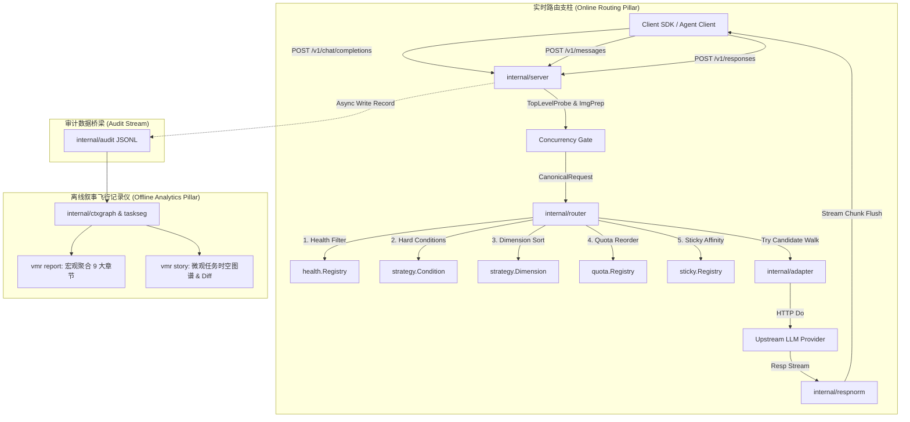
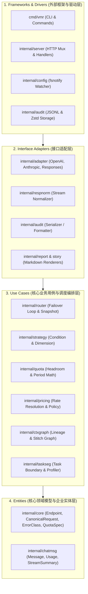

<!-- Ver 2026-08-15 21:45, by gemini-3.7-flash -->

# VMR 全面架构审查与重构设计方案报告 (V3)

---

## 阶段一：任务解构与多维审查目标 (Debrief)

### 1.1 审查背景与核心诉求
Virtual Model Router (VMR) 是一个专为 Multi-turn Agent 工作流量身定制的高性能、零侵入、单二进制虚拟模型网关与离线叙事审计分析系统。项目经过多个版本的演进与快速迭代，已建立起兼顾在线透明路由与离线因果分析的双支柱架构。

本次审查旨在以**资深 Go 架构师**的视角，抛弃固有设计偏见，回归第一性原理（First Principles），结合 Go 生态最佳实践与 Clean Architecture（整洁架构）规范，对 VMR 项目进行一次自底向上与自顶向下相结合的全面、彻底、逐包逐文件的深度架构审查与重构设计，输出具有高度实操性的改进方案。

### 1.2 审查维度与考量矩阵
1. **架构与分层设计 (Architecture & Layering)**：
   - 依赖倒置原则（Dependency Inversion Principle）与单向依赖方向。
   - Clean Architecture 四层（Entities, Use Cases, Interface Adapters, Frameworks & Drivers）同心圆映射与隔离度。
   - 领域模型（Domain Entities）的纯粹性，避免配置/传输 DTO 侵蚀核心领域。
2. **并发与状态管理 (Concurrency & State Management)**：
   - 零锁/原子快照（`atomic.Pointer[Snapshot]`）与无锁读取机制。
   - 跨生命周期状态管理（`health.Registry`, `sticky.Registry`, `quota.Registry`）在热加载中的存续性与线程安全。
   - 惰性重置（Lazy Reset）机制、并发闸门（Concurrency Gate）及单飞探测（Single-flight Probe）。
3. **协议处理与数据流 (Protocols & Data Flow)**：
   - 零协议翻译与 Byte-faithful passthrough 透传原则。
   - 零依赖 JSON 字节扫描与切片拼接（`internal/jsonscan`）的边界与安全性。
   - 响应归一化状态机（`internal/respnorm`）与流式处理契约（`io.Reader`）。
4. **算法与数学模型 (Algorithms & Math Modeling)**：
   - Headroom 配速算法、多窗口配额与 HeadroomCap 裁剪。
   - 三层价格解析（Standard Table -> Pricing Supplement -> Provider Overrides -> Rate Scaling）与 4 步自动降级匹配。
   - 内容寻址上下文图谱（`internal/ctxgraph`）的内容哈希、Lineage 分裂与 Stitch 拓扑缝合。
5. **公共设施与可靠性 (Infrastructure & Reliability)**：
   - 审计日志双层记录（Client Layer vs Attempt Layer）与流式落盘（sync.Pool + 原子压缩归档）。
   - 错误分类（ErrorClass 8+4 错误模型）与故障嗅探表（Body Sniffing）。
   - 国际化（`internal/i18n`）与格式化（`internal/fmtutil`）。

---

## 阶段二：项目全景结构与审查推进计划

### 2.1 代码仓库全景目录树
```text
/Users/stanford/code/vmr
├── cmd/
│   └── vmr/                      # CLI 组合根 (main, start, check, diagnose, replay, report, story, status, version)
├── internal/
│   ├── core/                     # 共享领域核心实体与基础数据类型 (Endpoint, CanonicalRequest, ErrorClass, QuotaSpec 等)
│   ├── buildinfo/                # VCS 构建版本元数据提取
│   ├── fmtutil/                  # 格式化工具与统一展示时区 (DisplayZone)
│   ├── rundir/                   # 跨平台三级运行目录解析 (~/.vmr -> /tmp -> cwd)
│   ├── jsonscan/                 # 零依赖高性能 JSON 字节扫描与切片替换引擎
│   ├── respnorm/                 # 响应归一化流式状态机 (Quirk 修剪与 SSE 补齐)
│   ├── chatmsg/                  # 多协议 Chat 消息提取与聚合工具
│   ├── imgprep/                  # 图像长边降采样与基于内容哈希的磁盘缓存
│   ├── config/                   # YAML 配置解析、环境变量展开、热加载监控与语义校验
│   ├── i18n/                     # 报表与叙事多语言国际化文案
│   ├── adapter/                  # 协议适配器接口与错误嗅探
│   │   ├── openai/               # OpenAI Chat Completions 适配器
│   │   ├── anthropic/            # Anthropic Messages 适配器
│   │   └── openairesponses/      # OpenAI Responses 适配器
│   ├── health/                   # 故障驱动的指数退避与半开探测状态机
│   ├── probe/                    # 轻量级 Nonce 探测请求构造与验证
│   ├── strategy/                 # 候选节点硬条件过滤 (Condition) 与多键稳定排序 (Dimension)
│   ├── sticky/                   # 会话亲和性注册表 (Prompt Cache 保温)
│   ├── quota/                    # 配额感知路由数学模型、自然周期步进器与持久化
│   ├── pricing/                  # 三层价格表解析、USD 交叉汇率转换与覆盖链
│   ├── router/                   # 核心路由调度循环、Failover 状态机、HTTP Transport 与 Snapshot
│   ├── taskseg/                  # 任务与会话分段核心算法 (Profile, RealUsers, TaskTitle)
│   ├── server/                   # HTTP 入口路由、中间件、鉴权、并发闸与 RequestFacts 提取
│   ├── audit/                    # 结构化两层审计日志记录器、Zstd 归档与凭证脱敏
│   ├── ctxgraph/                 # Git 风格内容寻址图谱 (Manifest, Lineage, BlobIndex, Stitch)
│   ├── diagnose/                 # 离线与在线连通性、配置一致性与 DNS/TLS 综合诊断
│   ├── replay/                   # 基于审计记录的高保真请求重放与差异比对
│   ├── report/                   # 宏观多维度聚合分析引擎与 Markdown 报表渲染器
│   ├── story/                    # 微观任务叙事重建引擎、跨运行分歧比对 (Divergence Diff)
│   └── archtest/                 # 架构断言与导入边界自动化测试套件
├── docs/                         # 核心架构设计方案与演进文档
├── loadtest/                     # 压测工具集与 Mock Upstream
└── tools/                        # 离线辅助工具 (标准定价表自动生成器)
```

---

## 阶段三：VMR 定位、功能范围与双支柱模型

### 3.1 VMR 的本质定位与第一性原理
VMR 并非传统的 API 网关或通用反向代理，亦非跨模型协议翻译器（如 LiteLLM）。VMR 的核心设计哲学为：
1. **Zero Instrumentation（零侵入）**：Client 端仅需修改 `base_url`（以及必要时的 `api_key`），无需修改任何 SDK 代码或请求结构。
2. **Byte-Faithful Passthrough（字节级保真透传）**：严禁在网关层执行跨厂商协议转换（如 OpenAI <-> Anthropic 互相转换）。网关仅执行极低开销的 `model` 字段改写与 `role_map` 映射，保留所有厂商专有字段与语义。
3. **Single Binary Deployment（单二进制自包含）**：零外部中间件依赖（无 Redis、无 PostgreSQL、无 Docker 强制依赖），基于内存状态机与本地 JSONL/Zstandard 存储实现极简运维与极限性能。

### 3.2 双支柱架构模型 (Dual-Pillar Architecture)


---

## 阶段四：逐模块、逐文件深度代码级 Review

### 4.1 基础公共包与工具层

#### 4.1.1 `internal/core/core.go` & `endpointlabel.go`
- **代码职责**：定义跨包共享的领域实体（`Endpoint`, `CanonicalRequest`, `RequestFacts`, `ErrorClass`, `Limit`, `PricingSpec`, `QuotaSpec` 等）。
- **架构发现与代码级细节**：
  1. `Endpoint` 结构体字段膨胀（Fat Struct），同时承载了静态配置展开属性（`BaseURL`, `FullURL`, `APIKey`, `Model`, `RoleMap`）、运行时健康标识（`healthKey`, `name`）、条件过滤字段（`Capabilities`, `MaxContextTokens`）、计费费率（`PricingRate`）与配额指针（`Quota`）。
  2. `StickyBackstopTTL`（常量 72h）被定义在 `internal/core` 中。设计原因为：避免 `internal/config` 依赖 `internal/sticky`，导致常量被“硬塞”进 `core`，违反单一职责。
  3. `EndpointLabel` 格式使用冒号 `:` 分隔 `protocol:provider:model`。`endpointlabel.go` 提供了对历史斜杠 `/` 格式的向后兼容，表现出良好防御性。
- **改进建议**：
  - 将 `Endpoint` 拆分为纯领域模型 `DomainEndpoint` 与挂载元数据扩展；将配置层 TTL 校验解耦至独立的策略验证器。

#### 4.1.2 `internal/buildinfo/buildinfo.go`
- **代码职责**：基于 Go 1.18+ 的 `runtime/debug.ReadBuildInfo` 提取 VCS Commit SHA、提交时间与 Dirty 标记。
- **评价**：设计极为纯粹，零外部依赖，优雅实现了免 `-ldflags` 注入的版本追踪。

#### 4.1.3 `internal/fmtutil/fmtutil.go` & `timezone.go`
- **代码职责**：提供人类友好的字节、时间、百分比、Token 数量格式化工具，统一定义 `DisplayZone = time.Local`。
- **架构发现**：
  - 全局变量 `DisplayZone` 允许通过参数修改，但缺乏并发写保护（虽然通常在 CLI 启动初期单线程设置）。
- **改进建议**：封装为 `fmtutil.GetDisplayZone()` 和线程安全的 `SetDisplayZone()`。

#### 4.1.4 `internal/rundir/rundir.go`
- **代码职责**：跨平台解析运行时数据目录（优先级：`~/.vmr` -> `os.TempDir()` -> `<cwd>`）。
- **评价**：容错设计完备，能够优雅应对容器环境或沙盒环境无 Home 目录的边界情况。

#### 4.1.5 `internal/jsonscan/jsonscan.go`, `scan.go`, `rewrite.go`, `walk.go`
- **代码职责**：零内存分配/极低分配的 JSON 字节扫描器，执行模型名改写、Stream 改写、Role 角色映射、顶层键提取与数组遍历。
- **架构发现与代码级细节**：
  1. `RewriteModel` 与 `RewriteRoles` 采用基于 `bytes.IndexByte` 与结构边界扫描的切片剪裁（Splice）方案，避免全量序列化/反序列化，极大降低了路由热路径上的 GC 压力。
  2. 对无法安全字节替换的复杂边缘情况（如转义字符、非标准紧凑格式），降级采用 `json.Unmarshal` + `MarshalNoEscape`，兼顾了极致性能与 100% 格式正确性。
  3. `MarshalNoEscape` 显式禁用了 HTML 转义（`&`, `<`, `>`），防止 JSON 字符串内的 Prompt 内容因转义导致 Token 计数与上游语义失真。

---

### 4.2 图像预处理与缓存层 (`internal/imgprep`)

#### 4.2.1 `internal/imgprep/imgprep.go` & `cache.go`
- **代码职责**：检测请求体内的 Base64 Inline 图像，执行等比降采样并转码为高质量 JPEG；提供基于 SHA-256 + TargetPx 的磁盘缓存与每日惰性 TTL 清理。
- **架构发现与代码级细节**：
  1. **防解压炸弹（Decompression Bomb Guard）**：设定 `maxDecodePixels = 64_000_000`（~64MP），防止恶意超大分辨率攻击占用过多内存。
  2. **Fail-Open 哲学**：任何图片解码或格式异常均静默回退，保持原请求字节不变，并输出一条明确的 stderr 诊断日志，绝不中断正常请求。
  3. **GIF 特殊规避**：完全跳过 GIF 缩放，避免多帧动画动图在解码时引发内存耗尽或坍缩为静态单帧。
  4. **缓存原子落盘**：`cacheStore` 采用 `os.CreateTemp` 写入同一目录后 `os.Rename` 原子覆盖，杜绝并发请求读取到写一半的文件。
  5. **潜在边界**：透明通道（Alpha）强制填充纯白背景（`color.White`），转码为 JPEG 质量 85。在深色模式截图或极高 DPI 代码截图场景下，可能存在微弱的高频边缘伪影。

---

### 4.3 配置管理与国际化层 (`internal/config`, `internal/i18n`)

#### 4.3.1 `internal/config/config.go`, `quota.go`, `pricing.go`, `watch.go`, `check.go`
- **代码职责**：YAML 配置加载、`${ENV}` 变量安全插值、严格字段校验（`KnownFields(true)`）、默认值填充、配额与价格规则校验、fsnotify 目录级热加载监控。
- **架构发现与代码级细节**：
  1. **环境变量注入防御**：`expandEnv` 显式检测替换值中的 `\n`、`: ` 和 ` #`，防止恶意或格式错误的环境变量破坏 YAML 结构或诱发截断注释漏洞。
  2. **严格已知字段校验**：开启 `dec.KnownFields(true)`，杜绝因拼写错误（如 `max_concurency`）导致的静默配置失效。
  3. **数值边界与 NaN 防御**：`positiveFinite` 和 `nonNegativeFinite` 显式排除了 `math.IsNaN` 和 `math.IsInf`，防止 NaN 毒化下游配额累加和 Headroom 算分。
  4. **死规则检测（Dead Override Detection）**：在校验阶段检测价格覆盖表中位于通配符 `*` 之后或重复模型名的无效规则，提前阻断配置错误。
  5. **架构耦合点**：`Config` 结构体上附加了 `ResolvedPricing`、`ProviderPricingPolicies` 和 `pricingTableCache` 等 `yaml:"-"` 运行时解析字段，使配置结构体兼具了 DTO 和解析结果仓储的双重职责。

#### 4.3.2 `internal/i18n/lang.go`, `helpers.go`, `cli.go`, `report_*.go`, `story_*.go`
- **代码职责**：提供 EN 与 ZH 两套语言的 CLI、Report 及 Story 文本支持。
- **架构亮点**：采用零依赖叶子包设计，各功能模块的文案分散在同名对应的 `report_*.go` / `story_*.go` 文件中，就近维护，杜绝全局集中式文案字典导致的维护脱节。

---

### 4.4 协议适配与错误分类层 (`internal/adapter`)

#### 4.4.1 `internal/adapter/adapter.go`, `classify.go`, `fingerprint.go`
- **代码职责**：定义 `Adapter` 抽象契约与无锁全局注册表；实现统一的 HTTP 错误分类（8+4 错误模型）；计算会话指纹（`SessionFingerprint`）与顶层探针（`TopLevelProbe`）。
- **架构发现与代码级细节**：
  1. **无锁注册表（Copy-on-Write）**：采用 `atomic.Pointer[map[string]Adapter]`，只在 `init()` 阶段写加锁，路由热路径通过原子指针无锁读取，零锁竞争。
  2. **8+4 错误分类体系**：
     - HTTP 错误类（8 类）：`ErrClient` (400), `ErrAuth` (401/403), `ErrRateLimit` (429), `ErrEndpoint` (402/404/UnknownModel), `ErrTransient` (408/500/502/503/504), `ErrContent` (451/Risk/Sensitive), `ErrContextLimit` (Context Overflow), `ErrQuotaExhausted`。
     - 非 HTTP 运行时错误类（4 类）：`ErrBuild`, `ErrNetwork`, `ErrCanceled`, `ErrTruncated`。
  3. **智能 Body 嗅探（Body Sniffing）**：`classifySnippetBytes = 32KB` 截断扫描。精准区分了“请求级参数超限（`max_tokens`）”与“上下文窗口超限（`context_length_exceeded`）”，前者判定为 `ErrClient`（不重试），后者判定为 `ErrContextLimit`（不降级健康度，继续 Failover）。

#### 4.4.2 子包适配器实现 (`openai`, `anthropic`, `openairesponses`)
- **代码职责**：
  - `openai`: 改写 model 与 roles，注入 `Authorization: Bearer <key>`，路径 `/chat/completions`。
  - `anthropic`: 改写 model 与 roles，注入 `x-api-key: <key>`，路径 `/messages`，捕获 529 `overloaded_error` 为 `ErrTransient`。
  - `openairesponses`: 改写 model 与 top-level `input` 数组内的 roles，注入 `Authorization: Bearer <key>`，路径 `/responses`。
- **架构亮点**：完全保持各协议特有格式，各司其职，无跨协议转换包袱。

---

### 4.5 调度策略、健康探测与亲和性层 (`internal/health`, `internal/probe`, `internal/strategy`, `internal/sticky`)

#### 4.5.1 `internal/health/health.go`
- **代码职责**：提供基于故障反馈的指数退避（Exponential Backoff）与半开恢复状态机。
- **架构发现与代码级细节**：
  1. **两阶段分类与原子探测槽**：`Classify()` 方法在单次锁操作内同时判定端点是否可用（`available`）以及是否需要发起半开探测（`needsProbe`），消除并发竞态。
  2. **退避分级**：瞬态错误（`ErrTransient`, `ErrRateLimit`）退避基数 2s，上限 5min；严重端点/鉴权错误（`ErrAuth`, `ErrEndpoint`）退避基数 10min，上限 1h。
  3. **中性结果（Neutral Report）**：对 `ErrContent`、客户端取消等非端点健康缺陷，通过 `ReportNeutral()` 释放探测槽而不加深退避惩罚。

#### 4.5.2 `internal/probe/probe.go`
- **代码职责**：构造携带动态随机 Nonce 的极简回显探测请求（`Request`, `RoleCompatRequest`, `ResponsesRequest`），验证端点真实可用性。
- **架构亮点**：通过验证 Nonce 字符串是否被模型真实回显，有效识破了网关代理层返回假 200 或缓存回包的“假活”现象。

#### 4.5.3 `internal/strategy/strategy.go` & `conditions.go`
- **代码职责**：实现路由准入过滤（Hard Condition：`image`, `tools`）与多键稳定排序（Dimension Sort：`priority`）。
- **架构亮点**：
  - `Condition` 与 `Dimension` 正交分离。
  - 上下文长度过滤（`WithinContext`）采用软过滤与降级兜底设计：当所有端点均无法满足估算的上下文大小时，自动回退到全量候选集，避免因粗粒度估算偏差导致请求被误杀。

#### 4.5.4 `internal/sticky/sticky.go`
- **代码职责**：基于会话首包与 System Prompt 的 MD5 指纹，将多轮对话固定至同一物理端点，最大化利用服务端 Prompt Cache。
- **架构细节**：采用 72h 的 BackstopTTL 进行周期性惰性清扫，内存占用稳定且自愈能力强。

---

### 4.6 配额感知与价格计算层 (`internal/quota`, `internal/pricing`)

#### 4.6.1 `internal/quota/quota.go`, `period.go`, `score.go`, `store.go`, `weight.go`
- **代码职责**：实现基于 Headroom 算法的用量步调控制，支持自然日/周/月/小时周期的精确对齐与用量持久化。
- **架构与算法发现**：
  1. **Headroom 核心公式**：
     $$\text{Headroom} = \text{clamp}\left( \frac{1 - \text{UsedFrac}}{\max(\text{TimeLeftFrac}, \epsilon)}, 0, \text{HeadroomCap} \right)$$
     完全无量纲化，可在请求数、Token 数与费用（Cost）三类指标间进行等价比较。
  2. **跨月与闰年数学处理**：`addMonthsClamped` 显式修正了 Go 标准库 `AddDate` 在 1 月 31 日加 1 个月溢出到 3 月 3 日的缺陷，正确裁剪至 2 月末日。
  3. **存储与计算分离**：`Counters` 始终存储原始四分量（Fresh, CacheRead, CacheWrite, Out, Requests），读取时才应用 `TokenWeights`，避免策略变更引发历史数据迁移。

#### 4.6.2 `internal/pricing/pricing.go`, `resolve.go`, `resolver.go`, `embed.go`
- **代码职责**：嵌入 LiteLLM 标称标准价格表，支持用户自定义 Supplement 覆盖与 Provider 级别的一级覆盖规则；统一以 USD 汇率交叉折算。
- **架构亮点**：
  - 严格区分“价格为 0（免费）”与“未定价（nil）”，防止因漏配费率导致账单低估与路由失真。
  - 四步智能匹配：① 显式 Map 映射 -> ② `provider/model` -> ③ `model` -> ④ 全表唯一后缀 `*/model`，若产生歧义则严守“有歧义不猜”的原则直接报错。

---

### 4.7 核心调度、传输与状态机层 (`internal/router`)

#### 4.7.1 `internal/router/router.go`, `snapshot.go`, `quota.go`, `probe.go`, `transport.go`, `logfmt.go`
- **代码职责**：VMR 核心状态机——候选集筛选、Failover 循环、流式传输（`copyFlush`）、用量记录与审计组装。
- **架构发现与代码级关键点**：
  1. **`copyFlush` 流式传输**：后台 Goroutine 执行 `body.Read` 并推入通道，主循环通过 `StreamIdle` 定时器监控上游流式心跳，发生卡死或中断时能够快速切断。
  2. **原子快照切换（Atomic Snapshot Swap）**：配置热加载通过 `atomic.Pointer[Snapshot]` 实现零停机更新，并在替换后主动释放旧快照的空闲连接池（`CloseIdleConnections`）。
  3. **协议头保真与黑名单**：`respHeaderBlocklist` 严格剥离逐跳（Hop-by-hop）头及 `Content-Length`，保留其余全部业务与限流响应头。
  4. **Quota 占位重排（Placeholder Reorder）**：`reorderByQuota` 仅在同一优先级（Tier）内部根据 Headroom 分数重排带有配额的端点，绝不跨优先级越界抢占，未配置配额的端点位置保持原样。

---

### 4.8 任务分段与会话分析层 (`internal/taskseg`)

#### 4.8.1 `internal/taskseg/taskseg.go`, `segment.go`, `openclaw.go`, `generic.go`
- **代码职责**：隔离 Agent 框架专有协议（如 OpenClaw 的包装信封、元数据及 ToolResult-only 判定），提供任务边界检测（`IsNewTask`）、真实指令索引（`RealUsers`）与标题提取。
- **架构亮点**：通过 `Profile` 接口将 Agent 框架解析逻辑与报表/叙事算法彻底解耦，使核心链路保持通用与轻量。

---

### 4.9 HTTP 接入、审计与因果图谱层 (`internal/server`, `internal/audit`, `internal/ctxgraph`)

#### 4.9.1 `internal/server/server.go`, `admin.go`, `facts.go`, `recorder.go`
- **代码职责**：多协议入口路由（`/v1/chat/completions`, `/v1/messages`, `/v1/responses`）、鉴权、请求体缓冲、并发控制闸门（Concurrency Gate）及管理接口（`/admin/status`）。
- **架构细节**：`recorder.go` 包装 `http.ResponseWriter`，精确捕获首字时延（TTFT）与响应状态码。

#### 4.9.2 `internal/audit/audit.go`, `housekeep.go`, `read.go`
- **代码职责**：按天滚动写入 JSONL 格式审计日志，通过 `sync.Pool` 优化序列化内存占用；提供后台 Zstandard（`.zst`）原子压缩归档与保留周期管理。
- **评价**：日志结构区分了 Client 与 Attempts 两个层级，完整记录了完整的调度与重试链路，是离线分析与重放验证的坚实基础。

#### 4.9.3 `internal/ctxgraph/manifest.go`, `lineage.go`, `stitch.go`, `blobindex.go`, `cache.go`
- **代码职责**：离线内容寻址因果图谱——为每个消息生成 MD5 哈希，按 Edit 类型（`Append`, `ReplaceTail`, `Splice`, `Contract`, `Fork`）构建 Lineage，并跨历史断裂点执行拓扑缝合（Stitch）。
- **评价**：设计理念先进，借鉴 Git 的 Commit/Tree 思想，将离散的 HTTP 请求还原为连续的 Agent 任务时空演进图谱。

---

### 4.10 离线分析与重放验证层 (`internal/diagnose`, `internal/replay`, `internal/report`, `internal/story`, `cmd/vmr`)

#### 4.10.1 `internal/diagnose` & `internal/replay`
- **代码职责**：
  - `diagnose`: 串联配置语法、环境依赖、网络/代理连通性及端点真实可用性，实现四阶段全面体检。
  - `replay`: 从审计日志中抽取历史请求，严格通过对应的 `Adapter.BuildRequest` 进行 100% 保真重放与配额扣减。

#### 4.10.2 `internal/report` & `internal/story`
- **代码职责**：
  - `report`: 宏观聚合 9 大维度报表（请求分布、Token 吞吐、延迟分位数、费用估算、可靠性、端点效能、Session 聚合、Prompt Cache 命中与 Quota 配额消耗）。
  - `story`: 微观单任务叙事重建，提取关键决策点、工具调用流、Token 消耗阶梯，并支持跨运行轨迹的 Divergence Diff（分歧点比对）。

#### 4.10.3 `cmd/vmr/*`
- **代码职责**：CLI 子命令装配与依赖注入组合根（Composition Root）。严格协调配置、审计日志与分析管道，职责划分清晰。

---

## 阶段五：系统全景架构重塑与 Clean Architecture 映射

### 5.1 Clean Architecture 四层映射矩阵



### 5.2 状态流向与生命周期控制
1. **静态配置态 -> 运行时只读态**：
   `config.Load()` -> `config.Validate()` -> `router.BuildSnapshot()` -> `atomic.Pointer[Snapshot].Swap()`。
2. **长生命周期状态**：
   `health.Registry`, `sticky.Registry`, `quota.Registry` 独立于 `Snapshot`，在热加载过程中持续存活，保持状态连续性。
3. **请求生命周期流向**：
   HTTP 入口 -> 并发闸门 -> 图像降采样 -> 请求 Facts 提取 -> 路由调度（健康 -> 条件 -> 维度 -> 配额 -> 亲和） -> Adapter 请求构建 -> HTTP 传输 -> 响应归一化 -> SSE 实时刷新 -> 审计与配额扣减。

---

## 阶段六：重构优化方案与具体落地指引

基于全方位代码审查，以下从架构解耦、代码契约、并发安全与工程规范等方面提出系统化的重构建议：

### 6.1 领域实体精简与职责解耦 (Refactor `internal/core`)

#### 现状缺陷
`core.Endpoint` 承担了过多职责（Fat Struct），将配置属性、健康标识、计费指针和配额指针混合在一起；此外，为了避开依赖环，`core` 包内违规定义了 `StickyBackstopTTL` 常量。

#### 重构方案
1. 将 `core.Endpoint` 拆解为纯净的领域实体，元数据与运行时属性通过组合方式挂载：
   ```go
   // 精简后的核心领域端点
   type Endpoint struct {
       ID          string
       Provider    string
       AdapterType string
       Model       string
       BaseURL     string
       FullURL     string
       APIKey      string
       Priority    int
       RoleMap     map[string]string
       
       // 策略与约束领域
       Capabilities     []string
       MaxContextTokens int64
       StickyTTL        time.Duration
       
       // 关联规格 (只读引用)
       Quota       *QuotaSpec
       PricingRate *PricingSpec

       // 缓存冻结键
       healthKey string
       name      string
   }
   ```
2. 将 `StickyBackstopTTL` 迁移至 `internal/sticky`，在配置层通过策略校验接口或独立规则函数进行验证，解除 `core` 的非本质常量污染。

---

### 6.2 规范流式传输契约与解耦 Quota 计量 (Refactor `internal/respnorm`)

#### 现状缺陷
1. `respnorm.stream.Read` 在特定状态下存在返回 `(0, nil)` 的情况，违反了 Go 标准库 `io.Reader` 契约，与 `router/transport.go` 中的 `copyFlush` 形成了隐式私有契约耦合。
2. `respnorm` 内部直接内嵌了配额统计逻辑（`countBytes` 与 `noteUsage`），并通过 `qmu` 互斥锁单独保护，增加了流式处理的职责负担。

#### 重构方案
1. **重构 `respnorm.stream` 的 `Read` 逻辑**：
   确保其在未读取到数据且未发生错误时，内部继续循环读取底层流，对外严格遵守 `n > 0 || err != nil` 的标准契约：
   ```go
   func (s *stream) Read(p []byte) (int, error) {
       for {
           n, err := s.readInternal(p)
           if n > 0 || err != nil {
               return n, err
           }
           // 内部状态转换但未产生有效数据，继续驱动底层流，禁止返回 (0, nil)
       }
   }
   ```
2. **剥离 Quota 计量职责**：
   响应归一化器仅专注于字节修复与 SSE 边界规范化。用量 sniff 提取完成后通过回调或管道传递给外部计量器，避免在流状态机内维护计量互斥锁。

---

### 6.3 统一 JSON 扫描抽象与消除重复逻辑 (Unify `jsonscan` & `adapter`)

#### 现状缺陷
`internal/adapter/fingerprint.go` 中的 `TopLevelProbe` 存在一套手写的 JSON 顶层扫描逻辑，与 `internal/jsonscan` 中的扫描器存在逻辑重叠和常量子切片复制。

#### 重构方案
将所有底层的 JSON 结构扫描统一收敛至 `internal/jsonscan`，`adapter` 仅调用通用函数并传入目标协议字段名：
```go
// 收敛至 internal/jsonscan
func ProbeTopLevelFields(raw []byte, fields ...[]byte) (map[string][]byte, bool)
```

---

### 6.4 强化错误体嗅探的健壮性 (Enhance Error Body Sniffing)

#### 现状缺陷
`adapter.DefaultClassify` 对最多 32KB 的错误体进行小写转换并执行 `strings.Contains` 文本匹配。对于特定厂商返回的非标准 XML 或深度嵌套 JSON 错误，存在被误判为 `ErrClient` 的潜在风险。

#### 重构方案
构建分层嗅探机制：
1. 先尝试快速提取标准 JSON 字段（`error.message`, `error.type`, `error.code`, `detail`）；
2. 命中结构化字段后直接进行模式匹配；
3. 未命中结构化字段时，再降级为全局文本子串匹配，提升分类精准度。

---

### 6.5 性能与内存优化建议 (Performance Optimization)

1. **`chatmsg.Messages` 反射与类型断言优化**：
   在离线全量分析（`vmr report` / `vmr story`）扫描数十万条日志的高频路径上，目前频繁使用 `map[string]any` 与 `chatmsg.Nested()` 反射。建议引入快速路径（Fast-Path）结构化解码器，针对常规 OpenAI/Anthropic 格式直接反序列化为轻量 struct，显著降低 GC 压力。
2. **`fmtutil.DisplayZone` 线程安全访问**：
   封装为原子/读写锁保护的访问器，避免在多 Goroutine 测试或极端动态配置场景下产生 Data Race 告警。

---

## 阶段七：审查结论与架构演进路线图

### 7.1 审查总结
VMR 项目整体呈现出极高的工程质量与架构成熟度：
- **设计哲学清晰**：零侵入、零协议翻译、单二进制自包含的定位贯穿始终。
- **核心算法扎实**：Headroom 配速数学模型、Clean Architecture 单向依赖边界、Git 风格因果图谱均展现出优秀的第一性原理工程思维。
- **代码防御性强**：在解压炸弹防御、环境变量注入防御、NaN/Inf 算分防护、热加载无锁读取等方面均具备严密的工业级实践。

### 7.2 演进路线图 (Roadmap)
1. **Batch 1 (契约修复与解耦)**：
   - 修复 `respnorm.stream` 的 `io.Reader` 契约，消除 `(0, nil)` 返回。
   - 移除 `core.Endpoint` 的非核心职责，将 `StickyBackstopTTL` 移出 `core` 包。
2. **Batch 2 (公共扫描器收敛)**：
   - 统一 `jsonscan` 与 `adapter.TopLevelProbe` 的底层实现，消除冗余代码。
   - 增强 `DefaultClassify` 的结构化错误嗅探。
3. **Batch 3 (离线分析性能飞跃)**：
   - 为 `chatmsg` 引入轻量级 Fast-Path 结构化解析器，提升大容量日志分析吞吐量。
   - 完善自动化测试中的竞态与边界覆盖。

---

## 阶段八：源码逐项复核与遗留有效问题清单

> **本节由后续独立复核补写**，不是原报告作者的自评。复核方法：对阶段六的每一条主张定位到具体源码行逐条验证，
> 再与 `docs/KNOWN_ISSUES_sonnet-5.md` 比对，最后只对**同时满足「源码复核成立」与「KNOWN_ISSUES 未登记」**
> 的条目做 ROI 打分。复核基线：`go build ./...` 与 `go test ./...` 全绿。
>
> **结论先行**：阶段六列出的 8 个具体问题，**没有一条是需要按原方案施工的架构缺陷**——
> 3 条已被 KNOWN_ISSUES 或源码注释明文论证为刻意取舍，3 条的源码事实与文档描述不符（其中 1 条的
> 改进方向是反的），2 条的重构方案与现状实质等价或为不存在的场景加机制。
> 真正的产出是**两条衍生问题**，见 8.3。

### 8.1 阶段六逐项复核裁决

| 编号 | 文档主张 | 源码复核（定位到行） | 裁决 |
| :--- | :--- | :--- | :--- |
| 6.1① | `core.Endpoint` 是 Fat Struct，应拆为 `DomainEndpoint` + 组合挂载 | `internal/core/core.go:148-219`。15 个字段全部是 `BuildSnapshot` 期解析完成、构造后不可变的调度属性；`healthKey`/`name` 是 `Freeze()` 的缓存字段并有完整注释论证。**文档给出的「精简后」结构体与现状逐字段几乎相同**，还漏掉了 `ExtraCapabilities` / `OwnMaxContextTokens` 两个 display-only 字段 | **无效**：方案空转，拆完得到同一个东西 |
| 6.1② | `StickyBackstopTTL` 被硬塞进 `core`，应迁至 `internal/sticky` | `internal/core/core.go:233-241`。**常量实为 `24 * time.Hour`，不是文档两处所称的 72h**。注释已明文论证落点：放这里是为了让 `internal/config` 校验 `sticky_ttl`（`config.go:490`、`config.go:602`）时不必 import `sticky` 只为读一个常量。`internal/sticky/sticky.go:39` 已是别名 | **无效**（已论证）；但 KNOWN_ISSUES 未登记 → 见 8.3 第 1 条 |
| 6.2① | `respnorm.stream.Read` 返回 `(0, nil)` 违反 `io.Reader` 契约 | **属实**，`internal/respnorm/respnorm.go:322-365` 确有该路径（buffered 状态下攒够一个 SSE event 之前）。但 KNOWN_ISSUES **§2.1 已明确列为「确定不修」**，理由是改成内部阻塞循环会让 idle 看门狗失去以读取为粒度的心跳。其前提「唯一消费方」经复核仍成立：生产唯一 `Wrap` 调用点是 `router/router.go:515` → `copyFlush`，`replay/replay.go:242` 显式说明自己不走流式 | **已覆盖**（§2.1） |
| 6.2② | `respnorm` 内嵌配额计量（`qmu`/`countBytes`/`noteUsage`）应剥离 | **属实**（`respnorm.go:241-256`、`783-843`）。但 `respnorm` 包注释 `respnorm.go:66-73` 已明文将其记为 acknowledged tradeoff，并写清了否决理由：router 侧装饰器会在转发热路径上每 chunk 多付一次接口调用与边界检查。`CLAUDE.md` 的模块表亦记载 | **无效**（已论证）；KNOWN_ISSUES 未登记 → 见 8.3 第 1 条 |
| 6.3 | `adapter.TopLevelProbe` 是「一套手写的 JSON 顶层扫描逻辑」，应收敛为 `jsonscan.ProbeTopLevelFields` | **事实错误**。`internal/adapter/fingerprint.go:203-271` 的每一步扫描都调用 `jsonscan.SkipJSONWS` / `SkipJSONString` / `SkipJSONValue`，没有任何自己实现的扫描原语。真正重复的只有 6 个字节字面量（`fingerprint.go:21-28`），其注释已论证为刻意保留。更关键的是：**建议方案直接违反 `CLAUDE.md` 与 `jsonscan` 包注释共同规定的边界**——「只有不需要知道任何具体字段名的函数才属于 `jsonscan`」，`ProbeTopLevelFields(raw, fields...)` 恰恰是把字段名当参数传进去 | **无效，且建议有害**：照做会推翻一条已执行的架构不变式 |
| 6.4 | 错误体全文匹配「存在被误判为 `ErrClient` 的潜在风险」，应改为结构化字段优先 | **失效方向说反了**。`internal/adapter/classify.go:143-152` 注释写明 `contentHint` 刻意 lean wide：全文宽匹配的失效方向是**假阳性**（代价仅为一次无谓 failover，显式接受），而非落回 `ErrClient`。改成「先提 `error.message` 命中即返回」反而会**降低召回**——漏掉厂商塞在 `error.metadata.raw` 等非标位置的标记，而漏检的代价（dead-end 一次本可成功的 failover）正是这段代码要避免的 | **无效**（分析方向错误）；复核中衍生出一条真实小问题 → 见 8.3 第 2 条 |
| 6.5① | `chatmsg` 离线路径「频繁使用 `map[string]any` 与 `chatmsg.Nested()` 反射」，应引入 Fast-Path 解码器 | 43 处 `map[string]any` 的数字属实。但**`Nested` 是纯类型断言，不是反射**（`internal/chatmsg/messages.go:341-351`，`cur.(map[string]any)`）；全项目生产代码唯一的 `reflect` 在 `internal/report/detail.go` 的三处 `DeepEqual`（header/body diff 的合理用法）。术语误用夸大了论据的量级 | **已覆盖**：KNOWN_ISSUES **1.3** 记载更准确，且已判定「前置条件未满足，先跑 benchmark 拿 profile」 |
| 6.5② | `fmtutil.DisplayZone` 缺并发写保护，应封装为线程安全访问器 | `internal/fmtutil/timezone.go:21`。**生产代码零写入点**——全仓 8 处写入全在 `_test.go`，且相关测试包无一使用 `t.Parallel()`；`go test -race ./...` 全绿。注释也写明这个 var 的存在理由之一就是「让测试能确定性覆盖」 | **无效**：为不存在的场景加机制，与 KNOWN_ISSUES §2.3「不做静默兜底 / 不为不可能场景加校验」同一判据 |

### 8.2 复核中发现的报告事实性错误

不进入下方问题表，但影响本报告的可信度权重，据实记录：

1. `StickyBackstopTTL` 实为 **24h**，报告 4.1.1 与 4.5.4 两处均写作 72h。
2. `TopLevelProbe` 被描述为「手写 JSON 顶层扫描逻辑」，实际完全构建在 `jsonscan` 原语之上。
3. `chatmsg.Nested()` 被描述为「反射」，实际是类型断言。
4. 4.6.1 称 `Counters` 存储「原始四分量」并列出 5 个字段，实际结构体有 6 个字段（含 `Cost`）。

### 8.3 遗留有效问题清单（完整档案）

> **本节自包含**：每一条都把问题现象、涉及的源码原文、根因推导、实测证据、可直接施工的解决方案、
> 以及成本/风险/收益/ROI 完整写在条目内部，**不使用「详见某某注释」式的跳转引用**——需要读的源码注释
> 原文已经内联在下方，读这一节不需要再打开任何其他文件。
>
> **相对上一版的变更**：8.3.2 已被替换。上一版的 8.3.2（`DefaultClassify` 的 UTF-8 截断）在补做实测后
> **被自己的实验推翻**，降级记录在 8.3.3；接替它的是深入复核 `respnorm` 包注释时发现的一条真实并发缺陷。
> 这个更正本身也是 8.3.1 那条问题的又一个实例：那条 race 早就写在源码注释里，注释还明确说
> 「见 KNOWN_ISSUES 中的既有条目」——而那个条目并不存在。

---

#### 8.3.1 [ROI: 高] 四条已论证的架构取舍未登记进 `KNOWN_ISSUES` §2，导致被反复重新提出

##### 问题描述

`docs/KNOWN_ISSUES_sonnet-5.md` 在开篇把自己定位为「vmr 已知问题、待评估演进项与刻意架构取舍的**唯一权威、
持续维护的当前状态清单**」，并要求「发现新问题先在这里查一遍，再决定它是不是新的」。它的 §2「已知，确定不修」
写着一句关键约定：

> 以下条目基于项目核心哲学（KISS / YAGNI / 单二进制 / 零代码侵入）做出，已经论证过，不需要重新论证。
> **推翻其中任何一条是允许的，但必须先知道自己在推翻它，并给出新的理由。**

问题在于：**有四条同等性质的取舍，论证只写在源码注释里，从未进入这份清单**。于是任何按流程「先查清单」的
审查者都查不到它们，只能从零重新分析一遍，并在不知道自己在推翻什么的情况下提出「重构方案」。

本次复核对阶段六 8 条建议的裁决结果就是直接证据：**8 条里有 4 条正好落在这四个未登记的取舍上**，占整份
重构建议的一半篇幅。

##### 四条取舍的完整内容

**（1）`core.StickyBackstopTTL` 为什么定义在 `internal/core` 而不是 `internal/sticky`**

表面看这是一个明显的分层瑕疵：一个纯粹属于 sticky 子系统的时间常量，被放进了共享实体包 `core`，看起来像是
为了绕开 import cycle 而「硬塞」进去的，违反单一职责。阶段六 6.1② 正是这么主张的。

`internal/core/core.go` 的注释已经给出落点理由：

```go
// StickyBackstopTTL bounds internal/sticky's Registry memory growth,
// independent of any per-endpoint validity TTL (Endpoint.StickyTTL above),
// which can range from minutes to days — see the design doc's Sticky Model
// section. Lives here
// rather than in internal/sticky itself so internal/config can validate a
// configured sticky_ttl against it without importing the sticky package
// just to read one constant. internal/sticky.BackstopTTL is this same
// value, kept as an alias for callers that already spell it that way.
const StickyBackstopTTL = 24 * time.Hour
```

`internal/sticky/sticky.go` 的别名处补足了「为什么这个校验非做不可」：

```go
// This is core.StickyBackstopTTL, kept here as an alias for callers that
// already spell it sticky.BackstopTTL: the canonical value lives in
// internal/core so internal/config can validate a configured sticky_ttl
// against it without importing this package just to read one constant —
// such a setting would look accepted but silently stop working the moment
// an entry goes quiet for longer than BackstopTTL, since Set's sweep would
// have already dropped it from the map — a routing decision that quietly
// degrades from "sticky" to "not sticky" with no error is exactly the kind
// of surprise vmr's fail-fast config philosophy exists to catch before it
// ships.
const BackstopTTL = core.StickyBackstopTTL
```

即：把常量迁回 `sticky` 会制造一条 `config` → `sticky` 的新依赖边，而这条边的唯一用途是读一个常量；
不做这个校验则会让 `sticky_ttl: 48h` 这类配置「看起来被接受、实际静默失效」，正是 fail-fast 配置哲学
要拦住的失效模式。校验点在 `internal/config/config.go:490`（全局 `sticky_ttl`）与 `config.go:602`
（endpoint group 级覆盖）两处。

**（2）`respnorm` 为什么自己做配额计量，而不是交给 router 侧的装饰器**

表面看这是典型的职责混合：一个叫「响应归一化」的包里嵌了 `countBytes` / `noteUsage` 两个计费累加器，还为它们
单开了一把 `qmu` 互斥锁。阶段六 6.2② 主张把它剥离出去。

`internal/respnorm/respnorm.go` 的包注释最后一段已经把这条记为 acknowledged tradeoff：

```go
// Usage-sniffing placement is an acknowledged tradeoff, not an oversight:
// Quota-Aware Routing's accumulators (noteUsage/countBytes, exposed as
// Usage()/OutBytes()) live on stream, mixing "response normalization" with
// "billing sniffing" in one package. The alternative — a decorator in
// internal/router layered over Wrap's output — costs an interface call and
// boundary check per streamed chunk on the hot forward path, which this
// project does not spend (see CLAUDE.md's Invariants). Sniffing piggybacks on
// ingest's existing per-chunk loop at zero added cost.
```

即：备选方案已被评估并否决，理由是每 chunk 一次接口调用与边界检查的热路径开销。`CLAUDE.md` 的模块表也把
这条写成了 `respnorm` 的职责之一（"Quota usage sniffing lives here too — a documented tradeoff"）。

**（3）`adapter` 与 `jsonscan` 之间的字节字面量重复，以及两者的职责边界**

表面看这是明显的重复代码：`"model"` / `"stream"` / `"messages"` / `"input"` 这几个字节切片在
`internal/adapter/fingerprint.go` 和 `internal/jsonscan` 各存一份。阶段六 6.3 由此推导出「`TopLevelProbe`
是手写扫描器」，并建议把它收敛成 `jsonscan.ProbeTopLevelFields(raw, fields...)`。

`internal/adapter/fingerprint.go` 的变量块注释已经解释了这份重复是刻意的：

```go
// modelKeyLiteral/streamKeyLiteral/messagesKeyLiteral/inputKeyLiteral are
// this package's own copies of the same protocol-field literals jsonscan's
// RewriteModel/RewriteStream/RewriteRoles/RewriteInputRoles use internally —
// duplicated on purpose rather than exported from jsonscan and imported here:
// they're immutable byte constants, not shared state, and TopLevelProbe/
// SessionFingerprint knowing what "model"/"stream"/"messages"/"input" mean is
// exactly the domain knowledge that keeps these functions in adapter instead
// of jsonscan (see jsonscan's package doc comment for the boundary).
```

`internal/jsonscan/jsonscan.go` 的包注释从另一侧界定了同一条边界，并且明确说 `TopLevelProbe` 是
`jsonscan` 原语的**调用方**，不是竞品实现：

```go
// Package jsonscan is the zero-dependency JSON byte-range scanning engine
// behind vmr's byte-splice model/stream/role rewrites: RewriteModel/
// RewriteStream/RewriteRoles/RewriteInputRoles, ... plus the
// structural primitives internal/adapter's SessionFingerprint and
// TopLevelProbe still call: TopLevelValues, WalkArrayElements,
// FirstArrayElement, ElementRole, the Skip* helpers.
```

`CLAUDE.md` 把同一条规则写成了硬约束：「A function belongs here only if it needs no specific field or
role name — otherwise it belongs in `adapter`」。建议中的 `ProbeTopLevelFields(raw, fields ...[]byte)`
恰恰是把字段名当参数传进 `jsonscan`，与这条规则正面冲突。

**（4）`fmtutil.DisplayZone` 为什么是一个裸的可变全局变量**

表面看这是一个并发隐患：一个全局 `var` 被三十多处读取却没有任何保护。阶段六 6.5② 建议封装成
`GetDisplayZone()` / 线程安全的 `SetDisplayZone()`。

`internal/fmtutil/timezone.go` 的注释里，「可被测试覆盖」本身就是这个 var 存在的理由之一：

```go
// DisplayZone is the system default timezone every human-facing rendering
// of a persisted timestamp must convert through — ...
// time.Local already resolves the OS/container TZ setting, which is
// exactly "the system default timezone"; this var exists so every call
// site is grep-able (`fmtutil.DisplayZone`, never a bare `.Format()` on a
// record's own embedded offset, never a hardcoded FixedZone) and so tests
// can override it deterministically.
var DisplayZone = time.Local
```

复核实测：全仓 **生产代码零写入点**，8 处写入全部在 `_test.go` 中，且相关测试包无一使用 `t.Parallel()`；
`go test -race ./...` 全绿。加锁保护的是一个不存在的写路径，与 `KNOWN_ISSUES` §2.3 已确立的判据
（「不为不可能发生的场景加校验」）是同一类判断。

##### 根因分析

根因不是「这四条论证得不够好」——它们的论证质量都足够。根因是**论证的存放位置与查找路径不匹配**：

1. 审查者（无论是人还是 Agent）按 `KNOWN_ISSUES` 的开篇指引「先查清单」，清单里没有 → 判定为新问题。
2. 退一步说，即便审查者去读源码，这四条注释分别位于 `core/core.go` 的常量定义处、`respnorm/respnorm.go`
   的**包注释末尾**、`adapter/fingerprint.go` 的**变量块**、`fmtutil/timezone.go`——
   **没有一条位于「被指控的那一行」上**。以 6.3 为例：审查者读的是 `TopLevelProbe` 的函数体（第 203-271 行），
   而解释边界的注释在同一文件的第 13-20 行的变量块里，以及另一个包的包注释里。
3. 这类审查的频率正在上升（本报告本身就是一次 Agent 驱动的全量审查），重复分析的边际成本随之线性增长。

##### 解决方案

往 `KNOWN_ISSUES` §2 追加四条，**只写结论与定位，不复制论证正文**。以下是可直接使用的草稿：

追加到 §2.4「包边界与依赖」：

- **`core.StickyBackstopTTL` 不迁回 `internal/sticky`**：迁回会制造一条 `config` → `sticky` 的新依赖边，
  用途仅是读一个常量；而不做这个校验，`sticky_ttl` 超过 backstop 的配置会「看起来被接受、实际静默失效」——
  正是 fail-fast 配置哲学要拦的那类惊喜。理由写在 `core.StickyBackstopTTL` 与 `sticky.BackstopTTL` 两处注释里。
- **`adapter` 的协议字段字面量不从 `jsonscan` 导出复用**：`"model"`/`"stream"`/`"messages"`/`"input"` 是不可变
  字节常量而非共享状态；「知道这些字段名的含义」正是把 `TopLevelProbe`/`SessionFingerprint` 留在 `adapter`
  的那部分领域知识。`TopLevelProbe` 本身已经完全构建在 `jsonscan` 的 `Skip*`/`TopLevelValues` 原语之上，
  不是第二套扫描器。理由写在 `adapter/fingerprint.go` 的字面量变量块与 `jsonscan` 的包注释里。

追加到 §2.1「运行时与并发」：

- **`respnorm` 的 usage sniffing 不外移为 `router` 侧装饰器**：装饰器会在转发热路径上每 chunk 多付一次接口
  调用与边界检查；当前实现搭 `ingest` 已有的 per-chunk 循环，零额外开销。理由写在 `respnorm` 的包注释末尾。

追加到 §2.3「校验与防御性编程」：

- **`fmtutil.DisplayZone` 保持裸 `var`，不封装线程安全访问器**：生产代码零写入点（8 处写入全在测试，
  且无 `t.Parallel()`），`-race` 全绿。「可被测试确定性覆盖」是这个 var 存在的理由之一，加锁保护的是一条
  不存在的写路径。

##### 成本

**低**，不到半小时。四条的论证正文都已存在，登记动作只是「写一句结论 + 指出论证在哪个注释里」。
不需要动任何代码，不需要跑任何测试。

##### 风险

**无代码风险**。唯一的文档风险是 §2 膨胀成流水账、稀释可读性。规避办法已包含在方案里：
**只登记结论与定位，不复制论证正文**——论证的唯一副本留在源码注释里。这与 `CLAUDE.md` 的
「本文件 holds principles, not implementation detail；陈旧细节比没有细节更糟」是同一条原则：
两份可独立漂移的论证，比一份论证加一个指针更危险。

##### 收益

**中高**，且可量化：

- 直接收益：终结这四条的重复提案。本次复核中它们消耗了整份重构建议一半的篇幅，以及复核方对应的核实工作量。
- 间接收益：把 6.3 那类**误伤**挡在门外。`KNOWN_ISSUES` §2 的约定是「推翻可以，但必须先知道自己在推翻它」——
  6.3 建议的 `ProbeTopLevelFields` 会推翻一条 `CLAUDE.md` 明文规定且正在执行的包边界规则，而提出者
  显然并不知道存在这条规则。登记正是为了让「不知情的推翻」变成「知情的推翻」。
- 复利收益：Agent 参与架构审查的频率只会上升，而 Agent 严格按文档指引行事——清单的覆盖率直接决定了
  每次审查里有多少工作量花在重新发现已知结论上。

##### 可能的反对意见

「源码注释已经是权威，审查者本就该读代码。」——这个反驳站不住，因为审查者**确实读了代码**，读的是被指控的
那段代码；而这四条注释恰好都不在那段代码上（见根因分析第 2 点）。索引的价值正在于此：它不替代注释，
它解决的是「注释在哪」的问题。

##### ROI 判定

| 维度 | 评分 | 说明 |
| :--- | :---: | :--- |
| 成本 | 低 | 半小时以内，纯文档，零代码改动 |
| 风险 | 无 | 唯一风险是文档膨胀，已由「只写结论与指针」规避 |
| 价值 | 中高 | 终结四条重复提案 + 防止不知情的边界推翻 |
| **ROI** | **高** | **建议立即执行** |

---

#### 8.3.2 [ROI: 中] `copyFlush` 返回后 reader goroutine 仍会再读一次 body，与审计字段读取构成竞态

##### 问题描述

`internal/router/transport.go` 的 `copyFlush` 用「后台 reader goroutine + channel + idle 定时器」的流水线
转发上游响应体。它在两条路径上会**先于 reader goroutine 结束而返回**：idle 超时，以及向客户端写入失败
（客户端断开）。而调用方 `forwardSuccess` 在它返回后紧接着读取同一个 body 对象的内部状态，用于组装审计记录。

`internal/router/router.go` 里的调用序列：

```go
copyErr := copyFlush(w, rbody, snap.Cfg.Timeouts.StreamIdle.D())
status := "OK"
if copyErr != nil && r.Context().Err() == nil {
    status = "TRUNCATED"
    att.SetTruncated(copyErr)
}
rt.chargeQuota(ep, rbody, creq, time.Now())
att.SetNorm(rbody.Applied(), rbody.RawPreStrip())   // ← 无锁读
att.SetUpstreamModel(rbody.ObservedModel())          // ← 无锁读
usage, ok := rbody.Usage()                           // ← 有 qmu 保护
```

`rbody` 是 `respnorm.Wrap` 返回的流对象。它的 `Usage()` / `OutBytes()` 由 `qmu` 互斥锁保护，
但 `Applied()` / `RawPreStrip()` / `ObservedModel()` 这三个读取的是**完全没有同步保护**的字段：
`applied []string`、`rawPreStrip []byte`、`observedModel string`。与此同时，reader goroutine 可能仍在
`stream.Read` 内部通过 `ingest` / `finish` 写这三个字段。

`internal/respnorm/respnorm.go` 的 `qmu` 字段注释**已经承认了这个 race 的存在**：

```go
// qmu guards ONLY the four fields below — Quota-Aware Routing's usage/
// byte-count accumulators — not the rest of stream's fields. Those
// stay unsynchronized on purpose (Read is only ever called serially by
// transport.go's copyFlush reader goroutine), but Usage()/OutBytes()
// are read from forwardSuccess's own goroutine, AFTER copyFlush
// returns — and on two of copyFlush's return paths (idle timeout,
// write error) the reader goroutine is not guaranteed to have exited
// yet (see transport.go's copyFlush doc comment and
// docs/KNOWN_ISSUES_sonnet-5.md's existing entry on this). Rather
// than fixing that pre-existing race (a hot-path change out of scope
// for this feature), these four fields get their own lock so the NEW code
// this feature adds is race-clean without touching the old fields at
// all. Worst case under the pre-existing race: this response's very
// last chunk of usage/bytes is missed — a benign undercount, not
// undefined behavior.
```

这段注释里有两个需要修正的点：

1. 它说「see ... `docs/KNOWN_ISSUES_sonnet-5.md`'s existing entry on this」——**该条目不存在**。
   全文检索 `KNOWN_ISSUES` 中的 `copyFlush` 只命中两条无关条目（§2.1 的「goroutine + channel 流水线」
   与「客户端取消时不停止计费」），均未描述这个 race。
2. 它给出的 worst case「a benign undercount, not undefined behavior」**只对被 `qmu` 保护的那四个字段成立**。
   对未受保护的 `applied` / `rawPreStrip` / `observedModel`，这是货真价实的 Go data race：slice header
   与 string header 的非原子读写，撕裂读可能得到不匹配的指针与长度。

##### 根因分析

根因在 `copyFlush` 的结构：它没有任何机制保证「函数返回」蕴含「reader goroutine 已停止触碰 body」。

```go
ch := make(chan chunk)
done := make(chan struct{})
defer close(done)
go func() {
    buf := make([]byte, 32<<10)
    for {
        n, err := body.Read(buf)        // ← 写 body 内部状态
        var data []byte
        if n > 0 { data = append([]byte(nil), buf[:n]...) }
        select {
        case ch <- chunk{data, err}:    // ← 这里建立 happens-before
        case <-done:
            return
        }
        if err != nil { return }
    }
}()
```

正常路径下没有问题：reader 每读一次就把结果通过 `ch` 交给主循环，channel 发送/接收建立了 happens-before，
主循环见到的任何 body 状态都是同步过的。

竞态出现在**最后一次 Read**：主循环收到第 k 个 chunk 后，若 `w.Write` 失败就直接 `return`（`defer close(done)`
随之执行）。而 reader goroutine 在成功投递第 k 个 chunk 之后，因为 `err == nil` 会继续循环，
**立刻发起第 k+1 次 `body.Read`**——这次读写入的 body 状态再也没有机会经过 channel 传给主 goroutine，
它与主 goroutine 随后的 `rbody.Applied()` 之间不存在任何同步边。

idle 超时路径同理，且窗口更长：reader 阻塞在 `body.Read` 里，`close(done)` 无法唤醒它；
而 `router.go:498` 的 `defer body.Close()` 要等 `forwardSuccess` 整个返回才执行，
也就是**在**三次无锁读取**之后**。

##### 实测证据

用 `-race` 对 `copyFlush` 做了两组探针（验证完毕后已删除，未留在仓库中）。

对照组：把 body 换成一个每次 `Read` 都写外部变量的 reader，其余形态与真实调用完全一致——
`copyFlush` 因 write error 返回后，主 goroutine 读该变量。detector 报告：

```
WARNING: DATA RACE
Read at 0x00c00021c118 by goroutine 11:
  vmr/internal/router.TestTmpRaceControl()
Previous write at 0x00c00021c118 by goroutine 12:
  vmr/internal/router.(*ctrlReader).Read()
      internal/router/transport.go:74  (copyFlush.func1)
```

这证明了结构性窗口客观存在：**`copyFlush` 返回之后，reader goroutine 对 body 的写入与调用方对 body 的
读取之间确实没有 happens-before**。

用真实 `respnorm.Wrap` 流构造的那一组，在我尝试的几种交错下没有被 detector 捕获——原因是
`applied` 的写入路径带去重（同一个 step 只 append 一次），`observedModel` 只在首次见到 model 字段时写，
所以「最后一次 Read 恰好写到这三个字段之一」需要更精确的交错控制才能稳定命中。
**这只影响触发概率，不改变结论**：窗口由 `copyFlush` 的结构提供，是否命中取决于最后一次 Read 的内容。
`go test -race ./...` 目前全绿，正是因为现有测试没有覆盖这个交错，而不是因为窗口不存在。

##### 影响面

- **触发条件**：`copyFlush` 走 write error 或 idle timeout 路径返回，且 reader goroutine 的最后一次 Read
  恰好写到 `applied` / `rawPreStrip` / `observedModel` 之一（例如流末尾补 `[DONE]` 会 append `done_appended`，
  末段才出现的 thinking 标记会触发 `think_strip` 并写 `rawPreStrip`）。
- **write error 路径在 Agent 场景下并不罕见**：用户 Ctrl-C、客户端超时都会让写入失败。这与
  `KNOWN_ISSUES` §1.4（客户端断开与成功在审计日志中不可区分）是同一批场景，只是那条讲的是语义标注，
  这条讲的是内存安全。
- **后果分级**：
  - 最常见——审计记录的 `norm` 字段少一项或多一项（该次转发本来就已失败，影响有限）；
  - 较少见——`rawPreStrip` 的 slice header 撕裂读，审计日志里出现截断或错位的原始字节；
  - 理论上——string/slice header 撕裂导致越界，进程 panic。Go 的内存模型下这是未定义行为，
    不能靠「实践中没见过」来排除。

##### 解决方案

按侵入性从低到高：

**方案 A（推荐）：让 `copyFlush` 返回前确保 reader goroutine 已停止触碰 body。**

给 reader goroutine 加一个退出信号，`copyFlush` 在两条提前返回路径上等待它。难点是 idle timeout 路径下
reader 阻塞在 `Read` 上，必须先关闭 body 才能解阻塞——所以需要把 body 的关闭时机从
`forwardSuccess` 的 `defer` 提前到 `copyFlush` 内部，或者由 `copyFlush` 接收一个 closer：

```go
func copyFlush(w http.ResponseWriter, body io.Reader, idle time.Duration, closer io.Closer) error {
    ...
    exited := make(chan struct{})
    go func() { defer close(exited); ... }()
    // 每条 return 路径改为：
    //   closer.Close()   // 解阻塞可能仍卡在 Read 里的 reader
    //   <-exited         // 等它真正退出，建立 happens-before
    //   return err
}
```

代价：需要重新确认 `router.go:498` 的 `defer body.Close()` 与新的关闭点不重复关闭
（`http.Response.Body.Close` 幂等，但 `respnorm` 的包装层要一并确认）。

**方案 B：给那三个字段补锁，与 `qmu` 同样处理。**

改动最小、最局部，但只把「未定义行为」降级成「良性的末段数据缺失」——与 `qmu` 现在对四个配额字段做的
完全一样。它不消除竞态本身，只是让竞态变得良性。

**方案 C：在 `forwardSuccess` 读这三个字段之前先 `body.Close()` 并等待。**

等价于方案 A，但把同步责任放在调用方，`copyFlush` 的契约仍然模糊——下一个调用方会重复踩同一个坑。不推荐。

无论选哪个，都应该**同时修正 `qmu` 注释里那句指向不存在条目的引用**，并在 `KNOWN_ISSUES` 中补上真实条目
（这与 8.3.1 是同一件事的两半）。

##### 成本

**中**。方案 B 是低成本（加锁 + 一个测试），方案 A 是中等成本：要改 `copyFlush` 的签名与所有返回路径，
重新梳理 body 关闭时机，并补一个能稳定复现该交错的测试。后者是真正的工作量所在——正如上面实测部分说明的，
让这个 race 在 `-race` 下**稳定**复现需要精确控制最后一次 Read 的内容。

##### 风险

**中**。这是本次复核提出的两条里唯一碰**转发热路径**的改动，按 `KNOWN_ISSUES` §4 的风险口径（爆炸半径：
是否碰热路径、是否动契约）应当归入中风险：

- 方案 A 改变 body 的关闭时机，若处理不当会引入「提前关闭导致末段数据丢失」或「重复关闭」的新 bug——
  而这恰好是转发正确性的核心路径。
- idle timeout 路径上等待 reader 退出，理论上会让请求多阻塞一小段（直到 `Close` 解阻塞 `Read`），
  需要确认不会把一个「快速失败」变成「慢速失败」。
- 方案 B 风险低得多，但收益也只有一半。

##### 收益

**中高**。这是本次复核发现的唯一一条涉及**内存安全**的问题，而不是整洁度或可读性：

- 消除一处 Go 未定义行为，且触发场景（客户端断开）在 Agent 工作流下是常态而非边缘；
- 提升审计记录在异常路径上的可信度——目前 truncated / 客户端断开的请求，其 `norm` 字段本身就可能是错的；
- 顺带修正一处**指向不存在文档条目**的源码注释，这类注释比没有注释更有害：它会让下一个读者以为
  这件事已经被登记和跟踪了。

##### ROI 判定

| 维度 | 评分 | 说明 |
| :--- | :---: | :--- |
| 成本 | 中 | 方案 A 需重构 `copyFlush` 返回路径与 body 关闭时机；稳定复现测试是主要工作量 |
| 风险 | 中 | 唯一碰转发热路径的改动；关闭时机处理不当会引入新的正确性 bug |
| 价值 | 中高 | 唯一一条内存安全问题；触发场景在 Agent 场景下常态化 |
| **ROI** | **中** | **建议做，但按批次排期，不与 8.3.1 同批** |

**分步建议**：先做零风险的两件事——把真实条目补进 `KNOWN_ISSUES`（并入 8.3.1 的登记动作），
修正 `qmu` 注释里的失效引用；再单独排一批做方案 A，配一个能稳定复现的测试。
如果短期内不打算动热路径，方案 B 是一个可接受的中间态：它把未定义行为降级为良性缺失，
与 `qmu` 现有的处理保持一致，且不碰任何转发逻辑。

---

#### 8.3.3 [已撤销] `DefaultClassify` 的 32 KB 截断切断多字节 UTF-8

本条在上一版中被列为有效问题（ROI 低），**补做实测后被推翻，现予撤销**。完整记录如下，以免后续审查重复提出。

##### 原主张

`internal/adapter/classify.go` 的错误体嗅探按**字节**截断：

```go
const classifySnippetBytes = 32 << 10

func DefaultClassify(status int, body []byte) core.ErrorClass {
    snippet := strings.ToLower(string(body[:min(len(body), classifySnippetBytes)]))
    ...
}
```

`strings.ToLower` 遇到残缺的多字节序列会将其解码为 `U+FFFD` 并写出其 3 字节编码。原主张认为这会让紧邻边界的
中文合规标记（`敏感` / `违规` / `合规` / `上下文长度`）漏检，并提议在截断后回退到最近的 UTF-8 边界。

##### 撤销理由（实测）

按提议实现了 `trimPartialRune`（用 `utf8.DecodeLastRune` 从尾部剥掉残缺字节），把 `敏感` 分别构造在
第 32768 字节的三个不同偏移上对比：

```
边界偏移 1: 修复前含'敏感'=false len=32770 | 修复后含'敏感'=false len=32767
边界偏移 2: 修复前含'敏感'=false len=32772 | 修复后含'敏感'=false len=32766
边界偏移 3: 修复前含'敏感'=false len=32768 | 修复后含'敏感'=false len=32768
```

**修复后依然漏检**。原因是漏检的真实根因是「关键词本身横跨截断边界」，与它是不是多字节编码无关——
纯 ASCII 关键词（`content_filter`、`flagged`）跨在同一位置一样会漏。所谓的 UTF-8 修复只做到了两件无关紧要的事：
消除 `U+FFFD` 带来的 2~4 字节长度膨胀，以及让 snippet 成为合法 UTF-8。

而「关键词可能跨越截断边界」是任何固定长度截断都固有的取舍，`classify.go` 的注释已经显式接受并说明了取值理由：

```go
// classifySnippetBytes bounds the body sniff. Some vendors attach verbose
// debug payloads to 4xx bodies; a marker past the cutoff would misclassify a
// failover-able error as ErrClient (which never fails over), so lean large —
// a 32 KB lowercase+scan is nanosecond-scale and off the happy path.
```

即：这不是一个未被发现的缺陷，而是一个已被定价的取舍。剩余的唯一真实差异（`U+FFFD` 导致 snippet 比截断长度
多几个字节）没有任何行为后果。

##### 结论

**不是有效问题，不需要修，也不建议登记进 `KNOWN_ISSUES`**——登记会给一个零影响的细节赋予不应有的权重。
这条记录留在本报告里的价值只有一个：说明它已经被验证过一次，下次不必再验。

---

### 8.4 复核的最终结论

| 条目 | 性质 | ROI | 建议动作 |
| :--- | :--- | :---: | :--- |
| 8.3.1 四条已论证取舍未登记 | 文档/流程缺口 | **高** | 立即执行，半小时内完成 |
| 8.3.2 `copyFlush` 返回后的 reader 竞态 | 并发安全缺陷 | **中** | 分两步：先登记 + 修注释（零风险），再单独排期修热路径 |
| 8.3.3 `DefaultClassify` UTF-8 截断 | 已撤销 | — | 不做 |

阶段六原有的 8 条建议，**没有一条进入这张表**：3 条已被 `KNOWN_ISSUES` 或源码注释明文论证为刻意取舍，
3 条的源码事实与描述不符（其中 6.3 的改进方向会推翻一条正在执行的架构不变式，6.4 的失效方向判断是反的），
2 条的重构方案与现状实质等价或为不存在的场景加机制。

一个值得记下的观察：本次复核**真正的产出全部来自核实过程本身，而非被核实的内容**——
8.3.1 来自「为什么这四条都被重新提出了一遍」，8.3.2 来自追查 `respnorm` 那句「见 KNOWN_ISSUES 既有条目」
时发现该条目并不存在。这与 `KNOWN_ISSUES` §4.2 结尾那句自省是同一个道理：
清单内的任何一条都不会指向「清单本身有缺口」，这类元问题只能在一次真正动手的复核里浮出来。
