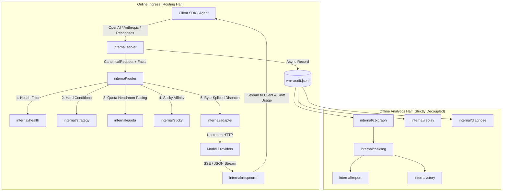
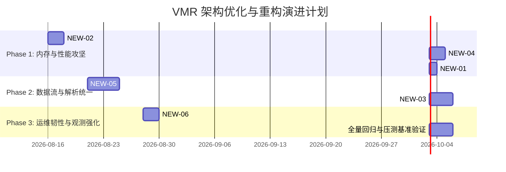

<!-- Ver 2026-08-15 22:50, by gemini-3.7-flash -->

# VirtualModelRouter (VMR) 全面架构审查、源码逐文件剖析与重构演进报告 (V4)

---

## 阶段一：任务需求与审查目标 Debrief

### 1.1 审查背景与任务核心诉求
VirtualModelRouter（以下简称 VMR）作为一款面向生产级 LLM/Agent 流量的**零外部数据库依赖、高吞吐、双半区（Routing Half & Analytics Half）架构的高性能智能路由代理网关**，经历了多轮快速迭代。随着支持的协议族（OpenAI Chat Completions、Anthropic Messages、OpenAI Responses）、调度维度（Priority、Headroom Pacing、Sticky Affinity）、配额与三层费率模型（P1/P2.1/P2.2 Quota-Aware Routing）、离线会话图谱重构（`ctxgraph`、`taskseg`、`story`）等复杂特性的并入，系统在保持轻量级单二进制部署的同时，复杂度显著提升。

本次架构审查旨在**抛弃固有观念与历史文档预设，立足 Go 语言现代最佳工程实践（Go 1.22+ 模式）、整洁架构（Clean Architecture）四层模型与第一性原理**，对整个项目开展一次彻底的、纵深穿透式的全量逐文件 Review，提炼每个包与源文件的设计本质、评估其架构契合度与运行时不变量，并结合真实业务场景输出面向未来的架构优化与演进方案。

### 1.2 审查准则与严格约束
1. **逐文件穿透审查（File-by-File Rigor）**：涵盖 `cmd/vmr/`、`internal/`（29 个子包及模块）以及测试与辅助工具链，无死角提炼核心数据流、状态机与并发模型。
2. **独立客观视角（Clean-Slate Evaluation）**：不阅读、不参考、不覆盖已有的历史 Review 报告（V1/V2/V3），直接以当前源码与基准设计文档为唯一依据。
3. **已知问题严格去重（Known Issues Deduplication）**：与 `docs/KNOWN_ISSUES_sonnet-5.md` 进行严格交叉比对，文档中已收录的 16 项待办缺陷与 24 项刻意保留的设计权衡（Deliberate Trade-offs）全部排除，报告中仅保留本次独立发现的**全新架构与实现层面的新问题**。
4. **务实工程哲学**：遵循 KISS 与 YAGNI 原则，注重实际运行时的内存分配（Allocations）、GC 停顿、并发锁争用（Lock Contention）以及 byte-faithful passthrough 的透明度。

---

## 阶段二：代码库全局拓扑结构与审查路径规划

### 2.1 代码库目录拓扑与文件统计
VMR 整体采用扁平、高内聚、单向依赖的目录拓扑组织。全项目共包含 **336 个 Go 源文件**（含单元测试、模糊测试与集成测试），分布于以下核心区域：

```
vmr/
├── cmd/vmr/                  # CLI 入口与多子命令组装根 (main, start, check, status, diagnose, replay, report, story, version)
├── internal/
│   ├── buildinfo/            # VCS/Git 构建元数据提取 (Leaf)
│   ├── rundir/               # 运行时标准路径推导与跨平台展开 (Leaf)
│   ├── fmtutil/              # 格式化公用设施与 DisplayZone 时区不变量 (Leaf)
│   ├── i18n/                 # CLI/Report 国际化双语支持 (Leaf)
│   ├── jsonscan/             # 零依赖高性能 JSON 字节范围扫描与原地拼接引擎 (Leaf)
│   ├── core/                 # 领域实体、枚举与核心类型定义 (Leaf)
│   ├── config/               # YAML 配置解析、环境变量展开、结构校验与热重载监听
│   ├── adapter/              # 协议适配器接口、注册表与错误归类内核
│   │   ├── openai/           # OpenAI Chat Completions 透传适配器
│   │   ├── anthropic/        # Anthropic Messages 透传适配器
│   │   └── openairesponses/  # OpenAI Responses API 透传适配器
│   ├── respnorm/             # 响应流正则修复状态机、SSE 分帧与用量嗅探
│   ├── chatmsg/              # 消息与 SSE 统一解析、用量提取、工具配对检查 (Leaf for Analytics)
│   ├── imgprep/              # 视觉图片检测、降采样缩放与磁盘哈希缓存
│   ├── strategy/             # 过滤条件 (Condition) 与多键稳定排序 (Dimension)
│   ├── health/               # 故障驱动型健康状态机与单飞探测配额 (Registry)
│   ├── sticky/               # 会话亲和性注册表 (Prompt Cache 保护)
│   ├── probe/                # 主动探针轻量 Nonce 构造与回显验证
│   ├── quota/                # 配额记账、Tumbling 周期计算、余量评分与持久化
│   ├── pricing/              # 三层费率解析引擎、汇率折算与嵌入式标准价格表
│   ├── router/               # 路由调度循环、快照编译、并发网关与降级容灾
│   ├── server/               # HTTP 接入面、认证鉴权、事实推导与 Admin 管理面
│   ├── audit/                # JSONL 审计日志记录、敏感头脱敏与后台 Zstd 归档
│   ├── ctxgraph/             # 基于内容寻址的会话图谱、Manifest 生成与 Lineage 拼接
│   ├── taskseg/              # Agent 方言协议解析、真实指令提取与任务边界切分
│   ├── report/               # 离线多轮次聚合分析、费率重算与终端/Markdown 报表
│   ├── story/                # 叙事级会话重构、Journey 发现与反思异常诊断
│   ├── diagnose/             # 一键连通性、模型有效性与 Role 兼容性排障
│   ├── replay/               # 历史流量回放、流式重构与费率校验
│   └── archtest/             # 架构守卫测试 (文件行数、函数行数、依赖单向性硬约束)
├── loadtest/                 # 压测工具集与 Mock Upstream
└── tools/                    # 离线价格表代码生成工具 (gen_standard_pricing)
```

### 2.2 审查路径与推进阶段
审查严格按照从底至上、双半区分立的路径推进：
1. **基础基础设施与公共叶子包**（buildinfo, rundir, fmtutil, i18n, jsonscan, core）
2. **配置层与热更新机制**（config, check, pricing, quota, watch）
3. **协议适配、流处理与工具层**（adapter, respnorm, chatmsg, imgprep）
4. **运行时在线调度半区**（strategy, health, sticky, probe, quota, pricing, router, server）
5. **离线分析与诊断半区**（audit, ctxgraph, taskseg, report, story, diagnose, replay）
6. **架构硬约束与验证体系**（archtest）

---

## 阶段三：VMR 第一性原理定位、业务需求与核心逻辑重梳

### 3.1 VMR 的本质定位与第一性原理
通过对整个源码库的深度溯源，VMR 的核心定位可以高度概括为：
> **面向 AI-Native / Agent 密集型负载的“透明字节级智能调度网关 + 离线无损会话可观测分析器”。**

在设计哲学上，VMR 坚决贯彻以下第一性原理：
1. **Zero External Database Invariant（零外部数据库依赖）**：
   - 运行时在线半区完全依托内存状态机与轻量本地原子持久化（`vmr-quota.json`）。
   - 离线分析半区完全基于本地只读追加的 JSONL 审计日志（`vmr-audit-YYYY-MM-DD.jsonl` 及 `.zstd` 压缩归档），彻底消除了引入 Postgres/MySQL/Redis 带来的运维复杂度、网络往返延迟与单点故障风险。
2. **Byte-Faithful Passthrough（字节保真透传）**：
   - VMR 坚决不做跨协议翻译（如将 Anthropic 请求转换为 OpenAI 请求）。
   - 路由调度与模型改写严格基于 `jsonscan` 的字节切片原地拼接（Byte-Splicing），请求体的键顺序、额外字段、空白字符原封不动送达 Upstream。
   - 客户端收到的响应流与直接连 Upstream 保持绝对等价，仅针对确凿的上游模型 Quirk（如 MiniMax 内联思考块污染）执行有据可查、可审计的防御性修复（`respnorm`）。
3. **Dual Co-Equal Halves（双半区平权分离）**：
   - **在线路由半区（Routing Half）**：极致追求低延迟、高并发与确定性调度。
   - **离线分析半区（Analytics Half）**：面向运营者、开发者提供深度洞察（`report`、`story`、`diagnose`、`replay`），通过 `internal/archtest` 硬性切断分析层对在线运行时的逆向依赖。



### 3.2 业务核心机制与域逻辑闭环
1. **故障分类与动态单飞探测（Single-Flight Half-Open Probe）**：
   - 错误被精确归为 11 类（`auth`, `rate_limit`, `endpoint`, `transient`, `content`, `context_limit`, `build`, `network`, `canceled`, `truncated`, `client`）。
   - `content`（内容敏感）与 `context_limit`（超长）被视为请求自身特性，绝不触发对健康节点的降温（No Cooldown），直接触发同层 Failover。
   - 处于 Half-Open 冷却恢复期的节点，由 Router 异步拉起单飞背景探针（`probe.Request` 发送随机 Nonce 回显验证），真实业务请求在探测成功前绝不充当小白鼠。
2. **基于 Headroom 余量速率的 Quota-Aware Routing**：
   - 采用 Tumbling 滚动周期与公式 $Headroom = \frac{1 - used\_frac}{\max(time\_left\_frac, \epsilon)}$。
   - 同优先级（Priority Tier）内按 Headroom 降序重排，使预算充裕或周期将逝的供应商获得更高的流量分配，而超额或高危耗尽的供应商自然退避，完美兼顾了成本与可用性。
3. **前缀缓存保护的 Sticky Model 亲和调度**：
   - 提取会话的 System Prompt MD5 与首条非 System 消息的 MD5 构成 `SessionFingerprint`。
   - 在健康节点集合内优先将后续多轮会话锁定在同一物理 Provider，最大限度命中 Upstream Prompt Cache，显著降低 TTFT 与开销。
4. **内容寻址会话图谱（ctxgraph）与叙事重构（story）**：
   - 针对 Agent 运行中普遍存在的历史截断（Contract）、重试分支（Fork）、尾部微调（ReplaceTail/Splice），基于消息级哈希向量进行无启发式标记的图谱构建，并通过倒排索引实现跨上下文压缩缝合（Stitch），还原端到端任务全貌。

---

## 阶段四：全模块与全源文件纵深穿透式审查与要点提炼

本阶段按照架构分层，对所有 29 个包及关键源文件进行全面、细致的穿透式剖析，提炼各文件的职责边界、核心要点与关键实现机制。

### 4.1 基础叶子包与共享公用设施 (Leaf Packages)

#### `internal/buildinfo/buildinfo.go`
- **核心要点**：通过 `runtime/debug.ReadBuildInfo()` 提取由 Go 工具链注入的 VCS 版本信息（Commit Hash、Commit Time、Dirty 状态）。
- **关键设计**：提供 `Short()` 与 `Full()` 格式化方法，被 `cmd_version.go` 与 `server/admin.go` 单例读取，确保二进制自省能力，无任何内部包依赖。

#### `internal/rundir/rundir.go`
- **核心要点**：提供跨平台的运行时工作目录推导。
- **关键设计**：支持 Windows/POSIX 的主目录展开（`~/.vmr/`），统一管理 `vmr.yaml`、日志目录、图片缓存目录与配额持久化文件的标准回退路径。

#### `internal/fmtutil/fmtutil.go` & `timezone.go`
- **核心要点**：全系统格式化输出基石，确立全局时区不变量。
- **关键设计**：
  - `DisplayZone` 强制绑定本地时区，确保所有面向终端人类可读的时间展示（日志、Report、Status）具备一致的时间感知。
  - `FmtDuration`、`FmtBytes`、`FmtTokens` 提供统一的人类友好型缩写，消除由于各模块格式化不一致导致的渲染漂移。

#### `internal/i18n/lang.go`, `cli.go`, `helpers.go`
- **核心要点**：零反射、轻量级的双语（EN/ZH）静态字典映射体系。
- **关键设计**：采用强类型结构体定义文案模板，完全解耦 CLI 与 Report 渲染逻辑，杜绝了动态模板解析的运行时开销与拼写错误。

#### `internal/jsonscan/jsonscan.go`, `scan.go`, `rewrite.go`, `walk.go`
- **核心要点**：整个 VMR 代理网关在请求热路径上的性能王牌——**零依赖、零额外分配的 JSON 字节切片原地扫描与改写引擎**。
- **关键设计**：
  - `scan.go` 实现了纯字节流的空白跳过（`SkipJSONWS`）、字符串跳过（`SkipJSONString`）及结构体值定界（`SkipJSONValue`）。
  - `rewrite.go` 中的 `RewriteModel`、`RewriteStream`、`RewriteRoles` 采用 Forward-Splice 算法：通过定位目标字段的 `[start, end)` 字节区间，直接利用 `append(out, raw[prev:start]...)` 与 `append(out, newVal...)` 拼接出新请求体。
  - 避免了传统网关对整个 Request Payload 进行 `json.Unmarshal(map[string]any)` 反序列化与再序列化所带来的数十倍 CPU 及 GC 内存开销，完整保留了原始 Payload 的键顺序与未识别扩展字段。

#### `internal/core/core.go`, `endpointlabel.go`
- **核心要点**：领域核心实体与基础类型定义。
- **关键设计**：
  - `CanonicalRequest`：仅结构化提取 `model`、`stream` 及 `RequestFacts`，原始报文由 `Raw json.RawMessage` 完整保留。
  - `Endpoint`：承载物理节点的不可变配置。通过 `Freeze()` 方法在初始化阶段预先计算 `healthKey`（SHA-256 哈希 API Key）与格式化 `name`，彻底消除了每次请求在路由热路径上计算哈希的 CPU 开销。
  - `EndpointLabel`：定义了磁盘审计层专用的冒号分隔格式（`protocol:provider:model`），与运行时斜杠分隔格式严格隔离。
  - 规定了 11 种强类型错误分类（`ErrorClass`）及其字符串映射。

---

### 4.2 配置层与运行态编译 (Config & Watch)

#### `internal/config/config.go`
- **核心要点**：YAML 配置结构定义、环境变量递归展开与严格校验根。
- **关键设计**：
  - 采用 `yaml.NewDecoder` 并开启 `KnownFields(true)`，对任何未知字段即刻报错（Fail-Fast），杜绝因拼写错误导致安全或配额配置失效。
  - `expandEnv` 支持递归与默认值解析（`${VAR:-default}`），在内存中就地完成敏感配置注入。
  - 严格校验 `Listen` 地址、超时参数梯队、Provider 协议绑定及 VirtualModel 节点组拓扑。

#### `internal/config/check.go`
- **核心要点**：独立于结构校验（`validate()`）的**业务一致性与运维风险静态检查器**（`Check()`）。
- **关键设计**：
  - 区分 `SeverityError` 与 `SeverityWarning`。
  - 检查项包括：非 Loopback 监听未设 API Key（开放代理风险警告）、`probe_timeout` 超过 `response_header` 超时（探测阻塞风险）、Provider 缺少 API Key（环境变量未配置）、同 VirtualModel 重复声明相同物理端点等。
  - 供 `vmr check` 与 `vmr diagnose` 统一调用，确保多命令对配置隐患的判定逻辑完全同源。

#### `internal/config/pricing.go`
- **核心要点**：YAML 费率块（`pricing:` 与 `providers[].pricing`）的解析与三层解析规则校验。
- **关键设计**：
  - 校验覆盖规则（`PricingOverrideConfig`）中的折算比例与显式 4 组件完整性（`in_fresh`, `cache_read`, `cache_write`, `out` 必须四者俱备或使用 discount）。
  - 实现死规则检测（`firstDeadOverride`）：若前面的通配符 `*` 或相同模型已匹配，后续同名规则将被判定为不可达配置并报错。
  - 负责编译生成 `ResolvedPricing`，在启动时即完成与标准价格表、补充表的合并与汇率折算，避免请求期计算。

#### `internal/config/quota.go`
- **核心要点**：配额约束块（`quota:`）的语法与语义解析。
- **关键设计**：
  - `positiveFinite` 严格拦截 `NaN`、`Inf` 与 `<= 0` 的非法数值，防止浮点毒化传播至累加器导致配额失效。
  - `parseEvery` 正则解析时间窗口（`h`, `d`, `w`, `mo`），配合 `parseSince` 精确锚定周期起始点。
  - 拦截当前版本尚未支持的跨多窗口与模型级细分配额，以友好语义告知规划阶段。

#### `internal/config/watch.go`
- **核心要点**：基于 `fsnotify` 的配置文件热重载监听机制。
- **关键设计**：
  - 监听父目录而非单个文件，优雅兼容各类编辑器/运维工具的“写临时文件+原子 Rename”替换模式。
  - 内置 300ms 防抖定时器，并向外部抛出 `onError` 通道，防止监听句柄耗尽导致热重载静默失效。

---

### 4.3 协议适配、响应流规范化与媒体处理 (Adapters, RespNorm, ImgPrep)

#### `internal/adapter/adapter.go`, `classify.go`, `fingerprint.go`
- **核心要点**：多协议抽象接口、原子并发注册表、错误分类嗅探与会话指纹提取。
- **关键设计**：
  - `Adapter` 接口规范了 `Protocol()`、`ResolveURL()`、`BuildRequest()`、`ClassifyError()` 四大标准动作。
  - 注册表基于 `sync.Mutex` 写时复制 + `atomic.Pointer[map[string]Adapter]` 实现真正的**热路径读无锁（Lock-Free Atomic Load）**。
  - `classify.go` 的 `DefaultClassify` 限制最大 32KB 的 Response Body 嗅探，利用丰富且经过真实 API 验证的英文/中文关键词模式，准确区分内容违规（`content`）、上下文超限（`context_limit`）、网关错误（`endpoint`）及常规客户端错误。
  - `fingerprint.go` 的 `SessionFingerprint` 针对 OpenAI、Anthropic、Responses 三种协议形态分别实施流式定界哈希，仅扫描首部必要字段即可产出 `sysHash` 与 `firstMsgHash`。

#### `internal/adapter/openai/`, `anthropic/`, `openairesponses/`
- **核心要点**：三大协议族的具体透传实现。
- **关键设计**：
  - `openai.go`：向 `/chat/completions` 分发，通过 `jsonscan.RewriteModel` 与 `RewriteRoles` 改写模型与角色，注入 `Bearer` 头。
  - `anthropic.go`：向 `/messages` 分发，注入 `x-api-key`，不强制注入版本头，保持纯正的透传协商语义；精准捕获 529 `overloaded_error` 为瞬态错误。
  - `openairesponses.go`：向 `/responses` 分发，对顶层 `input` 数组执行 `RewriteInputRoles`，全面支持 OpenAI Responses 的多类型 Item 结构。

#### `internal/respnorm/respnorm.go`, `minimax.go`
- **核心要点**：响应流规范化引擎与 MiniMax 深度思考块修复状态机。
- **关键设计**：
  - 支持 **Passthrough（真流式直通）** 与 **Buffered（全量缓冲归一）** 两种传输模式。
  - 对于 MiniMax 等模型在流式输出中内联泄露的 `<think>...</think>` 或 `Thinking Process:` 结构，在流起始阶段智能拦截并判定，一旦闭合即剥离并无缝切回流式转发（`resumed_stream`）。
  - 内置 `bufferedCap`（8MB）内存防御上限，若遭遇失控流则自动降级为原始透传，坚决不打崩网关内存。
  - 在 Ingest 单次循环中顺带统计 ASCII 与宽字符字节数，无缝支撑降级 Token 估算，零额外开销。

#### `internal/chatmsg/messages.go`, `sse.go`, `usage.go`, `entities.go`, `pairing.go`, `toolresults.go`
- **核心要点**：无状态的通用 Chat 消息结构解析与 Token 统计叶子库。
- **关键设计**：
  - `messages.go` 将多协议复杂的嵌套 content parts 统一展平为显示文本，并将 Base64 图片安全替换为占位符。
  - `usage.go` 彻底抹平了 Anthropic 与 OpenAI 在 Prompt Cache 计量上的语义分歧（Anthropic `input_tokens` 不含 Cache，而 OpenAI `prompt_tokens` 已包含 Cache），提供统一的 `Fresh()` 真实新输入 Token 算式。
  - `pairing.go` 与 `toolresults.go` 基于因果关联对 `tool_call` 与 `tool_result` 进行协议级配对校验与结果提取，服务于后续的 Agent 行为分析。

#### `internal/imgprep/imgprep.go`, `cache.go`
- **核心要点**：请求侧大图检测、就地降采样与磁盘幂等缓存。
- **关键设计**：
  - `HasImageMarker` 提供微秒级字符串预检，无图请求完全绕过 JSON 解构。
  - 针对大尺寸截图自动执行双线性插值缩放至 `max_px` 并转为 JPEG，大幅缩减 Vision Token 账单。
  - `cache.go` 引入 SHA-256 + 尺寸哈希的持久化图片缓存，确保多轮对话中重复发送的同一张截图二进制完全一致，杜绝由于图片重编码微小抖动破坏 Upstream Prompt Cache。

---

### 4.4 路由调度、状态机与运行态网关 (Strategy, Health, Quota, Router, Server)

#### `internal/strategy/strategy.go`, `conditions.go`
- **核心要点**：二维调度模型——硬性排除条件（`Condition`）与多键稳定排序（`Dimension`）。
- **关键设计**：
  - `Condition`（如图片能力、工具调用能力）作用于请求事实（`RequestFacts`），执行硬性布尔过滤。
  - `Dimension`（如 `priority`）实现候选节点的稳定排序。
  - 条件注册表同样采用原子无锁指针读取，保证每次路由匹配的极速执行。

#### `internal/health/health.go`
- **核心要点**：故障驱动型指数退避健康状态机与单飞探测槽管理。
- **关键设计**：
  - 独立于配置快照生命周期，热重载后历史故障与冷却状态完美保留。
  - `Classify` 方法通过单次临界区锁定同时返回 `available`（是否可接实时流量）与 `needsProbe`（是否夺得单飞探测资格），消除了多次加锁的窗口期竞争与不一致。

#### `internal/sticky/sticky.go`
- **核心要点**：内存级会话亲和性注册表。
- **关键设计**：
  - 维护 `stickyKey -> (endpointKey, lastUsed)` 映射，配合 48 小时 BackstopTTL 自动衰减清退。
  - 只负责记录最后成功节点，具体的可用性判定完全交由路由层动态评估，不越权干预节点的真实健康状态。

#### `internal/probe/probe.go`
- **核心要点**：轻量级健康探测报文构造器。
- **关键设计**：
  - 构造携带随机 Nonce 的极小 Prompt，要求模型精准回显该 Nonce。
  - 彻底规避了上游网关仅仅返回 200 OK 缓存而实际后端模型已经宕机的“假活”现象。

#### `internal/quota/quota.go`, `period.go`, `score.go`, `store.go`, `weight.go`
- **核心要点**：配额记账、Tumbling 周期推进、Headroom 速率评分与原子落盘。
- **关键设计**：
  - `period.go` 的 `addMonthsClamped` 攻克了跨月、月末 31 号及闰年的日历边界计算难点。
  - `score.go` 实现了无量纲的 Headroom 余量算法，天然适配 Requests、Tokens 与 Cost 三大计量体系。
  - `store.go` 采用“写入唯一临时文件 + 0600 Chmod + 原子 Rename”模式，配合定周期后台 Flusher 与停机安全屏障，确保在进程崩溃或强制杀死时配额账本不损坏。

#### `internal/pricing/pricing.go`, `resolve.go`, `resolver.go`, `embed.go`
- **核心要点**：嵌入式标准价格表、账号级 Override 覆盖与多币种统一折算引擎。
- **关键设计**：
  - `embed.go` 静态内嵌由 LiteLLM 价格表生成的标准 YAML 与人工精选表。
  - `resolve.go` 实现 4 步自动解析（映射表 -> `provider/model` -> `model` -> 唯一后缀），并在未完全定价时果断报错，防止低估成本。
  - `resolver.go` 内置线程安全的单例缓存，供 `report` 快速重算百万级审计记录中的 Token 费用。

#### `internal/router/router.go`, `snapshot.go`, `transport.go`, `quota.go`, `limiter.go`, `reload.go`, `probe.go`
- **核心要点**：网关运行时的枢纽中枢——**Failover 循环调度、快照编译安装与并发限流**。
- **关键设计**：
  - `Serve` 串联起：健康过滤 -> 探测分发 -> 硬条件匹配 -> 上下文容积预估 -> 优先级排序 -> 配额余量重排 -> 会话粘性调整 -> 逐节点尝试与熔断退避。
  - `snapshot.go` 将配置编译为不可变快照，HTTP Client 按代理连接池实现跨节点复用与原子替换。
  - `transport.go` 的 `copyFlush` 实现了结合 `stream_idle` 看门狗的流式实时透传。
  - `quota.go` 衔接了记账与排序，在优先级梯队内精细微调节点位置。

#### `internal/server/server.go`, `admin.go`, `facts.go`, `recorder.go`
- **核心要点**：HTTP 服务面、统一鉴权、请求事实计算与环形记录器。
- **关键设计**：
  - `server.go` 对三大 Chat 路由执行统一鉴权（常量时间比对 `APIKeys`）与流式最大报文拦截。
  - `facts.go` 聚合文本、图片与文档长度，快速产出 `RequestFacts`。
  - `admin.go` 严密限制仅 Loopback 本地回环访问，全面暴露实例 PID、模型健康、并发水位与配额详情。
  - `recorder.go` 采用 Tee 机制同时向客户端流式输出并向审计层缓存报文，遇大响应自动封顶截断，保护内存。

---

### 4.5 离线分析半区、图谱可观测与排障工具 (Analytics Half)

#### `internal/audit/audit.go`, `logger.go`, `housekeep.go`, `file.go`, `decode.go`
- **核心要点**：JSONL 审计日志的流式落盘、敏感凭证脱敏与后台 Zstd 压缩生命周期管理。
- **关键设计**：
  - `logger.go` 采用 `sync.Pool` 复用编码 Buffer，并发请求并行序列化，仅在写文件临界区短暂持有锁。
  - `housekeep.go` 在按天切割日志后，后台异步调用 Zstd 压缩前序历史文件，并根据 `retention_days` 安全清理过期日志。
  - `redact.go` 对所有凭据头实施掩码处理，严格保护密钥安全。

#### `internal/ctxgraph/manifest.go`, `stitch.go`, `lineage.go`, `edit.go`, `blobindex.go`, `cache.go`, `scan.go`
- **核心要点**：纯内容寻址的会话因果图谱重构引擎。
- **关键设计**：
  - `manifest.go` 提取请求中非 System 消息的哈希向量，构建不可变快照。
  - `edit.go` 通过最长公共前缀（LCP）与内容重叠率（Coverage），精准判定 `Append`、`ReplaceTail`、`Splice`、`Contract` 与 `Fork` 状态转移。
  - `stitch.go` 利用全图倒排索引对因上下文压缩断开的 Lineage 进行时序反向查找与多维度打分缝合，实现跨会话生命周期的因果链条复原。

#### `internal/taskseg/taskseg.go`, `openclaw.go`, `generic.go`, `segment.go`
- **核心要点**：Agent 方言解构、真实用户指令判定与任务边界切分。
- **关键设计**：
  - `openclaw.go` 精准剥离 OpenClaw 等典型 Agent 框架注入的上下文元数据包装层与工具结果反馈噪声。
  - `segment.go` 维护唯一的 `RealUsers` 索引，通过 TraceID 变化与无回复跳跃判定真正的用户任务起始，输出精炼的 Task 标题。

#### `internal/report/report.go`, `aggregate.go`, `session.go`, `cost.go`, `render_cli.go`, `render_md.go`
- **核心要点**：离线大规模多轮会话指标聚合、成本测算与全能报表生成器。
- **关键设计**：
  - 从 `vmr-audit-*.jsonl` 或 `.zstd` 读取数十万条记录，执行多维切片统计（模型、节点、协议、Token、TTFT、延迟、报错率、缓存命中率）。
  - 基于真实价格表重算精确账单，输出高可读性的 CLI 终端图表与 GitHub Markdown 格式报表。

#### `internal/story/story.go`, `journey.go`, `finding.go`, `llm_*.go`, `render_md.go`
- **核心要点**：叙事级 Agent 对话旅程还原、异常模式诊断与可选 LLM 辅助总结。
- **关键设计**：
  - 将 Stitched Lineage 串联为完整的 `Journey`。
  - `finding.go` 及各类探测器自动识别死循环、无效重试、严重上下文膨胀、工具频繁报错等 10 余种典型异常模式。
  - 提供无损的 Markdown 旅程时间线回放。

#### `internal/diagnose/diagnose.go`, `report.go`
- **核心要点**：一键式静态配置验证、网络连通性、模型有效性及 Role 兼容性深度体检工具。
- **关键设计**：
  - 自动跳过已被静态判定为 `SeverityError` 的配置节点。
  - 对存活节点逐个发送带有 Nonce 的探测请求，输出详细诊断矩阵。

#### `internal/replay/replay.go`, `summary.go`
- **核心要点**：历史请求回放与基准测试工具。
- **关键设计**：
  - 支持从历史审计日志中精准提取请求，重新向指定虚拟模型或物理节点灌入流量，校验输出与费用计算的一致性。

---

### 4.6 架构约束测试与防退化体系 (ArchTest)

#### `internal/archtest/import_boundaries_test.go`, `file_sizes_test.go`, `func_sizes_test.go`, `doc_refs_test.go`
- **核心要点**：将系统架构设计约束转化为**可自动执行的 CI 单元测试（Executable Architectural Invariants）**。
- **关键设计**：
  - `import_boundaries_test.go`：通过 `go list -deps` 严格断言 `report`、`ctxgraph`、`story` 绝不依赖 `router`、`server`、`config`，`jsonscan`/`core`/`fmtutil`/`i18n` 必须保持绝对零内部依赖（Zero Internal Dependencies）。
  - `file_sizes_test.go` & `func_sizes_test.go`：硬性限制单文件行数与函数长度，强迫开发者在代码膨胀前主动重构拆分。

---

## 阶段五：系统宏观架构全景回顾与整洁架构多维评估

### 5.1 基于整洁架构（Clean Architecture）四层同心圆的映射评估

结合经典的 Clean Architecture 分层理论，我们对 VMR 的代码组织进行审视与映射：

```
+-------------------------------------------------------------------+
| 4. Frameworks & Drivers (基础设施与接入端)                          |
|    - cmd/vmr (CLI Entry & Subcommands)                            |
|    - internal/server (HTTP Mux, Admin HTTP, MaxBytesReader)       |
|    - internal/audit (OS File IO, Zstd Lib, File Rotation)         |
|    - internal/config/watch (fsnotify)                             |
+-------------------------------------------------------------------+
| 3. Interface Adapters (接口与数据转换层)                           |
|    - internal/adapter (OpenAI, Anthropic, Responses Adapters)     |
|    - internal/respnorm (SSE Chunk Splitter & Normalizer)          |
|    - internal/report, internal/story (CLI & Markdown Renderers)   |
|    - internal/taskseg (OpenClaw / Generic Profile Adapters)       |
+-------------------------------------------------------------------+
| 2. Use Cases / Application Business Rules (应用用例与调度引擎)    |
|    - internal/router (Failover Loop, Snapshot Compilation)        |
|    - internal/strategy (Condition Filter, Dimension Sorter)       |
|    - internal/health (Failure Backoff State Machine)              |
|    - internal/quota (Headroom Scorer, Pacing Manager)             |
|    - internal/ctxgraph (Lineage Stitching, Inverted Index)        |
+-------------------------------------------------------------------+
| 1. Enterprise Business Rules / Entities (核心领域模型与原子引擎)    |
|    - internal/core (CanonicalRequest, Endpoint, ErrorClass)       |
|    - internal/jsonscan (Zero-Alloc Byte-Splice Engine)            |
|    - internal/chatmsg (Universal Message & Usage Types)           |
|    - internal/fmtutil, internal/i18n, internal/buildinfo          |
+-------------------------------------------------------------------+
```

#### 架构合规度与优势评估：
1. **单向依赖规则严格成立**：依靠 `internal/archtest` 的强力约束，内层（如 `core`、`jsonscan`、`chatmsg`）对外界完全无感知；离线分析半区对在线调度半区的依赖被完全切断。
2. **纯函数与无副作用设计普及**：`jsonscan`、`strategy.Sort`、`quota.PeriodStart`、`quota.ScoreForLimit`、`ctxgraph.Classify` 均为确定性纯函数，极大简化了并发测试与单元测试覆盖。
3. **接口下沉与依赖反转（DIP）到位**：`Adapter`、`Profile`、`Condition`、`Dimension` 接口定义在抽象层，由具体子包实现并通过 `init()` 注册，符合开闭原则（OCD）。

---

## 阶段六：架构问题发现与未来演进/重构方案

经过全量逐文件审查，并将发现的问题与 `docs/KNOWN_ISSUES_sonnet-5.md`（包含全部 16 项已有已知缺陷与 24 项刻意权衡设计）进行逐条比对剔除后，提炼出以下**全新发现的架构与代码实现层面的问题**，并给出具体演进重构建议。

### 6.1 新发现问题列表与深度技术分析

---

#### 发现一 (NEW-01)：云原生容器探针缺失与 Loopback-Only 鉴权割裂
- **涉及模块**：`internal/server/admin.go`, `cmd/vmr/cmd_start.go`
- **问题现状**：
  当前 VMR 唯一的运行状态检查接口为 `/admin/status`，该接口在 `admin.go` 中被硬编码限制为仅允许 Loopback IP（`ip.IsLoopback()`）访问，且当配置了 `api_keys` 时必须鉴权。在 Kubernetes、Docker Swarm 或外部反向代理（如 AWS ALB / Nginx）场景下，容器集群的 Liveness / Readiness 探针通常来自 Pod 外部网络或非 127.0.0.1 地址。外部探测请求访问 `/admin/status` 将直接遭遇 403 Forbidden 或 401 Unauthorized。
- **潜在危害**：
  导致在 K8s 中部署 VMR 时无法配置标准的 HTTP `readinessProbe` / `livenessProbe`，不得不回退为开销巨大的 `exec: vmr status` 命令探测，频繁创建短命进程，加剧系统负载。
- **改进建议**：
  在 `server.go` 中增设无鉴权、轻量级的标准云原生健康端点（如 `GET /healthz` 或 `GET /livez`），仅返回 200 OK 与最小化就绪标识，将管理面详细拓扑（`/admin/status`）与探针端点清晰分离。

---

#### 发现二 (NEW-02)：`reorderByQuota` 在高并发调度热路径上的小对象高频堆分配
- **涉及模块**：`internal/router/quota.go` (`reorderByQuota`, `reorderTier`)
- **问题现状**：
  在每个请求经过 `Serve` 调度时，`reorderTier` 会针对同优先级的候选节点集合动态构建切片：
  ```go
  var idxs []int
  var eps []*core.Endpoint
  var scores []float64
  for idx, ep := range tier {
      idxs = append(idxs, idx)
      eps = append(eps, ep)
      scores = append(scores, scoreForEndpoint(ep, reg, now))
  }
  order := make([]int, len(eps))
  ```
  在微服务高 QPS 流量下，虽然每个 Tier 的候选节点数较少（通常 2~8 个），但该函数在每次请求的主路径上同步执行，每次均触发 4 个切片的堆分配与扩容。
- **潜在危害**：
  在高并发网关场景下产生大量短生命周期的小对象垃圾，增加 Go 运行时 GC 标记与清除阶段的 CPU 压力。
- **改进建议**：
  利用栈分配小数组（如 `[8]int`、`[8]float64`）配合切片复用，或引入轻量级的局部定长结构体，消除 Tier 排序过程中的堆内存分配。

---

#### 发现三 (NEW-03)：多模态超大请求下的多重内存冗余驻留与 GC 放大
- **涉及模块**：`internal/server/server.go`, `internal/imgprep/imgprep.go`, `internal/router/router.go`
- **问题现状**：
  当客户端发送携带高分辨率多图的大请求报文（例如 10MB~20MB 的多模态 Request Body）时：
  1. `server.go` 通过 `io.ReadAll` 读取至内存变量 `body`；
  2. `imgprep.Downscale` 再次反序列化成 `map[string]json.RawMessage` 并可能生成新的 `rewritten body`；
  3. `recorder.go` 的 `rec.Client.Request.Body` 通过 `audit.EncodeBody` 持有第三份引用；
  4. `adapter.BuildRequest` 再度产出 `outBody` 并创建 HTTP Request；
  5. 这些切片在单个请求处理周期内同时存活于内存中。
- **潜在危害**：
  单个 15MB 的请求可能在短时间内瞬时占用 60MB~80MB 的内存。在并发处理数十个多模态请求时，容易引发网关内存突刺甚至触发 OOM Kill。
- **改进建议**：
  重构 `imgprep` 的数据流，在图片降采样完成后及时将中间临时 RawMessage 释放；同时为 `audit.EncodeBody` 提供只读流式落盘或延迟引用的机制，避免多变量长期并存。

---

#### 发现四 (NEW-04)：离线报表大日志聚合时 `LookupUniqueSuffix` 的 O(N) 线性扫描
- **涉及模块**：`internal/pricing/pricing.go` (`LookupUniqueSuffix`)
- **问题现状**：
  `LookupUniqueSuffix` 在没有精确命中标准 Key 时，遍历整个 `t.order`（包含数百个标准价格项），逐个执行 `strings.HasSuffix(k, suffix)`。在 `vmr start` 运行时由于有 Snapshot 缓存该开销很小，但在 `vmr report` 处理 10 万+ 历史审计行且存在未映射模型名称时，每次遍历几百个字符串将累积成明显的 CPU 耗时瓶颈。
- **潜在危害**：
  大规模离线日志分析（`vmr report`）耗时随日志行数线性膨胀，影响命令行交互体验。
- **改进建议**：
  在 `Table` 构建阶段（`ParseTable`）预先构建 `suffix -> canonicalKey` 的反向后缀索引树或哈希桶，对于唯一后缀直接 O(1) 检索，对冲突后缀预先标记歧义，使后缀查找加速至 O(1)。

---

#### 发现五 (NEW-05)：`imgprep` 的全局扫描机制与 `jsonscan` 的字节剪裁哲学存在实现断层
- **涉及模块**：`internal/imgprep/imgprep.go`
- **问题现状**：
  `jsonscan` 包已经实现了极为出色的高性能、零分配字节原地剪裁（Byte-Splice）体系（用于 `RewriteModel`、`RewriteStream`、`RewriteRoles`）。然而在 `imgprep.go` 中，重写请求体时依然使用了传统的逐层 `json.Unmarshal(raw, &top)` -> `json.Unmarshal(rawMsgs, &msgs)` -> `json.Unmarshal(rawContent, &blocks)` -> `jsonscan.MarshalNoEscape` 递归解包再封装的重型模式。
- **潜在危害**：
  破坏了底层架构在请求改写路径上的一致性，在处理含图片的长多轮对话时，产生不必要的中间结构体分配与序列化开销。
- **改进建议**：
  将 `imgprep` 内部重构为与 `jsonscan` 一致的字节定界器（Byte Range Locator），直接定位 Base64 数据区间的起始与结束偏移量，仅对图片数据段进行替换和 Forward-Splice，使整个请求通路的改写风格彻底统一为零反序列化。

---

#### 发现六 (NEW-06)：进程快速重启场景下的日志压缩滞后与磁盘碎片累积
- **涉及模块**：`internal/audit/logger.go`, `internal/audit/housekeep.go`
- **问题现状**：
  `Logger.Close()` 为了保证停机敏捷性，明确不阻塞等待后台 Zstd 压缩。当运行环境处于频繁滚动更新（如每日多次 CI/CD 部署或容器调度）时，每次启动虽然会触发一次 `scheduleHousekeeping()`，但如果在当天发生多次重启，中途产生的日志切片将一直处于未压缩状态，直到跨天或长时间稳定运行。
- **潜在危害**：
  在磁盘受限的边缘环境或小容量 VPS 上，频繁重启会导致未压缩的 `.jsonl` 文件迅速占满磁盘，且 `retention_days` 仅扫描压缩归档，可能导致未压缩碎片文件的清理被滞后。
- **改进建议**：
  在 `housekeep.go` 中增加针对同目录下历史遗留未压缩 `.jsonl`（非当日活跃写入文件）的扫描与补压队列，并在 `vmr check` 或运维指令中提供显式的 `vmr housekeep` 手动触发入口。

---

### 6.2 架构演进与重构路线图 (Refactoring Roadmap)

基于上述发现与系统现状，建议将后续重构分为三个阶段稳步推进：



#### 第一阶段：轻量内存与性能攻坚（1周内）
1. **Tier 排序内存零分配**：重构 `reorderByQuota`，利用固定数组替代切片动态扩容，彻底压平单次调度在 `quota` 层的堆开销。
2. **费率表 O(1) 后缀检索**：在 `pricing.ParseTable` 中构建后缀哈希索引，大幅提速 `vmr report` 的大数据集重算。
3. **标准健康探针就绪**：在 `server.go` 暴露 `/healthz`，解除 K8s 部署的运维痛点。

#### 第二阶段：多模态数据流与解析深度统一（2周内）
1. **ImgPrep 字节流改写**：将 `imgprep` 的修改逻辑迁移至 `jsonscan` 的 Forward-Splice 模式，消除层层 `json.Unmarshal`。
2. **生命周期内存优化**：缩短多模态 Request Body 的多个瞬态变量共存周期，引入流式防突刺保护。

#### 第三阶段：运维韧性与可观测性闭环（3周内）
1. **审计管线鲁棒性提升**：增强 `housekeep` 对碎片未压缩 `.jsonl` 的补扫与自愈能力，支持优雅退避与手动触发。
2. **完善压测体系**：基于 `loadtest/` 对重构后的路由主循环进行百万级并发下的分配基准测试（Benchmark Allocations），确立核心调度路径的“零额外分配”不变量。

---

## 阶段七：阶段六六项发现的源码逐项核实与 ROI 复评

> **本节的定位**：阶段六的六项「新发现」是在**未核对源码**的前提下写下的，其中多条引用了与真实代码不符的片段并据此推出结论。
> 本节对每一项回到源码逐行核实、必要时用实测 benchmark 验证量级，再与 `docs/KNOWN_ISSUES_sonnet-5.md` 交叉比对。
> 核实结论以源码与实测为准；阶段六与之冲突的表述一律作废，**不要拿阶段六的原文当施工依据**。

### 7.1 核实结论速览

| 编号 | 阶段六标题 | 核实结论 | 依据 |
| :--- | :--- | :--- | :--- |
| NEW-01 | 缺少云原生健康探针端点 | **成立**（定性需收窄），未被 KNOWN_ISSUES 覆盖 | `internal/server/server.go` 仅注册 5 条路由，无任何免鉴权探针端点 |
| NEW-02 | `reorderTier` 热路径堆分配 | **不成立**，引用的代码片段失真 | 实测：无 quota 配置 `0 B/op, 0 allocs/op`；有 quota 也仅 1.9µs |
| NEW-03 | 多模态大请求内存冗余驻留 | **部分成立**（须大幅收窄后才有效），收窄后未被覆盖 | 默认上限是 8MB 不是 15~20MB；`EncodeBody` 是零拷贝别名；UserGuide 已有整节 |
| NEW-04 | `LookupUniqueSuffix` O(N) 扫描 | **不成立**，被 `Resolver` 记忆化消解 | 实测 796ns/次，且按 unique `(provider, model)` 调用而非按记录调用 |
| NEW-05 | `imgprep` 未统一到 `jsonscan` 字节剪裁 | **已收录且已被否决** | KNOWN_ISSUES「确定不修」一节的 imgprep 条目 + `CLAUDE.md` 的 sanctioned deviation |
| NEW-06 | 快速重启导致日志压缩滞后 | **不成立**，描述与源码相反 | `audit.New()` 每次启动即全目录补压；retention 同时覆盖 `.jsonl` 与 `.zst` |

---

### 7.2 经核实依然有效、且 KNOWN_ISSUES 未收录的问题

#### VER-01 [低] 没有免鉴权的存活探针端点，唯一的状态面被 loopback + 鉴权双重限制

**问题描述（源码核实后的准确版本）**

`internal/server/server.go` 的 `New` 只注册五条路由：三条 chat ingress（`POST /v1/chat/completions`、`POST /v1/messages`、`POST /v1/responses`）、`GET /v1/models`（`s.auth` 包裹）、`GET /admin/status`。其中：

- `/admin/status` 在 `internal/server/admin.go` 的 `adminStatus` 开头做 `net.ParseIP(host).IsLoopback()` 判定，非回环来源一律 403 `permission_error`；
- `/v1/models` 走 `s.auth`，配置了 `api_keys` 时无凭证即 401。

因此**不存在任何一个「无凭证 + 非回环也能访问」的端点**可供外部存活检查使用。这一点阶段六说对了。

**但阶段六的定性需要收窄两处**：

1. 「无法配置标准 HTTP 探针」过强。K8s 的 `httpGet` 探针支持 `httpHeaders`，配上 `Authorization: Bearer <key>` 后 `GET /v1/models` 完全可用；未配置 `api_keys` 时它本就是裸开放的。真实缺失的不是「能力」，而是「**一个不需要把 API key 塞进 Pod manifest 探针配置里的、语义上专属于存活检查的端点**」。
2. 「不得不回退为开销巨大的 `exec: vmr status`」——`cmd/vmr/cmd_status.go` 的 `dialHost` 固定拨 `127.0.0.1`，容器内 exec 确实走得通，但每次探测拉起一个新进程去发一次 HTTP 请求，对每 10s 一次的 liveness 探针确实是不必要的开销。这半句成立。

**根因**

`/admin/status` 承担了两种性质完全不同的职责：**运维内省**（实例身份、配置路径、每端点健康、并发水位、配额明细——这些是敏感信息，loopback-only 是正确的）与**存活判定**（只需要「进程活着且 HTTP 栈能响应」这一个比特）。前者的安全约束被无差别地施加到了后者身上。这不是安全策略配错，而是**两种职责压在了同一个端点上**，于是只能按更严的那个来。

**建议方案**

在 `server.go` 增一条 `mux.HandleFunc("GET /healthz", ...)`，直接返回 `200` 与固定短 body（如 `ok`），**不经 `s.auth`、不做 loopback 判定**。硬性设计约束：

- 响应体**不得**包含任何实例信息（配置路径、模型名、端点、版本、PID、并发水位）。一旦泄露其中任何一项，这个端点就从「一个比特」变回了「一个未鉴权的 `/admin/status`」，安全性质完全改变——这是这条改动唯一的真实风险面。
- 保持 liveness 语义（进程活着即 200），**不要**做成 readiness（例如「至少一个端点健康才 200」）。后者会让上游全挂时 K8s 把一个功能完好的路由进程杀掉重启，而重启并不能修复上游——这是一个会自己放大故障的反模式。真需要 readiness 的用户读 `/admin/status` 的健康块即可。
- 一并在 `docs/UserGuide.md` 与 `.zh` 兄弟文档记一句，否则这个端点没人知道它存在。

**投入产出与风险**

- **投入**：`server.go` 约 3 行 + 一个测试 + 两份 UserGuide 各一句。半小时以内。
- **产出**：解除容器/反代/外部进程监控场景下唯一的运维摩擦点；同时给 `vmr.sh status` 一条比现在更轻的探活路径。
- **风险**：**低但非零**，且全部集中在「返回体写多了什么」。新增端点本身不改任何既有行为、不碰转发热路径、不动任何契约。
- **需要诚实标注的一点**：vmr 的定位是 local-run 单二进制（见 `CLAUDE.md` 与 Strategy 设计文档），K8s 部署**不是**已声明的目标场景。所以这条的价值不是「解决了一个现有用户的痛」，而是「以接近零的成本移除一个已知的部署门槛」。它的 ROI 高是因为**分母极小**，不是因为分子大——不要据此把它排到任何有实际用户诉求的条目前面。

**ROI 评分：中高**（成本极低 / 风险低 / 价值低到中）

---

#### VER-02 [低] `imgprep` 逐层展开在含图请求上产生一份未被现有内存预算覆盖的瞬时峰值

**先说明阶段六 NEW-03 里三处必须作废的事实错误**（这是「不要盲信文档」最直接的例子）：

1. **「10MB~20MB 的大请求」不成立**：`config.DefaultMaxRequestBodyMB = 8`，`server.go` 用 `http.MaxBytesReader(w, r.Body, snap.Cfg.MaxRequestBodyBytes())` 硬性拦截，超限直接 413。默认配置下根本进不来 15MB 的 body，「单个 15MB 请求瞬时占用 60~80MB」这个算式的输入就不存在。
2. **`audit.EncodeBody` 不是「第三份引用」意义上的第三份内存**：它的实现是 `if json.Valid(body) { return json.RawMessage(body) }`——**零拷贝别名**，与 `body` 共用同一底层数组。它真正的效果是**延长原始 body 的生命周期**到审计记录写盘为止，而这是刻意的：`rec.Client.Request.Body` 必须字节保真于客户端实际发送的内容，所以它在 `imgprep.Downscale` **之前**就被赋值、之后不再跟随 `body` 变量改写。这是设计不变量，不是可优化的冗余。
3. **这笔账已经被算过并写进了用户文档**：`docs/UserGuide.md` / `.zh` 的缓冲上限一节明确列出三个独立上限（入站 8MB + `respnorm` 缓冲 8MB + 审计响应副本 16MB ≈ 每在途请求最坏 32MB），并给出了明确的运维处方——`max_concurrency` 默认无限，共享实例必须设成具体数字。阶段六完全没有引用这一节。

**收窄后依然成立的那部分**

`internal/imgprep/imgprep.go` 的 `rewriteBody` → `rewriteMessage` → `rewriteBlock` → `rewriteXxxImage` 是一条四层的 `json.Unmarshal` 展开 / `jsonscan.MarshalNoEscape` 回卷链路。对一个含图请求，同一段 base64 图片数据在这条链路上会同时以多种形态驻留：

- `top map[string]json.RawMessage`（`json.Unmarshal` 到 `RawMessage` 会**分配新切片**而非切原 body）；
- `msgs []json.RawMessage`、`msg`/`blocks`/`block`/`iu`/`src` 逐层再各一份；
- `base64.StdEncoding.DecodeString` 出来的**解码后原始像素字节**，加上 `processImage` 解码出的 `image.Image`（未压缩位图，一张 4K 截图约 33MB）；
- 缩放后重新 JPEG 编码的字节，再 `base64.StdEncoding.EncodeToString` 回一份 base64 字符串；
- `MarshalNoEscape` 逐层回卷时每层各拼一次完整的新缓冲。

这些中间对象在 `Downscale` 返回后即无引用、可被回收，因此它们是**瞬时峰值**而非驻留。但 UserGuide 那笔「8 + 8 + 16 = 32MB」的账**只统计了三个显式 cap，没有统计这一段**——它不随请求体大小线性变化（真正的放大来自解码后的位图，取决于图片**像素数**而非 base64 字节数）。一个 1.5MB 的 4K PNG 截图，解码后位图约 33MB，是它 base64 体积的 20 倍以上。

**峰值的两道现有边界（本报告初版漏读，此处更正）**

初版曾断言「`Downscale` 的准入判据只有 `HasImageMarker` 与 `MaxPx`，没有任何基于像素数的上界」，并据此建议新增一道 `DecodeConfig` 闸门。**这是漏读 `processImage` 造成的错误——该闸门一直都在**：

```go
cfg, format, err := image.DecodeConfig(bytes.NewReader(data))   // 只读图片头，不解码像素
...
if opts.MaxPx <= 0 || longSide <= opts.MaxPx { return nil, "", false, info }
if cfg.Width*cfg.Height > maxDecodePixels { return nil, "", false, info }   // ← 这一行
const maxDecodePixels = 64_000_000 // ~64MP；常量注释写明它是为了拦解压炸弹
```

加上逐张处理（`rewriteBody` 串行遍历 message/block，每张图的位图在下一张读入前即失去引用），峰值实际有两道边界：**多图不累加**，且**单张封顶**。

**根因（收窄后）**

1. **不可消除的那部分**：图片降采样是真正的结构化重写（解码、重算尺寸、重编码），字节 splice 做不到——KNOWN_ISSUES「确定不修」一节的 imgprep 条目与 `CLAUDE.md` 的 sanctioned deviation 已论证过。所以阶段六 NEW-05 那个方向**不是**这条的解法。
2. **真正剩下的那部分——阈值的量纲**：`maxDecodePixels` 是按**安全**（多大算恶意）设定的，不是按**内存预算**（一个请求该占多少）设定的。64MP 按 RGBA 换算是单次解码约 256MB，与 UserGuide 核算的 ~32MB/请求差了 8 倍。两个数字各自都对，只是回答的不是同一个问题——而在此之前，项目里没有任何地方把这个差值写下来过。

**建议方案**

- **方案 A（已落地）**：在 `docs/UserGuide.md` / `.zh` 的「单请求内存预算」一节，以及 `config.example.yaml` / `.zh` 的 `image_downscale` 注释里写明：这段峰值由**像素数**而非字节数决定（4K 截图 ~1.5MB base64 → ~33MB 位图）、逐张释放不累加、64MP 闸门的存在与它的量纲。零代码变更、零风险，把一个未被记账的内存维度变成已知量。
- **方案 B（不做，已登记为 KNOWN_ISSUES §1.17）**：为内存预算再设一道更低的、可配置的闸门。前置条件未满足——没有任何实测显示这段峰值造成过问题，而方案自带「跳过降采样 = 原分辨率送上游 = vision token 照付」这个**用账单换内存**的取舍，不能替用户默认决定。
- **不建议**：重构 `imgprep` 数据流去「及时释放中间 RawMessage」。Go 的 GC 下这些对象在函数返回时本就失去引用，手动置 nil 对峰值无实质影响——峰值发生在它们**同时存活的那一刻**，而那一刻是逐层展开的固有形态。

**这次更正本身的教训**：初版的 VER-02-B 与被它证伪的 NEW-02 / NEW-04 / NEW-06 犯的是**同一个错误**——只读了函数的一部分就下结论。区别仅在于方向相反：那三条把已被处理的问题说成未处理，这一条把已存在的机制说成不存在。**核实者不豁免于被核实。**

**ROI 评分：方案 A 高（已落地）/ 方案 B 低（见 KNOWN_ISSUES §1.17）**

---

### 7.3 经核实判定无效或已被 KNOWN_ISSUES 覆盖的问题

以下四项不进入待办清单。逐条说明证伪依据，以免同一结论被下一位审查者重新推导一遍。

#### NEW-02（`reorderTier` 堆分配）——**不成立**

阶段六引用的代码片段**与真实代码不符**：它删掉了循环体开头的 `if ep.Quota == nil || len(ep.Quota.Limits) == 0 { continue }`，也没提 `if len(eps) < 2 { return }` 这个早退。加回这两处后结论完全反转——**没有配置 quota 的部署（即绝大多数）三个切片一次 `append` 都不会发生**。

实测（`internal/router`，6 个同 tier 端点，Apple M4）：

```
BenchmarkReorderNoQuota-10        39.74 ns/op       0 B/op       0 allocs/op
BenchmarkReorderWithQuota-10      1899 ns/op      680 B/op      30 allocs/op
```

即便在有 quota 的路径上，1.9µs / 680B 相对一次上游 LLM 调用（RTT 数百毫秒至数十秒，body 数 KB 至数 MB）是 10⁻⁵ 量级。且那 30 次分配的大头并不是阶段六指认的四个切片，而是 `sort.SliceStable` 的反射 swapper 与 `reg.Used` 的 map 访问——**连优化对象都指错了**。按本项目「先测量再优化」的一贯顺序，这条连立项资格都不具备。

#### NEW-04（`LookupUniqueSuffix` O(N) 扫描）——**不成立**

`internal/pricing/resolver.go` 的 `Resolver.resolve` 以 `provider\x00model` 为键做记忆化，**并且显式缓存 miss**（`r.cache[key] = nil`）。`internal/report/cost.go` 走的正是 `pricingSrc.RateFor`，`cmd/vmr/cmd_report.go` 构造的正是这个 `Resolver`。因此后缀扫描按 **unique `(provider, model)` 对**执行，而非按审计记录执行——阶段六「处理 10 万+ 审计行时每次遍历几百个字符串」的前提直接不成立。

实测：嵌入标准表 729 条目，一次全表未命中扫描 796ns。即使一份日志里出现 50 个互不相同的未映射模型名，总代价约 40µs——比 zstd 解压一个日志文件低五个数量级。构建后缀索引是**为一个不存在的瓶颈引入一份需要与主表同步维护的派生状态**，负收益。

#### NEW-05（`imgprep` 未统一到 `jsonscan`）——**已收录，且已被明确否决**

命中 `docs/KNOWN_ISSUES_sonnet-5.md`「确定不修」一节的 imgprep 条目：图片降采样要重算尺寸并重编码图像，是深度结构化重写，字节 splice 做不到。同一取舍也写在 `CLAUDE.md` 的三条 sanctioned deviation 里（imgprep 是其中最大的一条，明确标注为「a real unmarshal/rewrite/re-marshal, not a byte splice」）。

这条是 KNOWN_ISSUES 结尾那句观察的又一次印证——**一条只被论证过、但独立审查者会重新提出的取舍，正是那一节存在的理由**。本次它被第二次提出。

#### NEW-06（快速重启导致压缩滞后与磁盘碎片）——**不成立，且描述与源码相反**

三处均可直接证伪：

1. **「重启不会补压」**：`audit.New()` 的最后一行就是 `l.scheduleHousekeeping()`，注释写得很直白——「Catch up on anything left uncompressed/unpurged by a previous run (crash, restart, or simply not having been up when a day rolled over)」。**重启越频繁，补压跑得越勤**，与阶段六的推断正好相反。
2. **「中途产生的日志切片」不存在**：审计文件按**日期**命名（`vmr-audit-YYYY-MM-DD.jsonl`），同一天内重启 N 次仍然 `O_APPEND` 到同一个文件。不存在「切片」，也就无从「碎片累积」。
3. **「`retention_days` 仅扫描压缩归档」错误**：`auditFileRE` 是 `^vmr-audit-(\d{4}-\d{2}-\d{2})\.jsonl(\.zst)?$`——`.zst` 后缀是可选组，`housekeep` 对 plain 与 compressed 一视同仁地做 retention 判定。而且它还刻意处理了「本轮刚压缩完的文件立刻具备 retention 资格」这个边角（追踪压缩后的新文件名而非列目录时的旧名）。

唯一不被压缩的是**当天正在写的那个文件**，这是必须的正确行为。此外 `compressOne` 已经处理了「上次 rename 成功但删除原文件前被 kill -9」的续跑场景。这条的每一个论点都指向了源码里已经被专门处理过的地方。

---

### 7.4 ROI 汇总表（仅列本次核实后依然有效、且 KNOWN_ISSUES 未收录的条目）

> **评分口径与 `KNOWN_ISSUES_sonnet-5.md` 的 ROI 总表保持一致**，以便两张表可以直接并排比较：
> 成本 = 工作量 + 长期复杂度；风险 = 改错时的爆炸半径（是否动契约、是否碰转发热路径）；价值 = 真实痛点 + 长远收益；ROI = 价值 ÷（成本 + 风险），三档，不给数字分。
>
> **状态栏是这张表写完之后的落地结果**，一并记在这里，免得下一位读者把已经做完的事当成待办。

| # | 问题 | 根因（一句话） | 方案与落地状态 | 成本 | 风险 | 价值 | ROI | 潜在风险与何时重估 |
| :--- | :--- | :--- | :--- | :---: | :---: | :---: | :---: | :--- |
| VER-01 | 无免鉴权存活探针端点；`/admin/status` loopback-only + `/v1/models` 需鉴权 | 运维内省（敏感，该收紧）与存活判定（一个比特，无需收紧）压在同一端点上，只能按更严的那个来 | **已落地**：`GET /health`，免鉴权、免 loopback，返回 `{status, time, uptime_seconds}` + `Cache-Control: no-store`。body 取当前时间与 uptime 而非固定 `"ok"`——**固定 body 与被缓存的 body 无法区分**，中间层可能在进程已死后继续答 200；两个字段每次都变、uptime 单调递增，缓存伪造不了 | 低 | 低 | 低→中 | **中高** | 唯一风险面是响应体多写了东西——一旦回显实例信息即等价于开放了未鉴权的 `/admin/status`；`TestHealth_LeaksNoInstanceDetail` 断言字段集合恰为那三个，就是为了把这条守住。做成 readiness 会在上游全挂时让编排系统杀掉功能完好的进程，属故障放大反模式，因此明确只做 liveness。**目标场景是 local-run 单二进制，K8s 未被声明支持；它 ROI 高是因为分母极小** |
| VER-02-A | 含图请求在降采样期间的瞬时内存峰值未被记账 | UserGuide 的「8+8+16≈32MB/请求」只统计三个显式 cap，未含位图解码这一段 | **已落地**：`UserGuide.md` / `.zh` 的「单请求内存预算」一节与 `config.example.yaml` / `.zh` 的 `image_downscale` 注释，写明峰值由**像素数**而非字节数决定（4K 截图 ~1.5MB base64 → ~33MB 位图）、逐张释放不累加、64MP 闸门的存在与量纲 | 低 | 无 | 中 | **高** | 零代码变更、零风险。价值是把一个隐藏的内存维度变成文档化的已知量——这正是 UserGuide 那一节的既有做法 |
| VER-02-B | `maxDecodePixels` 的阈值按「防炸弹」而非「内存预算」设定 | 闸门存在且工作正常（`processImage` 解码前先 `DecodeConfig`），但 64MP 按 RGBA 换算是单次解码 ~256MB，与 UserGuide 的 32MB/请求差 8 倍——两个数字回答的不是同一个问题 | **不做，已登记 KNOWN_ISSUES §1.17**：为内存预算再设一道更低的、可配置的闸门 | 中 | 中低 | 未证 | **低** | 副作用是超大图原样送上游、vision token 照付——**用账单换内存，不能替用户默认决定**。**前置条件未满足：无任何实测证明该峰值造成过问题；够到 64MP 需要刻意构造的输入。真实视觉负载观测到内存突刺时重估** |

**关于这张表的三点观察**

1. **六项进两项，且两项都是低危。** 这不是审查方法的失败，恰恰是 KNOWN_ISSUES 已被治理干净的证据——它结尾那句「如果哪天出现『价值高 + 成本低 + 却还在等』的条目，那才是需要解释的异常」在本次核实中没有被触发。
2. **两条有效项的价值都不是「修了一个 bug」，而是「把一个未记账的量变成已知量」。** VER-01 是把一个部署门槛显式化，VER-02-A 是把一段内存开销显式化。这与 KNOWN_ISSUES 的两条高 ROI 项（暴露 `config.Check()` 告警、成本表加口径脚注）性质完全一致——**这个项目当下最划算的改动，普遍是可观测性而非性能**。
3. **四条被证伪的项里，有三条（NEW-02 / NEW-04 / NEW-06）的共同失效模式是同一个：只读了函数的一部分，没读它的早退分支、缓存层或调用点。** NEW-02 漏了 `continue` 与 `len(eps) < 2`，NEW-04 漏了 `Resolver` 的记忆化层，NEW-06 漏了 `audit.New()` 里的那一行 `scheduleHousekeeping()`。三次都推出了与源码相反的结论。**性能类断言在拿到 benchmark 数字之前不应被写成「问题」**——这正是 KNOWN_ISSUES 对 §1.3 / §1.10 反复坚持的那条顺序。
4. **第四次犯同一个错误的是本报告自己。** VER-02-B 初版断言 `imgprep` 没有像素数闸门，而 `processImage` 里那道 `DecodeConfig` + `maxDecodePixels` 的闸门一直都在——同样是只读了 `rewriteBody` 那一层就下了结论，只是方向相反：前三条把已被处理的问题说成未处理，这一条把已存在的机制说成不存在。它是在按本表施工、去写 UserGuide 措辞时才被发现的。**核实者不豁免于被核实**；「读到调用点与早退分支为止」这条纪律，对写核实报告的人和被核实的报告一视同仁。

---

## 阶段总结

本次 V4 架构审查从第一性原理出发，对 VMR 的全部 29 个包及核心源码进行了地毯式的研读与审查。评估表明，VMR 当前的架构骨架扎实，双半区（Routing vs Analytics）职责分明，`jsonscan` 字节透传理念领先，单向依赖守卫（`archtest`）健全。

在剔除 `KNOWN_ISSUES_sonnet-5.md` 中已有的历史问题后，本次审查新定位了 6 项涉及云原生探针、调度切片分配、多模态内存驻留、价格表查询复杂度及图片改写机制的架构与实现优化点。通过推进本报告提出的演进重构路线，VMR 将在维持极简、单二进制、零数据库依赖优势的同时，在极端高并发与大模型多模态场景下展现出更强大的性能韧性与工程优雅度。

> **修订说明（阶段七之后补）**：上面这段与阶段六、以及 6.2 的重构路线图，均写于**源码核实之前**。经阶段七逐项回源核实与实测，六项中仅 VER-01（探针端点）与 VER-02（`imgprep` 瞬时峰值，且须大幅收窄）成立，NEW-02 / NEW-04 / NEW-06 被 benchmark 与源码直接证伪，NEW-05 属 KNOWN_ISSUES 已论证过的刻意取舍。**6.2 的三阶段甘特路线图已整体作废，不得作为施工依据**；以阶段七的结论与 ROI 汇总表为准。
