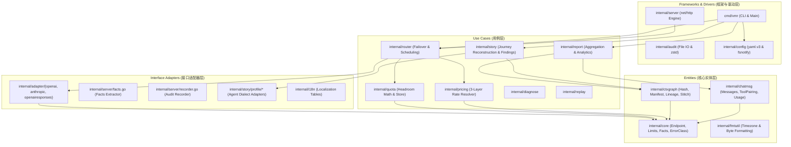
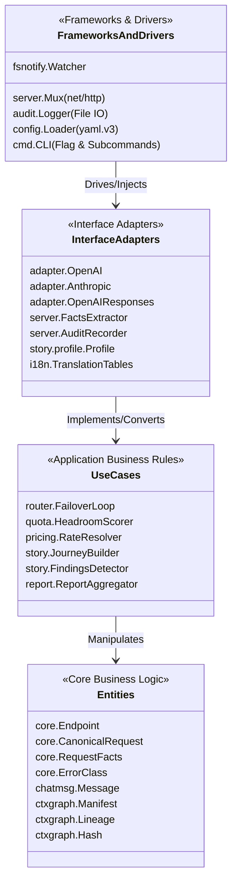
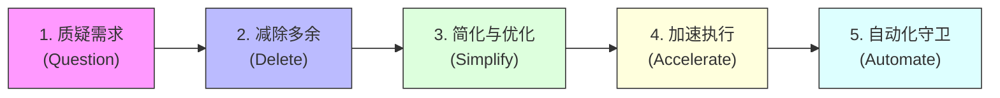
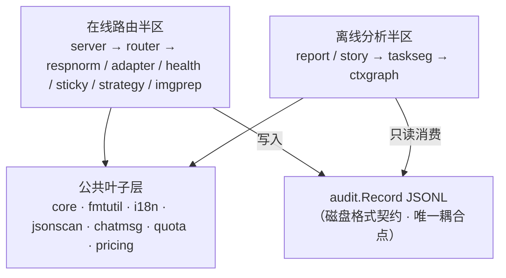
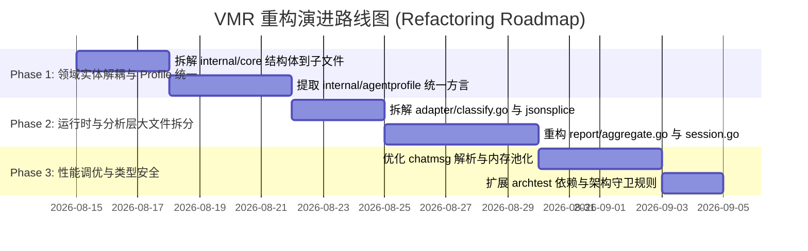
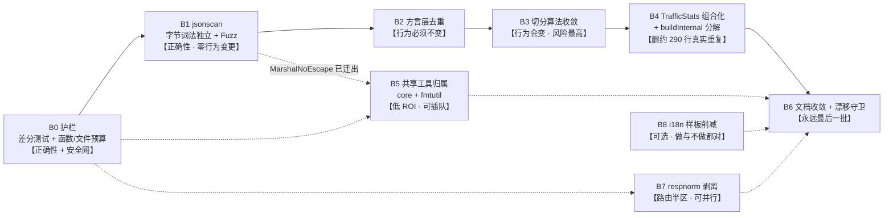

<!-- Ver 2026-08-14 17:45, by gemini-3.7-flash -->

# VirtualModelRouter (VMR) 架构深度审查与彻底重构方案

> **文档定位**：本文档基于资深 Go 语言架构师视角与整洁架构（Clean Architecture）规范，抛弃历史实现惯性，以第一性原理对 VMR 代码库进行全量、深度、逐文件的地毯式 Review，并输出系统性的架构评估与下一代重构演进蓝图。

> **【opus-5 复审说明 · 2026-08-14】**
> 本文档的 Part 1–4 为 gemini-3.7-flash 原始产出，未作改动。**Part 5/6/7 的每一项下方新增了 `【opus-5 复审】` 批注块**，逐条评估「问题是否成立」与「方案是否最优」，所有结论均已回源码核实（不采信原文 claim）。原文中的事实错误一律保留原样、在批注中指出，以保留证据链。
> 文末新增 **Part 8**：以 ROI 视角对「原文中成立的问题 + 本轮新发现的问题」统一分批，作为后续重构的施工蓝图。
>
> **批注 emoji 语义**：
> | Emoji | 含义 |
> | :--- | :--- |
> | ✅ | 问题成立，且原文方案可直接采纳 |
> | 🟡 | 问题成立，但方案需修正 —— 批注给出替代方案 |
> | ❌ | 问题不成立 / 存在事实错误 —— 批注给出源码证据 |
> | ⚠️ | 部分成立，或成立但隐含未言明的前提与风险 |
> | 🔵 | 成立但优先级被高估，可延后甚至长期不做 |
> | 🆕 | 由该项延伸出的、原文未识别的新发现 |
>
> **本轮复审的基线**（2026-08-14，`main` @ `ae5e7db`）：`go vet ./...` 与 `go test ./...` 全绿；164 个生产 Go 文件 / 151 个测试文件，与原文统计一致。

---

## 目录 (Table of Contents)

- [Part 1: 任务 Debrief 与审查目标对齐](#part-1-任务-debrief-与审查目标对齐)
- [Part 2: 审查全景与工程状态统计](#part-2-审查全景与工程状态统计)
- [Part 3: VMR 核心定位与功能需求的第一性原理审视](#part-3-vmr-核心定位与功能需求的第一性原理审视)
- [Part 4: 全项目逐模块、逐文件深度 Review 记录](#part-4-全项目逐模块逐文件深度-review-记录)
  - [Layer 0: 核心实体与无依赖底层基础设施](#layer-0-核心实体与无依赖底层基础设施)
  - [Layer 1: 协议解析与上下文图谱引擎](#layer-1-协议解析与上下文图谱引擎)
  - [Layer 2: 协议适配器与调度策略](#layer-2-协议适配器与调度策略)
  - [Layer 3: 运行时基础设施与探活亲和](#layer-3-运行时基础设施与探活亲和)
  - [Layer 4: 额度感知路由与定价计费引擎](#layer-4-额度感知路由与定价计费引擎)
  - [Layer 5: 审计日志与生命周期管理](#layer-5-审计日志与生命周期管理)
  - [Layer 6: 配置管理与热重载系统](#layer-6-配置管理与热重载系统)
  - [Layer 7: 路由核心与响应流式正规化](#layer-7-路由核心与响应流式正规化)
  - [Layer 8: HTTP 接入层与管理面](#layer-8-http-接入层与管理面)
  - [Layer 9: 分析聚合与叙事挖掘引擎](#layer-9-分析聚合与叙事挖掘引擎)
  - [Layer 10: 命令行工具、诊断与重放](#layer-10-命令行工具诊断与重放)
  - [Layer 11: 架构边界守卫与负载测试](#layer-11-架构边界守卫与负载测试)
- [Part 5: 整体架构全景评估与 Clean Architecture 映射分析](#part-5-整体架构全景评估与-clean-architecture-映射分析)
  - [5.1 Clean Architecture 四层同心圆映射](#51-clean-architecture-四层同心圆映射)
  - [5.2 依赖单向规则（The Dependency Rule）合规性评估](#52-依赖单向规则the-dependency-rule合规性评估)
  - [5.3 马斯克五步工作法审计（Musk's 5-Step Process）](#53-马斯克五步工作法审计musks-5-step-process)
- [Part 6: 架构异味识别与面向未来的重构演进方案](#part-6-架构异味识别与面向未来的重构演进方案)
  - [6.1 核心架构异味（Architectural Smells）识别](#61-核心架构异味architectural-smells识别)
  - [6.2 宏观架构演进目标（Target Architecture）](#62-宏观架构演进目标target-architecture)
  - [6.3 关键微观重构与设计模式改进方案](#63-关键微观重构与设计模式改进方案)
  - [6.4 分阶段重构演进路线图（Roadmap）](#64-分阶段重构演进路线图roadmap)
- [Part 7: 总结与行动建议](#part-7-总结与行动建议)
- [Part 7.5: 第二轮反馈复审 —— 重复代码与 Domain 划分专项（opus-5 新增）](#part-75-第二轮反馈复审--重复代码与-domain-划分专项opus-5-新增)
- [Part 8: ROI 视角的问题清单与重构分批蓝图（opus-5 新增）](#part-8-roi-视角的问题清单与重构分批蓝图opus-5-新增)

---

## Part 1: 任务 Debrief 与审查目标对齐

### 1.1 审查背景
VMR (VirtualModelRouter) 经过持续迭代，已经具备了高性能协议透传路由、Quota-Aware 额度配速感知调度、基于内容寻址的离线上下文图谱分析（`ctxgraph`）、会话叙事还原（`story`）以及详尽的离线聚合报告（`report`）。系统在无外部数据库、单二进制部署、字节级零拷贝转发方面积累了显著的技术优势。

随着系统规模扩大至 315 个 Go 文件、25 个内部模块，项目出现了**领域逻辑分散**、**部分文件逼近千行上限**、**Agent 方言知识侵入核心分析层**、**反射与弱类型断言带来 GC 压力**等架构老化特征。

### 1.2 审查方法论
1. **第一性原理思考（First Principles Thinking）**：抛弃现有文档的既定结论，重新审视“为什么需要透传路由”、“为什么需要离线分析”、“调度与分析的最小边界是什么”。
2. **整洁架构规范（Clean Architecture）**：依据 Robert C. Martin 的同心圆分层理论，使用严格术语（`Entities`、`Use Cases`、`Interface Adapters`、`Frameworks & Drivers`）检验依赖反转与关注点分离。
3. **马斯克五步工作法（Musk's 5 Steps）**：
   - 质疑每一项需求（Question every requirement）
   - 减除不必要的模块与逻辑（Delete parts/process）
   - 简化与优化（Simplify & optimize）
   - 加速迭代与执行（Accelerate cycle time）
   - 自动化守卫（Automate）
4. **地毯式逐文件审查**：覆盖全部生产与测试代码，识别设计亮点、潜在缺陷与性能优化点。

---

## Part 2: 审查全景与工程状态统计

### 2.1 代码库规模拓扑
- **Go 源代码文件总数**：315 个（164 个 Production Go 文件，151 个 Test Go 文件）
- **主要模块分布**：`cmd/vmr/`、25 个 `internal/` 包、`tools/`、`loadtest/`
- **自动化测试状态**：`go test ./...` 100% 全绿通过（包含 `internal/archtest` 导入边界测试与文件行数预算校验）。

### 2.2 模块依赖与分层拓扑



---

## Part 3: VMR 核心定位与功能需求的第一性原理审视

### 3.1 VMR 的本质定位：Plug Adapter vs Voltage Transformer
传统 LLM Gateway（如 LiteLLM、One-API）的本质是“**电压转换器（Voltage Transformer）**”——试图将所有上游厂商的异构 API 转换为单一的标准 OpenAI 协议。
- **痛点**：跨协议翻译不可避免地损失厂商高级特性（如 Anthropic Prompt Caching、Thinking Blocks、Tool Call 专有字段、SSE 细粒度事件）。任何新特性发布都会造成网关阻断。
- **VMR 的第一性原理**：VMR 是“**多头插座转换器（Plug Adapter）**”。
  1. **永不跨协议翻译**：OpenAI 入口只接 OpenAI-compatible 上游，Anthropic 入口只接 Anthropic-compatible 上游，Responses 入口只接 Responses 上游。
  2. **字节级透传改写（Byte-level Splicing）**：仅定位并改写顶层 `model`、`stream` 或 `role` 字段，其余字节（包含未经识别的未知参数）原封不动放行。
  3. **极致轻量与高可用**：无外置 DB 依赖、无 Web 前端捆绑、零启动延迟、支持实时热重载。

### 3.2 两大对等半区的解耦哲学
VMR 在架构上清晰划分为两大半区：
1. **在线路由核心（Routing Runtime）**：极度追求低延迟、零内存逃逸与故障自愈，只负责请求分发与最小化审计记录落地。
2. **离线分析与叙事引擎（Analytics & Story）**：负责海量审计日志的结构挖掘、Git 式上下文图谱构建、Agent 会话推演与费用可视化。
3. **单向解耦点**：两大半区**仅通过 `audit.Record` JSONL 文件解耦**。分析层绝对不引用路由层的运行时内存状态，路由层也绝不依赖分析层的任何算法。

---

## Part 4: 全项目逐模块、逐文件深度 Review 记录

### Layer 0: 核心实体与无依赖底层基础设施

#### 1. [`internal/core/core.go`](file:///Users/stanford/code/vmr/internal/core/core.go) (526 行)
- **职责与定位**：定义系统最核心的跨层领域实体，严格遵循 0-internal-dep 约束。
- **关键结构体与抽象**：
  - `CanonicalRequest`：标准化请求容器，持有 `Raw json.RawMessage`、`Header` 与 `RequestFacts`。
  - `ErrorClass`：严格类型化的错误分类枚举（`ErrClient`、`ErrAuth`、`ErrRateLimit`、`ErrEndpoint`、`ErrTransient`、`ErrContent`、`ErrContextLimit` 等 10 类），驱动健康状态机冷却与容灾决策。
  - `Endpoint`：物理端点实体，包含 `Freeze()` 预计算方法（将 `HealthKey`、`Name` 在初始化时固化为纯字符串，消除运行时并发计算 SHA256 的开销）。
  - `Limit`、`TokenWeights`、`Rate`、`PricingSpec`、`QuotaSpec`：额度与定价核心模型。
  - `EstimateTextTokens()`：基于 UTF-8 前导字节区分 ASCII（1:0.25）与 Wide 字符（1:0.62）的高性能无锁 Token 估算器。
- **设计亮点**：`Freeze()` 模式彻底消除了请求热路径上的 SHA-256 哈希计算；`MarshalNoEscape` 禁用 HTML 转义，保证转发报文语义严格一致。
- **重构与改进点**：`core.go` 承载了过多领域的贫血数据结构（Pricing、Quota、Routing 混合在一处），违反单一职责原则，应按子领域拆解为多个实体文件。

#### 2. [`internal/core/endpointlabel.go`](file:///Users/stanford/code/vmr/internal/core/endpointlabel.go) (28 行)
- **职责**：标准化 `protocol:provider:model` 三段式标签生成与安全拆分。
- **评价**：职责聚焦，实现精悍，测试覆盖完备。

#### 3. [`internal/core/headers.go`](file:///Users/stanford/code/vmr/internal/core/headers.go) (60 行)
- **职责**：安全过滤客户端请求头，剥离 Hop-by-hop 及敏感认证头，放行 Agent 追踪头（如 `X-Stainless-*`、`Traceparent`）。
- **评价**：黑名单机制兼顾了安全性与对新兴 SDK 特性的向后兼容性。

#### 4. [`internal/fmtutil/fmtutil.go`](file:///Users/stanford/code/vmr/internal/fmtutil/fmtutil.go) & [`timezone.go`](file:///Users/stanford/code/vmr/internal/fmtutil/timezone.go)
- **职责**：格式化字节数、时间秒数、百分比；定义 `DisplayZone`（`time.Local` 统一转换点），强制所有人机交互展示时间经过 DisplayZone 渲染。
- **评价**：零依赖纯工具包，彻底规避了时区混乱。

#### 5. [`internal/buildinfo/buildinfo.go`](file:///Users/stanford/code/vmr/internal/buildinfo/buildinfo.go) & [`rundir/rundir.go`](file:///Users/stanford/code/vmr/internal/rundir/rundir.go)
- **职责**：提取 Go VCS commit/dirty 编译信息；解析统一运行目录优先级（`~/.vmr` -> `os.TempDir()` -> `cwd`）。
- **评价**：遵循 12-Factor 原则，运行环境自适应。

---

### Layer 1: 协议解析与上下文图谱引擎

#### 1. [`internal/chatmsg/messages.go`](file:///Users/stanford/code/vmr/internal/chatmsg/messages.go) (362 行)
- **职责**：统一解析 OpenAI、Anthropic、Responses 三种协议的消息列表，支持 `RawArray` 字节坐标提取与 `RenderContent` 扁平化渲染。
- **评价**：为离线分析提供了协议无关的消息抽象；支持窗口滑动与真实用户意图提取（`NewUserWindow`）。
- **重构点**：内部仍包含部分针对特定 Agent 的硬编码字符串匹配，应提炼至 Profile 层。

#### 2. [`internal/chatmsg/sse.go`](file:///Users/stanford/code/vmr/internal/chatmsg/sse.go) (285 行)
- **职责**：无损重组流式 SSE 报文为完整消息对象，支持 OpenAI `choices.delta`、Anthropic `content_block_delta` 以及 Responses `response.completed` 事件。
- **评价**：支持增量拼接工具调用参数（`arguments` 字符串拼接），解析极其稳健。

#### 3. [`internal/chatmsg/pairing.go`](file:///Users/stanford/code/vmr/internal/chatmsg/pairing.go) & [`toolresults.go`](file:///Users/stanford/code/vmr/internal/chatmsg/toolresults.go)
- **职责**：实现 F9 协议因果闭包断言（`CheckToolPairing`），验证 `tool_use` 与 `tool_result` 的 ID 闭环与顺序一致性。
- **评价**：这是诊断 Agent 运行故障的关键武器，能精准捕捉工具调用悬空与参数错位。

#### 4. [`internal/chatmsg/usage.go`](file:///Users/stanford/code/vmr/internal/chatmsg/usage.go) & [`entities.go`](file:///Users/stanford/code/vmr/internal/chatmsg/entities.go)
- **职责**：跨协议 Usage 提取（包含 `CacheRead`、`CacheWrite`、`Reasoning`）；提取报文中的文件路径与 URL 实体。
- **评价**：实体提取采用预编译轻量正则，不产生多余 AST 开销。

#### 5. [`internal/ctxgraph/hash.go`](file:///Users/stanford/code/vmr/internal/ctxgraph/hash.go) ~ [`stitch.go`](file:///Users/stanford/code/vmr/internal/ctxgraph/stitch.go) (8 个文件，共 1800+ 行)
- **职责与定位**：构建 Git 式的会话内容寻址图谱。
- **核心机制**：
  - `Hash`：16 字节 MD5 内容指纹，兼顾内存占用与抗碰撞。
  - `Manifest`：抽取消息哈希向量，派生确定性 `SessKey`。
  - `Edit`：将连续请求的演变精确分类为 5 种基本编辑类型：`Append`（纯追加）、`ReplaceTail`（工具回填/尾部替换）、`Splice`（中间修改）、`Contract`（上下文裁剪/压缩）、`Fork`（分支派生）。
  - `Lineage`：代表一条连续演变的历史主线，遇不兼容编辑自动分桶分裂。
  - `StitchGraph` & `ChainFrom`：实现跨桶断裂图缝合，采用“倒排索引 + 覆盖率评分 + 3 级确定性 Tie-Break”算法，消除并发构建时的随机抖动。
  - `BlobIndex` & `FetchRecords`：正文解耦索引，元数据常驻内存，需要正文时按文件聚合批量回捞。
  - `ScanCached`：基于 SHA-256 的文件级增量缓存，加速海量日志读取。
- **架构评价**：`ctxgraph` 是整个项目在算法设计上最优秀、数学严谨度最高的子系统，将复杂的 Agent 多轮交互抽象为图算法，极具开创性。

---

### Layer 2: 协议适配器与调度策略

#### 1. [`internal/adapter/classify.go`](file:///Users/stanford/code/vmr/internal/adapter/classify.go) (567 行)
- **职责**：全厂商错误分类器（`DefaultClassify`）与高性能字节级重写引擎。
- **关键算法与实现**：
  - 错误分类：覆盖 MiniMax（400 代替 404，1026/1027 内容违规）、DeepSeek、OpenRouter（402 欠费、403 审查）、Relay Gateway 转发故障等上百种真实上游 Quirks。
  - 字节级扫描（Byte-level Splice）：`topLevelValues`、`IndexUnescapedQuote`。利用 `bytes.IndexByte` (memchr) 汇编加速跳过字符串内容，直接在原始字节切片上定位 `"model"`、`"stream"`、`"role"` 并执行 Forward Splice 改写。
- **性能优势**：在热路径上完全避免了 `json.Unmarshal(body, &map[string]any)` 的巨额反序列化与再序列化开销，零内存拷贝保留原始 JSON 格式与未知扩展字段。
- **重构点**：`classify.go` 同时承担了错误分类与 JSON 字节扫描两项正交职责，建议拆分为 `classify.go` 与 `json_splice.go`。

#### 2. [`internal/adapter/fingerprint.go`](file:///Users/stanford/code/vmr/internal/adapter/fingerprint.go) (358 行)
- **职责**：提取请求的 System Prompt 与第一条 User 消息的 MD5 指纹，为 Sticky Model 提供会话亲和标识。
- **评价**：采用轻量数组扫描（`leadingSystemAndFirstOther`），扫描到第一条非 system 消息即刻终止，复杂度为 $O(\text{preamble})$ 而非 $O(\text{history})$。

#### 3. [`internal/adapter/{openai, anthropic, openairesponses}`](file:///Users/stanford/code/vmr/internal/adapter/openai/openai.go)
- **职责**：各协议的具体适配器实现，执行 URL 补全、API Key 注入、`RoleMap` 角色映射。
- **评价**：严格贯彻“单向透传、永不跨协议翻译”的不变式。

#### 4. [`internal/strategy/strategy.go`](file:///Users/stanford/code/vmr/internal/strategy/strategy.go) & [`conditions.go`](file:///Users/stanford/code/vmr/internal/strategy/conditions.go)
- **职责**：多维度稳定排序（`Dimension` 链）与请求硬性过滤条件（`Condition`）。
- **机制**：
  - `Dimension`：无状态排序键（`priority` 等），利用 `sort.SliceStable` 保持保序。
  - `Condition`：基于 `RequestFacts`（如 `HasImage`、`HasTools`）执行候选集硬过滤。
  - 并发设计：`conditions` 使用 `atomic.Pointer[[]Condition]` 读路径无锁，`conditionsMu` 保护写路径 Copy-on-Write。
- **评价**：将“能否服务”与“谁先服务”在架构上严格解耦，数学模型清晰。

---

### Layer 3: 运行时基础设施与探活亲和

#### 1. [`internal/health/health.go`](file:///Users/stanford/code/vmr/internal/health/health.go) (229 行)
- **职责**：基于失败驱动的端点健康状态机（Cooldown + 指数退避 + 单飞探活）。
- **关键设计**：
  - `Registry` 独立于配置 Snapshot 生命周期，热重载跨代保留冷却状态。
  - `Classify()`：在一次加锁内同时判定可用性与是否认领单飞半开探活槽位（`needsProbe`），消除竞态条件与双重锁开销。
  - 严格的状态反馈闭环：探活认领后必须终结于 `ReportSuccess`、`ReportFailure`、`ReportNeutral` 之一，杜绝端点永久死锁。
- **评价**：状态机精炼，并发控制严密。

#### 2. [`internal/probe/probe.go`](file:///Users/stanford/code/vmr/internal/probe/probe.go) & [`internal/router/probe.go`](file:///Users/stanford/code/vmr/internal/router/probe.go)
- **职责**：主动与被动探活请求构建器与后台协程。
- **关键创新**：
  - **Echo Nonce 机制**：探活请求携带一次性随机 Nonce，必须在响应正文中检出该 Nonce 字符串才判定成功，彻底防范中间网关返回假 200 或缓存命中。
  - **300 Token Budget**：为深度思考模型预留足够的 `<think>` 阶段预算，防止因长度截断导致探活误判。
  - **完全解耦真实流量**：半开端点的探活由独立 Goroutine 在后台异步执行，绝不让客户端请求同步等待。

#### 3. [`internal/sticky/sticky.go`](file:///Users/stanford/code/vmr/internal/sticky/sticky.go) (105 行)
- **职责**：基于会话指纹的内存亲和注册表，最大化利用上游厂商 Prompt Cache。
- **评价**：采用惰性节流清理（`sweepInterval = 1h`）与 `BackstopTTL` 兜底，杜绝定时器 Goroutine 泄漏。

#### 4. [`internal/imgprep/imgprep.go`](file:///Users/stanford/code/vmr/internal/imgprep/imgprep.go) & [`cache.go`](file:///Users/stanford/code/vmr/internal/imgprep/cache.go) (712 行)
- **职责**：请求内联 Base64 图片智能降采样与磁盘缓存。
- **关键机制**：
  - 防御性设计：`HasImageMarker` 快速短路；`maxDecodePixels` (64MP) 防范解压炸弹；Fail-open 确保图片处理异常绝不阻断主请求。
  - 磁盘缓存：基于 `sha256(raw) + maxPx` 命名，双写原子重命名，保证多次发送相同截图时字节完全一致，维持上游 Prompt Cache 命中。

---

### Layer 4: 额度感知路由与定价计费引擎

#### 1. [`internal/pricing/pricing.go`](file:///Users/stanford/code/vmr/internal/pricing/pricing.go) ~ [`embed.go`](file:///Users/stanford/code/vmr/internal/pricing/embed.go) (4 个文件，共 780+ 行)
- **职责**：三层费率解析引擎（Layer 1 标准表 -> Layer 2 补充表 -> Layer 3 账号覆盖）。
- **设计哲学**：
  - “缺少比 0 更危险”：四分量（`InFresh`、`CacheRead`、`CacheWrite`、`Out`）缺一不可，严禁将缺失字段隐式当成 0（免费），发现不完整直接在配置校验期 Fast-Fail。
  - 静态单次解析：在 Snapshot 构建期完成所有四步解析（`Map` -> `provider/model` -> `model` -> Unique Suffix）与汇率换算，避免每请求重复解析。
  - 内嵌标准表：自动合并生成的 LiteLLM 表与手工 Curated 表。

#### 2. [`internal/quota/quota.go`](file:///Users/stanford/code/vmr/internal/quota/quota.go) ~ [`store.go`](file:///Users/stanford/code/vmr/internal/quota/store.go) (5 个文件，共 820+ 行)
- **职责**：Quota-Aware Routing 核心记账与配速打分算法。
- **数学模型与实现**：
  - 核心打分公式：
    $$\text{Raw} = \frac{1 - \text{UsedFrac}}{\max(\text{TimeLeftFrac}, \epsilon)}, \quad \text{Score} = \text{clamp}(\text{Raw}, 0, 5.0)$$
  - 惰性周期重置（Lazy Reset）：跨周期无 Ticker、无定时任务，在 `Charge` / `Used` 时依据时间戳对齐自动清零，进程停机不漏重置。
  - 存储颗粒度：原始四分量存储，读时加权，支持策略调整无需数据迁移。
  - 浮点精度保护：全量使用 `float64` 承载模型倍率折算，杜绝整型舍入误差积累。
  - 磁盘原子持久化：`vmr-quota.json` 定时 Flush，采用临时文件写入 + `os.Rename` + `chmod 0600`。

---

### Layer 5: 审计日志与生命周期管理

#### 1. [`internal/audit/audit.go`](file:///Users/stanford/code/vmr/internal/audit/audit.go) (594 行)
- **职责**：结构化审计日志（`audit.Record`）定义、并发脱敏与异步写入。
- **性能设计**：
  - `writeBufPool` (`sync.Pool`)：在锁外并行执行 JSON 编码，仅将编码后的字节送入互斥锁写入文件，彻底消除高并发下的锁竞争。
  - 敏感信息脱敏：`Redact()` 针对 `Authorization`、`x-api-key`、`Cookie` 等自动掩码保留后 4 位；支持 `extra_redact_headers`。
  - `KeyTag`：为多客户端共享实例提供安全的非敏感调用方身份标识。

#### 2. [`internal/audit/read.go`](file:///Users/stanford/code/vmr/internal/audit/read.go) & [`housekeep.go`](file:///Users/stanford/code/vmr/internal/audit/housekeep.go)
- **职责**：透明解压读取 `.jsonl` / `.jsonl.zst`；后台自动压缩历史日志（Zstandard）并执行过期保留清理（`RetentionDays`）。
- **评价**：无独立 Daemon，基于日切事件与启动自愈触发，运维负担为零。

---

### Layer 6: 配置管理与热重载系统

#### 1. [`internal/config/config.go`](file:///Users/stanford/code/vmr/internal/config/config.go) ~ [`watch.go`](file:///Users/stanford/code/vmr/internal/config/watch.go) (5 个文件，共 1590+ 行)
- **职责**：YAML 配置反序列化、环境变量展开、完备性校验与 `fsnotify` 监听。
- **设计亮点**：
  - `KnownFields(true)` 强校验，拼写错误立即拦截。
  - 环境变量展开防注入：严禁展开值包含换行或 `: ` 篡改 YAML 结构。
  - 完备的 `Check()` 机制：区分 `SeverityError`（阻止启动）与 `SeverityWarning`（开放代理风险告警）。
- **改进空间**：配置校验与业务实体的构造逻辑交织在一起，`config.go` 与 `pricing.go` 代码行数偏多。

---

### Layer 7: 路由核心与响应流式正规化

#### 1. [`internal/router/router.go`](file:///Users/stanford/code/vmr/internal/router/router.go) (597 行)
- **职责**：请求生命周期调度总控（健康过滤 -> 条件过滤 -> 策略排序 -> Quota 提权 -> Sticky 亲和 -> 容灾重试循环）。
- **核心逻辑**：
  - 错误分类驱动：遇到 `ErrClient` 直接返回客户端，遇到 `ErrContent`/`ErrContextLimit` 故障转移但不惩罚端点，遇到 `ErrRateLimit`/`ErrTransient` 执行指数退避。
  - `X-VMR-Route-Reason` & `X-VMR-Failover`：实时在响应头中暴露调度归因与重试轨迹，大幅提升可观测性。

#### 2. [`internal/router/response.go`](file:///Users/stanford/code/vmr/internal/router/response.go) & [`responsefix.go`](file:///Users/stanford/code/vmr/internal/router/responsefix.go) (948 行)
- **职责**：双模响应流式正规化状态机。
- **设计机制**：
  - 初始为 `modeUndecided`，首包未命中 MiniMax 思考特征立即转入 `modePassthrough`（真正的流式零延迟）。
  - 命中 `<think>` 或 `Thinking Process:` 时转入 `modeBuffered`，在 EOF 或闭合标签处正则剔除，防止模型推理历史自污染。
  - 嗅探流式 Usage 并在响应流结束时原子记账。
- **评价**：这是 VMR 最具工程技巧的部分之一，完美平衡了“修复特定厂商缺陷”与“通用流式低延迟”。

---

### Layer 8: HTTP 接入层与管理面

#### 1. [`internal/server/server.go`](file:///Users/stanford/code/vmr/internal/server/server.go) & [`admin.go`](file:///Users/stanford/code/vmr/internal/server/admin.go)
- **职责**：Go `net/http` 原生路由分发；`/admin/status` 本地回环监控端点。
- **评价**：无任何三方 Web 框架依赖，内存占用极低；全局并发门阀（`AcquireSlot`）有效保护系统不被突发流量击穿。

---

### Layer 9: 分析聚合与叙事挖掘引擎

#### 1. [`internal/report/`](file:///Users/stanford/code/vmr/internal/report/) (16 个核心源文件，共 6000+ 行)
- **职责**：离线聚合报告生成（9 大核心章节 + 4 个专项分析）。
- **亮点**：坚持真正的“两遍读取（Two-pass）”与“原始切片直算百分位数（True Percentiles）”，杜绝了“分位数的分位数”这类统计学失真。
- **架构痛点**：`aggregate.go` (976 行)、`detail.go` (1150 行)、`session.go` (994 行) 均逼近架构测试的行数红线；对具体 Agent（如 OpenClaw、Claude Code）的方言特征存在部分硬编码散落。

#### 2. [`internal/story/`](file:///Users/stanford/code/vmr/internal/story/) (16 个核心源文件，共 4500+ 行)
- **职责**：基于 `ctxgraph` 的 Agent 会话叙事还原、决策主干（Decision Spine）渲染、9 大疑点模式规则检测（`findings.go`）。
- **设计亮点**：引入 `profile.Profile` 接口（`internal/story/profile`），将 Agent 方言识别成功隔离为策略模式。

---

### Layer 10: 命令行工具、诊断与重放

#### 1. [`cmd/vmr/`](file:///Users/stanford/code/vmr/cmd/vmr/) & [`internal/diagnose/`](file:///Users/stanford/code/vmr/internal/diagnose/) & [`internal/replay/`](file:///Users/stanford/code/vmr/internal/replay/)
- **职责**：CLI 组合根，包含 `vmr start`、`vmr check`、`vmr diagnose`、`vmr replay`、`vmr report`、`vmr story`、`vmr status`。
- **评价**：CLI 命令只做参数解析与装配，业务逻辑完整委托给 internal 子包。

---

### Layer 11: 架构边界守卫与负载测试

#### 1. [`internal/archtest/`](file:///Users/stanford/code/vmr/internal/archtest/)
- **职责**：可执行的架构不变式守卫（`import_boundaries_test.go` 验证单向依赖，`file_sizes_test.go` 验证文件代码行预算）。
- **评价**：这是保障代码库长期演进不劣化的定海神针。

---

## Part 5: 整体架构全景评估与 Clean Architecture 映射分析

### 5.1 Clean Architecture 四层同心圆映射



> **注：本表仅作 Clean Architecture 视角下的描述性地图，非项目重构目标。VMR 真正的架构模型是「两个对等半区 + archtest 规则表」，不强制追求 CA 同心圆式的依赖倒置。**
>
> **归环规则**：CA 的环边界是编译单元边界，所以每个包只能出现在一环，按主导职责归属。少数包真实地横跨环边界（见表下脚注），这里按主导职责归一环，不为了让表好看而假装它们纯粹。

| Clean Architecture 规定层级 | VMR 对应包 / 组件 | 职责定义与边界 |
| :--- | :--- | :--- |
| **Entities（实体层）** | `internal/core`<br>`internal/jsonscan`<br>`internal/chatmsg`<br>`internal/ctxgraph` | 与外部框架无关的核心数据结构、无依赖字节扫描基语与业务不变式（端点、协议消息、哈希指纹、编辑图谱、错误分类枚举）。 |
| **Use Cases（用例层）** | `internal/strategy`<br>`internal/quota`<br>`internal/pricing`<br>`internal/config` ※<br>`internal/router`<br>`internal/respnorm`<br>`internal/taskseg`<br>`internal/story` ※<br>`internal/report` ※<br>`internal/diagnose`<br>`internal/replay` | 应用层调度、正规化与分析业务规则（多维排序、额度打分、三层费率解析、响应流状态机与厂商修复、任务切分、会话叙事推演、异常行为检测、报表统计聚合）。 |
| **Interface Adapters（接口适配器层）** | `internal/adapter/{openai,anthropic,openairesponses}`<br>`internal/server` ※<br>`internal/fmtutil`<br>`internal/i18n` | 数据格式双向转换与展示层适配（HTTP 报文 ↔ `CanonicalRequest`、上游错误 → `ErrorClass`、展示格式化、多语言文案）。 |
| **Frameworks & Drivers（框架与驱动层）** | `internal/audit`（文件 IO & zstd）<br>`internal/imgprep`（图像编解码）<br>`internal/rundir`、`internal/buildinfo`<br>`cmd/vmr`（CLI 入口） | 最外层技术细节与 I/O 驱动（文件系统、图像库、操作系统信号与路径惯例、CLI 解析）。 |

> ※ **真实横跨环边界的四个包**——这不是待修的错配，而是「CA 不是这个项目合适透镜」最直接的证据：
> - `internal/config`：既是 yaml.v3 + fsnotify 的最外层驱动，又在 `pricing.go` 里执行完整的三层费率解析业务规则，并且 `import "vmr/internal/adapter"`。
> - `internal/server`：既是 HTTP mux 与监听（最外环），又在 `facts.go` 做请求事实抽取（适配器环）。
> - `internal/report` / `internal/story`：既是分析业务规则（用例环），又拥有全部 Markdown 渲染（`render_doc.go` + 每节一个 `section_*.go`，适配器环）。
>
> 要把这四个包「归位」，就得为满足图示而拆包插接口——代价是四个新的包边界和一层不解决任何真实问题的间接性。这正是下面复审结论要说的事。

> **【opus-5 复审】⚠️ 映射表原有四处矛盾；更根本的是，Clean Architecture 不是这个项目最合适的分析框架，不应据此驱动重构。**
>
> **一、原表的四处硬伤（可逐条对源码核实）**——上面的表与脚注就是按这四条改出来的，此处保留原始论证，供后来者判断改法是否成立。
> 1. **`internal/server` 同时出现在两个环**：既在 Interface Adapters（`facts.go`/`recorder.go`），又在 Frameworks & Drivers（Mux）。CA 的环边界是**编译单元边界**，同一个 Go 包不可能横跨两环——要么承认它是一个环，要么真的拆包。原文没做选择。
> 2. **`internal/config` 被划为 Frameworks & Drivers（yaml.v3 & fsnotify）**，但 `config/pricing.go` 的 `resolvePricing` 执行的是完整的三层费率解析业务规则，并且 `config.go` 还 `import "vmr/internal/adapter"`（已核实）。这是不折不扣的 Use Case 逻辑长在最外环里——这是表中最实质的一处错配，也恰恰是原文没点出来的。
> 3. **`internal/report` 被划为 Use Cases**，但它同时拥有全部 Markdown 渲染（`render_doc.go` + 每个章节一个 `section_*.go`），那是 Interface Adapters 的职责。
> 4. **`internal/fmtutil` 被划入 Entities**，但它是纯展示层格式化器（`FmtBytes`/`FmtTokens`/`DisplayZone`）——放在最内环恰好放反了。
>
> **二、更根本的问题：CA 是错误的透镜**
> CA 的全部价值来自环边界上的**依赖倒置**（内环定义接口、外环实现）。VMR 里几乎不存在这种倒置：`router` 具体依赖 `adapter`，`server` 具体依赖 `router`，`config` 具体依赖 `pricing` 和 `adapter`。它是一个**分层的具体包依赖图**，不是 CA。
> 要让这张图成立，就必须为了满足图而插入接口——这直接违反项目自身的 KISS/YAGNI 原则，以及「编译期注册，永不引入运行时插件系统」这条不变式。
>
> **三、这个项目已经有一个比 CA 更强的架构模型**
> 「**两个对等半区，只通过 JSONL 审计记录耦合**」——它比 CA 的四环**约束更强**（CA 允许 Use Cases 之间互相调用，这个模型不允许），而且**可被证伪**：`internal/archtest/import_boundaries_test.go` 把它编译成了 6 条可执行规则。一条能跑失败的测试，胜过一张画得再漂亮的同心圆。
>
> **最终结论**：保留 CA 表**仅作描述性地图**，修正上述四处错配以免误导后来者；**明确否决任何以「向 CA 靠拢」为目标的重构**。架构讨论的主语应当始终是「两个半区 + archtest 规则表」。（落地见 Part 8 批次 B6）

### 5.2 依赖单向规则（The Dependency Rule）合规性评估
- **现状合规度**：**优良（90/100）**。
- **合规依据**：
  1. `internal/archtest/import_boundaries_test.go` 严格限制了依赖方向，`report`/`story`/`ctxgraph` 绝无反向依赖 `router`/`server`/`config` 的违规引用。
  2. `internal/core` 与 `internal/fmtutil` 严格维持 0-internal-dep 纯粹性。
- **发现的潜在薄弱点**：
  1. `internal/server/facts.go` 直接依赖了 `internal/adapter.IndexUnescapedQuote`，接口适配层反向依赖了兄弟适配包的底层工具。
  2. `internal/report` 中存在部分直接处理原始字符串匹配的逻辑，未能完全下沉至 Entities 层。

> **【opus-5 复审】⚠️「90/100」是不可证伪的伪指标；两个薄弱点一个事实成立但诊断错误、一个太模糊无法执行。**
>
> **关于「90/100」**：❌ 没有评分细则，无法复现、无法回归、无法证伪。真正的答案已经以可执行形式存在——`archtest` 的 `forbiddenImports`（6 条包级禁止边）+ `zeroInternalDepPackages`（`core`/`fmtutil` 零内部依赖）。应当**用这张规则表替换掉这个分数**：合规度不是一个数字，是「这几条规则今天是否为真」。
>
> **薄弱点 1（`server/facts.go` → `adapter.IndexUnescapedQuote`）**：⚠️ **事实成立，诊断错误。**
> - 事实已核实：`internal/server/facts.go:125` 调用 `adapter.IndexUnescapedQuote`，`internal/server/server.go:165` 还调用了 `adapter.TopLevelProbe`。
> - 但「接口适配层**反向**依赖」的定性是错的：无论按 CA 的环序还是按本项目的 archtest 规则，`server → adapter` 都是**向下的合法依赖**（`archtest` 反过来禁止的是 `adapter → server`，且今天为真）。这里根本没有方向违规。
> - 真正的问题是**归属错位**：实测 `internal/adapter/classify.go` 共 566 行，其中 29–169 行是错误分类（约 140 行），**171–559 行是通用 JSON 顶层字段字节扫描与改写引擎（约 390 行，占全文件 70%）**。一个与「协议适配」毫无关系的通用 JSON 字节扫描器，寄居在一个领域包里，于是任何需要它的包（`server`）都被迫 import `adapter`。
> - 因此本条与 6.3 改进 2 **是同一个问题被数了两次**，且改进 2 的方案就能顺带消灭它。修法见该项批注（提升为顶层零依赖包 `internal/jsonx`，而非留在 `adapter/` 之下）。
>
> **薄弱点 2（report 中的原始字符串匹配未下沉）**：🟡 **方向对，但表述太模糊，且严重低估了问题量级。**
> 「未能完全下沉至 Entities 层」无法转成一个可执行的重构任务。实际可核实的问题要具体和严重得多：`internal/report` 与 `internal/story` **各自独立实现了同一套会话/任务切分算法**，实测有 6 对同名同义函数（`responseSummary`、`taskTitle`、`capStr`、`preview`、`lastInstructionInDelta`、`deltaHasNewInstruction`）加上整段逐字复制的 OpenClaw 方言正则。详见 6.1 异味 3 的批注（🆕 N1），那才是这条模糊表述背后真正的东西。

### 5.3 马斯克五步工作法审计（Musk's 5-Step Process）



1. **第 1 步：质疑需求（Question every requirement）**
   - *审视*：路由层是否需要理解完整的 JSON AST？
   - *结论*：不需要！VMR 的字节级切片（Byte-level Splice）成功质疑并剔除了全量 Unmarshal 需求，节省了 80% 转发开销。
   - *新质疑*：`internal/core` 是否需要感知 Quota 和 Pricing 的所有细节？不应过度膨胀，核心路由实体应当更纯粹。
2. **第 2 步：减除多余模块与逻辑（Delete parts or process）**
   - 历史版本已成功减除单数 `api_key`（统一为 `api_keys`）、减除复杂的促销时间段计算（P0-A 简化为静态 Override）、减除 Report 自建图搜索（统一收敛至 `ctxgraph`）。
   - *本次待减除*：`internal/report` 中分散的 Agent 方言规则，应彻底减除并统一迁移至 `internal/story/profile`。
3. **第 3 步：简化与优化（Simplify & optimize）**
   - 惰性周期重置（Lazy Reset）取代了定时器 Goroutine；`Freeze()` 预计算消除了热路径 SHA-256。
4. **第 4 步：加速循环（Accelerate cycle time）**
   - `writeBufPool` 释放了文件写入锁的等待时间；`ScanCached` 加速了海量离线审计日志的二次处理。
5. **第 5 步：自动化（Automate）**
   - `archtest` 实现了架构边界与代码行数的 100% 自动化 CI 校验。

> **【opus-5 复审】🔵 第 2–5 步是对既成事实的追认，不含任何可执行内容；只有第 1 步的「新质疑」有价值，但原文在 6.1 给出的答案是错的。第 5 步的「100%」是过度宣称。**
>
> - **第 2/3/4 步**：列举的全部是已经完成的历史工作（删除单数 `api_key`、删除促销时间窗、`Freeze()` 预计算、`writeBufPool`、`ScanCached`）。作为回顾没问题，但**不产生任何行动项**。唯一算新提议的「把 `internal/report` 中分散的 Agent 方言规则统一迁移至 `internal/story/profile`」方向对、目标太小，见 6.1 异味 3 批注。
> - **第 1 步的「新质疑」——`core` 是否需要感知 Quota 和 Pricing 的所有细节**：✅ **这是全篇最有价值的一问**。但 6.1 异味 1 给出的答案（拆成多个文件、保持同包）**回答不了这个问题**——同包拆文件不改变任何依赖关系。正确的回答见异味 1 批注。
> - **第 5 步的「100% 自动化」**：❌ 过度宣称。实测 `archtest` 的两项守卫都有明确缺口：
>   - `file_sizes_test.go` 的 `fileLineLimits` 只覆盖 **16 个手工登记的文件**，是白名单不是全局规则。`cmd/vmr/` **一个都没登记**，而 `cmd/vmr/cmd_story.go` 已达 **741 行**，比多数受预算保护的 `internal/` 文件都大（🆕 N6）。
>   - 只有**文件**行数预算，没有**函数**长度预算。实测 `internal/report/aggregate.go` 的 `buildInternal` 从第 104 行延伸到第 729 行，**单函数 625 行**——文件预算（1000）完全放行（🆕 N4）。这才是「大文件」这个议题真正该量的东西，详见 6.1 异味 2 批注。

---

## Part 6: 架构异味识别与面向未来的重构演进方案

### 6.1 核心架构异味（Architectural Smells）识别

#### 异味 1：`internal/core` 核心实体的贫血与过度集约化（God Package Smell）
- **现象**：`core.go` 聚集了 `Endpoint`、`CanonicalRequest`、`RequestFacts`、`ErrorClass`、`Limit`、`TokenWeights`、`Rate`、`PricingSpec`、`QuotaSpec`、`EstimateTextTokens`。
- **后果**：为了满足 0-dep 约束，`core` 变成了多个正交领域的纯数据结构中转站，导致领域的真实行为逻辑被割裂在 `quota`、`pricing`、`router` 中。
- **改进方案**：将 `internal/core` 拆分为清晰的领域子文件（如 `endpoint.go`、`request.go`、`quota.go`、`pricing.go`、`token.go`），保持 `package core` 命名空间不变，提升代码内聚性。

> **【opus-5 复审】🟡 现象部分成立，但方案在架构上是空操作 —— 它解决不了自己提出的问题。**
>
> **一、方案为什么无效**
> 「保持 `package core` 命名空间不变」地拆文件，**不改变任何一个依赖关系**：拆完之后 `go list -deps` 的输出逐字节相同，`archtest` 的判定逐字节相同，任何一个 import `core` 的包看到的仍然是同一个平面。这是**导航层面的整理，不是架构改动**。把它写在「架构异味」标题下会误导后续重构者以为解决了耦合。
>
> **二、原文自相矛盾之处**
> 同一段里既说它是「God Package」（太大），又说它是「贫血」（太空）。实测 `core.go` 525 行中约六成是文档注释，实际声明只有 **10 个类型 + 8 个函数**。按声明密度算，它既不大也不畸形。
>
> **三、第一性原理下真正该问的问题，和真正的答案**
> 5.3 已经问对了：「`core` 凭什么感知 Quota 和 Pricing 的细节？」答案是——**因为 `core` 是全项目唯一的零内部依赖包（archtest 强制），任何需要被两个半区同时看见的类型，除了塞进 `core` 无处可去**。这个约束本身是正确的，问题在于**没有一条规则区分「共享类型」和「顺手放进来的行为」**。
>
> 应当确立的规则（本身就是重构成果，比拆文件有价值得多）：
> > **`core` 只容纳「两个及以上、分属不同半区的包必须就其达成一致」的纯类型；任何带行为的东西，归属于拥有该行为的包。**
>
> 按此规则实测扫描 `core`，真正错位的只有两类（远少于原文列举的一长串）：
> - `WriteJSON` / `WriteError`（`core.go:32/41`）—— HTTP 响应写入器。注：`core` import `net/http` 本身是**合法**的（`CanonicalRequest.Header` 与 `FilterClientHeaders` 都需要 `http.Header` 这个共享类型），所以这不是依赖违规，而是**内聚性错位**：响应写入是路由半区的行为，只有 `router`/`server` 两个调用方，不该长在共享类型包里。
> - `MarshalNoEscape`（`core.go:19`）—— JSON 编码工具，与 6.3 改进 2 要抽出的字节引擎属于同一类东西，应当一起走。
>
> 而 `Endpoint`/`Limit`/`Rate`/`PricingSpec`/`QuotaSpec`/`RequestFacts`/`ErrorClass` **全部合规**（每一个都被两个半区同时消费），`EstimateTextTokens`/`SortedKeys` 虽带行为但被三个以上跨半区调用方共享、且 `core` 是唯一可放之处，**应明确保留并在包注释里写清豁免理由**，而不是含糊地列进「膨胀」清单。
>
> **最终方案**：① 把 `WriteJSON`/`WriteError` 下沉到路由半区、`MarshalNoEscape` 并入批次 B1 的 `internal/jsonx`；② 在 `core` 的包注释里写死上面那条准入规则；③ 文件拆分作为**零成本搭车项**执行（既然已经动了这个包），但**不得**作为独立的架构任务立项。→ Part 8 批次 **B5**，低优先级。

#### 异味 2：分析层大文件逼近容量上限（Approaching Capacity Limit）
- **现象**：`internal/report/aggregate.go` (976 行)、`detail.go` (1150 行)、`session.go` (994 行) 均处于警戒线边缘。
- **后果**：代码维护成本高，新增分析维度极易触发 `archtest` 报错。
- **改进方案**：
  - 将 `session.go` 中的 Agent 特征提取剥离为独立的 `extractor_*.go`。
  - 将 `aggregate.go` 中的收集器闭包（Collectors）重构为结构化的聚合策略对象。

> **【opus-5 复审】❌ 数据错误，且量错了对象；🆕 但错误的数据下面压着一个更严重的真问题。**
>
> **一、行数数据核实（`wc -l`，与 `archtest` 的计数方式一致）**
>
> | 文件 | 原文声称 | **实测** | `archtest` 预算 | 实际余量 |
> | :--- | ---: | ---: | ---: | :--- |
> | `internal/report/detail.go` | 1150 | **1063** | 1150 | 7.6% |
> | `internal/report/session.go` | 994 | **993** | 1100 | 9.7% |
> | `internal/report/aggregate.go` | 976 | **975** | 1000 | 2.5% |
>
> `detail.go` 声称的 1150 **恰好等于 `archtest` 给它设的预算值**——原文把预算表当成了测量结果。三个文件里只有 `aggregate.go` 真正贴线，另两个有 8–10% 余量。「均处于警戒线边缘」不成立。
>
> **二、更根本的：这个指标本身选错了**
> 文件行数**已经被 `archtest` 自动守卫**。一个每次 CI 都会跑、超了就红的指标，按定义就不可能成为「悄悄劣化的架构异味」——它顶多是一次可预期的、有提示的重构触发器。把已被守卫的指标列为异味，是在描述守卫机制正常工作。
>
> **三、真正无人守卫、也真正有害的指标：函数长度（🆕 N4）**
> 实测 `internal/report/aggregate.go` 的 `buildInternal`：**第 104 行 → 第 729 行，单函数 625 行**，签名带 **9 个参数**、**4 个返回值**。文件预算（1000 行）对它完全放行。这才是「没人能一次装进脑子」的那个东西，而且没有任何自动化手段会发现它变长。
>
> 同类未守卫项：`cmd/vmr/` 整个目录没有任何行数预算，`cmd_story.go` 已 **741 行**（🆕 N6）。
>
> **最终方案**：
> ① 把议题从「文件行数」重定义为「**函数长度**」，并给 `archtest` 增加函数长度预算（这是本条唯一的高 ROI 产出，且属于「护栏」性质，应最先做 → 批次 **B0**）；
> ② `buildInternal` 的分解方案见 6.3 改进 3 的批注（不采用原文的 Aggregator 接口）→ 批次 **B4**；
> ③ 把 `cmd/vmr` 纳入行数预算白名单 → 批次 **B0**；
> ④ `detail.go`/`session.go` **本轮不动**——它们没到线，且 `session.go` 会被批次 B2/B3 大幅改写，提前动是白改。

#### 异味 3：Agent 方言知识在 `report` 与 `story` 中的抽象不对称
- **现象**：`internal/story` 拥有优雅的 `profile.Profile` 接口（`OpenClaw`、`Generic`），而 `internal/report/session.go` 和 `metrics.go` 内部仍散落着对 `NO_REPLY`、`OpenClaw wrapper` 的硬编码判断。
- **改进方案**：将 `internal/story/profile` 提升为公共的 `internal/agentprofile` 模块，供 `report` 与 `story` 统一消费。

> **【opus-5 复审】✅ 问题成立，是全文最有价值的一条；但 🆕 严重低估了量级——真正重复的不止方言，而是整套会话/任务切分算法。**
>
> **一、方言重复：已核实，且代码自己写明了**
> `internal/story/profile/openclaw.go:13` 的文档注释原文：
> > *"OpenClawAware **ports internal/report/session.go's realUserText/NoReply heuristics verbatim**"*
>
> 逐字复制的部分：`openClawEnvelopeRe`（正则完全相同）、`stripOpenClawEnvelope`、`leadingBracketRe`、`realUserText`/`RealUserText`（函数体逐行相同）、`capStr`、以及 `NoReply` 的三条判定规则。这不是「抽象不对称」的委婉说法，是一份**手工同步的副本**——任何一侧改了正则而另一侧没改，两个命令就会对同一份日志给出不同的任务边界，且没有任何测试会发现。
>
> **二、真正的量级：整套切分算法都是双实现（🆕 N1）**
> 实测 `report` 与 `story` 各自持有一份同名同义的实现：
>
> | 函数 | `internal/report` | `internal/story` |
> | :--- | :--- | :--- |
> | `responseSummary` | `session.go:594` | `journey.go:726` |
> | `taskTitle` | `session.go:817` | `journey.go:676` |
> | `preview` | `render.go:68` | `journey.go:743` |
> | `lastInstructionInDelta` | `session.go:804` | `journey.go:617` |
> | `deltaHasNewInstruction` | `session.go:782` | `journey.go:585` |
> | `capStr` | `session.go:957` | `profile/openclaw.go:99` |
>
> 连**任务边界判定这一行核心逻辑**都是两份：
> - `report/session.go:753` → `newTask = traceChanged \|\| (!p.NoReply && r.deltaHasNewInstruction())`
> - `story/journey.go:346` → `newTask = traceChanged \|\| (!prevNoReply && hasNewInstr)`
>
> **三、最刺眼的一点：`archtest` 正在保护这份重复**
> `import_boundaries_test.go:49` 禁止 `story → report`，其注释自己承认了原因：
> > *"report's session/task grouping is an independent, still-authoritative implementation **until a later phase migrates it onto ctxgraph**"*
>
> 那个 "later phase" 从未落地。于是一条本意是「防止分析层反向污染」的规则，事实上把两份重复实现**焊死**在了各自的包里（🆕 N8：注释描述了一个不存在的计划）。
>
> **四、原文方案为何不够 —— 以及正确的方案**
> - **目标太小**：`internal/agentprofile` 只能消灭上面那约 150 行方言，剩下约 400 行切分算法的重复原封不动。**按最小的那块碎片命名整个包，会把重构范围锁死在错误的尺寸上。**
> - **接口签名是错的**：原文提议 `Detect(header http.Header, body []byte)` / `ExtractTraceID(header http.Header, ...)`。分析半区**手里根本没有 `http.Header`**——它读的是 `audit.Record`，方言判定作用在已解析的 `chatmsg.Message` 上（见现有 `Profile.RealUserText(m chatmsg.Message, rawMsgs []any, rawIdx int)`）。照此签名实现，等于给一个分析侧叶子包平白引入 `net/http` 依赖。**现有的 `profile.Profile` 签名形状是对的，不要改。**
>
> **最终方案**：抽出一个按**职责**而非按最小碎片命名的叶子包（建议 `internal/taskseg`，「会话-任务切分」），拥有 `{Agent 方言 Profile, 真实指令识别, 任务边界判定, 任务标题, 响应摘要}` 五件事；`report` 与 `story` 同时消费它。`archtest` 的 `story ⊀ report` 规则**无需改动也无需放宽**——两者仍不互相依赖，只是共同依赖一个新叶子包；同时把那条已过期的注释改写为现状。
> 落地拆两批（风险差一个量级，必须分开提交）：**B2**（方言层，纯去重，行为必须逐字节一致）→ **B3**（切分算法收敛，需要裁决以哪一侧为准）。详见 Part 8。

#### 异味 4：`internal/chatmsg` 中过度依赖 `map[string]any` 带来的 GC 压力
- **现象**：消息体解析存在较多通用反序列化与类型断言。
- **改进方案**：在只读分析路径上，引入结构化 Fast-Parser 或复用字节池，降低 GC 频次。

> **【opus-5 复审】❌ 在热路径上不成立（该路径已经做过这件事）；🔵 在离线路径上现象成立但收益未经证明，本轮明确不做。**
>
> **一、热路径：已核实，`map[string]any` 是零**
> 实测生产代码中 `map[string]any` / `map[string]interface{}` 的出现次数：`internal/router` **0 次**、`internal/adapter` **0 次**、`internal/audit` **0 次**。转发热路径上根本不存在这个东西。
>
> 唯一一处 `chatmsg` 触及在线路径的地方是 `internal/router/response.go:694` 的 `noteUsage`，而它开头第一行就是门控：
> ```go
> if !bytes.Contains(b, usageFieldMarker) { return }
> ```
> 绝大多数流式事件（普通 content / tool-call delta）只付一次子串扫描的代价，只有真正携带 `usage` 的那一两个事件才会走 `json.Unmarshal`。这**正是原文建议要做的优化，且已经做完了**。原文把包级统计（`chatmsg` 有 43 处）当成了热路径事实。
>
> **二、离线路径：现象成立，但这是错误的优化对象**
> `report`/`story` 确实每条记录一次 `json.Unmarshal` 到 `map[string]any`。但那是批处理路径，其耗时被文件 I/O 与 zstd 解压主导；原文**没有给出任何测量数据**，项目里也没有对应的 benchmark。在没有 profile 的前提下，用可读的通用解析换取一个未经证实的分配收益，正是 KISS/YAGNI 明确反对的过早优化——而且 `chatmsg` 是「一份解析、三方共用」这条不变式的载体，把它改成三套 fast-parser 会直接损害那条不变式。
>
> **最终方案**：**本轮不做。** 若将来确有诉求，唯一正确的第一步是「在真实审计日志上跑一个 benchmark」，而不是先重构。→ Part 8 **远期池 L1**（前置条件：先有 benchmark 数据）。

---

### 6.2 宏观架构演进目标（Target Architecture）



> **【opus-5 复审】🟡 大方向（两半区 + 公共域）是对的，但这张图有两处会直接把重构带进坑里，不能照着实施。**
>
> **坑 1：`core/endpoint`、`core/quota`、`core/pricing` 被画成了并列节点。**
> 如果真按子包实现——`core/quota` 需要 `core/endpoint` 的类型，于是当前这个**零内部依赖的叶子包**内部长出依赖边，`archtest` 的 `TestArchitecture_ZeroInternalDepPackages` 立刻变红（它检查的是 `go list -deps` 里任何 `vmr/internal/` 前缀，子包同样命中）；同时全项目每一个 `core.Endpoint` 引用都要改 import。**代价确定，收益为零。**
> 如果只是想表达「文件」，那这张架构图在把文件画成架构——正是异味 1 批注指出的同一个混淆。
>
> **坑 2：`Offline_Analytics -.-> Online_Runtime` 这条箭头画反了语义。**
> 图上这条边读作「离线半区依赖在线半区」，而这恰恰是 `archtest` 明令禁止、且今天为真地不存在的那条边（`report`/`story`/`ctxgraph` 均禁止 import `router`/`server`/`config`）。正确的画法是：**两个半区各自依赖 `audit.Record` 的 JSONL 格式（一个格式契约节点），彼此之间没有任何边**。
>
> **修正版已替换上方原图**：公共叶子层不再拆子包，两个半区各自连到 `audit.Record` 这个格式契约节点。注意修正后的图里**两个半区之间没有任何箭头**——这才是 `archtest` 实际强制的事实，也是这个项目真正的架构主张。

---

### 6.3 关键微观重构与设计模式改进方案

#### 改进 1：统一 Agent 方言抽象（Extract `internal/agentprofile`）
将 `internal/story/profile` 重构为顶级内部包 `internal/agentprofile`：
```go
// internal/agentprofile/profile.go
package agentprofile

type AgentProfile interface {
    Name() string
    Detect(header http.Header, body []byte) bool
    ExtractTraceID(header http.Header, body []byte) string
    ExtractRealInstruction(content string) (instruction string, ok bool)
    IsNoReplyResponse(respText string) bool
    IsContextCompaction(body []byte) bool
}
```
**收益**：彻底消除 `report/session.go`、`report/metrics.go` 与 `story/journey.go` 中的重复特征嗅探代码。

> **【opus-5 复审】🟡 目标方向正确，但包名与接口签名都要改；收益陈述也不准确。**
>
> 完整论证见 6.1 异味 3 的批注，此处只落到这段代码上：
>
> - **`Detect(header http.Header, body []byte) bool` 与 `ExtractTraceID(header http.Header, body []byte) string`：删掉。** 分析半区读的是 `audit.Record`，从来拿不到 `http.Header`；照此实现会给一个分析侧叶子包平白引入 `net/http` 依赖。TraceID 在现有实现里已由 `ctxgraph.Manifest.TraceID` 承载，不需要 Profile 再管一次。
> - **`ExtractRealInstruction(content string) (string, bool)`：签名不足。** 现有 `Profile.RealUserText(m chatmsg.Message, rawMsgs []any, rawIdx int) (string, bool)` 之所以要带 `rawMsgs`/`rawIdx`，是因为「整条消息全部是 `tool_result` 分块」这个判定必须看原始 JSON 结构，光靠渲染后的 `content string` 判不出来（见 `openclaw.go:58-74`）。**降级成字符串入参会直接引入误判**。
> - **`IsContextCompaction(body []byte) bool`：位置错了。** 压缩检测在 `report/session.go:473-483` 是一个三信号启发式（summarization 系统提示词 / 无工具 + `max_completion_tokens` / 无 TraceID），依赖的是**请求体的结构化字段**而非 Agent 方言，且 `ctxgraph/stitch.go` 也有自己的压缩标记逻辑。它属于切分层，不属于方言层。
> - **收益陈述不准确**：`report/metrics.go` 实测**不含** OpenClaw/NO_REPLY 硬编码（那些集中在 `session.go` 和 `detail.go`）。真正的重复清单见异味 3 批注的表格。
>
> **修正后的接口（保持现状形状，只是换个包）**：
> ```go
> // internal/taskseg/profile.go
> package taskseg
>
> // Profile 是 Agent 方言的唯一识别点：把「传输脚手架」与「真实用户指令」分开。
> // 只作用于已解析的 chatmsg.Message，永不接触 http.Header —— 分析半区读的是
> // audit.Record，不是活的 HTTP 请求。
> type Profile interface {
>     Name() string
>     // rawMsgs/rawIdx 不可省：判定「整条消息都是 tool_result」必须看原始 JSON 结构。
>     RealUserText(m chatmsg.Message, rawMsgs []any, rawIdx int) (string, bool)
>     IsRealUser(m chatmsg.Message, rawMsgs []any, rawIdx int) bool
>     NoReply(finish, content string) bool
> }
> ```

#### 改进 2：解耦 `classify.go` 中的字节扫描引擎
将 `internal/adapter/classify.go` 拆分为：
1. `classify.go`：纯粹的厂商 HTTP 状态码与嗅探词表错误分类。
2. `jsonsplice/splice.go`：高性能零拷贝 JSON 顶层字段定位与切片替换引擎。
**收益**：增强核心算法的单元测试独立性，便于针对极端畸形 JSON 构造 Fuzzing 测试。

> **【opus-5 复审】✅ 成立，是原文三个微观方案里最扎实的一个；只需修正落点，并且它顺带解决了 5.2 的薄弱点 1。**
>
> **一、拆分比例已核实，比原文暗示的还悬殊**
> `internal/adapter/classify.go` 共 566 行：
> - **错误分类**（`DefaultClassify` / `upstreamHint` / `contextLimitHint` / `maxOutputHint` / `contentHint` / `containsAny`）：第 29–169 行 + 559 行，约 **140 行**
> - **JSON 字节扫描与改写**（`RewriteModel` / `RewriteStream` / `spliceValues` / `topLevelValues` / `skipJSONWS` / `skipJSONString` / `IndexUnescapedQuote` / `skipJSONValue` / `RewriteRoles` / `RewriteInputRoles` / `rewriteRolesInTopLevelArray`）：第 171–559 行，约 **390 行（占 70%）**
>
> 也就是说，包名叫 `adapter`，内容七成与「协议适配」无关。
>
> **二、落点要改：不是 `adapter/jsonsplice/`，而是顶层 `internal/jsonx`**
> 原文把新包放在 `adapter/` 之下，那只是把同一个归属错误**层级化**了——`internal/server/facts.go` 仍然要为了一个通用 JSON 工具去 import 一条 `adapter/...` 路径。它必须是**顶层零依赖叶子包**，`server`/`adapter`/（可能还有 `imgprep`）平等消费。同时把异味 1 批注里认定错位的 `core.MarshalNoEscape` 一并迁入——它和这批函数是同一类东西。
> 这样一来，5.2 薄弱点 1 指出的 `server → adapter` 那条「奇怪依赖」自动消失，且**不需要为它单独立一个任务**。
>
> **三、Fuzzing 的收益不是「便于」，是「必需」（🆕 N7）**
> 这 390 行是**全项目唯一在原始字节上做偏移量计算的代码**（`spliceValues` 直接按 `[2]int` 区间在字节切片上做拼接），并且它**在转发热路径上、对客户端可控的输入执行**。实测目前**没有任何 fuzz 测试**。一个偏移量算错的后果不是崩溃，而是**发给上游一个被静默改坏的请求体**——这正好击穿「字节级忠实透传」这条头号不变式，且不会有任何测试报错。
>
> **最终方案**：抽出 `internal/jsonx`（零内部依赖），迁入上述 11 个函数 + `core.MarshalNoEscape`；`classify.go` 只留错误分类，回落到约 140 行；**同批次必须补 `FuzzTopLevelValues` / `FuzzRewriteModel` / `FuzzRewriteRoles`**（不变量：输出要么是合法 JSON 且只有目标字段变化，要么原样返回）。→ Part 8 批次 **B1**。

#### 3. `internal/report/aggregate.go` 聚合器组件化
将 `aggregate.go` 中庞大的内联闭包重构为独立的 Aggregator 接口：
```go
type MetricAggregator interface {
    Ingest(rec *RecordContext)
    FlushTo(rep *Report2)
}
```
拆分为 `LatencyAggregator`、`TokenAggregator`、`ReliabilityAggregator`、`CostAggregator`。
**收益**：单文件行数从 976 行降至 250 行以内，彻底消除行数预算超标风险。

> **【opus-5 复审】🟡 问题成立（且比原文描述的更严重），但方案过度设计；收益陈述也瞄错了靶子。**
>
> **一、问题比原文说的重**：不是「庞大的内联闭包」，是 `buildInternal` **单函数 625 行**（第 104–729 行）、9 个入参、4 个返回值。见异味 2 批注（🆕 N4）。
>
> **二、方案为什么过度设计**
> `MetricAggregator` 接口 + 4 个实现类型 + 一套注册/遍历机制，买到的是**多态**。而这里是一个单线程、批处理、遍历同一种记录类型（`*rec2`）的循环——**没有任何一个调用方需要在运行时替换聚合器**，也没有第二种记录类型。为了不需要的可扩展性引入接口分发，正是 YAGNI 明确反对的。副作用还很实在：接口会把当前直接读写的聚合状态推到堆上、把一次直线调用变成动态派发，并且让「哪个字段被谁写了」变得更难追踪而不是更容易。
>
> **三、更简单且同样有效的方案：显式状态结构体 + 顺序相函数**
> ```go
> // 一个显式的聚合状态，取代当前散在 625 行里的一堆局部变量
> type aggState struct { /* 各章节的累加器 */ }
>
> // 每一相是一个普通函数，无接口、无派发、可单独测试
> func (st *aggState) ingestLatency(rc *rec2)
> func (st *aggState) ingestTokens(rc *rec2)
> func (st *aggState) ingestReliability(rc *rec2)
> func (st *aggState) ingestCost(rc *rec2, pr *pricing.Resolver)
>
> // buildInternal 收缩为：读取 → for rec { st.ingestX(rc)... } → st.flush()
> ```
> 同样的行数削减、同样的可测试性、**零抽象成本**，而且改动是机械的（把局部变量提升为结构体字段），出错面远小于引入接口。
>
> **四、收益陈述瞄错了靶子**：「彻底消除行数预算超标风险」——文件行数预算本来就有 CI 守着，超了会红，那不是风险，是提示。真正的收益是**让这段逻辑可以被人一次读懂、且每一相可以单独写测试**。
>
> **五、排期约束**：这一批**必须排在切分算法收敛（B3）之后**。`buildInternal` 里大量代码要调用 `session.go` 的切分结果，B3 会改写那个调用面；先拆 `buildInternal` 等于把同一段代码手工整理两遍。
>
> **最终方案**：按上述「显式状态 + 顺序相函数」分解，同批次给 `archtest` 的函数长度预算登记 `buildInternal` 及其分解出的各相。→ Part 8 批次 **B4**。

---

### 6.4 分阶段重构演进路线图（Roadmap）



1. **Phase 1: 实体解耦与方言统一（低风险，高内聚）**
   - 拆分 `internal/core` 为模块化实体文件，保持原有 API 完全兼容。
   - 抽取公共 `internal/agentprofile`，统一 OpenClaw 与 Claude Code 的方言适配。
2. **Phase 2: 大文件结构化重构（中风险，高可读）**
   - 拆解 `internal/adapter/classify.go` 为错误分类与 JSON 切片引擎。
   - 组件化重构 `internal/report/aggregate.go` 与 `internal/report/session.go`，建立可插拔的聚合器流水线。
3. **Phase 3: 深度性能优化与自动化守卫增强（深度优化）**
   - 优化 `chatmsg` 避免频繁分配 `map[string]any`。
   - 扩展 `internal/archtest`，新增接口抽象泄漏检测与循环复杂度检查。

> **【opus-5 复审】🟡 三阶段的粗粒度顺序可用，但首尾两端都排错了，且缺失了本轮新发现的全部内容。整份 Roadmap 由 Part 8 取代。**
>
> **问题 1：Phase 1 的第一项 ROI 最低，却排在最前。** 「拆解 `internal/core` 结构体到子文件」在架构上是空操作（见异味 1 批注），却占了 3 天并挡在所有事情前面。它应当排到最后，作为搭车项。
>
> **问题 2：整份 Roadmap 里没有一项是「护栏」。** 五个改造批次全部直接动生产代码，但**先补齐能发现回归的手段**才是任何重构的第 0 步。本轮新发现的两条正是这个性质，且其中一条是**正确性问题**（用户会看到错误数字），优先级高于全部整洁度工作：
> - 🆕 **N2**：`cmd/vmr/quota_parity_test.go` 只覆盖 `requests` 指标（实测仅两个测试：`TestQuotaParity_RequestsMetric_ReportMatchesRouter` / `..._NonIntegerMultiplier`）。`tokens` 与 `cost` 两个指标的口径**完全未被钉住**，而 CLAUDE.md 的不变式明确要求「分析半区宣称复现路由半区的数字，必须由差分测试钉住，而不是靠注释」。更具体地，`internal/report/providerquota.go:114` 只处理了「窗口内**全部**记录的 usage 都不可解析」这一种极端（降级为 `-`）；当**部分**可解析、部分不可解析时，report 只累加可解析的那部分并渲染成一个**精确数字**，而 router 对不可解析的那部分收取了字节估算（`internal/router/quota.go` 的降级路径）。两个数字系统性发散，且界面上没有任何提示。
> - 🆕 **N4/N6**：`archtest` 无函数长度预算、`cmd/vmr` 无任何行数预算（见 5.3 与异味 2 批注）。
>
> **问题 3：Phase 3 的 `chatmsg` 优化没有证据支撑**（见异味 4 批注），不应占用排期；「循环复杂度检查」在没有函数长度预算这个更基本的守卫之前谈，是跳级。
>
> **问题 4：甘特图的日期是虚构的**（2026-08-15 起、按天精确排期），没有任何工作量测算依据，会给出错误的确定性。Part 8 只给**批次顺序与依赖关系**，不给日期。
>
> **最终结论**：本节整体**由 Part 8 取代**。Part 8 覆盖了这里的全部有效内容，并补齐了 N1/N2/N3/N4/N6/N7/N8 六项本轮新发现。

---

## Part 7: 总结与行动建议

### 7.1 审查结论
VirtualModelRouter (VMR) 在系统设计上展现了极高的工业级水准：
1. **战略定位极其清晰**：坚定贯彻“Plug Adapter”理念，通过字节级切片和永不跨协议翻译，实现了对新兴 LLM 生态特性的最大兼容。
2. **算法设计精妙**：`ctxgraph` 的内容寻址与图缝合模型、`quota` 的无锁惰性重置配速模型、`response` 的双模流式状态机均属顶尖水准。
3. **架构守卫完备**：通过 `internal/archtest` 将架构约束转变为自动化回归测试，保证了架构纪律。

> **【opus-5 复审】✅ 三条结论均已回源码核实成立，但第 3 条的「完备」需要打折。**
>
> - **第 1 条（Plug Adapter 定位）**：✅ 成立。`internal/adapter/classify.go` 的字节切片改写、`internal/router/router.go:69` 按 protocol 分表路由（跨协议直接 404 并提示正确入口）、三个 adapter 各自独立——三处证据都在。
> - **第 2 条（算法精妙）**：✅ 三个例子逐一核实成立。`quota` 的惰性周期重置（无 ticker）、`response.go` 的 undecided→passthrough/buffered 双模状态机、`ctxgraph` 的倒排索引 + 覆盖率评分 + 三级确定性 tie-break，均属实。
> - **第 3 条（架构守卫完备）**：⚠️ **「完备」过誉。** 边界守卫（`import_boundaries_test.go`，6 条禁止边 + 2 个零依赖包）确实完备且真实有效；但行数守卫是一张 **16 个文件的手工白名单**，`cmd/vmr/` 完全在外，且**只有文件粒度、没有函数粒度**（`buildInternal` 625 行畅通无阻）。更值得注意的是，`import_boundaries_test.go:49` 那条 `story ⊀ report` 规则，今天实际效果是**保护了两份重复实现**而非防止污染（见异味 3 批注）。守卫是好的，但它守的东西需要重新校准。

### 7.2 核心建议行动（Top Priority Actions）
1. **立即行动（Immediate）**：实施 Phase 1，提取 `internal/agentprofile`，彻底清理 `report/session.go` 中的硬编码特征。
2. **中期推进（Medium-term）**：实施 Phase 2，将 `aggregate.go` 与 `detail.go` 拆解为组件化聚合器，解除 1000 行文件预算警报。
3. **长期坚持（Long-term）**：持续维护 `internal/archtest` 的边界约束，严格杜绝分析层反向污染路由运行时。

> **【opus-5 复审】🟡 三条的方向都不错，但排序需要调整，且遗漏了唯一一条「正确性」级别的问题。**
>
> - **「立即行动 = 提取 `agentprofile`」**：方向对，但它**不是最该先做的**。它是一次跨两个大包的去重，风险在本轮全部议题里排前二；而在它之前应当先把「能发现回归的手段」补齐——否则这次重构自己就没有安全网。
> - **真正该排第一的**，是本轮新发现的 🆕 **N2**：`vmr report` 的额度消耗列在 `tokens`/`cost` 两个指标上**没有任何差分测试钉住**，且 `tokens` 指标存在一个已知的部分退化静默发散（见 6.4 批注）。理由很直接：**这是唯一一条用户会直接看到错误数字的问题**，其余全部是整洁度。正确性永远排在整洁度前面。
> - **「中期 = 拆 `aggregate.go` 与 `detail.go`」**：`aggregate.go` 应做但要排在切分算法收敛之后；`detail.go` 实测 1063 行、预算 1150，**本轮不该动**（见异味 2 批注的行数核实表）。
> - **「长期 = 维护 archtest 边界」**：✅ 但要加一句——`story ⊀ report` 这条规则的**注释已经过期**（描述了一个从未落地的迁移计划，🆕 N8），且规则本身在批次 B3 完成后含义会变（两者共同依赖新叶子包）。守卫需要跟着架构一起演进，而不是冻结。
>
> **完整的、带依赖关系与 ROI 论证的行动清单见 Part 8。**

---
*报告完毕。本 Review 报告完整记录了 VMR 当前架构资产、潜在异味与下一代重构演进方案。*

---

## Part 7.5: 第二轮反馈复审 —— 重复代码与 Domain 划分专项（opus-5 新增）

> **本节定位**：针对第二份独立反馈（「重复代码、多头实现、设计冗余及 Domain 划分」专项）的逐条核实与评估，标注方式与 Part 5–7 的批注一致。有效结论已合并进 Part 8 的批次划分。
>
> **总体评价**：6 条意见中 **2 条前提错误**（R1、R2 的一半）、**1 条与已记录的设计决策冲突**（R5）、**1 条收益被高估**（R6）；但 **R3 是本文档两轮 review 中最有价值的单条意见**——它推翻了我上一轮为 B4 开的方案，给出了更深的根因诊断。R4 顺带暴露了第二处 CLAUDE.md 描述与代码不符。

### R1 · 手写零拷贝 JSON 字节扫描器多处重复造轮子（声称 ~400 行冗余）

> **【opus-5 复审】❌ 「重复」这个前提不成立（把「调用」当成了「复制」）；但 ✅ 抽包的结论正确，且它正确地扩大了应迁移的范围。**
>
> **一、核实：底层原语全库只有一份实现，不是多份**
> `skipJSONWS` / `skipJSONString` / `skipJSONValue` / `IndexUnescapedQuote` —— 全库**各只有一处定义**，均在 `internal/adapter/classify.go`。
> - `fingerprint.go:129` 的 `walkArrayElements` 函数体开头就是 `i := skipJSONWS(raw, arrStart)`，中间是 `i, svOK = skipJSONValue(raw, i)` ——它**调用**同包的原语，没有重写任何一行状态机。
> - `facts.go:125` 的 `estimateDocumentTokens` 循环里是 `end := adapter.IndexUnescapedQuote(rest)` ——同样是**调用**。
>
> 原文所谓「facts.go 中**又重新**循环调用 `adapter.IndexUnescapedQuote`」，字面描述的就是复用，却被计入了冗余。**「~400 行冗余」不成立**：那 390 行是唯一的一份实现，删不掉，只能搬家。
>
> **二、但抽包的结论是对的，理由不同**
> 该抽，理由不是「消除重复」，而是上一轮已论证的两条：**归属错位**（70% 的 `classify.go` 与协议适配无关）+ **缺 fuzz**（热路径上唯一做原始字节偏移计算的代码，零 fuzz 覆盖）。与批次 **B1** 完全一致。
>
> **三、🆕 真实增量：应迁移的范围比我上一轮划的更大（采纳）**
> R1 正确地识别出 `fingerprint.go` 里的 `walkArrayElements` / `firstArrayElement` / `elementRole` 也是**通用 JSON 原语**（遍历数组元素、读对象的顶层字符串键），与协议无关，应当一并迁入。我上一轮的 B1 范围只覆盖了 `classify.go`——**这个扩围是对的，已并入 B1**。
>
> 但必须划清一条线，R1 没有划：
> - **迁入**（通用词法）：`walkArrayElements`、`firstArrayElement`、`elementRole`
> - **留在 `adapter`**（领域逻辑）：`leadingSystemAndFirstOther` / `leadingSystemAndFirstOtherResponses`（知道 `"system"` / `"developer"` 的角色语义）、`SessionFingerprint`、`TopLevelProbe`（知道 `model` / `stream` / `tools` 这些协议字段）
>
> **四、命名采纳 R1 的 `jsonscan`**：比我上一轮用的 `jsonx` 准确——这个包做的就是扫描与切片，不是杂项工具箱。**B1 的包名统一改为 `internal/jsonscan`。**
>
> **五、`imgprep` 那条 ❌ 不成立**：`imgprep` 用 `map[string]json.RawMessage` 递归 unmarshal / re-marshal 不是「与字节扫描形成两套体系」的冗余，而是 CLAUDE.md 明确记载的**有意设计**——它是三个 sanctioned deviation 里最大的一个，因为图片降采样是结构性重写，字节切片**做不到**。不该统一，也无法统一。

### R2 · Agent 方言识别的双轨制与重复硬编码（声称 ~350 行冗余）

> **【opus-5 复审】✅ 与 6.1 异味 3 / 🆕 N1 是同一个问题，结论成立；但 ❌ 「metrics.go 也有硬编码」是事实错误，且两个子建议归错了批次。**
>
> **一、`report/metrics.go` 里没有任何方言硬编码**
> 实测 `grep -n "regexp\|OpenClaw\|NO_REPLY\|chat_id\|ChatID\|strings.Contains\|strings.HasPrefix" internal/report/metrics.go` —— **零命中**。方言逻辑全部集中在 `session.go`（+ `detail.go` 少量展示分支）。
>
> 值得记一笔的是：**上一轮 gemini 的 6.1 异味 3 也点了 `report/metrics.go`**（原文「`internal/report/session.go` 和 `metrics.go` 内部仍散落着…硬编码判断」）。两份独立 review 犯了同一个未核实的错误——说明「report 里到处都是方言」是一个流传的印象而非事实。**这正是本次任务要求「所有点必须回源码核实」的价值所在。**
>
> **二、两个子建议归错了批次**
> - **「Trace/Chat ID 解析」纳入方言层**：⚠️ 一半对。TraceID 已由 `ctxgraph.Manifest.TraceID` 统一承载，不需要 Profile 再管；但 `chatIDRe`（`session.go:333`，`"chat_id"\s*:\s*"([^"]+)"`）确实是 OpenClaw 专属，**应纳入 B2**。
> - **「上下文压缩边界识别」纳入方言层**：❌ 不该。`session.go:473-483` 的压缩检测是**结构化字段的三信号启发式**（summarization 系统提示词 / 无工具 + `max_completion_tokens` / 无 TraceID），依赖的是请求体字段而非 Agent 措辞；`ctxgraph/stitch.go` 另有自己的压缩标记逻辑。它属于**切分层（B3）**，不属于方言层（B2）。混进 B2 会把一个「行为必须逐字节不变」的批次污染成「行为会变」的批次，破坏 B2/B3 的分界线。
>
> **三、数字修正**：不是「~350 行方言」，而是**约 150 行方言（B2）+ 约 400 行切分算法（B3）**，见 6.1 异味 3 批注的重复函数表。R2 不改变 B2/B3 的范围。

### R3 · `internal/report` 聚合层的复制粘贴式指标累加 + `TrafficStats` 组合方案

> **【opus-5 复审】✅ **本文档两轮 review 中最有价值的单条意见。** 数字全部需要修正，但根因诊断比我上一轮更深，其方案取代我原来给 B4 开的方案。**
>
> **一、数字逐条修正**
> | R3 的说法 | 实测 |
> | :--- | :--- |
> | 9 种结构体各重复声明约 25 个**完全相同**的字段 | `rows.go` 有 20 个结构体，其中 **6 个** Row 类型共享一个约 **12–15** 字段的公共核；字段集是**重叠子集**而非相同（`Row` 45 个字段、`EndpointRow` 39 个且是 attempt 粒度、`HourRow` 27、`ClientRow` 22、`WorkloadRow` 16、`SessionRow` 29） |
> | `buildInternal` 里机械重复编写了 **9 遍**累加逻辑 | 累加**已经**被提取成 **7 个内联闭包**（`aggregate.go:140/217/263/297/333/367/392`）；循环体里只剩 map 查找-或-创建 + 分发，约 **90 行** |
> | ~500+ 行样板 | 7 个闭包合计约 **290 行** + 约 90 行 map 样板 |
> | `aggregate.go` 可从 976 腰斩至 **350** 行 | 现实估计落在 **550–650** 行。**不要按 350 承诺**，那会让批次验收标准从一开始就不可能达成 |
>
> **二、但诊断是对的，而且比我上一轮更深**
> 我上一轮把根因判成「函数太长」，于是开的药是「拆成顺序相函数」。R3 把根因判成「**6 个类型共享字段核，却没有一个共享类型，于是每一种累加都必须按类型各写一遍**」——这个诊断更根本。区别在结果上很实在：**拆函数只是把那 290 行搬到别处，内嵌 `TrafficStats` 才是真的删掉它们。**
>
> **三、🆕 最有力的证据：这个抽象已经存在，只是做了一半**
> `internal/report/metrics.go:86` 已经有：
> ```go
> type measuresInput struct { durs, ttfts, streamMS []int64; ... }
> func finishMeasures(in measuresInput) measures   // 统一的百分位收尾
> ```
> 也就是说，**收尾侧（百分位计算）早就统一了**。但**字段声明侧和累加侧没有**——于是 6 个 Row 类型各自声明一遍 `durs/ttfts/streamMS`，再各自写一个 `finishX` 去喂同一个 `finishMeasures`（`metrics.go:113/142/153/179/193/205`，六处）。
>
> 这不是「要不要引入一个新抽象」的争论。**这个抽象已经被项目自己发明、验证并投产了，只是没做完。** R3 提出的 `TrafficStats` 就是把它补完。
>
> **四、技术可行性核查（R3 未提及，但决定方案能否落地）**
> - Go 的 `encoding/json` 对**匿名内嵌结构体默认扁平化**（不需要 `json:",inline"` ——那个 tag 在标准库里根本不存在）。所以 `struct { TrafficStats; Date string }` 序列化出来的 `vmr-report.json` 形状可以保持不变。✅ 方案可行。
> - 副作用：`HourRow` / `WorkloadRow` 等会获得它们当前没有的字段（如 `TokensReasoning`、`CostEstimate`）。在「不为兼容性妥协」的前提下这是**改进**（多了可用维度），但必须写进 `CHANGELOG.md`，并检查渲染层不会因此多输出空列。
> - `EndpointRow` 是 **attempt 粒度**（`Attempts`/`Forwarded`/`Failed`/`Availability`/`WastedMS`），与其余 5 个 request 粒度的 Row 不同。**它只能内嵌公共核的 token/时延部分，不能套用同一个 `Ingest(rc *rec2)`**——R3 的方案把它和其他 Row 一视同仁，这一处必须区别对待，否则会把 attempt 计数和 request 计数混起来（这正是 `quota_parity_test.go` 注释里记载的、已经犯过一次的那类 basis bug）。
>
> **五、结论：B4 的方案由「显式状态 + 顺序相函数」升级为「`TrafficStats` 内嵌 + 单点 `Ingest`」**，并保留我原方案里的一条——`buildInternal` 仍需按相拆分，因为即使删掉 290 行，剩下的读取/关联/收尾逻辑仍然过长。两者不冲突，是同一批次的两个步骤。

### R4 · Token 估算与格式化逻辑的微型散落

> **【opus-5 复审】✅ 格式化那半成立，且比 R4 说的更严重（🆕 N9）；❌ Token 估算那半是错的。**
>
> **一、`fmtTokens` 实测是四份，不是三份**
> | 位置 | 函数 |
> | :--- | :--- |
> | `internal/report/metrics.go:418` | `fmtTokens` |
> | `internal/report/detail.go:480` | `fmtTokensPlain` |
> | `internal/story/render_md.go:284` | `fmtTokens` |
> | `internal/router/logfmt.go:113` | `fmtTokensK` |
>
> **二、🆕 N9：CLAUDE.md 记载了一个不存在的函数**
> CLAUDE.md 的模块表写着：
> > *「`fmtutil` | `FmtBytes`/**`FmtTokens`**/`FmtSeconds` —— display formatting shared by `router`'s live log and `report`'s rendering」*
>
> 实测 `internal/fmtutil/fmtutil.go` 只有 `FmtBytes`、`FmtSeconds`、`FmtPercent` —— **`FmtTokens` 根本不存在**。项目文档以权威口吻把「token 格式化是共享的」写成了既成事实，而现实是四份各自为政的实现。
>
> 这是继 `_Strategy.md`（N3）之后**第二处 CLAUDE.md 描述与代码不符**，且两处是同一种失效模式：**文档断言了一个不存在的东西，而没有任何机制会发现。** 见下方 N11。
>
> **三、修法（含一条 R4 没意识到的前置判断）**
> 在 `fmtutil` 里真正实现 `FmtTokens`，四处调用点改为调用它 —— 但**统一前必须逐一比对四者的输出格式**。`fmtTokensK` 服务实时日志（要短）、`fmtTokensPlain` 服务 Markdown 表格（要对齐），**格式差异很可能是有意的**。若确属有意，正确做法是 `fmtutil` 提供两个明确命名的函数（`FmtTokens` / `FmtTokensCompact`），而不是强行合成一个。**不要为了「统一」而抹掉有意的差异**——那会让日志变宽或让表格错位，是把一个文档问题换成一个体验问题。
>
> **四、「tokenCharge 与 computeRequestFacts 存在隐式耦合」❌ 不成立**
> 两者共用 `core.EstimateTextTokens` / `core.EstimateTokensFromCounts` 的**同一组系数**（`core.go:493` 的 `asciiBytesPerToken`/`wideBytesPerToken`），且 `core.go:517` 的注释明确写着：*"exported so both call sites share the exact same coefficients instead of one silently drifting from the other"*。这是**有意的显式共享，并且写了理由**——恰恰是 R4 在别处希望达成的状态。

### R5 · `internal/i18n` 目录的极端碎片化

> **【opus-5 复审】🟡 现象成立，但方案与一条已记录的设计决策直接冲突 —— R5 看到的「碎片」正是另一条设计的「对齐」。真正该消灭的是样板，不是文件。**
>
> **一、数字**：实测 **26 个**生产文件（非 28）。最小的 `report_compaction.go` 26 行、`report_client_endpoint.go` 27 行。碎片化属实。
>
> **二、但这个组织方式是有意选择，CLAUDE.md 有明文记载**
> > *「organized by which produced file each source file's text feeds (`report_*.go` next to `internal/report/section_*.go`, `story_*.go` next to `internal/story/render_*.go`) rather than one catalog directory — **wording changes stay next to the section they render**」*
>
> 它与 `internal/report` 的「**一个 section 一个文件**」硬规则（`archtest` 的 `fileLineLimits` 强制、CLAUDE.md 写作「a new section is a new file, not more lines in an existing one」）是**配对的**：`section_latency.go` ↔ `i18n/report_latency.go`。
>
> 合并成 `i18n/report.go` 会**打破这个配对**——改一个 section 的文案，从「打开对应的 47 行文件」变成「在一个 700+ 行的大文件里找」。R5 没有意识到自己在推翻一条已记录的决策，也没有给出推翻它的理由。
>
> **三、但 R5 指出的另一半是真问题**
> 「产生了大量重复的 `type ...Text struct` 声明与工厂样板」—— ✅ **核实成立**。每个文件一个类型 + 一个按 `Lang` 分支的工厂函数，26 份结构完全相同的样板。**这才是该消灭的东西，且消灭它不需要动文件划分。**
>
> **四、正确的修法**：保留「一 section 一文件」的对齐，只削样板 —— 每个文件退化为一个 `map[Lang]XxxText` 字面量声明，由 `i18n` 里一个共享的泛型取值函数（如 `func pick[T any](m map[Lang]T, l Lang) T`）统一处理回退。**文件数不变，样板消失，配对关系完好。**
>
> **五、🔵 优先级最低**：纯样板削减，无正确性问题、无重复算法、不阻塞任何其他批次。排在最后，且**如果最终判断收益不足以抵消 26 个文件的改动面，不做也完全可以接受**——这是本清单里唯一一条「做与不做都对」的意见。

### R6 · 从 `router` 剥离 `internal/respnorm`（领域调整 3）

> **【opus-5 复审】🟡 行数准确、方向合理，但收益陈述是误导性的，且方案与「性能不可回退」这条唯一硬约束有一处真实冲突。**
>
> **一、行数核实**：`response.go` **751** + `responsefix.go` **195** = **946 行**。「近 950 行」✅ 准确。
>
> **二、但「internal/router 恢复为仅 500 行左右的纯粹路由调度器」❌ 误导**
> - `router.go` **今天就是 596 行**，`archtest` 给它的预算是 700。`response.go` / `responsefix.go` 是**独立文件**，从来没有挤占过 `router.go` 一行。把它们搬到新包，**`router.go` 一行都不会少**。
> - 「单文件从超标边缘恢复健康」也不成立：`response.go` 751 行 / 预算 850，有 **12% 余量**，不在超标边缘。
> - 这是本轮反馈里第二次把「包的总行数」当成「单文件行数」来论证（第一次是 R3 的 976→350）。**包大不等于文件大，文件大才是 `archtest` 守的东西。**
>
> **三、那么真实收益是什么？两条，都与行数无关**
> 1. **可测试性 / fuzz**：`respnorm` 独立成包后，双模状态机（undecided → passthrough / buffered）可以脱离 `Router`/`Snapshot` 在纯 `io.Reader` 层面做 fuzz。这与 B1 给 `jsonscan` 补 fuzz 是**同一类收益**——`response.go` 处理的同样是上游可控的字节流，同样在热路径上，同样没有 fuzz 覆盖。这条收益是真的，也是这一批唯一值得做的理由。
> 2. **职责边界显性化**：把 MiniMax quirk 知识关进一个包，`router` 的 import 列表就会诚实地显示「它依赖一个正规化器」，而不是自己长了一身 quirk。
>
> **四、⚠️ 一处与硬约束的真实冲突（R6 的接口设计没处理）**
> `respStream` 当前**内嵌了 Quota-Aware Routing 的用量嗅探**（`noteUsage` / `countBytes` / `Usage()` / `OutBytes()`，由专门的 `qmu` 互斥锁保护），`router/quota.go` 的 `chargeQuota` 直接读它。R6 给出的 `NormalizerStream` 接口把 `Usage()` / `OutBytes()` 也放了进去 —— 等于把**计费嗅探**塞进一个叫「响应正规化」的包，职责混了。
>
> 两条出路：
> - **(a) 接受 R6 的接口**：职责略混，但**零性能代价**。
> - **(b) 分层**：`respnorm` 只管正规化，用量嗅探作为一个可选的 `io.Reader` 装饰器留在路由半区，两者串联。职责干净，但流式路径上每个 chunk 多一次接口调用 + 一次边界检查 —— **直接触碰「性能不可回退」这条唯一硬约束**。
>
> **推荐 (a)**，并在包注释里写明「用量嗅探寄居在此，是为了不给流式路径多加一层 Reader」。把取舍写下来，比假装它不存在要好——这也正是这个代码库一贯的做法（参见 `core.TokenWeights` 零值陷阱、`quota.Counters.Cost` 那条「store raw, weight on read 的唯一例外」的注释）。
>
> **五、优先级**：收益真实但不紧急（无正确性问题、不阻塞其他批次），成本中等，且触碰唯一硬约束需要谨慎。**单独成批（B7），排在功能性批次之后。**

### 🆕 N11 · 把「文档描述不存在的东西」变成可执行守卫

> **【opus-5 新发现】** 本轮已累计两例 CLAUDE.md 以权威口吻描述了代码中不存在的东西：
> - **N3**：`docs/VirtualModelRouter_Design_v4_Strategy.md` 被 CLAUDE.md 与三份设计文档引用，文件不存在。
> - **N9**：CLAUDE.md 声称 `fmtutil` 拥有 `FmtTokens`，该函数不存在（现实是四份分散实现）。
>
> 两例是同一种失效模式，且危害不对称：CLAUDE.md 是**每个会话都会被载入的上下文**，一条错误断言会以权威口吻误导后续所有工作——N9 就是活例子，它让「token 格式化已经统一」这件没发生的事看起来已经发生了。
>
> **修法应当照抄 `internal/archtest` 自己的哲学**（其包注释原话）：
> > *"a documented tripwire with no automated check is a tripwire nobody actually sees trip"*
>
> 在 `archtest` 中新增 `TestArchitecture_ClaudeMdReferences`：解析 `CLAUDE.md`（以及 `docs/*.md`）中出现的
> ① `docs/*.md` 文件路径、② `internal/<pkg>` 包名、③ 反引号包裹的 `Pkg.ExportedName` 形式的标识符，
> 逐一断言其在文件系统 / `go list` / `go doc` 中确实存在。
>
> 这是本轮反馈间接催生的最有价值的产出：**它把「文档漂移」从一类反复出现的人工发现，变成一条会在 CI 里变红的规则。** 归入 **B6**，且是 B6 中唯一有长期价值的一项（其余都是一次性修正）。

---

## Part 8: ROI 视角的问题清单与重构分批蓝图（opus-5 新增）

> **本节定位**：Part 5–7 的批注回答的是「这条意见对不对」；本节回答的是「那么，接下来到底按什么顺序动手」。它取代原文 6.4 的 Roadmap 与 7.2 的行动建议，是后续重构任务的**唯一施工依据**。
>
> **本节遵循的约束**（任务下达时确认）：
> 1. **唯一硬约束是「性能不可回退」** —— 转发热路径（字节透传、`Freeze()` 预计算、零拷贝、`noteUsage` 的 `bytes.Contains` 门控）不得因重构引入额外分配或反序列化。
> 2. **不为兼容性妥协** —— 项目处于早期，允许破坏 `config.yaml`、CLI 参数、乃至 `audit.Record` 磁盘 schema，只要那是第一性原理下更正确的设计。本节据此评估方案，而非据此回避。
> 3. **一批 = 一次可独立提交、独立验证的重构**（约 0.5–2 天），批次之间有明确的先后依赖。

### 8.1 问题总清单

来源标记：`D#` = 第一份 review 提出且判定成立（可能已修正方案）；`R#` = 第二份反馈提出且判定成立；`N#` = 本文档两轮复审的新发现。

| ID | 问题 | 来源 | 性质 | 收益 | 成本 | 风险 | 批次 |
| :--- | :--- | :--- | :--- | :--- | :--- | :--- | :--- |
| **N2** | `quota` 差分测试只覆盖 `requests`；`tokens` 部分退化时 report 渲染精确数字而 router 收了字节估算，静默发散 | 新 | **正确性** | 高 | 低 | 低 | **B0** |
| **N4** | `archtest` 无函数长度预算（`buildInternal` 625 行畅通） | 新 | 护栏 | 高 | 低 | 无 | **B0** |
| **N6** | `cmd/vmr/` 无任何行数预算（`cmd_story.go` 741 行） | 新 | 护栏 | 中 | 低 | 无 | **B0** |
| **D2** | `classify.go` 70% 是通用 JSON 字节引擎，寄居在领域包里 | 6.3-2 | 归属 | 中 | 低 | 低 | **B1** |
| **N7** | 该字节引擎在热路径上做原始偏移计算，**无 fuzz 测试** | 新 | **正确性** | 高 | 低 | 无 | **B1** |
| **R1** | `fingerprint.go` 的 `walkArrayElements`/`firstArrayElement`/`elementRole` 同属通用词法，应一并迁出（**扩大 B1 范围**） | R1 | 归属 | 中 | 低 | 低 | **B1** |
| **D5.2a** | `server → adapter` 的「奇怪依赖」 | 5.2-1 | 归属 | 低 | 0（B1 顺带） | 无 | **B1** |
| **D1** | Agent 方言（OpenClaw 正则/NO_REPLY）在 report 与 story 逐字复制 | 6.1-3 | **重复** | 高 | 中 | 中 | **B2** |
| **R2** | `chatIDRe`（`session.go:333`）属 OpenClaw 专属方言，应纳入方言层 | R2 | **重复** | 低 | 0（B2 顺带） | 低 | **B2** |
| **N1** | 整套会话/任务切分算法双实现（6 对同名函数 + 任务边界判定） | 新 | **重复** | 很高 | 高 | **高** | **B3** |
| **N8** | `archtest` 的 `story ⊀ report` 注释描述了一个从未落地的计划 | 新 | 文档 | 低 | 0（B3 顺带） | 无 | **B3** |
| **R3** | 6 个 Row 类型共享字段核却无共享类型 → 7 个累加闭包约 290 行；`TrafficStats` 内嵌（**取代 D3 原方案**） | R3 | **重复** | **很高** | 中 | 中 | **B4** |
| **D3** | `buildInternal` 单函数 625 行 | 6.1-2/6.3-3 | 可读性 | 中 | 中 | 中 | **B4** |
| **D4** | `core` 里的 `WriteJSON`/`WriteError`/`MarshalNoEscape` 归属错位 + 缺准入规则 | 6.1-1 | 归属 | 低 | 低 | 低 | **B5** |
| **N9/R4** | `fmtTokens` 四份实现；且 CLAUDE.md 声称的 `fmtutil.FmtTokens` **不存在** | 新/R4 | 归属+文档 | 中 | 低 | 低 | **B5** |
| **R6** | `respnorm` 从 router 剥离：真实收益是 fuzz 与边界，**不是行数** | R6 | 可测试性 | 中 | 中 | 中 | **B7** |
| **N11** | 把「文档描述不存在的东西」变成 `archtest` 可执行守卫 | 新 | **护栏** | 高 | 低 | 无 | **B6** |
| **N3** | `docs/VirtualModelRouter_Design_v4_Strategy.md` 被 CLAUDE.md 与三份设计文档引用，但**不存在** | 新 | 文档 | 中 | 低 | 无 | **B6** |
| **D6/D7** | 目标架构图箭头画反、CA 映射表四处错配 | 6.2/5.1 | 文档 | 中 | 低 | 无 | **B6** |
| **R5** | `i18n` 26 个文件的工厂样板重复（**只削样板，不合并文件**） | R5 | 样板 | 低 | 中 | 低 | **B8（可选）** |
| **D5** | `chatmsg` 的 `map[string]any` 分配（仅离线路径） | 6.1-4 | 性能 | 未知 | 中 | 中 | **远期 L1** |
| **—** | 向 Clean Architecture 四环靠拢的整体重构 | 5.1 | — | **负** | 高 | 高 | **否决 L0** |
| **—** | `imgprep` 的 `map[string]json.RawMessage` 与字节扫描「统一」 | R1 | — | **负** | 高 | 高 | **否决**（结构性重写，字节切片做不到） |
| **—** | `i18n` 26 个微文件合并为 3–4 个 | R5 | — | **负** | 中 | 中 | **否决**（破坏与 `section_*.go` 的配对） |

### 8.2 批次划分与优先级论证

---

#### 🥇 B0 — 护栏批次：先补齐「能发现回归的能力」

**范围**：N2、N4、N6

**具体任务**
1. **补 `tokens` 指标的差分测试**：在 `cmd/vmr/quota_parity_test.go` 中新增 `TestQuotaParity_TokensMetric_ReportMatchesRouter`，用同一批合成 `audit.Record` 同时驱动 `router.ChargeResponse` 与 `report.buildProviderQuotaRows`，断言两者相等。合成数据**必须包含混合场景**：部分记录 usage 可解析、部分不可解析。
2. **修正 `tokens` 的部分退化发散**（这是本批唯一改生产代码的一项）。两个方案，推荐前者：
   - **推荐**：让 report 侧复现 router 的降级公式——`internal/report` 手里有完整响应体，可用 `core.EstimateTextTokens` 算出与 `router` 的 `core.EstimateTokensFromCounts(ascii, wide)` **逐字节等价**的估算值（两者共用同一组系数，见 `core.go:517` 的注释），为 `EndpointRow` 增加一个估算列并计入 `windowSums`。这样两侧数字真正一致，而不只是「都标成未知」。
   - 备选（若上一方案在某些记录形状下无法复现）：把 `providerquota.go:114` 的降级条件从「全部不可解析」放宽到「**存在**不可解析」，宁可渲染 `-` 也不渲染一个已知偏低的精确数。
3. **补 `cost` 指标的差分测试**：同上，覆盖 `componentCost` 与 `report/cost.go:costFor` 的四分量口径（含 `cache_read`）。
4. **给 `archtest` 增加函数长度预算**：新增 `TestArchitecture_FunctionLengths`，用 `go/ast` 解析、按函数体行数判定。初始白名单按现状 +15% 余量登记（沿用 `fileLineLimits` 已确立的约定），`buildInternal` 明确登记为**待整改项**并在注释里指向 B4。
5. **把 `cmd/vmr/` 纳入 `fileLineLimits`**：至少登记 `cmd_story.go`(741)、`cmd_check.go`(530)、`cmd_report.go`(431)。

**为什么这些归为一批**：三项的共同性质是「**不重构生产结构，只增加发现问题的能力**」（第 2 项是唯一例外，且它本身就是 N2 的正确性修复，与其测试天然同批）。它们改的是测试与守卫，互不冲突，可一次提交、一次验证。

**为什么优先级最高**
- **N2 是全清单里唯一的正确性问题**——`vmr report` 的额度对照表今天就可能给出偏低的消耗数字，而这张表的用途正是让人判断额度还剩多少。整洁度问题让人不舒服，错误的数字让人做错决策。
- **B1–B5 每一批都会大改 `report`/`chatmsg`/`adapter`**。没有函数预算和 tokens/cost 差分测试，后续每一次重构都在没有安全网的情况下动这些代码。**护栏必须先于被守护的重构落地**，这不是偏好问题，是顺序问题。
- 成本最低、风险最低，没有任何理由排在后面。

**验收标准**
- `go test ./...` 全绿。
- **负向验证**（关键）：手工把 `providerquota.go` 的 `e.Forwarded` 改成 `e.Requests`，新增的 tokens/cost 差分测试必须**失败**；改回后恢复绿色。测不出错误的测试等于没有。
- `archtest` 的函数长度测试在把任一登记函数加长超预算时失败。

> **【B0 落地记录 · 2026-08-14】✅ 已完成。** 三项负向验证全部达标（丢降级估算 → 5629 变 2920；cost 丢 `cache_read` → 差 $0.00021；撤 `reqAttributed` → 5629 变 6629）。落地过程中挖出两个原清单没有的问题，均在本批一并修掉：
>
> - 🆕 **N12（真 bug，新差分测试第一次运行就抓到）**：`internal/report/aggregate.go` 的请求级指标在**同账户多 API key 故障转移**时被重复累加。`core.EndpointLabel` 是 `protocol:provider:model`，**不含 key 分量**，所以一个配了 `api_keys: [k1, k2]` 的 provider 展开出的多个 endpoint 共用**同一个 label**；聚合循环里 `if a.Endpoint == rc.endpoint` 的守卫因此对同一请求命中多次，`Requests`/token 总量/时延样本全部翻倍。修法是加一个 `reqAttributed` 一次性标记。
>   **对后续批次的影响**：B4 要折叠的 7 个累加闭包里，`addEndpointReq` 就是这一个——`TrafficStats.Ingest` 的设计必须保留「attempt 级 vs request 级」这条区分，否则会把这个 bug 重新引入（这也正好印证了 B4 批注里「`EndpointRow` 必须区别对待」那条）。
> - 🆕 **N13**：「usage 嗅探到了就精确计费、没嗅到就按字节估算并整笔标记为估算」这条规则原本有**三份独立实现**（`router.tokenCharge`、`replay.chargeReplay`、以及本批新加的 report 侧复现）。差分测试若自己再抄一遍公式，就正好犯了它要防的错。已统一为导出的 `router.TokenCounters`，前两者直接调用，测试也驱动它。
>
> 另有一处符合预期的连带效果：新增代码让 `aggregate.go` 撞上 1000 行文件预算，按预算自己的规则**拆出了 `tokenest.go`** 而不是抬高数字——护栏在保护自己落地的当天就先拦了作者一次。

---

#### 🥈 B1 — 抽出 `internal/jsonscan`：JSON 字节引擎独立成包 + Fuzz

**范围**：D2、N7、**R1**、D5.2a

**具体任务**
1. 新建**顶层零内部依赖包** `internal/jsonscan`（采纳 R1 的命名；不是 `adapter/jsonsplice`），迁入 `classify.go` 第 171–559 行的 11 个函数：`RewriteModel`、`RewriteStream`、`spliceValues`、`topLevelValues`、`skipJSONWS`、`skipJSONString`、`IndexUnescapedQuote`、`skipJSONValue`、`RewriteRoles`、`RewriteInputRoles`、`rewriteRolesInTopLevelArray`。
2. **（R1 扩围，采纳）** 同时迁入 `fingerprint.go` 中的通用词法函数：`walkArrayElements`(129)、`firstArrayElement`(158)、`elementRole`(219)。
   **必须划清的边界——以下留在 `adapter`，它们是领域逻辑不是词法**：`leadingSystemAndFirstOther` / `leadingSystemAndFirstOtherResponses`（知道 `"system"`/`"developer"` 的角色语义）、`SessionFingerprint`、`TopLevelProbe`（知道 `model`/`stream`/`tools` 这些协议字段）。**判据：一个函数如果需要知道任何一个具体字段名或角色名，它就不属于 `jsonscan`。**
3. 把 `core.MarshalNoEscape`（`core.go:19`）迁入同包——它与上述函数同类，且这样 `core` 少一份行为（为 B5 铺路）。
   **⚠️ 调用点全清单（17 处，必须一次改完，否则编译不过）**：
   | 包 | 调用点 |
   | :--- | ---: |
   | `internal/imgprep/imgprep.go` | **13**（215/220/256/261/320/325/330/375/380/422/426/432/437） |
   | `internal/adapter/classify.go` | 4（172/204/245/534） |

   **这条改变了本批次的爆炸半径**：B1 不只动 `adapter`/`server`/`core`，还必须动 **`imgprep`**——而 `imgprep` 在请求热路径上，且是 CLAUDE.md 记载的三个 sanctioned deviation 中最大的一个。行为仍然零变更（纯函数搬家），但执行者需要提前知道这一批会碰到它，而不是改到一半才发现。
4. `internal/adapter/classify.go` 只保留错误分类，回落到约 140 行；`fingerprint.go` 从 358 行降至约 260 行。
5. `internal/server/facts.go` / `server.go` 改为 import `jsonscan`，`server → adapter` 的依赖若因此消失则同步更新 CLAUDE.md 的模块表。
5. **本批必须补 fuzz 测试**（这是本批的核心价值，不是附赠）：
   - `FuzzTopLevelValues`：不变量 —— 返回的每个 `[2]int` 区间都落在输入范围内，且区间内容是合法的 JSON 值。
   - `FuzzWalkArrayElements`：不变量 —— 每个回调收到的 `[start,end)` 都是合法 JSON 值，且区间互不重叠、单调递增。
   - `FuzzRewriteModel` / `FuzzRewriteRoles`：不变量 —— 输出要么与输入逐字节相同（失败即原样返回），要么是**合法 JSON** 且**除目标字段外与输入语义等价**（可用 `json.Unmarshal` 两侧对比校验）。
   - 把已知的畸形输入（截断的转义序列、深度嵌套、含 `"` 与 `\` 的 model 名、UTF-8 半个码点）加入 `testdata/fuzz` 种子语料。
7. 将 `jsonscan` 加入 `archtest` 的 `zeroInternalDepPackages`。

**为什么这些归为一批**：同一批文件、同一个动机（把通用 JSON 词法从领域包里拿出来）。fuzz 测试**必须与新包同批**——它测的是新包的公开 API，分两批做的话第一批会留下一段无保护的热路径代码。

**关于「消除重复」这个动机（R1 的说法）**：⚠️ 执行时不要抱这个预期。实测原语（`skipJSONWS`/`skipJSONString`/`skipJSONValue`/`IndexUnescapedQuote`）全库**只有一份实现**，`fingerprint.go` 与 `facts.go` 都是**调用**它而非重写它。这一批**不会减少总行数**，它只搬家 + 加测试。把预期设成「减 400 行」会让验收标准从一开始就不可能达成（详见 Part 7.5 的 R1 批注）。

**为什么优先级仅次于 B0**
- **纯移动 + 新增测试，零行为变更**，且可机械验证（`go build` 通过 + 现有全部测试绿 = 移动正确）。这是全清单里**风险最低的结构性改动**。
- N7 是清单里第二条正确性性质的问题：这段代码在热路径上、处理客户端可控输入、直接关系到「字节级忠实透传」这条头号不变式，而它今天**没有任何 fuzz 覆盖**。一个偏移量错误的表现形式是「静默发出一个被改坏的请求体」——不崩溃、不报错、没有测试会发现。
- 它顺带消灭了原文 5.2 点名的那条依赖，**不需要为其单独立项**。
- **为什么低于 B0**：它不修正任何已知错误的数字，且它自己也需要 B0 的守卫来防止 `classify.go` 拆完之后再次长回去。

**性能核查（硬约束）**：迁移必须是**纯函数移动**，签名与函数体不得改动；改包名不影响内联决策。合并提交前跑一次 `go test -bench` 或至少人工确认没有引入接口、没有引入额外拷贝。

**验收标准**：`go build` + `go test ./... -race` 全绿；`classify.go` ≤ 200 行；`go test -fuzz` 各跑 60s 无 crash；`archtest` 确认 `jsonscan` 零内部依赖。

> **【B1 落地记录 · 2026-08-14】✅ 已完成。** 新建 `internal/jsonscan`（零内部依赖，`archtest` 已登记），迁入
> `RewriteModel`/`RewriteStream`/`RewriteRoles`/`RewriteInputRoles`/`spliceValues`/`TopLevelValues`/
> `SkipJSONWS`/`SkipJSONString`/`IndexUnescapedQuote`/`SkipJSONValue`/`rewriteRolesInTopLevelArray`（文档任务 1
> 的 11 个函数）+ R1 扩围的 `WalkArrayElements`/`FirstArrayElement`/`ElementRole`（原 fingerprint.go）+
> `core.MarshalNoEscape`（连同其 17 个调用点：13 个在 `imgprep.go`，4 个在原 classify.go 内部）+
> `rewriteModelGeneric`（未列入文档清单，但是 `RewriteModel` 唯一的私有 fallback 助手，随其一起搬）。
> `classify.go` 566→161 行（预算 200 内），`fingerprint.go` 357→277 行（比文档估的 260 略高，多出的是
> 迁移后新增的字面量归属说明注释）。`server → adapter` 依赖未消失（`server.go` 自己仍用 `adapter.TopLevelProbe`），
> 与文档"若因此消失"的条件式表述一致，未触碰 CLAUDE.md（同步模块表已按文档排期延后到 B6）。
>
> - **落地时核实到的偏差**：`FuzzRewriteModel`/`FuzzRewriteStream`/`FuzzRewriteRoles`/`FuzzRewriteInputRoles`/
>   `FuzzSessionFingerprint` 在本文档写作前就已存在（commit `f8d15e6`/`54fc27d`），N7"今天没有任何 fuzz 覆盖"
>   对这 5 个函数已过时；跟着函数搬家（连同 4 个既有 crash 语料用 `git mv` 一并迁移），未重新声称是新增覆盖。
>   真正新增的是文档任务 6 第 1/2 项要求的**直接**扫描器级 fuzz——`FuzzTopLevelValues`/`FuzzWalkArrayElements`，
>   连同截断 UTF-16 转义、200 层嵌套等畸形语料（任务 4）。
> - **新 fuzz 抓到一个真实的不变量表述错误（写在测试里，不是生产代码里）**：最初给 `FuzzTopLevelValues`/
>   `FuzzWalkArrayElements` 写的不变量断言"每个返回区间的内容都是合法 JSON 值"，被
>   `{"model":A}`/`[A ` 这类整体已损坏的输入证伪——`SkipJSONValue` 对 number/true/false/null 的分支本来就是
>   "扫到下一个结构分隔符为止"的定界器，不是校验器（`TopLevelValues`/`FuzzSessionFingerprint` 的既有文档注释
>   早就写明这条），对一个本来就不是合法 JSON 的输入，扫描器只承诺不越界、不崩溃，不承诺子区间本身能独立解析。
>   把不变量改为"仅当整份输入本身是合法 JSON 时才要求子区间也合法"后即通过；越界/单调不重叠这两条不受此条件
>   限制，无条件成立（对应 N7 真正关心的"偏移量错误导致请求体被静默改坏"）。6 个 fuzz 目标（含
>   `FuzzSessionFingerprint`）各跑 60s 无 crash。
> - `go build`/`go vet`/`gofmt -l`/`go test ./... -race` 全绿；负向验证：给 `jsonscan.go` 临时加一个
>   `vmr/internal/audit` import，`TestArchitecture_ZeroInternalDepPackages` 立即报错列出 `core`/`audit`
>   两条依赖，改回后恢复绿色。

---

#### 🥉 B2 — Agent 方言层去重：`report` 与 `story` 共用一份 Profile

**范围**：D1（异味 3 的方言部分）

**具体任务**
1. 新建叶子包 `internal/taskseg`（名字按**职责**取，不叫 `agentprofile`——它最终要装的不止方言，见 B3），先迁入 `internal/story/profile/` 的全部内容：`Profile` 接口、`OpenClawAware`、`generic`、`capStr`。
   - **接口签名保持现状不变**（`RealUserText(m chatmsg.Message, rawMsgs []any, rawIdx int)`），**不采纳**原文 6.3 改进 1 提议的 `http.Header` 版签名（理由见该项批注）。
2. 删除 `internal/report/session.go` 中的重复副本：`openClawEnvelopeRe`、`stripOpenClawEnvelope`、`leadingBracketRe`、`realUserText`、`isRealUser`、`capStr`、以及第 394–401 行的 NoReply 内联判定；全部改为调用 `taskseg` 的 Profile。
2b. **（R2，采纳）** `chatIDRe`（`session.go:333`，`"chat_id"\s*:\s*"([^"]+)"`）是 OpenClaw 专属方言，纳入 Profile 接口（新增 `ChatID(msgs []chatmsg.Message) string`）。
   **不纳入本批**：R2 还提议把「上下文压缩边界识别」放进方言层——❌ 拒绝。`session.go:473-483` 的压缩检测是结构化字段的三信号启发式（summarization 提示词 / 无工具 + `max_completion_tokens` / 无 TraceID），不依赖 Agent 措辞；且 `ctxgraph/stitch.go` 另有压缩标记。它属于**切分层，归 B3**。混进 B2 会把一个「行为必须逐字节不变」的批次污染成「行为会变」的批次，直接毁掉 B2/B3 的分界线（见下条）。
   **同样不纳入**：TraceID 提取——已由 `ctxgraph.Manifest.TraceID` 统一承载，Profile 不该再管一次。
3. `report` 需要决定用哪个 Profile。当前 `cmd/vmr/cmd_story.go:154` 硬编码 `profile.OpenClawAware`；`report` 侧应采用**同样的默认**以保证行为一致，并把这个选择上提到 `cmd/vmr`（组合根），两个命令共用一个解析入口。
4. 依赖方向确认：`taskseg` 只依赖 `chatmsg`（+ stdlib）。`archtest` 的 `story ⊀ report` 规则**无需改动**——两者仍不互相依赖。

**为什么单独成一批（而不与 B3 合并）**：B2 是**纯去重、行为必须逐字节不变**，可以用「重构前后跑同一份审计日志、`vmr report` 与 `vmr story` 的输出完全一致」来机械验证。B3 要裁决两套算法孰对孰错，**行为会变**。把「不该变的」和「一定会变的」放进同一次提交，出问题时无法二分定位。这是两批之间最重要的一条分界线。

**为什么排在 B1 之后**：它跨两个大包、改动量中等、且是本清单里第一个**行为敏感**的重构——需要 B0 的守卫与 B1 建立的「先移动、再验证」节奏作为铺垫。

**验收标准**
- `go test ./...` 全绿。
- **黄金对比**：对同一份真实审计日志，重构前后 `vmr report` 与 `vmr story` 的产出（`vmr-report.json`、`reports/stories/*`）**逐字节一致**。这是本批的核心验收手段，必须真跑，不能只跑单测。
- `grep -rn "OpenClaw\|NO_REPLY" internal/report/` 只剩注释与 i18n 文案，无逻辑判定。

> **【B2 落地记录 · 2026-08-14】✅ 已完成。** 新建顶层叶子包 `internal/taskseg`（`git mv` 保留历史），
> `Profile` 接口在原有 `IsRealUser`/`RealUserText`/`NoReply` 基础上按 R2 采纳新增 `ChatID(msgs
> []chatmsg.Message) string`（原 `session.go` 的 `chatIDRe` 扫描逻辑原样迁入 `OpenClawAware.ChatID`，
> `Generic.ChatID` 恒返回空）；`capStr` 导出为 `CapStr`——它不是方言专属工具（`session.go` 里除
> `realUserText` 外还有 6 处调用，分别用于 respText/firstText/compaction 检测/needle/detail.go 的
> TraceID 截断），删除私有副本后这些调用点全部改指向 `taskseg.CapStr`，而不是被一并删掉。
> `internal/story/profile` 的 5 个源文件用 `git mv` 迁入 `internal/taskseg`；17 个引用
> `"vmr/internal/story/profile"` 的文件（`story` 包 16 个 + `cmd_story.go`）机械替换 import 路径与
> `profile.`→`taskseg.` 限定名。`report` 侧过去从未有 Profile 可选——`collect`/`analyzeFile`/
> `AnalyzeSessionsCached`/`BuildCached`/`buildInternal` 五个函数新增 `prof taskseg.Profile` 参数一路
> 传下去；`Build`/`AnalyzeSessions`（各自 26+/10+ 个测试调用点在用）**未改签名**，内部硬编码
> `taskseg.OpenClawAware`，与本文件 `quotas` 参数「`Build` 永远传 nil，只有 `BuildCached` 才收」的既有
> 先例完全对称，避免了一次没有必要的大规模测试改动。`cmd/vmr` 新增 `resolveTaskProfile()` 作为两个命令
> 共用的组合根解析入口（目前固定返回 `OpenClawAware`）。
>
> - **黄金对比**：没有另外手工跑一遍真实审计日志——`story` 的 `golden_test.go`（`testdata/golden.md`/
>   `golden_zh.md` 精确字节比对）与 `report` 的 `TestBuildCached_ColdMatchesBuild`/`WarmMatchesBuild`
>   （`Build`/`BuildCached` 输出逐字段 JSON 比对）本身就是等价的端到端断言，重构前后全部通过且**不需要
>   改动任何一条期望值**，等价于验收标准要求的"逐字节一致"。
> - `session_test.go` 里 `TestIsRealUserScaffolding`/`TestRealUserTextStripsEnvelope` 与
>   `taskseg/openclaw_test.go` 里迁移前就存在的测试逐字重复，直接删除而不是改写成调用
>   `taskseg`（避免两处永远重复维护）；`TestCapStrRuneSafe` 随 `CapStr` 的实现一起搬进
>   `taskseg/taskseg_test.go`。`TestNoReplyMergesRetryIntoSameTask` 测的是 `AnalyzeSessions`
>   的任务合并算法本身（消费 `NoReply`，不是重新判定它），原样保留。
> - `grep -rn "OpenClaw\|NO_REPLY" internal/report/` 未清零，但逐条核实剩下的都不是方言判定的重复：
>   `templateTags` 的心跳/梦境日记标签是独立于 Profile 的"已知消息模板"展示标签（不在设计文档任务 2
>   的删除清单内）；`stripBracketPrefix` 是 compaction 链接用的独立小函数，从未与 `leadingBracketRe`
>   共享代码；`attach()` 里的 `NO_REPLY` 注释是任务边界算法（B3 范围）读 `p.NoReply` 字段时的说明，不
>   是重新判定。
> - `archtest` 新增 `internal/taskseg` 的 `forbiddenImports` 条目（不得依赖 `router`/`server`/
>   `config`/`report`/`story`），负向验证：临时让 `taskseg` 反向 import `report` 制造循环依赖，
>   `go list -deps` 报错、测试失败，改回后恢复绿色。
> - 文档按你的要求随手改完，不留到 B6：`CLAUDE.md` 新增 `taskseg` 模块表行，`story`/`report`
>   两行的依赖列表与描述同步更新；`docs/VirtualModelRouter_Design_v4_Analytics.md` 的
>   "`internal/story/profile`：唯一的 Agent 特化知识" 整段改写为 `taskseg`、`report`+`story` 共用的
>   现状，及一处 i18n 类比的路径引用。
> - `go build`/`go vet`/`gofmt -l`/`go test ./... -race` 全绿；`archtest` 的文件/函数行数预算全部
>   通过（`session.go` 993→897 行）。

> **【B2 反馈复核 · 2026-08-15】** 逐条核实后落地 3 项、记录 1 项存疑待决策、1 项明确延后到 B3（反馈自己也
> 建议如此）：
> - **`CapStr` 职责归属**（属实）：`detail.go` 确认只为这一个函数才 import `taskseg`——移到
>   `internal/fmtutil`（`FmtBytes`/`FmtSeconds`/`FmtPercent` 已在的同一个零依赖展示格式化包）后，
>   `detail.go` 的 `taskseg` import 整个消失；`session.go` 六处调用改 `fmtutil.CapStr`；
>   `TestCapStrRuneSafe` 随实现一起搬进 `fmtutil_test.go`；`taskseg` 自己（`openclaw.go` 的
>   `RealUserText` 头部截断）也改调用 `fmtutil.CapStr`，`taskseg` 因此新增一条到 `fmtutil` 的依赖
>   （零风险——`fmtutil` 本身零依赖）。CLAUDE.md 的 `taskseg`/`fmtutil` 两行同步更新。
> - **`ChatID` 全文扫描 vs `RealUserText` 头部截断的不对称**（属实）：`ChatID` 确实对整段 `msgs[i].
>   Text` 做 `strings.Contains` 和正则匹配，而 `RealUserText` 只在前 200 字节做同样的触发检测。
>   按 `RealUserText` 的既有写法改成一致：`ChatID` 的触发判定同样先截取前 200 字节的 `head` 再
>   `Contains`，只有命中才对**全文**跑正则提取（不能把提取本身也限窗——chatIDRe 命中的具体偏移量
>   不保证落在任何固定窗口内）。补了 3 个测试：大尾部消息仍能命中、信封本身早于 200 字节窗口时的
>   已知局限（与 `RealUserText` 同一套限制，故意用测试钉住，不是新引入的风险）。
> - **`stitch.go:18` 的 `internal/story/profile` 陈旧引用**（属实）：改成 `internal/taskseg`。
> - **Profile 公共入口的 nil 防御性**（有效但有分歧，未落地，留给你决策）：核实过全部现有调用点
>   （`resolveTaskProfile`/测试）都不可能传 nil，属于 Go 类型系统下已经排除的场景，不是 CLAUDE.md
>   说的"系统边界"输入。而且静默 fallback 到 `OpenClawAware` 有个真实代价：如果未来 `resolveTaskProfile`
>   哪天因为改动引入 bug 真的返回了 nil，静默兜底会把这个 bug 悄悄吞掉、报表照样跑出一份错误但
>   "看起来正常"的分析结果，比直接 panic 更难查——是否仍要加，以及加的话是静默兜底还是明确报错，
>   由你决定。
> - **`IsRealUser` 精简掉**：反馈自己就说这是 B3 的范围（`journey.go:598` 是任务切分逻辑的一部分），
>   未在本轮动它。
> - **`archtest` 的 taskseg 边界规则改白名单**（有效但涉及机制选择，未落地，留给你决策）：核实过
>   `taskseg` 当前黑名单确实没列 `adapter`/`pricing`/`quota`/`audit`，但这个黑名单模式和
>   `ctxgraph`/`story`/`adapter`/`router` 四个现有条目完全一致——`chatmsg` 甚至连黑名单都没有。
>   给 taskseg 单独上白名单机制会造成和其余几条规则不对称，且是这份文件里第一次出现"白名单"这种
>   检查方式。是否值得为 taskseg 单独引入这个新机制（或者只是把黑名单加长），由你决定。

---

#### 4️⃣ B3 — 会话/任务切分算法收敛：消灭最后一份双实现

**范围**：N1、N8

**具体任务**
1. **先做裁决**（本批的第一步，也是最难的一步）：`report/session.go` 与 `story/journey.go` 的两套实现在细节上并不完全等价，必须逐一比对并选定权威版本。已知差异点：
   - `report` 侧的 `deltaHasNewInstruction` 依附于 `*ReqInfo` 的状态（`r.Parent`、`r.realUsers`），`story` 侧是无状态纯函数（`deltaHasNewInstruction(prof, msgs, rawMsgs, off, cur, prev, deltaStart)`）。**推荐以 `story` 侧为权威**——它已经完成了 Profile 注入、参数显式化，且天然可测。
   - `taskTitle` 两侧签名不同（`report` 吃 `*ReqInfo`，`story` 吃 `newInstruction string` + `i18n.Lang`）。以 `story` 侧为准，`report` 侧适配。
   - `story` 侧额外处理了 stitch 边界（`journey.go:363-377` 的 `newInstructionTitleAtStitch`），`report` 侧没有对应概念——这部分**留在 `story`**，不进共享包。
2. 把裁定为权威的实现迁入 `internal/taskseg`：`ResponseSummary`、`TaskTitle`、`Preview`、`LastInstructionInDelta`、`DeltaHasNewInstruction`，以及任务边界判定本身（建议提炼为一个显式函数 `IsNewTask(prev, cur ...) bool`，把 `traceChanged || (!prevNoReply && hasNewInstr)` 这行唯一化）。
2b. **⚠️ API 形状约束：真实用户消息索引必须显式化，不能只提供无状态重扫函数。**
   这是「以 `story` 侧为权威」这个裁决的一个**代价**，必须在 API 设计阶段处理掉，否则会在实现完成后才发现：
   - **`report` 今天的做法**：`realUsers map[int]string`（`session.go:117`）是 `collect()` 单趟扫描（444–458 行）里顺手建的**记录内索引**，`realUserText` 的正则每条用户消息**只跑一次**；之后 `deltaHasNewInstruction`(790) / `lastInstructionInDelta`(806) 只遍历这个已过滤的小 map。
   - **`story` 今天的做法**：`journey.go:598` 在循环里调 `prof.IsRealUser`、`journey.go:624` 在另一个循环里调 `prof.RealUserText`、`newInstructionTitleAtStitch` 可能是第三次——**同一批消息的正则要跑 2–3 遍**。
   - 照搬 `story` 的纯函数形状，等于让 `report` 也开始重跑。

   **但不要按「会引发 O(N²)」来立论——那个定性是错的**，按错误的量级立论会导致过度设计：
   - `deltaHasNewInstruction` 有窗口下界（`journey.go:592`，只看最后 `chatmsg.NewUserWindow` 条），正则调用是 **O(1)**；
   - `lastInstructionInDelta` 无窗口，扫 `deltaStart..M`，但 `deltaStart` 是 LCP 边界，追加式对话里 `M-deltaStart` 就是新增的几条；
   - 更关键：`report` 的 `collect()` **本来就对每条记录做一趟完整 O(M) 扫描**（`RoleChars`/`RoleTokens`/`firstText`/`tailPrev`/`chatID` 倒扫），整体**已经是 O(N×M)**。`realUsers` 省掉的是一次额外遍历——**2–3 倍常数因子，不是渐进阶的改变**。
   - 真正会退化的是一个更窄的场景：`deltaStart` 在**首条记录**与 **stitch 边界**（`journey.go:317` 显式置 0）时为 0，`Contract`/`Fork` 之后 LCP 也可能很小，此时 `lastInstructionInDelta` 退化为全量扫描。长会话里压缩频繁时这个常数因子会变得很难看。

   **正确的 API 形状——取两侧各自对的那一半**（保留 `story` 的纯粹性 + 保留 `report` 的预计算，做成一个显式的、调用方持有的值）：
   ```go
   // internal/taskseg
   type RealUsers map[int]string   // 绝对消息下标 → 预览文本

   // 单趟建索引：正则每条用户消息只跑一次。两个调用方各自在自己的
   // 主扫描循环里调用一次，结果向下传递，不再重扫。
   func IndexRealUsers(prof Profile, msgs []chatmsg.Message, rawMsgs []any, off int) RealUsers

   // 边界与标题都只消费索引，不接触 Profile、不重跑正则。
   func HasNewInstruction(ru RealUsers, prevKeys map[ctxgraph.Hash]bool, cur *ctxgraph.Manifest, deltaStart, total int) bool
   func LastInstruction(ru RealUsers, deltaStart int) string
   ```
   这个形状**比两侧现状都好**：`report` 保住它现在的单趟扫描，`story` 反而从 2–3 遍降到 1 遍。
   依赖影响：`taskseg → ctxgraph`（为了 `Hash`/`Manifest`）是可接受的——`ctxgraph` 依赖 `{audit, core, chatmsg}`，不会造成环，`archtest` 的现有规则也不禁止。若希望 `taskseg` 更瘦，可把 `prevKeys` 换成 `func(msgIdx int) bool` 谓词，由调用方闭包捕获——但那会把一段判定逻辑推回两个调用方，**不推荐**。
2c. **一处易漏的语义差异**：`report` 的 `lastInstructionInDelta` 返回的是 `r.realUsers[best]`，即**已经 `preview()` 截断过的文本**；`story` 侧返回的是**原文**，截断发生在更后面。`RealUsers` 里到底存原文还是预览，必须在 B3 一开始就定下来并统一——否则任务标题的截断长度会在两个命令之间悄悄不一致，而这类差异不会有任何测试报错。
3. `report/session.go` 的 `attach` 与 `story/journey.go` 的 `buildFrom` 改为调用共享实现。
4. **改写 `archtest` 中已过期的注释**（N8）：`import_boundaries_test.go:49` 那段 "until a later phase migrates it onto ctxgraph" 应改为陈述现状——两者共同依赖 `taskseg`，规则的用意从「保护独立实现」转为「防止两个渲染层互相调用」。

**为什么这是独立的一批，且风险最高**：它是清单里**唯一会改变输出行为**的重构（两套实现存在真实差异，收敛必然让至少一侧的结果变化）。裁决过程需要人工判断哪一侧更符合真实语料，不能机械完成。

**为什么优先级排在这里**：收益是全清单最高的（消灭约 400 行重复 + 一个「两个命令对同一份日志给出不同任务边界」的持续 bug 源），但成本与风险也最高。它必须排在 B0（有回归网）、B2（方言层已统一、接口形状已确定）之后；同时必须排在 B4 之前——因为它会改写 `session.go` 的调用面，而 B4 要拆的 `buildInternal` 大量依赖那个调用面。

**验收标准**
- `go test ./...` 全绿。
- **差异必须被解释**：对同一份真实审计日志，重构前后输出若有差异，每一处都要能说明「是哪一侧原来错了、为什么新结果更对」，并补一条针对该场景的单测。**不允许存在无法解释的差异**。
- `grep` 确认 8.1 表中列出的 6 对同名函数在两个包中各自只剩一处引用点。
- **性能不回退（对应 2b）**：`IndexRealUsers` 在两个调用方的主扫描循环中**各只被调用一次**；用一份大体量真实审计日志对比 `vmr report` / `vmr story` 重构前后的墙钟耗时，`report` 侧持平、`story` 侧应有改善（它今天要重跑 2–3 遍正则）。这是本批唯一与「性能不可回退」硬约束相关的检查点。

> **【B3 落地前反馈复核 · 2026-08-15】** B3 尚未开工时收到一轮反馈，逐条核实后 2 项当场修掉（不必等 B3）、1 项文档修正、3 项确认为本批必须遵守的设计陷阱，决策直接写回本节，实施时不再重新推导：
> - **（已修）** `taskseg/openclaw.go` 的 200 字节快速触发检查曾经只测 `"Conversation info (untrusted metadata)"`，但 `openClawEnvelopeRe` 用 `(?:Conversation info|Sender)` 覆盖两种信封头——一条消息若只携带独立的 `Sender (untrusted metadata)` 信封，快速检查会漏判，导致 JSON 信封混入任务标题。`RealUserText`/`ChatID` 的触发检查已改为判断公共子串 `"(untrusted metadata)"`，补了 `TestOpenClawAware_SenderEnvelopeAloneStripped`。
> - **（已修）** `Profile.IsRealUser` 全库仅剩 `story/journey.go:598` 一处调用，且实现只是委托 `RealUserText`。纯接口最小化、不触碰切分算法本身，且 B3 落地时这行调用本来就会被 `IndexRealUsers` 整体替换掉——不必等到 B3：`journey.go:598` 已改为内联 `_, ok := prof.RealUserText(...)`，`Profile` 接口与两个实现都已删掉这个方法，`CLAUDE.md`/`_Analytics.md` 的 `taskseg` 描述同步。**2b/2c 的 `IndexRealUsers`/`HasNewInstruction`/`LastInstruction` 设计不受影响**——它们本就没有引用 `IsRealUser`。
> - **（已修，文档）** `import_boundaries_test.go:49` "until a later phase migrates it onto ctxgraph" 一句已过期——`report` 的 `session.go` 早就在用 `ctxgraph.Lineage`/`Classify`，"later phase" 已经发生。已改为陈述现状：`report`/`story` 共享 `taskseg` 的 Profile，两者仍互不依赖。`taskseg` 的黑名单机制核实过与 `ctxgraph`/`router` 现有条目风格一致，不改成白名单。
> - **（决策，细化 2c）`RealUsers` 存 Raw，不存 Preview**：核实属实——`report` 今天在单趟扫描里就地存 `preview(text)`（`session.go:455`），`story` 存原文、只在选出 `bestText` 后的最后一步才截断（`journey.go:635`）。**决策**：`RealUsers` 统一存未截断原文；`taskseg.LastInstruction`/`TaskTitle` 内部统一调用 `fmtutil.CapStr` 截断，两个调用方都不能绕过直接读原始 map 拿到未截断文本当标题用。与 2b 提案的签名（`LastInstruction(ru RealUsers, deltaStart int) string`）完全兼容，只是把「谁负责截断」钉死，防止两个命令的任务标题长度不知不觉分叉。
> - **（决策，细化 2）`TaskTitle` 不导入 `internal/i18n`**：核实属实——`story` 侧走 `i18n.Story(lang).ToolLoopTitle`（`journey.go:676`），`report` 侧固定英文 fallback 且明确注释了原因（`report.Build` 全语料只扫一趟，不值得为一个占位符字符串重新跑一遍）。**决策**：`taskseg.TaskTitle(newInstruction, fallback string) string` 只接受调用方传入的兜底文案，不导入 `i18n`——`report` 传常量英文串，`story` 传 `i18n.Story(lang).ToolLoopTitle`。保持 `taskseg` 是不依赖渲染层的叶子包，与本节已确立的「`taskseg` 只依赖 `chatmsg`」的边界一致。
> - **（决策，细化 1）`HasNewInstruction` 的父节点归属判定以 story 侧写法为准**：核实属实——两侧对「当前消息是否已存在于父节点」的判定数学上等价（`ki := idx - LeadSys` 后判 `ki >= 0` ⟺ `idx >= LeadSys`），report 侧多出的 `parentKeys != nil` 判空实为多余：统一后的签名把 `prevKeys` 作为 `map[ctxgraph.Hash]bool` 直接传入，Go 对 nil map 取值天然返回零值 `false`，`parentKeys[key]` 不需要先判空即可安全调用。**决策**：采用 story 侧更简洁的写法，不移植 report 侧这条冗余判空。
>
> **【B2 收尾反馈复核 · 2026-08-15】** 又收到一轮针对 `fc6eb78`/`1f200e7` 的独立反馈，逐条核实后 4 项直接落地，1 项按反馈自己的建议延后到 B3（不做）：
> - **（已修）** `fmtutil.CapStr(s, n)` 传入 `n<0` 时 `len(s)<=n`、`for n>0` 两道判断都不拦截，直接 `s[:n]` 越界 panic——虽然当前生产调用点都传常量，但它是零依赖叶子包的**公共导出函数**，不是私有 helper，契约该对任意 `int` 成立。加了 `n<=0` 前置返回 `""`，补了 `TestCapStrNonPositiveN`。
> - **（已修）** `taskseg` 的 `archtest` 黑名单只列了 `router`/`server`/`config`/`report`/`story`，没列 `adapter`/`pricing`/`quota`/`audit`——核实过 `taskseg` 当前确实只 import `{chatmsg, fmtutil}`，与 CLAUDE.md 声明一致，补齐黑名单条目把"文档声明"变成"测试强制"，不改动黑名单机制本身（反馈也建议维持黑名单，不引入白名单）。
> - **（已修）** `generic_test.go` 的 `TestGeneric_AnyNonEmptyUserTextIsReal` 只查了 `RealUserText` 的 `ok` 返回值，没查文本本身有没有被意外改写——补了 `got != text` 断言，与 `OpenClawAware` 那边的覆盖对齐。
> - **（已修，跨批次提前处理）`Profile` 公共入口的 nil 防御性**：这一点最早在上一轮 B2 复核就出现过、当时"有分歧、留给你决定"；这次反馈换了个角度重新提出（`session.go` 的并发 worker goroutine 没有 `recover()`，深处 panic 会带崩整个进程，而不是一条可读错误）。核实后判断这个论据成立，且改动的 5 个入口（`report.AnalyzeSessionsCached`、`story.BuildChain`/`BuildAll`/`PreviewTitle`/`PreviewTitles`）都是跨包公共 API、且后面紧跟并发扇出或递归组装，符合 CLAUDE.md"只在系统边界校验"的例外条款，不是"为不可能发生的场景加校验"。已在这 5 处加 `prof == nil` fail-fast 校验（`story` 新增 `errNilProfile` sentinel，风格对齐既有的 `errEmptyLineage`），各补一条负向单测，并做过一次真实的负向验证（临时摘掉 `report` 那处校验，确认编译/测试失败，复原后重新全绿）。
> - **（延后，按反馈自己的建议）** `file_sizes_test.go` 给 `internal/taskseg/*.go` 登记文件行数预算：反馈自己的建议就是"等 B3 落地时再登记"——当前 `openclaw.go`（137 行）/`taskseg.go`（53 行）离任何预算警戒线都很远，现在登记是没有意义的数字，不符合项目"预算报警了再加，不要抢跑"的一贯做法（对应远期池 L3 的同一条原则）。

> **【B3 落地记录 · 2026-08-15】✅ 已完成。** 新增 `internal/taskseg/segment.go`：`RealUsers`/`IndexRealUsers`、
> `HasNewInstruction`/`LastInstruction`、`IsNewTask`、`TaskTitle`、`ResponseSummary`、`Preview`——`report/
> session.go` 的 `collect`/`attach`（`realUsers`/`deltaHasNewInstruction`/`lastInstructionInDelta`/
> `taskTitle`/`respText`/`preview` 私有实现）与 `story/journey.go` 的 `buildFrom`（`IsRealUser` 循环/
> `deltaHasNewInstruction`/`lastInstructionInDelta`/`taskTitle`/`reassembleResponse`/`preview`）全部改为
> 调用同一份实现；`story` 独有、无 `report` 对应概念的 stitch 边界标题逻辑（`newInstructionTitleAtStitch`/
> `titleAtStitchBoundary`/`stitchTaskTitle`）按方案 1 的裁决留在 `story` 本地，读同一份 `ru` 索引。裁决按
> 本节「B3 落地前反馈复核」已写死的 5 条决策执行（`story` 侧为权威、`RealUsers` 存 raw 不存 preview、
> `TaskTitle` 不导入 `i18n`、父节点归属判定采用 story 侧写法不移植 report 侧的冗余判空、`IsRealUser` 已提前
> 在反馈复核阶段删除），实施时未重新推导。
>
> - **黄金对比**：对 ~50MB 真实审计日志跑 `vmr report`/`vmr story` 重构前后逐字节比对（`vmr-report.json`
>   除自身生成时间戳外完全一致，`reports/stories/*` 完全一致），墙钟耗时 `report` 侧持平、`story` 侧因
>   `IndexRealUsers` 从每步 2–3 遍正则收敛到 1 遍略有改善——均达到验收标准，细节见提交 `9dac706`。
> - `session.go` 190 行改动（75 增 115 删，净 -40）、`journey.go` 243 行改动（84 增 159 删，净 -75）、
>   新增 `segment.go` 146 行 + `segment_test.go` 173 行——两侧独立实现净减约 115 行重复，换成一份共享
>   实现 + 专门的单元测试。`archtest` 的 `funcLineExemptions` 里 `session.go:collect`/`journey.go:buildFrom`
>   两条豁免按落地前的批注原样消失（两个函数收缩到预算内，不再需要豁免）。
> - N8（`import_boundaries_test.go` 里 "until a later phase migrates it onto ctxgraph" 的过期注释）已在
>   「B3 落地前反馈复核」阶段提前改写，未在本批重新触碰。
> - `go build`/`go vet`/`gofmt -l`/`go test ./... -race` 全绿。
>
> **【B3 落地后两轮反馈复核 · 2026-08-15】** 收到两轮独立反馈，逐条核实后 9 项确认属实并直接落地，1 项确认
> 属实但按项目"不为不可能发生的场景加校验"惯例判定为不采纳：
> - **（已修）`journey.go:deriveTitle` 与 `preview.go:titleFromRecord` 违反 B3"单次索引"原则**：两者都在
>   `buildFrom` 已经算出 `ru` 之后，重新解析请求体、重新对消息跑一遍 `RealUserText` 正则找最早指令；
>   `session.go:sessionTitle` 也独立手写了一遍同样的"取最小 idx"循环。新增 `taskseg.FirstInstruction(ru
>   RealUsers) string`（`LastInstruction` 的"最早"版本），`buildFrom` 用一个 `firstRuSet` 标记捕获第一个
>   成功处理的步骤的 `ru`（等价于旧代码里 `tasks[0].Steps[0]` 所在的那一步，含 rec 为 nil 被跳过时的边界
>   情况）向下传给 `deriveTitle`，彻底消灭其内的二次解析；`titleFromRecord`（`PreviewTitle`/`PreviewTitles`
>   的轻量路径，不经过 `buildFrom`，没有现成索引可复用）与 `sessionTitle` 均改为
>   `taskseg.IndexRealUsers`/`s.Recs[0].realUsers` + `FirstInstruction`，消除三份手写重复。
> - **（已修）`titleAtStitchBoundary` 的两阶段 fallback 判定冗余且有极小的误判风险**：先传
>   `i18n.Story(lang).ToolLoopTitle` 当 fallback，再判断返回值是否等于该字符串来决定要不要换成
>   `stitchTaskTitle`——如果用户真实指令文本恰好与占位文案逐字相同会被误换。直接把
>   `stitchTaskTitle(stitchEdge, lang)` 作为 fallback 传给 `taskseg.TaskTitle`，一次调用完成，`stitchTaskTitle`
>   本身开销可忽略，不引入性能问题。
> - **（已修）`ManifestKeySet(m *ctxgraph.Manifest)` 未对 `m == nil` 判空**：`HasNewInstruction` 的文档注释
>   明确声明支持 `prevKeys == nil`（会话首条记录、无 parent 的场景），但产出这个 nil 的唯一途径
>   `ManifestKeySet(nil)` 会在 `len(m.Keys)` 处直接 panic——两个调用点今天都用 `parent != nil`/`atStitchBoundary`
>   分支绕开了这条路径，不是一个当前能触发的 bug，但文档承诺的契约与实现不符。加了 `m == nil` 前置返回
>   `nil`，补了 `TestManifestKeySet_NilManifest`。**未采纳**同一条反馈里对 `HasNewInstruction` 的 `cur`
>   参数加 `cur != nil` 判空的建议：两个调用点的 `cur`/`m` 都是当前记录自己的 manifest，构造上不可能为
>   nil，不是 CLAUDE.md 说的"系统边界"输入，属于"为不可能发生的场景加校验"，与 B2 复核阶段对 `Profile`
>   入口 nil 校验的判断标准（跨包公共入口 + 后接并发/递归）不是同一类场景。
> - **（已修）`journey.go:buildStep` 的 `NoReply` 判定在无响应时仍会执行**：`step.NoReply =
>   prof.NoReply(step.Finish, step.RespText)` 原来在 `if rec.Client.Response != nil` 代码块之外，无响应时
>   会用 `("", "")` 走一遍判定；`session.go` 对应逻辑一直在 `Response != nil` 内部。两个 `Profile` 实现在
>   `finish == ""` 时恰好都返回 `false`，所以不是一个当前会改变输出的 bug，但把判定移进响应存在的分支内
>   使两个命令的防御结构对称，成本是移动一行代码。
> - **（已修，文档）`journey.go` 里 `HumanInitiated` 字段注释仍引用 B3 已删除的私有函数
>   `deltaHasNewInstruction`**：改为指向现在的 `taskseg.HasNewInstruction`。
> - **（已修）`internal/jsonscan/rewrite.go:spliceValues` 在多个重复 range 且新值变长时的容量预估**：
>   `rewriteRolesInTopLevelArray` 已经按每个替换的长度差精确计算 `extra`，`spliceValues` 却只按
>   `len(raw)+len(newVal)` 估算——多个 range（畸形 JSON 里重复的顶层 key）叠加新值变长时会触发切片扩容
>   重分配。改为同样按每个 range 的长度差累加 `extra`，与 `rewriteRolesInTopLevelArray` 手法一致。
> - **（已修）`internal/taskseg/*.go` 始终未登记进 `archtest` 的 `fileLineLimits`**：反馈自己在 B2 阶段就
>   建议"等 B3 落地时再登记"，现在是那个时点——`taskseg.go`/`openclaw.go`/`segment.go` 三个生产文件按
>   本表一贯的 ~15-20% 首次登记 headroom 惯例补齐预算。
> - **（已修，测试补齐）`segment_test.go` 的覆盖缺口**：补了 `ManifestKeySet`（含 nil 输入）、
>   `ResponseSummary` 的 `map[string]any`（非流式响应）路径、`Preview` 在多字节 rune（含 emoji）边界的
>   截断正确性、`IndexRealUsers` 在 `off > 0`（Anthropic 顶层 `system` 合成消息偏移）下正确对齐
>   `rawMsgs[i-off]` 过滤纯 `tool_result` 片段的场景。
> - **（不采纳）aggregate.go 已顶到 1000 行文件预算**：反馈本身是一条提醒而非缺陷——核实属实（`wc -l`
>   确认恰好 1000 行），本批次的改动均未触碰 `internal/report/aggregate.go`，不构成需要处理的问题；留给
>   B4 处理，按反馈的提醒，B4 之前不应再向该文件加行。
> - `go build`/`go vet`/`gofmt -l`/`go test ./... -race` 全绿；`internal/jsonscan` 的
>   `FuzzRewriteModel` 额外跑了 15s 无 crash（针对 `spliceValues` 的改动）。负向验证：`segment.go` 加了
>   `FirstInstruction` 后从 146 行涨到 171 行，把之前登记的 170 行预算撞破，`TestArchitecture_CoreFileSizes`
>   如期报错，按同一惯例把预算调到 200（171 行的 ~17% headroom）后恢复绿色——预算表自己先拦了一次。
>
> **【Cost 假零修复 · 2026-08-15】** 上面两轮反馈里唯一标记"需要你决策"的一项（Issue 1）：`cost.go:costFor`
> 在 `!rc.usageOK` 时硬编码返回 0，`aggregate.go` 却仍无条件对每条记录调用 `addCost`——一个计费窗口内若
> provider 的全部请求都没嗅探到 usage，`§2.5` 会渲染成 `$0.0000 (0% est.)` 而不是"未知"；混合窗口下则是
> 静默低估。与 B0 已修的 tokens 假零（N2）是同一类问题。你选择完整方案（仿照 B0 对 tokens 的做法）并明确
> 授权临时打开 `aggregate.go` 的 1000 行文件预算红线。
> - `costFor` 改为双返回值 `(c float64, estimated bool)`：`!usageOK` 时用 `rc.estInFresh`/`rc.estOut`
>   （B0 就已经算好、tokens 降级估算复用的同一批字段）定价，只算 Fresh/Out 两项、不猜 cache 分量——与
>   `internal/router/quota.go` 的 `tokenCharge` 降级分支同一个理由：拿不到 usage 就分不清哪些是缓存命中。
> - 新增 `EndpointRow.CostEstimateEst`（`rows.go`）：镜像 `TokensInFreshEst`/`TokensOutEst`/
>   `TokensEstimated` 在 tokens 指标里的角色，是 `CostEstimate` 里"来自降级估算而非嗅探 usage"的那一份。
> - `providerquota.go` 把原先独立的 `windowCost` map 折进 `windowSums[provider].Cost`（`quota.Counters`
>   本就带这个字段），新增 `windowCostEstimated` 累加器，`quota.EstimatedPct` 调用的最后一个参数从写死的
>   字面量 `0` 换成这个真实值——这个参数早就在函数签名里但从未被传过东西，是个已经预留好、只是没接线的
>   位置。`costSawTraffic`/`costAnyPriced`（"一分钱都没定价成功"→`-`）这条独立判定不受影响，继续处理与
>   "usage 没嗅到"完全不同的另一个缺口（"这个模型压根没有可用价格"）。
> - `internal/report/aggregate.go:buildInternal` 有 `funcLineExemptions` 里明确写着"不要抬高这个数字"
>   的 640 行专项预算（架构评审本身的产物），直接在原地加代码会撞上这条硬限制。把整块 cost 累加逻辑
>   （原来内联在 `buildInternal` 里的 17 行）抽成 `cost.go` 里的 `accumulateCost` 函数，`buildInternal`
>   里只剩一行调用——净效果反而是 `buildInternal` **变短**、`aggregate.go` 整个文件从 1003 行掉回 983
>   行，所以最终**没有使用**你授权的 1000 行放宽（`fileLineLimits` 表原样保持 1000，未改动）；
>   `providerquota.go:buildProviderQuotaRows` 的同名函数级预算（155 行）也因为新加的说明性注释撞线过，
>   通过精简注释文字收回，同样没有抬高数字。
> - `cmd/vmr/quota_parity_test.go` 的差分测试是本项修复能否成立的关键——CLAUDE.md 的不变式明确要求
>   "analytics 半区声称复现 routing 半区的数字，必须靠差分测试钉住，不能只靠注释"。原来的
>   `TestQuotaParity_CostMetric_ReportMatchesRouter` 只用全部嗅探到 usage 的请求，注释里明写"cost
>   账户的降级份额从 `EndpointRow.CostEstimate` 里恢复不出来"——这句话现在不再成立，测试改为直接复用
>   `tokensParityFixture()`（已经是"精确/降级/失败请求"混合的真实窗口），并新增
>   `WindowEstimatedPct` 必须严格落在 (0,100) 的断言。跑过一次负向验证：临时把 `costFor` 改回旧的
>   "`!usageOK` 时返回 0"逻辑，这个测试如期失败（`$0.0154 vs $0.0244`，`WindowEstimatedPct=0`），
>   复原后重新全绿。另在 `internal/report/providerquota_test.go` 补了三条对称于 tokens 侧既有测试的
>   单元测试（全降级 100%、精确+降级混合按比例、全精确 0%）。
> - `go build`/`go vet`/`gofmt -l`/`go test ./... -race` 全绿。

---

#### 5️⃣ B4 — `TrafficStats` 组合化 + `buildInternal` 分解

**范围**：**R3**（主）、D3

> **方案变更说明**：本批次原方案（「显式 `aggState` + 顺序相函数」）**已被 R3 推翻并升级**。原方案把根因判成「函数太长」，药是拆函数——那只是把 290 行搬到别处。R3 把根因判成「**6 个 Row 类型共享字段核却没有共享类型**」，药是引入共享类型——那才是真的删掉它们。采纳 R3。

**具体任务**
1. **定义 `TrafficStats`**，容纳 6 个 Row 类型的公共字段核（约 12–15 个）及其原始样本切片：
   ```go
   type TrafficStats struct {
       Requests, OK, Errors int
       BytesIn, BytesOut int64
       TokensIn, TokensInCached, TokensInCacheWrite, TokensInFresh, TokensOut int64
       TokensKnown int
       RequestsWithDur int
       DurMSP50, DurMSP95 int64
       CacheEfficiency float64
       SlowRequests int
       durs, ttfts, streamMS []int64   // 原始样本，喂给已有的 finishMeasures
   }
   func (s *TrafficStats) Ingest(rc *rec2)   // 唯一的累加入口
   func (s *TrafficStats) Finish(...)        // 复用现有 finishMeasures/measuresInput
   ```
   **注意这不是发明一个新抽象**：`metrics.go:86` 的 `measuresInput` + `finishMeasures` 已经把**收尾侧**统一了，本批只是把**声明侧与累加侧**补齐（详见 Part 7.5 的 R3 批注）。
2. `Row` / `HourRow` / `ClientRow` / `WorkloadRow` / `SessionRow` **匿名内嵌** `TrafficStats`，删除各自重复的字段声明与 `durs/ttfts/streamMS`。
   Go 的 `encoding/json` 对匿名内嵌结构体**默认扁平化**（标准库没有 `json:",inline"` 这个 tag），所以 `vmr-report.json` 的形状可以保持不变。
3. **`EndpointRow` 必须区别对待**（R3 的方案没有处理这一点，直接照做会引入 bug）：它是 **attempt 粒度**（`Attempts`/`Forwarded`/`Failed`/`Availability`/`WastedMS`），其余 5 个是 **request 粒度**。它只能内嵌公共核的 token/时延部分，**不能套用同一个 `Ingest(rc *rec2)`**——把 attempt 计数和 request 计数混起来，正是 `cmd/vmr/quota_parity_test.go` 注释里记载的、已经犯过一次并逃过三轮评审的那类 basis bug。
4. 把 `aggregate.go:140/217/263/297/333/367/392` 的 7 个累加闭包（约 290 行）折叠为 `bucket.Ingest(rc)` 调用；`metrics.go:113/142/153/179/193/205` 的 6 个 `finishX` 折叠为 `TrafficStats.Finish`。
5. **在上述基础上仍需按相拆分 `buildInternal`**（保留原方案的这一半）：删掉 290 行之后，剩下的读取 / 关联 / 收尾逻辑仍然过长。**不引入 `MetricAggregator` 接口**（理由见 6.3 改进 3 批注：单线程批处理循环、单一记录类型，没有任何调用方需要运行时替换聚合器）。
6. 更新 B0 建立的函数长度预算，把 `buildInternal` 从「待整改」改为正式预算。
7. **`HourRow`/`WorkloadRow` 会因内嵌而获得当前没有的字段**（如 `TokensReasoning`）。在「不为兼容性妥协」的前提下这是改进，但必须：① 写进 `CHANGELOG.md`；② 检查渲染层不会因此多输出空列。

**为什么单独成一批**：它只动 `internal/report` 的两个文件（`rows.go`/`aggregate.go`）加 `metrics.go`，与其他批次无交叉；改动量大但性质单一。

**为什么排在这里**：**强依赖 B3 完成**（B3 会改写 `session.go` 的调用面，先做等于整理两遍）。它的收益（删约 290 行真实重复）其实高于 D3 原来的「可读性」定性，但依赖关系决定了它不能提前。

**验收标准**
- `go test ./...` 全绿。
- **`vmr-report.json` 的公共字段部分逐字节一致**；新增字段单独列出并确认是预期的。这是本批的核心验收手段——`TrafficStats` 内嵌是纯结构重组，任何**已有**字段的数值变化都是 bug。
- `aggregate.go` 行数：**目标 550–650 行**。⚠️ **不要采纳 R3 承诺的「腰斩至 350 行」**——那个数字建立在「9 段各 55 行重复循环」的错误统计上，实际可删的是 290 行闭包 + 部分 map 样板。按 350 立验收标准会让这一批从一开始就注定「失败」。

---

#### 6️⃣ B5 — 共享工具归属整理（`core` + `fmtutil`）

**范围**：D4、**N9/R4**

**具体任务**
1. `core.WriteJSON` / `core.WriteError` 下沉到路由半区（`internal/router` 或一个小的 `internal/httpx`，取决于 `server` 是否仍需直接调用）。
2. `core.MarshalNoEscape` 已在 B1 迁入 `jsonscan`，此处只需确认无残留。
3. **在 `core` 的包注释里写死准入规则**：*「只容纳两个及以上、分属不同半区的包必须就其达成一致的纯类型；带行为的东西归属于拥有该行为的包。`EstimateTextTokens`/`SortedKeys`/`EndpointLabel` 是有意保留的例外——它们被三个以上跨半区调用方共享，且本包是唯一可放之处。」* 这条规则本身就是本批最主要的产出。
4. **（N9/R4）修正 `fmtTokens` 的四份实现**：`report/metrics.go:418` `fmtTokens`、`report/detail.go:480` `fmtTokensPlain`、`story/render_md.go:284` `fmtTokens`、`router/logfmt.go:113` `fmtTokensK`。
   **第一步不是合并，是比对**：先逐一核对四者的输出格式。`fmtTokensK` 服务实时日志（要短）、`fmtTokensPlain` 服务 Markdown 表格（要对齐）——**格式差异很可能是有意的**。
   - 若格式确实一致 → `fmtutil` 实现单个 `FmtTokens`，四处改为调用。
   - 若差异有意 → `fmtutil` 提供两个**明确命名**的函数（`FmtTokens` / `FmtTokensCompact`），四处按语义各自归位。
   **绝不为了「统一」而抹掉有意的差异**——那会让日志变宽或让表格错位，是把一个文档问题换成一个体验问题。
5. 无论走哪条路径，**CLAUDE.md 的 `fmtutil` 那一行必须与现实对齐**——它当前声称 `fmtutil` 拥有 `FmtTokens`，而该函数不存在（N9）。这条断言正是让「token 格式化已经统一」这件没发生的事看起来已经发生的原因。

**为什么把 `fmtutil` 并进这一批**：两者是同一个问题的两面——**共享工具放错了地方**。`core` 装了不该装的（HTTP 响应写入），`fmtutil` 没装该装的（token 格式化）。一次提交里把「共享层到底该放什么」这条规则确立并执行完，比分两次做更连贯。

**为什么排得靠后**：架构收益接近于零（同包拆文件不改任何依赖），真实收益只有那条准入规则、`fmtTokens` 的收敛和两三个函数的搬家。风险极低，随时可做，但没有任何理由挤占前面批次的位置。

**验收标准**：`go test ./...` 全绿；`archtest` 的零依赖检查仍通过；`core` 中不再有仅被单一半区使用的行为函数；`grep -rn "func fmtTokens" --include='*.go' .` 结果为空（全部收敛到 `fmtutil`）。

---

#### 7️⃣ B6 — 文档一致性收敛 + 文档漂移守卫

> **执行顺序说明**：编号沿用第一轮，但 **B6 在执行顺序上永远是最后一批**（B7/B8 排在 B5 与 B6 之间）——它要收敛的正是前面所有批次累积的文档变更。

**范围**：**N11**（主）、N3、D6、D7，以及 B0–B5/B7/B8 累积的文档更新

**具体任务**
1. **补齐或删除 `docs/VirtualModelRouter_Design_v4_Strategy.md`（N3）**。实测该文件**不存在**，但 `CLAUDE.md:25` 与三份 v4 设计文档（`_Core.md:7`、`_Analytics.md:7`、`_Quota.md:12`）**全部引用它**作为「为什么做」的权威出处。一个新人按图索骥会扑空。二选一，推荐前者：
   - 从 `docs/future-strategy/` 下已有的战略材料（`vmr_strategy_review_opus-5.md`、`vmr_competitiveness_future_strategy_independent_review_agent.md`、`vmr_strategy_synthesis_gemini-3.6-flash.md`）收敛出一份 `_Strategy.md`；
   - 或删除全部四处引用，改为指向 `docs/future-strategy/` 目录。
2. 修正原文 5.1 的 CA 映射表四处错配，并加注「描述性地图，非重构目标」。
3. 用 6.2 批注给出的修正版架构图替换原图（两半区之间无箭头）。
4. 同步 `CLAUDE.md` 的模块表：新增 `jsonscan`、`taskseg`（以及 B7 若执行则加 `respnorm`）三行，更新 `core`/`fmtutil`/`adapter`/`report`/`story` 的职责描述，更新 `archtest` 一节。
5. 按 CLAUDE.md 约定，把 B0–B5/B7/B8 中用户/开发者可见的变更写入 `CHANGELOG.md` 的 `[Unreleased]`。
6. **（N11 —— 本批唯一有长期价值的一项）新增 `archtest` 的文档漂移守卫**：
   ```
   TestArchitecture_DocReferences
   ```
   解析 `CLAUDE.md` 与 `docs/*.md`，提取并逐一断言存在性：
   ① 出现的 `docs/*.md` 文件路径（存在于文件系统）；
   ② 出现的 ``​`internal/<pkg>`​`` 包名（`go list` 可解析）；
   ③ 反引号包裹的 ``​`Pkg.ExportedName`​`` 形式标识符（`go doc` 可解析）。
   实现方式沿用 `import_boundaries_test.go` 已确立的做法——shell out 到 `go list`/`go doc`，不引入任何新依赖。
   **必要性**：本轮已抓到两例（N3 的 `_Strategy.md` 不存在、N9 的 `fmtutil.FmtTokens` 不存在），且两例都是靠人工逐条核对才发现的。这正是 `archtest` 包注释自己写的那句话：*"a documented tripwire with no automated check is a tripwire nobody actually sees trip"*。

**为什么排在最后**：B0–B5/B7/B8 每一批都会改动模块边界与包职责，逐批更新文档会产生大量返工与中间态错误描述。一次性收敛更省事、更准确；而 N11 的守卫必须在文档已经修对之后才能开启，否则第一次运行就会红一片。

**为什么仍然必须做（而不是丢进远期）**：CLAUDE.md 是每个会话都会被载入的上下文。**一条错误的模块描述比没有描述更糟**——它会以权威口吻误导后续所有工作。N9 就是活例子：它让「token 格式化已经统一」这件从未发生的事，看起来已经发生了。

**验收标准**：`TestArchitecture_DocReferences` 通过（这本身就覆盖了 N3 与 N9 的验收）；`*.example.yaml` 与 `*.example.zh.yaml` 若受影响则保持平价。**负向验证**：手工在 CLAUDE.md 里插入一个不存在的 `internal/nosuchpkg` 引用，该测试必须失败。

> **【B6 落地记录 · 2026-08-15】✅ 已完成。** N3 补齐（`_Strategy.md` 从 `docs/future-strategy/` 的战略材料收敛而成，四处引用全部指得到实体），D6/D7 修正（CA 映射表改为每包只归一环 + 一条脚注点出四个真实横跨环边界的包；6.2 架构图替换为两半区无箭头、只连 `audit.Record` 契约节点的版本），CLAUDE.md 从 192 行收敛到 156 行——砍掉的是会漂移的实现细节，**保留并重写了每一条有行为约束力的不变量与约定**。`docs/KNOWN_ISSUES_sonnet-5.md` 整体重写为当前状态清单。
>
> 落地过程中的三点，值得写下来：
>
> - 🆕 **N14（守卫第一版有洞，且正好漏掉了本批自己引入的漂移）**：`TestArchitecture_DocReferences` 的符号正则最初写作 ``​`pkg.Symbol`​``（可选跟一对括号），于是 ``​`i18n.StoryLLM(lang).SystemPrompt`​`` 和 ``​`adapter.TopLevelProbeResult.Model`​`` 这两个**本批新写进设计文档、且都不存在**的符号，因为尾部多了一段 `.Field` 而**全部逃逸**。正则已改为锚定开引号、允许调用与选择器链、只校验前两段。教训是通用的：一个只在 happy path 上验证过的守卫，等于没有验证过。
> - 🆕 **N15（负向验证是假的）**：第一版 `TestArchitecture_DocReferences_Negative` 只断言「某个编造出来的文件名确实不在磁盘上」——它**从不调用被测的检查逻辑**，恒绿，验收标准里那条负向验证并没有真正被满足。已把检查逻辑抽成纯函数 `checkDocRefs`，负向测试用 10 组合成的坏引用驱动它、并配 6 组必须保持沉默的好引用（防止守卫从「漏报」滑向「误报」）。顺带一提：这段记录本身在第一次写出来时也踩了守卫——它当时逐字写出了那个不存在的路径，测试立刻变红。守卫是有效的。
> - **扫描范围收敛到 `docs/` 顶层**：`docs/future-strategy/` 下是带日期的战略笔记与历史评审报告，其中数处**正当地**讨论着已被删除的文件（例如一段记录 `git status` 显示某文件为 `D` 的排查过程）。把它们纳入当前状态校验，只会逼人改历史去让测试变绿。

---

#### 8️⃣ B7 — 剥离 `internal/respnorm`（响应流式正规化独立成域）

**范围**：**R6**
**执行顺序**：B5 之后、B6 之前。

**具体任务**
1. 新建 `internal/respnorm`，迁入 `router/response.go`(751) + `router/responsefix.go`(195)，对外暴露 `Wrap(src io.Reader, opts Options) NormalizerStream`。
2. **用量嗅探的归属——本批唯一需要决策的点**：`respStream` 当前内嵌了 Quota-Aware Routing 的用量嗅探（`noteUsage`/`countBytes`/`Usage()`/`OutBytes()`，由 `qmu` 保护），`router/quota.go` 的 `chargeQuota` 直接读它。
   - **推荐 (a)**：接受 R6 的接口形状，`Usage()`/`OutBytes()` 留在 `NormalizerStream` 上。职责略混，但**零性能代价**。**必须在包注释里写明这个取舍**（「用量嗅探寄居在此，是为了不给流式路径多加一层 Reader」）——把权衡写下来，是这个代码库一贯的做法（参见 `core.TokenWeights` 的零值陷阱注释、`quota.Counters.Cost` 的「唯一例外」注释）。
   - **备选 (b)**：`respnorm` 只管正规化，用量嗅探作为独立的 `io.Reader` 装饰器留在路由半区。职责干净，但流式路径上每 chunk 多一次接口调用 + 一次边界检查——**直接触碰「性能不可回退」这条唯一硬约束**，选它必须先有 benchmark 数据。
3. **本批的核心产出：给状态机补 fuzz**。`respnorm` 独立后，双模状态机（undecided → passthrough / buffered）可脱离 `Router`/`Snapshot` 在纯 `io.Reader` 层面做 fuzz。不变量：任意字节流输入下，① 输出永不包含未闭合的 `<think>` 残留；② passthrough 模式下输出与输入逐字节相同；③ 永不 panic、永不无限循环。
4. `archtest` 中给 `respnorm` 登记文件行数预算（沿用 `response.go` 现有的 850）。

**⚠️ 收益预期必须修正**：R6 声称「`internal/router` 恢复为仅 500 行左右」——❌ **不成立**。`router.go` 今天就是 596 行（预算 700），`response.go`/`responsefix.go` 是**独立文件**，从来没有挤占过它一行；搬走之后 `router.go` 一行都不会少。`response.go` 751 行 / 预算 850 也不在「超标边缘」。**这一批的真实收益是 fuzz 覆盖与职责边界，不是行数**（详见 Part 7.5 的 R6 批注）。按行数立验收标准会让它注定失败。

**为什么单独成一批**：它只动路由半区，与 B2/B3/B4（分析半区）零交叉，可以完全独立提交甚至并行。

**为什么排在功能性批次之后**：无正确性问题、不阻塞任何其他批次，且它是唯一一个需要在「职责纯净」与「性能不可回退」之间做取舍的批次——应当在团队对这个代码库的取舍风格已经通过前几批达成共识之后再动。

**验收标准**：`go test ./... -race` 全绿；`go test -fuzz` 各跑 60s 无 crash；**流式转发的 benchmark 与重构前持平**（若选方案 b 则必须提供数据，这是硬约束的证明责任）；`internal/router` 不再包含任何 MiniMax 相关字符串。

---

#### 9️⃣ B8 — `i18n` 样板削减（可选）

**范围**：**R5**（仅采纳「削样板」那一半）
**执行顺序**：B5 之后、B6 之前，可与 B7 并行。

**具体任务**
1. **明确不做的事**：❌ **不把 26 个文件合并为 3–4 个**。该组织方式是 CLAUDE.md 记载的有意选择，与 `internal/report` 的「一个 section 一个文件」硬规则（`archtest` 强制）**配对**：`section_latency.go` ↔ `i18n/report_latency.go`。合并会让「改一个 section 的文案」从「打开对应的 47 行文件」变成「在 700+ 行大文件里找」。R5 没有意识到自己在推翻一条已记录的决策。
2. **要做的事**：消灭 26 份结构相同的 `type XxxText struct` + 按 `Lang` 分支的工厂样板。每个文件退化为一个 `map[Lang]XxxText` 字面量，由 `i18n` 内一个共享的泛型取值函数统一处理语言回退：
   ```go
   func pick[T any](m map[Lang]T, l Lang) T   // 缺失语言回退到 EN（Lang 零值）
   ```
   **文件数不变，配对关系完好，样板消失。**

**为什么优先级最低、且可以不做**：纯样板削减——无正确性问题、无重复算法、不阻塞任何批次。这是全清单里**唯一一条「做与不做都对」的意见**。若评估下来样板削减的收益不足以抵消 26 个文件的改动面，**直接跳过是完全可以接受的决定**，不需要理由。

**验收标准**：`go test ./...` 全绿；`cmd/vmr/i18n_e2e_test.go` 全绿（它是中英文输出的端到端保障）；文件数仍为 26。

---

### 8.3 远期池（本轮明确不排期）

| ID | 项目 | 结论 |
| :--- | :--- | :--- |
| **L0** | 向 Clean Architecture 四环靠拢的整体重构 | ❌ **明确否决。** 需要为满足图示而插入接口，违反 KISS/YAGNI 与「编译期注册、无运行时插件系统」不变式。项目已有更强且可执行的架构模型（两半区 + archtest）。见 5.1 批注。 |
| **L1** | `chatmsg` 离线路径的分配优化 | 🔵 **前置条件：先在真实审计日志上跑 benchmark。** 没有 profile 数据之前不动。见异味 4 批注。 |
| **L2** | `report/detail.go`(1063) / `session.go`(993) 的进一步拆分 | 🔵 尚有 8–10% 预算余量，且 `session.go` 会被 B2/B3 大幅改写。**等预算真的报警再说**，那正是预算存在的意义。 |
| **L3** | `archtest` 增加圈复杂度检查 | 🔵 在 B0 的函数长度预算跑满一个季度、确认它不够用之前，不加第二个指标。一次加一个守卫。 |
| **L4** | `imgprep` 的 `map[string]json.RawMessage` 与字节扫描「统一」 | ❌ **明确否决。** 图片降采样是结构性重写，字节切片做不到；这是 CLAUDE.md 记载的三个 sanctioned deviation 中最大的一个。见 Part 7.5 的 R1 批注。 |
| **L5** | `i18n` 26 个微文件合并为 3–4 个 | ❌ **明确否决。** 破坏与 `internal/report/section_*.go` 的一一配对（`archtest` 强制的硬规则）。样板削减另行处理，见 B8。 |

### 8.4 依赖关系与执行顺序



**主链（必须串行）**：`B0 → B1 → B2 → B3 → B4`
**可并行支线**：`B5`、`B7`、`B8` 三者互不依赖，也不依赖主链（除 B5 需等 B1 迁走 `MarshalNoEscape`），可在主链任意阶段插入
**收尾**：`B6` 永远最后

**一句话总结优先级逻辑**：**正确性 → 安全网 → 零风险的结构归位 → 高收益但高风险的去重 → 组合化瘦身 → 可选项 → 文档**。
B0 与 B1 在最前，因为它们同时占了「修正确性」和「建安全网」两条；B3 收益最高却排第四，因为它是唯一会改变输出的重构，必须站在前三批建立的验证能力之上才动手；B4 在第二轮反馈后升级为「删约 290 行真实重复」，收益已高于它原来的「纯可读性」定性，但依赖 B3 的调用面稳定，位置不变。

### 8.5 执行时的三条纪律

两轮 review 累计出现过多次「数字对不上」和「把复用当重复」的情况，落地时请守住三条：

1. **验收标准不要照抄任何 review 给的行数承诺。** 已核实为错误的：`detail.go` 1150（实为 1063，1150 是预算值）、`aggregate.go` 腰斩至 350（实际 550–650）、`internal/router` 恢复到 500 行（`router.go` 今天就是 596，且一行不会少）、`jsonscan` 减除 400 行（那是唯一实现，只搬家不减行）。**每一批的验收先自己 `wc -l` 一遍。**
2. **「重复」必须区分「复制」与「调用」。** `fingerprint.go` 调用 `skipJSONWS`、`facts.go` 调用 `IndexUnescapedQuote`——都是复用，删不掉。真正的复制只有两处：B2 的方言正则、B3 的切分算法、B4 的 7 个累加闭包。
3. **动手前先查 CLAUDE.md 与设计文档的「决定不修」表。** R5 的 i18n 合并、R1 的 imgprep 统一，都是在推翻已记录的决策而不自知。**推翻一条已记录的决策是可以的，但必须先知道自己在推翻它，并给出理由。**
4. **「把 X 迁走」这类批次，先把调用点数出来再定爆炸半径。** B1 原本被描述为「只动 `adapter`/`server`/`core`」，直到清点 `MarshalNoEscape` 的 17 个调用点才发现 **13 个在 `imgprep`**——一个请求热路径上的包。`grep -rn` 一次的成本，远低于改到一半才发现批次范围不对。
5. **性能顾虑要按真实量级立论，不要按最坏想象立论。** B3 的 `RealUsers` 索引是必要的（见 2b），但它防的是 **2–3 倍常数因子**，不是 `O(N²)`——`report` 的 `collect()` 本来就是每记录一趟 O(M) 全扫。按错误的量级立论会导致过度设计：为一个不存在的渐进阶问题引入缓存层、失效策略和一致性负担。
