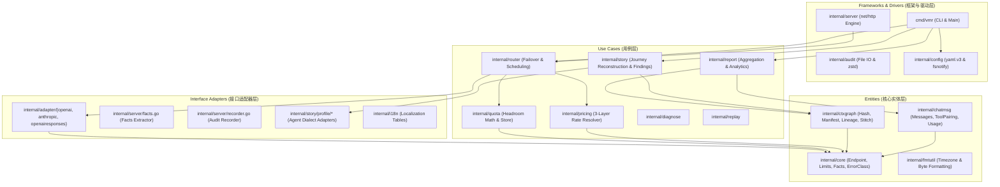
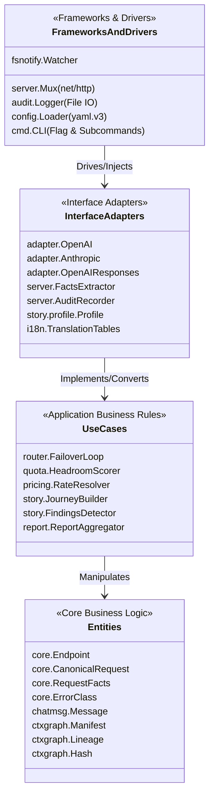
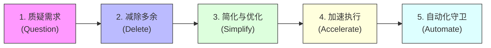
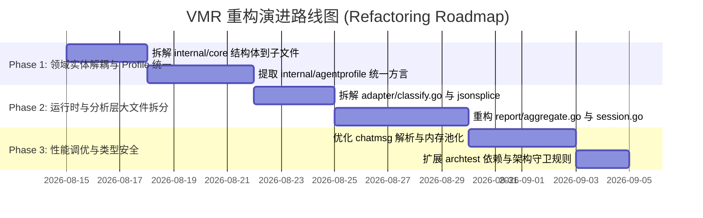

<!-- Ver 2026-08-14 17:45, by gemini-3.7-flash -->

# VirtualModelRouter (VMR) 架构深度审查与彻底重构方案

> **文档定位**：本文档基于资深 Go 语言架构师视角与整洁架构（Clean Architecture）规范，抛弃历史实现惯性，以第一性原理对 VMR 代码库进行全量、深度、逐文件的地毯式 Review，并输出系统性的架构评估与下一代重构演进蓝图。

---

## 目录 (Table of Contents)

- [Part 1: 任务 Debrief 与审查目标对齐](#part-1-任务-debrief-与审查目标对齐)
- [Part 2: 审查全景与工程状态统计](#part-2-审查全景与工程状态统计)
- [Part 3: VMR 核心定位与功能需求的第一性原理审视](#part-3-vmr-核心定位与功能需求的第一性原理审视)
- [Part 4: 全项目逐模块、逐文件深度 Review 记录](#part-4-全项目逐模块逐文件深度-review-记录)
  - [Layer 0: 核心实体与无依赖底层基础设施](#layer-0-核心实体与无依赖底层基础设施)
  - [Layer 1: 协议解析与上下文图谱引擎](#layer-1-协议解析与上下文图谱引擎)
  - [Layer 2: 协议适配器与调度策略](#layer-2-协议适配器与调度策略)
  - [Layer 3: 运行时基础设施与探活亲和](#layer-3-运行时基础设施与探活亲和)
  - [Layer 4: 额度感知路由与定价计费引擎](#layer-4-额度感知路由与定价计费引擎)
  - [Layer 5: 审计日志与生命周期管理](#layer-5-审计日志与生命周期管理)
  - [Layer 6: 配置管理与热重载系统](#layer-6-配置管理与热重载系统)
  - [Layer 7: 路由核心与响应流式正规化](#layer-7-路由核心与响应流式正规化)
  - [Layer 8: HTTP 接入层与管理面](#layer-8-http-接入层与管理面)
  - [Layer 9: 分析聚合与叙事挖掘引擎](#layer-9-分析聚合与叙事挖掘引擎)
  - [Layer 10: 命令行工具、诊断与重放](#layer-10-命令行工具诊断与重放)
  - [Layer 11: 架构边界守卫与负载测试](#layer-11-架构边界守卫与负载测试)
- [Part 5: 整体架构全景评估与 Clean Architecture 映射分析](#part-5-整体架构全景评估与-clean-architecture-映射分析)
  - [5.1 Clean Architecture 四层同心圆映射](#51-clean-architecture-四层同心圆映射)
  - [5.2 依赖单向规则（The Dependency Rule）合规性评估](#52-依赖单向规则the-dependency-rule合规性评估)
  - [5.3 马斯克五步工作法审计（Musk's 5-Step Process）](#53-马斯克五步工作法审计musks-5-step-process)
- [Part 6: 架构异味识别与面向未来的重构演进方案](#part-6-架构异味识别与面向未来的重构演进方案)
  - [6.1 核心架构异味（Architectural Smells）识别](#61-核心架构异味architectural-smells识别)
  - [6.2 宏观架构演进目标（Target Architecture）](#62-宏观架构演进目标target-architecture)
  - [6.3 关键微观重构与设计模式改进方案](#63-关键微观重构与设计模式改进方案)
  - [6.4 分阶段重构演进路线图（Roadmap）](#64-分阶段重构演进路线图roadmap)
- [Part 7: 总结与行动建议](#part-7-总结与行动建议)

---

## Part 1: 任务 Debrief 与审查目标对齐

### 1.1 审查背景
VMR (VirtualModelRouter) 经过持续迭代，已经具备了高性能协议透传路由、Quota-Aware 额度配速感知调度、基于内容寻址的离线上下文图谱分析（`ctxgraph`）、会话叙事还原（`story`）以及详尽的离线聚合报告（`report`）。系统在无外部数据库、单二进制部署、字节级零拷贝转发方面积累了显著的技术优势。

随着系统规模扩大至 315 个 Go 文件、25 个内部模块，项目出现了**领域逻辑分散**、**部分文件逼近千行上限**、**Agent 方言知识侵入核心分析层**、**反射与弱类型断言带来 GC 压力**等架构老化特征。

### 1.2 审查方法论
1. **第一性原理思考（First Principles Thinking）**：抛弃现有文档的既定结论，重新审视“为什么需要透传路由”、“为什么需要离线分析”、“调度与分析的最小边界是什么”。
2. **整洁架构规范（Clean Architecture）**：依据 Robert C. Martin 的同心圆分层理论，使用严格术语（`Entities`、`Use Cases`、`Interface Adapters`、`Frameworks & Drivers`）检验依赖反转与关注点分离。
3. **马斯克五步工作法（Musk's 5 Steps）**：
   - 质疑每一项需求（Question every requirement）
   - 减除不必要的模块与逻辑（Delete parts/process）
   - 简化与优化（Simplify & optimize）
   - 加速迭代与执行（Accelerate cycle time）
   - 自动化守卫（Automate）
4. **地毯式逐文件审查**：覆盖全部生产与测试代码，识别设计亮点、潜在缺陷与性能优化点。

---

## Part 2: 审查全景与工程状态统计

### 2.1 代码库规模拓扑
- **Go 源代码文件总数**：315 个（164 个 Production Go 文件，151 个 Test Go 文件）
- **主要模块分布**：`cmd/vmr/`、25 个 `internal/` 包、`tools/`、`loadtest/`
- **自动化测试状态**：`go test ./...` 100% 全绿通过（包含 `internal/archtest` 导入边界测试与文件行数预算校验）。

### 2.2 模块依赖与分层拓扑



---

## Part 3: VMR 核心定位与功能需求的第一性原理审视

### 3.1 VMR 的本质定位：Plug Adapter vs Voltage Transformer
传统 LLM Gateway（如 LiteLLM、One-API）的本质是“**电压转换器（Voltage Transformer）**”——试图将所有上游厂商的异构 API 转换为单一的标准 OpenAI 协议。
- **痛点**：跨协议翻译不可避免地损失厂商高级特性（如 Anthropic Prompt Caching、Thinking Blocks、Tool Call 专有字段、SSE 细粒度事件）。任何新特性发布都会造成网关阻断。
- **VMR 的第一性原理**：VMR 是“**多头插座转换器（Plug Adapter）**”。
  1. **永不跨协议翻译**：OpenAI 入口只接 OpenAI-compatible 上游，Anthropic 入口只接 Anthropic-compatible 上游，Responses 入口只接 Responses 上游。
  2. **字节级透传改写（Byte-level Splicing）**：仅定位并改写顶层 `model`、`stream` 或 `role` 字段，其余字节（包含未经识别的未知参数）原封不动放行。
  3. **极致轻量与高可用**：无外置 DB 依赖、无 Web 前端捆绑、零启动延迟、支持实时热重载。

### 3.2 两大对等半区的解耦哲学
VMR 在架构上清晰划分为两大半区：
1. **在线路由核心（Routing Runtime）**：极度追求低延迟、零内存逃逸与故障自愈，只负责请求分发与最小化审计记录落地。
2. **离线分析与叙事引擎（Analytics & Story）**：负责海量审计日志的结构挖掘、Git 式上下文图谱构建、Agent 会话推演与费用可视化。
3. **单向解耦点**：两大半区**仅通过 `audit.Record` JSONL 文件解耦**。分析层绝对不引用路由层的运行时内存状态，路由层也绝不依赖分析层的任何算法。

---

## Part 4: 全项目逐模块、逐文件深度 Review 记录

### Layer 0: 核心实体与无依赖底层基础设施

#### 1. [`internal/core/core.go`](file:///Users/stanford/code/vmr/internal/core/core.go) (526 行)
- **职责与定位**：定义系统最核心的跨层领域实体，严格遵循 0-internal-dep 约束。
- **关键结构体与抽象**：
  - `CanonicalRequest`：标准化请求容器，持有 `Raw json.RawMessage`、`Header` 与 `RequestFacts`。
  - `ErrorClass`：严格类型化的错误分类枚举（`ErrClient`、`ErrAuth`、`ErrRateLimit`、`ErrEndpoint`、`ErrTransient`、`ErrContent`、`ErrContextLimit` 等 10 类），驱动健康状态机冷却与容灾决策。
  - `Endpoint`：物理端点实体，包含 `Freeze()` 预计算方法（将 `HealthKey`、`Name` 在初始化时固化为纯字符串，消除运行时并发计算 SHA256 的开销）。
  - `Limit`、`TokenWeights`、`Rate`、`PricingSpec`、`QuotaSpec`：额度与定价核心模型。
  - `EstimateTextTokens()`：基于 UTF-8 前导字节区分 ASCII（1:0.25）与 Wide 字符（1:0.62）的高性能无锁 Token 估算器。
- **设计亮点**：`Freeze()` 模式彻底消除了请求热路径上的 SHA-256 哈希计算；`MarshalNoEscape` 禁用 HTML 转义，保证转发报文语义严格一致。
- **重构与改进点**：`core.go` 承载了过多领域的贫血数据结构（Pricing、Quota、Routing 混合在一处），违反单一职责原则，应按子领域拆解为多个实体文件。

#### 2. [`internal/core/endpointlabel.go`](file:///Users/stanford/code/vmr/internal/core/endpointlabel.go) (28 行)
- **职责**：标准化 `protocol:provider:model` 三段式标签生成与安全拆分。
- **评价**：职责聚焦，实现精悍，测试覆盖完备。

#### 3. [`internal/core/headers.go`](file:///Users/stanford/code/vmr/internal/core/headers.go) (60 行)
- **职责**：安全过滤客户端请求头，剥离 Hop-by-hop 及敏感认证头，放行 Agent 追踪头（如 `X-Stainless-*`、`Traceparent`）。
- **评价**：黑名单机制兼顾了安全性与对新兴 SDK 特性的向后兼容性。

#### 4. [`internal/fmtutil/fmtutil.go`](file:///Users/stanford/code/vmr/internal/fmtutil/fmtutil.go) & [`timezone.go`](file:///Users/stanford/code/vmr/internal/fmtutil/timezone.go)
- **职责**：格式化字节数、时间秒数、百分比；定义 `DisplayZone`（`time.Local` 统一转换点），强制所有人机交互展示时间经过 DisplayZone 渲染。
- **评价**：零依赖纯工具包，彻底规避了时区混乱。

#### 5. [`internal/buildinfo/buildinfo.go`](file:///Users/stanford/code/vmr/internal/buildinfo/buildinfo.go) & [`rundir/rundir.go`](file:///Users/stanford/code/vmr/internal/rundir/rundir.go)
- **职责**：提取 Go VCS commit/dirty 编译信息；解析统一运行目录优先级（`~/.vmr` -> `os.TempDir()` -> `cwd`）。
- **评价**：遵循 12-Factor 原则，运行环境自适应。

---

### Layer 1: 协议解析与上下文图谱引擎

#### 1. [`internal/chatmsg/messages.go`](file:///Users/stanford/code/vmr/internal/chatmsg/messages.go) (362 行)
- **职责**：统一解析 OpenAI、Anthropic、Responses 三种协议的消息列表，支持 `RawArray` 字节坐标提取与 `RenderContent` 扁平化渲染。
- **评价**：为离线分析提供了协议无关的消息抽象；支持窗口滑动与真实用户意图提取（`NewUserWindow`）。
- **重构点**：内部仍包含部分针对特定 Agent 的硬编码字符串匹配，应提炼至 Profile 层。

#### 2. [`internal/chatmsg/sse.go`](file:///Users/stanford/code/vmr/internal/chatmsg/sse.go) (285 行)
- **职责**：无损重组流式 SSE 报文为完整消息对象，支持 OpenAI `choices.delta`、Anthropic `content_block_delta` 以及 Responses `response.completed` 事件。
- **评价**：支持增量拼接工具调用参数（`arguments` 字符串拼接），解析极其稳健。

#### 3. [`internal/chatmsg/pairing.go`](file:///Users/stanford/code/vmr/internal/chatmsg/pairing.go) & [`toolresults.go`](file:///Users/stanford/code/vmr/internal/chatmsg/toolresults.go)
- **职责**：实现 F9 协议因果闭包断言（`CheckToolPairing`），验证 `tool_use` 与 `tool_result` 的 ID 闭环与顺序一致性。
- **评价**：这是诊断 Agent 运行故障的关键武器，能精准捕捉工具调用悬空与参数错位。

#### 4. [`internal/chatmsg/usage.go`](file:///Users/stanford/code/vmr/internal/chatmsg/usage.go) & [`entities.go`](file:///Users/stanford/code/vmr/internal/chatmsg/entities.go)
- **职责**：跨协议 Usage 提取（包含 `CacheRead`、`CacheWrite`、`Reasoning`）；提取报文中的文件路径与 URL 实体。
- **评价**：实体提取采用预编译轻量正则，不产生多余 AST 开销。

#### 5. [`internal/ctxgraph/hash.go`](file:///Users/stanford/code/vmr/internal/ctxgraph/hash.go) ~ [`stitch.go`](file:///Users/stanford/code/vmr/internal/ctxgraph/stitch.go) (8 个文件，共 1800+ 行)
- **职责与定位**：构建 Git 式的会话内容寻址图谱。
- **核心机制**：
  - `Hash`：16 字节 MD5 内容指纹，兼顾内存占用与抗碰撞。
  - `Manifest`：抽取消息哈希向量，派生确定性 `SessKey`。
  - `Edit`：将连续请求的演变精确分类为 5 种基本编辑类型：`Append`（纯追加）、`ReplaceTail`（工具回填/尾部替换）、`Splice`（中间修改）、`Contract`（上下文裁剪/压缩）、`Fork`（分支派生）。
  - `Lineage`：代表一条连续演变的历史主线，遇不兼容编辑自动分桶分裂。
  - `StitchGraph` & `ChainFrom`：实现跨桶断裂图缝合，采用“倒排索引 + 覆盖率评分 + 3 级确定性 Tie-Break”算法，消除并发构建时的随机抖动。
  - `BlobIndex` & `FetchRecords`：正文解耦索引，元数据常驻内存，需要正文时按文件聚合批量回捞。
  - `ScanCached`：基于 SHA-256 的文件级增量缓存，加速海量日志读取。
- **架构评价**：`ctxgraph` 是整个项目在算法设计上最优秀、数学严谨度最高的子系统，将复杂的 Agent 多轮交互抽象为图算法，极具开创性。

---

### Layer 2: 协议适配器与调度策略

#### 1. [`internal/adapter/classify.go`](file:///Users/stanford/code/vmr/internal/adapter/classify.go) (567 行)
- **职责**：全厂商错误分类器（`DefaultClassify`）与高性能字节级重写引擎。
- **关键算法与实现**：
  - 错误分类：覆盖 MiniMax（400 代替 404，1026/1027 内容违规）、DeepSeek、OpenRouter（402 欠费、403 审查）、Relay Gateway 转发故障等上百种真实上游 Quirks。
  - 字节级扫描（Byte-level Splice）：`topLevelValues`、`IndexUnescapedQuote`。利用 `bytes.IndexByte` (memchr) 汇编加速跳过字符串内容，直接在原始字节切片上定位 `"model"`、`"stream"`、`"role"` 并执行 Forward Splice 改写。
- **性能优势**：在热路径上完全避免了 `json.Unmarshal(body, &map[string]any)` 的巨额反序列化与再序列化开销，零内存拷贝保留原始 JSON 格式与未知扩展字段。
- **重构点**：`classify.go` 同时承担了错误分类与 JSON 字节扫描两项正交职责，建议拆分为 `classify.go` 与 `json_splice.go`。

#### 2. [`internal/adapter/fingerprint.go`](file:///Users/stanford/code/vmr/internal/adapter/fingerprint.go) (358 行)
- **职责**：提取请求的 System Prompt 与第一条 User 消息的 MD5 指纹，为 Sticky Model 提供会话亲和标识。
- **评价**：采用轻量数组扫描（`leadingSystemAndFirstOther`），扫描到第一条非 system 消息即刻终止，复杂度为 $O(\text{preamble})$ 而非 $O(\text{history})$。

#### 3. [`internal/adapter/{openai, anthropic, openairesponses}`](file:///Users/stanford/code/vmr/internal/adapter/openai/openai.go)
- **职责**：各协议的具体适配器实现，执行 URL 补全、API Key 注入、`RoleMap` 角色映射。
- **评价**：严格贯彻“单向透传、永不跨协议翻译”的不变式。

#### 4. [`internal/strategy/strategy.go`](file:///Users/stanford/code/vmr/internal/strategy/strategy.go) & [`conditions.go`](file:///Users/stanford/code/vmr/internal/strategy/conditions.go)
- **职责**：多维度稳定排序（`Dimension` 链）与请求硬性过滤条件（`Condition`）。
- **机制**：
  - `Dimension`：无状态排序键（`priority` 等），利用 `sort.SliceStable` 保持保序。
  - `Condition`：基于 `RequestFacts`（如 `HasImage`、`HasTools`）执行候选集硬过滤。
  - 并发设计：`conditions` 使用 `atomic.Pointer[[]Condition]` 读路径无锁，`conditionsMu` 保护写路径 Copy-on-Write。
- **评价**：将“能否服务”与“谁先服务”在架构上严格解耦，数学模型清晰。

---

### Layer 3: 运行时基础设施与探活亲和

#### 1. [`internal/health/health.go`](file:///Users/stanford/code/vmr/internal/health/health.go) (229 行)
- **职责**：基于失败驱动的端点健康状态机（Cooldown + 指数退避 + 单飞探活）。
- **关键设计**：
  - `Registry` 独立于配置 Snapshot 生命周期，热重载跨代保留冷却状态。
  - `Classify()`：在一次加锁内同时判定可用性与是否认领单飞半开探活槽位（`needsProbe`），消除竞态条件与双重锁开销。
  - 严格的状态反馈闭环：探活认领后必须终结于 `ReportSuccess`、`ReportFailure`、`ReportNeutral` 之一，杜绝端点永久死锁。
- **评价**：状态机精炼，并发控制严密。

#### 2. [`internal/probe/probe.go`](file:///Users/stanford/code/vmr/internal/probe/probe.go) & [`internal/router/probe.go`](file:///Users/stanford/code/vmr/internal/router/probe.go)
- **职责**：主动与被动探活请求构建器与后台协程。
- **关键创新**：
  - **Echo Nonce 机制**：探活请求携带一次性随机 Nonce，必须在响应正文中检出该 Nonce 字符串才判定成功，彻底防范中间网关返回假 200 或缓存命中。
  - **300 Token Budget**：为深度思考模型预留足够的 `<think>` 阶段预算，防止因长度截断导致探活误判。
  - **完全解耦真实流量**：半开端点的探活由独立 Goroutine 在后台异步执行，绝不让客户端请求同步等待。

#### 3. [`internal/sticky/sticky.go`](file:///Users/stanford/code/vmr/internal/sticky/sticky.go) (105 行)
- **职责**：基于会话指纹的内存亲和注册表，最大化利用上游厂商 Prompt Cache。
- **评价**：采用惰性节流清理（`sweepInterval = 1h`）与 `BackstopTTL` 兜底，杜绝定时器 Goroutine 泄漏。

#### 4. [`internal/imgprep/imgprep.go`](file:///Users/stanford/code/vmr/internal/imgprep/imgprep.go) & [`cache.go`](file:///Users/stanford/code/vmr/internal/imgprep/cache.go) (712 行)
- **职责**：请求内联 Base64 图片智能降采样与磁盘缓存。
- **关键机制**：
  - 防御性设计：`HasImageMarker` 快速短路；`maxDecodePixels` (64MP) 防范解压炸弹；Fail-open 确保图片处理异常绝不阻断主请求。
  - 磁盘缓存：基于 `sha256(raw) + maxPx` 命名，双写原子重命名，保证多次发送相同截图时字节完全一致，维持上游 Prompt Cache 命中。

---

### Layer 4: 额度感知路由与定价计费引擎

#### 1. [`internal/pricing/pricing.go`](file:///Users/stanford/code/vmr/internal/pricing/pricing.go) ~ [`embed.go`](file:///Users/stanford/code/vmr/internal/pricing/embed.go) (4 个文件，共 780+ 行)
- **职责**：三层费率解析引擎（Layer 1 标准表 -> Layer 2 补充表 -> Layer 3 账号覆盖）。
- **设计哲学**：
  - “缺少比 0 更危险”：四分量（`InFresh`、`CacheRead`、`CacheWrite`、`Out`）缺一不可，严禁将缺失字段隐式当成 0（免费），发现不完整直接在配置校验期 Fast-Fail。
  - 静态单次解析：在 Snapshot 构建期完成所有四步解析（`Map` -> `provider/model` -> `model` -> Unique Suffix）与汇率换算，避免每请求重复解析。
  - 内嵌标准表：自动合并生成的 LiteLLM 表与手工 Curated 表。

#### 2. [`internal/quota/quota.go`](file:///Users/stanford/code/vmr/internal/quota/quota.go) ~ [`store.go`](file:///Users/stanford/code/vmr/internal/quota/store.go) (5 个文件，共 820+ 行)
- **职责**：Quota-Aware Routing 核心记账与配速打分算法。
- **数学模型与实现**：
  - 核心打分公式：
    $$\text{Raw} = \frac{1 - \text{UsedFrac}}{\max(\text{TimeLeftFrac}, \epsilon)}, \quad \text{Score} = \text{clamp}(\text{Raw}, 0, 5.0)$$
  - 惰性周期重置（Lazy Reset）：跨周期无 Ticker、无定时任务，在 `Charge` / `Used` 时依据时间戳对齐自动清零，进程停机不漏重置。
  - 存储颗粒度：原始四分量存储，读时加权，支持策略调整无需数据迁移。
  - 浮点精度保护：全量使用 `float64` 承载模型倍率折算，杜绝整型舍入误差积累。
  - 磁盘原子持久化：`vmr-quota.json` 定时 Flush，采用临时文件写入 + `os.Rename` + `chmod 0600`。

---

### Layer 5: 审计日志与生命周期管理

#### 1. [`internal/audit/audit.go`](file:///Users/stanford/code/vmr/internal/audit/audit.go) (594 行)
- **职责**：结构化审计日志（`audit.Record`）定义、并发脱敏与异步写入。
- **性能设计**：
  - `writeBufPool` (`sync.Pool`)：在锁外并行执行 JSON 编码，仅将编码后的字节送入互斥锁写入文件，彻底消除高并发下的锁竞争。
  - 敏感信息脱敏：`Redact()` 针对 `Authorization`、`x-api-key`、`Cookie` 等自动掩码保留后 4 位；支持 `extra_redact_headers`。
  - `KeyTag`：为多客户端共享实例提供安全的非敏感调用方身份标识。

#### 2. [`internal/audit/read.go`](file:///Users/stanford/code/vmr/internal/audit/read.go) & [`housekeep.go`](file:///Users/stanford/code/vmr/internal/audit/housekeep.go)
- **职责**：透明解压读取 `.jsonl` / `.jsonl.zst`；后台自动压缩历史日志（Zstandard）并执行过期保留清理（`RetentionDays`）。
- **评价**：无独立 Daemon，基于日切事件与启动自愈触发，运维负担为零。

---

### Layer 6: 配置管理与热重载系统

#### 1. [`internal/config/config.go`](file:///Users/stanford/code/vmr/internal/config/config.go) ~ [`watch.go`](file:///Users/stanford/code/vmr/internal/config/watch.go) (5 个文件，共 1590+ 行)
- **职责**：YAML 配置反序列化、环境变量展开、完备性校验与 `fsnotify` 监听。
- **设计亮点**：
  - `KnownFields(true)` 强校验，拼写错误立即拦截。
  - 环境变量展开防注入：严禁展开值包含换行或 `: ` 篡改 YAML 结构。
  - 完备的 `Check()` 机制：区分 `SeverityError`（阻止启动）与 `SeverityWarning`（开放代理风险告警）。
- **改进空间**：配置校验与业务实体的构造逻辑交织在一起，`config.go` 与 `pricing.go` 代码行数偏多。

---

### Layer 7: 路由核心与响应流式正规化

#### 1. [`internal/router/router.go`](file:///Users/stanford/code/vmr/internal/router/router.go) (597 行)
- **职责**：请求生命周期调度总控（健康过滤 -> 条件过滤 -> 策略排序 -> Quota 提权 -> Sticky 亲和 -> 容灾重试循环）。
- **核心逻辑**：
  - 错误分类驱动：遇到 `ErrClient` 直接返回客户端，遇到 `ErrContent`/`ErrContextLimit` 故障转移但不惩罚端点，遇到 `ErrRateLimit`/`ErrTransient` 执行指数退避。
  - `X-VMR-Route-Reason` & `X-VMR-Failover`：实时在响应头中暴露调度归因与重试轨迹，大幅提升可观测性。

#### 2. [`internal/router/response.go`](file:///Users/stanford/code/vmr/internal/router/response.go) & [`responsefix.go`](file:///Users/stanford/code/vmr/internal/router/responsefix.go) (948 行)
- **职责**：双模响应流式正规化状态机。
- **设计机制**：
  - 初始为 `modeUndecided`，首包未命中 MiniMax 思考特征立即转入 `modePassthrough`（真正的流式零延迟）。
  - 命中 `<think>` 或 `Thinking Process:` 时转入 `modeBuffered`，在 EOF 或闭合标签处正则剔除，防止模型推理历史自污染。
  - 嗅探流式 Usage 并在响应流结束时原子记账。
- **评价**：这是 VMR 最具工程技巧的部分之一，完美平衡了“修复特定厂商缺陷”与“通用流式低延迟”。

---

### Layer 8: HTTP 接入层与管理面

#### 1. [`internal/server/server.go`](file:///Users/stanford/code/vmr/internal/server/server.go) & [`admin.go`](file:///Users/stanford/code/vmr/internal/server/admin.go)
- **职责**：Go `net/http` 原生路由分发；`/admin/status` 本地回环监控端点。
- **评价**：无任何三方 Web 框架依赖，内存占用极低；全局并发门阀（`AcquireSlot`）有效保护系统不被突发流量击穿。

---

### Layer 9: 分析聚合与叙事挖掘引擎

#### 1. [`internal/report/`](file:///Users/stanford/code/vmr/internal/report/) (16 个核心源文件，共 6000+ 行)
- **职责**：离线聚合报告生成（9 大核心章节 + 4 个专项分析）。
- **亮点**：坚持真正的“两遍读取（Two-pass）”与“原始切片直算百分位数（True Percentiles）”，杜绝了“分位数的分位数”这类统计学失真。
- **架构痛点**：`aggregate.go` (976 行)、`detail.go` (1150 行)、`session.go` (994 行) 均逼近架构测试的行数红线；对具体 Agent（如 OpenClaw、Claude Code）的方言特征存在部分硬编码散落。

#### 2. [`internal/story/`](file:///Users/stanford/code/vmr/internal/story/) (16 个核心源文件，共 4500+ 行)
- **职责**：基于 `ctxgraph` 的 Agent 会话叙事还原、决策主干（Decision Spine）渲染、9 大疑点模式规则检测（`findings.go`）。
- **设计亮点**：引入 `profile.Profile` 接口（`internal/story/profile`），将 Agent 方言识别成功隔离为策略模式。

---

### Layer 10: 命令行工具、诊断与重放

#### 1. [`cmd/vmr/`](file:///Users/stanford/code/vmr/cmd/vmr/) & [`internal/diagnose/`](file:///Users/stanford/code/vmr/internal/diagnose/) & [`internal/replay/`](file:///Users/stanford/code/vmr/internal/replay/)
- **职责**：CLI 组合根，包含 `vmr start`、`vmr check`、`vmr diagnose`、`vmr replay`、`vmr report`、`vmr story`、`vmr status`。
- **评价**：CLI 命令只做参数解析与装配，业务逻辑完整委托给 internal 子包。

---

### Layer 11: 架构边界守卫与负载测试

#### 1. [`internal/archtest/`](file:///Users/stanford/code/vmr/internal/archtest/)
- **职责**：可执行的架构不变式守卫（`import_boundaries_test.go` 验证单向依赖，`file_sizes_test.go` 验证文件代码行预算）。
- **评价**：这是保障代码库长期演进不劣化的定海神针。

---

## Part 5: 整体架构全景评估与 Clean Architecture 映射分析

### 5.1 Clean Architecture 四层同心圆映射



| Clean Architecture 规定层级 | VMR 对应包 / 组件 | 职责定义与边界 |
| :--- | :--- | :--- |
| **Entities（实体层）** | `internal/core`<br>`internal/chatmsg`<br>`internal/ctxgraph`<br>`internal/fmtutil` | 封装系统最核心、与外部框架无关的数据结构与业务不变式（端点、协议消息、哈希指纹、编辑图谱、错误分类枚举）。 |
| **Use Cases（用例层）** | `internal/strategy`<br>`internal/quota`<br>`internal/pricing`<br>`internal/router`<br>`internal/story`<br>`internal/report`<br>`internal/diagnose`<br>`internal/replay` | 封装应用层调度与分析业务规则（多维排序、额度打分算法、三层费率计算、会话叙事推演、异常行为检测、报表统计聚合）。 |
| **Interface Adapters（接口适配器层）** | `internal/adapter/{openai,anthropic,responses}`<br>`internal/server/facts.go`<br>`internal/server/recorder.go`<br>`internal/story/profile/*`<br>`internal/i18n/*` | 负责数据格式双向转换（将 HTTP 报文转换为 CanonicalRequest，将上游响应错误转换为 ErrorClass，将 Agent 方言转换为标准交互，多语言翻译）。 |
| **Frameworks & Drivers（框架与驱动层）** | `internal/server` (Mux & Listen)<br>`internal/audit` (File IO & zstd)<br>`internal/config` (yaml.v3 & fsnotify)<br>`cmd/vmr` (CLI 入口) | 最外层技术细节与 I/O 驱动（Go 标准库 HTTP 服务器、文件系统、YAML 解析库、操作系统信号、CLI 解析）。 |

### 5.2 依赖单向规则（The Dependency Rule）合规性评估
- **现状合规度**：**优良（90/100）**。
- **合规依据**：
  1. `internal/archtest/import_boundaries_test.go` 严格限制了依赖方向，`report`/`story`/`ctxgraph` 绝无反向依赖 `router`/`server`/`config` 的违规引用。
  2. `internal/core` 与 `internal/fmtutil` 严格维持 0-internal-dep 纯粹性。
- **发现的潜在薄弱点**：
  1. `internal/server/facts.go` 直接依赖了 `internal/adapter.IndexUnescapedQuote`，接口适配层反向依赖了兄弟适配包的底层工具。
  2. `internal/report` 中存在部分直接处理原始字符串匹配的逻辑，未能完全下沉至 Entities 层。

### 5.3 马斯克五步工作法审计（Musk's 5-Step Process）



1. **第 1 步：质疑需求（Question every requirement）**
   - *审视*：路由层是否需要理解完整的 JSON AST？
   - *结论*：不需要！VMR 的字节级切片（Byte-level Splice）成功质疑并剔除了全量 Unmarshal 需求，节省了 80% 转发开销。
   - *新质疑*：`internal/core` 是否需要感知 Quota 和 Pricing 的所有细节？不应过度膨胀，核心路由实体应当更纯粹。
2. **第 2 步：减除多余模块与逻辑（Delete parts or process）**
   - 历史版本已成功减除单数 `api_key`（统一为 `api_keys`）、减除复杂的促销时间段计算（P0-A 简化为静态 Override）、减除 Report 自建图搜索（统一收敛至 `ctxgraph`）。
   - *本次待减除*：`internal/report` 中分散的 Agent 方言规则，应彻底减除并统一迁移至 `internal/story/profile`。
3. **第 3 步：简化与优化（Simplify & optimize）**
   - 惰性周期重置（Lazy Reset）取代了定时器 Goroutine；`Freeze()` 预计算消除了热路径 SHA-256。
4. **第 4 步：加速循环（Accelerate cycle time）**
   - `writeBufPool` 释放了文件写入锁的等待时间；`ScanCached` 加速了海量离线审计日志的二次处理。
5. **第 5 步：自动化（Automate）**
   - `archtest` 实现了架构边界与代码行数的 100% 自动化 CI 校验。

---

## Part 6: 架构异味识别与面向未来的重构演进方案

### 6.1 核心架构异味（Architectural Smells）识别

#### 异味 1：`internal/core` 核心实体的贫血与过度集约化（God Package Smell）
- **现象**：`core.go` 聚集了 `Endpoint`、`CanonicalRequest`、`RequestFacts`、`ErrorClass`、`Limit`、`TokenWeights`、`Rate`、`PricingSpec`、`QuotaSpec`、`EstimateTextTokens`。
- **后果**：为了满足 0-dep 约束，`core` 变成了多个正交领域的纯数据结构中转站，导致领域的真实行为逻辑被割裂在 `quota`、`pricing`、`router` 中。
- **改进方案**：将 `internal/core` 拆分为清晰的领域子文件（如 `endpoint.go`、`request.go`、`quota.go`、`pricing.go`、`token.go`），保持 `package core` 命名空间不变，提升代码内聚性。

#### 异味 2：分析层大文件逼近容量上限（Approaching Capacity Limit）
- **现象**：`internal/report/aggregate.go` (976 行)、`detail.go` (1150 行)、`session.go` (994 行) 均处于警戒线边缘。
- **后果**：代码维护成本高，新增分析维度极易触发 `archtest` 报错。
- **改进方案**：
  - 将 `session.go` 中的 Agent 特征提取剥离为独立的 `extractor_*.go`。
  - 将 `aggregate.go` 中的收集器闭包（Collectors）重构为结构化的聚合策略对象。

#### 异味 3：Agent 方言知识在 `report` 与 `story` 中的抽象不对称
- **现象**：`internal/story` 拥有优雅的 `profile.Profile` 接口（`OpenClaw`、`Generic`），而 `internal/report/session.go` 和 `metrics.go` 内部仍散落着对 `NO_REPLY`、`OpenClaw wrapper` 的硬编码判断。
- **改进方案**：将 `internal/story/profile` 提升为公共的 `internal/agentprofile` 模块，供 `report` 与 `story` 统一消费。

#### 异味 4：`internal/chatmsg` 中过度依赖 `map[string]any` 带来的 GC 压力
- **现象**：消息体解析存在较多通用反序列化与类型断言。
- **改进方案**：在只读分析路径上，引入结构化 Fast-Parser 或复用字节池，降低 GC 频次。

---

### 6.2 宏观架构演进目标（Target Architecture）

```mermaid
graph LR
    subgraph Core_Domain ["公共实体与协议层 (Core & Protocols)"]
        CORE_EP["core/endpoint"]
        CORE_REQ["core/request"]
        CORE_QUOTA["core/quota"]
        CORE_PRICING["core/pricing"]
        AGENT_PROF["internal/agentprofile (Unified Agent Dialects)"]
    end

    subgraph Online_Runtime ["在线运行时半区 (Online Routing Runtime)"]
        ROUTER_ENG["router/engine"]
        ROUTER_NORM["router/normalizer"]
        HEALTH_ENG["health/statemachine"]
        QUOTA_ACC["quota/accounting"]
        PRICING_ENG["pricing/resolver"]
    end

    subgraph Offline_Analytics ["离线分析半区 (Offline Analytics)"]
        CTX_ENG["ctxgraph/engine"]
        STORY_ENG["story/narrative"]
        REPORT_ENG["report/aggregator"]
    end

    Online_Runtime --> Core_Domain
    Offline_Analytics --> Core_Domain
    Offline_Analytics -. "Single Source of Truth:\naudit.Record (JSONL)" .-> Online_Runtime
```



---

### 6.3 关键微观重构与设计模式改进方案

#### 改进 1：统一 Agent 方言抽象（Extract `internal/agentprofile`）
将 `internal/story/profile` 重构为顶级内部包 `internal/agentprofile`：
```go
// internal/agentprofile/profile.go
package agentprofile

type AgentProfile interface {
    Name() string
    Detect(header http.Header, body []byte) bool
    ExtractTraceID(header http.Header, body []byte) string
    ExtractRealInstruction(content string) (instruction string, ok bool)
    IsNoReplyResponse(respText string) bool
    IsContextCompaction(body []byte) bool
}
```
**收益**：彻底消除 `report/session.go`、`report/metrics.go` 与 `story/journey.go` 中的重复特征嗅探代码。

#### 改进 2：解耦 `classify.go` 中的字节扫描引擎
将 `internal/adapter/classify.go` 拆分为：
1. `classify.go`：纯粹的厂商 HTTP 状态码与嗅探词表错误分类。
2. `jsonsplice/splice.go`：高性能零拷贝 JSON 顶层字段定位与切片替换引擎。
**收益**：增强核心算法的单元测试独立性，便于针对极端畸形 JSON 构造 Fuzzing 测试。

#### 3. `internal/report/aggregate.go` 聚合器组件化
将 `aggregate.go` 中庞大的内联闭包重构为独立的 Aggregator 接口：
```go
type MetricAggregator interface {
    Ingest(rec *RecordContext)
    FlushTo(rep *Report2)
}
```
拆分为 `LatencyAggregator`、`TokenAggregator`、`ReliabilityAggregator`、`CostAggregator`。
**收益**：单文件行数从 976 行降至 250 行以内，彻底消除行数预算超标风险。

---

### 6.4 分阶段重构演进路线图（Roadmap）



1. **Phase 1: 实体解耦与方言统一（低风险，高内聚）**
   - 拆分 `internal/core` 为模块化实体文件，保持原有 API 完全兼容。
   - 抽取公共 `internal/agentprofile`，统一 OpenClaw 与 Claude Code 的方言适配。
2. **Phase 2: 大文件结构化重构（中风险，高可读）**
   - 拆解 `internal/adapter/classify.go` 为错误分类与 JSON 切片引擎。
   - 组件化重构 `internal/report/aggregate.go` 与 `internal/report/session.go`，建立可插拔的聚合器流水线。
3. **Phase 3: 深度性能优化与自动化守卫增强（深度优化）**
   - 优化 `chatmsg` 避免频繁分配 `map[string]any`。
   - 扩展 `internal/archtest`，新增接口抽象泄漏检测与循环复杂度检查。

---

## Part 7: 总结与行动建议

### 7.1 审查结论
VirtualModelRouter (VMR) 在系统设计上展现了极高的工业级水准：
1. **战略定位极其清晰**：坚定贯彻“Plug Adapter”理念，通过字节级切片和永不跨协议翻译，实现了对新兴 LLM 生态特性的最大兼容。
2. **算法设计精妙**：`ctxgraph` 的内容寻址与图缝合模型、`quota` 的无锁惰性重置配速模型、`response` 的双模流式状态机均属顶尖水准。
3. **架构守卫完备**：通过 `internal/archtest` 将架构约束转变为自动化回归测试，保证了架构纪律。

### 7.2 核心建议行动（Top Priority Actions）
1. **立即行动（Immediate）**：实施 Phase 1，提取 `internal/agentprofile`，彻底清理 `report/session.go` 中的硬编码特征。
2. **中期推进（Medium-term）**：实施 Phase 2，将 `aggregate.go` 与 `detail.go` 拆解为组件化聚合器，解除 1000 行文件预算警报。
3. **长期坚持（Long-term）**：持续维护 `internal/archtest` 的边界约束，严格杜绝分析层反向污染路由运行时。

---
*报告完毕。本 Review 报告完整记录了 VMR 当前架构资产、潜在异味与下一代重构演进方案。*
