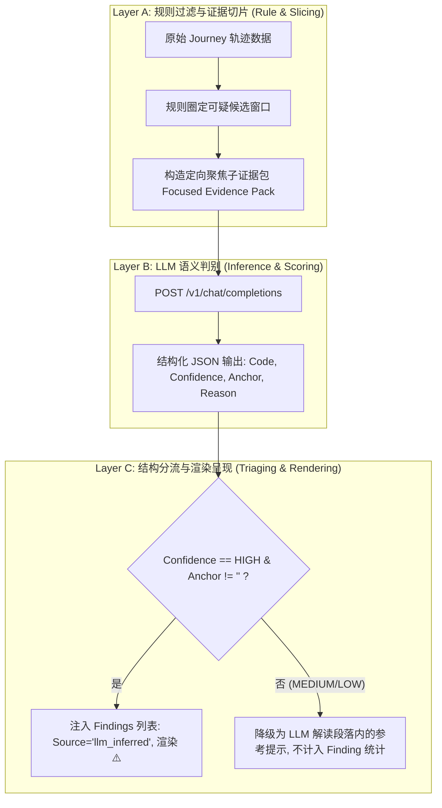
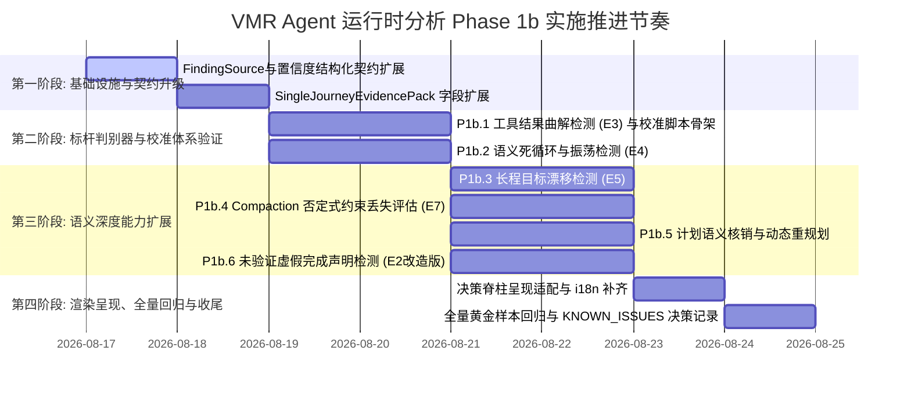

<!-- Ver 2026-08-16 22:15, by gemini-3.7-flash -->

# VMR Agent 运行时分析 Phase 1b 详细执行规划方案

> **状态**：Draft for Review
> **制定日期**：2026-08-16
> **制定模型**：Gemini 3.7 Flash
> **依据方案**：[`docs/future-strategy/agent_runtime_implementation_roadmap_gemini-3.7-flash.md`](file:///Users/stanford/code/vmr/docs/future-strategy/agent_runtime_implementation_roadmap_gemini-3.7-flash.md) 第 9.3 节与第 9.7/9.8 节
> **核心定位**：聚焦**高价值轻量 LLM 语义判别器与证据包增强**，在 Phase 1a 纯规则地基之上，引入有边界的 LLM 推测分析能力，精准捕获“指鹿为马”、“语义死循环”、“目标漂移”、“未验证虚假完成”等高阶隐性故障。
> **核心原则**：
> 1. **规则为主、LLM 为辅**：规则层先圈定高嫌疑候选窗口，LLM 仅在定向证据切片内做语义推测，避免对长文本进行全量盲目扫描。
> 2. **事实与推测严格分层**：LLM 生成的 Finding 强制携带 `Source: "llm_inferred"`、结构化离散置信度（`HIGH/MEDIUM/LOW`）与具体证据锚点（`evidence_anchor`），仅 `HIGH` 置信度且有证据锚点的项在报告中以 Finding（⚠️）呈现。
> 3. **校准报告为合入前置条件**：每个 LLM 判别器在合入 `internal/story` 正式代码路径前，必须在 30-50 个 Journey 的黄金样本集上完成离线调优并提供低误报率校准报告。
> 4. **Fail-Open 稳态与架构预算控制**：LLM 调用失败/无 Key/超时完全不影响规则层事实与 Markdown 正常产出；新增代码严格遵守 `internal/archtest` 文件行数预算。

---

## 0. Phase 1b 总体架构设计与边界约束

### 0.1 核心架构决策：LLM Finding 结构化契约升级

在 Phase 1a 之前，`internal/story/llm.go` 仅对规则层已计算的数字/表格进行自然语言叙述解读。Phase 1b 允许 LLM 判别器产出新的结构化 Finding，但必须严格遵守以下四大契约：



#### 契约规范细节：
1. **数据模型扩展 (`internal/story/findings.go`)**：
   ```go
   type FindingSource string
   const (
       SourceRule        FindingSource = "rule"         // 默认：确定性规则推导
       SourceLLMInferred FindingSource = "llm_inferred" // LLM 语义判别器推测
   )

   type FindingConfidence string
   const (
       ConfidenceHigh   FindingConfidence = "HIGH"   // 具备直接、无可辩驳的原文证据锚点
       ConfidenceMedium FindingConfidence = "MEDIUM" // 存在间接证据，但需要一定逻辑推断
       ConfidenceLow    FindingConfidence = "LOW"    // 仅基于排除法或弱信号推测
   )

   type Finding struct {
       Code           FindingCode       `json:"code"`
       StepSeq        int               `json:"step_seq"`
       RelatedSeq     []int             `json:"related_seq,omitempty"`
       Source         FindingSource     `json:"source,omitempty"`          // Phase 1b 新增
       Confidence     FindingConfidence `json:"confidence,omitempty"`      // Phase 1b 新增 (仅 llm_inferred)
       EvidenceAnchor string            `json:"evidence_anchor,omitempty"`  // Phase 1b 新增：触发判定的关键原文摘录
       Finding        string            `json:"finding"`
       Evidence       string            `json:"evidence,omitempty"`
       Action         string            `json:"action,omitempty"`
   }
   ```
2. **三档置信度判据准则**：
   - **HIGH**：能指出具体矛盾字面（如工具返回 `404 Not Found`，模型紧接着推理 `已成功获取数据`；或终步宣称 `测试已全部通过`，但同 Task 内无任何测试指令且有未解决报错）。
   - **MEDIUM**：动作具有可疑重复性或偏离倾向，但存在合理的探索解释空间（如连续 3 次换同义词搜索，但搜索范围在微调扩大）。
   - **LOW**：纯直觉性推断或缺乏局部证据支持的宏观怀疑。
3. **分层渲染呈现**：
   - 决策脊柱（Decision Spine）与 Findings 列表中，`Source == "llm_inferred"` 的项在标题行显式标注 `[AI推测]` 或 `(推测)`，与规则检测项在视觉上彻底隔离。

---

### 0.2 文件规划与架构行数预算（Archtest Budget）对照表

对照 [`internal/archtest/file_sizes_test.go`](file:///Users/stanford/code/vmr/internal/archtest/file_sizes_test.go)（Phase 1a 完工后实测数据）：

| 文件路径 | 预算上限 (Budget) | 当前实测行数 | Phase 1b 预估增量 | 预计改造后行数 | 安全余量 | 规划策略与应对措施 |
|---|:---:|:---:|:---:|:---:|:---:|---|
| `internal/story/findings.go` | **580** | 490 | +15 行 | ~505 行 | 75 行 (12.9%) | 仅增加 `FindingSource`/`FindingConfidence`/`EvidenceAnchor` 字段与 4 个新 `FindingCode` 常量，绝不堆放判别逻辑。 |
| `internal/story/findings_toolresult.go` | **320** | 289 | 0 行 | 289 行 | 31 行 (9.7%) | 保持不变，Phase 1b 不碰此文件。 |
| `internal/story/llm.go` | **700 (默认)** | 416 | +20 行 | ~436 行 | 264 行 (37.7%) | 仅作为通用网络客户端、缓存解析与 `evidencePackKind` 接口分发根。 |
| `internal/story/llm_single.go` | **700 (默认)** | 53 | +45 行 | ~98 行 | 602 行 (86.0%) | 扩展 `SingleJourneyEvidencePack` 字段与拼装逻辑。 |
| **`internal/story/llm_findings.go`** | **700 (默认)** | **0 (新建)** | **+280 行** | **~280 行** | **420 行 (60.0%)** | **新建核心文件**：统一承载 6 个 LLM 判别器的证据提取（Slicing）、Prompt 组装、JSON 解析与 Finding 转换。 |
| `internal/i18n/story_llm.go` | **700 (默认)** | 184 | +160 行 | ~344 行 | 356 行 (50.8%) | 增加 6 个判别器的中英文 System Prompt、Few-Shot 示例与 JSON Schema 约束说明。 |
| `internal/story/render_spine.go` | **380** | 380 | +8 行 / -8 行 | ~380 行 | 0 行 (贴线) | 微调 Finding 渲染前缀，支持 `[AI推测]` 标识，保持行数中立。 |

---

## 1. Phase 1b 六大任务详细实施方案

---

### 任务 P1b.1：工具结果曲解与幻觉断言检测 (E3, `FindingToolResultMisinterpretation`)

#### 1. 业务痛点与技术原理
Agent 在收到工具返回的明确错误、否定响应（如 `404 Not Found`, `Permission denied`, `Exit code 1`）时，思维链（Reasoning）却产生相反的乐观幻觉（如“已成功加载配置，准备下一步”），并在此错误假设上继续推进，导致后续操作全盘跑偏（学术界 RCA 调研中此类“指鹿为马”故障占比高达 71.2%）。

#### 2. 实现路径
1. **规则层候选筛选 (`extractSuspiciousToolPairs`)**：
   - 遍历 Journey 中的 Steps，查找携带 `ToolCalls` 且其后紧邻 Step 携带 `Reasoning` 的转折点。
   - 若前序 Step 的 `ToolResult` 满足以下任一可疑信号：
     - 携带 `is_error: true` 原生标记；
     - 工具返回文本前 300 字符包含常见否定词（`error`, `failed`, `not found`, `denied`, `invalid`, `cannot`, `exception`）；
     - HTTP 状态码 `>= 400`。
   - 提取三元组：`{StepSeq, ToolName, TruncatedResult (≤500 字符), NextReasoning (≤800 字符)}`。
2. **LLM 判别器 Prompt 设计 (`misinterpretation-llm-v1`)**：
   - 输入：`SuspiciousPairs` 列表。
   - 判定准则：对比 `ToolResult` 的真实事实与 `NextReasoning` 的理解，判断是否属于“明确报错被当成成功”或“关键失败信息被忽略并强行乐观推断”。
   - 输出要求：返回 JSON 数组，包含 `step_seq`, `is_misinterpreted` (bool), `confidence` ("HIGH"|"MEDIUM"|"LOW"), `evidence_anchor` (引用矛盾的具体字句), `explanation`。
3. **Finding 组装**：
   - 若 `is_misinterpreted == true` 且 `confidence == "HIGH"`，生成 `FindingToolResultMisinterpretation`。

#### 3. 验收标准
- 单测验证：标准曲解用例（`404` 文本 vs `成功读取` 推理）必须 100% 检出为 HIGH；正常错误处理用例（报错后推理 `读取失败，尝试备用方案`）不得误报。

---

### 任务 P1b.2：语义死循环与振荡检测 (E4, `FindingSemanticOscillation`)

#### 1. 业务痛点与技术原理
P1a.2 的 JSON 参数规范化解决了参数字节级完全相同的死循环漏网问题。但真实语料中更隐蔽的是**语义原地打转**（Semantic Oscillation）：Agent 在失败后反复微调无意义的参数（如搜索关键词不断变换无用同义词、分页 offset 无效递增、对同一个不存在的文件在 `./foo/bar.go` 和 `foo/bar.go` 之间反复试探），消耗大量 Token 却毫无进展。

#### 2. 实现路径
1. **规则层滑动窗口圈定 (`detectOscillationCandidates`)**：
   - 设定滑动窗口大小 $W = 6$ 步。
   - 若在连续 $W$ 步内，**同一种工具**被调用 $\ge 3$ 次，且参数经过 P1a.2 规范化后**不全相同**（全相同已被 `exact_repeat_tool_call` 捕获）：
   - 提取该窗口内的调用序列：`{ToolName, Calls: [{Seq, Args, ResultBrief}], ContextIntent}`。
2. **LLM 判别器 Prompt 设计 (`semantic-oscillation-llm-v1`)**：
   - 判定准则：评估这几次连续调用的参数变化是否代表“具有建设性的假设验证/渐进探索”，还是“缺乏实质新信息/换汤不换药的原地打转”。
   - 输出要求：`is_oscillating` (bool), `confidence`, `evidence_anchor` (指出无效重试的参数模式), `suggested_breakout` (建议的跳出策略)。
3. **Finding 组装**：
   - 仅在 `is_oscillating == true` 且 `confidence == "HIGH"` 时触发 `FindingSemanticOscillation`。

#### 3. 验收标准
- 单测验证：合成 3 次同义词无效搜索序列命中 HIGH；合成正常二分查找/分页抓取数据序列判定为非死循环。

---

### 任务 P1b.3：长程目标漂移检测 (E5, `FindingGoalDrift`)

#### 1. 业务痛点与技术原理
在包含 20 轮以上、多 Task 切换的长程 Agent 交互中，Agent 容易被中间某次工具报错或临时产生的子任务吸引全部注意力，逐渐陷入细枝末节的技术泥潭（如调试一个无关的 linter 错误、过度重构辅助脚本），彻底遗忘用户初始的根目标（Root Goal），导致任务超时或产出与初衷南辕北辙。

#### 2. 实现路径
1. **证据提取与检查点采样 (`buildGoalDriftCheckpoints`)**：
   - 提取用户第一个 Task 的初始输入为 `RootUserIntent`。
   - 每隔 $K = 5$ 步或在 Task 切换边界，抽取当前 Step 的 `Reasoning` 核心决策与发起的 `ToolCalls`，组合为 `StepCheckpoint`。
2. **LLM 判别器 Prompt 设计 (`goal-drift-llm-v1`)**：
   - 判定准则：评估当前的 Checkpoint 行为与 `RootUserIntent` 的逻辑关联度。区分：
     - **主线推进 (On Track)**：直接服务于根目标；
     - **合理子任务 (Necessary Subtask)**：为完成根目标所必需的环境准备或依赖排查；
     - **目标漂移 (Goal Drift)**：脱离根目标且无法收敛的无意义旁支探索。
   - 输出要求：`drift_detected` (bool), `drift_step_seq` (首次发生漂移的步骤), `confidence`, `evidence_anchor`, `drift_explanation`。
3. **Finding 组装**：
   - 触发 `FindingGoalDrift`，`StepSeq` 标记为首次漂移点，`RelatedSeq` 记录用户初始指令 Step。

#### 3. 验收标准
- 单测验证：模拟“修复登录 Bug”但中间陷入“重构 Makefile 格式”并持续 5 轮的样本，准确标出漂移起点与 HIGH 置信度。

---

### 任务 P1b.4：Compaction 否定式核心约束丢失评估 (E7, `FindingConstraintTextDropped` 扩展)

#### 1. 业务痛点与技术原理
现有规则检测器仅能通过提取文件名/URL 等实体来发现上下文压缩（Compaction）中的信息丢失（`SwallowedEntities`）。然而，系统级否定式约束（如“绝对不能修改 schema.sql”、“请使用中文回答”、“保持向前兼容”、“不要删除未提交代码”）通常不包含文件实体，在历史被裁剪吞噬后，Agent 往往立刻违背用户初始准则。

#### 2. 实现路径
1. **缝合边界上下文切片 (`buildCompactionDeltaExcerpt`)**：
   - 在已识别的 `Contract` / `Splice` 缝合边界 Step，提取被压缩丢弃的前驱消息文本切片（最大截取 3000 字符）与压缩后保留的摘要/System Prompt。
2. **LLM 判别器 Prompt 设计 (`compaction-constraint-llm-v1`)**：
   - 判定准则：专门比对被丢弃文本与保留文本，检查是否存在“明确的否定式禁止规则”、“安全边界约束”或“核心质量规范”在压缩后未被保留。
   - 输出要求：`constraint_lost` (bool), `lost_constraints` ([]string), `confidence`, `evidence_anchor` (被丢弃的原文句子)。
3. **Finding 组装**：
   - 复用既有 `FindingConstraintTextDropped` 代码，在 `Evidence` 中显式注明 `[否定式规则丢失]` 及具体约束内容，不制造冗余的 Finding Code。

#### 3. 验收标准
- 单测验证：被压缩文本中包含“禁止删除数据库表”，压缩后摘要未提及该规则，成功检出约束丢失。

---

### 任务 P1b.5：计划语义核销与动态重规划分析 (PCPC + Re-planning)

#### 1. 业务痛点与技术原理
Phase 1a 的 P1a.7 已经实现了 Markdown Checklist 及数字列表的结构化条目提取（`ExtractActionablePlan`）。但规则层的字面实体匹配（`detectPlanExecutionMisalignment`）只能做粗糙的“文件名是否在后续出现”，无法理解“步骤三：运行单元测试并确保覆盖率>80%”这种语义型计划条目是否真实达成，且无法感知 Agent 在中途推翻旧计划、制定新计划的动态演进。

#### 2. 实现路径
1. **动态重规划跟踪 (Dynamic Re-planning Tracker)**：
   - 在任务各 Step 中持续扫描 `ExtractActionablePlan`。若中间某 Step 产出了新的、与首轮计划 Jaccard 相似度 `< 0.4` 的有效计划，将其识别为 `Plan v2`，重置跟踪基准。
2. **LLM 计划语义核销 (`plan-audit-llm-v1`)**：
   - 输入：有效计划条目列表 + 任务后续执行的 ToolCalls & Responses 摘要。
   - 判定准则：逐项判定每个 PlanItem 的执行状态：
     - `FULFILLED`（已通过工具调用或明确结果核销）；
     - `UNFULFILLED`（未执行或中途遗漏）；
     - `FAILED`（执行了但报错未解决）。
   - 输出要求：`items_status` (map), `unfulfilled_count`, `confidence`, `evidence_anchor`。
3. **Finding 组装与指标升级**：
   - 若存在明确未执行条目且 `confidence == "HIGH"`，生成或增强 `FindingPlanExecutionMisalignment` 的可解释性描述。

#### 3. 验收标准
- 单测验证：制定 4 步计划，第 3 步“验证 API 连通性”完全未调用任何网络/工具即直接宣称完成，准确核销出第 3 步 `UNFULFILLED`。

---

### 任务 P1b.6：未验证虚假完成声明检测 (E2 改造版, `FindingUnverifiedCompletionClaim`)

#### 1. 架构合规改造与问法重塑
原路线图 E2 试图让 LLM 给出“任务成功/失败”四态判决，这违背了 VMR“零埋点、无沙箱真实反馈、不冒充现实裁判”的核心架构边界。
**改造方案**：将问法重塑为 VMR 证据范围内完全可证伪的事实性问题——**“终步完成声明是否有对应的验证动作支撑”**。

```
LLM 判定三态：
1. CLAIM_WITH_VERIFICATION    : 明确宣称完成，且轨迹中有明确验证动作（如测试通过、构建成功、文件读取校验）
2. CLAIM_WITHOUT_VERIFICATION : 明确宣称完成，但轨迹中无对应验证动作（或验证报错后未重试直接宣称完成）
3. NO_COMPLETION_CLAIM        : 无明确完成宣称（如任务中途中断、达到轮次上限、仍在讨论）
```

#### 2. 实现路径
1. **证据提取 (`buildCompletionEvidence`)**：
   - 提取 Task 最终 Step 的 `RespText` / `Reasoning`。
   - 提取同 Task 内所有工具调用及 P1a.3 提取的 Shell 验证意图候选（`ExtractShellVerificationCandidate`）。
2. **LLM 判别器 Prompt 设计 (`completion-claim-llm-v1`)**：
   - 判定准则：
     - 识别最终文本是否包含“已完成全部要求”、“Bug 已修复”、“脚本已测试通过”等强完成断言；
     - 检查前序步骤中是否存在与该断言对应的实质性验证工具调用与成功结果。
   - 输出要求：`claim_status` (三态枚举), `confidence`, `evidence_anchor` (引用完成断言的原句), `missing_verification` (说明缺失了何种验证)。
3. **Finding 组装**：
   - 仅在 `claim_status == CLAIM_WITHOUT_VERIFICATION` 且 `confidence == "HIGH"` 时触发 `FindingUnverifiedCompletionClaim`。

#### 3. 验收标准
- 单测验证：代码修改后无任何 `go test` / `build` 动作即回复“已修复所有问题并验证通过”，必须 100% 触发 `FindingUnverifiedCompletionClaim`。

---

## 2. 离线校准机制与黄金样本集规范 (Calibration & Golden Dataset)

为彻底避免 LLM 判别器在主干代码库中引入不可控的误报与幻觉，Phase 1b 严格遵守**“离线校准先行、校准报告达标后方可合入”**的工程守卫纪律。

### 2.1 黄金样本集构建规范 (30~50 Journeys)

样本集直接从 `logs/` 现有 20+ 个生产审计日志中采样构建，并按模块分类标注 Ground Truth：

| 模块类别 | 正例样本特征 (Expected Positive, 触发 Finding) | 负例样本特征 (Expected Negative, 不应触发 Finding) | 最低样本量 |
|---|---|---|:---:|
| **P1b.1 工具结果曲解** | 工具明确返回 404/Error，模型推理却声称“获取成功，开始分析”。 | 工具返回 Error，模型推理“检测到报错，准备重试或报错返回”。 | ≥ 6 例 (3正/3负) |
| **P1b.2 语义死循环** | 连续 4 步变换同一工具的同义关键词，或反复尝试已确认不存在的路径。 | 正常的分页拉取数据、二分查找、或逐步修复编译错误的渐进式修改。 | ≥ 6 例 (3正/3负) |
| **P1b.3 目标漂移** | 用户要求修复 Bug，中途被 linter 警告吸引，连续 6 步陷入全库格式重构。 | 为解决核心 Bug 所必需的深层依赖调试与前置环境配置。 | ≥ 6 例 (3正/3负) |
| **P1b.4 Compaction 约束丢失** | 前序 Prompt 声明“禁止改动 A 文件”，压缩后该约束丢失且后续修改了 A 文件。 | 常规上下文压缩，丢弃的仅为已完成的中间临时数据。 | ≥ 6 例 (3正/3负) |
| **P1b.5 计划语义核销** | 宣布 4 步计划，中途跳过核心测试步骤直接进入总结。 | 严格按计划执行，或中途主动说明“由于 X 原因调整计划并执行新方案”。 | ≥ 6 例 (3正/3负) |
| **P1b.6 未验证完成声明** | 修改核心代码后零测试、零验证，直接宣称“已完美搞定”。 | 执行了测试并验证通过后宣称完成；或明确说明“已修改，尚未跑测试”。 | ≥ 6 例 (3正/3负) |

### 2.2 离线校准脚本与评估流水线

在 `_eval/` 目录下创建离线评估工具集（不进入生产发布包）：
1. **评测驱动脚本**：`_eval/calibrate_p1b.go`
   - 加载黄金样本集与标注 Ground Truth。
   - 调用目标 VMR 实例（支持通过 `-llm-addr` 指向本地或在线模型），执行 6 个判别器。
   - 计算准确率（Precision）、召回率（Recall）与 F1-Score。
2. **合入前置门禁指标**：
   - **Precision（查准率） $\ge 90\%$**：宁可漏报，严禁误报。误报率（False Positive Rate）必须 $\le 10\%$。
   - **Evidence Anchor 有效率 $100\%$**：所有被标为 `HIGH` 的判定，其引用的证据锚点必须在原文中能找到字面子串匹配。

---

## 3. 依赖关系与分步实施计划

Phase 1b 六大任务遵循“打磨标杆、并行扩展、集成固化”的推进节奏：



### 实施步骤分解：

1. **Step 1: 数据模型与证据包底座 (`findings.go`, `llm_single.go`)**
   - 在 `findings.go` 引入 `Source`、`Confidence`、`EvidenceAnchor` 字段及新 Finding Codes。
   - 在 `llm_single.go` 扩展 `SingleJourneyEvidencePack`，单趟提取 `UserIntent`、`SuspiciousPairs` 等字段。
2. **Step 2: 标杆判别器打磨 (P1b.1 曲解 & P1b.2 振荡)**
   - 实现 `internal/story/llm_findings.go` 基础框架。
   - 编写 `_eval/calibrate_p1b.go`，在黄金样本上将 E3/E4 误报率调优至 $\le 10\%$。
3. **Step 3: 并行推进其余判别器 (P1b.3 漂移、P1b.4 约束、P1b.5 计划核销、P1b.6 未验证声明)**
   - 在 `llm_findings.go` 与 `i18n/story_llm.go` 中补齐对应 Prompt 与解析逻辑。
   - 逐个在黄金样本集上完成校准。
4. **Step 4: 渲染层呈现与集成验收**
   - 适配 `render_spine.go` 与 `render_md.go`，显式标明 `[AI推测]`。
   - 运行 `internal/archtest`，确保所有文件行数预算完全达标。
   - 编写 Phase 1b 完工报告并更新 `docs/KNOWN_ISSUES_sonnet-5.md`。

---

## 4. 架构预算与验收门禁清单

### 4.1 单元测试与确定性回归
```bash
# 1. 核心单测与离线模拟测试
go test -v ./internal/story/... -run "TestLLMFindings|TestEvidencePack"

# 2. 架构行数预算与守卫断言
go test -v -run "TestArchitecture_CoreFileSizes|TestArchitecture_FuncSizes|TestArchitecture_Imports|TestArchitecture_DocReferences" ./internal/archtest/...

# 3. 全工程无缓存全量回归
go test -count=1 ./...
```

### 4.2 真实语料与 CLI 验证
```bash
# 验证单 Journey LLM 综合解读与新 Finding 注入（需指定一个正在运行的 VMR 端点）
go run ./cmd/vmr story -journey <id> -llm-addr localhost:8080 -llm-model agent logs/vmr-audit-*

# 验证 dry-run 估算准确性（不发起实际网络调用）
go run ./cmd/vmr story -journey <id> -llm-addr localhost:8080 -llm-model agent -llm-dry-run logs/vmr-audit-*

# 验证 LLM 故障时的 Fail-Open 降级能力（指定不可达地址，确保规则层仍 100% 成功生成）
go run ./cmd/vmr story -journey <id> -llm-addr 127.0.0.1:9999 -llm-model agent logs/vmr-audit-*
```

### 4.3 交付物清单
1. 核心源码：`internal/story/llm_findings.go`（新建）、`internal/story/llm_single.go`（扩展）、`internal/i18n/story_llm.go`（扩展）。
2. 完整单测：`internal/story/llm_findings_test.go`。
3. 评测工具与校准报告：`_eval/calibrate_p1b.go` 及各模块评测精度数据。
4. 架构决策记录：在 `docs/KNOWN_ISSUES_sonnet-5.md` 记录“LLM Finding 结构化置信度分级与来源标记”架构决策。
