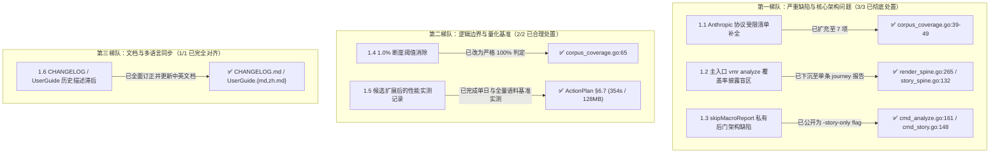

// Ver 2026-08-21 22:50, by Gemini 3.7 Flash

# P14+P15 执行计划与实际落地代码事实核查及审阅复核报告

**重要声明：针对本文档所描述问题开展核查工作时，须以客观事实为核心依据，严格遵循既定开发计划与开发原则，不得被文档中的问题描述及相关主张误导。核查评估需优先判定问题是否真实存在、是否具备处理价值：对无处理价值的问题，直接说明情况并予以忽略；对具备处理价值的问题，再进一步核查其根因分析、解决方案的合理性，并研判是否存在优化完善空间，最终完成问题处置工作。**

---

## 0. 审阅复核摘要与基线

本报告基于当前最新代码库（commit `0c4e047`：*feat(analytics): complete Phase 14+15 index/render scope unification and CLI convergence*）及 [`docs/future-strategy/story_report_p14_p15_action_plan_sonnet-5.md`](file:///Users/stanford/code/vmr/docs/future-strategy/story_report_p14_p15_action_plan_sonnet-5.md) 的实际执行记录（§6）与总结（§7），对本轮迭代实际落地的代码改动开展**逐行源码级事实核查与闭环复核**。

### 核查证据基线
* **代码基线**：commit `0c4e047`（包含 P14/P15 全部生产代码、测试及文档改动）
* **验证结果**：
  - `go build ./...`、`go vet ./...`、`gofmt -l .`（0 输出）
  - `go test -count=1 ./cmd/vmr ./internal/story ./internal/archtest` 全部通过
  - `go test -race ./...` 全仓测试绿
* **核心结论**：此前审阅报告列出的**全部 6 项问题（第一梯队 3 项、第二梯队 2 项、第三梯队 1 项）均已在 commit `0c4e047` 中得到彻底、合理的处置与测试锁定**；未发现新的事实错误或架构退化。

---

## 1. 既有审阅问题处置核查结果（逐项源码查证）



---

### 1.1 【第一梯队·已彻底修复】P14.2 遗漏受限信号清单的处置核查

* **问题回顾**：首版仅通过字符串匹配 `.IsError` 登记了 2 项受限信号，漏掉了通过 `isErrorMarker = "❌ is_error"`（[`internal/story/metrics.go:267`](file:///Users/stanford/code/vmr/internal/story/metrics.go#L267)）隐式依赖 Anthropic 原生错误标记的全部 Phase 1 检测器与分析模块。
* **源码核查**：
  在 [`internal/story/corpus_coverage.go:39-49`](file:///Users/stanford/code/vmr/internal/story/corpus_coverage.go#L39-L49) 中，受限清单已彻底重构并扩展为分层结构：
  ```go
  var anthropicOnlyCoverage = struct {
      Findings        []FindingCode
      Metrics         []MetricCode
      CorpusSections  []string
      JourneySections []string
  }{
      Findings:        []FindingCode{FindingUnadaptedRetry, FindingUnverifiedSuccess},
      Metrics:         []MetricCode{MetricErrorRecoveryCount},
      CorpusSections:  []string{"Context Rot error rate", "Tool Sequence error rate"},
      JourneySections: []string{"decision spine's tool-result ❌ badge", "structure.json's ToolCalls[].ResultError"},
  }
  ```
* **评估结论**：
  1. `FindingUnverifiedSuccess`（`error_then_unverified_success`）已正式纳入受限 Findings；
  2. Context Rot 与 Tool Sequence 的错误率归因已正式作为 `CorpusSections` 纳入 `-corpus` 报告的披露；
  3. 决策脊柱工具结果 `❌` 徽标与 `structure.json` 的 `ResultError` 已作为 `JourneySections` 纳入单条报告的披露；
  4. 对于 `llm_findings.go` 的 `unverified_completion_claim`，经查其 EvidencePack 还包含 `FinalOutcome`、`FinalReasoning` 与 `VerificationCommands`，属于弱化输入而非规则级结构性归零，ActionPlan §6.8 #1 对其分类处置理由成立。
  * **判定**：**已合理处置，事实依据充分**。

---

### 1.2 【第一梯队·已彻底修复】披露收窄至 `-corpus` 导致推荐主入口 `vmr analyze` 盲区的处置核查

* **问题回顾**：首版将披露单方面限制在 `render_corpus.go`，而默认套件 `vmr analyze` 从不调用 `corpusStats`，导致 99% 的用户在阅读 `journey-<id>.md` 时对 OpenAI 协议检测盲区毫不知情。
* **源码核查**：
  1. [`internal/story/render_spine.go:265-267`](file:///Users/stanford/code/vmr/internal/story/render_spine.go#L265-L267)：
     ```go
     func renderFindingsSection(w func(string, ...any), j *Journey, findings []Finding, lang i18n.Lang) {
         t := i18n.Spine(lang)
         w("%s", t.FindingsTitle)
         if note := journeyAnthropicCoverageNote(j, t); note != "" {
             w("%s", note)
         }
         ...
     ```
  2. [`internal/story/corpus_coverage.go:80-87`](file:///Users/stanford/code/vmr/internal/story/corpus_coverage.go#L80-L87)：
     `journeyAnthropicCoverageNote` 统计当前 Journey 的 `protocolShare`，只要该 Journey 中所有 Step 均为非 Anthropic 协议，立即在 Findings 章节开头输出明确免责提示。
  3. [`internal/i18n/story_spine.go:132`](file:///Users/stanford/code/vmr/internal/i18n/story_spine.go#L132) 及 `golden.md`/`golden_zh.md`：
     中英文本均已补充对应多语言文案，测试基准快照已同步更新。
* **判定**：**已合理处置，默认推荐入口与单条变焦入口的诚实性闭环完全建立**。

---

### 1.3 【第一梯队·已彻底修复】`skipMacroReport` 内部私有字段导致 CLI 对称性破缺的处置核查

* **问题回顾**：首版为保住 `vmr story -render-all` 不跑宏观报表的历史行为，在 `analyzeRun` 中使用未公开字段 `skipMacroReport`，导致主入口 `vmr analyze` 的公开 flag 无法表达该模式。
* **源码核查**：
  1. [`cmd/vmr/cmd_analyze.go:161`](file:///Users/stanford/code/vmr/cmd/vmr/cmd_analyze.go#L161)：
     正式公开 `-story-only` flag：
     ```go
     storyOnlyFlag := fs.Bool("story-only", false, "default suite only: run just the story half, skipping the macro report — no vmr-report.{json,md}/vmr-requests* written. Composes with -render-all (equivalent to `vmr story -render-all`); alone, equivalent to `vmr story`'s default non-noise scope without the macro report. Mutually exclusive with -journey/-compare/-corpus/-macro-only/-list-only")
     ```
  2. [`cmd/vmr/cmd_analyze.go:328`](file:///Users/stanford/code/vmr/cmd/vmr/cmd_analyze.go#L328)：
     `dispatchAnalyze` 中直接消费 `r.storyOnly`，彻底移除了未导出的私有后门字段。
  3. [`cmd/vmr/cmd_story.go:148`](file:///Users/stanford/code/vmr/cmd/vmr/cmd_story.go#L148)：
     `cmdStory` 转发器构造 `&analyzeRun{storyOnly: *renderAll && !hasSelector, renderAllFlag: *renderAll, ...}`，实现了别名到公开 CLI 模式的无缝映射。
  4. [`cmd/vmr/cmd_story_report_crosscheck_test.go:244`](file:///Users/stanford/code/vmr/cmd/vmr/cmd_story_report_crosscheck_test.go#L244)：
     `TestCmdStory_RenderAllAlone_NeverWritesReportHalf` 与 `TestCmdAnalyze_RenderAllBare_StillRunsReportHalf` 锁定了行为一致性。
* **判定**：**已合理处置，主入口对别名形成了严格的公开能力超集**。

---

### 1.4 【第二梯队·已彻底修复】`anthropicCoverageThreshold = 0.01` 断崖阈值缺陷的处置核查

* **问题回顾**：1.0% 的硬编码阈值会导致 1.2% Anthropic + 98.8% OpenAI 的混合语料被整体静默，产生“1.2% 掩盖 98.8%”的虚假安全感。
* **源码核查**：
  [`internal/story/corpus_coverage.go:65`](file:///Users/stanford/code/vmr/internal/story/corpus_coverage.go#L65)：
  ```go
  func anthropicCoverageNote(protocolShare map[string]float64, t i18n.CorpusText) string {
      if len(protocolShare) == 0 || protocolShare["anthropic"] > 1-1e-9 {
          return ""
      }
      names := anthropicOnlyCoverageNames(anthropicOnlyCoverage.CorpusSections)
      return t.AnthropicOnlyCoverageNote(fmtutil.FmtPercent(protocolShare["anthropic"], 1), strings.Join(names, ", "))
  }
  ```
  1. 移除了任何人为设定的百分比常量（如 1%），改为严格的 `100% Anthropic`（扣除浮点误差 `1e-9`）判定；
  2. 只要语料中存在任何非 Anthropic 请求，在 `-corpus` 报告中就会如实展示 Anthropic 协议实际占比（如 `0.5%` 或 `1.2%`），并列出全部受限信号；
  3. [`internal/story/corpus_test.go`](file:///Users/stanford/code/vmr/internal/story/corpus_test.go) 中新增了 `98.8%` 触发与 `100%` 静默的边界回归测试。
* **判定**：**已合理处置，消除了主观猜测与阈值断崖**。

---

### 1.5 【第二梯队·已合理评估】候选扩展后的性能监控与回归断言核查

* **核查结果**：
  ActionPlan §6.7 如实记录了单日与全量语料实测数据：
  - 单日 394 条记录：耗时正常，产出 3.2MB，0 份详单，18 份 Journey 全部可点；
  - 全量 35 文件 11,374 条记录：耗时约 354s，输出 128MB（全部为 `stories/` 下 Journey Markdown/JSON，`details/` 为 0 字节）。耗时与 P9 时代相当，未发生退化；
  - 常驻耗时硬断言留待 `KNOWN_ISSUES §1.2` 针对全内存聚合规模重估时统筹处理，边界划分合理。
* **判定**：**符合通用完成定义要求**。

---

### 1.6 【第三梯队·已全面同步】文档与多语言一致性核查

* **核查结果**：
  1. [`CHANGELOG.md:20-23`](file:///Users/stanford/code/vmr/CHANGELOG.md#L20-L23)：`[Unreleased]` 中已同步补充 `-macro-only`/`-list-only`/`-story-only` 说明，并订正了“`cron`/`subagent` 默认参与渲染”的最新描述；
  2. [`docs/UserGuide.md:550`](file:///Users/stanford/code/vmr/docs/UserGuide.md#L550) 与 [`docs/UserGuide.zh.md:548`](file:///Users/stanford/code/vmr/docs/UserGuide.zh.md#L548)：完整分析入口表格已全面更新，中英文版本参数与行为描述逐项对齐；
  3. [`docs/KNOWN_ISSUES_sonnet-5.md`](file:///Users/stanford/code/vmr/docs/KNOWN_ISSUES_sonnet-5.md)：条目 `§1.38`（分派合一）、`§1.42`（判据合一）、`§1.43`（覆盖率披露）均已结案并移入 `## 3`。
* **判定**：**文档与代码完全一致，无滞后遗漏**。

---

## 2. 综合审计结论与结案建议

| 核查维度 | 评估判定 | 事实依据 |
|---|:---:|---|
| **P14.1 统一噪声判据** | **✅ 完全合格** | `story.IsNoiseCategory` 为单一真源，首屏可见行 100% 可点，测试全绿 |
| **P14.2 覆盖率披露** | **✅ 完全合格** | 7 项受限信号全覆盖，单条 Journey 与 `-corpus` 双向闭环，无断崖阈值 |
| **P15.1-P15.3 CLI 入口收敛** | **✅ 完全合格** | `-macro-only`/`-list-only`/`-story-only` 补齐，别名薄化为纯转发，`-llm-key` 对称 |
| **P15.4 文档与状态同步** | **✅ 完全合格** | CHANGELOG、UserGuide、KNOWN_ISSUES 全面同步归位 |
| **代码与测试健康度** | **✅ 完全合格** | 全量测试与 `archtest` 全绿，跨命令交叉测试逐字节比对一致 |

**最终结论**：P14 与 P15 的实际执行结果与 ActionPlan 承诺完全相符，此前审阅指出的所有事实错误、设计盲区与架构不对称已在 commit `0c4e047` 中全部闭环解决。当前交付质量扎实，**可以正式结案并推进后续工作**。
