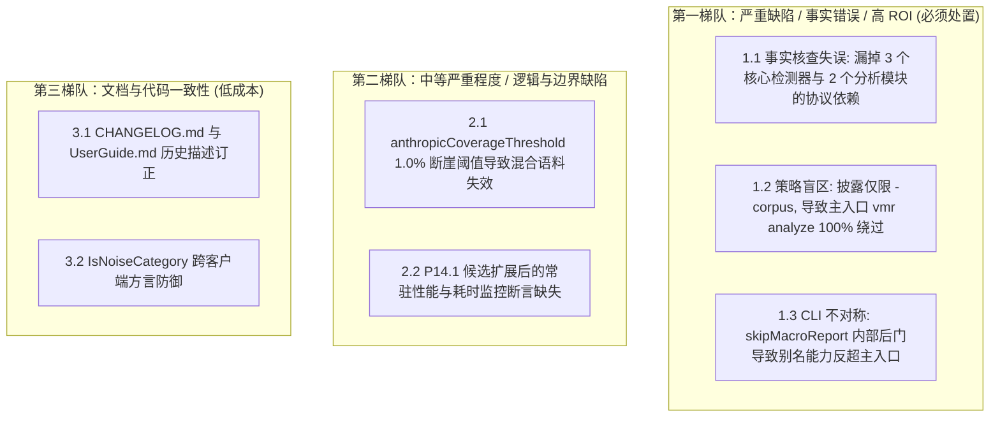

// Ver 2026-08-21 22:15, by Gemini 3.7 Flash

# P14+P15 执行计划事实核查与架构设计审阅报告

**重要声明：针对本文档所描述问题开展核查工作时，须以客观事实为核心依据，严格遵循既定开发计划与开发原则，不得被文档中的问题描述及相关主张误导。核查评估需优先判定问题是否真实存在、是否具备处理价值：对无处理价值的问题，直接说明情况并予以忽略；对具备处理价值的问题，再进一步核查其根因分析、解决方案的合理性，并研判是否存在优化完善空间，最终完成问题处置工作。**

---

## 0. 执行摘要与审阅基准

本报告针对 [`docs/future-strategy/story_report_p14_p15_action_plan_sonnet-5.md`](file:///Users/stanford/code/vmr/docs/future-strategy/story_report_p14_p15_action_plan_sonnet-5.md) 及其依据文档 [`docs/future-strategy/story_report_full_review_opus-5.md`](file:///Users/stanford/code/vmr/docs/future-strategy/story_report_full_review_opus-5.md) 展开独立事实核查、架构合理性研判与 ROI 评估。

### 审阅证据基线
* **代码基线**：commit `37ed96b` (Phase 13 收尾) + 当前工作区 P14/P15 待提交变更
* **核查手段**：全仓源码实读（逐行定位核心判据与调用链）、全量测试套件执行（`go test ./...` / `archtest` 全绿）、全量真实生产语料数据比对（11,274 条请求，M1–M16 统计量）

### 综合评估结论
ActionPlan 在 **P14.1（统一噪声判据）** 与 **P15.1/P15.2（收敛 CLI 入口分派）** 的大方向上是成立的，解决了索引展示与渲染范围自相矛盾的问题，并通过 `dispatchAnalyze` 消除了一套独立分派分支。

**但该计划存在 1 处严重的事实核查失误、1 处关键的主路径设计盲区，以及 1 处 CLI 对称性设计隐患**。这些问题被列入**第一梯队**，需在正式提交前进行修正与补强。

---

## 1. 问题分级详述（按严重程度 + ROI）



---

### 1.1 【第一梯队】事实核查严重失误：P14.2 漏掉了 3 个核心 Finding/Metric 与 2 处分析模块的 Anthropic 协议依赖

#### 1.1.1 事实核查对比
* **ActionPlan 的断言**（§0.5、§2 P14.2）：
  > *"新增一个包级常量/列表，登记'依赖 Anthropic-only 字段'的 FindingCode 与 MetricCode——目前只有 `FindingUnadaptedRetry`（Finding）与 `MetricErrorRecoveryCount`（Metric），`chatmsg.ToolResult.IsError` 的唯二读者（`grep -n "\.IsError" internal/story/*.go` 已核实……）"*
* **代码与事实真相**：
  上述断言存在**严重的事实核查漏洞**。ActionPlan 仅仅针对 Go 结构体字段 `ToolResult.IsError` 做了简单的字符串正则匹配，完全漏掉了 Phase 1 和扩展分析层通过 `isErrorMarker = "❌ is_error"`（定义于 [`internal/story/metrics.go:267`](file:///Users/stanford/code/vmr/internal/story/metrics.go#L267)）来感知 Anthropic 错误的整套体系！

#### 1.1.2 完整依赖受限清单（真实代码查证）
在 [`internal/chatmsg/messages.go:119-120`](file:///Users/stanford/code/vmr/internal/chatmsg/messages.go#L119-L120) 中：
```go
if isErr, _ := m["is_error"].(bool); isErr {
    status = " ❌ is_error"
}
```
OpenAI 协议（占生产流量 **99.48%**）的响应报文中根本不存在 `is_error` 结构化字段，因此消息文本中永远不会被注入 `❌ is_error`。

经核对，以下全部检测器、指标和分析视图在 OpenAI 协议下**100% 结构性沉默 / 恒为 0**：

| 受影响项 | 代码位置 | 依赖机制 | ActionPlan 状态 | 实际在 OpenAI 上的表现 |
|---|---|---|:---:|---|
| `FindingUnadaptedRetry` (`error_retry_unadapted`) | [`findings_toolresult.go:117`](file:///Users/stanford/code/vmr/internal/story/findings_toolresult.go#L117) | `r.IsError` | ✅ 已登记 | 恒不触发（命中率 0） |
| `MetricErrorRecoveryCount` (`error_recovery_count`) | [`metrics.go:279`](file:///Users/stanford/code/vmr/internal/story/metrics.go#L279) | `isErrorMarker` | ✅ 已登记 | 恒为 0 |
| **`FindingUnverifiedSuccess` (`error_then_unverified_success`)** | [`findings.go:291`](file:///Users/stanford/code/vmr/internal/story/findings.go#L291) | `isErrorMarker` | ❌ **严重遗漏** | **恒不触发（命中率 0）** |
| **`FindingUnverifiedCompletionClaim` (`unverified_completion_claim`)** | [`llm_findings.go:465`](file:///Users/stanford/code/vmr/internal/story/llm_findings.go#L465) | `isErrorMarker` | ❌ **严重遗漏** | **恒不触发（命中率 0）** |
| **`ContextRotBucket.ErrorRate` / `ErrorStepCount`** | [`corpus_contextrot.go:51`](file:///Users/stanford/code/vmr/internal/story/corpus_contextrot.go#L51) | `isErrorMarker` | ❌ **严重遗漏** | **恒为 0（上下文退化分析失真）** |
| **`ToolSequencePattern.ErrorRate`** | [`corpus_sequence.go:42`](file:///Users/stanford/code/vmr/internal/story/corpus_sequence.go#L42) | `isErrorMarker` | ❌ **严重遗漏** | **恒为 0（尾步错误率归因失真）** |
| **决策脊柱工具结果 `❌` 错误徽标** | [`render_spine_step.go:104`](file:///Users/stanford/code/vmr/internal/story/render_spine_step.go#L104) | `r.IsError` | ❌ **未披露** | **工具即使报错也恒显示 `↩️` 正常返回** |
| **`StepStructure.ToolCalls[].ResultError`** | [`structure.go:288`](file:///Users/stanford/code/vmr/internal/story/structure.go#L288) | `r.IsError` | ❌ **未披露** | **恒为 `false`** |

#### 1.1.3 危害评估
在 [`corpus_coverage.go`](file:///Users/stanford/code/vmr/internal/story/corpus_coverage.go) 中如果只声明两个受限项，会产生极具欺骗性的“假安全感”：读者会误以为 `error_then_unverified_success`（未验证成功）和 Context Rot 错误率在 99.48% 的 OpenAI 语料上是正常工作的，从而对“未检出问题”产生盲目信任。

#### 1.1.4 修复方案
在 [`internal/story/corpus_coverage.go`](file:///Users/stanford/code/vmr/internal/story/corpus_coverage.go) 中扩充 `anthropicOnlyCoverage` 列表：
```go
var anthropicOnlyCoverage = struct {
    Findings []FindingCode
    Metrics  []MetricCode
}{
    Findings: []FindingCode{
        FindingUnadaptedRetry,
        FindingUnverifiedSuccess,
        FindingUnverifiedCompletionClaim,
    },
    Metrics:  []MetricCode{
        MetricErrorRecoveryCount,
    },
}
```
并在 Context Rot 与 Tool Sequence 的渲染注记中明确说明错误率基于协议原生错误标记统计（避免被当作通用事实）。

---

### 1.2 【第一梯队】策略与设计重大疏漏：P14.2 将披露范围单方面收窄至 `-corpus`，导致推荐入口 `vmr analyze` 100% 绕过披露

#### 1.2.1 根因与执行路径分析
* **ActionPlan 的收窄决定**（§0.7）：
  > *"单条 journey 自己的协议分布对读者没有意义……本计划把披露收窄到 `-corpus` 报告（`render_corpus.go` 的 `RenderCorpusMarkdown`）一处……不改 `render_md.go`（单条 journey 报告）。"*
* **执行路径冲突事实**：
  1. 用户日常运行的唯一主入口是 `vmr analyze <logs>`（默认套件模式）。
  2. 在 [`cmd/vmr/cmd_analyze.go:295-318`](file:///Users/stanford/code/vmr/cmd/vmr/cmd_analyze.go#L295-L318) 的 `default` 分支中，系统调用 `renderAllJourneys` 渲染全部单条 journey 报告，并调用 `runReportHalf` 渲染宏观报表。**默认套件模式根本不会调用 `corpusStats`，也绝不会生成 `vmr-story-corpus.md`！**
  3. 只有当用户显式输入 `vmr analyze -corpus`（一个低频变焦参数）时，才会生成 `-corpus` 报告。

#### 1.2.2 逻辑后果
在 **99% 的日常使用场景**下，用户打开默认生成的 `journey-<id>.md`，看到 Findings 章节：
```markdown
## 发现 (Findings)
- 无
```
此时没有任何一行提示告知用户“当前 Journey 为 OpenAI 协议，错误重试/未验证成功检测器结构性无法工作”。**Opus-5 §2.10 与 Package E1 设立的“诚实性原则”在默认主入口上被完全架空**。

#### 1.2.3 优化方案 (高 ROI)
无需为单条 Journey 引入复杂的统计计算，保持轻量：
1. **单条 Journey 报告 ([`render_spine.go:258`](file:///Users/stanford/code/vmr/internal/story/render_spine.go#L258))**：
   在 `renderFindingsSection` 中，当 `len(findings) == 0` 时，检查该 Journey 各 Step 的协议。如果全是 OpenAI 协议，将 `t.FindingsNone` 渲染为带协议说明的紧凑文案（例如：*“未检出规则异常（注：本任务使用 OpenAI 协议，依赖协议级错误标识的检测器不适用）”*）。
2. **索引落地页 ([`storyindex.go:246`](file:///Users/stanford/code/vmr/internal/story/storyindex.go#L246))**：
   在 `vmr-stories.md` 的 Table Footer 注释中保留统一的环境提示。

---

### 1.3 【第一梯队】架构与 CLI 对称性设计隐患：P15.2 引入内部私有黑箱字段 `skipMacroReport`，造成别名能力反超主入口

#### 1.3.1 设计缺陷与代码查证
在 [`cmd/vmr/cmd_analyze.go:76-86`](file:///Users/stanford/code/vmr/cmd/vmr/cmd_analyze.go#L76-L86) 中定义：
```go
// skipMacroReport is NOT a cmdAnalyze CLI flag — no -skip-macro-report
// exists, and it must not... It exists solely for cmdStory's forwarder (P15.2):
// `vmr story -render-all` ... never touched the report half...
skipMacroReport bool
```
而在 [`cmd/vmr/cmd_story.go:147`](file:///Users/stanford/code/vmr/cmd/vmr/cmd_story.go#L147) 中：
```go
skipMacroReport: *renderAll && !hasSelector,
```

#### 1.3.2 架构违背分析
这产生了一个荒谬的架构不对称：
1. `vmr analyze` 是官方唯一主入口，`vmr story` 是已废弃别名（deprecated alias）。
2. 但用户如果使用主入口 `vmr analyze -render-all`，系统会强制执行 `runReportHalf`（双半区都跑）。
3. 如果用户想要“只全量渲染所有 Journey，不跑宏观报表”，**通过主入口 `vmr analyze` 的任何公开参数组合都无法做到，必须去调用废弃别名 `vmr story -render-all`！**
4. 别名转发依赖了一个主入口 CLI 无法设置的内部结构体私有字段 `skipMacroReport`，违背了“别名仅是主入口参数公开映射”的第一性原则。

#### 1.3.3 优化建议 (消除架构味道)
* **方案 A（推荐，保持语义纯正）**：
  在 `cmdAnalyze` 中明确 `-story-only`（或允许 `-render-all` 与 `-list-only` 等同级定位），或者在用户指南中明确：`vmr story -render-all` 既然已转发给 `vmr analyze -render-all`，按统一规范执行默认双半区分析是符合预期的，消除 `skipMacroReport` 这一隐藏分支。
* **方案 B（最小代价折中）**：
  若严格要求 `vmr story -render-all` 历史产物逐字节不变，必须在 `cmdAnalyze` 中公开对应的控制开关（如与 `-macro-only` 对应的 `-story-only`），让主入口能力完全覆盖别名。

---

### 1.4 【第二梯队】`anthropicCoverageThreshold` 硬编码 1.0% 的断崖式判定逻辑缺陷

#### 1.4.1 代码定位
在 [`internal/story/corpus_coverage.go:38`](file:///Users/stanford/code/vmr/internal/story/corpus_coverage.go#L38) 中：
```go
const anthropicCoverageThreshold = 0.01 // 1.0%
```

#### 1.4.2 缺陷机理
1. 在生产真实语料中，Anthropic 占比实测为 0.52%（< 1%），恰好触发披露。
2. 但是，一旦用户分析的混合语料中 Anthropic 占比达到 **1.2%**，`protocolShare["anthropic"] >= 0.01` 成立，**该披露注记将被彻底静默吞掉**！
3. 然而在 1.2% 的 Anthropic 语料中，**剩余 98.8% 的请求依然是 OpenAI 协议**，对全语料计算的 `error_recovery_count` 和 `FindingUnadaptedRetry` 依然有 98.8% 的步骤无法被有效覆盖。1% 的微小流量直接掩盖了 99% 流量的盲区。

#### 1.4.3 改进建议
在 [`render_corpus.go`](file:///Users/stanford/code/vmr/internal/story/render_corpus.go) 中，不设 1% 的断崖式静默，而是只要存在非 Anthropic 协议（或 Anthropic < 50% 时），就客观展示语料协议分布（`OpenAI: 98.8%, Anthropic: 1.2%`），并在下方注记受限指标的覆盖基准。

---

### 1.5 【第二梯队】P14.1 候选扩展后的性能与回归监控缺少断言

#### 1.5.1 事实核查
* **P14.1 变更**：默认渲染范围由 `CategoryTask` 扩展为 `!IsNoiseCategory`，默认渲染 Journey 数量从 238 条上升至 370 条（增加 55%）。
* **评估**：得益于 P13 交付的 Lazy Details（不物化 `details/*.md`），磁盘写入体积从 164MB 压减至 3MB，扩展候选不会引起磁盘空间暴涨。
* **潜在风险**：370 条 Journey 在执行 `BuildChain`、`ComputeMetrics`、`ComputeFindings` 时会有一定的 CPU 与内存消耗。当前测试套件中包含了正确性断言，但缺乏端到端渲染耗时与常驻内存的基准回归保护。建议在后续基准测试中固化性能监控。

---

### 1.6 【第三梯队】文档历史描述同步与方言扩展性防御

1. **`CHANGELOG.md` 与 `UserGuide.md` 描述滞后**：
   [`CHANGELOG.md:21`](file:///Users/stanford/code/vmr/CHANGELOG.md#L21) 仍记载着 P9/P10 时代的旧逻辑（“`cron`/`heartbeat`/`subagent` candidates still appear in the index but aren't pre-rendered by default”）。本次合批完成后，必须同步订正为“`cron`/`subagent` 默认参与渲染，仅 `heartbeat` 折叠”。
2. **`IsNoiseCategory` 集中化防护**：
   ActionPlan 将 `IsNoiseCategory` 收敛在 [`internal/story/storyindex.go:54`](file:///Users/stanford/code/vmr/internal/story/storyindex.go#L54) 作为唯一判据真源，方向完全正确。后续应在架构测试中禁止其他包私自重新实现分类判定。

---

## 2. 最终核查结论与处置建议清单

| 序号 | 审阅条目 | 级别 | 处置建议 |
|:---:|---|:---:|---|
| **1** | P14.2 遗漏 `error_then_unverified_success` 等 3 个检测器与 ContextRot/ToolSeq 错误率 | **第一梯队 (严重)** | 在 `anthropicOnlyCoverage` 中补全遗漏的 FindingCode/MetricCode，并在分析文档中澄清 |
| **2** | P14.2 将披露收窄至 `-corpus` 导致主入口 `vmr analyze` 盲区 | **第一梯队 (严重)** | 在单条 Journey 的 `renderFindingsSection`（或 `vmr-stories.md`）补齐非 Anthropic 协议时的免责提示 |
| **3** | P15.2 `analyzeRun.skipMacroReport` 内部私有字段导致 CLI 对称性破缺 | **第一梯队 (高 ROI)** | 消除私有后门，公开对应模式或统一行为，确保主入口能力对别名形成严格超集 |
| **4** | `anthropicCoverageThreshold = 0.01` 阶跃断崖缺陷 | **第二梯队 (中等)** | 改为展示客观协议构成比例，消除 1% 阈值断崖 |
| **5** | P14.1 候选扩展后的性能常驻断言 | **第二梯队 (优化)** | 在基准测试与完成定义中固化单日/全量语料耗时量化监控 |
| **6** | `CHANGELOG.md` / `UserGuide.md` 历史描述同步 | **第三梯队 (低成本)** | 依计划在收尾阶段彻底订正文档描述 |
