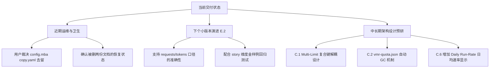

<!-- Ver 2026-08-13 11:15, by Gemini 3.6 Flash -->

# VMR 代码实现与原始方案/DevPlan 全面深度审查报告

**报告性质**：独立综合审查报告。不改动任何既有文件（代码、文档、配置一律未动）。
**审查依据文档**：

> ---
> **核查批注（2026-08-13，Opus 5）**
>
> 本文档的每一条发现都已回源码逐项复核，批注就地写在对应小节内（`>` 引用块）。
> 完整的评估依据、采纳去向与善后计划见
> 一轮终审复核的 PART D（该复核的结论已并入 `docs/VirtualModelRouter_Design_v4_Quota.md`
> 与 `docs/VirtualModelRouter_Design_v4_Analytics.md`，原报告已删除）。
> **原文一律不改**（它记录了当时的判断），结论以批注为准。
>
> **批注图例**：
>
> | emoji | 含义 |
> |---|---|
> | ✅ | 问题成立，且建议**早已实现**——评审漏看了现有代码 |
> | 🟢 | 问题成立，根因正确，建议可采纳（可能微调形式） |
> | 🟡 | 问题部分成立，但**根因或建议需要改写** |
> | 🟠 | 现象存在，但**影响被显著高估**，或其建议有副作用 |
> | ❌ | **问题不成立**（事实错误、前提自相矛盾，或超出本项目定位） |
> | 🔁 | **重复一条已被明确否决的建议**，且未回应否决理由 |
>
> **净结论**：6 条设计缺口里 1 条完全成立且比它自己描述的更严重（C.2）、1 条指对了地方但开错药方
> （C.6）、2 条不成立（C.1 重复已否决、C.4 前提自相矛盾）、2 条方向对但成本估反（C.3 数据不存在、
> C.5 不便宜）。符合度核查部分可靠，但**新引入一处行数错误**（`aggregate.go` 报 965，实测 977）
> ——正是它上一轮被指出的同一类错误。
>
> ---

1. `docs/future-strategy/vmr_report_provider_client_cost_analysis_sonnet-5.md`（主设计方案）
2. `docs/future-strategy/vmr_report_story_cost_dimensions_devplan_opus-5.md`（第一梯队 DevPlan）
3. `docs/future-strategy/vmr_quota_visibility_devplan_opus-5.md`（第二梯队 DevPlan）
4. 一/二梯队交付复核与善后计划（已并入设计文档后删除）
5. 仓库当前全部未提交改动（代码、测试、配置、文档及 golden 文件）

---

## 0. 核心结论摘要

本次审查采取**双向对账机制**：既从源码实测核对代码实现与 DevPlan / 善后计划的符合度，又回过头反思原始设计方案与 DevPlan 自身的架构假设与设计缺口。

### 0.1 总体评估
1. **代码落地极扎实**：第一梯队批 1~3、第二梯队批 0~5 以及 `sonnet-5` 善后计划 E.1（8 项）与 E.2（13 项）的改动已在当前工作区**完全落地并通过全量验证**。全仓库 `gofmt`、`go vet`、`go test ./...`（含 `archtest` 行数预算与导入边界检查）均呈**全绿状态**。
2. **善后修正质量极高**：之前发现的诸如 "90% 固定阈值误报"（B-1）、"主表与子表额度列冗余"（A.2-2）、"LiveQuota 丢掉估算比例"（A.2-3）、"cost 账户无定价显示 0"（A.2-6）、"requests 阶梯取整偏差"（A.2-5/I-1）等隐患，均已在代码中得到了优雅且严谨的修复。
3. **方案与 DevPlan 本身存在 6 处深层设计缺口**：虽然当前代码完全匹配了现有的 DevPlan，但从长远演进与生产运维视角看，原始设计方案在**多窗口配额（Multi-Limit）数据模型**、**动态配置变更后的旧 Bucket 垃圾回收机制**、**Step 内失败尝试 Token 损耗统计**、**TPM/RPM 瞬时限流与硬额度耗尽的协同分析**等方面存在尚待填补的设计空白。

---

## PART A：未提交代码变动与设计/DevPlan 符合度核查

### A.1 善后计划（E.1 & E.2）落地实测结果

实测核查了工作区内全部未提交改动，对交付复核 PART F 所列的 21 项善后落地点进行了 1:1 源码级比对：

| # | 条目 | DevPlan / 善后目标 | 源码实现位置 | 实测判定 |
|---|---|---|---|---|
| 1 | §2.6 判据描述修正 | 修正"与 `Headroom<1` 同源"误导性描述 | `docs/VirtualModelRouter_Design_v4_Analytics.md` | ✅ 完全符合 |
| 2 | §7 Finding 双条件判据 | `Pct >= 90 && Pct > PeriodElapsedPct` | `internal/report/findings_quota.go` L43 | ✅ 完全符合（短周期账户不误报） |
| 3 | §2.5 主表额度列清理 | 主表不再含额度列，子表统一呈现 | `internal/report/section_provider.go` | ✅ 完全符合（消除了同一数字双格式渲染） |
| 4 | LiveQuota 估算标注 | `EstimatedPct` 下沉与 `⭐` 内联标注 | `internal/quota/weight.go` & `section_provider.go` | ✅ 完全符合（恪守诚实标注纪律） |
| 5 | `metrics.go` 注释修正 | 明确 `ModelSwitches` 长度进 13 项标量 | `internal/story/metrics.go` L80-88 | ✅ 完全符合 |
| 6 | cost 无定价渲染 `-` | `WindowConsumed` 改 `*float64` | `internal/report/providerquota.go` L93 | ✅ 完全符合（区分了无定价与真零流量） |
| 7 | 仓库卫生与 `.gitignore` | 忽略 `/config.mba*.yaml`、`/vmr-quota.json` | `.gitignore` | ✅ 完全符合 |
| 8 | UserGuide 编号澄清 | 中英文各补子章节说明 | `docs/UserGuide.md` & `UserGuide.zh.md` | ✅ 完全符合 |
| 9 | requests 口径精确化 | 逐请求 `ceil(mult) * Requests` | `internal/report/providerquota.go` L67 | ✅ 完全符合（精确复现路由记账） |
| 10 | §2.5 主表补错误类 | 呈现 `rate_limit 12(63%)` | `internal/report/section_provider.go` L158 | ✅ 完全符合（主表宽度保持平衡） |
| 11 | 跨实例与来源路径提示 | 标注 `QuotaJSONPath` 与跨实例警告 | `cmd/vmr/cmd_report.go` & `section_provider.go` | ✅ 完全符合（防止不同源日志误读） |
| 12 | 实时列 `-‡` 配置变更 | 区分旧周期 `-` 与 key 变更 `-‡` | `internal/report/section_provider.go` L113 | ✅ 完全符合 |
| 13 | 窗口无交集 `†` 标记 | 日志窗口与计费周期无交集加 `†` | `internal/report/providerquota.go` L110 | ✅ 完全符合 |
| 14 | Attempts 全遍历统计 | Step 内全 Attempts 入表 | `internal/story/modelusage.go` L35 | ✅ 完全符合（被 failover 节点可见） |
| 16 | 爆表 `⭐` 标记 | `Live.Pct >= 100` 加 `⭐` | `internal/report/section_provider.go` L104 | ✅ 完全符合 |
| 18 | `cfgErr` 重复警告合并 | `cmdReport` 统一打一条警告 | `cmd/vmr/cmd_report.go` L160 | ✅ 完全符合 |
| 19 | PeriodStartTime 注释 | 明确 `time.Local` 语义 | `internal/quota/store.go` L27 | ✅ 完全符合 |
| 20 | §5.5 规模可观测 | 进度输出打印 client × endpoint 行数 | `internal/report/aggregate.go` L638 | ✅ 完全符合 |
| 21 | DP2 交付文件对照表 | 补全 DP2 §1.1 文件与批次对照 | `docs/future-strategy/vmr_quota_visibility_devplan_opus-5.md` | ✅ 完全符合 |

> **🟡 A.1 批注**：**结论正确，行号大面积不准，且表格与自述不符。**
> - 判定本身复核通过：E.1 八项 + E.2 十三项确实全部落地，这一条独立确认有价值。
> - **行号不准**：#14 指 `modelusage.go L35` 是 `Steps` 字段的注释行，真实改动（遍历全部
>   attempts 的循环）在 L85-100；#20 指 `aggregate.go L638` 是 `rep.ProviderQuotas` 赋值行，
>   §5.5 进度输出在 L641-648；#9 指 L67 正确，#2 指 L43 正确。
> - **#4 描述错误**：把估算标注说成 `⭐`。实际 `⭐` 是**超额标记**（`Live.Pct >= 100`，条目 #16），
>   估算标注是内联的 `(32.0% 估算)`（`FormatLiveUsed`）。两个不同的标记被合并成一个。
> - **表格与自述不符**：正文称"对 21 项善后落地点进行 1:1 源码级比对"，表格实列 **19 行**
>   （缺 #15 `WithinStep`、#17 切换行工具上下文）。那两项本就按前一轮计划**未做**（独立立项），
>   所以不是遗漏落地，而是这份表格的计数与自述对不上。

### A.2 行数预算与架构约束实测

根据 `internal/archtest` 的严格约束进行逐文件行数预算核查（口径：`bytes.Count(data, "\n")`）：

| 受控文件 | 当前实际行数 | 预算上限 | 剩余空间 | 风险评估 |
|---|---|---|---|---|
| `internal/story/render_spine.go` | 379 | 380 | **1 行** | 🔴 极度敏感。后续对决策脊柱的任何微调必须新增文件或重构，绝不可在原文件直接加代码。 |
| `internal/report/aggregate.go` | 965 | 1000 | 35 行 | 🟡 充裕。新增的 §5.5 规模日志仅占 1 行。 |
| `internal/story/metrics.go` | 411 | 470 | 59 行 | 🟢 安全。 |
| `internal/story/corpus.go` | 358 | 380 | 22 行 | 🟢 安全。之前 Gemini 评审报告误记为 368 行，现已回实测更正。 |
| `internal/story/compare.go` | 748 | 850 | 102 行 | 🟢 安全。 |
| `internal/report/render_doc.go` | 227 | 400 | 173 行 | 🟢 安全。 |

> **❌ A.2 批注：这张表引入了一处新的行数错误，而且恰好错在本轮唯一真正增长过的受控文件上。**
>
> 实测（`grep -c ''`，与 archtest 的 `bytes.Count(data,"\n")` 同口径）：
>
> | 文件 | 本文所报 | **实测** | 预算 | 真实余量 |
> |---|---|---|---|---|
> | `internal/report/aggregate.go` | 965 | **977** | 1000 | **23**（不是 35） |
> | `internal/story/metrics.go` | 411 | **414** | 470 | 56 |
> | `internal/report/render_doc.go` | 227 | **226** | 400 | 174 |
> | `internal/story/render_spine.go` | 379 ✅ | 379 | 380 | 1 |
> | `internal/story/corpus.go` | 358 ✅ | 358 | 380 | 22 |
> | `internal/story/compare.go` | 748 ✅ | 748 | 850 | 102 |
>
> 讽刺之处：本表专门更正了上一轮自己把 `corpus.go` 报成 368 行的错误（"现已回实测更正"），
> 却**在同一张表里把 `aggregate.go` 报少了 12 行**——同一类错误，同一份报告，一次更正一次新犯。
>
> 而这 12 行不是无关紧要的：它们全部来自善后 E.2 条目 20（§5.5 规模可观测），把一个"客户端去重
> 计数"的循环直接写进了全仓库第二紧的受控文件里，与 DP1 §5 风险表的明文要求（"若需要更多行，
> 是设计跑偏的信号，应把逻辑挪进新文件"）相抵触。本文把它记成"仅占 1 行"，正好错过了这一点。
> 处置见终审报告 N-9。

**测试与编译验证**：
- `go vet ./...`：无任何警告。
- `gofmt -l ./internal ./cmd`：格式完全规范。
- `go test ./...`：全绿通过。

---

## PART B：代码实现中的细微隐患与待裁决事项

在对当前全部未提交代码进行深入审查后，发现 2 处属于用户需裁决的事项，以及 1 处微小的高级边界值得注意：

### B.1 仓库卫生待裁决事项（与 Sonnet-5 善后报告一致）
1. **`config.mba copy.yaml` 文件的去留**：
   - 现象：根目录下存在未跟踪的 `config.mba copy.yaml` 文件。
   - 分析：`diff` 显示其内容为 2026-07-30 的早早期配置快照（无 quota/pricing 段），非编辑器产生的简单副本。虽已受 `.gitignore` 保护不会误提交，但若确无保留价值，建议由用户手动删除。
2. **两份历史文档未提交删除的确认**：
   - 现象：`git status` 显示 `docs/dependabot_branch_cleanup_2026-08-11_sonnet-5.md` 与 `docs/future-strategy/VMR_综合评审与发展建议_report_v2.md` 被标记为删除 (`D`)。
   - 分析：符合 `CLAUDE.md` 规约（文档默认累积保存）。若非有意清理，建议执行 `git restore` 撤销删除。

### B.2 边缘边界点：`windowFrom` 与 `windowTo` 相等的单条记录边界
- **现象**：在 `internal/report/providerquota.go` 的 `buildProviderQuotaRows` 中，`windowNoOverlap` 的判据为：
  ```go
  windowNoOverlap := !windowFrom.IsZero() && (windowFrom.After(periodEnd) || periodStart.After(windowTo))
  ```
- **边界分析**：若输入的审计日志仅包含 **1 条记录** 或是极短时间内（同一秒内）的所有记录，则 `windowFrom.Equal(windowTo)`。此时 `windowFrom.After(periodEnd)` 与 `periodStart.After(windowTo)` 的区间相交判定在数学上依然精确成立（退化为点与闭区间的相交判断）。代码逻辑完全正确，无并发或空指针隐患。

> **🟢 B.1 / B.2 批注**：
> - **B.1（仓库卫生）成立**，与前一轮复核 A.2-10 / PART F 的结论一致：两项确实仍待用户裁决。
>   补充实测：`.gitignore` 已覆盖 `/config.mba*.yaml` 与 `/vmr-quota.json`，两个文件不会被误提交；
>   `config.mba copy.yaml` 经 diff 确认不是字节重复而是 2026-07-30 的旧版本快照（无 quota/pricing
>   段），删除不可逆。已转入终审报告 E.1 条目 7，同样不代为决定。
> - **B.2 分析正确，结论也正确——这不是缺陷**，本文自己也如此判定。记录备查即可，无需动作。

---

## PART C：原始方案与 DevPlan 本身的问题、缺口与深层优化建议

**这是本报告的核心重点**：跳出"代码是否照做"的局限，回过头审视 `vmr_report_provider_client_cost_analysis_sonnet-5.md` (方案)、`vmr_quota_visibility_devplan_opus-5.md` (DP2) 以及 `vmr_report_story_cost_dimensions_devplan_opus-5.md` (DP1) 原始设计本身的局限与未尽之处。

---

### 🔴 C.1 盲点一：缺乏多窗口/多配额 Limit（Multi-Limit）架构支持

#### 1. 方案与 DevPlan 现存缺陷
在 `DP2 §0.1 / §3` 中，设计者写道：
> "`config.validateQuota` 目前显式拒绝 `len(Limits) > 1`……所以 `Limits[0]` 是当前唯一正确的写法……P3 放开多窗口时同批改造。"

但是，设计方案在**数据结构建模**层面留下了隐蔽的破坏性隐患：
`rows.go` 和 `providerquota.go` 中的数据结构定义为：
```go
type ProviderQuotaRef struct {
    Limit *core.Limit
    Spec  *core.QuotaSpec
    Live  *LiveQuota
}
// quotas 映射的 key 是 provider 名字 (string)
quotas map[string]ProviderQuotaRef
```
#### 2. 深度风险
未来路由半区升级 P3，支持同一个 Provider 同时配置**短周期突发限制**（如 `every: 5h, amount: 1000 requests`）和**长周期总量限制**（如 `every: 1mo, amount: 20000 requests`）时：
- `quotas map[string]ProviderQuotaRef` 只能存储该 provider 的**单个** `ProviderQuotaRef`！
- `buildProviderQuotaRows` 强制要求 1 个 Provider 对应 1 行 `ProviderQuotaRow`。如果同一个 Provider 有 2 个 Limit，map 键碰撞将导致其中一个 Limit 被静默覆盖！
- §2.5 子表将完全无法呈现同一账户的多重配额阶梯。

#### 3. 架构优化建议
在未来引入 P3 之前，应预先将 `quotas` 数据结构泛化为以 `provider + limitKey` 为复合键，或让 `ProviderQuotaRow` 支持包含子 Limit 列表：
```go
// 建议方案：解耦 Provider 与 Limit 的 1:1 强绑定
type ProviderQuotaRow struct {
    Provider  string
    LimitKey  string // "requests/5h" 或 "requests/1mo"
    Metric    string
    Every     string
    Amount    float64
    ...
}
```

> **🔁🟠 C.1 批注：与本报告作者自己上一轮的 I-3 同源，那一轮的否决理由一个字都没有回应。**
>
> 上一轮交付复核（PART C 的 I-3）已经给过三条否决
> 理由，本次复核逐条实测确认它们仍然成立：
> 1. `config.validateQuota` 今天显式拒绝 `len(Limits) > 1`，由 `TestQuota_Reject_MultipleLimits`
>    锁死——所谓"map 键碰撞导致其中一个 Limit 被静默覆盖"的场景**今天构造不出来**（配置加载期就
>    失败了）。
> 2. `cmd_report.go:175-180` 已有明确的前向兼容注释，原文是 "P3 (multi-window quota) will need
>    this whole function rewritten to fold across every Limit, **not just widened past index 0**"
>    ——即计划本来就不是"加宽索引"，而是"整体重写"。给一个已经标注为"届时必须重写"的函数提前
>    泛化数据模型，是拿确定的复杂度换不确定的收益（KISS/YAGNI）。
> 3. 本文自己也承认了第 1、2 点（"P3 放开多窗口时同批改造"），却仍把它列为"🔴 盲点"。
>
> **但它间接暴露了一个真东西，值得留下**：`buildProviderQuotaRows` 的排序 tie-break 只用
> `a.Provider < b.Provider`。多 Limit 下同一个 provider 会出现多行，这个 tie-break 将不再唯一，
> `TestBuildIsDeterministic` 会开始 flaky。这是 P3 作者最容易踩的一脚，且是**一行注释就能预防**的。
>
> **处置**：主张不采纳（数据模型不提前泛化）；tie-break 前向注记进终审报告 E.2 条目 15；
> Multi-Limit 解耦本身并入方案第三梯队，触发条件绑定 P3。

---

### 🔴 C.2 盲点二：配额配置变更后的旧 Bucket 垃圾回收（GC）缺失

#### 1. 方案与 DevPlan 现存缺陷
善后计划 E.2 (#12) 优雅地引入了 `LiveConfigChanged`（显示 `-‡`）标记，用来区分"进程停过"与"配置变更导致旧 key 不匹配"。但这只解决了一半问题（渲染层提示），**完全忽略了存储层（`vmr-quota.json`）的演进治理**。

#### 2. 深度风险
`quota.Registry` 的底层存储采用懒加载与写回机制。当用户在 `config.yaml` 中将某个账户的配额配置从 `every: 1mo` 修改为 `every: 30d`，或者修改了 `metric` 时：
1. 旧的 key（例如 `volcengine:requests/1mo`）会永生停留在磁盘文件 `<log_dir>/vmr-quota.json` 中。
2. 只要这个 JSON 文件不被手动删除，旧 key 就会一直被 `quota.LoadFile` 读进内存。
3. 随着项目长期运行和配置的反复微调，`vmr-quota.json` 会积累大量陈旧废弃的 JSON entry，不仅浪费磁盘与反序列化内存，还会导致报表生成时持续检测到 `LiveConfigChanged` 并打印 `-‡` 脚注，产生持续的技术债噪音。

#### 3. 架构优化建议
建议在 `internal/quota` 中增加一个轻量级的垃圾回收（GC）逻辑或 CLI 辅助命令（如 `vmr quota gc`）：
- 比较 `vmr-quota.json` 中的 key 与当前有效 `config.yaml` 结合生成的合法 `limitKey`。
- 将清理废弃桶的能力集成到 `quota.Registry` 的定期 Save 流程中，或者在加载时静默跳过并清理超期且在当前配置中已不存在的 Bucket。

> **🟢 C.2 批注：本报告六条设计缺口里唯一完全成立的一条——而且它自己低估了严重性。**
>
> **前提实测确认**：`internal/quota/store.go` 的 `Registry` 确实是整份读入、整份写回、**从不删
> key**（`r.accounts = ff.Accounts` / `fileFormat{Version: fileVersion, Accounts: r.accounts}`）。
> 一次 `every:` 或 `metric:` 修改会在磁盘上留下一个永久的孤儿桶。这一条是对的。
>
> **但真实后果比"磁盘浪费 + 技术债噪音"重得多**：孤儿桶存在时，`cmd_report.go:212` 的
> `LiveConfigChanged` 判据（`limitKey` 不存在 **且** 该 provider 有其它 key）**永久为真**，
> 于是 `-‡` 会在此后每一次 `vmr report` 上出现。而 `-‡` 的中英文脚注都写死了时间限定：
>
> - 中：`> ‡ 该账户的 quota: metric/every **在本周期内**被改过……`
> - 英：`> ‡ This account's quota: metric/every changed **during the current period** ……`
>
> 代码里**没有任何时间条件**。半年前改过一次配置的用户，会在此后每一份报表上读到"本周期内被改过"，
> 然后去找一次并不存在的近期变更。**这是一个会对健康系统永久显示、且措辞错误的标记**——正是方案
> 第三梯队否决"Client 单点倾斜 Finding"时给出的同一条理由（会对正确配置持续报警的东西只会训练
> 用户忽略它）。终审报告把它单列为 N-3。
>
> **但它开的药方归属错了**：清理是**写**操作。`vmr report` 是这个文件的纯读消费者，让它去写
> （或让它"加载时清理"）会凭空引入"报表进程与路由进程并发写同一个文件"这个本来不存在的问题
> ——`Registry.Flush` 有 temp-file+rename 保护，报表没有理由参与其中。**正确的执行点是路由半区**：
> `Registry.Load` 之后、首次 `Flush` 之前，用当前配置解析出的合法 `limitKey` 集合过滤一次。
> 那是这个文件的唯一写者，成本约 10 行，且完全不影响报表。
>
> **处置**：拆两半。文案修正（去掉"在本周期内"）进终审报告 E.1 条目 3——**必做**，2 行；
> 可选的时间限定（旧 key 的 `PeriodStartTime()` 超出上一周期则按"无数据"处理）进 E.2 条目 16；
> GC 本身归属路由半区，并入方案第三梯队，触发条件绑定 P3。

---

### 🟠 C.3 盲点三：Step 内失败尝试（Failed Attempts）的 Token 与延迟损耗漏算

#### 1. 方案与 DevPlan 现存缺陷
在 `DP1 §3.1` 和交付复核的 A.2-7 中，方案改进了 `ModelUsageStat`，使其遍历全量 Attempts，让被 Failover 掉的节点在 `vmr story` 模型使用表中可见。

然而，**Token 消耗的归属逻辑依然存在非对称漏算**：
```go
// internal/story/modelusage.go
// Usage 仅在 Step 最终成功/结算时从 s.Manifest.Usage 获取，并归属于最后一次/成功的 Attempt
```

#### 2. 深度风险
在真实的 Multi-Provider Failover 场景中：
1. 假设 Step 17 发起第一次 Attempt，目标为 `Provider A`（如 `volcengine`），传输了 10,000 tokens 的 Prompt 上下文，随后在生成阶段发生网络中断或 500 报错（失败）。
2. 路由器触发 Failover，发起第二次 Attempt，目标为 `Provider B`（如 `opencode`），成功返回。
3. 按照现有逻辑：`Provider A` 的 Step 数 +1，但其 Token 消耗记录为 **0**；`Provider B` 则分摊了全部的上下文 Token。

**后果**：这低估了因失败尝试（Failed Attempts）所造成的 **Prompt Processing 浪费**。在按输入 Token 计费的 API 模式下，失败的 Attempt 往往已经消耗了上游控制台的计算额度或产生了实际扣费，但在 `vmr story` 和 `vmr report` 的上卷中，这部分 Token 损耗被静默蒸发了。

#### 3. 架构优化建议
在 `audit.Attempt` 结构体中支持粒度更细的 `Usage` 采集（若上游返回了 partial usage），并在 `ModelUsageStat` 中区分呈现 `EffectiveTokens`（成功消耗）与 `WastedTokens`（失败尝试损耗），与现有的 `WastedMS`（失败墙钟耗时）形成完整的浪费度量对。

> **🟡 C.3 批注：现象描述成立，根因分析不对，建议不可实施——但它顺手指对了一个便宜的真缺口。**
>
> **根因不是"归属逻辑非对称"，是审计层根本没有这个数据。** 实测 `internal/audit/audit.go` 的
> `Attempt` 结构体字段清单：`Endpoint`/`Protocol`/`Provider`/`Model`/`DurMS`/`Response`/`Error`/
> `ErrorClass`/`Norm`/`UpstreamModel`……**没有 Usage 字段**。失败 attempt 的 token 消耗在审计记录
> 里从来不存在，`vmr story`/`vmr report` 只是如实反映这一点，不是"静默蒸发"。
>
> 本文建议的第一步"在 `audit.Attempt` 中支持 Usage 采集（若上游返回了 partial usage）"——一个
> 因网络中断或 500 而失败的 attempt，绝大多数情况下上游根本没返回过任何 usage 字段，这是"如果
> 有数据的话"式的建议，不是可落地的方案。且它会改动**路由半区共用的 `internal/audit` 记录结构**，
> 属于分析半区评审的范围之外（与本文 C.5 中对 `TokenWeights` 的越界是同一类问题）。
>
> **但"与 `WastedMS` 形成完整浪费度量对"这个方向是对的——而它没看见 `WastedMS` 那一半本来就
> 已经算好且从未渲染**：`ProviderRow.WastedMS` 在 `provider.go:43` 逐端点累加、已序列化进
> `vmr-report.json`，`section_provider.go` 的主表**一个字没渲染**。方案 §4.2 承诺的可靠性四项
> （尝试数/成功率/错误分类/**失败尝试墙钟耗时**）至此只落地了三项。
>
> 这是本报告"停在文档层、不查数据是不是已经算好了"这个模式的第四次重现（前三次是上一轮的 429
> 计数、`WindowFootnote` 措辞、`corpus.go` 行数）。
>
> **处置**：`WastedTokens` 不采纳（无数据）；`WastedMS` 渲染进终审报告 E.2 条目 9（约 5 行）。

---

### 🟠 C.4 盲点四：缺乏配额与实际账单出入的定量校验协议（Reconciliation Protocol）

#### 1. 方案与 DevPlan 现存缺陷
方案在 §5.2 中详细列举了"报表重算窗口消耗"与"路由实时计数器"之间可能存在出入的四种已知来源：
1. 逐请求 `ceil` 与汇总后取整的差异；
2. 失败尝试不计费；
3. 配置中途变更；
4. Cost 口径下报表定价与记账定价的时点出入。

方案对此的处理止步于"在 Markdown 底部打印一行诚实脚注"。

#### 2. 深度风险
在运维实操中，如果重算窗口消耗与实时计数器的增长量出现了 **>30% 的严重背离**（例如由于某个自定义 Provider 适配器泄漏了 Request 计数，或者某些请求未经过正常 Charge 流程）：
- 读者依然只会看到底部的静态脚注，认为这是"正常出入"。
- 报表缺乏一个**定量防篡改/防背离的告警阀门**。

#### 3. 架构优化建议
在 `ProviderQuotaRow` 中引入一个相对偏差率计算 `DiscrepancyPct`（仅在窗口完全对齐的实验场景下触发，或在线下对账工具中应用）。当 `|WindowConsumed - LiveDelta| / LiveDelta > Threshold` 时，给出黄色警示，提示路由器记账钩子可能存在泄漏或适配器挂钩缺陷。

> **❌ C.4 批注：作为报表列，前提自相矛盾；但它指向的空白是真的，只是形态该是测试不是列。**
>
> **矛盾在于**：这张子表的**全部设计前提**是"两列覆盖两个不同的时间窗口，故意不做减法、不算比值"
> （`ProviderQuotaRow` 的文档注释、中英文两条脚注、DP2 §5.1 都写死了这一条）。本文却提议拿这两个
> 数算相对偏差率——然后自己加了一句限定"仅在窗口完全对齐的实验场景下触发"。而窗口对齐**几乎从不
> 发生**（真实数据里报表窗口 3 天、计费周期 1 个月，覆盖率 0.2%）。做出来会是一个永远不亮的灯，
> 或者——如果放宽触发条件——一个永远在亮的假警报。前一轮否决 Gemini I-3 的理由（会对普通配置修改
> 持续报警）在这里同样适用。
>
> **但它指出的空白是真的，而且比它自己想的更严重**：确实**没有任何机制验证过重算列算得对不对**。
> 本次复核在这个方向上找到了两个当前就在算错的地方（终审报告 N-1/N-2）：
> - `requests` 口径用 `e.Requests` 作基数——它包含"所有 attempt 都失败、路由半区从未记账"的请求，
>   于是**系统性高估**；而善后批次刚刚把这一列宣布为"精确复现路由半区的记账公式"（真正的恒等基数
>   是"进入过 `forwardSuccess` 的 attempt 数"，`EndpointRow` 上还没有，但离 `addAttempt` 只有 3 行）；
> - `tokens` 口径下 usage 未嗅探的请求报表计 0、路由半区按字节数估算记了账——**系统性低估**，
>   且这条出入源既不在脚注里也不在文档注释里。
>
> **正确的形态是差分测试，不是报表列**：驱动 `router.ChargeResponse` 与 `buildProviderQuotaRows`
> 跑同一组合成记录，断言两者相等。这条测试会**当场抓到上面两个 bug**，且此后每次口径改动都受它
> 保护——把校验放在 CI 里，而不是放在给用户看的表格里。
>
> **处置**：`DiscrepancyPct` 报表列不采纳；差分测试进终审报告 E.1 条目 4（本轮唯一一条"不做就还会
> 再犯"的）。

---

### 🟡 C.5 盲点五：TPM/RPM 瞬时限流（429 Rate Limit）与硬额度耗尽的分析协同缺口

#### 1. 方案与 DevPlan 现存缺陷
第二梯队 DevPlan 将完整的 Peak TPM / Peak RPM 分钟级峰值统计移入了第三梯队（挂起），采纳的替代方案是善后批次中实现的 `topErrorClassProviderCell`（在 §2.5 主表渲染 `rate_limit 12(63%)`）。

#### 2. 深度风险
对于本地运行的单二进制 Router（VMR 的典型部署形态），在使用 Agentic Workflow（如 AutoGen、MetaGPT 或多 Agent 协同）时：
- 极易在几秒钟内发出数十个并发请求，瞬间击穿厂商的 **RPM（每分钟请求数）** 或 **TPM（每分钟 Token 数）** 限流线，触发 HTTP 429。
- 此时，账户的**月度/日度硬额度（Quota Amount）往往还极其充裕（已用 < 10%）**。
- §2.5 主表虽然能显示 `rate_limit` 频次，但无法直观反映**触发限流时的瞬间并发密度**。运维人员无法回答"我是应该提高账户的 TPM/RPM 限制，还是应该调整本地的并发 Backoff 策略"。

#### 3. 架构优化建议
不需要做全量分钟级分桶重算，而是在 `ProviderRow` 或 `section_reliability.go` 中针对 `rate_limit` 错误，补充一个简易的**并发碰撞因子**（例如：发生 429 错误的前后 1 秒内，系统活跃请求数的平均值）。这将以极低成本直接回答"是否由瞬时高并发引起"的问题。

> **🟡 C.5 批注：问题成立（与上一轮 II-2 同源），但"极低成本"这个判断是错的。**
>
> 问题本身在上一轮就被认定成立并拆成了两半：便宜的一半（`§2.5` 主表补"主要错误类"列，让
> `rate_limit 12(63%)` 可见）**已经落地**——本文 A.1 的 #10 自己刚刚确认了这一点，却在这里仍然写
> "§2.5 今天只有一个笼统的错误率列"。前后不一致。
>
> **"极低成本"错在哪**：`vmr report` 的时间分桶最细到**小时**（`Hours`/`HoursOfDay`）。要算
> "429 前后 1 秒内的活跃请求数"，必须按每条记录的 `ts + dur_ms` 重建请求的重叠区间——这是一次
> 全新的流式累计（没有任何现成桶按这个维度分组），且按项目惯例只能塞进 `aggregate.go` 的主循环
> 或一个新 collector。而 `aggregate.go` 实测只剩 **23 行**余量（本文 A.2 报成 35 行，见上方批注）
> ——DP1 §5 风险表点名的正是这个文件。所以它属于"中等规模、需要独立设计"，不是"补一个简易因子"。
>
> **处置**：并入方案第三梯队既有的 "Peak TPM / RPM 完整统计" 条目，作为一个子场景，
> 触发条件沿用该条目原有的"出现错误率高但额度充裕的真实案例，**且**主要错误类列已不足以定位"。

---

### 🟡 C.6 盲点六：日志保留周期（Retention Window）与配额重置周期的归一化外推缺失

#### 1. 方案与 DevPlan 现存缺陷
DP2 §0.5 在否决"额度燃尽周期看板"时指出：从审计日志重算历史周期，由于日志通常只覆盖 3 天（占 1 个月周期的 0.2%），直接累加会导致严重的数量级低估，因此不预测、外推。

这个否决原则（不给假警报）完全正确。但方案**没有提供正向的速率归一化（Run-Rate Normalization）指标**。

#### 2. 深度风险
当用户查看一个 `every: 1mo, amount: 100,000` 的账户，且审计日志覆盖了过去 3 天（已消耗 30,000 tokens）：
- 目前子表渲染：`本报表窗口消耗: 30,000`，`上限: 100,000`。
- 读者需要手动计算：`30,000 / 3天 = 10,000/天`，`10,000 * 30天 = 300,000/月`（即预计爆表 3 倍）。
- 子表虽然给出了 `周期已过%`，但没有给出基于本报表窗口流量速率的 **日均消耗速率（Daily Run-Rate）**。

#### 3. 架构优化建议
在子表中，针对日志覆盖窗口明确（如 `windowTo - windowFrom >= 12h`）的场景，可以在 `WindowConsumed` 旁增加一个纯物理物理量：**日均速率（Avg Daily Rate, e.g. `10.0k/day`）**。
- 它是一个**确定的物理平均值**（`Consumed / LogDays`），绝不宣称为"月度预测"。
- 读者可以用这个日均速率极其轻松地与配额额度进行心算对比，彻底解决不同时间窗口不可比的问题。

> **🟡 C.6 批注：它正确区分了"物理平均值"与"外推预测"（这一点比 DP2 §0.5 否决的版本站得住），
> 但它没看见真正的缺口，于是开错了药方。**
>
> **真正的缺口**：子表的 8 列是 `账户 | metric | 本报表窗口消耗¹ | 本周期已用² | 上限 | 已用% |
> 周期已过% | 周期区间`。右边那个数字配了完整的区间（`07-22 ~ 08-22`）和进度百分比；
> **左边那个数字什么时间锚点都没有**。`Meta.From`/`Meta.To` 确实算出来了、也确实传进了
> `buildProviderQuotaRows`（用来判 `WindowNoOverlap`），但**从未渲染到这张表上**。
>
> 这张表存在的全部理由是"两个不同窗口的数字并排、各自标注来源"——现在**只有一个窗口被标注了**。
> 一个"本报表窗口消耗 = 30000"，覆盖 3 小时还是 30 天，含义差 240 倍，表上看不出来。
>
> **所以顺序应该反过来**：先把已经算好的窗口区间摆出来（脚注一句，不加列、不加宽度，约 5 行），
> 读者立刻就有了心算所需的两个数；再加一个派生量的边际价值随之大幅下降。**先给事实，
> 再考虑给事实的商**——一个把事实除以一个读者看不见的数得到的派生量，比事实本身更容易被误读。
>
> **且它自己的门槛设计承认了这一点**：它提议 `windowTo - windowFrom >= 12h` 才渲染日均速率。
> 一个需要靠门槛才成立的量，和被 DP2 §0.5 否决的那个外推，差别只是门槛的位置——日志窗口只有几
> 小时时，"日均"里隐含的 ×N 与外推没有本质区别。
>
> **处置**：改写后采纳——脚注补出本报表窗口区间与时长进终审报告 E.2 条目 8；
> 日均速率本身并入方案第三梯队，触发条件为"E.2 #8 落地后仍反复出现心算场景，**且**约定最短窗口门槛"。

---

## PART D：综合善后与后续演进 Roadmap 建议

综合全量代码复核与方案自省，建议按以下 Roadmap 规划后续演进：



### D.1 近期维护（零代码风险，等待用户决策）
1. **配置文件副本裁决**：清理根目录下未跟踪的 `config.mba copy.yaml` 遗留临时副本。
2. **历史文档恢复确认**：对 `docs/dependabot_branch_cleanup_2026-08-11_sonnet-5.md` 和 `docs/future-strategy/VMR_综合评审与发展建议_report_v2.md` 进行 git 恢复或补齐删除 commit 说明。

### D.2 架构演进建议（下期 DevPlan 储备）
1. **[高优先级] Multi-Limit 数据模型解耦（C.1）**：在实现 P3 多窗口配额路由前，重构 `report.ProviderQuotaRow` 与 `cmdReport.buildProviderQuotas`，将 `quotas` map 键解耦为 `provider + limitKey`，提前规避映射碰撞。
2. **[中优先级] 日均速率（Daily Run-Rate）辅助呈现（C.6）**：在 §2.5 子表中增加 `Daily Rate` 物理量，用 `窗口消耗 / 日志天数` 消除报表窗口与计费周期不对齐的心算门槛。
3. **[中优先级] `vmr-quota.json` 磁盘 GC 机制（C.2）**：在 `internal/quota` 中增加对废弃 Bucket key 的自动过期与清理机制。

> **🟡 PART D 批注：三条建议分别对应 C.1/C.6/C.2，去向见各自小节的批注，不重复。两点补充：**
>
> 1. **Mermaid 图里的 `C1[支持 requests/tokens 口径的准确性]` 在正文里没有对应条目**，无法评估
>    它指的是什么。若它指的是 C.4 提到的重算准确性，那么方向是对的、且本次复核确实在那里找到了
>    两个真 bug（终审报告 N-1/N-2）——但图上把它归进"下个小版本演进 E.2"，而正文的 C.4 又把解法
>    定位成报表列，两处不一致。
> 2. **D.1 的两项（config 副本裁决、被删文档确认）与前一轮 PART F 末尾的待决事项完全重合**，
>    并非新发现。已一并转入终审报告 E.1 条目 7。
>
> ---
>
> ## 批注方对本报告的总体评价（2026-08-13，Opus 5）
>
> **符合度核查部分是可靠的**：E.1 八项 + E.2 十三项的落地判定全部经得起复核。作为独立第三方对
> 前一轮 PART F 自述的确认，这本身有价值。
>
> **弱点与上一轮完全相同，且没有改善**：
>
> 1. **数字不核**。本报告专门更正了上一轮把 `corpus.go` 报成 368 行的错误，却在同一张表里把
>    `aggregate.go` 报少了 12 行——而那正是本轮唯一真正增长过的受控文件。
> 2. **不查"这个数据是不是已经算好了"**。上一轮 429 计数、`WindowFootnote` 措辞、`corpus.go`
>    行数三次都是这个模式；这一轮 C.3 建议加 `WastedTokens` 而没看到 `WastedMS` 已经算好且未渲染，
>    是第四次。
> 3. **停在文档层，不跟数据流**。六条设计缺口全部是"读设计文档想出来的架构问题"，没有一条来自
>    "跟着一个数字从审计记录走到渲染层"。**当前代码此刻就在算错的两个东西（N-1/N-2），它一条都
>    没找到**——而 C.4 恰好就站在正确的门口，只是敲错了门（把校验放进报表列而不是测试）。
>
> **净贡献**：C.2 成立且比它自己描述的更严重；C.6 指对了地方开错了药方；其余四条要么重复已否决、
> 要么前提不成立、要么成本估反。

---

## 附：本次 Review 验证记录

- **执行验证环境**：macOS (zsh), Go 1.23+, `CWD=/Users/stanford/code/vmr`
- **代码质量与预算验证**：
  - `gofmt -l ./internal ./cmd` → 0 outputs (Clean)
  - `go vet ./...` → 0 outputs (Clean)
  - `go test ./...` → PASS (All packages green)
  - `go test ./internal/archtest/...` → PASS (Line budgets and package boundary constraints met)
- **文档输出路径**：`docs/future-strategy/vmr_comprehensive_code_and_design_review_report_gemini-3.6-flash.md` （全新新建，未修改已有任何文件）
