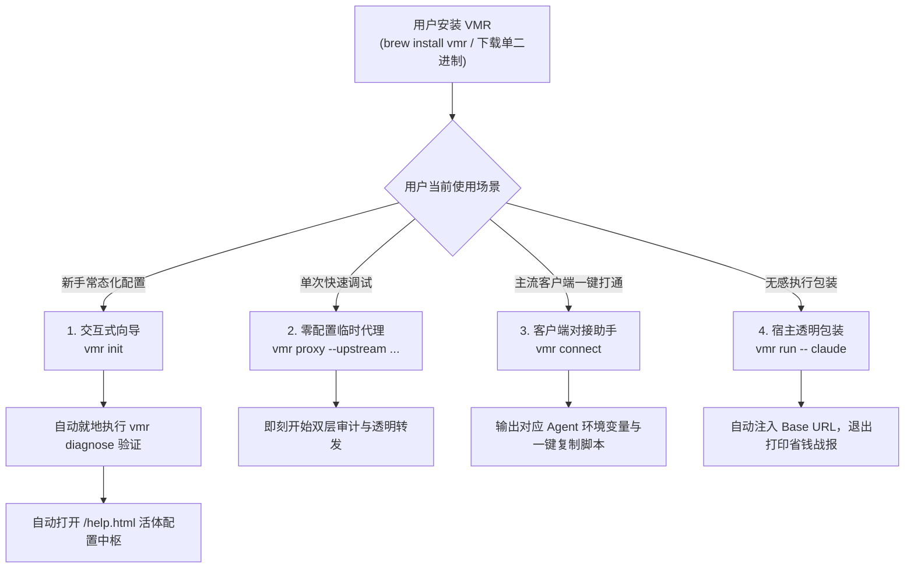
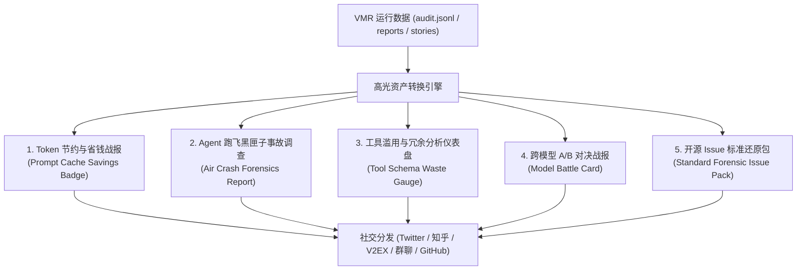
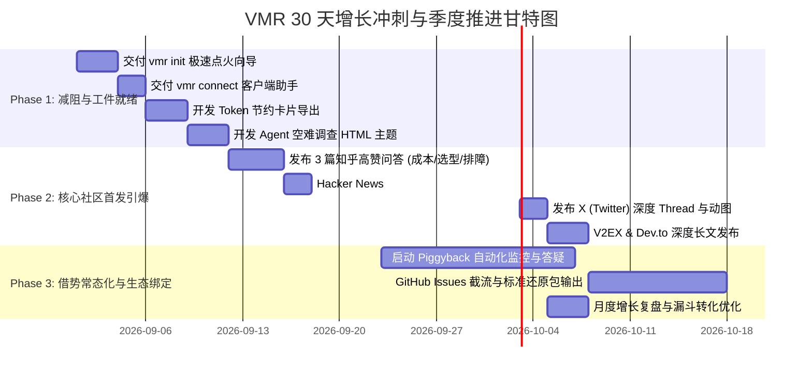

// Ver 2026-08-29 21:30, by custom_2/agent — VMR 项目增长突破与全域推广战略分析报告 v1.2（深度融合外部报告精华：新增增长公式、无配置即时代理、Tool Schema 浪费率分析、开源 Issue 标准还原包与三阶段 OKR 路线图）

# VMR 增长突破与全域推广战略分析报告 (GTM & Product-Led Virality Playbook)

> **任务背景与 Debrief**：
> 本报告基于 VMR (Virtual Model Router) 截至 v0.6.2（2026-08-29）的最新架构与功能基线，针对项目由“功能研发攻坚”向“市场推广与用户增长”战略重心的转移，进行系统性、可落地的深度研判。
> **v1.2 升级要点**：在 v1.1 破除技术自嗨、确立三大用户价值主张（省钱防反薅、长任务防暴毙、出事可归因）的基础上，**深度吸收并融合了历史战略研报的高价值观点**：
> 1. 引入 **增长核心动力学公式**（分子放大痛点共鸣与社交货币，分母压缩 TTV 与配置门槛）；
> 2. 补全 **极简上手四级火箭**：新增 `vmr proxy`（零配置单命令即时代理）与 `vmr connect <agent>`（针对 Claude Code / Cursor / Aider 的 1-Click 环境变量注入助手）；
> 3. 扩充 **产品级自传播四大视觉资产**：新增 **Tool Schema 冗余浪费率仪表盘** 与 **开源 Issue 标准事故现场还原包 (`vmr export-issue`)**；
> 4. 细化 **全渠道借势截流与开源生态绑定机制**（GitHub Issues 截流、Token-Plan 榨干配速方案、多账号额度平滑调度）；
> 5. 制定 **30 天高杠杆冲刺路线图与 3 个月量化考核指标 (OKRs)**。

---

## 1. 战略定位基准与增长核心矛盾 (Strategic Baseline & Growth Bottleneck)

### 1.1 增长战略核心公式 (The Growth Formula)

```
                              [ 痛点共鸣 (Pain Points) ]  ×  [ 视觉化社交货币 (Shareability) ]
  传播增长速度 (Growth Velocity) = ─────────────────────────────────────────────────────────────
                              [ 首次运行耗时 (Time-to-Value) ]  ×  [ 认知与配置门槛 (Friction) ]
```

* **分母（降低阻力）**：将用户从下载二进制到跑通第一个请求、看到漂亮记录的时间压缩在 **30~60 秒以内**；
* **分子（放大动能）**：将 VMR 的底层能力转化为**具有强烈社交分享欲与痛点共鸣的视觉化工件（HTML 事故调查报表、省钱战报、对比战卡）**，结合全网借势截流。

---

### 1.2 破除技术自嗨：从“工程独特性”到“用户价值与包装卖点”

以往我们在定义 VMR 优势时，往往陷入工程师视角的“技术自嗨”（如单二进制 3 万行 Go、无转译三协议、两层原始字节、零数据库）。但**用户根本不在乎底层用了什么语言、做了几层字节透传**。用户掏出注意力并决定使用的底层动机永远只有三条：
1. **别让我多花冤枉钱**（省钱 / 守住 Prompt Cache / 榨干套餐额度不浪费）
2. **别让我的活儿半道挂了**（长任务稳定 / 凌晨无人值守不中断 / 429 自动逃生）
3. **出事了别让我抓瞎**（可解释 / 事故能 1 键复现 / 跨模型有客观评测）

```
┌────────────────────────────────────────────────────────────────────────────────────────┐
│                   VMR 核心资产重构：从「技术自嗨」转向「用户感知价值与卖点」             │
└────────────────────────────────────────────────────────────────────────────────────────┘

【 原技术特性 (工程实现) 】              【 用户真实痛点与冷漠现实 】            【 真实价值 & 包装卖点 (购买理由) 】
  Byte-Faithful 字节保真透传       ──▶  “转不转译关我屁事，能跑就行”     ──▶  【大模型新特性 Day-1 零等直通车】
  (三协议原生直通，绝不转译)             上游加个字段网关就报错/丢 thinking      上游 API 哪怕明天加新特性当天就能用，
                                                                              绝无转译导致的 Tool Call 结构损坏。

  Session-Sticky 会话亲和          ──▶  “我只知道月底账单怎么又超了，   ──▶  【防反薅：给 Prompt Cache 加上安全锁】
  (Prompt Cache 亲和保护)               不知道是因为多节点轮询搞丢了缓存”      多轮写代码锁死已预热节点，防止网关
                                                                              自作聪明切节点打穿缓存，账单立减 60%。

  错误分级 Failover + Soft Block   ──▶  “半夜挂机跑任务，早上起来发现   ──▶  【无人值守‘防暴毙’安全气囊】
  (429/风控智能切换备用模型)            第 3 步 429 报错卡死，一晚白跑”        睡前丢给 Agent 一个大任务，遇 429 或
                                                                              风控静默拦截秒切备线，醒来代码已写完。

  两层原始字节审计 + 1-Click 重放  ──▶  “谁有空去翻几万行 JSONL 日志？ ──▶  【1-Click 事故现场一键重发复现】
  (audit.jsonl + vmr replay)           线上偶发报错根本没法重新构造复现”       告别手写脚本拼上下文，哪条报错 1 键
                                                                              原样重发，上游返回什么看得清清楚楚。

  Step 级分叉判定 + LLM 因果归因   ──▶  “大家都说 DeepSeek 好，但我一换 ──▶  【模型替身真实战力评测室】
  (vmr analyze -compare)               模型 Agent 就写错，不知道差在哪”       别信泛化天梯榜，同一业务任务跑两次，
                                                                              一目了然看在哪一步产生分歧、差了多少钱。

  周期额度配速 (Headroom Pacing)   ──▶  “套餐包到期用不完作废很亏，     ──▶  【精打细算：榨干每一分套餐额度】
  (Quota P3 桶/闸模型 + 动态配速)        高价按量 API 又舍不得天天用”           按到期时间平滑释放额度，高峰平稳分流，
                                                                              月底不浪费，溢出流量自动降级。

  Go 单静态二进制 (~15MB)          ──▶  “只要装起来不费劲就行，         ──▶  【像 curl 一样轻的极简底座】
  (零数据库 / 零 Node / 零 Python)       别在后台吃我几个 G 内存”              拒绝 Electron 动辄 500MB 内存的巨无霸，
                                                                              单文件后台常驻，完全感觉不到存在。
```

---

### 1.3 真正能够打动用户的四大核心“价值主张” (Core Value Propositions)

对外推广与内容分发时，全面收拢为以下四大高感知主张：

#### 卖点 1：【省钱牌】—— 守住 Prompt Cache，向长上下文“隐形刺客”要利润
* **目标人群**：天天用 Claude Code、Cursor、OpenClaw 写代码，看到 Token 账单肉疼的中重度用户。
* **痛点场景**：很多用户以为配置了多 Key / 多供应商负载均衡很聪明，结果账单反而暴涨。因为请求一旦在 Key A 和 Key B 之间轮询，Anthropic 和 DeepSeek 的 Prompt Cache 前缀就全部失效，相当于每次都在付全额 Input Token 费用。
* **杀手锏话术**：
  > **“你以为你在做高可用，其实你把 80% 的 Prompt 缓存折扣全搞丢了。VMR 自动锁定缓存会话，在保障不断流的同时，让你的写码账单立减 60%。”**

#### 卖点 2：【稳定性牌】—— 无人值守 Agent 的“防暴毙安全气囊”
* **目标人群**：让 Agent 跑批量爬取、长流程研究、夜间自动重构代码的自动化重度用户。
* **痛点场景**：Agent 最怕的是跑了 2 个小时，突然遇到一个 429 Rate Limit，或者某个模型厂商偶发的空响应/安全风控，导致整个 Agent Session 直接 Crash，前面的步骤和 Token 全部沉没。
* **杀手锏话术**：
  > **“别让凌晨三点的一次 429 限流，毁掉你跑了两个小时的代码任务。VMR 错误分级容灾与软拦截逃生，让你的 Agent 真正具备 7×24 小时无人值守的韧性。”**

#### 卖点 3：【认知与排障牌】—— 告别“玄学调优”，给 Agent 装上黑匣子
* **目标人群**：遇到 Agent 死循环、乱调工具、模型幻觉，却不知道怎么排查的开发者。
* **痛点场景**：“为什么 Agent 刚才好好的，突然开始胡言乱语 / 把文件全删了？”——目前的网关只能看到一堆扁平的 HTTP 200，根本看不到是在哪一步丢了上下文约束。
* **杀手锏话术**：
  > **“Agent 跑飞失控时，别对着终端盲猜。VMR 像空难黑匣子一样，精准标记哪一步上下文被截断、哪个工具被误调用，连换模型的步级分歧都给你标得清清楚楚。”**

#### 卖点 4：【精打细算牌】—— 多 Coding Plan 套餐的“智能管家”
* **目标人群**：手握智谱 GLM、MiniMax、Kimi、DeepSeek 多个包月套餐包，想要最大化利用额度的羊毛极客。
* **痛点场景**：套餐包到期不用就清零作废，手动切换 Key 烦琐且无法根据任务类型自动分流。
* **杀手锏话术**：
  > **“智谱 + MiniMax + DeepSeek 混合编队：VMR 独家 Headroom Pacing 算法自动按到期时间平滑释放额度，把每一分包月套餐榨干到极致，溢出流量无缝兜底。”**

---

## 2. 产品上手门槛极简化体系 (Zero-Friction Onboarding Architecture)

要实现规模化推广，第一前置条件是**把首次使用成本降低 80%**。用户从 GitHub Release 下载或 `brew install` 后，应当在 **30~60 秒内** 跑起来并接入日常使用的 Agent。



---

### 2.1 方案 1：`vmr init` 交互式点火向导 (30 秒生成与验证)

在 CLI 中新增 `vmr init` 子命令，替代手动 `cp config.minimal.yaml config.yaml`：
1. **自动环境变量扫描**：自动探测当前 Shell 中是否存在 `DEEPSEEK_API_KEY`, `ANTHROPIC_API_KEY`, `OPENAI_API_KEY`, `OPENROUTER_API_KEY`, `MINIMAX_API_KEY`；
2. **交互式三问模板**：
   - Q1: 选择你的主要模型厂商（多选，如 DeepSeek + Claude）；
   - Q2: 确认或输入 API Key（自动回写 `.env` 或 `config.yaml`）；
   - Q3: 选择常用 Agent（Claude Code / Cursor / OpenClaw 等）；
3. **自动生成与连通性验证**：写入精简配置，立即在内部调用 `vmr diagnose` 执行 DNS/TLS 与 Echo 探测，终端打印绿灯通行证。

---

### 2.2 方案 2：`vmr connect <tool>` 客户端一键打通助手 (1-Click Client Connect)

针对开发者最常搭配使用的前端客户端，内置一键对接助手：
```bash
# 针对 Claude Code:
$ ./vmr connect claude
  export ANTHROPIC_BASE_URL="http://127.0.0.1:8800"
  export ANTHROPIC_API_KEY="YOUR_KEY"
  claude

# 针对 Aider:
$ ./vmr connect aider
  aider --openai-api-base http://127.0.0.1:8800/v1 --model coding

# 针对 Cursor / Windsurf:
$ ./vmr connect cursor
  # 输出 Cursor 专用的 Base URL 复制链接与设置说明
```

---

### 2.3 方案 3：`vmr proxy` 零配置单命令即时代理 (No-Config Instant Mode)

针对临时调试、轻量验证或测试单个 Agent 调用的开发者，允许完全不需要配置文件直接启动：
```bash
# 零配置文件，一条命令立刻拉起带完整记录仪的透明代理
./vmr proxy --upstream https://api.deepseek.com --key sk-xxxx --port 8800
```
该命令在内存中生成临时路由，即刻提供透明代理、Prompt Cache 亲和与 Audit 日志，将单次调试门槛降到极限。

---

### 2.4 方案 4：`vmr run -- <agent>` 透明执行包装器 (Launch Wrapper)

类似 `proxychains` 或 `docker run` 哲学，VMR 作为宿主进程直接启动子 Agent：
```bash
# 自动在子进程环境中注入 BASE_URL，退出时在终端输出本次任务的 Token 与节省战报
vmr run -- claude
```

---

### 2.5 方案 5：`/help.html` 活体中枢升级 (Interactive Testing & LAN Sharing)

1. **一键复制带 Key 完整命令**：为 10+ 款主流 Agent 提供带当前实例 Base URL 的单行启动脚本；
2. **实时发包小红绿灯**：在页面上点击“发送测试请求”，浏览器端直接发包测试，实时展示命中节点与延迟；
3. **局域网直连二维码**：若部署在内网服务器或 Mac mini 上，页面自动渲染局域网 IP（`http://192.168.x.x:8800`），方便副设备与手机端直连。

---

## 3. 打造自传播引擎：视觉资产与传播“社交货币”（Virality Engine）

让现有用户主动分享，是获取高纯度极客用户的最高效手段。我们需要把 VMR 的**数据沉淀转化为用户的“社交资产”**。



---

### 3.1 传播资产 1：Prompt Cache 节约与省钱战报 (Savings Badge)

* **心理动因**：**“看我用深度优化帮自己/公司省了多少钱”**（成就感与极客优越感）。
* **形态设计**：
  - 在 `vmr report` 或 `/status.html` 顶部增加 **「Export Savings Card」** 按钮；
  - 一键渲染为一张精致的暗色风格 SVG / PNG 战报卡片（类似 Spotify Wrapped 或 GitHub Skyline）：
    - **累计请求轮次**：1,420 轮
    - **理论原生 Token 支出**：$142.50
    - **VMR Cache 亲和后实际支出**：$38.20
    - **实打实节省**：**$104.30 (节省 73.2%)**
    - **避开上游 429 熔断**：17 次
    - **底部署名**：*Protected by VMR (Virtual Model Router) — Zero-Instrumentation Flight Recorder*
* **分发场景**：推特发推、即刻晒图、知乎回答作为第一张配图。

---

### 3.2 传播资产 2：Agent 跑飞黑匣子“空难调查报告” (Air Crash Report)

* **心理动因**：**“Agent 昨天半夜把我信用卡刷爆了 / Agent 陷入死循环把代码全删了”**（事故吐槽与技术反思，社区天然最具爆款潜力的题材）。
* **形态设计**：
  - 基于现有的 `vmr analyze -journey <id> -html -redact`，增加一个预设主题 **「Blackbox Incident View (空难调查风)」**；
  - 页面顶部醒目标注：
    - **事故判定 (Verdict)**：`CRITICAL: Infinite Tool Call Loop & Context Collapse`
    - **死亡转折点 (Point of No Return)**：`Step 14 at 03:14:22 — Context compacted from 64k to 8k tokens, losing critical constraints`
    - **资金损耗**：`Consumed 1.2M tokens in 4 minutes ($4.80)`
    - **LLM 归因仲裁**：`System Prompt 未约束退出条件，导致持续重试已不存在的文件`
* **传播机制**：自动脱敏（`-redact`），单文件 HTML 零依赖可直接拖入浏览器查看或一键转长图。在 Reddit / V2EX 吐槽 Agent 跑飞时直接作为权威技术证据引用。

---

### 3.3 传播资产 3：工具滥用与冗余分析仪表盘 (Tool Schema Waste Gauge)

* **心理动因**：**“原来我用的这个 Agent 框架塞了这么多没用的垃圾 Tool 定义，白烧了我 30% Token！”**（直击痛点，引发对 Agent 框架的讨论）。
* **形态设计**：
  - 在 HTML 报告中直观呈现：“当前 Agent 每轮发送了 18 个工具定义，但 15 轮任务中仅实际调用了 2 个。多余的 JSON Schema 导致本会话白白浪费了 42,000 Input Tokens（占总成本 31.5%）”；
  - 附带优化建议：“建议在配置中裁剪 16 个未激活工具，预计可提速 25%、降本 30%”。

---

### 3.4 传播资产 4：跨模型 A/B 对决战报 (Model Battle Card)

* **心理动因**：**“到底 DeepSeek V3/V4 和 Claude Sonnet 谁写代码更聪明？谁更省步数？”**（社区永恒的争论焦点）。
* **形态设计**：
  - 基于 `vmr analyze -compare a,b -html -redact`；
  - 输出类似 **格斗对战卡 (VS Battle Card)** 的可视化头部：
    - **任务**：重构 500 行 Go 网络模块
    - **Side A (Claude 3.5 Sonnet)**：耗时 42s ｜ 6 Steps ｜ 4 次 Tool Call ｜ 成本 $0.18 ｜ 判定：一次通过
    - **Side B (DeepSeek-V3)**：耗时 58s ｜ 9 Steps ｜ 7 次 Tool Call ｜ 成本 $0.012 ｜ 判定：多跑了 3 次单测重试
    - **步级分歧点 (Divergence Point)**：`Step 2: Sonnet 选择全局 grep，DeepSeek 选择逐文件读取`
    - **性价比指标**：`DeepSeek 成本仅为 Sonnet 的 1/15，但步数多 50%`

---

### 3.5 传播资产 5：开源 Issue 标准“事故现场还原包” (`vmr export-issue`)

* **机制设计**：
  - 在 Agent 框架（Aider、Cline、OpenClaw、LangChain 等）的 GitHub Issues 中，开发者经常汇报“模型返回空”、“模型陷入死循环”、“工具参数解析报错”；
  - VMR 提供标准命令：`vmr export-issue <req-id>`，自动将脱敏后的两层 Raw Byte、HTTP 状态流与 1-Click Replay 命令生成为标准 Markdown 代码块；
  - 开发者在各大开源项目提 Issue 时贴出附带 *“Generated by VMR Forensic Replay”* 的排查日志，使 VMR 自然成为**排查 Agent 疑难杂症的标准调试工具**。

---

## 4. 竞品生态格局与差异化切入点 (Competitive Landscape & Differentiation Wedge)

在推广过程中，必须清晰界定 VMR 与主流竞品的边界，坚决不打“泛网关”口水仗，而是**在特定场景下建立不可替代的认知**。

### 4.1 核心竞品对比矩阵 (Competitive Matrix)

| 对比维度 | **开源中转网关 (One-API/New-API)** | **企业级翻译网关 (LiteLLM/Bifrost)** | **全功能控制台 (Claude Code Router CCR)** | **专用逆向/压缩代理 (OpenProxy/claude-proxy)** | **VMR (Virtual Model Router)** |
|---|---|---|---|---|---|
| **核心定位** | 算力转售、多 Key 简单轮询 | 多模型协议统一转译、企业计费 | 全功能桌面控制台、模型融合 | 50+ 客户端适配、RTK Token 压缩 | **AI Agent 专用可靠性路由 + 飞行记录仪** |
| **架构依赖** | Go/Node，依赖 MySQL/Redis/SQLite | Python/Go，重依赖 Redis/PostgreSQL | TS/Electron 桌面端 (~380MB) | Rust 单二进制 + Astro UI (171K行) | **Go 单静态二进制 (~15MB)，零外部 DB** |
| **协议处理** | 强行转为 OpenAI 格式 | 强行统一为 OpenAI IR | 转译适配 + Fusion 注入 | 格式转译 + RTK 文本剪裁 | **Byte-Faithful 字节保真（三协议直通）** |
| **长文本缓存** | 随机轮询，**彻底摧毁 Prompt Cache** | 基础 Affinity，配置复杂 | 无显式 Cache 亲和调度 | RTK 压缩减少 Token (破坏前缀缓存) | **跨协议原生 Session-Sticky (锁死缓存节点)** |
| **套餐配速** | 仅虚拟扣费，不感知上游水位 | 无 Token-Plan 额度平滑模型 | 无配速概念 | 简单冷却或硬切换 | **周期额度配速 (Headroom Pacing) + 桶/闸** |
| **调试与取证** | 仅有 HTTP 状态码与简单日志 | 扁平 HTTP 请求日志与 Cost 统计 | 历史会话归档 | 终端输出 / 单步抓包 | **步骤级 Story 还原 + 1-Click Replay + 对比归因** |
| **最佳适用场景**| API 分销转售、额度充值卡 | 企业级微服务治理、跨模型统一接口 | 可视化管理多 Agent 配置与插件市场 | 客户端订阅逆向桥接 | **无人值守 Agent、长会话写码、透明容灾、故障法医** |

---

### 4.2 VMR 的差异化杀手锏话术 (The Unfair Advantages)

1. **对标 CCR (36.7k★)**：
   - *论点*：“如果你需要一个包含 Electron 界面、管理 8 种配置文件和插件市场的控制台，选 CCR；但如果你追求**零内存占用（1/10 内存）、3.2 倍吞吐、毫秒级透明容灾与真正的黑匣子取证**，VMR 是唯一的单二进制 Unix 工具。”
2. **对标 OpenProxy (171k行Rust)**：
   - *论点*：“OpenProxy 用 RTK 强行压缩请求文本，看似省了 20% Token，但在长会话中**破坏了 Anthropic/DeepSeek 的 Prompt Cache 前缀匹配**，反而导致无法享受 70%~90% 的缓存折扣；VMR 坚持**字节保真 + Session-Sticky 亲和**，在真实多轮编码中综合账单更低、Tool Call 绝无损坏。”
3. **对标 LiteLLM / Bifrost**：
   - *论点*：“LiteLLM 和 Bifrost 致力于把全世界的模型都翻译成 OpenAI 格式；而 VMR 认为**协议翻译在复杂 Agent 时代是有害的（吃掉私有字段、损坏 Tool Call 结构）**。VMR 不做翻译，只做极致的字节保真与可靠性路由。”

---

## 5. 全渠道推广策略与借势增长实战 (Omnichannel GTM & Piggyback Playbook)

推广应当采取 **“内容基底沉淀 + 自动化借势劫持 + 突发事件第一响应”** 的三维打法：

```mermaid
flowchart TD
    subgraph Engine [中枢：内容与监控引擎]
        Inv["内容台账 (01_CONTENT_INVENTORY.md)"]
        Mon["全网痛点监控 (Twitter / Reddit / 知乎 / HN)"]
    end

    subgraph ContentTrack [1. 阵地内容营销 (Inbound & SEO)]
        Devto["Dev.to / Hashnode 原生英文架构长文"]
        Zhihu["知乎专栏长文 + 精准跟帖"]
        Juejin["掘金 Go 高并发与系统级代理剖析"]
        ShowHN["Hacker News: Show HN 极简发布"]
    end

    subgraph PiggybackTrack [2. 借势精准截流 (Piggyback Marketing)]
        X_Thread["Twitter/X: 痛点推文下提供 80% 解法 + 20% VMR"]
        Reddit_Comm["Reddit: r/LocalLLaMA / r/ClaudeAI 真实案例答疑"]
        Zhihu_QA["知乎高热度问题定向回答"]
        Issue_Track["GitHub Issues: Agent 仓库报错答疑与还原包输出"]
    end

    subgraph EventTrack [3. 突发事件第一响应 (Newsjacking)]
        Outage["大模型官方故障 / 429 封控 / 缓存涨价"]
        RapidPost["1 小时内发布「容灾/逃生配置指南」"]
    end

    Inv --> ContentTrack
    Mon --> PiggybackTrack
    Outage --> EventTrack
```

---

### 5.1 渠道矩阵与差异化打法 (Channel-Specific Execution)

| 平台 | 目标受众 | 内容形态与频次 | 核心话术与切入点 |
|---|---|---|---|
| **X (Twitter)** | 海外 AI 开发者、Indie Hackers、Coding Agent 深度用户 | 每周 2~3 条精炼 Thread<br/>+ 动图/战报卡片 | **“Why your Prompt Cache is quietly broken”** ｜ **“Agent crash forensics at 3 AM”** ｜ 极客直叙，不打广告。 |
| **Reddit** (`r/LocalLLaMA`, `r/ClaudeAI`, `r/Cursor`, `r/selfhosted`, `r/golang`) | 重度折腾模型与 Coding Agent 的硬核极客 | 每周参与 3~5 个高价值排障讨论帖 | 帮助楼主诊断 429、Tool Call 截断、Prompt Cache 命中率问题，在回帖中自然给出 VMR 配置解决方案。 |
| **Hacker News** | 全球资深架构师与开源爱好者 | 单次重大里程碑 (Show HN) | 遵循 Unix 哲学：“Show HN: vmr – A 15MB zero-DB router & flight recorder for AI agents”。强调 **No-DB, Single-binary, Byte-faithful, Local-first**。 |
| **Dev.to / Hashnode** | 海外 Go/AI 开发者 | 每 2 周 1 篇深度架构长文 | 剖析三协议栈无锁隔离、零拷贝透传、环形缓冲区探测的底层 Go 实现。 |
| **知乎** | 国内 AI 工程师、Agent 开发者、独立开发者 | 每周 2~3 篇（专栏沉淀 + 定向问答跟帖） | 围绕「如何降低 Claude Code / Cursor 成本？」「本地有什么好用的 LLM 网关？」「如何排查 Agent 幻觉与死循环？」答题。 |
| **V2EX** (`/go`, `/t/share`, `/t/programmer`, `/t/ai`) | 国内独立开发者、Go 工程师 | 单次里程碑分享 | 《撸了一个开源的 AI Agent 路由与飞行记录仪：单二进制无 DB，解决多账号 Token-Plan 额度与 Prompt Cache 冲突》 |
| **掘金** | 国内前端/后端/Go 开发者 | 每周 1 篇 Go 工程实战深度稿 | 侧重 Go 语言高质量实战、网络代理底层避坑、高并发下的内存控制。 |
| **微信公众号 / 即刻** | 泛 AI 原生工作者、效率极客 | 每月 1~2 篇全景图文 | “我是如何让我的 AI Agent 7×24 小时无人值守写代码且不爆账单的”。 |

---

### 5.2 借势截流自动化 (Piggyback Marketing) 落地流程

针对 Twitter、Reddit、知乎上的日常流量借势，执行标准化的 **80/20 价值法则**（80% 给出专业硬核的技术分析与根因排查，20% 自然带出 VMR 作为验证工具或自动化解法）：

1. **痛点识别关键词池**：
   - *Cost & Cache*：`Claude Code expensive`, `Prompt cache miss`, `Cursor API bill`, `DeepSeek 429`, `Token rate limit`；
   - *Forensics & Debugging*：`Agent infinite loop`, `Tool call schema broken`, `LLM silent failover`, `Agent runaway`；
   - *Gateway & Routing*：`LiteLLM local alternative`, `Claude Code proxy`, `Multiple API keys rotation`, `Coding plan pacing`.
2. **回复生成标准模板 (80/20 Rule)**：
   ```markdown
   [1. 共情与根因定位 (40% 篇幅)]
   "This usually happens because Anthropic/DeepSeek requires exact prefix matching for prompt caching. If your router switches endpoints or modifies system prompt headers between turns, your cache hit rate drops to 0%..."

   [2. 原理级通用解法 (40% 篇幅)]
   "To fix this without switching tools, make sure your proxy maintains session-sticky routing to the same upstream model instance for at least 5-10 minutes..."

   [3. 极简开源工具佐证 (20% 篇幅)]
   "If you're looking for a local zero-config tool that handles this natively, check out vmr (github.com/bigfatsea/vmr). It's a single ~15MB Go binary with built-in session-sticky cache affinity and flight recorder."
   ```

---

### 5.3 突发事件第一响应机制 (Newsjacking / Event-Driven Marketing)

在大模型行业，突发事件是流量最集中的时刻：

1. **事件 1：某主流 API 发生大面积宕机 / 429 降级（如 Anthropic 或 DeepSeek 宕机）**：
   - **响应**：1 小时内发布推文与知乎动态：“*【5 分钟配置】用 VMR 实现 Anthropic 故障时自动无感降级到 DeepSeek-V3，保障 Claude Code 不中断写码*”；
2. **事件 2：某厂商上线新 API 特性（如新的 Reasoning 字段或 Responses 协议）**：
   - **响应**：发布评测：“*为什么翻译型网关全都挂了，而 VMR 字节保真直通可以第一天零代码直接支持*”；
3. **事件 3：社区曝出知名 Agent 跑飞刷爆账单的新闻**：
   - **响应**：发布深度案例复盘：“*如何用 VMR 上下文截断边界（Compaction Boundary）检测与配额闸门，从网络层掐死 Agent 死循环*”。

---

## 6. 爆款内容选题库与传播素材模板 (Content Matrix)

为了让后续内容制作能够批量化、高质量执行，整理以下四大即用型选题：

### 选题一：【算账与防坑篇】
* **标题**：《为什么你的 Prompt Cache 总是失效？多账号 Agent 网关的隐藏成本与破解之道》
* **痛点**：很多开发者买了 3 个 Coding Plan 账号，用普通网关轮询，结果缓存命中率直接归零，响应时间慢 3 倍，费用反增。
* **核心内容**：拆解 Prefix-Cache 的前缀匹配原理；对比无状态轮询 vs VMR Session-Sticky 路由下的命中率实测数据；演示 VMR 如何在多账号之间既做额度配速分流，又死守缓存亲和性。

### 选题二：【排查与 Debug 篇】
* **标题**：《凌晨 3 点 Agent 跑飞了？别猜了，用“飞行记录仪”1 秒重放复现 Bug》
* **痛点**：Agent 自主运行几十轮，突然由于某次 Tool Call 格式错误或上游内容拦截而卡死，看普通日志只有一堆 JSON，根本没法复现。
* **核心内容**：展示 VMR 的 `vmr story` 步骤还原功能与 `vmr replay` 原生字节一键重放；展示在不修改业务代码（Zero-Instrumentation）的情况下如何捕获现场。

### 选题三：【架构与工程美学篇】
* **标题**：《拒绝 10 个 Docker 容器：为什么我们用纯 Go 单二进制重写 AI Agent 路由基础设施》
* **痛点**：为了用一个 AI 网关，必须安装 Python 环境、Postgres、Redis，起 5 个容器，占用 2G 内存。
* **核心内容**：介绍 VMR 极简架构（单二进制、内存环形缓冲区、Raw Byte 审计、无外部 DB）；公布 150 req/s 下 p95 < 10ms 的压测实录。

### 选题四：【多模型精打细算篇】
* **标题**：《智谱 GLM + DeepSeek + Claude 混合编队：如何榨干每一分钱的 Token-Plan 额度？》
* **痛点**：打包套餐到期用不完直接作废，高价按量 API 又舍不得用，手动切 Key 烦琐低效。
* **核心内容**：介绍 VMR 的 Headroom Pacing 额度配速算法（桶与闸模型），如何在重置周期内将套餐额度恰好消耗完毕，溢出流量无缝自动降级。

---

## 7. 实施路线图与阶段性考核指标 (Actionable Roadmap & OKRs)



### 阶段详细任务与考核目标：

#### 阶段一：极速上手与视觉资产重构（第 1 ~ 2 周）
* **目标 (KR)**：Time-to-Value 缩短至 30 秒以内，完成 3 项高颜值视觉资产落地。
1. **[P0] 交付 `vmr init`**：实现交互式向导，支持自动检测环境变量、自动生成 `config.yaml`、一键执行 `vmr diagnose`；
2. **[P0] 交付 `vmr connect <agent>`**：一键输出 Claude Code / Cursor / Aider 的环境变量配置；
3. **[P0] 升级 `/status.html` 与 `vmr report`**：增加「导出 Token 节约卡片 (Savings Card)」功能，支持暗色精致 SVG/PNG 一键下载；
4. **[P1] 完善 `journey.html` 脱敏分享模式**：确保 `-redact` 模式下生成的 HTML 报告兼具美观性与故事性，适合作为“Agent 跑飞调查报告”公开发布。

#### 阶段二：核心渠道首发与精准引爆（第 3 ~ 4 周）
* **目标 (KR)**：Show HN 冲上前列，知乎累计阅读 10k+，获取首批 300+ 种子 Star。
1. **[P0] Hacker News Show HN**：
   - 标题：`Show HN: vmr – A 15MB zero-DB router & flight recorder for AI agents (Go)`
   - 核心内容：极简单二进制、无翻译字节透传、Prompt Cache 亲和、事故法医重放；
2. **[P0] 知乎 3 大核心问题占位**：
   - 回答 1：《如何降低 Claude Code / Cursor 的使用成本？》（主推 Prompt Cache 亲和 + 双上游 Failover）；
   - 回答 2：《如何评价 Claude Code Router (CCR) 等 Agent 路由工具？》（客观中立架构选型体，突出 VMR 的 1/10 内存与无侵入）；
   - 回答 3：《AI Agent 在执行长任务时死循环或跑飞该如何调试取证？》（展示 `vmr story` 决策脊柱与截断边界）；
3. **[P1] X (Twitter) 核心推文串**：配合 SVG 战报动图，剖析“为什么你的 Agent 账单比别人贵 3 倍（Prompt Cache 击穿实录）”；
4. **[P1] V2EX 深度首发**：《撸了一个开源的 AI Agent 路由与飞行记录仪：单二进制无 DB，解决多账号 Token-Plan 额度与 Prompt Cache 冲突》。

#### 阶段三：借势截流常态化与生态沉淀（第 2 ~ 3 个月）
* **目标 (KR)**：达成 1,000 ~ 3,000+ GitHub Stars，进入主流 Agent 开发者心智。
1. **[P0] 运行 Piggyback 自动化流水线**：借助共享浏览器 Profile，每日扫描 Twitter 与 Reddit（`r/LocalLLaMA`, `r/ClaudeAI`），推送 2~3 条高价值借势草稿；
2. **[P0] GitHub Issues 截流**：在主流 Agent 仓库帮助排障，输出 `vmr export-issue` 标准还原代码块；
3. **[P1] 文档与生态共建**：为主流 Agent 项目贡献接入文档与 Example 配置。

---

## 8. 总结与落地行动清单 (Action Checklist)

推广的本质是**将产品解决的确定性价值，用最小的阻力传递给最痛的用户**。

建议行动：
1. **产品端立刻执行“减阻增亮”两项改造**：
   - 实现 `vmr init` 与 `vmr connect`（让首次配置从 5 分钟变成 30 秒）；
   - 完善单文件 HTML 报告与 Token 节约战报卡片（提供抓人眼球的社交传播物料）。
2. **内容端带着视觉物料启动多渠道借势**：
   - 带着高颜值 HTML 截图、Token 节约数据去知乎、V2EX、Twitter、Reddit 回答问题和发帖；
   - 紧咬四大用户价值点：**“Prompt Cache 防击穿立省 60%”**、**“无人值守长任务防暴毙”**、**“零侵入 Agent 空难黑匣子”** 与 **“多套餐额度平滑配速”**。

---
EOF