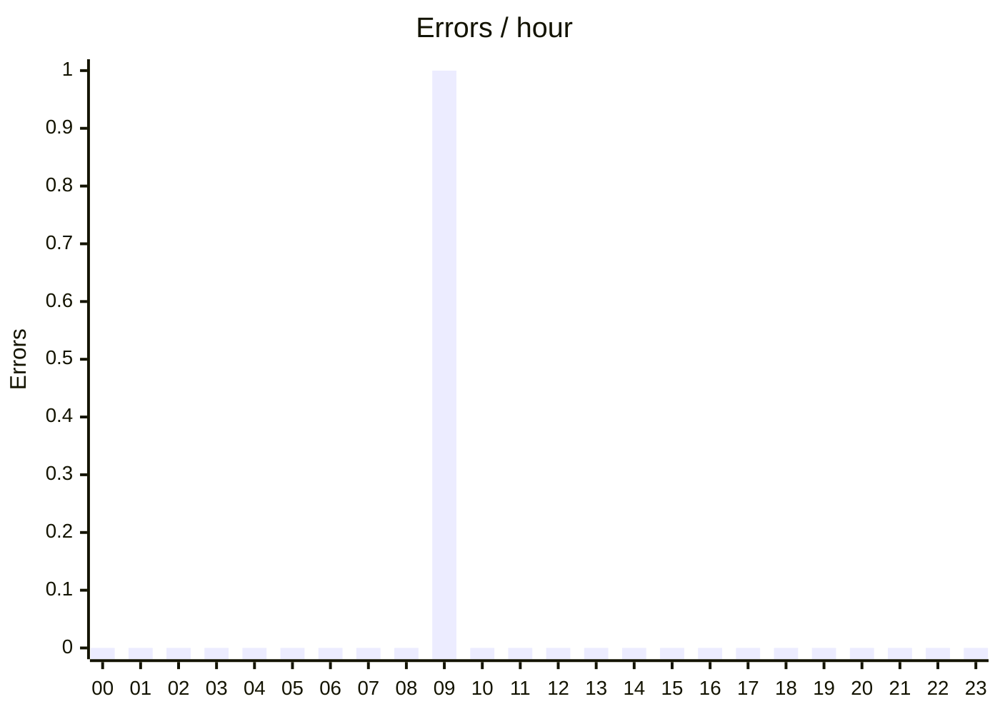
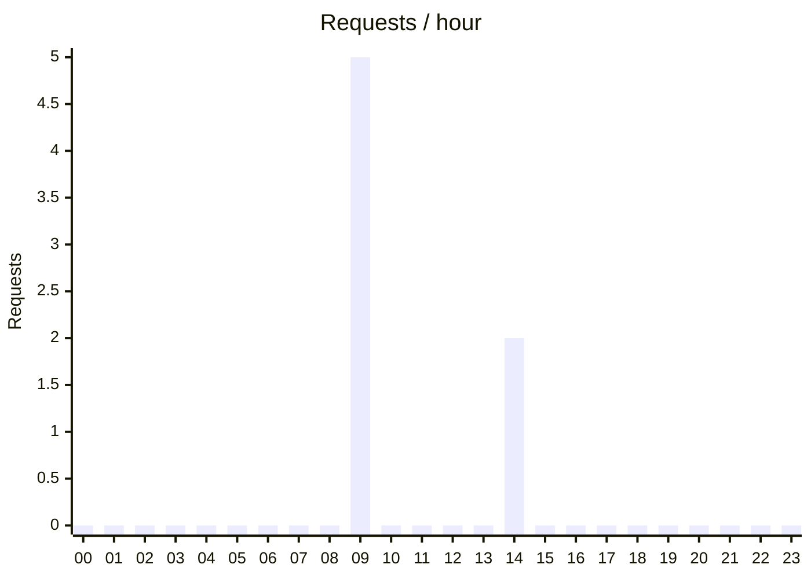
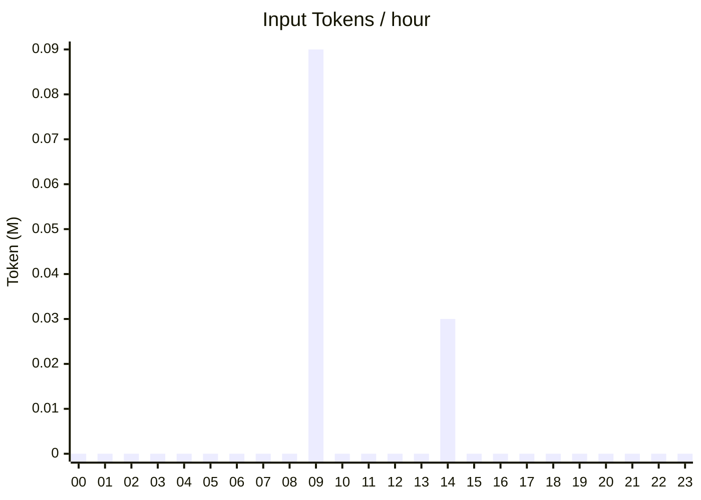
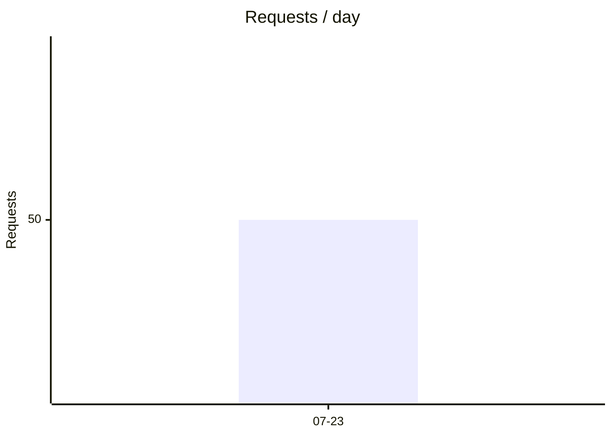
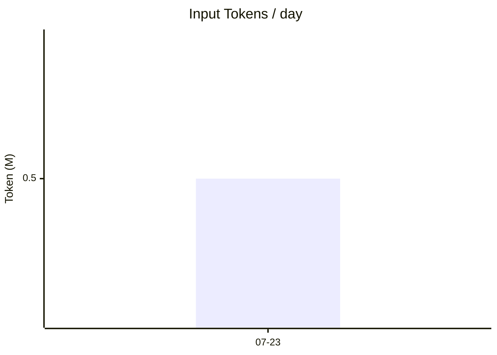

# VMR Usage Report

Data source: 2 files · format 12 · 7 records (1 bad rows) · 2026-07-22 18:39:00 – 2026-07-24 02:00:00

Config: /etc/vmr/report.yaml

File list

a.jsonl, b.jsonl

Request-level data is in `requests/index.json`; browse it interactively with `request-browser.html`

Task narratives in [journeys/index.md](journeys/index.md) (2 task(s) indexed · covers 2026-07-23 02:39:00 – 2026-07-24 10:00:00)

## §0 Summary

| Requests | Success Rate | Billed Input (fresh)⭐ | Cache Efficiency⭐ | p95 Duration | PAYG-Equivalent Cost⭐ |
|---|---|---|---|---|---|
| 50 (fallback 3 / trunc 1) | 90.0% | 150.0K | 72.0% | 9.0s (n=44) | unpriced |

of which the interactive workload accounts for 10.0% (5/50)
> ⭐ = derived/estimated metric (not direct upstream value), see Appendix for basis.

**Highlights (auto):**
- ⚠️ **heartbeat workload cache efficiency 11.1%** - 80.0K fresh tokens (dominates this workload's input)
- ⚠️ **Endpoint openai-completions:prov1:gpt-x error rate 6.7/100** (worst), top cause rate_limit ×2

## §1 Cost & Token Economy

**Token Class Breakdown** (basis: 45 records with usage)

| Category | Amount | Share |
|---|---|---|
| Input - cache hit | 350.0K | 70.0% of in |
| Input - fresh ⭐ | 150.0K | 30.0% of in |
| Input - cache_write | 0 | - |
| Output | 120.0K | - |

> Billing basis: fresh + cache_write(×premium) + out. Cache hits are billed free/near-free by most providers.
> The figures in this section are a PAY-AS-YOU-GO EQUIVALENT: what this traffic would cost billed per token at the published prices vmr can resolve for it — the serving platform's own rate where one exists, otherwise the model maker's list price. They are not what you paid — a subscription/plan account's marginal cost is 0, and only you know the real unit price behind a reseller or proxy. They answer "was this plan/proxy worth it". Prices come from the standard table (generated 2026-08-01) plus any config.yaml account overrides (currency USD), and do not represent the prices in effect when these requests historically occurred; configure providers[].pricing.rates on the relevant provider to price at what you actually pay. See §2 Cost Estimate for details.

**Cache Efficiency by Model** ⭐

| Model | Protocol | Requests | Cache Efficiency⭐ | fresh | cached | out |
|---|---|---|---|---|---|---|
| coding | openai-completions | 50 | 72.0% | 150.0K | 350.0K | 120.0K |

**Request Message Characters, Estimated Tokens & Share**

| Role | Chars | Est. Tokens⭐ | Share⭐ |
|---|---|---|---|
| tool | 140.0K | 35.0K | 70.0% |
| assistant | 48.0K | 12.0K | 24.0% |
| user | 12.0K | 3.0K | 6.0% |

> Est. Tokens⭐: upstream usage isn't broken down by role, so this is an estimate; share is computed on estimated tokens.
> takeaway: when tool results dominate, the first lever for context optimization is compressing tool output, not the system prompt.

## §2 Pay-As-You-Go Equivalent Cost

> The figures in this section are a PAY-AS-YOU-GO EQUIVALENT: what this traffic would cost billed per token at the published prices vmr can resolve for it — the serving platform's own rate where one exists, otherwise the model maker's list price. They are not what you paid — a subscription/plan account's marginal cost is 0, and only you know the real unit price behind a reseller or proxy. They answer "was this plan/proxy worth it". Prices come from the standard table (generated 2026-08-01) plus any config.yaml account overrides (currency USD), and do not represent the prices in effect when these requests historically occurred; configure providers[].pricing.rates on the relevant provider to price at what you actually pay.

**Estimated Cost by Date** (USD)

| Date | fresh | out | Est. Cost |
|---|---|---|---|
| 2026-07-23 | 150.0K | 120.0K | $3.25 |
| **Total** |  |  | $3.25 |

**Estimated Cost by Model** (USD)

| Model | Protocol | fresh | out | Est. Cost |
|---|---|---|---|---|
| coding | openai-completions | 150.0K | 120.0K | $3.25 |
| **Total** |  |  |  | $3.25 |

**Estimated Cost by Endpoint** (USD, merged across dates)

| Endpoint | fresh | out | Est. Cost |
|---|---|---|---|
| openai-completions:prov1:gpt-x | 100.0K | 80.0K | $3.25 |
| **Total** |  |  | $3.25 |

> The total excludes 1/2 endpoints with no priced traffic to attribute (the upstream endpoint is not in the price table, or the requests never reached one successfully) — cost unknown, not zero.

**Estimated Cost by Client** (USD)

| client_key | fresh | out | Est. Cost |
|---|---|---|---|
| claw-a | 100.0K | 100.0K | $3.25 |
| **Total** |  |  | $3.25 |

> Estimated cost includes requests where usage was not sniffed (priced via fallback estimation); the fresh/out columns only count confirmed token usage. Calculating unit price as "Est. Cost ÷ Tokens" may yield an inflated figure.

Pricing sources used for this report

standard table generated 2026-08-01; 1 provider rate rule(s) applied

## §2.5 Provider Spend & Quota

Cross-model roll-up by upstream account (config.yaml's providers[].name) — answers "how much did this account consume overall, and how reliable was it" without manually summing its endpoint rows.

| Provider | Models | Requests | Success Rate | fresh/cached/out | Cache Eff. | Dur. Mean | Error Rate | Top Error | $ Estimate (USD) |
|---|---|---|---|---|---|---|---|---|---|
| prov1 | 1 | 28 | 89.3% | 100.0K / 300.0K / 80.0K | 75.0%¹ | 2.5s | 6.7% | rate_limit 2(100.0%) | $3.25 |

### Quota vs. Consumption

Every account that declares a `quota:`, with two independently-windowed consumption figures placed side by side — never subtracted or ratioed, each labeled with its own source.

| Provider | Metric | Window Consumed¹ | Used This Period² | Amount | Used% | Elapsed% | Period |
|---|---|---|---|---|---|---|---|
| prov1 | tokens | 123456 | 69450000 (20.0% est.) | 50000000 | 138.9%⭐ | 20.5% | 07-24 ~ 07-29 |

> ¹ Window Consumed: recomputed from this run's audit-log input — a RECOMPUTED figure, not a replay of the router's actual charge history. Accuracy differs per metric. **requests: no drift** — it reproduces the router's own `multiplier × forwarded-attempt count` formula literally (the router charges once per forwarded upstream success, failed attempts were never charged in the first place, and the multiplier is applied by exact multiplication with no rounding). **tokens** — requests whose upstream returned no exact usage are counted here with the same byte-count estimate the router charged (no longer counted as 0); the estimated share is shown as "X% est." in parentheses. Both sides run the same formula; the one residual drift is that the router counts UPSTREAM bytes while this column can only count the bytes forwarded to the client, so the two differ by whatever response normalization rewrote (model-name rewrite, `<think>` stripping, ...). Common to both metrics: config weights/multipliers changed mid-window.
> ² Used This Period: the router's own real-time counter from `<log_dir>/vmr-quota.json` — the authoritative account, in a different window than the column to its left. Never subtract or ratio the two. Shows `-` when the stored counter is still on an earlier period. The parenthesized "X% est." marks how much of that consumption came from a degraded estimate (a byte-count fallback used when upstream didn't return exact usage), not authoritative metering.
> ⭐ marks Used% >= 100%: this account is over its configured quota for the current period.

## §3 Reliability

**Outcome Distribution**

| ok | error | canceled | truncated | fallback(recovered/failed)⭐ |
|---|---|---|---|---|
| 45 | 3 | 1 | 1 | 3 (2/1) |

**Endpoint Health** (merged across dates)

*openai-completions*

| Endpoint | Attempts | OK | Availability | Error Rate⭐ | Top Error |
|---|---|---|---|---|---|
| openai-completions:prov1:gpt-x | 30 | 28 | 93.3% | 6.7% | rate_limit ×2 |

*anthropic-messages*

| Endpoint | Attempts | OK | Availability | Error Rate⭐ | Top Error |
|---|---|---|---|---|---|
| anthropic-messages:prov2:claude-y | 4 | 4 | 100.0% | 0.0% ⚠️low-n | - |

**Error Class × Endpoint** (non-zero only)

*openai-completions*

| Endpoint | Class | Count |
|---|---|---|
| openai-completions:prov1:gpt-x | rate_limit | 2(6.7%) |

**Quirk Fix × Endpoint** (non-zero only, % of this endpoint's successful attempts; see each request's detail page for the full narration)

*anthropic-messages*

| Endpoint | Marker | Count |
|---|---|---|
| anthropic-messages:prov2:claude-y | think_strip | 2(50.0%) |

**Error Timeline** (errors / hour)

> Errors peak at 09:00 (1 total).

## §4 Latency & Throughput

| Model | Protocol | ttft p50/p95 (n) | dur p50/p95/max (n) | slow>30s⭐ | tok/s |
|---|---|---|---|---|---|
| coding | openai-completions | 320ms / 950ms (n=44) | 1.5s / 9.0s / 35.0s (n=44) | 2 | 100.5 |

> Global p95 dur 9.0s, max 35.0s. Sorted by tok/s descending.
> If coding's slowness mostly comes from a long stream rather than time-to-first-token, check the ttft vs dur gap per model.

**By Endpoint** (merged across dates)

*openai-completions*

| Endpoint | ttft p50/p95 (n) | dur p50/p95/max (n) | slow>30s⭐ | tok/s |
|---|---|---|---|---|
| openai-completions:prov1:gpt-x | 300ms / 900ms (n=25) | 1.2s / 8.0s / 31.0s (n=25) | 2 | 55.5 |

*anthropic-messages*

| Endpoint | ttft p50/p95 (n) | dur p50/p95/max (n) | slow>30s⭐ | tok/s |
|---|---|---|---|---|
| anthropic-messages:prov2:claude-y | - (n=0) | 2.0s / 3.0s (n=4 ⚠️low-n) | 0 | 40.1 |

## §5 Workload Distribution

**By Virtual Model**

| Model | Protocol | Requests | Success Rate | fresh/cached/out | dur p50/p95 |
|---|---|---|---|---|---|
| coding | openai-completions | 50 | 90.0% | 150.0K / 350.0K / 120.0K | 1.5s/9.0s |

**By Workload Class**

| Class | Requests | fresh | Cache Efficiency⭐ | tool_call_rate | dur p50/p95 |
|---|---|---|---|---|---|
| interactive | 5 | 50.0K | 75.0% | 40.0% | -/- |
| heartbeat | 2 | 80.0K | 11.1% ⚠️ | 0.0% | -/- |

**Hourly Activity**

**Daily Activity**

+ Daily Activity Table (1 days)

| Date | Requests | Success Rate | fresh/cached/out |
|---|---|---|---|
| 2026-07-23 | 50 | 90.0% | 150.0K / 350.0K / 120.0K |

**By Client** ⭐

| client_key | Requests | Success Rate | fresh/cached/out(reasoning) | Cache Eff. | dur p50/p95 | In(p50/p95) | Out(p50/p95) |
|---|---|---|---|---|---|---|---|
| claw-a | 7 | 100.0% | 100.0K / 200.0K / 100.0K (0) | 0.0% | -/- | 9.0K/31.0K | 2.0K/9.1K |

**By Endpoint** ⭐ (merged across dates)

| Endpoint | Requests | Success Rate | fresh/cached/out(reasoning) | Cache Eff. | dur p50/p95 | In(p50/p95) | Out(p50/p95) |
|---|---|---|---|---|---|---|---|
| openai-completions:prov1:gpt-x | 28 | 89.3% | 100.0K / 300.0K / 80.0K (0) | 75.0%¹ | 1.2s/8.0s | 9.0K/30.0K | 2.0K/9.0K |
| anthropic-messages:prov2:claude-y | 4 | 100.0% | 30.0K / 10.0K / 8.0K (0) | 25.0% | 2.0s/3.0s | 0/0 | 0/0 |

## §5.5 Per-Client Upstream Attribution

Which upstream endpoints each client actually hit, and how many tokens landed on each — answers "where does this agent's traffic actually land".

**claw-a**

| Endpoint | Requests | fresh | cached | out | % of client's tokens |
|---|---|---|---|---|---|
| openai-completions:prov1:gpt-x | 10 | 50.0K | 150.0K | 30.0K | 100.0% |

## §6 Sessions & Tasks

> Session labels like s01 (l-...): sNN is a report-local row alias; l-<hash8> is the stable content-addressed ID.

**claw-a**

| Session | Time Range | Title | Turns | Tasks | fresh/cached/out | Outcome |
|---|---|---|---|---|---|---|
| s01 (l-a00000000) | 07-22 18:39 → 18:52 | morning routine | 3 | 1 | 10.0K / 30.0K / 10.0K | ok |
| s02 (l-a00000001) | 07-22 18:39 → 18:52 | morning routine | 3 | 1 | 10.0K / 30.0K / 10.0K | ok |
| s03 (l-a00000002) | 07-22 18:39 → 18:52 | morning routine | 3 | 1 | 10.0K / 30.0K / 10.0K | ok |
| s04 (l-a00000003) | 07-22 18:39 → 18:52 | morning routine | 3 | 1 | 10.0K / 30.0K / 10.0K | ok |
| s05 (l-a00000004) | 07-22 18:39 → 18:52 | morning routine | 3 | 1 | 10.0K / 30.0K / 10.0K | ok |
| s06 (l-a00000005) | 07-22 18:39 → 18:52 | morning routine | 3 | 1 | 10.0K / 30.0K / 10.0K | ok |
| s07 (l-a00000006) | 07-22 18:39 → 18:52 | morning routine | 3 | 1 | 10.0K / 30.0K / 10.0K | ok |
| s08 (l-a00000007) | 07-22 18:39 → 18:52 | morning routine | 3 | 1 | 10.0K / 30.0K / 10.0K | ok |
| s09 (l-a00000008) | 07-22 18:39 → 18:52 | morning routine | 3 | 1 | 10.0K / 30.0K / 10.0K | ok |
| s10 (l-a00000009) | 07-22 18:39 → 18:52 | morning routine | 3 | 1 | 10.0K / 30.0K / 10.0K | ok |
| s11 (l-a00000010) | 07-22 18:39 → 18:52 | morning routine | 3 | 1 | 10.0K / 30.0K / 10.0K | ok |
| s12 (l-a00000011) | 07-22 18:39 → 18:52 | morning routine | 3 | 1 | 10.0K / 30.0K / 10.0K | ok |
| s13 (l-a00000012) | 07-22 18:39 → 18:52 | morning routine | 3 | 1 | 10.0K / 30.0K / 10.0K | ok |
| s14 (l-a00000013) | 07-22 18:39 → 18:52 | morning routine | 3 | 1 | 10.0K / 30.0K / 10.0K | ok |
| s15 (l-a00000014) | 07-22 18:39 → 18:52 | morning routine | 3 | 1 | 10.0K / 30.0K / 10.0K | ok |
| s16 (l-a00000015) | 07-22 18:39 → 18:52 | morning routine | 3 | 1 | 10.0K / 30.0K / 10.0K | ok |
| s17 (l-a00000016) | 07-22 18:39 → 18:52 | morning routine | 3 | 1 | 10.0K / 30.0K / 10.0K | ok |
| s18 (l-a00000017) | 07-22 18:39 → 18:52 | morning routine | 3 | 1 | 10.0K / 30.0K / 10.0K | ok |
| s19 (l-a00000018) | 07-22 18:39 → 18:52 | morning routine | 3 | 1 | 10.0K / 30.0K / 10.0K | ok |
| s20 (l-a00000019) | 07-22 18:39 → 18:52 | morning routine | 3 | 1 | 10.0K / 30.0K / 10.0K | ok |

+ 2 more sessions (all ≤ 12 turns)

| Session | Time Range | Title | Turns | Tasks | fresh/cached/out | Outcome |
|---|---|---|---|---|---|---|
| s21 (l-a00000020) | 07-22 18:39 → 18:52 | morning routine | 3 | 1 | 10.0K / 30.0K / 10.0K | ok |
| s22 (l-a00000021) | 07-22 18:39 → 18:52 | morning routine | 3 | 1 | 10.0K / 30.0K / 10.0K | ok |

**claw-b**

| Session | Time Range | Title | Turns | Tasks | fresh/cached/out | Outcome |
|---|---|---|---|---|---|---|
| l-d0 | 07-24 01:00 → 01:03 |  | 1 | 1 | 2.0K / 8.0K / 2.0K | ok |
| [s23 (l-d1)](journeys/j-claw-b-1.md) | 07-24 02:00 → 02:02 | follow-up &lt;!-- ok | 1 | 1 | 2.0K / 8.0K / 2.0K | ok |

> l-d1 ← l-d0 (single compaction)

## §6.5 Sticky Effectiveness ⭐

Within the same session: requests that landed back on the **previous request's endpoint** vs. requests that **switched endpoints** — cache efficiency compared between the two groups.
The Sticky Model's only reason to exist is keeping the upstream prompt cache warm — this section is the evidence for whether it actually delivers that.

| Group | Requests | With usage | Cache Efficiency⭐ | cached | fresh |
|---|---|---|---|---|---|
| Same endpoint | 30 | 28 | 75.0% | 300.0K | 100.0K |
| Switched endpoint | 12 | 10 | 25.0%¹ | 30.0K | 90.0K |

> Not enough samples (either group's usage-bearing record count < 20); no conclusion drawn this period.
>
> Basis: a session's first request (8) has no prior request to compare against and isn't counted in either group; 2 records that couldn't be grouped into a session are likewise excluded.
> **Doesn't explain WHY a switch happened**: sticky_ttl expiry, endpoint cooldown, conditional routing eliminating the sticky pick, or the model simply not having sticky enabled — these can't be told apart after the fact; this section only states what happened.

## §6.6 Endpoint Value ⭐

Cost per unit of output delivered, not just total spend — a cheap-per-request endpoint that fails often can be more expensive once you account for the retry it forces.

| Endpoint | Successful Requests | out tokens | Cost/1M out (USD) | Cost/Success Req (USD) | Failed Attempts | Availability | Wasted Time⭐ |
|---|---|---|---|---|---|---|---|
| openai-completions:prov1:gpt-x | 25 | 80.0K | $40.6250 | $0.1300 | 2 | 93.3% | 5.0s |
| anthropic-messages:prov2:claude-y | 4 | 8.0K | - | - | 0 | 100.0% | - |

> Wasted Time⭐ = this endpoint's **failed attempts'** cumulative wall-clock time: the request was eventually completed elsewhere, so this time is pure latency loss.
> **Time only, never converted to money**: failed attempts carry no usage (vmr only extracts it from the response the client actually received), and most providers don't bill failed requests anyway —
> putting a dollar figure on it would be fabricated. The basis here is "how much longer did it make you wait", not "how much did it cost you".
> Cost/1M out is for apples-to-apples comparison (which is cheaper for the same 1M tokens produced); cost/successful request is shaped by each endpoint's own request mix — check §5's workload profile before comparing across endpoints.

## §6.7 Compaction Reconstruction ⭐

| Time | Summarized Session | Continues To | tokens_in → tokens_out | Retention | Swallowed Entities (sample) |
|---|---|---|---|---|---|
| 2026-07-23 02:00:00 | l-abc12345 | l-def67890 | 120.0K → 9.0K | 8.0% | e1, e2, e3 (+1 more) |

> Retention = tokens_out / tokens_in; retention ≥ 100% means output did not shrink (may indicate detector false-positive or structured expansion).

## §7 Efficiency & Waste ⭐

> **Total shipped** 48.0 KB · **Dead weight** 24.0 KB (50%) · **≈ tokens wasted** 6.0K · **Tool-set shapes** 1

| Finding | Metric | Value | Implicated | Action |
|---|---|---|---|---|
| Cache-missed input | cache_miss_tokens | 150.0K (30.0%) | Global, coding accounts for 150.0K | Check prompt-prefix stability / enable provider caching |
| Scheduled-task redundancy | fresh + cache_eff | 80.0K fresh, cache efficiency 11.1% | heartbeat | Lengthen the interval / switch to a cheaper model / cache the prefix |
| Output truncation | truncated | 1/50 | stream interrupted | Investigate upstream timeouts / raise stream_idle |
| Slow requests | slow_request_share | ~5% > 30s | see §4 stream_ms attribution | see §4 |
| Quota nearing exhaustion | provider_quota_used_pct | 138.9% (tokens · ) | prov1 | Review this account's or model's routing weight or quota configuration |

**Tool Shape Waste Top-5** (sorted by wasted bytes descending; full detail in macro/context-efficiency.json -> tools[])

| Shape | Requests | Declared | Used | Utilization | Wasted Bytes |
|---|---|---|---|---|---|
| tools:4 | 6 | 4 | 2 | 50.0% | 24.0 KB |

tools:4 · 6 requests · 4 declared · 2 actually called

**Tools called (2, by call count descending):**

1. read (5×)
2. exec (2×)

**Declared but never called (2, alphabetical):**

1. search
2. write

> Stats window = this report's input log range; low-frequency tools (e.g. cron-triggered ones) may fall outside it — base trimming decisions on ≥1 week of logs.

## §8 Request Detail Index

Machine-readable per-request detail is in `requests/index.json` (with the session/task title projection and journey cross-links); filter by client/model/endpoint/duration/tokens, sort, and locate one request with `request-browser.html`.

This run did not write `requests/details/*.md` (generated on demand by default). Fetch a single record any time by its coordinate (the `req` field of `requests/index.json`, `basename:line`): `vmr replay -print -req <coord>`, e.g. `vmr replay -print -req a.jsonl:3`; or pass `-details` to materialize all of them.

## Appendix: Data Source & Methodology

- Input: a.jsonl, b.jsonl · format 12 · 7 records / 1 bad rows
- Period: 2026-07-22 18:39:00 – 2026-07-24 02:00:00 (local timezone)
- Percentile method: nearest-rank
- n basis: each percentile is annotated with n (= ttft_known / requests_with_dur / stream_known); n<20 is marked ⚠️low-n.
- Ratio low confidence: cache_efficiency and similar ratio metrics get a ¹ footnote when their denominator / total requests < 90%.
- ⭐ marker: this column is a derived/estimated metric (not a value returned directly by the upstream) — read it together with its sample size and basis note.
- Billing basis: fresh + cache_write(premium) + out; cache hits are billed free/near-free by most providers. 
- Slow-request threshold: 30s
- Self-traffic: exclusion active; 2 analysis request(s) from `vmr analyze -llm-addr` itself removed from every total (disable with `-include-self-traffic`).
