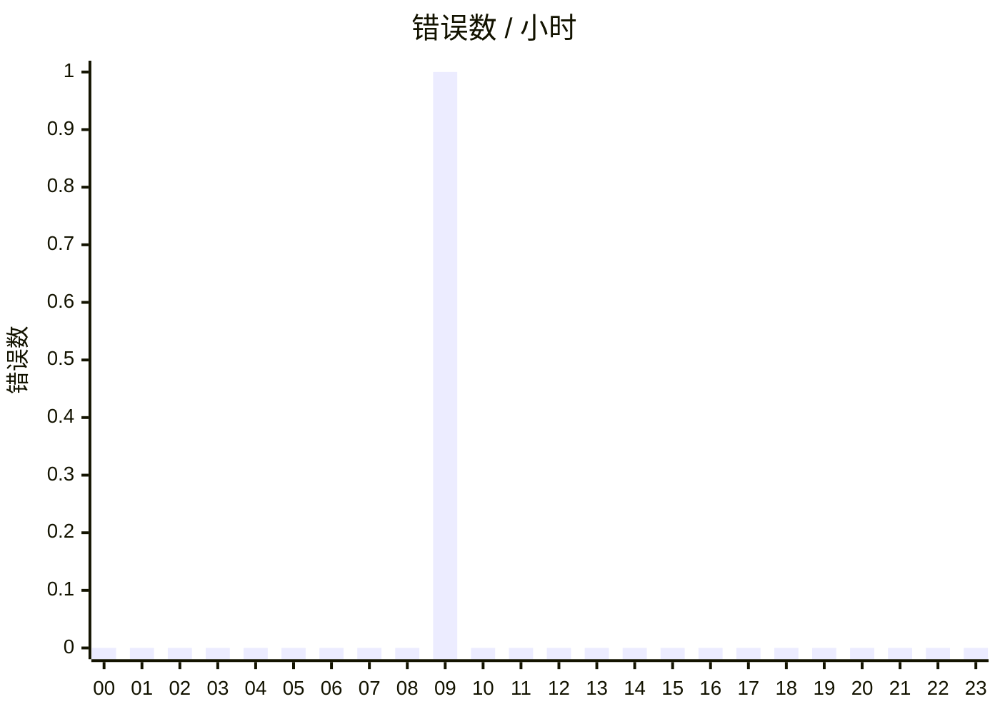
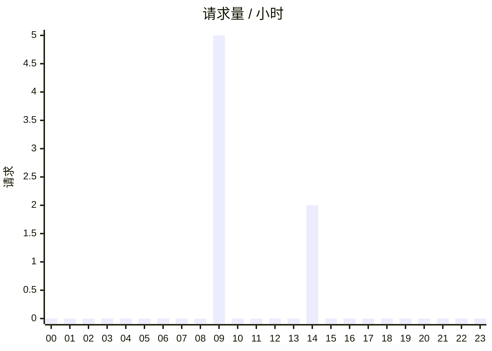
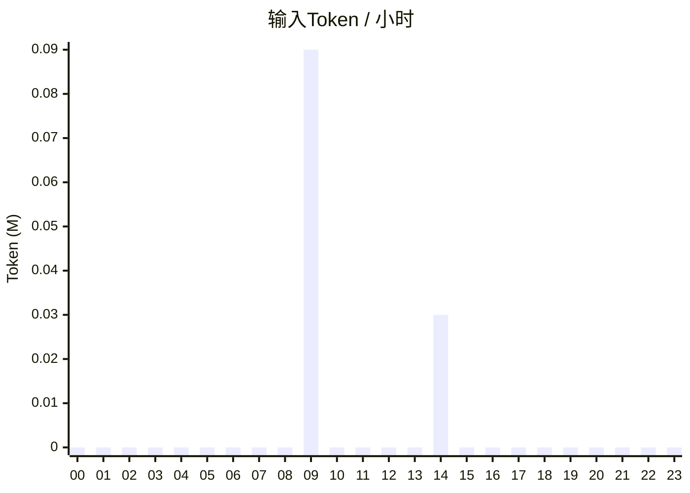
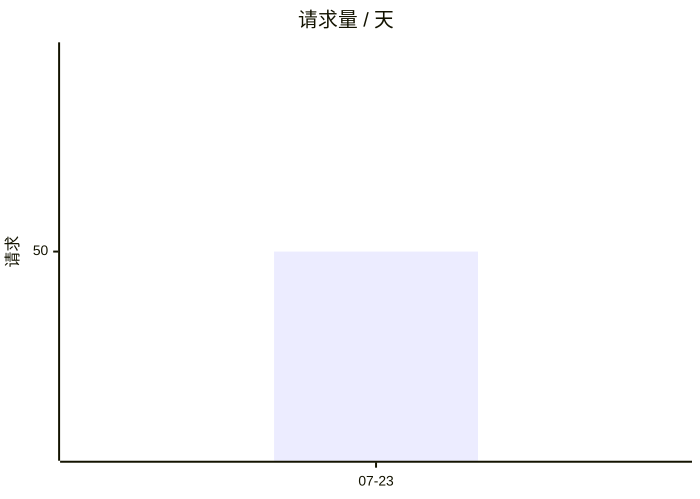
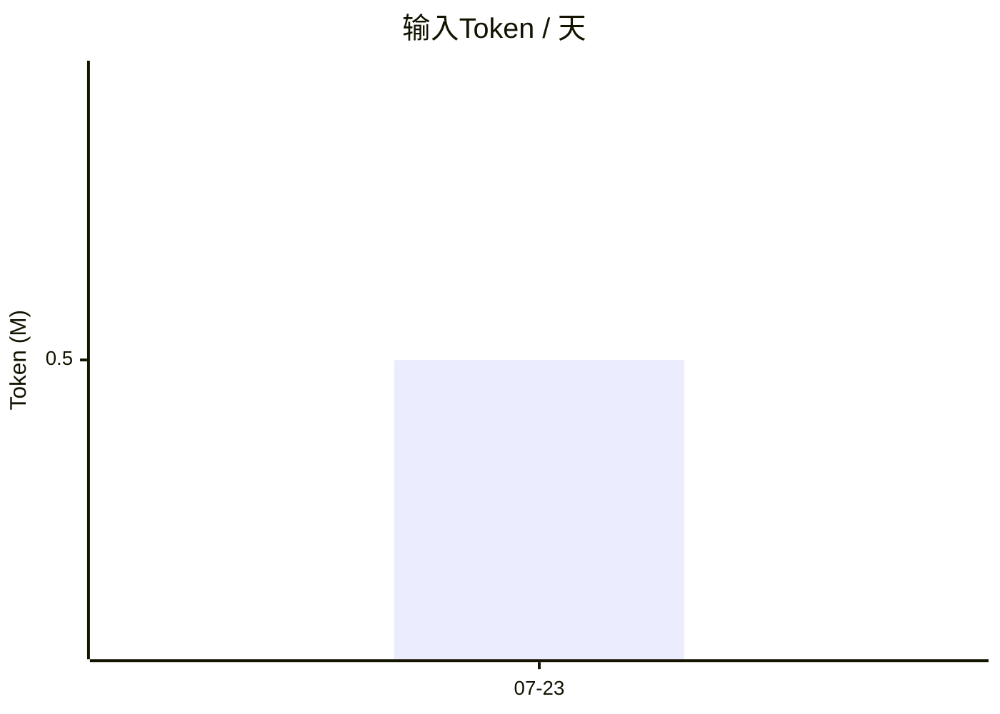

# VMR 用量报告

数据源: 2 个文件 · format 12 · 7 条记录（1 坏行）· 2026-07-22 18:39:00 – 2026-07-24 02:00:00

配置: /etc/vmr/report.yaml

文件清单

a.jsonl, b.jsonl

请求明细数据见 `requests/index.json`；交互式浏览用 `request-browser.html`

任务叙事见 [journeys/index.md](journeys/index.md)（2 个任务索引 · 覆盖 2026-07-23 02:39:00 – 2026-07-24 10:00:00）

## §0 摘要

| 请求 | 成功率 | 计费输入(fresh)⭐ | 缓存效率⭐ | p95 耗时 | 按量计费等价成本⭐ |
|---|---|---|---|---|---|
| 50（fallback 3 / trunc 1） | 90.0% | 150.0K | 72.0% | 9.0s (n=44) | 未定价 |

其中 interactive 工作负载占 10.0%（5/50）
> ⭐ = 衍生/预估指标（非上游直接返回值），完整口径见附录。

**亮点 (auto):**
- ⚠️ **heartbeat 工作负载缓存效率 11.1%** - 80.0K fresh tokens（占该负载输入大头）
- ⚠️ **端点 openai-completions:prov1:gpt-x 错误率 6.7/100**（最差），主因 rate_limit ×2

## §1 成本与 Token 经济

**Token 类别分解**（basis: 45 条带 usage 的记录）

| 类别 | 数量 | 占比 |
|---|---|---|
| 输入-缓存命中 | 350.0K | 70.0% of in |
| 输入-fresh ⭐ | 150.0K | 30.0% of in |
| 输入-cache_write | 0 | - |
| 输出 | 120.0K | - |

> 计费口径：fresh + cache_write(×溢价) + out。缓存命中按各厂免费/极低价计。
> 本章金额是**按量计费等价成本**：这些流量若按 vmr 能解析到的公开价逐 Token 计费要花多少——渠道有自定价时用渠道价，否则用第一方列表价。它不是实付金额——包月/套餐账号的边际成本是 0，经转售商或代理的实际单价也只有你自己知道。它回答的是「这个套餐/代理买得值不值」。价格取自标准价目表（生成于 2026-08-01）与 config.yaml 的账号覆盖（货币 USD），不代表历史请求实际发生时的价格；要用实付价请在对应 provider 的 providers[].pricing.rates 里写明。 详见 §2 成本估算。

**按模型缓存效率** ⭐

| 模型 | 协议 | 请求 | 缓存效率⭐ | fresh | cached | out |
|---|---|---|---|---|---|---|
| coding | openai-completions | 50 | 72.0% | 150.0K | 350.0K | 120.0K |

**请求消息字符、预估Token及占比**

| 角色 | 字符 | 预估Token⭐ | 占比⭐ |
|---|---|---|---|
| tool | 140.0K | 35.0K | 70.0% |
| assistant | 48.0K | 12.0K | 24.0% |
| user | 12.0K | 3.0K | 6.0% |

> 预估Token⭐：上游 usage 不按角色拆分，无法拿到真实值，这里使用估算公式计算；占比按预估Token 计算。
> takeaway: tool 结果占比最大时，上下文优化的首要杠杆是压缩 tool 返回，而非 system prompt。

## §2 按量计费等价成本

> 本章金额是**按量计费等价成本**：这些流量若按 vmr 能解析到的公开价逐 Token 计费要花多少——渠道有自定价时用渠道价，否则用第一方列表价。它不是实付金额——包月/套餐账号的边际成本是 0，经转售商或代理的实际单价也只有你自己知道。它回答的是「这个套餐/代理买得值不值」。价格取自标准价目表（生成于 2026-08-01）与 config.yaml 的账号覆盖（货币 USD），不代表历史请求实际发生时的价格；要用实付价请在对应 provider 的 providers[].pricing.rates 里写明。

**按日估算成本**（USD）

| 日期 | fresh | out | 估算成本 |
|---|---|---|---|
| 2026-07-23 | 150.0K | 120.0K | $3.25 |
| **合计** |  |  | $3.25 |

**按模型估算成本**（USD）

| 模型 | 协议 | fresh | out | 估算成本 |
|---|---|---|---|---|
| coding | openai-completions | 150.0K | 120.0K | $3.25 |
| **合计** |  |  |  | $3.25 |

**按端点估算成本**（USD，跨日合并）

| 端点 | fresh | out | 估算成本 |
|---|---|---|---|
| openai-completions:prov1:gpt-x | 100.0K | 80.0K | $3.25 |
| **合计** |  |  | $3.25 |

> 合计不含 1/2 个端点——没有可归属的已定价流量（上游端点不在定价表内，或其请求未成功送达任何上游端点）。成本未知，不是 0。

**按客户端估算成本**（USD）

| client_key | fresh | out | 估算成本 |
|---|---|---|---|
| claw-a | 100.0K | 100.0K | $3.25 |
| **合计** |  |  | $3.25 |

> 估算成本包含了未嗅探到 usage 的请求（按降级估算定价计入）；而 fresh/out 列仅统计已确认的 Token 数量。若按「估算成本 ÷ Token」反推单价可能偏高。

本次使用的定价来源

标准价目表生成于 2026-08-01；已套用 1 条 provider 费率规则

## §2.5 账户（Provider）消耗与额度

按上游账户（config.yaml 的 providers[].name）上卷的跨模型汇总——回答"这个账户整体消耗多少、可靠性如何"，而不是逐个模型手动相加。

| 账户 | 模型数 | 请求 | 成功率 | fresh/cached/out | 缓存效率 | 均值耗时 | 错误率 | 主要错误类 | $ 估算 (USD) |
|---|---|---|---|---|---|---|---|---|---|
| prov1 | 1 | 28 | 89.3% | 100.0K / 300.0K / 80.0K | 75.0%¹ | 2.5s | 6.7% | rate_limit 2(100.0%) | $3.25 |

### 额度与消耗对照

只列配了 `quota:` 的账户，把两个不同时间窗口的消耗数字并排给出——不做减法、不算覆盖率，各自标注来源。

| 账户 | metric | 本报表窗口消耗¹ | 本周期已用² | 上限 | 已用% | 周期已过% | 周期区间 |
|---|---|---|---|---|---|---|---|
| prov1 | tokens | 123456 | 69450000（20.0% 估算） | 50000000 | 138.9%⭐ | 20.5% | 07-24 ~ 07-29 |

> ¹ 本报表窗口消耗：从本次输入的审计日志重算得到，是**重算值**，不是路由半区当时记账的重放。两种口径的精度不同：**requests 口径无出入**——按 `倍率 × 已转发尝试数` 逐字复现路由半区的记账公式（路由每转发一次上游成功响应记一次账，失败尝试本就不记，倍率精确相乘、不取整）；**tokens 口径**：上游未返回精确 usage 的请求，本列与路由半区一样按字节数估算计入（不再计 0），估算占比见括号内的"X% 估算"标注——两侧公式相同，唯一残留出入是路由半区数的是**上游原始字节**、本列只能数**转发给客户端的字节**，当响应正规化改写过内容（模型名改写、`<think>` 剥离等）时两者会差出这段字节。两种口径共同的出入源：config 里的权重/倍率在本窗口期内被改过。
> ² 本周期已用：来自 `<log_dir>/vmr-quota.json` 的实时计数器，是路由半区的权威记账——与上一列的统计窗口不同，两者不可相减、不可求比值。计数器仍停留在更早周期时显示 `-`。括号内的"X% 估算"标注这段消耗里有多少来自降级估算（上游未返回精确 usage 时的字节数粗估），不是精确记账。
> ⭐ 已用% ≥ 100% 时的标记：该账户本周期已超出配置的额度上限。

## §3 可靠性

**结果分布**

| ok | error | canceled | truncated | fallback(恢复/失败)⭐ |
|---|---|---|---|---|
| 45 | 3 | 1 | 1 | 3 (2/1) |

**端点健康**（跨日合并）

*openai-completions*

| 端点 | 尝试 | 成功 | 可用度 | 错误率⭐ | 首要错误 |
|---|---|---|---|---|---|
| openai-completions:prov1:gpt-x | 30 | 28 | 93.3% | 6.7% | rate_limit ×2 |

*anthropic-messages*

| 端点 | 尝试 | 成功 | 可用度 | 错误率⭐ | 首要错误 |
|---|---|---|---|---|---|
| anthropic-messages:prov2:claude-y | 4 | 4 | 100.0% | 0.0% ⚠️low-n | - |

**错误类别 × 端点**（仅非零）

*openai-completions*

| 端点 | 类别 | 计数 |
|---|---|---|
| openai-completions:prov1:gpt-x | rate_limit | 2(6.7%) |

**Quirk 修复 × 端点**（仅非零，占该端点成功尝试的比例；详见每条请求的详情页）

*anthropic-messages*

| 端点 | 标记 | 计数 |
|---|---|---|
| anthropic-messages:prov2:claude-y | think_strip | 2(50.0%) |

**错误时间线**（错误数 / 小时）

> 错误集中在 09:00（共 1 条）。

## §4 延迟与吞吐

| 模型 | 协议 | ttft p50/p95 (n) | dur p50/p95/max (n) | slow>30s⭐ | tok/s |
|---|---|---|---|---|---|
| coding | openai-completions | 320ms / 950ms (n=44) | 1.5s / 9.0s / 35.0s (n=44) | 2 | 100.5 |

> 全局 p95 dur 9.0s，max 35.0s。按 tok/s 降序排列。
> 若 coding 的慢主要来自长流式输出，而非首字延迟，参见每模型的 ttft vs dur 差值。

**按端点**（跨日合并）

*openai-completions*

| 端点 | ttft p50/p95 (n) | dur p50/p95/max (n) | slow>30s⭐ | tok/s |
|---|---|---|---|---|
| openai-completions:prov1:gpt-x | 300ms / 900ms (n=25) | 1.2s / 8.0s / 31.0s (n=25) | 2 | 55.5 |

*anthropic-messages*

| 端点 | ttft p50/p95 (n) | dur p50/p95/max (n) | slow>30s⭐ | tok/s |
|---|---|---|---|---|
| anthropic-messages:prov2:claude-y | - (n=0) | 2.0s / 3.0s (n=4 ⚠️low-n) | 0 | 40.1 |

## §5 负载分布

**按虚拟模型**

| 模型 | 协议 | 请求 | 成功率 | fresh/cached/out | dur p50/p95 |
|---|---|---|---|---|---|
| coding | openai-completions | 50 | 90.0% | 150.0K / 350.0K / 120.0K | 1.5s/9.0s |

**按工作负载类**

| 类 | 请求 | fresh | 缓存效率⭐ | tool_call_rate | dur p50/p95 |
|---|---|---|---|---|---|
| interactive | 5 | 50.0K | 75.0% | 40.0% | -/- |
| heartbeat | 2 | 80.0K | 11.1% ⚠️ | 0.0% | -/- |

**每小时活跃度**

**按日期活跃度**

+ 逐日活跃度明细表（共 1 天）

| 日期 | 请求 | 成功率 | fresh/cached/out |
|---|---|---|---|
| 2026-07-23 | 50 | 90.0% | 150.0K / 350.0K / 120.0K |

**按客户端** ⭐

| client_key | 请求 | 成功率 | fresh/cached/out(reasoning) | 缓存效率 | dur p50/p95 | In(p50/p95) | Out(p50/p95) |
|---|---|---|---|---|---|---|---|
| claw-a | 7 | 100.0% | 100.0K / 200.0K / 100.0K (0) | 0.0% | -/- | 9.0K/31.0K | 2.0K/9.1K |

**按端点** ⭐（跨日合并）

| 端点 | 请求 | 成功率 | fresh/cached/out(reasoning) | 缓存效率 | dur p50/p95 | In(p50/p95) | Out(p50/p95) |
|---|---|---|---|---|---|---|---|
| openai-completions:prov1:gpt-x | 28 | 89.3% | 100.0K / 300.0K / 80.0K (0) | 75.0%¹ | 1.2s/8.0s | 9.0K/30.0K | 2.0K/9.0K |
| anthropic-messages:prov2:claude-y | 4 | 100.0% | 30.0K / 10.0K / 8.0K (0) | 25.0% | 2.0s/3.0s | 0/0 | 0/0 |

## §5.5 按客户端的上游归属

每个客户端命中了哪些上游端点、各自拿走了多少 token——回答"这个 Agent 的流量到底落到哪几个账户/模型上了"。

**claw-a**

| 端点 | 请求 | fresh | cached | out | 占该客户端 token 的比例 |
|---|---|---|---|---|---|
| openai-completions:prov1:gpt-x | 10 | 50.0K | 150.0K | 30.0K | 100.0% |

## §6 会话与任务

> 会话标识形如 s01 (l-...)：sNN 仅为本次报告内行号别名，括号内 l-<hash8> 为稳定内容寻址 ID。

**claw-a**

| 会话 | 时间范围 | 标题 | 轮 | 任务 | fresh/cached/out | 结果 |
|---|---|---|---|---|---|---|
| s01 (l-a00000000) | 07-22 18:39 → 18:52 | morning routine | 3 | 1 | 10.0K / 30.0K / 10.0K | ok |
| s02 (l-a00000001) | 07-22 18:39 → 18:52 | morning routine | 3 | 1 | 10.0K / 30.0K / 10.0K | ok |
| s03 (l-a00000002) | 07-22 18:39 → 18:52 | morning routine | 3 | 1 | 10.0K / 30.0K / 10.0K | ok |
| s04 (l-a00000003) | 07-22 18:39 → 18:52 | morning routine | 3 | 1 | 10.0K / 30.0K / 10.0K | ok |
| s05 (l-a00000004) | 07-22 18:39 → 18:52 | morning routine | 3 | 1 | 10.0K / 30.0K / 10.0K | ok |
| s06 (l-a00000005) | 07-22 18:39 → 18:52 | morning routine | 3 | 1 | 10.0K / 30.0K / 10.0K | ok |
| s07 (l-a00000006) | 07-22 18:39 → 18:52 | morning routine | 3 | 1 | 10.0K / 30.0K / 10.0K | ok |
| s08 (l-a00000007) | 07-22 18:39 → 18:52 | morning routine | 3 | 1 | 10.0K / 30.0K / 10.0K | ok |
| s09 (l-a00000008) | 07-22 18:39 → 18:52 | morning routine | 3 | 1 | 10.0K / 30.0K / 10.0K | ok |
| s10 (l-a00000009) | 07-22 18:39 → 18:52 | morning routine | 3 | 1 | 10.0K / 30.0K / 10.0K | ok |
| s11 (l-a00000010) | 07-22 18:39 → 18:52 | morning routine | 3 | 1 | 10.0K / 30.0K / 10.0K | ok |
| s12 (l-a00000011) | 07-22 18:39 → 18:52 | morning routine | 3 | 1 | 10.0K / 30.0K / 10.0K | ok |
| s13 (l-a00000012) | 07-22 18:39 → 18:52 | morning routine | 3 | 1 | 10.0K / 30.0K / 10.0K | ok |
| s14 (l-a00000013) | 07-22 18:39 → 18:52 | morning routine | 3 | 1 | 10.0K / 30.0K / 10.0K | ok |
| s15 (l-a00000014) | 07-22 18:39 → 18:52 | morning routine | 3 | 1 | 10.0K / 30.0K / 10.0K | ok |
| s16 (l-a00000015) | 07-22 18:39 → 18:52 | morning routine | 3 | 1 | 10.0K / 30.0K / 10.0K | ok |
| s17 (l-a00000016) | 07-22 18:39 → 18:52 | morning routine | 3 | 1 | 10.0K / 30.0K / 10.0K | ok |
| s18 (l-a00000017) | 07-22 18:39 → 18:52 | morning routine | 3 | 1 | 10.0K / 30.0K / 10.0K | ok |
| s19 (l-a00000018) | 07-22 18:39 → 18:52 | morning routine | 3 | 1 | 10.0K / 30.0K / 10.0K | ok |
| s20 (l-a00000019) | 07-22 18:39 → 18:52 | morning routine | 3 | 1 | 10.0K / 30.0K / 10.0K | ok |

+ 其余 2 个会话（均 ≤ 12 轮）

| 会话 | 时间范围 | 标题 | 轮 | 任务 | fresh/cached/out | 结果 |
|---|---|---|---|---|---|---|
| s21 (l-a00000020) | 07-22 18:39 → 18:52 | morning routine | 3 | 1 | 10.0K / 30.0K / 10.0K | ok |
| s22 (l-a00000021) | 07-22 18:39 → 18:52 | morning routine | 3 | 1 | 10.0K / 30.0K / 10.0K | ok |

**claw-b**

| 会话 | 时间范围 | 标题 | 轮 | 任务 | fresh/cached/out | 结果 |
|---|---|---|---|---|---|---|
| l-d0 | 07-24 01:00 → 01:03 |  | 1 | 1 | 2.0K / 8.0K / 2.0K | ok |
| [s23 (l-d1)](journeys/j-claw-b-1.md) | 07-24 02:00 → 02:02 | follow-up &lt;!-- ok | 1 | 1 | 2.0K / 8.0K / 2.0K | ok |

> l-d1 ← l-d0（单次 compaction）

## §6.5 Sticky 有效性 ⭐

同一会话内，落回**上一条请求所用端点**的请求 vs **换了端点**的请求，两组缓存效率对比。
Sticky Model（设计文档 §6.5）存在的唯一理由是让上游 prompt cache 保温——这一节是它到底有没有兑现的证据。

| 组 | 请求 | 带 usage | 缓存效率⭐ | cached | fresh |
|---|---|---|---|---|---|
| 落回同一端点 | 30 | 28 | 75.0% | 300.0K | 100.0K |
| 换了端点 | 12 | 10 | 25.0%¹ | 30.0K | 90.0K |

> 样本不足（任一组带 usage 的记录 < 20 条），本期不下结论。
>
> 口径：会话首条请求（8 条）没有前一条可比，不计入任何一组；未能归入会话的 2 条同样不计入。
> **不解释切换原因**：sticky_ttl 到期、端点冷却、条件路由淘汰了 sticky 首选、该模型压根没开 sticky——事后无法区分，本节只陈述发生了什么。

## §6.6 端点性价比 ⭐

单位产出的代价，而不只是总花费——一个单价便宜但经常失败的端点，把请求推给下一家之后的真实代价可能更高。

| 端点 | 成功请求 | out tokens | 成本/1M out (USD) | 成本/成功请求 (USD) | 失败尝试 | 可用率 | 失败耗时⭐ |
|---|---|---|---|---|---|---|---|
| openai-completions:prov1:gpt-x | 25 | 80.0K | $40.6250 | $0.1300 | 2 | 93.3% | 5.0s |
| anthropic-messages:prov2:claude-y | 4 | 8.0K | - | - | 0 | 100.0% | - |

> 失败耗时⭐ = 该端点**失败尝试**累计墙钟时间：请求最终由别处完成，这段时间是纯粹的延迟损耗。
> **只记时间、不折算成钱**：失败尝试拿不到 usage（vmr 只从客户端真正收到的那份响应里提取），厂商通常也不对失败请求计费——
> 给它标一个金额会是编造。这里的口径是「它让你多等了多久」，不是「它花了你多少钱」。
> 成本/1M out 用于横向比价（同样产出 100 万 token 谁更便宜）；成本/成功请求受各端点承接的请求形态影响，跨端点比较前先看 §5 的负载画像。

## §6.7 Compaction 还原 ⭐

| 时间 | 压缩会话 | 续接会话 | tokens_in → tokens_out | 保留比 | 吞掉的实体（样例） |
|---|---|---|---|---|---|
| 2026-07-23 02:00:00 | l-abc12345 | l-def67890 | 120.0K → 9.0K | 8.0% | e1, e2, e3 (+1 more) |

> 保留比 = tokens_out / tokens_in；保留比 ≥ 100% 表示输出未缩小（可能为规则识别假阳性或结构化扩展）。

## §7 效率与浪费 ⭐

> **累计发出** 48.0 KB · **其中死重** 24.0 KB (50%) · **≈ 浪费 token** 6.0K · **工具集形态** 1

| 发现 | 指标 | 值 | 涉及 | 建议 |
|---|---|---|---|---|
| 缓存未命中输入 | cache_miss_tokens | 150.0K (30.0%) | 全局，coding 占 150.0K | 检查 prompt 前缀稳定性 / 开启 provider 缓存 |
| 定时任务冗余 | fresh + cache_eff | 80.0K fresh, 缓存效率 11.1% | heartbeat | 拉长间隔 / 换便宜模型 / 缓存前缀 |
| 输出截断 | truncated | 1/50 | stream 中断 | 排查上游超时 / 提高 stream_idle |
| 慢请求 | slow_request_share | ~5% > 30s | 见 §4 stream_ms 归因 | 见 §4 |
| 额度即将耗尽 | provider_quota_used_pct | 138.9%（tokens · ） | prov1 | 检查该账户或模型的路由权重或额度配置 |

**工具形态浪费 Top-5**（按浪费字节降序；完整明细见 macro/context-efficiency.json -> tools[]）

| 形态 | 请求 | 声明 | 已用 | 利用率 | 浪费字节 |
|---|---|---|---|---|---|
| tools:4 | 6 | 4 | 2 | 50.0% | 24.0 KB |

tools:4 · 6 请求 · 声明 4 个 · 实际调用 2 个

**调用过的工具（2 个，按调用次数降序）：**

1. read (5 次)
2. exec (2 次)

**声明但从未调用（2 个，按字母序）：**

1. search
2. write

> 统计窗口 = 本报告的输入日志范围；低频工具（如 cron 触发类）可能不在窗口内，裁剪决策建议基于 ≥1 周日志。

## §8 请求详单

每条请求的机读明细在 `requests/index.json`（含会话/任务标题投影与 journey 交叉链接）；按客户端/模型/端点/耗时/token 筛选、排序、定位单条请求用 `request-browser.html`。

本次运行未生成 `requests/details/*.md`（默认按需生成）。用坐标（`requests/index.json` 的 `req` 字段，形如 `basename:line`）随时取出单条记录：`vmr replay -print -req <坐标>`，例如 `vmr replay -print -req a.jsonl:3`；或加 `-details` 全量生成。

## 附录 数据源与方法论

- 输入: a.jsonl, b.jsonl · format 12 · 7 记录 / 1 坏行
- 时段: 2026-07-22 18:39:00 – 2026-07-24 02:00:00 (本地时区)
- 百分位: nearest-rank
- n 基准: 每个百分位标注 n（= ttft_known / requests_with_dur / stream_known）；n<20 标 ⚠️low-n。
- 比值低置信度: cache_efficiency 等比值指标的分母 / 总请求数 < 90% 时标注脚注 ¹。
- ⭐ 标记: 该列为衍生/预估指标（非上游直接返回值），解读时请结合样本量与口径说明。
- 计费口径: fresh + cache_write(溢价) + out；缓存命中按各厂免费/极低价。
- 慢请求阈值: 30s
- 自指流量: 排除已启用，本次从全部统计中排除 2 条 `vmr analyze -llm-addr` 自身产生的分析请求（`-include-self-traffic` 可关闭）。
